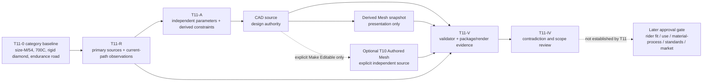
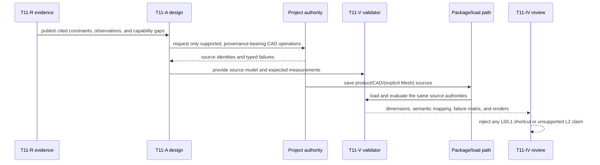

# Professional Bicycle Engineering Reference Assembly

## Purpose and Scope

This document is the design authority for the T11 professional bicycle
reference workflow. It fixes the minimum outcome that a later Agent-generated
artifact must satisfy before it may be presented as an engineering reference:
an inspectable, dimensionally coherent assembly at fidelity level L2
(interface and fit-check reference).

The baseline is one adult size-M/54-equivalent, 700C, rigid, traditional
diamond-frame, endurance-road bicycle. The baseline identifies a product
category and a bounded reference scenario; it is not a production product
specification. T11-0 intentionally does not fix detailed dimensions,
materials, manufacturing processes, component selections, rider fit, or market
claims. Those values require the primary-source research and design decisions
owned by the downstream T11 work items.

Parent: [system design](../../DESIGN.md).

This document has no production-code child. Its downstream design work is
ordered by the task contract:

```text
T11-0  reference contract and gates (this document)
  -> T11-R  primary-source evidence and current-path feasibility
  -> T11-A  parametric assembly design and operation mapping
  -> T11-V  falsifiable acceptance and artifact evidence
  -> T11-IV cumulative task review
```

T11-R evidence record: [EVIDENCE.md](EVIDENCE.md).

T11 is a design and acceptance definition task. It does not create a CAD
source, a Mesh source, a renderer, a CLI/MCP surface, a manufacturing release,
or a certification result.

## Responsibilities and Boundaries

This design owns:

- the professional-reference outcome and its fidelity boundary;
- the product-category baseline used to select research evidence;
- the CAD/Mesh authority rule for the reference workflow;
- the provenance fields required for every adopted parameter or constraint;
- the entry and exit criteria for T11-R, T11-A, T11-V, and T11-IV;
- rejection conditions that prevent a visually plausible but engineering-
  meaningless result from passing.

This design does not own:

- Swift/CAD/Agent implementation or changes to the production command path;
- bicycle manufacturing drawings, weld/joint specifications, tolerances,
  material certification, structural analysis, fatigue analysis, or physical
  testing;
- rider-specific fit, intended use beyond the reference category, target
  market, or regulatory approval;
- a replacement project/session/package authority;
- a renderer or a persistent Mesh authority;
- a shortcut geometry generator that substitutes boxes, flat wheel discs,
  decorative bodies, arbitrary Mesh deformation, or test-only fixtures for
  semantic CAD parts.

The reference assembly has the following authority boundary:

| Concern | Authority | Boundary rule |
|---|---|---|
| Design intent, dimensions, interfaces, and assembly identity | CAD source | Every accepted part and interface resolves to a semantic CAD owner. |
| Default presentation evaluation | CAD-derived Mesh snapshot | The snapshot is disposable evaluation output and cannot be edited as CAD source. |
| Explicit T10 Make Editable result, if a later workflow requests it | Independent Authored Mesh representation | It is a separate source with its own identity; it never silently replaces CAD authority. |
| Persistence and publication | Existing project/package authority | T11 does not introduce a bicycle-specific save or session route. |

## Related Designs

| Design | Relationship | Contract Used | Summary | Cautions |
|---|---|---|---|---|
| [System design](../../DESIGN.md) | parent | Agent-to-project route, CAD/Mesh authority, project publication | Composes the existing project authority and presentation flow. | T11 must not claim behavior that T10 did not verify, and must not add a second authority. |
| [RupaKit package design](../../RupaKit/DESIGN.md) | depends on | Existing package dependency and Agent integration boundaries | Owns the production route that T11-R will observe. | The reference contract does not change package APIs. |
| [CAD/Mesh responsibility contract](../../Rupa/CAD_MESH_RESPONSIBILITY_CONTRACT.md) | depends on | CAD, Authored Mesh, and derived snapshot roles | Defines source-versus-presentation semantics. | A tessellation or display snapshot is never promoted to editable CAD source. |
| [Reference and artifact contract](../../Rupa/REFERENCE_ARTIFACT_CONTRACT.md) | depends on | Identity, provenance, artifact lifetime, and copy rules | Defines stable source/artifact references and evidence binding. | Renders and validation regions remain evidence, not design source. |
| [T11 progress contract](../../RupaKit/PROGRESS.md) | coordinates with | T11 work-item order and completion evidence | Records the only task progress state. | A checked item cannot replace behavioral evidence or designer review. |

## Architecture

The design separates factual evidence, design choices, CAD ownership, and
acceptance evidence. A later implementation can only claim the L2 result after
the production path and persisted artifact both pass the downstream gates.



The arrows from CAD to presentation are derivation edges. They do not permit a
presentation edit to mutate the CAD source. The optional Authored Mesh edge is
an explicit T10 representation transition, not an implicit synchronization
mechanism.

## Contracts and Invariants

### Fidelity contract

The following levels are distinct and must not be conflated in names, reports,
or acceptance messages:

| Level | Meaning | T11 status |
|---|---|---|
| L0 | Bicycle-like silhouette or concept illustration | Insufficient; the former concept fixture cannot pass. |
| L1 | Layout and kinematic envelope with approximate parts | Insufficient for the T11 outcome. |
| L2 | Dimensionally coherent, inspectable parts and interfaces suitable for fit-check review | T11 target. |
| L3 | Manufacturing release with process-specific joints, tolerances, drawings, and material/process evidence | Explicitly outside T11. |
| L4 | Production and regulatory/certification evidence from the applicable market and physical tests | Explicitly outside T11. |

An L2 result may be used to inspect geometry, interfaces, clearances, and
assembly relationships. It may not be described as safe, manufacturable,
certified, production-ready, or rider-fit without the separate evidence and
approvals required for that claim.

### Baseline contract

The design scenario is fixed only at the category level:

- adult size-M/54-equivalent reference envelope;
- 700C wheel family;
- rigid bicycle with no suspension travel;
- traditional diamond frame rather than a monocoque or non-bicycle frame
  topology;
- endurance-road use as the geometry research context.

The term “54-equivalent” is a reference category, not permission to copy a
manufacturer's proprietary model or to treat one chart as a universal fit.
T11-R must record any adopted numeric value as a sourced constraint,
interpretation, baseline choice, or derived value.

### Parameter provenance contract

Every accepted parameter, interface, or range must be traceable through this
record:

| Field | Required meaning |
|---|---|
| Stable parameter ID | Name used by the design, validator, and artifact report. |
| Canonical unit | SI length/angle/mass unit and conversion boundary. |
| Role | Independent input, derived value, interface constraint, or acceptance measurement. |
| Authority kind | Official standard/regulator, manufacturer technical source, observed implementation fact, or T11 design choice. |
| Source locator | Direct URL or implementation file/test path, with document/version or access date. |
| Applicability | Product category, component family, size, and scope for which the value applies. |
| Interpretation | The transformation from source wording/geometry to the parameter. |
| Allowed range/tolerance | Explicit range, or an unresolved state when evidence does not support precision. |
| Derivation | Equation and dependency IDs for values not directly sourced. |
| Acceptance owner | Validator and evidence that will falsify a violation. |

Missing provenance, unsupported precision, conflicting authority, or an
unresolved applicability condition is a design failure. It must remain a typed
unresolved decision, not be filled with a plausible default.

### Engineering-reference invariants

The following conditions are mandatory for any later T11 artifact claim:

1. CAD is the design authority. Every retained body has a semantic ID, a CAD
   owner, and a declared modeled or intentionally omitted detail level.
2. The frame, fork, wheels, cockpit, saddle/seatpost, crankset, pedals, and
   other retained components are modeled as connected semantic parts with
   inspectable interfaces. A silhouette, disconnected decoration, rectangular
   frame bar, or solid wheel disc is not a valid substitute.
3. Independent parameters and derived values are separated. Derived geometry
   is recomputable from named datums and equations; dimensions are not fitted
   by eye from a render.
4. Part identity, parameter provenance, operation sequence, and validation
   result survive the source-to-package-to-load-to-evaluation path.
5. A CAD-derived Mesh snapshot is presentation evidence only. If an Authored
   Mesh is explicitly created, its independent identity and authority are
   preserved and the CAD source remains available; no silent overwrite or
   reverse inference is allowed.
6. Unsupported CAD operations are reported as capability gaps with typed
   failure evidence. They may not be replaced by arbitrary Mesh edits or
   concept-fixture geometry while retaining an L2 success claim.
7. Invalid constraints, missing interfaces, stale/cancelled transactions, and
   save/load integrity failures publish no partial reference result.
8. The result is a reference assembly only. Structural safety, rider fit,
   manufacturing readiness, market suitability, and certification remain
   unproven unless a later scope explicitly supplies their evidence.

### Required approval gate for a manufacturing product

T11 can select a reference category without inventing product decisions. Any
move from L2 reference to a manufacturing-oriented product must explicitly
resolve and approve all of the following:

| Decision | Why it is required | T11-0 state |
|---|---|---|
| Rider fit and size range | Geometry and contact points depend on user population and fit method. | Required later decision; no rider-specific value assumed. |
| Intended use and load envelope | Determines design loads, clearances, and applicable testing. | Required later decision; endurance-road is only the T11 reference context. |
| Material and manufacturing process | Determines tube/joint geometry, heat treatment, tolerances, and release evidence. | Required later decision; no process is implied by the category. |
| Component standards and selected interfaces | Determines compatibility, serviceability, and dimensional constraints. | Required later decision; T11-R/A must cite the applicable technical sources. |
| Target market and regulatory regime | Determines applicable standards, labeling, and certification path. | Required later decision; no market claim is made. |

### Rejection criteria

The following are hard failures, even if a render looks like a bicycle:

- any retained geometry exists only in Mesh or an untraceable fixture;
- a required part has no semantic identity, source owner, or interface;
- a wheel is represented as a solid disc or frame members as generic bars;
- a numeric value lacks source, unit, applicability, or derivation;
- geometry is visually fitted without a reproducible constraint chain;
- an unsupported operation is silently replaced by a primitive or arbitrary
  Mesh deformation;
- CAD authority is overwritten, discarded, or inferred from presentation Mesh;
- package reload changes identities, provenance, selections, or validated
  measurements without an explicit source mutation;
- a report claims manufacturing, safety, rider fit, compliance, or
  certification from L2 evidence alone.

## Runtime Flows

T11-0 defines a design-time flow; it does not add a runtime route. The required
future evidence flow is:



The project actor, revision, transaction, save/load, and publication semantics
remain owned by the existing project designs. The bicycle contract consumes
their public behavior; it does not create parallel state.

## State, Ownership, and Lifecycle

T11-0 itself stores only design contract text and task progress. It owns no
mutable geometry, Mesh buffer, session, package, or renderer resource.

For the later reference workflow:

- the source Product/CAD document owns semantic part identity and design intent
  for the lifetime of the saved source;
- a CAD-derived presentation snapshot is immutable and disposable for one
  evaluation configuration;
- an explicitly baked Authored Mesh, if used through T10, owns independent
  Mesh intent and lifetime, but cannot become an implicit CAD replacement;
- validation reports and renders bind to exact source/evaluation identities and
  are evidence artifacts, not editable source;
- application-owned save/load is the only publication boundary.

No design result becomes durable merely because it rendered successfully.

## Failure, Concurrency, and Constraints

The reference contract requires, but does not implement, the following failure
behavior:

- unsupported modeling operations return a typed capability failure with the
  operation, required capability, and affected part/interface;
- unsatisfied constraints return a typed invalid-design result naming the
  dependency chain and source owner;
- stale revision, cancellation, package corruption, or post-load mismatch
  prevents publication of a partial assembly or acceptance report;
- all concurrent source changes use the existing project actor and revision
  contract; no mutable geometry or Mesh buffer is shared outside its owner;
- copy/allocation and command limits are measured by T11-V from the actual
  route. T11-0 does not guess a performance budget.

The distinction between a design limitation and a runtime failure is explicit:
an operation missing from the current production path is a capability gap, not
an instruction to lower the fidelity level silently.

## Verification and Change Impact

T11-0 entry and exit criteria are:

| Gate | Entry | Exit evidence | Owner |
|---|---|---|---|
| T11-0 | T10 integration is complete and its authority rules are available. | This contract, system child index, old-claim audit, original-designer review, and diff-check. | T11-0 executor + task designer |
| T11-R | T11-0 is approved. | Actual registered path observations, official primary-source matrix, manufacturer interface matrix, and contradiction result. | T11-R |
| T11-A | T11-R confirms or revises the category baseline. | Recomputable parameter graph, semantic hierarchy, operation mapping, and typed capability gaps. | T11-A |
| T11-V | T11-A is complete. | Validator contract, package-load acceptance specification, deterministic-view artifact specification, failure matrix, and measured-budget plan. These are design deliverables, not claims that runtime behavior has already passed. | T11-V |
| T11-IV | T11-R, T11-A, and T11-V are complete. | Cumulative review across the separate design-sprint commits plus a final synchronization commit; no unsupported professional claim remains. | Original task designer |

T11-0 completion does not imply that T11-R, T11-A, T11-V, or any production
implementation is complete. A change to CAD/Mesh authority, project
publication, parameter provenance, fidelity level, or rejection criteria
requires rechecking this document, the system master, and the owning lower-level
design before downstream work proceeds.

The following evidence is required before a later task may claim L2:

- direct-source provenance for every adopted parameter and interface;
- observed production-path behavior for every required construction/edit step;
- source-level semantic identity and operation mapping for every retained part;
- post-save/load validation against the same source authorities;
- deterministic side, front, top, and isometric presentation evidence;
- explicit statement of all unsupported capabilities and all claims that remain
  outside L2.
