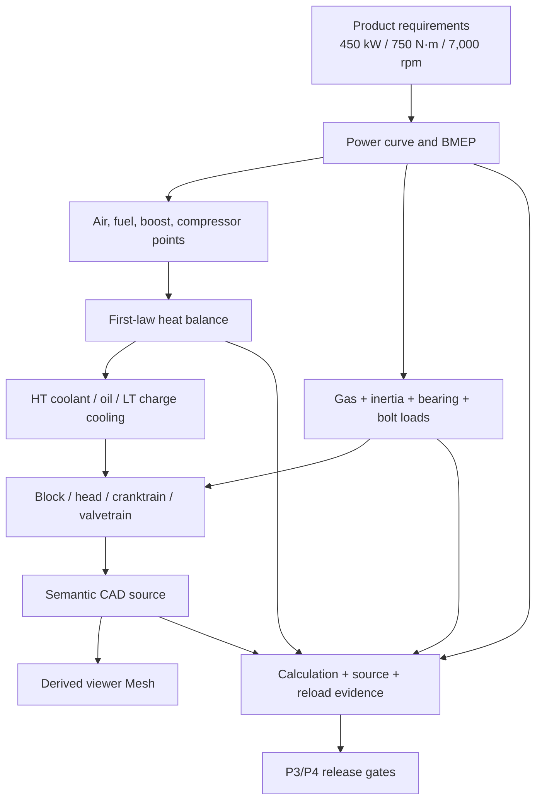
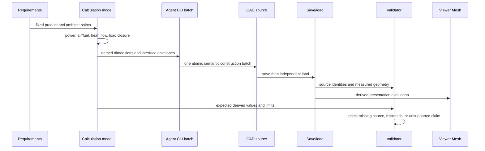

# Professional V8 Engineering Reference

## Purpose and Scope

This document is the design authority for one original 4.0-liter-class,
90-degree, cross-plane, parallel-twin-turbo gasoline V8 intended as a
professional road/track engineering reference. The target is 450 kW net power
at 6,500 rpm, 750 N·m from 3,000 through 5,500 rpm, and a 7,000 rpm limit on
98 RON pump gasoline.

The current task target is level P2: a requirements-driven, recomputable
thermodynamic and first-order mechanical design with semantic CAD suitable for
architecture, package, interface, clearance, and system-load review. It is not
a manufacturing release.

| Level | Meaning | Status |
|---|---|---|
| P0 | Engine-like visual silhouette | Rejected |
| P1 | Kinematic crank/piston demonstrator | Existing `agent-v8-engine`; insufficient |
| P2 | Requirements, power/thermal/load models, subsystem architecture, semantic CAD | Current target |
| P3 | Detailed tolerances, drawings, supplier allowables, FEA/CFD/1D gas exchange/combustion results | Required before design release |
| P4 | Prototype dyno, durability, emissions, vehicle cooling, calibration, DV/PV evidence | Required before production claim |

Parent: [Rupa system design](../../DESIGN.md).

This design has no production-code child. Its artifact children are the
calculation model, generated reports, parameter/provenance records, semantic CAD
package, and acceptance evidence stored in this directory.

## Responsibilities and Boundaries

This design owns:

- the application, fuel, output, torque, speed, life, and ambient requirements;
- the first-law power and heat balance and the cooling-system design loads;
- bore, stroke, rod ratio, compression ratio, combustion-pressure envelope,
  reciprocating load, cranktrain dimensions, and subsystem architecture;
- the part hierarchy, named datums, packaging envelopes, and semantic CAD
  source used for P2 review;
- provenance and derivation for every adopted numerical parameter;
- rejection rules that prevent a visually plausible engine from passing.

This design does not own or claim:

- proprietary dimensions from an existing commercial engine;
- final combustion chamber, port, cam, turbo, catalyst, bearing, seal, fastener,
  casting, or machining release geometry;
- material-lot allowables, fatigue life, FEA, CFD, conjugate heat transfer,
  knock calibration, emissions calibration, lubrication rig, or dyno results;
- functional safety, homologation, warranty, manufacturability, or production
  approval;
- a new Rupa modeling authority, file format, or Agent transport.

The former `Artifacts/agent-v8-engine` artifact is retained only as P1 route and
kinematic evidence. It is not an input authority for P2 dimensions or claims.

## Related Designs

| Design | Relationship | Contract Used | Summary | Cautions |
|---|---|---|---|---|
| [Rupa system](../../DESIGN.md) | parent | CAD authority and system design index | Places this artifact under the existing Agent/CAD project route. | Engine analysis does not change Rupa runtime contracts. |
| [RupaKit package](../../RupaKit/DESIGN.md) | depends on | Public headless Agent automation and file evaluation | Supplies the implemented route used to create and inspect CAD. | Successful CLI execution is not engine-validation evidence by itself. |
| [CAD/Mesh responsibility](../../Rupa/CAD_MESH_RESPONSIBILITY_CONTRACT.md) | depends on | CAD source and derived Mesh roles | Keeps design dimensions in CAD and viewer triangles disposable. | Mesh never becomes engine design authority implicitly. |
| [P1 V8 artifact](../agent-v8-engine/README.md) | replaces as professional claim | Agent route and slider-crank demonstration only | Provides a negative baseline for insufficient professional fidelity. | Its dimensions and primitive count are not inherited. |
| [Primary-source evidence](EVIDENCE.md) | child | Provenance records and applicability | Separates external facts from this design's choices. | An OEM benchmark does not authorize copying its geometry. |

## Architecture

The calculation model is upstream of CAD. CAD dimensions may reference named
calculation outputs; the calculation model never infers engineering truth from
the rendered shape.

### Product target

| ID | Requirement | Value | Acceptance |
|---|---|---:|---|
| REQ-APP-001 | Duty | premium road and 20-minute track sessions | Thermal steady-state point plus road transient envelope |
| REQ-FUEL-001 | Fuel | 98 RON E0/E10-compatible gasoline | Final calibration and regional fuel tests remain P4 |
| REQ-PWR-001 | Net power | 450 kW at 6,500 rpm | SAE J1349 test required at P4 |
| REQ-TRQ-001 | Net torque | 750 N·m at 3,000–5,500 rpm | Calculated curve now; dyno required at P4 |
| REQ-RPM-001 | Speed limit | 7,000 rpm | Overspeed proof requirement 7,350 rpm |
| REQ-LIFE-001 | Road life | 200,000 km target | Duty cycle, bench, and vehicle durability unresolved |
| REQ-AMB-001 | Hot ambient | 40 °C, sea-level design point | Vehicle airflow and altitude derate remain P4 |

### System decomposition

| Subsystem | P2 owner | Required CAD identity | Required analysis |
|---|---|---|---|
| Short block | block, bedplate, crankshaft, 8 rods, 8 pistons, pins, bearings | Separate semantic parts and crank/bank datums | Gas/inertia loads, bearing envelopes, deck and bore spacing |
| Heads | left/right head, covers, cams, valve envelopes, injectors, plugs | Separate banks and service envelopes | Clamp load, valve area, port/thermal placeholders |
| Air path | filters, compressors, charge coolers, throttles, plenums | Flow-direction and connection datums | Mass flow, pressure ratio, compressor outlet temperature |
| Exhaust | manifolds, turbines, wastegates, catalysts | Thermal-clearance envelopes | Exhaust heat, turbine temperature, backpressure target |
| High-temperature cooling | block/head jackets, pump, thermostat, radiator interfaces | Named inlet/outlet and jacket envelopes | Heat rejection, flow, pressure and temperature limits |
| Low-temperature cooling | charge coolers, pump, front heat exchanger interfaces | Independent circuit identity | 33.1 kW continuous load and 38.1 kW installed rejection target |
| Lubrication | six-stage dry sump, galleries, piston jets, cooler interfaces | Scavenge/pressure circuit identities | 46.3 kW continuous load, 53.3 kW installed rejection, and starvation envelope |
| Fuel/ignition | DI+PFI rails, injectors, pumps, coils, plugs | Per-cylinder identities | Peak fuel flow, injection mass, pressure and knock gates |

## Contracts and Invariants

### Core geometry

| ID | Parameter | P2 value |
|---|---|---:|
| GEO-BORE-001 | Bore | 86.0 mm |
| GEO-STROKE-001 | Stroke | 86.0 mm |
| GEO-PITCH-001 | Cylinder pitch | 96.0 mm |
| GEO-ROD-001 | Rod center distance | 150.0 mm |
| GEO-CR-001 | Geometric compression ratio | 9.5:1 |
| GEO-DECK-001 | Crank axis to deck | 224.0 mm |
| GEO-PIN-001 | Piston pin diameter | 22.0 mm provisional |
| GEO-CRANKPIN-001 | Crankpin diameter | 54.0 mm provisional |
| GEO-MAIN-001 | Main journal diameter | 65.0 mm provisional |
| GEO-BANK-001 | Bank angle | 90 degrees |

Displacement, rod ratio, deck closure, mean piston speed, and every piston-pin
position are derived and cannot be hand-edited independently.

### Power and thermal invariants

1. Power and torque satisfy `P = 2πNT / 60` at every curve point.
2. Four-stroke BMEP is `4πT / Vd`; peak target must not exceed 24 bar.
3. Full-power fuel flow derives from brake thermal efficiency and fuel LHV;
   air flow derives from the full-load air/fuel ratio.
4. Compressor pressure ratio includes inlet and charge-path losses; each turbo
   receives one half of the engine mass flow. P2 computes the operating points
   but does not select a turbo. A selected production turbo must remain inside
   its digitized map with surge, choke, speed, and efficiency margin.
5. Fuel energy equals brake output plus exhaust, high-temperature coolant, oil,
   charge-cooling, and unmodeled/ambient terms within numerical tolerance.
6. The high-temperature circuit is sized from heat load, coolant heat capacity,
   and allowed temperature rise; the low-temperature and oil circuits are
   independent budgets.
7. Continuous turbine inlet temperature is limited to 950 °C and transient
   temperature to 1,000 °C. The selected turbine material rating must exceed
   the transient target with explicit margin.

### Calculated P2 thermal screening result

The deterministic authority is [requirements.json](requirements.json); the
equations are implemented in
[calculate_thermodynamics.py](calculate_thermodynamics.py), and the generated
evidence is [analysis-thermal.json](analysis-thermal.json). Values below are
rounded views of that evidence, not independent editable requirements.

| Quantity | P2 result | Gate |
|---|---:|---|
| Displacement | 3.996 L | Derived from 86 mm × 86 mm × 8 |
| Peak BMEP | 23.58 bar | Passes 24 bar screening ceiling |
| Full-power fuel flow | 111.59 kg/h | 450 kW, 34% BTE, 42.7 MJ/kg LHV |
| Full-power air flow | 0.387 kg/s | 12.5:1 full-load mass ratio |
| Full-power manifold pressure | 174.8 kPa absolute | Includes 12 kPa charge-path loss upstream |
| Compressor point per turbo | PR 1.899, 27.53 lb/min corrected | Exact map selection remains open |
| Estimated turbine inlet | 906 °C | Passes 950 °C P2 steady sensible-enthalpy screen |
| HT coolant load / installed capacity | 291.2 / 320.3 kW | 10% installed margin |
| HT coolant minimum flow | 321.1 L/min | Includes 10% flow margin and 15 K rise |
| Oil load / installed capacity | 46.3 / 53.3 kW | 15% installed margin |
| Oil minimum cooler flow | 89.5 L/min | Includes 15% flow margin and 20 K drop |
| LT installed capacity | 38.1 kW | 15% above allocated charge-cooling load |

The temperature result is a first-order steady sensible-enthalpy screen. It
does not replace combustion, gas-exchange, turbine, catalyst, or underhood
thermal simulation. The compressor coordinates are evidence that the required
map points are known; they are not evidence that the provisional G25-550-class
reference has passed a digitized map review.

### Mechanical invariants

1. Mechanical design pressure is 20 MPa; the 18 MPa nominal peak combustion
   case is not used as proof pressure.
2. Gas load uses the actual 86 mm bore area. Reciprocating inertia uses the
   7,000 rpm limit, 43 mm crank radius, 150 mm rod, and explicit reciprocating
   mass assumption.
3. Rod compressive design load combines peak gas and adverse inertia with a
   documented load case; tensile TDC-overlap load is checked independently.
4. Mean piston speed at 7,000 rpm must remain at or below 21 m/s for this P2
   duty target.
5. Five main bearings, four shared crankpins, eight counterweights, a forged
   steel crankshaft, forged steel rods, forged aluminum pistons, a closed-deck
   aluminum block, and an aluminum bedplate are semantic design decisions.
6. Material grades are provisional until supplier-certified temperature-
   dependent allowables and process specifications exist. P2 CAD dimensions
   cannot be labeled safe from generic room-temperature data.
7. Piston oil jets, a six-stage dry sump, an auxiliary oil cooler, separate
   high- and low-temperature coolant circuits, and turbo water cooling are
   required architecture, not optional presentation detail.

### Mechanical P2 input contract

The `mechanical` section of [requirements.json](requirements.json) owns the
provisional dimensions and screening assumptions below. The mechanical
calculator consumes the exact thermal-report hash so stale heat, flow, or fuel
loads cannot be combined with a newer structure.

| Group | P2 inputs | Meaning |
|---|---|---|
| Cranktrain | 150 mm rod, 31 mm compression height, 22 mm wrist pin, 54 mm crankpin, 65 mm mains | Package and first-order load geometry |
| Pressure | 18 MPa nominal peak, 20 MPa design | Nominal and structural screening cases are distinct |
| Inertia | 0.55 kg reciprocating mass per cylinder | Explicit piston/pin/ring/small-end P2 assumption |
| Rod screen | 3.0×10⁻⁹ m⁴ weak-axis second moment, 205 GPa modulus, 150 mm effective length | Euler screen only; not a released I-beam section |
| Head clamp | 10 fasteners per bank at 65 kN preload | Aggregate clamp inventory; local gasket sealing remains FEA/test work |
| Valvetrain | 2×34 mm intake and 2×29 mm exhaust valves per cylinder | Curtain-area and packaging envelope, not a port-flow claim |
| Lubrication | six-stage dry sump and eight piston jets | Required part and interface inventory tied to V8-T oil load |

V8-M must reject deck-height inconsistency, a non-closing thermal dependency,
invalid speed ordering, a gross rod-load/Euler ratio below 1.5, and duplicate or
missing semantic part identities. Passing these screens is not fatigue,
hydrodynamic-bearing, gasket, valvetrain-dynamics, torsional, or durability
approval.

### Calculated P2 mechanical screening result

The generated [analysis-mechanical.json](analysis-mechanical.json) is bound to
the exact requirements and thermal-report hashes. The associated
[semantic-architecture.json](semantic-architecture.json) defines 168 stable
part identities and 19 datums that V8-C must either model as the declared P2
representation or report as missing.

| Quantity | P2 result | Interpretation |
|---|---:|---|
| Rod/stroke ratio | 1.744 | Package geometry, not friction or durability proof |
| Mean piston speed at 7,000 rpm | 20.07 m/s | Passes the 21 m/s P2 screen |
| TDC acceleration at 7,000 rpm | 29,730 m/s² / 3,032 g | Drives explicit reciprocating inertia |
| Design gas force per piston | 116.2 kN | 20 MPa over the 86 mm bore |
| Gross rod compression envelope | 132.5 kN | Unsigned gas plus redline inertia; intentionally conservative |
| Overspeed rod tension envelope | 27.0 kN | 7,350 rpm TDC inertia with 1.5 factor |
| Euler weak-axis load / ratio | 269.8 kN / 2.04 | Ideal-column rejection screen only |
| Wrist-pin projected pressure | 136.9 MPa | Geometry screen; not bushing or oil-film approval |
| Crankpin projected pressure | 119.7 MPa | Per-rod geometry screen; not bearing approval |
| Aggregate head clamp per bank | 650 kN | Inventory ratio 5.59 to one cylinder gas load; not sealing proof |
| Fuel per cylinder cycle / minimum combined capacity | 71.5 / 100.1 mg | DI+PFI capacity interface at 450 kW |

### CAD acceptance invariants

1. Every retained body has a stable semantic part ID, subsystem, material
   intent, calculation dependencies, and modeled/omitted-detail declaration.
2. Bore, stroke, pitch, bank angle, deck height, journal diameters, and
   subsystem interface datums are measured from CAD source after save/load.
3. Cooling, oil, air, fuel, and exhaust passages may be P2 envelopes, but they
   must be explicit named geometry and cannot be implied by color or prose.
4. Unsupported hollow passages or booleans are typed capability gaps. Solid
   cylinders or boxes cannot be called coolant jackets, ports, galleries, or
   combustion chambers merely because they occupy a similar location.
5. The near-side cutaway affects presentation only; it cannot delete semantic
   source identities required by the complete assembly inventory.
6. CAD is source authority. The preview and evaluated Mesh are evidence only.

### Hard rejection conditions

- output or torque is stated without a complete speed/torque relation;
- thermal loads do not close to fuel input or omit a rejection path;
- turbo choice is based only on advertised horsepower rather than map points;
- piston, rod, crank, block, or head dimensions are fitted visually;
- coolant/oil paths are absent while the result is called thermally designed;
- a room-temperature material name is used as fatigue or life proof;
- save/load changes the parameter, part, or interface inventory;
- a render, CLI success, or triangle count is presented as production proof;
- P2 is described as manufactured, safe, homologated, durable, or production-ready.

## Runtime Flows

Calculation failure prevents CAD publication. CAD failure does not change the
calculation source. Viewer failure does not authorize a substitute Mesh.

## State, Ownership, and Lifecycle

- `requirements.json` owns fixed product inputs and unresolved release choices.
- the calculation source owns equations and derived numerical outputs;
- `analysis-report.json` is generated evidence bound to exact input and source
  hashes, not an editable authority;
- the semantic inventory owns part IDs and calculation dependency IDs;
- the native Rupa CAD package owns geometry and part identity;
- preview images and viewer Mesh summaries are disposable evidence;
- validation evidence binds the exact calculation and CAD hashes used.

Changes to a requirement invalidate every derived calculation and dependent CAD
measurement. Changes to calculation equations invalidate the report and every
CAD dependency. Changes to CAD do not silently update requirements or analysis.

## Failure, Concurrency, and Constraints

- invalid, non-finite, dimensionally inconsistent, or non-closing inputs fail
  generation before any success report is written;
- thermal fractions must sum to one and every heat exchanger must have positive
  approach temperature and mass flow;
- map extrapolation beyond published compressor boundaries is unsupported;
- P2 load calculations are static envelopes; unknown fatigue, torsion, bearing,
  knock, and thermal-gradient states remain explicit release blockers;
- CAD generation is one file transaction; partial mutation is not published;
- independent calculation checks and CAD validation may run concurrently after
  immutable sources exist;
- circular tessellation cost is runtime telemetry, not a geometry-quality goal;
- no physical durability, emissions, or safety result can be synthesized from
  a calculation or CAD fixture.

## Verification and Change Impact

| Gate | Required falsifiable evidence |
|---|---|
| V8-0 requirement/provenance | Every adopted external fact has source, applicability, date, and interpretation; every unsourced number is labeled a design choice. |
| V8-T power/thermal | Independent recomputation of displacement, curve identity, BMEP, BSFC/fuel/air, compressor points, temperatures, heat closure, and circuit flows. |
| V8-M mechanical | Independent recomputation of rod ratio, piston speed/acceleration, gas force, load envelopes, deck closure, bearing/bolt interface inventory, and unresolved FEA/CFD gates. |
| V8-C CAD | Semantic part inventory, exact public Agent requests, one atomic publication, post-load measurements, topology/viewer evaluation, and no hidden fixture authority. |
| V8-V integration | Exact hashes, deterministic generated reports, cross-document dependency audit, failure/claim review, commit synchronization, and branch publication. |

A change to power, torque, speed, fuel, ambient, life, duty, bore, stroke, rod,
boost, compression ratio, heat split, material, or subsystem architecture
requires rerunning V8-T and V8-M and rechecking dependent CAD. A change to Rupa
CAD authority, CLI execution, package persistence, or Mesh evaluation requires
rechecking V8-C and the system parent.
