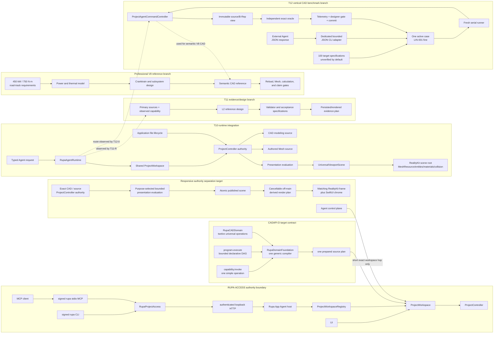
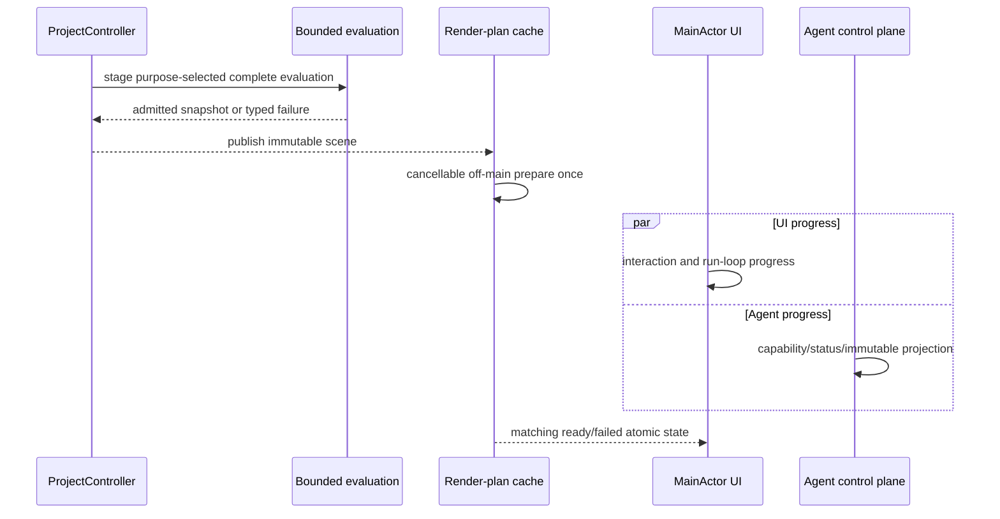
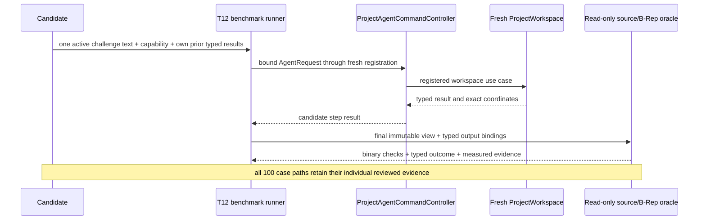

# Rupa System Design

## Purpose and Scope

This is the system design master for the Rupa system. It indexes the shared
RUPA-ACCESS authority boundary, T10 Agent-to-project geometry integration, T11
professional bicycle reference design, T12 Agent CAD basic-geometry
benchmarking, the CADAPI-D public modeling API, and the professional V8
engineering-reference artifact. T10 connects
the already implemented Agent CAD route and T09 Authored Mesh use cases without
adding a second project authority or a modeling-specific transport. T11 defines
a bounded L2 engineering-reference design and evidence contract; it does not
extend the T10 runtime. T12 measures basic CAD realization through that
existing route; its core adds no CAD authority, transport, renderer, or LLM
route. The separately authorized T12 external-Agent adapter adds one bounded native
JSON CLI above the benchmark without changing that project route or adding a
general transport/LLM integration.

RUPA-RESP-D is the target design for correcting the current rainbow-spinner
failure: valid multi-body CAD can generate excessive presentation Mesh, render
preparation and duplicate validation currently execute synchronously from
MainActor-bound UI state, spatial world drawing is split between Canvas and a
surface renderer, and the Agent controller is globally MainActor-isolated.
This phase changes design contracts only; it does not claim the production
implementation or live App has been fixed.

RUPA-RK is the target native viewport cutover layered on that responsiveness
target; it is not current production until RK-2 through RK-5 and RK-IV pass.
Until then, production world rendering is a migration hybrid:
`RealityViewportView` supplies the RealityKit surface and native camera, two
SwiftUI `Canvas` passes still draw the grid/axes and world overlays/previews,
and the legacy identity renderer remains part of picking. The target makes
RealityKit the only world-rendering backend: CAD and Mesh source, evaluation,
history, stable identities, and project publication remain Rupa authority,
while RealityKit owns only the mounted presentation scene, native camera,
materials, spatial resources, collision queries, and frame display.
macOS-27-or-later `RealityView` is the target live host, and
native `ClippingComponent` owns section-plane clipping;
`RealityRenderer` capability probes are offscreen evidence only and do not
prove CAD integration. Existing Metal pipelines, `MTKView`/`CAMetalLayer`,
identity GPU readback, and spatial SwiftUI `Canvas` drawing are migration
targets, not a completed fallback or parallel production backend.

This document has no parent. Its direct children are the
[RupaKit package design](RupaKit/DESIGN.md), which indexes the changed module
designs; the [Rupa application design](Rupa/DESIGN.md), which owns product
composition and application lifecycle; the [professional bicycle reference design](Artifacts/professional-bicycle/DESIGN.md),
which defines the T11 engineering-reference acceptance boundary without adding
production code; and the [professional V8 design](Artifacts/professional-v8-engine/DESIGN.md),
which owns the engine requirement, analysis, CAD, and claim boundary. The T12
exactly-100-case benchmark design is reached through
the RupaKit package design rather than being a direct system child. The T09
Geometry/Core/Project/Mesh contracts remain the verified lower foundation. T10
changes only their application and Agent composition boundary; T11 consumes
that boundary as an observed capability and design-evidence dependency; T12
consumes it as a route and immutable source/B-Rep observation dependency.
CADAPI-D replaces the external raw-feature-graph design with one semantic CAD
operation vocabulary exposed in exactly two forms: a direct one-operation
invocation and a bounded declarative program. It is a target design; current
source remains legacy until the later implementation gates pass.

CADAPI-100 tightens that target acceptance contract. The completed historical
T12 run remains evidence of 95 realized cases and five honestly reported
unavailable sphere cases, but `expectedUnsupported` is not success evidence for
the new API. CADAPI completion requires all 100 unchanged target specifications,
including `SPH-001`...`SPH-005`, to produce genuine source-controlled CAD and
pass their exact source/B-Rep oracles through the signed `rupa` ->
`RupaProjectAccess` -> authenticated loopback HTTP -> Rupa App ->
`ProjectWorkspace` -> `ProjectController` production path.

## Responsibilities and Boundaries

The system owns the cross-module rule that one registered `ProjectWorkspace`
serves CAD automation, Make Editable, Authored Mesh reads and edits, history,
presentation evaluation, and application-owned persistence. UI, CLI, and
MCP adapters submit typed intent through the project-access boundary; the
workspace and its `ProjectController` remain the only Product/CAD/Mesh
mutation, evaluation, and save authority.

The system also owns the separation between exact CAD/source authority,
purpose-selected bounded presentation evaluation, postpublication derived
render data, one coherent RealityKit scene/frame publication, MainActor UI
composition, and Agent control-plane orchestration.
Crossing one boundary never transfers another boundary's authority.
The system also owns the RealityKit frame-consistency rule: world geometry,
grid/axes, curves/sketches, selection, measurement/rulers, section/analysis,
snap/reference guides, previews, and editing gizmos are spatial children of
one scene root. A displayed or hit-testable frame is valid only when its
`snapshotID`, mounted viewport revision, overlay revision, camera state, and
prepared resource/entity graph agree. SwiftUI retains only non-spatial chrome,
errors/status, menus, inspector/toolbars, and screen-only marquee selection.

For CAD source mutation, the system additionally owns one-vocabulary/two-form
composition: `capability.invoke` makes a simple operation simple, while
`program.execute` composes those exact operations into one bounded atomic DAG.
Neither form transfers persistent-ID, presentation-graph, feature-graph,
package, or publication authority to the caller.

It does not add a second project server, general-purpose raw CLI command, bicycle-specific
command, new Mesh kernel operation, renderer, Agent file-lifecycle authority,
benchmark-specific CAD command, or LLM integration. The dedicated
`rupa-agent-cad-benchmark` executable only exchanges one activated case through
versioned bounded JSON; it is not a new modeling or project authority. T10's
bicycle workflow is a capability
fixture composed from existing CAD automation commands. The T11 child is a
separate evidence/design branch and does not change this runtime boundary. T12
is a benchmark composition above the registered Agent route. Its runner may
mutate only fresh isolated project authorities through
`ProjectAgentCommandController`; its oracle alone is read-only and may inspect
the final immutable source/B-Rep snapshot.

## Related Designs

| Design | Relationship | Contract Used | Summary | Cautions |
|---|---|---|---|---|
| [RupaKit package](RupaKit/DESIGN.md) | child | T10/T12 dependency and verification composition | Indexes Project, RupaKit, AgentProtocol, AgentRuntime, benchmark, JSON-adapter, and dedicated-CLI ownership. | Details remain in the owning module. |
| [Rupa application](Rupa/DESIGN.md) | child | product composition and UI lifecycle | Composes the App-owned workspace/controller and internal live transport. | Scene lifecycle never becomes project authority. |
| [CAD/Mesh responsibility](Rupa/CAD_MESH_RESPONSIBILITY_CONTRACT.md) | depends on | CAD modeling and Authored Mesh presentation authority | Defines retained representation meaning. | A derived evaluation snapshot is never persisted source. |
| [State/project contract](Rupa/STATE_AND_PROJECT_CONTRACT.md) | depends on | exact coordinates, staging, history, rollback, save ownership | Defines the sole project publication lifecycle. | Agent mutations never bypass `ProjectController`. |
| [Current task progress](RupaKit/PROGRESS.md) | coordinates with | work order and evidence ownership | Tracks the cumulative T10/T11/T12 and professional-V8 design, implementation, and integration proof. | A design checkbox is not behavior evidence. |
| [Professional bicycle reference](Artifacts/professional-bicycle/DESIGN.md) | child | T11 L2 fidelity, provenance, CAD authority, and rejection contract | Defines the bounded engineering-reference outcome for a later Agent-generated bicycle assembly. | It is a design/acceptance contract; it does not claim manufacturing, safety, certification, or production implementation. |
| [Professional V8 reference](Artifacts/professional-v8-engine/DESIGN.md) | child | Engine requirement, thermodynamic/mechanical analysis, semantic CAD, and release-claim boundary | Defines one 4.0 L twin-turbo road/track engineering reference and the evidence required before its CAD can be accepted. | Calculation and CAD evidence do not replace FEA, CFD, combustion development, dyno durability, emissions, or production validation. |
| [RupaDomainFoundation](RupaKit/Sources/RupaDomainFoundation/DESIGN.md) | descendant | generic operation/value/reference/program compiler contract | Defines the single semantic operation model shared by both forms. | It owns neither concrete CAD vocabulary nor project publication. |
| [RupaCADDomain](RupaKit/Sources/RupaCADDomain/DESIGN.md) | descendant | concrete versioned CAD descriptor/lowerer contract | Supplies the twelve universal CAD operations used by both forms and all 100 exact benchmark realizations. | It owns neither caller IDs nor project/publication/transport authority. |
| [RupaAutomation](RupaKit/Sources/RupaAutomation/DESIGN.md) | descendant | binding-aware prepared source execution | Keeps raw feature-graph transactions as an internal lowering substrate. | Its current externally reachable raw commands are an implementation gap. |
| [RupaEvaluation](RupaKit/Sources/RupaEvaluation/DESIGN.md) | descendant | Purpose selection and provider-neutral cumulative limits | Produces one complete bounded immutable evaluation. | It neither chooses product fidelity nor publishes project state. |
| [RupaRendering](RupaKit/Sources/RupaRendering/DESIGN.md) | descendant | Cancellable snapshot-matched derived plan | Prepares bounded display data outside MainActor. | It cannot mutate source, evaluation, or publication. |
| [RupaAgentRuntime](RupaKit/Sources/RupaAgentRuntime/DESIGN.md) | descendant | Non-MainActor control plane and narrow workspace access | Keeps status/capability/read progress independent from rendering. | It cannot call CAD, Mesh, renderer, package writer, or persistence directly. |

## Architecture



## Contracts and Invariants

1. Public Agent CAD source mutation uses one versioned semantic operation
   vocabulary in exactly two forms. `capability.invoke` performs one operation
   without a program wrapper or local reference. `program.execute` composes the
   same descriptors and lowerers as a bounded declarative DAG with typed local
   references. T10 introduces no bicycle-specific command.
2. Make Editable explicitly evaluates the selected CAD modeling representation,
   commits a new independent Authored Mesh representation, retains CAD and its
   modeling selection, and may switch only presentation selection. This is the
   general representation transition; it does not require a bicycle-specific
   body count or an all-body conversion.
3. Catalog, page, neighborhood, edit preview, and edit commit reuse the T09
   bounded use cases. AgentRuntime supplies the exact current full
   `ProjectViewSnapshot`; transport values do not become authority.
4. AgentProtocol reuses Codable RupaKit Mesh values through a one-way,
   cycle-free dependency. Results containing an in-process view are projected
   to AgentProtocol-owned DTOs rather than serializing the view.
5. Stale coordinates, cancellation, invalid limits/plans, and prepublication
   failures are typed and publish nothing. A postpublication projection failure
   returns the exact committed coordinate and must-not-retry disposition.
6. A caller may send an explicit save intent through the application router,
   but application coordination, `ProjectWorkspace`, and `ProjectController`
   retain save authority. Modeling success never implies save. CAD program
   nodes cannot open, close, save, export, edit package bytes, or select an
   alternate access route.
7. Project-access adapters submit intent and exact live session coordinates
   only. They never edit package entries, instantiate a shadow
   `EditorSession` or controller, publish a second project state, or fall back
   to closed-file mutation. `finish` releases only access resources; explicit
   save remains an App-owned workspace/controller operation.
8. Authored Mesh presentation evaluation shares immutable source buffers. A
   necessary Mesh edit copy is attributed at the T09 execution boundary.
9. T12 benchmark cases use fresh `ProjectController`/`ProjectWorkspace`
   authorities and route every candidate mutation/read through the registered
   `ProjectAgentCommandController`. Candidate/reference code may construct
   only immutable public payload values required by `AgentRequest` or
   `AutomationCommand` (for example `Sketch`, `SketchEntity`, or
   `SketchConstraint`) and may pass them solely through that controller route;
   it may not mutate `EditorSession`, `DesignDocument`, or
   `CADDocumentStore`, evaluate the CAD kernel, construct B-Rep, or bypass the
   route with direct swift-CAD or Mesh operations.
   This retained benchmark-fixture allowance is historical T12 evidence and is
   not a CADAPI-D public request contract.
10. T12 candidate-visible challenge values and typed prior results are separate
   from oracle-private expected source/B-Rep geometry. The T12 oracle uses
   immutable source and exact B-Rep observations, never renderer Mesh output or
   candidate assertions.
11. T12 has exactly 100 stable case IDs and fixed category denominators. The
    historical baseline reports realization and expected-unsupported capability
    decisions separately. CADAPI-100 preserves the same IDs, target geometry,
    tolerances, and exact oracles but accepts only 100 realized outcomes;
    unsupported, skipped, synthetic Mesh, or bounds-only substitutes fail the
    new API acceptance gate.
12. T12 keeps a versioned capability-availability baseline/digest separate from
    the evidence-derived execution-regression baseline/digest. The latter is
    established only by a complete valid production run and is never implicitly
    updated; exact
    environment/catalog/capability drift is explicit, and infrastructure or
    oracle failure never becomes a canonical case failure.
13. The 100 IDs retain individual production-route, authority/rollback, exact
    oracle, tolerance/plane, timeout/resource, candidate-separation, review, and
    commit evidence; catalog presence alone is not an implementation claim.
14. Case activation and category gates used concurrency one. The completed
    post-100 integration adds measured bounded scheduling, immutable baselines,
    fixed-denominator scoring, and a canonical report without replacing the
    individual evidence.
15. The external-Agent JSON adapter accepts the complete 100 gate-reviewed IDs.
    It fingerprints only the
    candidate-visible context, passes the decoded decision through the same
    benchmark executor/controller/oracle path at concurrency 1, and cannot
    expose private expectations, activate later cases, retry a publication, or
    become source authority.
16. Agent callers own semantic intent, argument values, references to existing
    source, and request-local symbols only. Rupa allocates persistent Feature,
    Scene, Component, Instance, and Pattern identities and owns dependency
    order, presentation structure/defaults, validation, and lowering. A staged
    body result is a source body-output role keyed by its generated Feature;
    evaluated topology `BodyID` exists only after successful publication.
17. A CAD program is finite, source-only, and acyclic. It permits typed
    parameters, bounded pure expressions, reuse, transforms, booleans,
    sweeps/lofts, instances, and native finite patterns. It permits no arbitrary
    code, I/O, callback, recursion, conditional, user-defined loop, read,
    workspace, artifact, export, lifecycle, external-job, or Mesh-edit effect.
18. Direct and program forms validate through the same semantic compiler. One
    accepted program becomes at most one staged source transaction, exact
    evaluation, undo entry, and publication through
    `ProjectWorkspace -> ProjectController`. Prepublication failure changes
    nothing; a postpublication projection failure returns exact committed
    coordinates and `mustNotRetry`.
19. Raw `AutomationCommand`, `FeatureNode`, `FeaturePresentation`,
    `FeatureGraphTransaction`, and caller-minted persistent IDs are not target
    Agent API values. The current `appendFeatureGraph` catalog/protocol route is
    legacy implementation inventory and must be removed or rejected before
    CADAPI-D can be called implemented.
20. Exact B-rep/source topology and modeling tolerance remain authoritative.
    Presentation Mesh fidelity is selected by RupaKit product composition;
    Swift-CAD owns only generic checked tessellation limits and RupaEvaluation
    owns cumulative provider-neutral admission. Limit, overflow, cancellation,
    or malformed-result failure publishes no partial evaluation.
21. RealityKit scene preparation begins only after project publication and is a
    cancellable derived read. It may retain bounded transformed positions,
    indices, source-face provenance, native `MeshResource`/collision resources,
    spatial overlay descriptors, and entity metadata, but owns no source,
    project, representation-selection, or rollback authority.
22. Only one matching RealityKit frame may be displayed or hit-tested. Its
    `snapshotID`, mounted viewport revision, overlay revision, camera state, and
    prepared scene root are published atomically from the viewport's point of
    view. Preparation validates and transforms once off-main where the native
    API permits; RealityKit resource/entity updates are bounded MainActor work
    and never perform duplicate full traversal. No spatial world geometry is
    drawn through SwiftUI `Canvas` or a second renderer.
23. Agent capability/status, lease, semantic compilation, immutable projection,
    and encoding run on a control plane independent of rendering. Runtime uses
    only the existing registered workspace/application ports for exact reads,
    mutation, and explicit save, preserving the five-part coordinate,
    cancellation, deadline, and no-retry contracts.

T10's bicycle workflow is a capability fixture for the Agent route, authority
transition, application-owned save/load, and renderer traversal. Its
every-generated-body Make Editable loop is fixture-local. It proves neither
L2 dimensional coherence nor semantic bicycle parts, interfaces, manufacturing
readiness, structural safety, or certification. Those claims belong to the
separate T11 evidence/design branch and require its own acceptance contract.

## Runtime Flows

```mermaid
sequenceDiagram
    participant A as Agent request
    participant H as ApplicationAgentRequestRouter
    participant R as AgentRuntime
    participant F as RupaDomainFoundation compiler
    participant C as ApplicationProjectCoordinator
    participant W as ProjectWorkspace
    participant P as ProjectController
    participant V as RealityKit viewport host
    A->>H: capability.invoke or program.execute
    H->>R: dispatch semantic CAD intent
    R->>F: original semantic form + exact planning view
    F->>F: one registry/compiler; normalize, validate, lower
    F-->>R: one prepared source plan
    R->>W: one prepared source-plan action with exact view
    W->>P: at most one atomic CAD source transaction
    Note over A,P: T10 fixture may repeat Make Editable per fixture body; this is not a system-wide requirement
    A->>H: catalog/page/neighborhood/edit preview/commit
    H->>R: dispatch bounded Mesh intent
    R->>W: existing bounded T09 Mesh use cases
    W->>P: at most one Mesh source transaction
    Note over A,P: mutation does not imply persistence
    A->>H: separate explicit save intent when requested
    H->>C: route lifecycle intent outside AgentRuntime
    C->>W: application-coordinated save
    W->>P: atomic package save
    P->>V: presentation evaluation -> immutable scene -> RealityKit frame
    V-->>V: deterministic acceptance PNG
```

Responsive presentation and Agent progress compose without shared authority:



T12 composes a separate bounded flow over the Agent route:



The separately authorized external process composes above `Candidate`: the
dedicated CLI emits a versioned request containing the same public context,
validates one bounded versioned response against its case and context
fingerprint, and supplies that decision through `CADCandidateProtocol`. The
runner, production controller, immutable oracle, and cleanup flow are unchanged.

## State, Ownership, and Lifecycle

`ProjectController` owns Product, CAD, Authored Mesh, package, evaluation,
history, and publication sequence. `ProjectWorkspace` owns the observable exact
view. AgentProtocol owns only Codable messages; AgentRuntime owns only request
routing and registration leases. The acceptance PNG is generated test evidence
from loaded presentation triangles and is not source or package authority. T12
owns the benchmark target-specification catalog, per-case activation evidence,
capability-availability and execution-regression baseline evidence,
candidate-response, oracle-result, and report values plus one isolated case
runner at a time; it owns no project or CAD source state.
The JSON adapter owns only immutable envelopes, bounded process buffers, and a
single invocation; it retains no project or benchmark-private state.
CADAPI-D parameters, node symbols, local references, compilation graph, and
prepared-plan bindings are invocation-local. Persistent source identities begin
only inside staged project authority and are returned through a typed committed
receipt; a dry run never returns persistent identity claims.
Presentation evaluation budgets are invocation-local and become one immutable
published snapshot only on success. The viewport owns one derived task and one
matching bounded RealityKit scene/resource graph; Agent Runtime owns only control-plane configuration,
registration leases, and request-local immutable values. None is an additional
project view or source owner.

## Failure, Concurrency, and Constraints

Project actor isolation and registration operation leases remain the ordering
boundaries. Heavy bounded reads and geometry work use immutable snapshots
outside the actor and revalidate before return/publication. No retry is allowed
after a source mutation has published. Existing read/plan hard ceilings remain
the maximum accepted through Agent decoding. T12 adds per-case planning/route/
oracle/total-wall timing and action/command/read/entity bounds selected from
measured serial reference runs; it does not guess success counts or concurrency
speedup. Activation remains at concurrency 1 until all 100 gates pass.
Historical MainActor/project-actor serialization is recorded as an observed
constraint, not the target isolation contract. RealityKit scene preparation and
Agent control-plane work must be independent; exact workspace UI publication and
project-actor ordering remain intact. A capability or
environment mismatch is an explicit baseline drift; an oracle or infrastructure
failure invalidates the run without updating the execution-regression baseline.
The external adapter executes one activated case per process, reads at most one
65,536-byte response, and uses no network, background scheduler, or fallback
reference candidate.
Resource ownership follows the processing boundary. Transport bounds HTTP
frames/bodies; AgentProtocol bounds encoded DTO bytes and strict codec shape;
the CAD semantic compiler bounds decoded values/nesting, nodes, edges,
parameters, output references, expression depth/work, lowered commands, and
declared or expanded source work before mutation; Automation/RupaKit recheck
actual staged work; RupaKit/Project validate exact coordinates and own
evaluation/publication. Concrete defaults must be selected from measured
implementation fixtures rather than guessed or relaxed to make a request pass.
Unknown operation/version, invalid type/unit/reference, duplicate or missing
symbol, cycle, ineligible route/effect, limit, stale coordinate, cancellation,
lowering, source, evaluation, projection, and dispatch-uncertain failures remain
typed at their respective owners and never select raw graph or file fallback.
RealityKit native `MeshResource`/`LowLevelMesh`, camera components, materials,
projection/ray/hit-test queries, and collision resources are the production
viewport primitives. A custom Metal pipeline, drawable/command encoder,
synchronous GPU readback, or spatial Canvas texture path is a typed design
violation, not a performance fallback.

## Verification and Change Impact

| Invariant | Behavioral evidence |
|---|---|
| Wire contract | Agent request/response codec and fixture tests for all typed Mesh and Make Editable routes, malformed limits/plans, and no fallback decoder. |
| Make Editable authority | Project/RupaKit tests for exact snapshot, CAD/modeling retention, presentation switch, provenance, zero-copy handoff, stale/cancel rollback, and one history entry. |
| Agent routing | Runtime tests proving each request reaches the registered workspace use case and preserves typed stale/cancel/no-retry failures. |
| Presentation limits | Swift-CAD/RupaEvaluation/RupaKit tests prove checked budget-before-allocation, purpose selection, exact-B-rep preservation, aggregate provider limits, cancellation, and no partial publication. |
| Derived rendering | Rendering/UI tests prove one off-main preparation/validation pass, stale cancellation, retained resource/entity bounds, one matching RealityKit scene/frame for render and hit-test, native camera/material/collision behavior, and MainActor progress. |
| Agent liveness and authority | Runtime/AgentUI/App tests prove capability/status and immutable reads progress during render preparation, while mutation/save still use the registered workspace/controller and no direct CAD/Mesh/render/package/persistence dependency exists. |
| Actual responsiveness | The signed Rupa App multi-body run proves visible matching geometry, interactive UI/run loop, bounded memory, live API response, exact source coordinates, and no fallback. |
| CADAPI-D simple form | Later codec/runtime/actual-CLI evidence must prove one primitive is one `capability.invoke`, with no program wrapper, caller UUID, or presentation payload. |
| CADAPI-D complex form | Later compiler and production-route evidence must prove a repeated multi-part assembly uses typed local bindings and native patterns, stays proportional to distinct intent, and publishes as one transaction/evaluation/undo/publication. |
| Shared vocabulary and cutover | Equivalent direct and one-node-program requests use the same descriptor/lowerer; catalog, protocol, codec, runtime, and CLI reject raw feature graphs and public Automation mutation payloads. |
| CADAPI-D failure and bounds | Wrong type/unit/reference, duplicate/missing symbol, cycle, non-source effect, expansion/byte/work limits, stale/cancel/evaluation failure, rollback, committed no-retry, and dispatch uncertainty are exercised on the real workspace/controller route. |
| T10 capability fixture | Agent CAD route, representation transition, application-owned save/load, renderer triangle traversal, and deterministic presentation output are exercised through the existing path. The fixture is not evidence of T11 L2 dimensional coherence, semantic bicycle parts, interfaces, manufacturing readiness, structural safety, or certification. |
| T12 benchmark contract | `RupaAgentCADBenchmark` preserves all 100 target identities and exact oracles. Its historical 95-realized/5-unsupported report remains provenance only; CADAPI-100 must produce a new 100-realized report through the semantic API and actual signed App/CLI route. A reference-plan result is control-path evidence, not LLM reasoning evidence. |
| T12 external candidate adapter | Golden JSON, bounded decode, fingerprint mismatch, inactive-case, process exit, privacy scan, and actual line/rectangle process tests prove that an external response reaches the same activated executor and exact oracle without exposing private expectations. |
| Professional V8 reference | Recomputed power/thermal/mechanical invariants, cited provenance, semantic CAD inventory, save/load validation, viewer evaluation, and explicit unresolved production gates prove only the bounded engineering-reference claim. |
| Portability | Focused Native runtime tests and compile/link evidence only for portable targets supported by their dependency graph; unavailable target entry failures are reported, not treated as success. |

Changes to Agent wire values, project authority, representation selection, file
lifecycle, renderer input, capability descriptors, topology/sketch read
services, or publication coordinates require rechecking the owning child design
and this system composition. T12 does not make the existing concept bicycle
fixture or any screenshot a CAD benchmark oracle.
