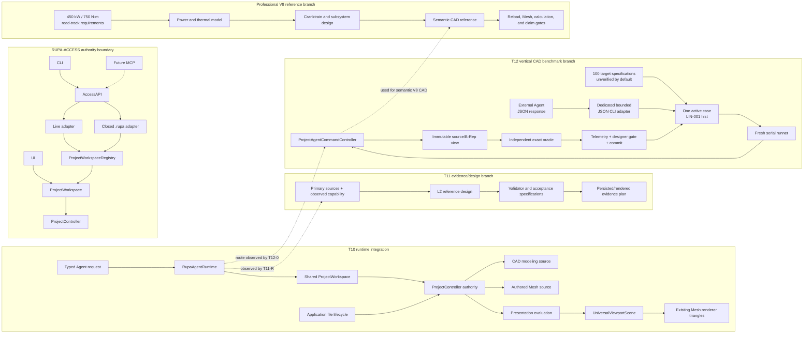
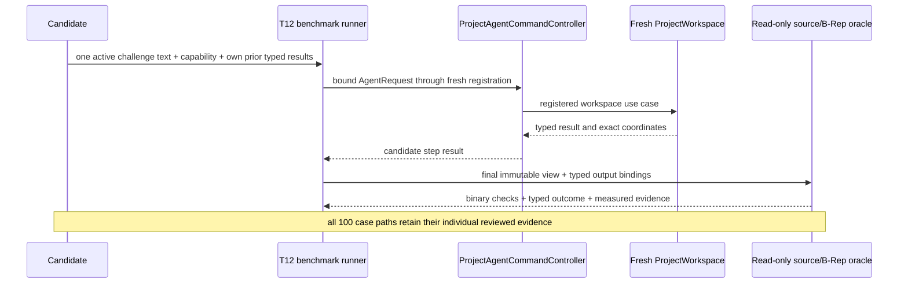

# Rupa System Design

## Purpose and Scope

This is the system design master for the Rupa system. It indexes the shared
RUPA-ACCESS authority boundary, T10 Agent-to-project geometry integration, T11
professional bicycle reference design, T12 Agent CAD basic-geometry
benchmarking, and the professional V8 engineering-reference artifact. T10 connects
the already implemented Agent CAD route and T09 Authored Mesh use cases without
adding a second project authority or a modeling-specific transport. T11 defines
a bounded L2 engineering-reference design and evidence contract; it does not
extend the T10 runtime. T12 measures basic CAD realization through that
existing route; its core adds no CAD authority, transport, renderer, or LLM
route. The separately authorized T12 external-Agent adapter adds one bounded native
JSON CLI above the benchmark without changing that project route or adding a
general transport/LLM integration.

This document has no parent. Its direct children are the
[RupaKit package design](RupaKit/DESIGN.md), which indexes the changed module
designs; the [Rupa application design](Rupa/DESIGN.md), which owns product
composition and application lifecycle; the [professional bicycle reference design](Artifacts/professional-bicycle/DESIGN.md),
which defines the T11 engineering-reference acceptance boundary without adding
production code; and the [professional V8 design](Artifacts/professional-v8-engine/DESIGN.md),
which owns the engine requirement, analysis, CAD, and claim boundary. The T12
exactly-100-case benchmark design is reached through
the RupaKit package design rather than being a direct system child. The T09
Geometry/Core/Project/Mesh contracts remain the verified lower foundation. T10
changes only their application and Agent composition boundary; T11 consumes
that boundary as an observed capability and design-evidence dependency; T12
consumes it as a route and immutable source/B-Rep observation dependency.

## Responsibilities and Boundaries

The system owns the cross-module rule that one registered `ProjectWorkspace`
serves CAD automation, Make Editable, Authored Mesh reads and edits, history,
presentation evaluation, and application-owned persistence. UI, CLI, and
future adapters submit typed intent through the project-access boundary; the
workspace and its `ProjectController` remain the only Product/CAD/Mesh
mutation, evaluation, and save authority.

It does not add an MCP server, general-purpose CLI command, bicycle-specific
command, new Mesh kernel operation, renderer, Agent file-lifecycle authority,
benchmark-specific CAD command, or LLM integration. The dedicated
`rupa-agent-cad-benchmark` executable only exchanges one activated case through
versioned bounded JSON; it is not a new modeling or project authority. T10's
bicycle workflow is a capability
fixture composed from existing CAD automation commands. The T11 child is a
separate evidence/design branch and does not change this runtime boundary. T12
is a benchmark composition above the registered Agent route. Its runner may
mutate only fresh isolated project authorities through
`ProjectAgentCommandController`; its oracle alone is read-only and may inspect
the final immutable source/B-Rep snapshot.

## Related Designs

| Design | Relationship | Contract Used | Summary | Cautions |
|---|---|---|---|---|
| [RupaKit package](RupaKit/DESIGN.md) | child | T10/T12 dependency and verification composition | Indexes Project, RupaKit, AgentProtocol, AgentRuntime, benchmark, JSON-adapter, and dedicated-CLI ownership. | Details remain in the owning module. |
| [Rupa application](Rupa/DESIGN.md) | child | product composition and UI lifecycle | Composes the App-owned workspace/controller and internal live transport. | Scene lifecycle never becomes project authority. |
| [CAD/Mesh responsibility](Rupa/CAD_MESH_RESPONSIBILITY_CONTRACT.md) | depends on | CAD modeling and Authored Mesh presentation authority | Defines retained representation meaning. | A derived evaluation snapshot is never persisted source. |
| [State/project contract](Rupa/STATE_AND_PROJECT_CONTRACT.md) | depends on | exact coordinates, staging, history, rollback, save ownership | Defines the sole project publication lifecycle. | Agent mutations never bypass `ProjectController`. |
| [Current task progress](RupaKit/PROGRESS.md) | coordinates with | work order and evidence ownership | Tracks the cumulative T10/T11/T12 and professional-V8 design, implementation, and integration proof. | A design checkbox is not behavior evidence. |
| [Professional bicycle reference](Artifacts/professional-bicycle/DESIGN.md) | child | T11 L2 fidelity, provenance, CAD authority, and rejection contract | Defines the bounded engineering-reference outcome for a later Agent-generated bicycle assembly. | It is a design/acceptance contract; it does not claim manufacturing, safety, certification, or production implementation. |
| [Professional V8 reference](Artifacts/professional-v8-engine/DESIGN.md) | child | Engine requirement, thermodynamic/mechanical analysis, semantic CAD, and release-claim boundary | Defines one 4.0 L twin-turbo road/track engineering reference and the evidence required before its CAD can be accepted. | Calculation and CAD evidence do not replace FEA, CFD, combustion development, dyno durability, emissions, or production validation. |

## Architecture



## Contracts and Invariants

1. Agent CAD operations continue to use the existing Automation request route;
   T10 introduces no bicycle-specific command.
2. Make Editable explicitly evaluates the selected CAD modeling representation,
   commits a new independent Authored Mesh representation, retains CAD and its
   modeling selection, and may switch only presentation selection. This is the
   general representation transition; it does not require a bicycle-specific
   body count or an all-body conversion.
3. Catalog, page, neighborhood, edit preview, and edit commit reuse the T09
   bounded use cases. AgentRuntime supplies the exact current full
   `ProjectViewSnapshot`; transport values do not become authority.
4. AgentProtocol reuses Codable RupaKit Mesh values through a one-way,
   cycle-free dependency. Results containing an in-process view are projected
   to AgentProtocol-owned DTOs rather than serializing the view.
5. Stale coordinates, cancellation, invalid limits/plans, and prepublication
   failures are typed and publish nothing. A postpublication projection failure
   returns the exact committed coordinate and must-not-retry disposition.
6. Agent wire requests do not save or load `.rupa` files. Application code and
   `RupaProjectAccess` retain that authority through
   `ProjectWorkspace`/`ProjectController`; the existing Agent save request
   remains unsupported as a wire operation.
7. Project-access adapters submit intent and exact session coordinates only.
   They never edit package entries, instantiate a shadow `EditorSession`, or
   publish a second project state. Live access releases only its access
   resources on `finish`; closed access owns a temporary workspace and saves
   only through an explicit successful save operation.
8. Authored Mesh presentation evaluation shares immutable source buffers. A
   necessary Mesh edit copy is attributed at the T09 execution boundary.
9. T12 benchmark cases use fresh `ProjectController`/`ProjectWorkspace`
   authorities and route every candidate mutation/read through the registered
   `ProjectAgentCommandController`. Candidate/reference code may construct
   only immutable public payload values required by `AgentRequest` or
   `AutomationCommand` (for example `Sketch`, `SketchEntity`, or
   `SketchConstraint`) and may pass them solely through that controller route;
   it may not mutate `EditorSession`, `DesignDocument`, or
   `CADDocumentStore`, evaluate the CAD kernel, construct B-Rep, or bypass the
   route with direct swift-CAD or Mesh operations.
10. T12 candidate-visible challenge values and typed prior results are separate
   from oracle-private expected source/B-Rep geometry. The T12 oracle uses
   immutable source and exact B-Rep observations, never renderer Mesh output or
   candidate assertions.
11. T12 has exactly 100 stable case IDs and fixed category denominators. Each
    case is binary for realization; expected unsupported capability decisions,
    infrastructure validity, and natural-language reasoning claims are reported
    separately.
12. T12 keeps a versioned capability-availability baseline/digest separate from
    the evidence-derived execution-regression baseline/digest. The latter is
    established only by a complete valid production run and is never implicitly
    updated; exact
    environment/catalog/capability drift is explicit, and infrastructure or
    oracle failure never becomes a canonical case failure.
13. The 100 IDs retain individual production-route, authority/rollback, exact
    oracle, tolerance/plane, timeout/resource, candidate-separation, review, and
    commit evidence; catalog presence alone is not an implementation claim.
14. Case activation and category gates used concurrency one. The completed
    post-100 integration adds measured bounded scheduling, immutable baselines,
    fixed-denominator scoring, and a canonical report without replacing the
    individual evidence.
15. The external-Agent JSON adapter accepts the complete 100 gate-reviewed IDs.
    It fingerprints only the
    candidate-visible context, passes the decoded decision through the same
    benchmark executor/controller/oracle path at concurrency 1, and cannot
    expose private expectations, activate later cases, retry a publication, or
    become source authority.

T10's bicycle workflow is a capability fixture for the Agent route, authority
transition, application-owned save/load, and renderer traversal. Its
every-generated-body Make Editable loop is fixture-local. It proves neither
L2 dimensional coherence nor semantic bicycle parts, interfaces, manufacturing
readiness, structural safety, or certification. Those claims belong to the
separate T11 evidence/design branch and require its own acceptance contract.

## Runtime Flows

```mermaid
sequenceDiagram
    participant A as Agent request
    participant R as AgentRuntime
    participant W as ProjectWorkspace
    participant P as ProjectController
    participant V as Presentation renderer
    A->>R: existing CAD Automation batch
    R->>W: executeAutomation(exact view)
    W->>P: atomic CAD source transaction
    Note over A,P: T10 fixture may repeat Make Editable per fixture body; this is not a system-wide requirement
    A->>R: catalog/page/neighborhood/edit preview/commit
    R->>W: existing bounded T09 Mesh use cases
    W->>P: at most one Mesh source transaction
    Note over A,P: Agent has no save authority
    W->>P: application-owned save then load
    P->>V: presentation evaluation -> scene -> real triangles
    V-->>V: deterministic acceptance PNG
```

T12 composes a separate bounded flow over the Agent route:



The separately authorized external process composes above `Candidate`: the
dedicated CLI emits a versioned request containing the same public context,
validates one bounded versioned response against its case and context
fingerprint, and supplies that decision through `CADCandidateProtocol`. The
runner, production controller, immutable oracle, and cleanup flow are unchanged.

## State, Ownership, and Lifecycle

`ProjectController` owns Product, CAD, Authored Mesh, package, evaluation,
history, and publication sequence. `ProjectWorkspace` owns the observable exact
view. AgentProtocol owns only Codable messages; AgentRuntime owns only request
routing and registration leases. The acceptance PNG is generated test evidence
from loaded presentation triangles and is not source or package authority. T12
owns the benchmark target-specification catalog, per-case activation evidence,
capability-availability and execution-regression baseline evidence,
candidate-response, oracle-result, and report values plus one isolated case
runner at a time; it owns no project or CAD source state.
The JSON adapter owns only immutable envelopes, bounded process buffers, and a
single invocation; it retains no project or benchmark-private state.

## Failure, Concurrency, and Constraints

Project actor isolation and registration operation leases remain the ordering
boundaries. Heavy bounded reads and geometry work use immutable snapshots
outside the actor and revalidate before return/publication. No retry is allowed
after a source mutation has published. Existing read/plan hard ceilings remain
the maximum accepted through Agent decoding. T12 adds per-case planning/route/
oracle/total-wall timing and action/command/read/entity bounds selected from
measured serial reference runs; it does not guess success counts or concurrency
speedup. Activation remains at concurrency 1 until all 100 gates pass.
MainActor/project-actor serialization is recorded as an observed constraint. A capability or
environment mismatch is an explicit baseline drift; an oracle or infrastructure
failure invalidates the run without updating the execution-regression baseline.
The external adapter executes one activated case per process, reads at most one
65,536-byte response, and uses no network, background scheduler, or fallback
reference candidate.

## Verification and Change Impact

| Invariant | Behavioral evidence |
|---|---|
| Wire contract | Agent request/response codec and fixture tests for all typed Mesh and Make Editable routes, malformed limits/plans, and no fallback decoder. |
| Make Editable authority | Project/RupaKit tests for exact snapshot, CAD/modeling retention, presentation switch, provenance, zero-copy handoff, stale/cancel rollback, and one history entry. |
| Agent routing | Runtime tests proving each request reaches the registered workspace use case and preserves typed stale/cancel/no-retry failures. |
| T10 capability fixture | Agent CAD route, representation transition, application-owned save/load, renderer triangle traversal, and deterministic presentation output are exercised through the existing path. The fixture is not evidence of T11 L2 dimensional coherence, semantic bicycle parts, interfaces, manufacturing readiness, structural safety, or certification. |
| T12 benchmark contract | `RupaAgentCADBenchmark` preserves all 100 individual production-route/oracle gates and composes them through serial replay, measured bounded scheduling, immutable capability/execution baselines, fixed-denominator scoring, and a canonical report. A reference-plan result is control-path evidence, not LLM reasoning evidence. |
| T12 external candidate adapter | Golden JSON, bounded decode, fingerprint mismatch, inactive-case, process exit, privacy scan, and actual line/rectangle process tests prove that an external response reaches the same activated executor and exact oracle without exposing private expectations. |
| Professional V8 reference | Recomputed power/thermal/mechanical invariants, cited provenance, semantic CAD inventory, save/load validation, viewer evaluation, and explicit unresolved production gates prove only the bounded engineering-reference claim. |
| Portability | Focused Native runtime tests and compile/link evidence only for portable targets supported by their dependency graph; unavailable target entry failures are reported, not treated as success. |

Changes to Agent wire values, project authority, representation selection, file
lifecycle, renderer input, capability descriptors, topology/sketch read
services, or publication coordinates require rechecking the owning child design
and this system composition. T12 does not make the existing concept bicycle
fixture or any screenshot a CAD benchmark oracle.
