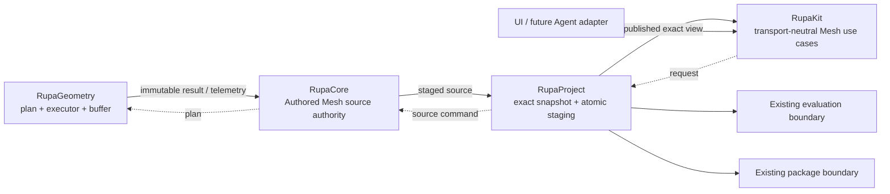
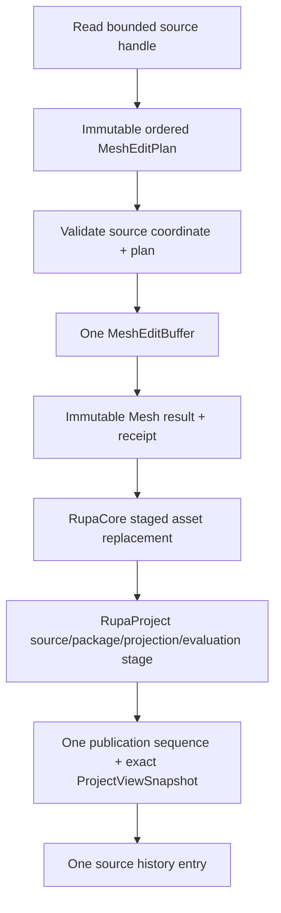
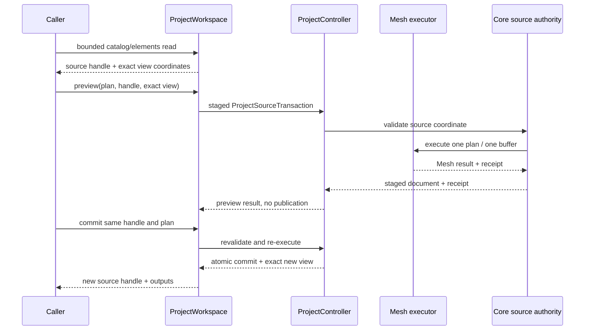

# Rupa System Design

## Purpose and Scope

This is the system-level design for the Agent-ready Authored Mesh editing
slice, T09. It fixes the cross-package boundary for reading and editing one
Authored Mesh source while preserving the existing Product, CAD, project, and
workspace authority model.

This document is the system root. It has no parent. Its direct child is the
[RupaKit package design](RupaKit/DESIGN.md). The changed module designs are
indexed by that package design:

- [RupaGeometry module](RupaKit/Sources/RupaGeometry/DESIGN.md)
- [RupaCore module](RupaKit/Sources/RupaCore/DESIGN.md)
- [RupaProject module](RupaKit/Sources/RupaProject/DESIGN.md)
- [RupaKit integration module](RupaKit/Sources/RupaKit/DESIGN.md)

Dependencies cross into the existing `RupaKit` Swift package and its
`swift-CAD` dependency. Users are the application composition and later
transport adapters; they consume the package use cases rather than this system
document directly.

The T09-0 design is a contract and implementation boundary. It does not claim
that the T09-A through T09-IV source work is already implemented.

## Responsibilities and Boundaries

The system design owns only the relationships that cross module boundaries:

- one retained Authored Mesh source is selected by `sourceID` and
  `ContentIdentity`;
- one immutable `MeshEditPlan` is staged through one mutable buffer and one
  source commit;
- one successful plan is one project source transaction and one undo entry;
- the existing project authority publishes source, package, evaluation, and
  exact view state atomically.

The system does not own Mesh topology algorithms, Product mutation code,
project actor implementation, or a transport protocol. Those responsibilities
belong to the child designs.



The system keeps the following authority distinctions:

| Concern | Owner | Boundary guarantee |
|---|---|---|
| Mesh operation meaning and topology validity | `RupaGeometry` | A plan is validated and executed independently of Product or transport state. |
| Which Authored Mesh asset is edited | `RupaCore` | `sourceID` plus expected content identity is checked before staging. |
| When a result becomes project state | `RupaProject` | Source, package, projection, evaluation, and view publish as one staged result. |
| How callers obtain/read/preview/commit | `RupaKit` | Callers use an exact `ProjectViewSnapshot`; they do not create a second authority. |

## Related Designs

| Design | Relationship | Contract Used | Summary | Cautions |
|---|---|---|---|---|
| [RupaKit/DESIGN.md](RupaKit/DESIGN.md) | child | Package module graph and integration boundary | Composes the four changed module contracts. | Package design is the source of detail for package dependencies. |
| [CAD/Mesh responsibility](Rupa/CAD_MESH_RESPONSIBILITY_CONTRACT.md) | depends on | Representation authority, CAD/Mesh distinction, derived snapshot role, and zero-copy baseline | Remains the authority for what CAD, Authored Mesh, external, and derived geometry mean. | T09 adds editing-plan execution; it does not redefine representation ownership. |
| [State and project contract](Rupa/STATE_AND_PROJECT_CONTRACT.md) | depends on | Session, revision, publication, actor, rollback, and workspace lifetime | Remains the authority for project staging and publication semantics. | T09 must use the existing project operation boundary. |
| [RupaKit/ARCHITECTURE.md](RupaKit/ARCHITECTURE.md) | coordinates with | Implemented package graph and shared workspace route | Records the current route that T09 extends. | Existing implementation statements are not evidence that T09 source code is complete. |
| [RupaKit/PROGRESS.md](RupaKit/PROGRESS.md) | coordinates with | T09 work-item order and verification ownership | Tracks implementation readiness and completion. | A checked design item does not check implementation items. |

## Architecture

The end-to-end authority path is deliberately linear. A plan never becomes a
transport message or a persisted projection; the final Authored Mesh asset is
the only persistent Mesh result.



## Contracts and Invariants

These are the cross-boundary T09 invariants. Local operation, source-target,
transaction, and read contracts are owned by the child designs.

1. Each semantic fact remains with the source owner defined by the
   [CAD/Mesh responsibility contract](Rupa/CAD_MESH_RESPONSIBILITY_CONTRACT.md).
2. A T09 Mesh mutation has one source, one plan, one mutable buffer, one source
   commit, one project transaction, and one undo entry. The local proof is in
   [RupaGeometry](RupaKit/Sources/RupaGeometry/DESIGN.md) and
   [RupaCore](RupaKit/Sources/RupaCore/DESIGN.md).
3. The source authority check, project coordinate check, and full view check are
   performed by their respective owners; none is replaced by a cached
   projection or transport identity.
4. Prepublication failure or cancellation leaves the last published source,
   package, evaluation, history, and view unchanged. A save failure after a
   committed edit does not roll back that edit and leaves the session dirty.
5. Preview is never source authority. Commit revalidates and executes through
   the existing project boundary before publication.
6. Required copies are measured at their owning boundary; unchanged buffer
   identity is the proof basis for a zero-copy claim.
7. T09 changes no `RupaAgentProtocol`, CLI, or MCP surface. Those are later
   adapters over the transport-neutral RupaKit use case.

## Runtime Flows

### Inspect, preview, and commit



### Failure path

Any failure before publication discards the staged buffer, source document,
package bytes, projection, evaluation, and view candidate together. A save
failure after source authority has already committed does not roll back that
edit: the published state remains intact and dirty. A view projection failure
after source authority has committed follows the existing post-commit no-retry
contract; the caller receives the exact committed coordinates and must not
replay the plan.

## State, Ownership, and Lifecycle

```text
Published ProjectViewSnapshot
    -> immutable MeshSource handle (borrowed/read identity)
    -> immutable MeshEditPlan (caller-owned value)
    -> one staged MeshEditBuffer (executor-owned, transaction lifetime)
    -> immutable Mesh result (Core/project staging lifetime)
    -> content-addressed Authored Mesh asset (published source lifetime)
```

- The caller owns the immutable request value and cannot mutate a source through
  a read handle.
- `RupaGeometry` owns the mutable buffer during plan execution and releases it
  after commit or rollback.
- `RupaCore` owns the retained Authored Mesh asset and its provenance.
- `RupaProject` owns publication sequencing, session history, package state, and
  evaluation coordination.
- `RupaKit` owns only the MainActor observation/use-case adapter and never owns a
  second document or Mesh asset.

## Failure, Concurrency, and Constraints

- Project actor isolation serializes source publication and exact-coordinate
  checks. Heavy geometry execution receives immutable input and does not retain
  mutable session access.
- Read and editing owners reject stale or inconsistent coordinates before and
  after their respective boundaries; the precise coordinate set is defined by
  the RupaKit and RupaProject child designs.
- The plan executor rejects malformed selectors, invalid topology, non-finite
  values, overflow, unsupported attribute remapping, and effective limits over
  the hard ceiling with typed failures; the precise operation contract is owned
  by RupaGeometry.
- No I/O, `await`, external callback, or transport operation occurs while a
  low-level mutable buffer is borrowed.
- Required copies at package, process, GPU, or foreign API boundaries are
  attributed in telemetry. Array/Data materialization is not used as proof of
  zero-copy.

## Verification and Change Impact

T09-0 is complete only when this hierarchy and contract are linked, internally
consistent, and reviewed. It does not mark behavior complete. The proof is
owned as follows:

| Proof | Owner | Planned evidence |
|---|---|---|
| Plan validation, topology, IDs, budgets, buffer sharing | `RupaGeometry` | T09-A focused behavioral tests and copy telemetry. |
| Source identity, asset replacement, shared references, invariance | `RupaCore` | T09-B focused authority and rollback tests. |
| Exact snapshot, staging, publication, rollback | `RupaProject` | T09-C and T09-IV project tests. |
| Bounded reads and transport-neutral preview/commit | `RupaKit` | T09-C focused use-case tests. |
| Inspect-to-save/load and cumulative zero-copy path | System integration | T09-IV real ProjectController workflow. |

Any change to source identity, ownership, lifetime, publication order, or public
use-case shape requires rechecking this document and the directly affected
child design. Transport adapters remain outside T09.
