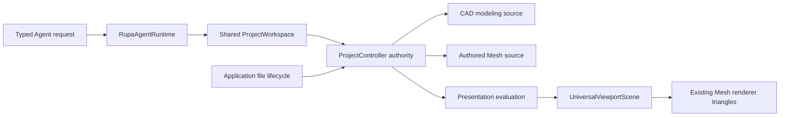
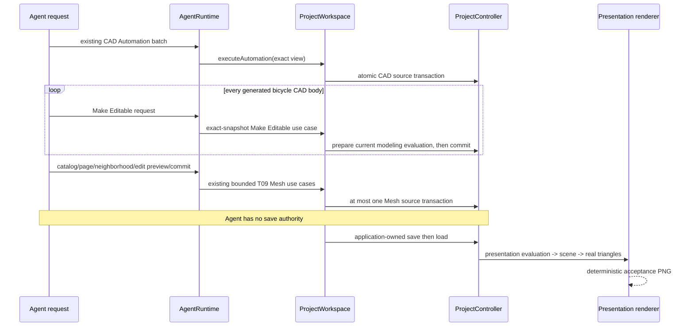

# Rupa System Design

## Purpose and Scope

This is the system design master for T10 Agent-to-project geometry integration.
T10 connects the already implemented Agent CAD route and T09 Authored Mesh use
cases without adding a second project authority or a modeling-specific transport.

This document has no parent. Its direct child is the
[RupaKit package design](RupaKit/DESIGN.md), which indexes the changed module
designs. The T09 Geometry/Core/Project/Mesh contracts remain the verified lower
foundation; T10 changes only their application and Agent composition boundary.

## Responsibilities and Boundaries

The system owns the cross-module rule that one registered `ProjectWorkspace`
serves CAD automation, Make Editable, Authored Mesh reads and edits, history,
presentation evaluation, and application-owned persistence.

It does not add an MCP server, CLI command, bicycle-specific command, new Mesh
kernel operation, renderer, or Agent file-lifecycle authority. A bicycle is an
acceptance workflow composed from existing CAD automation commands.

## Related Designs

| Design | Relationship | Contract Used | Summary | Cautions |
|---|---|---|---|---|
| [RupaKit package](RupaKit/DESIGN.md) | child | T10 dependency and verification composition | Indexes Project, RupaKit, AgentProtocol, and AgentRuntime ownership. | Details remain in the owning module. |
| [CAD/Mesh responsibility](Rupa/CAD_MESH_RESPONSIBILITY_CONTRACT.md) | depends on | CAD modeling and Authored Mesh presentation authority | Defines retained representation meaning. | A derived evaluation snapshot is never persisted source. |
| [State/project contract](Rupa/STATE_AND_PROJECT_CONTRACT.md) | depends on | exact coordinates, staging, history, rollback, save ownership | Defines the sole project publication lifecycle. | Agent mutations never bypass `ProjectController`. |
| [T10 progress](RupaKit/PROGRESS.md) | coordinates with | work order and evidence ownership | Tracks design, implementation, and integration proof. | A design checkbox is not behavior evidence. |

## Architecture

## Contracts and Invariants

1. Agent CAD operations continue to use the existing Automation request route;
   T10 introduces no bicycle-specific command.
2. Make Editable explicitly evaluates the selected CAD modeling representation,
   commits a new independent Authored Mesh representation, retains CAD and its
   modeling selection, and may switch only presentation selection.
   In the bicycle acceptance workflow, every generated CAD body must retain its
   CAD modeling representation and gain a corresponding Authored Mesh
   presentation representation. The optional Mesh edit plan may target one
   representative Authored Mesh asset only.
3. Catalog, page, neighborhood, edit preview, and edit commit reuse the T09
   bounded use cases. AgentRuntime supplies the exact current full
   `ProjectViewSnapshot`; transport values do not become authority.
4. AgentProtocol reuses Codable RupaKit Mesh values through a one-way,
   cycle-free dependency. Results containing an in-process view are projected
   to AgentProtocol-owned DTOs rather than serializing the view.
5. Stale coordinates, cancellation, invalid limits/plans, and prepublication
   failures are typed and publish nothing. A postpublication projection failure
   returns the exact committed coordinate and must-not-retry disposition.
6. Agent requests do not save or load `.rupa` files. Application code retains
   that authority through `ProjectWorkspace`/`ProjectController`; the existing
   Agent save request remains unsupported.
7. Authored Mesh presentation evaluation shares immutable source buffers. A
   necessary Mesh edit copy is attributed at the T09 execution boundary.

## Runtime Flows

## State, Ownership, and Lifecycle

`ProjectController` owns Product, CAD, Authored Mesh, package, evaluation,
history, and publication sequence. `ProjectWorkspace` owns the observable exact
view. AgentProtocol owns only Codable messages; AgentRuntime owns only request
routing and registration leases. The acceptance PNG is generated test evidence
from loaded presentation triangles and is not source or package authority.

## Failure, Concurrency, and Constraints

Project actor isolation and registration operation leases remain the ordering
boundaries. Heavy bounded reads and geometry work use immutable snapshots
outside the actor and revalidate before return/publication. No retry is allowed
after a source mutation has published. Existing read/plan hard ceilings remain
the maximum accepted through Agent decoding.

## Verification and Change Impact

| Invariant | Behavioral evidence |
|---|---|
| Wire contract | Agent request/response codec and fixture tests for all typed Mesh and Make Editable routes, malformed limits/plans, and no fallback decoder. |
| Make Editable authority | Project/RupaKit tests for exact snapshot, CAD/modeling retention, presentation switch, provenance, zero-copy handoff, stale/cancel rollback, and one history entry. |
| Agent routing | Runtime tests proving each request reaches the registered workspace use case and preserves typed stale/cancel/no-retry failures. |
| Real workflow | One actual Agent CAD bicycle assembly; every generated body retains CAD modeling and gains Authored Mesh presentation; one representative asset is read/previewed/committed; application save/load, all-Authored-Mesh presentation evaluation, existing renderer triangle traversal, and deterministic nonempty PNG prove the complete assembly and committed edit. |
| Portability | Focused Native runtime tests and compile/link evidence only for portable targets supported by their dependency graph; unavailable target entry failures are reported, not treated as success. |

Changes to Agent wire values, project authority, representation selection, file
lifecycle, or renderer input require rechecking the owning child design and this
system composition.
