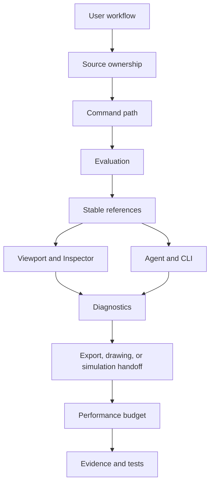
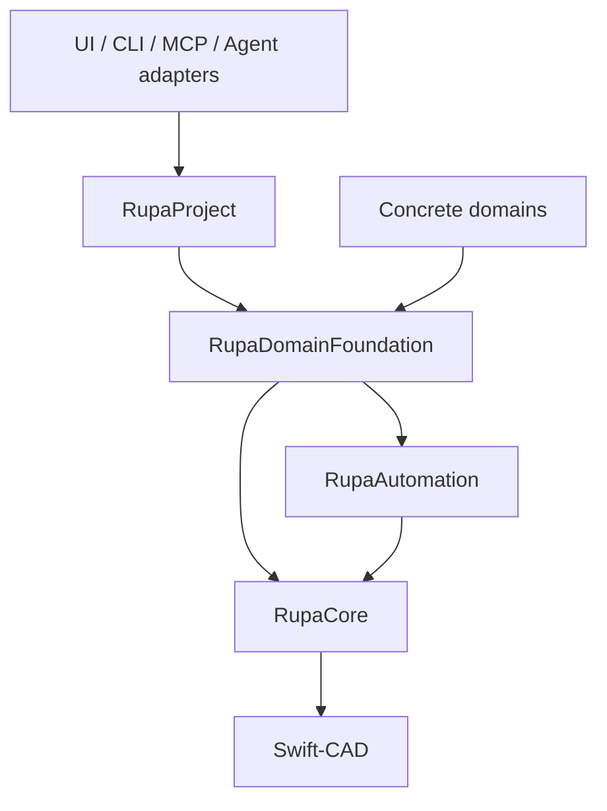
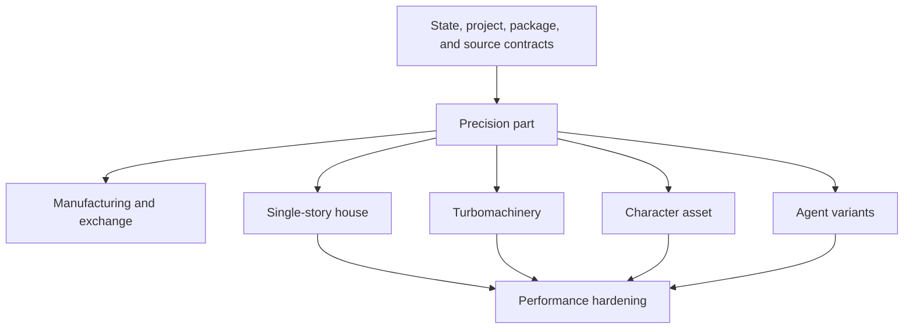

# Rupa Acceptance Workflow Contracts

## Status

This document defines the workflow-level completion contracts for Rupa. It is
the acceptance authority that prevents broad goals from being reduced to narrow
feature claims.

| Field | Value |
|---|---|
| Product | Rupa |
| Scope | Workflow-level completion contracts |
| Related plan | `COMPLETE_IMPLEMENTATION_PLAN.md` |
| Related requirements | `UNIVERSAL_CAD_REQUIREMENTS.md` |
| Related architecture | `DOMAIN_EXTENSION_ARCHITECTURE.md` |
| Related process | `DESIGN_PROCESS.md` |
| Release scope | `CONFORMANCE_PROFILES.md` |
| Reference authority | `REFERENCE_ARTIFACT_CONTRACT.md` |
| Validation authority | `VALIDATION_CONTRACT.md` |
| Transaction authority | `DOMAIN_TRANSACTION_CONTRACT.md` |
| State/project authority | `STATE_AND_PROJECT_CONTRACT.md` |
| Package authority | `DOCUMENT_PACKAGE_CONTRACT.md` |
| Completion rule | A workflow is complete only when the same `.swcad` document can pass source, command, evaluation, selection, UI, Agent/CLI, export or handoff, diagnostics, performance, and test gates. |

## Why This Exists

Feature lists are necessary, but they are not enough to prove product
readiness. A modeling command can work in isolation while the workflow remains
unusable because selection, ownership, diagnostics, export, Agent readback, or
performance is missing.

## Universal Completion Gates

Every acceptance workflow uses the same gate model. A workflow can be marked
complete only when every required gate has direct evidence.

| Gate | Required evidence |
|---|---|
| Source ownership | Editable design intent is stored in exactly one source owner: Swift-CAD source, RupaCore product metadata, or a registered semantic extension envelope. |
| Command path | Every source mutation enters an atomic `CommandStack` transaction, supports undo/redo, validates expected transaction revision, and rejects unsupported references before mutation. Semantic source and CAD projection commit as one history entry and one revision increment. |
| Evaluation | The source regenerates deterministic B-rep, mesh, drawing, validation, or analysis results with typed diagnostics. |
| Stable selection | Required objects, faces, edges, vertices, curves, surface controls, semantic objects, drawing items, and analysis regions obey `REFERENCE_ARTIFACT_CONTRACT.md` and return explicit stale, removed, unsupported, or repair diagnostics. |
| UI affordance | Viewport, Inspector, Browser, and command palette expose the operation without duplicating domain rules. Canvas overlays stay compact and non-blocking. |
| Agent and CLI | Capabilities are discoverable, effect-classified, dry-run aware where mutation is risky, executable or queryable through ProjectController, and return typed results with transaction revision, dependency identity, and diagnostics. |
| Export or handoff | Output formats, drawing artifacts, or solver handoff manifests use explicit units, transforms, topology/material mapping, and failure reports. |
| Diagnostics | Passed, failed, inconclusive, and unsupported outcomes remain distinct; failures explain the target, reason, unchanged state, recovery action, fidelity, and whether mutation occurred. |
| Performance | The workflow has named fixtures and numeric wall-clock, memory, cancellation, and geometry-copy budgets where scale can affect usability. |
| Tests | Unit, integration, Agent/CLI, export/handoff, app-build, rendering, and E2E coverage match the claimed workflow scope. |

## Responsibility Lock

The workflow contracts do not change the module ownership rules.

| Layer | Owns | Must not own |
|---|---|---|
| Swift-CAD | Geometry source, B-rep, mesh, topology naming, exact evaluation, exchange primitives. | Rupa UI, Agent transport, concrete domains, product workflow policy. |
| RupaCore | `.swcad` document, command stack, undo/redo, scene metadata, product metadata, generic validation and summaries. | Domain-specific semantic rules or solver-specific assumptions. |
| RupaDomainFoundation | Registry contracts, domain capability descriptors, payload decoding, lowering, validation, projection repair, simulation adapter protocols. | Concrete domain behavior or stored document truth. |
| Concrete domains | Architecture, manufacturing, turbomachinery, character, and simulation semantics, validators, generators, and adapters. | Forked document types, bypassed command paths, or lower-layer imports. |
| RupaProject | Session ordering, artifact/decision stores, export/job prepare-commit, shared application use cases. | Geometry/domain semantics or transport encoding. |
| RupaUI | Generic interaction, compact canvas affordances, Inspector rendering from descriptors, viewport handles. | Domain rules that belong in validators or command lowerings. |
| Agent and CLI | Structured discovery, preflight, execution, readback, and file/live transport. | Hidden mutation paths or domain-specific hard-coded behavior outside registered capabilities. |

## Workflow A: Precision Mechanical Part

### Intent

Create a dimensioned, source-editable mechanical part with precise features,
materials, exact inspection, and neutral CAD/drawing exchange.

| Contract | Required result |
|---|---|
| Source | Sketches, parameters, constraints, construction geometry, solid features, material bindings, and export presets are source-owned. |
| Commands | Create and edit sketches, dimensions, constraints, extrude, revolve, sweep, loft, boolean, shell, hole, draft, fillet, chamfer, pattern, mirror, direct face/edge/vertex edits, material assignment, inspection, and neutral exchange. |
| Evaluation | Deterministic solid B-rep, generated topology names, tessellated preview mesh, dimensions, measurements, and mass properties where density exists. |
| Selection | Object, source sketch entity, region, generated face, generated edge, generated vertex, construction plane, feature, material target, and validation region references. |
| UI | Viewport sketching, subobject selection, direct handles, compact command panels, Inspector edits, dimension callouts, material picker, validation readback. |
| Agent/CLI | Capability discovery, command execution, dry-run for destructive edits, selection summaries, dimension/inspection summaries, and STEP/drawing exchange where claimed. |
| Handoff | STEP for exact CAD and PDF/SVG/DXF for the declared drawing subset. Manufacturing mesh readiness belongs to Workflow M. |
| Performance | Dense topology, repeated feature edits, tessellation, validation, and export budgets. |
| Tests | Kernel feature tests, source mutation tests, topology persistence tests, Agent/CLI JSON tests, export preflight tests, drawing/export tests, app workflow tests. |

### Completion Evidence

| Evidence | Required proof |
|---|---|
| Acceptance document | A `.swcad` fixture containing parameters, sketches, construction planes, solids, material, saved views, and neutral exchange presets. |
| Mutation proof | The fixture can be edited through UI, Agent live mode, and CLI file mode without source drift. |
| Export proof | STEP and declared drawing outputs either succeed with fidelity reports or fail with typed unsupported diagnostics. |
| Regression proof | Focused tests cover both successful and rejected feature cases. |

## Workflow M: Printable Two-Part Enclosure

Workflow ID: `manufacturing.printable-enclosure.v1`.

### Intent

Prepare and publish a two-part enclosure for an explicitly selected additive
manufacturing process without treating unsupported analysis as success.

| Contract | Required result |
|---|---|
| Source | The precision-part source is supplemented by persisted manufacturing process, machine, material, build-frame, rule-configuration, validation-policy, and export-preset source. |
| Analysis | Watertightness, wall thickness, clearance, small features, build volume, orientation/overhangs, supportability, material/process compatibility, and format mapping report exact or declared approximate fidelity. |
| Evidence | Every failed or inconclusive geometric rule returns exact-artifact regions with declared completeness, or explicitly reports unavailable evidence. |
| UI | Build frame, process/machine/material settings, typed findings, regions, and policy decision are editable/inspectable without encoding manufacturing rules in RupaUI. |
| Agent/CLI | The same registered query, preflight, source-setting, decision-request, and export use cases are available through ProjectController. |
| Handoff | STL and 3MF mesh outputs plus the declared STEP policy include units, process/material mapping, artifact fingerprints, validation findings, policy evaluation, and any authorized decision record. |
| Safety | Unsupported, inconclusive, stale, or insufficient-fidelity required rules block publication. An override covers one exact prepared output and is recorded by ProjectController. |
| Performance | Dense mesh analysis has spatial acceleration, cancellation, memory, copy, and wall-clock budgets. |

### Completion Evidence

| Evidence | Required proof |
|---|---|
| Acceptance document | Versioned `.swcad` enclosure fixture with mating parts, wall/clearance features, materials, build frame, process/machine settings, policy, and export presets. |
| Policy proof | Passed, failed, inconclusive, unsupported, stale, insufficient-evidence, allowed, blocked, authorized override, and revoked-decision cases. |
| Artifact proof | Regions resolve only against the exact analyzed mesh; prepared and published output fingerprints match. |
| Adapter proof | UI, CLI, and Agent return the same findings, policy result, and publication identity. |

## Workflow B: Single-Story House

### Intent

Create a single-story house design with building semantics, CAD geometry,
drawings, schedules, validation, and exchange.

| Contract | Required result |
|---|---|
| Source | Architecture semantic envelopes own site, level, grid, room, wall, opening, roof, floor, ceiling, and building-element metadata. Swift-CAD source owns generated geometry only where ownership is universal. |
| Projection | Semantic objects lower to sketches, construction planes, solids, surfaces, sections, saved views, drawing views, and schedules through a projection manifest. |
| Commands | Create/edit site, level, wall path, room boundary, door/window opening, roof, slab/floor, dimensions, saved views, drawing sheets, schedules, validation, and export. |
| Evaluation | CAD geometry, enclosed rooms, openings, clearances, areas, volumes, drawing projections, schedules, and validation diagnostics regenerate from semantic source. |
| Selection | Site, level, room, wall, opening, roof, slab, drawing view, schedule row, generated face/edge, section contour, and projection repair target references. |
| UI | Generic CAD UI renders architecture descriptors, property groups, canvas handles, drawing/schedule views, and diagnostics without hard-coding architecture rules in RupaUI. |
| Agent/CLI | Registered architecture capabilities expose creation, edit, validation, measurement, schedule, drawing, and export workflows. |
| Handoff | IFC-oriented semantic mapping report, DXF/PDF drawings, and optional mesh/glTF/USD visualization outputs with explicit unit and origin policy. |
| Performance | Building-scale coordinates, many walls/openings, drawing generation, schedule extraction, and IFC/DXF/PDF export budgets. |
| Tests | Domain registry tests, semantic payload round-trip tests, projection ownership tests, drawing/schedule tests, Agent/CLI tests, import/export diagnostics tests, app workflow tests. |

### Completion Evidence

| Evidence | Required proof |
|---|---|
| Acceptance document | A `.swcad` fixture with site, one level, rooms, walls, openings, roof, dimensions, drawing views, schedules, and export presets. |
| Ownership proof | Direct edits on domain-owned wall/opening geometry route to architecture commands or fail with ownership diagnostics. |
| Drawing proof | Plan/section/elevation style outputs are generated from saved views and semantic references, not screenshots. |
| Exchange proof | IFC/DXF/PDF outputs include mapping reports and unsupported-feature diagnostics. |

## Workflow C: Turbomachinery Component

### Intent

Create a blade, duct, nozzle, or related flow component with surface continuity,
manufacturing constraints, and simulation handoff.

| Contract | Required result |
|---|---|
| Source | Turbomachinery semantic envelopes own airfoil sections, stacking law, twist, chord, thickness, hub/shroud references, blade count, clearance, boundary tags, and solver intent. |
| Geometry | Swift-CAD owns exact curves, NURBS or B-spline surfaces, trims, fillets, shells, booleans, and generated topology. |
| Commands | Create/edit airfoils, guide curves, surface loft/sweep, blade arrays, ducts/nozzles, fillets, shells, boundary tags, validation, and solver handoff manifests. |
| Evaluation | Surface continuity, UVN frames, curvature combs, section cuts, clearance, wall thickness, watertightness, and mesh/surface quality diagnostics. |
| Selection | Airfoil section, curve CV, surface CV, trim edge, blade face, hub/shroud boundary, inlet/outlet boundary, periodic pair, clearance region, and solver boundary references. |
| UI | Surface CV and frame displays, continuity diagnostics, combs, boundary-tag editing, section analysis, compact command panels, and Inspector descriptors. |
| Agent/CLI | Registered capabilities for airfoil creation, blade law editing, continuity analysis, boundary tagging, validation, and solver handoff readback. |
| Handoff | CFD/FEA input manifest with units, coordinate frames, boundary tags, mesh/surface provenance, input hash, and stale-result policy. |
| Performance | Dense surface patches, blade arrays, section analysis, tessellation, solver mesh preparation, and result import budgets. |
| Tests | Surface kernel tests, continuity tests, boundary-tag tests, solver-manifest tests, Agent/CLI tests, performance fixtures. |

### Completion Evidence

| Evidence | Required proof |
|---|---|
| Acceptance document | A `.swcad` fixture with airfoil sections, blade/duct geometry, surface continuity checks, boundary tags, and solver handoff settings. |
| Continuity proof | Curvature and continuity diagnostics are queryable by UI and Agent for the same references. |
| Handoff proof | Solver input can be regenerated from the same dependency identity and invalidates when any declared source, configuration, or consumed artifact changes. |

## Workflow D: Character or Game Asset

### Intent

Create a hard-surface asset suitable for DCC and game-engine handoff while
retaining CAD-style source editability.

| Contract | Required result |
|---|---|
| Source | Universal CAD source owns hard-surface solids/surfaces/meshes; DCC semantic metadata owns pivots, hierarchy, UV/export intent, LOD intent, and naming. |
| Commands | Create/edit hard-surface geometry, pivots, hierarchy, materials, UV metadata, normals, LOD/export presets, validation, and DCC export. |
| Evaluation | Mesh/surface display, normals, UV readiness, pivot hierarchy, material coverage, LOD/readiness diagnostics, and export previews. |
| Selection | Object, mesh vertex/edge/face, surface CV, material region, UV island, pivot, hierarchy item, and export issue references. |
| UI | Selection modes, viewport handles, material/UV/readiness Inspector sections, hierarchy Browser, compact overlay controls, and diagnostics. |
| Agent/CLI | Registered capabilities for asset generation, validation, material assignment, hierarchy readback, and USD/GLB/OBJ export. |
| Handoff | USD/USDZ/GLB/OBJ exports with hierarchy, pivots, transforms, materials, normals, UVs, units, and mesh exchange diagnostics. |
| Performance | Dense mesh editing, preview simplification, export streaming, material/UV validation, and large texture-reference metadata budgets. |
| Tests | Mesh/surface tests, hierarchy tests, material/UV diagnostics tests, USD/GLB/OBJ export tests, Agent/CLI tests, app workflow tests. |

### Completion Evidence

| Evidence | Required proof |
|---|---|
| Acceptance document | A `.swcad` fixture with hierarchy, pivots, materials, mesh/surface geometry, validation settings, and export presets. |
| Exchange proof | DCC export reports include hierarchy/material/unit/UV/normal diagnostics and unsupported-feature notes. |
| Agent proof | Agent can inspect and fix validation issues through structured operations or receive typed rejections. |

## Workflow E: Agent-Generated Variant Set

### Intent

Let an Agent create, validate, compare, and export design variants without
manual source edits and without bypassing product safety rules.

| Contract | Required result |
|---|---|
| Source | Variant recipes are source-owned parameter sets, source branches, component configurations, or semantic variants. Evaluated variant geometry and exports are derived artifacts and never substitute for the recipe. |
| Commands | Create variant, apply variant, compare variants, validate variant, export variant, remove variant, and rollback failed batch operations. |
| Evaluation | Each variant has transaction provenance, content/dependency identity, diagnostics, source diff, geometry/metadata diff, validation status, and export readiness. |
| Selection | Variant, changed feature, changed semantic object, changed topology, validation issue, and exported artifact references. |
| UI | Variant list, diff summary, validation status, export actions, and compact canvas/readback affordances. |
| Agent/CLI | Batch use cases with dry-run, expected transaction revision, ordered results, rollback evidence, and deterministic typed diff output. |
| Handoff | Per-variant exports and reports with explicit file/artifact identity and validation state. |
| Performance | Batch evaluation, cache reuse, diff generation, export fan-out, and large JSON payload budgets. |
| Tests | Batch transaction tests, rollback tests, diff tests, Agent/CLI golden JSON tests, export fan-out tests, performance tests. |

### Completion Evidence

| Evidence | Required proof |
|---|---|
| Acceptance document | A `.swcad` fixture with at least one source-owned variant family and export presets. |
| Safety proof | A failed variant batch publishes no source/workspace change and no project artifact; prior source, workspace, history, and artifacts remain unchanged. |
| Readback proof | Agent and CLI can report the same variant diff and validation result. |

## Cross-Workflow Shared Foundations

The workflow contracts intentionally reuse the same foundations. Missing shared
foundations must be implemented once instead of patched per domain.

| Foundation | Required shared capability |
|---|---|
| Units and scale | Micrometer through kilometer display, snapping, dimensions, saved views, drawing scale, and export units. |
| Topology references | Persistent object, face, edge, vertex, curve, surface CV, semantic, drawing, and analysis references with repair diagnostics. |
| Materials and process metadata | Object-level and face-level material/process bindings, library validation, mesh/B-rep propagation, export mapping, and manufacturing diagnostics. |
| Domain projection | Semantic envelope, projection manifest, ownership resolver, dependency-freshness checks, and repair operations. |
| Validation regions | Diagnostics can point to generated faces, edges, vertices, mesh triangles, sampled regions, semantic objects, and drawing items. |
| Exchange reports | Every import/export returns units, transform, hierarchy, material, topology, tessellation, semantic mapping, and unsupported-feature diagnostics. |
| Performance budgets | Large coordinates, dense meshes, dense B-rep topology, large semantic payloads, large drawings, and batch Agent outputs are measured. |

## Implementation Order

Implementation should proceed by completing vertical workflow slices, not by
adding isolated controls.

| Order | Work | Reason |
|---:|---|---|
| 1 | Finish the Core precision mechanical part workflow. | It forces universal source, topology, materials, inspection, exact exchange, and adapter correctness without borrowing a domain claim. |
| 2 | Finish the printable enclosure workflow. | It proves artifact identity, typed validation, decision recording, manufacturing source, spatial analysis, and output publication. |
| 3 | Finish Agent-generated variants on the precision workflow. | It proves Agent safety, dry-run, rollback, diff, and export fan-out before other domains depend on them. |
| 4 | Add the architecture workflow. | It exercises semantic projection, drawings, schedules, and building-scale units. |
| 5 | Add the turbomachinery workflow. | It exercises advanced surfaces, continuity, boundary tags, and simulation handoff. |
| 6 | Add the hard-surface DCC workflow. | It exercises mesh/DCC exchange, pivots, UV/material readiness, and non-engineering assets. |
| 7 | Harden performance and exchange across all workflows. | Completion must be measured across the product, not inferred from narrow fixtures. |

## Completion Report Template

Each workflow completion report must include the following sections.

| Section | Required content |
|---|---|
| Scope | Supported workflow steps and explicitly unsupported cases. |
| Source ownership | Source owners and ownership conversion or rejection rules. |
| Command paths | UI, Core, Automation, Agent, and CLI command routes. |
| Evaluation | Generated B-rep, mesh, drawing, validation, or handoff outputs. |
| Selection | Stable references and repair diagnostics. |
| UI evidence | Viewport, Inspector, Browser, command palette, and rendering evidence. |
| Agent/CLI evidence | Discovery, dry-run, execution, readback, JSON diagnostics, and rollback evidence. |
| Export/handoff evidence | Format reports, solver manifests, drawing artifacts, or explicit unsupported diagnostics. |
| Performance | Budget, measurement command, result, and remaining risk. |
| Tests | Exact commands and results for focused and workflow-level gates. |
