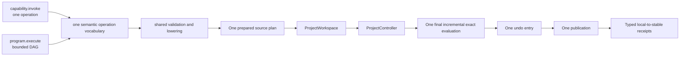

# Agent Modeling Performance

## Objective

An Agent must be able to author a coherent model with request size proportional
to distinct modeling intent and execution work proportional to affected
geometry. Repeated structure must not require protocol payload proportional to
expanded occurrences, and a simple operation must not require a program wrapper.

## CADAPI-D Target Contract

This contract is fixed but its Agent API cutover is not yet implemented.

| Boundary | Required behavior |
|---|---|
| Operation vocabulary | `capability.invoke` and `program.execute` resolve the same semantic operation IDs, versions, schemas, validators, and lowerers. Direct invocation normalizes to a one-node program internally. |
| Program expression | A bounded declarative DAG uses parameters, bounded pure expressions, and typed request-local output references. Rupa allocates persistent IDs inside staging and returns the local-to-stable mapping only after successful publication. |
| Repetition | Registered native finite-pattern operations represent repeated structure as one semantic node. Changing occurrence count does not change program node count. |
| Source staging | Validate and lower the complete program before applying one prepared source plan through `ProjectWorkspace` to `ProjectController`. Intermediate state is not published. |
| Evaluation | Perform at most one final exact evaluation after all source operations succeed. |
| Validation | Reject the complete group when final evaluation does not reach the proposed generation or fails. |
| Undo and publication | Record one before/after history entry and publish at most once for the complete program. |
| Result | Return typed local output mappings, exact committed coordinates, diagnostics, and compact observability. Dry run does not claim persistent identities. |
| Bounds | Reject before staging when request bytes, values, nesting, graph nodes/edges, local references, expressions, lowered commands, expanded source/evaluation work, or diagnostics exceed their configured limits. |

## Current Legacy Implementation Inventory

The reachable implementation still accepts `command.applyBatch`, raw
`AutomationCommand.appendFeatureGraph`, and caller-supplied persistent IDs. Its
isolated source grouping, final evaluation, and grouped undo are useful internal
substrates, but that public shape is non-normative and targeted for CADAPI-D
cutover. No result in this document claims that `capability.invoke` and
`program.execute` are already production-complete.

`DocumentEvaluator` validates the geometry it has just generated without
re-evaluating the source. Full source re-evaluation remains part of explicit
freshness auditing for persisted or externally supplied caches and official
exchange export.

## Blender Comparison

Blender's performance comes from execution boundaries rather than Python
syntax alone:

| Blender mechanism | Rupa equivalent | Status |
|---|---|---|
| Direct data API for context-independent scripting | `capability.invoke` using registered semantic CAD operations | Contract fixed; cutover pending. |
| BMesh editing followed by one explicit mesh update | `BRepEditBuffer` plus one final publish/evaluation boundary | Implemented for incremental exact topology replay. |
| Deferred dependency-graph recalculation | Deferred group evaluation | Implemented at source-command-group granularity. |
| Tagged dependency-graph updates of affected data | Dependency-closure invalidation and cached exact feature outputs | Implemented; unchanged feature results and meshes are reused. |
| Grouped undo | One command-history entry per source group | Implemented. |
| In-process scripts and operators | One bounded `program.execute` request carrying semantic intent | Contract fixed; cutover and end-to-end measurement pending. |

Primary references:

- [Blender BMesh API](https://docs.blender.org/api/current/bmesh.html)
- [Blender operator API](https://docs.blender.org/api/current/bpy.types.Operator.html)
- [Blender Python operator constraints](https://docs.blender.org/api/current/info_gotchas_operators.html)
- [Blender dependency graph](https://developer.blender.org/docs/features/core/depsgraph/)

## Remaining Performance Milestones

### P1: Typed Local Program Bindings - Pending

An Agent names request-local outputs and refers to them from later DAG nodes.
Rupa resolves those bindings while lowering, allocates stable source identities
inside the staged authority boundary, and returns mappings only after success.

Acceptance:

- local symbols and typed output names are validated before staging;
- later nodes can reference compatible earlier outputs without a round trip;
- persistent feature, scene, component, instance, and pattern IDs are allocated by Rupa rather than supplied by the caller;
- failure and dry run publish no identity mapping;
- the complete program still evaluates and records history once.

### P2: Incremental Feature Evaluation - Complete for the default evaluator

Cache feature inputs, outputs, and dependency identities. A source mutation
invalidates the changed feature and its downstream closure. Unaffected branches
must reuse exact evaluated outputs.

Acceptance:

- evaluation metrics report visited, reused, and invalidated feature counts;
- parameter changes only revisit dependent features;
- topology names remain stable across reused and rebuilt branches;
- full evaluation and incremental evaluation produce equivalent exact results.

### P3: Mutable Topology Edit Buffer - Complete for incremental replay

Provide a Core-owned edit representation for repeated vertex, edge, and face
operations. Validate and publish it once, analogous to BMesh's edit/update
boundary, without making mutable topology part of authoritative document source.

### P4: Interactive and Background Scheduling - Pending

Separate preview-quality cancellable evaluation from exact commit evaluation.
Interactive tools may coalesce superseded previews; committed Agent
transactions must remain deterministic and exact.

### P5: Stable Topology Identity Across Every Evaluator - In Progress

`PlanarExtrudeFeatureEvaluator` derives topology IDs deterministically from the
source feature ID. Revolve, sweep, loft, surface, Boolean, and direct-edit
evaluators still contain generated UUID paths and must migrate before stable
topology can be claimed for the complete operation vocabulary.

### P6: Independent-Branch Parallel Evaluation - Pending

The dependency graph identifies the exact invalidation closure, but the default
evaluator still rebuilds invalidated features serially. Independent branches
require deterministic parallel scheduling, isolated result buffers, and ordered
merge validation.

### P7: Compact Semantic Program Transport - Contract Fixed, Implementation Pending

The decoded Agent execution path is benchmarked separately from request
serialization. The target transport carries distinct semantic intent, not raw
feature graph nodes. One native pattern operation represents its finite
occurrences, and both invocation forms share the same descriptor and lowerer.
The current raw request remains only a historical control until the production
CLI path proves the compact program contract end to end.

Acceptance:

- request bytes scale with distinct operations and parameters rather than expanded persistent graph records;
- direct and program forms produce equivalent one-node results for the same operation;
- a finite pattern lowers as one native pattern operation rather than wire-expanded occurrences;
- the whole program produces at most one source transaction, exact evaluation, undo entry, and publication;
- actual CLI encode, transport, decode, lower, execute, save, reload, and receipt measurements are reported separately.

## Measured Baseline

Apple Silicon release measurements on 2026-07-11 use 100 independent exact box
bodies. Rupa uses 500 iterations and Blender uses 300 iterations after 50 and
30 warmups respectively. Values are median / p95:

| Boundary | Create 100 bodies | Edit one body |
|---|---:|---:|
| Rupa Kernel | 7.198 / 7.701 ms | 0.191 / 0.262 ms |
| Rupa Core | 7.599 / 8.132 ms | 0.196 / 0.276 ms |
| Rupa decoded Agent command | 7.585 / 8.124 ms | 0.208 / 0.277 ms |
| Blender mesh baseline | 4.250 / 4.656 ms | 0.139 / 0.165 ms |

The decoded Agent comparison passes all four `2.0x` gates:

| Gate | Ratio | Result |
|---|---:|---|
| Create median | 1.78x | Pass |
| Create p95 | 1.74x | Pass |
| Edit median | 1.49x | Pass |
| Edit p95 | 1.68x | Pass |

A second independent 300-iteration Rupa run also passes all four gates. With
1,000 bodies, decoded Agent edit latency remains 0.186 / 0.232 ms, confirming
that local extrusion edits are proportional to affected geometry rather than
document body count.

The 1,000-body scale check also remains within the gate:

| Workload | Rupa decoded Agent | Blender mesh baseline | Ratio |
|---|---:|---:|---:|
| Create 1,000 bodies | 77.467 / 84.822 ms | 65.402 / 68.248 ms | 1.18x / 1.24x |
| Edit one of 1,000 bodies | 0.186 / 0.232 ms | 1.635 / 1.964 ms | 0.11x / 0.12x |

Encoding the explicit 100-body raw feature-graph Agent request remains
14.806 / 15.770 ms for a 573,155-byte payload. This is retained only as
historical control evidence for the legacy representation. It is not evidence
that CADAPI-D request-size, transport, binding, or production CLI goals pass.

The Blender workload edits raw mesh vertices. Rupa edits parametric source,
rebuilds exact BRep topology, tessellates the affected body, records undo, and
returns an Agent command receipt. These are useful end-user latency comparisons,
but not equivalent kernel workloads. The benchmark therefore reports Kernel,
Core, and Agent boundaries separately.

## Known Limits

The shared decoded legacy workload is Blender-equivalent under the defined
latency gate. This is not a claim of parity for every CAD operation, CADAPI-D
request compactness, local binding correctness, or socket/MCP end-to-end
latency. Operation families beyond extrude still need deterministic topology
allocation, invalidated independent branches are serial, preview evaluation is
not cancellable or coalescing, and the production Agent path still exposes the
legacy explicit feature-graph representation until cutover.
