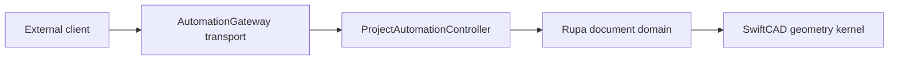

# Rupa Automation Protocol

This document defines the external JSON contract used by CLI, MCP, and agent clients to control an open Rupa project.

## Responsibility Boundary



| Layer | Responsibility |
|---|---|
| External client | Chooses commands, supplies typed targets, and correlates request IDs. |
| AutomationGateway transport | Moves JSON envelopes over the local transport and preserves request/response correlation. |
| ProjectAutomationController | Validates method payloads, routes requests to open sessions, and returns typed results. |
| Rupa document domain | Owns undoable mutation, evaluation, selection, measurement, import/export state, and diagnostics. |
| SwiftCAD geometry kernel | Owns geometry, topology, curves, surfaces, units, and generated analysis data. |

The transport layer is intentionally not the owner of project semantics. It only carries the automation protocol.

## Transport

| Field | Contract |
|---|---|
| Transport | Local Unix domain socket. |
| Canonical socket path | `~/Library/Application Support/Rupa/Agent/rupa.sock` |
| Alternate socket path | `$TMPDIR/rupa-agent/rupa.sock` |
| Encoding | UTF-8 JSON. |
| Message style | JSON-RPC-style envelopes with Rupa-specific method/result correlation. |
| Protocol version | `jsonrpc` must be `"2.0"`. |

## Envelope Contract

### Request

```json
{
  "jsonrpc": "2.0",
  "id": "request-id",
  "method": "document.surfaceAnalysis",
  "params": {
    "sessionID": "00000000-0000-0000-0000-000000000001",
    "options": {
      "sampleDensity": "high"
    },
    "expectedGeneration": {
      "value": 7
    }
  }
}
```

### Success Response

```json
{
  "jsonrpc": "2.0",
  "id": "request-id",
  "method": "parameter.setExpression",
  "result": {
    "message": "Parameter height updated.",
    "commandName": "upsertParameter",
    "generation": {
      "value": 8
    },
    "didMutate": true,
    "diagnostics": []
  }
}
```

### Error Response

```json
{
  "jsonrpc": "2.0",
  "id": "request-id",
  "method": "command.apply",
  "error": {
    "code": "document.generationMismatch",
    "message": "The document has changed since the command was prepared."
  }
}
```

## Envelope Rules

| Rule | Contract |
|---|---|
| Request ID | Clients choose `id`; responses echo the same value when a request was parsed. |
| Method | `method` is required on every request and every success response. |
| Success vs error | A response contains exactly one of `result` or `error`. |
| Method correlation | `result` must match the response method. A `parameter.setExpression` result is an `AutomationResult`. |
| Protocol version | Any value other than `"2.0"` is rejected. |
| Params object | Canonical requests include `params`. Empty-param methods use `{}`. |
| Strict top-level params | Unknown top-level keys inside `params` are rejected. |
| Generation | `DocumentGeneration` is encoded as an object with a `value` integer. |
| Optional generation guard | `expectedGeneration` may be omitted when the client intentionally accepts the current document generation. |

Nested domain payloads use the Codable JSON shape of the public RupaCore, RupaAutomation, and SwiftCAD types named below.

## Common Params

| Params type | JSON keys |
|---|---|
| `EmptyParams` | none |
| `SessionGenerationParams` | `sessionID`, `expectedGeneration?` |
| `ExecuteParams` | `sessionID`, `command`, `expectedGeneration?` |
| `SetParameterExpressionParams` | `sessionID`, `name`, `expression`, `kind`, `defaults`, `expectedGeneration?` |
| `SelectionMeasurementParams` | `sessionID`, `query`, `expectedGeneration?` |
| `ResolveSnapParams` | `sessionID`, `point`, `options`, `expectedGeneration?` |
| `PolySplineMeshAnalysisParams` | `sessionID`, `sourceMesh`, `options`, `expectedGeneration?` |
| `SelectionTargetsParams` | `sessionID`, `targets`, `expectedGeneration?` |
| `SelectionDimensionEvaluationParams` | `sessionID`, `dimensionID?`, `expectedGeneration?` |
| `SurfaceAnalysisParams` | `sessionID`, `options`, `expectedGeneration?` |
| `SurfaceFramesParams` | `sessionID`, `queries`, `expectedGeneration?` |
| `ExportParams` | `sessionID`, `outputPath`, `expectedGeneration?`, `options`, `dryRun` |

## Methods

| Method | Params type | Result type | Mutates |
|---|---|---|---|
| `agent.capabilities` | `EmptyParams` | `[AgentCapabilityDescriptor]` | No |
| `agent.status` | `EmptyParams` | `AgentStatus` | No |
| `agent.cadInteractionQualityAssessment` | `EmptyParams` | `CADInteractionQualityAssessmentResult` | No |
| `sessions.list` | `EmptyParams` | `[WorkspaceSessionSummary]` | No |
| `command.apply` | `ExecuteParams` | `AutomationResult` | Depends on command |
| `parameter.setExpression` | `SetParameterExpressionParams` | `AutomationResult` | Yes |
| `document.parameters` | `SessionGenerationParams` | `ParameterListResult` | No |
| `document.evaluate` | `SessionGenerationParams` | `EvaluationSnapshot` | No |
| `document.measure` | `SessionGenerationParams` | `MeasurementResult` | No |
| `selection.measure` | `SelectionMeasurementParams` | `CADAgentMeasurementQueryResult` | No |
| `snap.resolve` | `ResolveSnapParams` | `SnapResolutionResult` | No |
| `document.constructionPlaneSummary` | `SessionGenerationParams` | `ConstructionPlaneSummaryResult` | No |
| `document.designDisplaySnapshot` | `SessionGenerationParams` | `DesignDisplaySnapshotResult` | No |
| `document.patternArraySummary` | `SessionGenerationParams` | `PatternArraySummaryResult` | No |
| `document.meshSummary` | `SessionGenerationParams` | `MeshSummaryResult` | No |
| `document.polySplineMeshAnalysis` | `PolySplineMeshAnalysisParams` | `PolySplineMeshAnalysisResult` | No |
| `document.sketchEntitySummary` | `SessionGenerationParams` | `SketchEntitySummaryResult` | No |
| `document.sketchDimensionSummary` | `SelectionTargetsParams` | `SketchDimensionSummaryResult` | No |
| `selection.dimensionEvaluation` | `SelectionDimensionEvaluationParams` | `SelectionDimensionEvaluation` | No |
| `document.curveAnalysis` | `SessionGenerationParams` | `CurveAnalysisResult` | No |
| `document.topologySummary` | `SessionGenerationParams` | `TopologySummaryResult` | No |
| `document.objectDimensionSummary` | `SelectionTargetsParams` | `ObjectDimensionSummaryResult` | No |
| `document.surfaceSourceSummary` | `SessionGenerationParams` | `SurfaceSourceSummaryResult` | No |
| `document.surfaceAnalysis` | `SurfaceAnalysisParams` | `SurfaceAnalysisResult` | No |
| `document.surfaceFrames` | `SurfaceFramesParams` | `SurfaceFrameResult` | No |
| `document.surfaceContinuitySummary` | `SessionGenerationParams` | `SurfaceContinuityResult` | No |
| `selection.selectTargets` | `SelectionTargetsParams` | `SelectionStateResult` | No |
| `selection.selectReferences` | `SelectionReferencesParams` | `SelectionStateResult` | No |
| `document.save` | `SessionGenerationParams` | `SaveResult` | Persists file state |
| `document.export` | `ExportParams` | `ExportResult` | Writes export artifact unless `dryRun` is true |

## Representative Fixtures

Stored fixtures live under `RupaKit/Tests/RupaAgentTests/Fixtures/AutomationProtocol`.
The `AgentProtocolFixtureFileTests` runner decodes each file directly from disk so external clients can use the same JSON examples without depending on Swift encoders.

### Empty Params

```json
{
  "jsonrpc": "2.0",
  "id": "status-1",
  "method": "agent.status",
  "params": {}
}
```

### Parameter Expression Mutation

```json
{
  "jsonrpc": "2.0",
  "id": "parameter-1",
  "method": "parameter.setExpression",
  "params": {
    "sessionID": "00000000-0000-0000-0000-000000000001",
    "name": "height",
    "expression": "width * 2",
    "kind": "length",
    "defaults": {
      "lengthUnit": "millimeter",
      "angleUnit": "degree"
    },
    "expectedGeneration": {
      "value": 2
    }
  }
}
```

### Snap Resolution

```json
{
  "jsonrpc": "2.0",
  "id": "snap-1",
  "method": "snap.resolve",
  "params": {
    "sessionID": "00000000-0000-0000-0000-000000000001",
    "point": {
      "x": 0.012,
      "y": 0.024
    },
    "options": {
      "usesGrid": true,
      "usesObjects": false,
      "gridIntervalMeters": 0.001,
      "objectSearchRadiusMeters": 0.002,
      "maximumCandidateCount": 8
    },
    "expectedGeneration": {
      "value": 2
    }
  }
}
```

### Surface Frames

```json
{
  "jsonrpc": "2.0",
  "id": "surface-frame-1",
  "method": "document.surfaceFrames",
  "params": {
    "sessionID": "00000000-0000-0000-0000-000000000001",
    "queries": [
      {
        "faceID": "face-1",
        "u": 0.25,
        "v": 0.75
      }
    ],
    "expectedGeneration": {
      "value": 2
    }
  }
}
```

## Error Codes

| Code | Meaning |
|---|---|
| `agent.unavailable` | The automation endpoint is not available. |
| `agent.connectionFailed` | The client could not connect or response correlation failed. |
| `document.openInApp` | The requested file cannot be edited through the selected path because it is open in the app. |
| `document.generationMismatch` | `expectedGeneration` did not match the current document generation. |
| `document.loadFailed` | A document could not be loaded. |
| `document.saveFailed` | A document could not be saved. |
| `command.invalid` | The request, method, params, or command payload is invalid. |
| `command.failed` | The command was valid but failed while executing. |
| `session.notFound` | The requested open document session was not found. |
| `reference.unresolved` | A typed target or stable reference could not be resolved. |
| `evaluation.failed` | Document evaluation failed. |
| `export.failed` | Export failed. |
