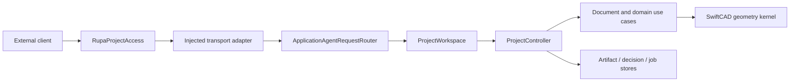
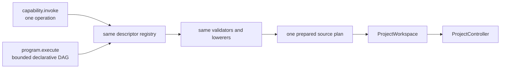

# Rupa Automation Protocol

This document records both the current development wire inventory and the
CADAPI-D target contract used by CLI, future MCP, and Agent clients. Public wire
DTOs are versioned independently from internal Swift types. Sections explicitly
marked **legacy implementation inventory** describe reachable code only; they
are non-normative and must not be used as the target Agent CAD API.

## Responsibility Boundary


```mermaid
flowchart LR
    Client["External client"] --> Access["RupaProjectAccess"]
    Access --> Transport["Injected transport adapter"]
    Transport --> Router["ApplicationAgentRequestRouter"]
    Router --> Workspace["ProjectWorkspace"]
    Workspace --> Controller["ProjectController"]
    Controller --> Domain["Document and domain use cases"]
    Controller --> Artifacts["Artifact / decision / job stores"]
    Domain --> Kernel["SwiftCAD geometry kernel"]
```

| Layer | Responsibility |
|---|---|
| External client | Chooses commands, supplies typed targets, and correlates request IDs. |
| `RupaProjectAccess` | Opens an explicit live or closed-project access session without owning project semantics. |
| Transport adapter | Moves bounded envelopes and preserves request/response correlation; it does not select another execution path on failure. |
| Application router | Resolves lifecycle and session routing, then delegates project work to the selected workspace. |
| `ProjectWorkspace` | Owns the open project session and is the only route from Agent requests to project authority. |
| `ProjectController` | Stages, validates, evaluates, publishes, and saves Product/CAD/Mesh state atomically. |
| Rupa document/domain use cases | Own source mutation, evaluation, selection, measurement, and domain semantics. |
| Artifact/decision/job stores | Own immutable derived results, authorized decisions, and managed external effects. |
| SwiftCAD geometry kernel | Owns geometry, topology, curves, surfaces, units, and generated analysis data. |

The transport layer is intentionally not the owner of project semantics. It only
carries the protocol. A transport failure never falls back to direct file
mutation, and save remains a separate explicit intent routed through the
application coordinator, workspace, and `ProjectController`.

## Transport

| Field | Contract |
|---|---|
| Transport | Local Unix domain socket. |
| Endpoint | A product-composition-owned `UnixSocketEndpoint` is injected into the adapter. The semantic protocol does not expose or choose a socket path. |
| Fallback | None. Endpoint resolution, connection, dispatch, or response failure is a typed failure and never changes project authority. |
| Encoding | UTF-8 JSON. |
| Message style | JSON-RPC-style envelopes with Rupa-specific method/result correlation. |
| Protocol version | `jsonrpc` must be `"2.0"`. |

## Current Envelope Contract (Legacy Inventory, Non-Normative)

### Request

```json
{
  "jsonrpc": "2.0",
  "id": "request-id",
  "method": "document.surfaceAnalysis",
  "params": {
    "sessionID": "00000000-0000-0000-0000-000000000001",
    "options": {
      "sampleDensity": "high"
    },
    "expectedGeneration": {
      "value": 7
    }
  }
}
```

### Success Response

```json
{
  "jsonrpc": "2.0",
  "id": "request-id",
  "method": "parameter.setExpression",
  "result": {
    "message": "Parameter height updated.",
    "commandName": "upsertParameter",
    "generation": {
      "value": 8
    },
    "didMutate": true,
    "diagnostics": []
  }
}
```

### Error Response

```json
{
  "jsonrpc": "2.0",
  "id": "request-id",
  "method": "command.apply",
  "error": {
    "code": "document.generationMismatch",
    "message": "The document has changed since the command was prepared."
  }
}
```

## Current Envelope Rules (Legacy Inventory, Non-Normative)

| Rule | Contract |
|---|---|
| Request ID | Clients choose `id`; responses echo the same value when a request was parsed. |
| Method | `method` is required on every request and every success response. |
| Success vs error | A response contains exactly one of `result` or `error`. |
| Method correlation | `result` must match the response method. A `parameter.setExpression` result is an `AutomationResult`. |
| Protocol version | Any value other than `"2.0"` is rejected. |
| Params object | Canonical requests include `params`. Empty-param methods use `{}`. |
| Strict top-level params | Unknown top-level keys inside `params` are rejected. |
| Transaction revision | Source-mutation requests encode `expectedTransactionRevision` as an object with a `value` integer. |
| Dependency identity | Artifact, validation, export, and job requests carry or resolve source-dependency/content identity and do not use revision as freshness. |
| Optional revision guard | `expectedTransactionRevision` may be omitted only when the client intentionally accepts the current source state; mutation results return the committed revision. |
| Mutation result context | Mutation commands return compact command receipts. To receive workspace bounds, scale, precision, grid, saved views, and merged diagnostics in the same round trip, append `describeDocument` as the final batch command. |
| Context query ordering | `describeDocument` must be the final command in a batch because its result describes the completed staged state. |

Wire schemas are declared in `RupaAgentProtocol` DTOs and fixtures. They do not
inherit an internal Codable shape implicitly. Reusing a value type requires an
explicit wire-schema/version decision and compatibility test.

## CADAPI-D Semantic Modeling Contract

CAD source mutation has one semantic operation vocabulary and exactly two
external invocation forms. This contract is fixed; the current implementation
has not completed the cutover.


```mermaid
flowchart LR
    Direct["capability.invoke\none operation"] --> Registry["same descriptor registry"]
    Program["program.execute\nbounded declarative DAG"] --> Registry
    Registry --> Compiler["same validators and lowerers"]
    Compiler --> Prepared["one prepared source plan"]
    Prepared --> Workspace["ProjectWorkspace"]
    Workspace --> Controller["ProjectController"]
```

| Form | Contract |
|---|---|
| `capability.invoke` | Invokes one registered semantic operation without requiring a program wrapper. Internally, eligible CAD source mutation is normalized to a one-node program and uses the same descriptor, validation, and lowerer as the complex form. |
| `program.execute` | Executes a bounded declarative DAG of those same operations. Nodes use request-local symbols, parameters, typed output references, and bounded pure expressions. The complete program lowers before mutation and publishes through at most one source transaction, evaluation, undo entry, and publication. |

Persistent `FeatureID`, `SceneNodeID`, component, instance, and pattern identities
are allocated by Rupa inside the staged authority boundary. Clients name only
request-local symbols. A successful receipt maps typed local outputs to stable
server identities and the exact committed project coordinates. A dry run does
not claim persistent identities.

The program form has no loops, conditionals, recursion, callbacks, file I/O, or
embedded general-purpose language. Repetition is expressed through registered
native pattern operations, so one pattern remains one semantic node regardless
of occurrence count. Before staging, the compiler enforces explicit limits for
wire bytes, decoded values and nesting, nodes, edges, parameters, local output
references, expression depth and count, lowered commands, expanded source and
evaluation work, and diagnostics. Every resolved operation in a CAD mutation
program must prove the source route and the aggregate source-mutation effect.

`RupaDomainFoundation` owns the generic operation, value, local-reference, DAG,
validation, and compiler contracts. The planned `RupaCADDomain` module owns the
concrete universal-CAD descriptors and lowerers. `RupaAutomation` owns the
binding-aware prepared source executor and retains raw feature-graph mutation as
an internal lowering substrate. `RupaAgentProtocol` owns wire DTOs, while
`RupaAgentRuntime` only decodes and dispatches them.

The versioned method families are:

| vNext method family | Contract |
|---|---|
| `capabilities.list` | Returns descriptors from the composed `CapabilityRegistry`; no static Agent catalog exists. |
| `capability.invoke` | Invokes one capability ID/version with canonical typed payload and effect-specific project context. CAD source operations use the CADAPI-D direct form above. |
| `program.execute` | Executes the CADAPI-D bounded DAG using the same registered operation definitions as the direct form. |
| `operations.progress` / `operations.cancel` | Observes or cancels long evaluation, import/export, render, or job effects. |
| `artifacts.read` | Reads bounded artifact metadata or a negotiated binary resource stream. |

The current development schema's lone `expectedGeneration` field is legacy.
For source mutation, the vNext outer request envelope carries one complete
`ProjectAuthorityCoordinate`: project ID, document generation, transaction
revision, publication sequence, and workspace revision. None of these fields is
replaced or dropped when either CAD invocation form is compiled. A committed
result reports the exact same complete coordinate shape. Evaluated results
separately report source dependency and evaluation snapshot identity.
Method-specific ergonomic endpoints may remain only as adapters to registered
capability IDs; they must not own separate handlers. Prepublication validation,
lowering, cancellation, source mutation, evaluation, or stale-coordinate failure
publishes no state. A response lost after publication reports the exact committed
coordinates and a must-not-retry outcome.

## Legacy Implementation Inventory (Non-Normative)

The Common Params, Methods, fixtures, and error codes below document the current
development implementation. In particular, `command.apply`,
`command.applyBatch`, raw `AutomationCommand.appendFeatureGraph`, and
caller-supplied persistent feature or scene identities are legacy implementation
details targeted for removal from Agent capability discovery, wire decoding, and
production CLI routing. Their presence below does not authorize them as
CADAPI-D operations and does not claim that the cutover is implemented.

## Common Params

| Params type | JSON keys |
|---|---|
| `EmptyParams` | none |
| `SessionGenerationParams` | `sessionID`, `expectedGeneration?` |
| `CreateDocumentParams` | `name`, `outputPath?` |
| `OpenDocumentParams` | `path` |
| `CloseDocumentParams` | `sessionID`, `expectedGeneration?`, `discardUnsavedChanges` |
| `ResetDocumentParams` | `sessionID`, `name`, `expectedGeneration?` |
| `ExecuteParams` | `sessionID`, `command`, `expectedGeneration?` |
| `ExecuteBatchParams` | `sessionID`, `batch` |
| `SetParameterExpressionParams` | `sessionID`, `name`, `expression`, `kind`, `defaults`, `expectedGeneration?` |
| `SelectionMeasurementParams` | `sessionID`, `query`, `expectedGeneration?` |
| `ResolveSnapParams` | `sessionID`, `point`, `options`, `expectedGeneration?` |
| `PolySplineMeshAnalysisParams` | `sessionID`, `sourceMesh`, `options`, `expectedGeneration?` |
| `SelectionTargetsParams` | `sessionID`, `targets`, `expectedGeneration?` |
| `SelectionDimensionEvaluationParams` | `sessionID`, `dimensionID?`, `expectedGeneration?` |
| `SurfaceAnalysisParams` | `sessionID`, `options`, `expectedGeneration?` |
| `SurfaceFramesParams` | `sessionID`, `queries`, `expectedGeneration?` |
| `SurfaceBoundaryContinuityCompatibilityParams` | `sessionID`, `target`, `reference`, `expectedGeneration?` |
| `ExportParams` | `sessionID`, `outputPath`, `expectedGeneration?`, `options`, `dryRun` |

## Methods

| Method | Params type | Result type | Mutates |
|---|---|---|---|
| `agent.capabilities` | `EmptyParams` | `[AgentCapabilityDescriptor]` | No |
| `agent.status` | `EmptyParams` | `AgentStatus` | No |
| `agent.cadInteractionQualityAssessment` | `EmptyParams` | `CADInteractionQualityAssessmentResult` | No |
| `sessions.list` | `EmptyParams` | `[WorkspaceSessionSummary]` | No |
| `document.create` | `CreateDocumentParams` | `AgentSessionOperationResult` | Creates a session and optionally a new file |
| `document.open` | `OpenDocumentParams` | `AgentSessionOperationResult` | Creates a session from a file |
| `document.close` | `CloseDocumentParams` | `AgentSessionOperationResult` | Removes a session |
| `document.reset` | `ResetDocumentParams` | `AgentSessionOperationResult` | Yes; undoable |
| `history.undo` | `SessionGenerationParams` | `AgentSessionOperationResult` | Yes |
| `history.redo` | `SessionGenerationParams` | `AgentSessionOperationResult` | Yes |
| `command.apply` | `ExecuteParams` | `AutomationResult` | Depends on command |
| `command.applyBatch` | `ExecuteBatchParams` | `AgentBatchResult` | Depends on the validated homogeneous batch effect |
| `parameter.setExpression` | `SetParameterExpressionParams` | `AutomationResult` | Yes |
| `document.parameters` | `SessionGenerationParams` | `ParameterListResult` | No |
| `document.evaluate` | `SessionGenerationParams` | `EvaluationSnapshot` | No |
| `document.measure` | `SessionGenerationParams` | `MeasurementResult` | No |
| `selection.measure` | `SelectionMeasurementParams` | `CADAgentMeasurementQueryResult` | No |
| `snap.resolve` | `ResolveSnapParams` | `SnapResolutionResult` | No |
| `document.constructionPlaneSummary` | `SessionGenerationParams` | `ConstructionPlaneSummaryResult` | No |
| `document.designDisplaySnapshot` | `SessionGenerationParams` | `DesignDisplaySnapshotResult` | No |
| `document.patternArraySummary` | `SessionGenerationParams` | `PatternArraySummaryResult` | No |
| `document.meshSummary` | `SessionGenerationParams` | `MeshSummaryResult` | No |
| `document.polySplineMeshAnalysis` | `PolySplineMeshAnalysisParams` | `PolySplineMeshAnalysisResult` | No |
| `document.sketchEntitySummary` | `SessionGenerationParams` | `SketchEntitySummaryResult` | No |
| `document.sketchDimensionSummary` | `SelectionTargetsParams` | `SketchDimensionSummaryResult` | No |
| `selection.dimensionEvaluation` | `SelectionDimensionEvaluationParams` | `SelectionDimensionEvaluation` | No |
| `document.curveAnalysis` | `SessionGenerationParams` | `CurveAnalysisResult` | No |
| `document.topologySummary` | `SessionGenerationParams` | `TopologySummaryResult` | No |
| `document.booleanEvaluationPlan` | `BooleanEvaluationPlanParams` | `BooleanEvaluationPlanResult` | No |
| `document.objectDimensionSummary` | `SelectionTargetsParams` | `ObjectDimensionSummaryResult` | No |
| `document.surfaceSourceSummary` | `SessionGenerationParams` | `SurfaceSourceSummaryResult` | No |
| `document.surfaceAnalysis` | `SurfaceAnalysisParams` | `SurfaceAnalysisResult` | No |
| `document.surfaceFrames` | `SurfaceFramesParams` | `SurfaceFrameResult` | No |
| `document.surfaceContinuitySummary` | `SessionGenerationParams` | `SurfaceContinuityResult` | No |
| `document.surfaceBoundaryContinuityCompatibility` | `SurfaceBoundaryContinuityCompatibilityParams` | `SurfaceBoundaryContinuityCompatibilityResult` | No |
| `selection.selectTargets` | `SelectionTargetsParams` | `SelectionStateResult` | No |
| `selection.selectReferences` | `SelectionReferencesParams` | `SelectionStateResult` | No |
| `document.save` | `SessionGenerationParams` | `SaveResult` | Persists file state |
| `document.export` | `ExportParams` | `ExportResult` | Writes export artifact unless `dryRun` is true |

`document.close`, `document.reset`, `history.undo`, and `history.redo` reject a
missing `expectedGeneration` even though the shared decoded field is optional.
Closing a dirty session also requires `discardUnsavedChanges: true`.

## Representative Fixtures

Stored fixtures live under `RupaKit/Tests/RupaAgentTests/Fixtures/AutomationProtocol`.
The `AgentProtocolFixtureFileTests` runner decodes each file directly from disk so external clients can use the same JSON examples without depending on Swift encoders.

### Empty Params

```json
{
  "jsonrpc": "2.0",
  "id": "status-1",
  "method": "agent.status",
  "params": {}
}
```

### Parameter Expression Mutation

```json
{
  "jsonrpc": "2.0",
  "id": "parameter-1",
  "method": "parameter.setExpression",
  "params": {
    "sessionID": "00000000-0000-0000-0000-000000000001",
    "name": "height",
    "expression": "width * 2",
    "kind": "length",
    "defaults": {
      "lengthUnit": "millimeter",
      "angleUnit": "degree"
    },
    "expectedGeneration": {
      "value": 2
    }
  }
}
```

### Snap Resolution

```json
{
  "jsonrpc": "2.0",
  "id": "snap-1",
  "method": "snap.resolve",
  "params": {
    "sessionID": "00000000-0000-0000-0000-000000000001",
    "point": {
      "x": 0.012,
      "y": 0.024
    },
    "options": {
      "usesGrid": true,
      "usesObjects": false,
      "gridIntervalMeters": 0.001,
      "objectSearchRadiusMeters": 0.002,
      "maximumCandidateCount": 8
    },
    "expectedGeneration": {
      "value": 2
    }
  }
}
```

### Surface Frames

```json
{
  "jsonrpc": "2.0",
  "id": "surface-frame-1",
  "method": "document.surfaceFrames",
  "params": {
    "sessionID": "00000000-0000-0000-0000-000000000001",
    "queries": [
      {
        "faceID": "face-1",
        "u": 0.25,
        "v": 0.75
      }
    ],
    "expectedGeneration": {
      "value": 2
    }
  }
}
```

## Error Codes

| Code | Meaning |
|---|---|
| `agent.unavailable` | The automation endpoint is not available. |
| `agent.connectionFailed` | The client could not connect or response correlation failed. |
| `document.openInApp` | The selected project authority is already held by the app; callers must use the live access session rather than a direct-file override. |
| `document.generationMismatch` | `expectedGeneration` did not match the current document generation. |
| `document.loadFailed` | A document could not be loaded. |
| `document.saveFailed` | A document could not be saved. |
| `command.invalid` | The request, method, params, or command payload is invalid. |
| `command.failed` | The command was valid but failed while executing. |
| `session.notFound` | The requested open document session was not found. |
| `reference.unresolved` | A typed target or stable reference could not be resolved. |
| `evaluation.failed` | Document evaluation failed. |
| `export.failed` | Export failed. |
