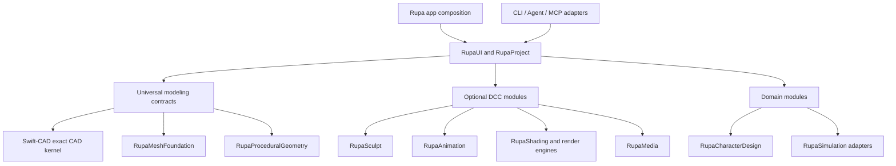

# Blender 5.1 to Rupa Capability Gap

## Status

| Field | Value |
|---|---|
| Snapshot date | 2026-07-12 |
| Blender reference | Blender 5.1 official manual (`latest` on the snapshot date) |
| Rupa evidence boundary | `RupaKit/Sources`, the macOS app target, Swift-CAD sources, tests, and current capability documents |
| Comparison unit | User-visible capability or operation family, not individual properties, manual introduction pages, or aliases |
| Included states | Partial and missing Blender capabilities; implemented Rupa-only CAD capabilities are not treated as gaps |

This inventory answers one precise question: what Blender can do that Rupa cannot
currently do end to end. A capability is not considered present merely because a
similarly named type exists. It must have source ownership, evaluation, selection,
UI or a documented non-UI route, Automation/Agent access where mutation is
appropriate, persistence, undo/redo, diagnostics, and verification for its claimed
case set.

The Blender manual currently contains more than 2,000 documented descendants and
more than 700 under Modeling alone. This document groups individual nodes and
properties under their runtime system when Rupa lacks that entire runtime. For
example, every Geometry Nodes node is covered by the Geometry Nodes rows rather
than copied into hundreds of redundant rows.

## Legend

| State | Meaning |
|---|---|
| `Partial` | Rupa can produce a related result for a narrower case set, but does not provide Blender-equivalent behavior. |
| `Internal` | Data or lower-level support exists, but there is no complete user and Agent workflow. |
| `Missing` | No production implementation path was found. |
| `Boundary` | The capability is still missing, but should live outside Swift-CAD in a higher Rupa module. |

## Executive Map

| Blender capability area | Rupa state | Largest missing boundary | Intended owner |
|---|---|---|---|
| UI and editor framework | Partial | Configurable workspaces, editor areas, mode system, operator redo/search, custom keymaps | RupaUI / RupaProject |
| Scenes and objects | Partial | Multiple scenes, view layers, collections, object-type ecosystem, constraints | RupaCore / domain modules |
| Polygon mesh modeling | Partial | General mutable mesh edit mode and complete topology operations | RupaMeshFoundation above Swift-CAD |
| Curves and NURBS surfaces | Partial | General curve/surface object model, broad topology editing, hair curves | Swift-CAD + RupaCore |
| Modifier stack | Partial | Generic ordered non-destructive modifier stack and most modifiers | RupaCore + geometry backends |
| Geometry Nodes | Missing | Procedural node graph, fields, attributes, zones, tools, baking | RupaProceduralGeometry |
| Sculpting and painting | Missing | Sculpt, texture paint, vertex paint, weight paint, grooming | RupaSculpt / RupaCharacterDesign |
| Grease Pencil | Missing | Layered 2D drawing and animation object model | RupaDrawing / RupaAnimation |
| Animation and rigging | Missing | Keyframes, F-curves, armatures, constraints, shape keys, NLA | RupaAnimation / RupaCharacterDesign |
| Physics and simulation | Missing | Rigid body, cloth, soft body, fluids, particles, force fields, bake/cache | RupaSimulation adapters |
| Rendering and shading | Internal | Render engines, cameras/lights, shader graph, textures, color management | RupaRendering / optional engines |
| Compositing, tracking, video | Missing | Image compositor, camera tracking, masks, sequencer and audio | Optional RupaMedia modules |
| Assets, files, and pipeline | Partial | Asset libraries, linking, overrides, broad DCC exchange semantics | RupaProject / RupaExchange |
| Scripting, extensions, and Agent access | Partial | Embedded scripting, runtime extension loader, custom operators/nodes/editors, MCP, compact procedural programs | RupaProject / plugin host / Agent adapters |
| Production and platform | Partial | Cross-platform app, GPU shaded scene, broad dependency graph, recovery, distributed jobs | App / RupaProject / RupaRendering |

## Current Rupa Baseline

The following existing Rupa capabilities prevent false negatives in the gap list:

- source-owned sketches, parameters, feature graph, incremental evaluation, B-rep
  and mesh display;
- object, face, edge, vertex, region, sketch-entity, curve-control-point, and
  surface-reference selection for supported generated topology;
- line, circle, arc, cubic Bezier spline, rectangle, polygon, slot, construction
  plane, dimensions, snapping, saved views, sections, and drawing projections;
- extrude, revolve, sweep, loft, constrained Boolean subsets, face/edge offsets,
  face knife/delete/draft, narrow chamfer/fillet, direct B-spline surfaces, and
  PolySpline reconstruction subsets;
- scene-node hierarchy, component definitions/instances, rectangular/radial/curve
  pattern arrays, transforms, visibility, lock state, and basic material metadata;
- typed Automation, CLI, socket Agent protocol, atomic batches, capability
  discovery, generation checks, undo/redo, diagnostics, and native `.swcad`
  persistence;
- mesh-exchange import for `.step`, `.iges`, `.stl`, `.3mf`, `.obj`, `.dxf`,
  `.svg`, `.usd`, `.usda`, `.usdc`, and `.usdz` under their documented subsets;
  `.glb` and `.pdf` are export-only.

## 1. Interface and Editors

| Blender feature | Rupa state | Exact gap |
|---|---|---|
| Configurable workspaces and editor areas | Missing | No arbitrary split/join editor layout, per-workspace editor composition, or saved workspace layouts. |
| Multiple windows and multi-monitor editing | Missing | The product is a single-window workspace rather than Blender's detachable editor/window model. |
| Object/Edit/Sculpt/Paint/Pose mode system | Partial | Rupa has selection scopes and command states, but no general data-type mode framework with mode-specific ownership and tool registries. |
| Operator search, repeat, redo-last panel, presets, macros | Partial | Typed commands and undo exist; general searchable operators, adjustable last operation, reusable operator presets, and macro authoring do not. |
| Custom keymaps and pie menus | Missing | Keyboard routing is compiled behavior; users cannot define keymaps, modal maps, pie menus, or workspace-specific bindings. |
| Tool shelf, context menus, custom gizmos | Partial | Rupa has fixed palettes and CAD affordances; there is no runtime tool/gizmo registration surface. |
| Drag-and-drop data routing | Missing | No generic editor-aware drag/drop for objects, materials, images, media, or assets. |
| Image Editor and UV Editor | Missing | No image inspection/paint surface or UV editing workspace. |
| Compositor, Texture Nodes, Geometry Node Editor, Shader Editor | Missing | No corresponding node runtimes or editors. |
| Video Sequencer and Movie Clip Editor | Missing | No media timeline, clip, tracking, or masking editors. |
| Dope Sheet, Timeline, Graph Editor, Drivers Editor, NLA Editor | Missing | No animation data or animation editors. |
| Text Editor and Python Console | Missing | No embedded source editor or Python runtime. |
| Info Editor and operator log | Partial | Rupa has diagnostics/log views, but no replayable operator stream or Python command echo. |
| Outliner | Partial | Browser/scene hierarchy exists; collections, view layers, data-block modes, orphan data, library overrides, and restriction columns are absent. |
| Properties Editor | Partial | Inspector exists for supported CAD contexts; no dynamic property tabs spanning every object, render, world, physics, animation, and data type. |
| File Browser | Partial | Native open/save/import/export exists; no reusable browser editor for linked data, previews, assets, and media. |
| Asset Browser | Missing | No catalog, tag, preview, drag/drop, import-method, or reusable asset library system. |
| Spreadsheet Editor | Missing | No generic geometry/attribute/domain table inspector. |
| Preferences, themes, input devices, add-on settings | Partial | Product settings exist only where explicitly implemented; no Blender-scale preferences or extension-owned settings model. |

## 2. Scenes, Objects, and Layout

| Blender feature | Rupa state | Exact gap |
|---|---|---|
| Multiple scenes | Missing | A document owns one product scene graph; there are no alternate scenes sharing data-blocks. |
| View layers and layer collections | Missing | Saved views store camera/display state, but do not provide inclusion/exclusion, holdout, indirect-only, or render-layer semantics. |
| Collections | Missing | Scene hierarchy and components are not a many-to-many collection organization system. |
| Complete Blender object types | Partial | Mesh-like CAD bodies, sketches, surfaces, components, planes, and section objects exist. Metaball, Text, Point Cloud, Volume, Grease Pencil, Armature, Lattice, Camera, Light, Light Probe, Speaker, Force Field, Empty/Image, and collection-instance object contracts do not. |
| Object origins and origin-edit workflows | Partial | Local transforms exist; explicit origin editing, geometry-to-origin, origin-to-cursor, and mass/volume origin operations do not. |
| Transform orientation, pivot, cursor, proportional edit | Partial | CAD planes, snap references, and transform handles exist; arbitrary transform orientations, pivot policies, 3D cursor workflows, and proportional editing do not. |
| Apply/freeze transforms and deltas | Missing | No Blender-equivalent apply location/rotation/scale, visual transform, transform delta, or make-instances-real operations. |
| Generic parenting and vertex/bone parenting | Partial | SceneNode hierarchy exists, but general keep-transform parenting, vertex parenting, bone parenting, and parent inverse workflows do not. |
| Object constraints | Missing | No general constraint stack for object transforms. |
| Duplicate linked and shared data-block editing | Partial | Component instances share definitions, but there is no general linked duplicate for every object data type. |
| Join, separate, convert, link/transfer data | Partial | Narrow Boolean/component/explode paths exist; generic object join/separate/conversion and bulk data linking are absent. |
| Per-viewport and per-render visibility | Partial | Visibility and lock exist; viewport-local hide, render disable, holdout, shadow catcher, and ray visibility channels do not. |
| Custom properties | Internal | Flexible object/semantic payload storage exists, but no general user-authored custom-property UI, animation, drivers, or scripting API. |

## 3. Polygon Mesh Modeling

| Blender feature | Rupa state | Exact gap |
|---|---|---|
| General mesh Edit Mode/BMesh-style mutable topology | Missing | Imported/evaluated meshes are display or source inputs, not a complete source-owned polygon modeling substrate with stable editable topology. |
| Mesh primitives | Partial | Box and cylinder solid workflows exist. Plane, mesh circle, cone, grid, UV sphere, Icosphere, torus, monkey, and image-as-plane primitives are missing. |
| Mesh selection operations | Partial | Element scopes and rectangle selection exist. Select Mirror, Random, Checker Deselect, More/Less, Similar, All by Trait, Linked, Loops/Rings, Sharp Edges, Side of Active, shortest path, and attribute selection are missing. |
| Mesh transforms | Partial | Whole occurrences transform and narrow subobjects move. To Sphere, Shear, Bend, Push/Pull, Warp, Randomize, Shrink/Fatten, Skin Resize, texture-space transforms, and proportional component transforms are missing. |
| Mesh-level operations | Partial | Narrow knife, delete, Boolean, offset, and CAD direct edits exist. Generic Mirror, Duplicate, Extrude, Merge, Split, Separate, Bisect, Knife Project, Knife Topology, Convex Hull, Symmetrize, Snap to Symmetry, Sort Elements, Clean Up, and Dissolve are missing or not general. |
| Vertex operations | Partial | Narrow generated-vertex and source-CV moves exist. Vertex extrude, extrude-to-cursor, bevel, make edge/face, connect path/pairs, rip/fill/extend, slide, smooth/Laplacian smooth, crease, shape blending, hooks, groups, and vertex parenting are missing. |
| Edge operations | Partial | Narrow chamfer/fillet/offset exist. Edge extrude, bridge loops, screw, subdivide, edge-ring subdivide, un-subdivide, rotate edge, edge slide, loop cut/slide, and generic edge data are missing. |
| Face operations | Partial | Face offset/delete/draft/knife subsets exist. Face extrude variants, inset, poke, triangulate, triangles-to-quads, solidify, wireframe, fill, grid fill, beautify, generic intersect, weld-into-face, smooth/flat face shading, and face data are missing. |
| Vertex groups and weight layers | Missing | No generic deform/selection groups or weight data model. |
| Generic attributes and color attributes | Missing | No point/edge/face/corner attribute domains, named attributes, attribute propagation, or color layers. |
| Normals and smoothing | Missing | No source-owned split normals, custom normals, auto smooth by angle, weighted normals, face strength, sharp-edge, or flat/smooth shading workflow. |
| UV maps and texture space | Missing | No seams, unwrap, project, pack, pin, stitch, relax, UDIM, UV layers, or UV distortion inspection. |
| Mesh analysis | Partial | CAD validation and PolySpline suitability diagnostics exist; overhang, thickness, intersections, distortion, sharpness, non-manifold, and general mesh-statistics overlays are incomplete. |
| Remeshing and retopology | Missing | No voxel/quad remesh, shrinkwrap retopology, snapping workflow, multires retopology, or topology transfer. |

## 4. Curves, Surfaces, and Other Geometry Types

| Blender feature | Rupa state | Exact gap |
|---|---|---|
| General Curve object | Partial | Rupa has analytic sketch curves, cubic Bezier source, bridge curves, and B-spline evaluation. It lacks a unified Poly/Bezier/NURBS curve object with arbitrary 3D splines, multiple splines, cyclic state, tilt, per-point radius, soft-body/path data, and object-level bevel/taper. |
| Curve primitives | Partial | Line, circle, arc, rectangle, polygon, spline, and slot exist as CAD sketches. Bezier circle, NURBS circle/path, path, and broad 3D curve primitives are not equivalent. |
| Curve editing operations | Partial | Reverse, rebuild, extend, join/unjoin, split, trim, cut, offset, bridge, CV insert/move/slide, and continuity subsets exist. Generic spin, duplicate, separate, change spline type, decimate, dissolve, arbitrary segment creation, tilt, radius/weight smoothing, hooks, and curve parenting are missing. |
| Curve geometry styling | Missing | No curve bevel depth/object, extrusion, taper object, fill mode, resolution policy, caps, text-on-curve, or path-animation contract. |
| Curves (new) and hair curve object | Missing | No scalable curve attribute object used for hair, procedural grooming, and surface attachment. |
| NURBS surface object | Partial | Direct rational B-spline sheets, CV/weight/knot/span/trim editing, UVN frames, and continuity readback exist. Blender-equivalent surface primitives, arbitrary multi-spline surface edit mode, broad extrusion/spin/subdivide, cyclic directions, and general joined surface topology are incomplete. |
| Metaballs | Missing | No implicit blob primitives, family resolution, threshold, stiffness, or negative elements. |
| Text objects | Missing | No editable font/text layout, extrusion/bevel, text boxes, font files, text-on-curve, or geometry conversion. |
| Point clouds | Missing | No source-owned point-cloud object, attributes, selection, edit tools, or rendering. |
| Volumes/OpenVDB | Missing | No sparse volume grids, volume object, VDB import, density/temperature attributes, or viewport/render integration. |
| Empties and image references | Missing | Construction geometry is not a general non-rendering helper/image-reference object system. |

## 5. Modifier Stack

Rupa's parametric feature graph is not a generic Blender modifier stack. It can
serve as the source of a future non-destructive operation graph, but modifier
ordering, per-object evaluation, viewport/render toggles, edit-cage behavior,
apply/copy, and runtime registration are missing.

| Blender modifier family | Rupa state | Missing modifiers or parity gaps |
|---|---|---|
| Edit | Missing | Data Transfer, Mesh Cache, Mesh Sequence Cache, UV Project, UV Warp, Vertex Weight Edit, Vertex Weight Mix, Vertex Weight Proximity. |
| Generate | Partial | Array has pattern-array subsets; Bevel and Boolean have narrow CAD subsets; Screw has Revolve-like coverage. Array Legacy, Build, Curve to Tube as a modifier, Decimate, Edge Split, Mask, Mesh to Volume, Mirror, Multiresolution, Remesh, Scatter on Surface, Skin, Solidify, Subdivision Surface, Triangulate, Volume to Mesh, Weld, and Wireframe are missing. |
| Deform | Missing | Armature, Cast, Curve, Displace, Hook, Laplacian Deform, Lattice, Mesh Deform, Shrinkwrap, Simple Deform, Smooth, Corrective Smooth, Laplacian Smooth, Surface Deform, Volume Displace, Warp, Wave. |
| Normals | Missing | Normal Edit, Weighted Normal, Smooth By Angle. |
| Physics | Missing | Cloth, Collision, Dynamic Paint, Explode, Fluid, Ocean, Particle Instance, Particle System, Soft Body. |
| Geometry Nodes modifier | Missing | No procedural node-tree modifier or node-group interface. |

## 6. Geometry Nodes and Procedural Modeling

Every node in the official categories below is missing because Rupa has no
Geometry Nodes graph runtime. A few final shapes can be produced through typed
CAD commands, but that is not node-graph parity.

| Blender feature | Rupa state | Exact gap |
|---|---|---|
| Node graph runtime | Missing | Typed sockets, node groups, lazy fields, geometry sets, anonymous/named attributes, domain adaptation, evaluation scheduling, dependency tracking, and versioned node definitions. |
| Inspection and debugging | Missing | Viewer, spreadsheet integration, socket inspection, warnings, timings, and graph diagnostics. |
| Instances | Partial | Component instances and pattern arrays exist; field-driven instance-on-points, realize, per-instance attributes, and arbitrary geometry-set instances do not. |
| Baking and zones | Missing | Bake nodes, Simulation Zone, Repeat Zone, For Each Geometry Element Zone, cache identity, and invalidation. |
| Node-based tools and gizmos | Missing | No node-authored modal tools or graph-defined viewport gizmos. |
| Node categories | Missing | Input, Output, Attribute, Geometry, Curve, Grease Pencil, Instances, Mesh, Point, Volume, Color, Texture, Utilities, Group, Generate, Hair, and Normals nodes. |
| Imported data nodes | Missing | Node-time CSV, OBJ, PLY, STL, text, image, and OpenVDB ingestion. |
| Procedural material assignment | Missing | Field-driven material selection/index/set/replace nodes. |

## 7. Sculpting and Painting

| Blender feature | Rupa state | Exact gap |
|---|---|---|
| Sculpt Mode | Missing | Brush engine, dynamic topology, multires sculpt, voxel remesh, masks, face sets, automasking, symmetry, radial symmetry, pose/elastic/cloth brushes, mesh/cloth/color filters, gesture trim/hide/mask, and sculpt transforms. |
| Texture Paint | Missing | Image texture slots, 3D projection paint, 2D image paint, clone, smear, soften, masks, stencils, bleed, and paint-layer workflow. |
| Vertex Paint | Missing | Color attributes, blend brushes, gradients, sampling, and face/vertex masking. |
| Weight Paint | Missing | Vertex groups, deform weights, auto normalize, multipaint, locks, mirror, gradients, and bone selection. |
| Curves Sculpting/grooming | Missing | Selection Paint, Add/Delete/Density, Comb, Snake Hook, Grow/Shrink, Pinch, Puff, Smooth, Slide, surface attachment, guides, and interpolation. |
| Brush asset system | Missing | Reusable brush assets, texture/mask assets, falloff curves, tablet pressure/tilt, and per-mode brush libraries. |

## 8. Grease Pencil

| Blender feature | Rupa state | Exact gap |
|---|---|---|
| Grease Pencil object and layered data | Missing | Layers, layer groups, frames, drawings, strokes, points, onion skinning, masks, and material slots. |
| Draw/Edit/Sculpt/Vertex Paint/Weight Paint modes | Missing | No corresponding stroke tools, selection, interpolation, sculpt, paint, or weights. |
| Grease Pencil primitives | Missing | Stroke, line, polyline, arc, curve, box, circle, and annotation-style creation as animatable drawings. |
| Multiframe and animation | Missing | Multiframe edit, keyframe exposure, interpolation, breakdown, duplication, and cleanup. |
| Grease Pencil modifiers | Missing | Generate, Deform, Color, and Edit modifier families, including line art workflows. |
| Visual effects | Missing | Blur, Colorize, Flip, Glow, Pixelate, Rim, Shadow, Swirl, and Wave Distortion. |
| Grease Pencil materials and render integration | Missing | Stroke/fill materials, texture/style controls, depth ordering, lights, and render passes. |

## 9. Animation and Rigging

| Blender feature | Rupa state | Exact gap |
|---|---|---|
| Animatable property system | Missing | Property paths, keyframe insertion, interpolation, extrapolation, keying sets, and per-property animation state. |
| Timeline, Dope Sheet, Graph Editor | Missing | Playback, scrubbing, channels, key editing, F-curves, handles, modifiers, samples, and ghosting. |
| Actions and NLA | Missing | Reusable actions, action slots, strips, tracks, blending, extrapolation, transitions, and action constraints. |
| Drivers | Missing | Driver variables, expressions, dependencies, scripted relationships, and Drivers Editor. |
| Markers and motion paths | Missing | Timeline/camera markers, path calculation, display, and editing. |
| Armatures and bones | Missing | Bone hierarchy, collections, edit/pose modes, roll, envelopes, B-Bones, custom shapes, layers/selection sets, and pose transforms. |
| Skinning | Missing | Armature deform, automatic/envelope weights, vertex-group binding, weight normalization, and deformation evaluation. |
| IK and rig controls | Missing | Inverse Kinematics, Spline IK, pole targets, IK/FK workflows, control rigs, and pose libraries. |
| Constraints | Missing | Motion Tracking constraints; Copy/Limit Location, Rotation, Scale and Transforms; Maintain Volume and Transform Cache; Clamp/Damped/Locked/Track To; IK, Spline IK, Stretch To; Action, Armature, Child Of, Floor, Follow Path, Geometry Attribute, Pivot, and Shrinkwrap. |
| Lattice deformation | Missing | Lattice object, edit mode, deformation modifier, and animation. |
| Shape keys | Missing | Basis/relative/absolute keys, interpolation, vertex groups, drivers, corrective shapes, and propagation. |

## 10. Physics and Simulation

| Blender feature | Rupa state | Exact gap |
|---|---|---|
| Rigid body dynamics | Missing | Active/passive bodies, collision shapes, mass, friction, restitution, damping, sleeping, deactivation, worlds, collections, and cache. |
| Rigid body constraints | Missing | Fixed, Point, Hinge, Slider, Piston, Generic, Generic Spring, and Motor constraints. |
| Cloth | Missing | Physical properties, pressure, sewing, pinning, collisions/self-collision, field weights, cache, and bake. |
| Soft body | Missing | Goals, springs/edges, aerodynamics, plasticity, self-collision, solver, forces, cache, and bake. |
| Fluid/gas/liquid | Missing | Domain/flow/effector roles, adaptive domains, gas noise/fire/smoke, liquids, viscosity/diffusion, particles, meshing, guides, cache, and materials. |
| Particle systems | Missing | Emitters, Newtonian/keyed/boid/fluid physics, children, render modes, force fields, texture influence, particle edit, and legacy hair. |
| Dynamic Paint | Missing | Canvas/brush roles, paint/wetmap/displace/waves surfaces, effects, cache, and output maps. |
| Force fields | Missing | Gravity plus Boid, Charge, Curve Guide, Drag, Fluid Flow, Force, Harmonic, Lennard-Jones, Magnetic, Texture, Turbulence, Vortex, and Wind fields. |
| Collision system | Missing | Shared collision objects, thickness, damping, friction, collections, and solver integration. |
| Simulation baking | Missing | Deterministic cache locations, bake/free/rebake, frame ranges, dependency invalidation, and portable artifacts. |
| Simulation Nodes | Missing | Geometry-node simulation zones and state caching. |

Blender physics is primarily a DCC/VFX simulation stack. Matching it would not
by itself satisfy engineering CFD, FEA, thermal, acoustics, or turbomachinery
validation. Those require `RupaSimulation` adapters, explicit units and boundary
conditions, solver provenance, convergence evidence, and artifact identity.

## 11. Rendering, Shading, Cameras, and Lighting

| Blender feature | Rupa state | Exact gap |
|---|---|---|
| Production render engine | Missing | No EEVEE-equivalent realtime PBR renderer or Cycles-equivalent path tracer. |
| Workbench viewport shading | Partial | Rupa renders CAD projections, fills, edges, overlays, and identity picking, but lacks Blender's solid/material/rendered modes, MatCaps, cavity, shadows, studio lights, x-ray, and object-color modes. |
| Camera objects | Missing | Viewport/saved-view cameras are not scene camera objects with lens, sensor, shifts, clipping, depth of field, panorama, stereo, safe areas, and render selection. |
| Light objects and world | Missing | Point, Sun, Spot, Area lights, world/environment lighting, HDRI, light linking, shadow controls, and light groups. |
| Light probes | Missing | Reflection cubemaps, irradiance volumes, planar probes, and baking. |
| Material authoring | Internal | Base color, metallic, roughness, opacity, library storage, and bindings exist. There is no complete material editor, texture inputs, layered BSDFs, volume/displacement, subsurface, anisotropy, thin film, or shader compilation. |
| Shader Nodes | Missing | Input, Output, Shader, Texture, Color, Vector, Converter, Script, and Group node families. |
| Texture system | Missing | Image/procedural textures, sampling, mapping, UDIM, generated coordinates, baking, packing, and color-space metadata. |
| Render layers and passes | Missing | View layers, combined/depth/normal/vector/UV/object/material/cryptomatte passes, AOVs, denoising data, and multilayer output. |
| Color management | Missing | OpenColorIO configuration, display/view transforms, exposure/gamma, sequencer color space, HDR display, and file color spaces. |
| Render baking | Missing | Texture/light/shadow/normal/displacement/AO baking and cage workflows. |
| Freestyle and NPR line rendering | Missing | Line sets/styles, edge types, modifiers, scripting, and render-layer integration. |
| GPU/CPU render scheduling | Missing | Device selection, tile/sampling controls, adaptive sampling, denoise, checkpoint/resume, background render, and render-farm contracts. |
| Image and animation output | Partial | Rupa exports drawings and exchange geometry; it does not render stills/animation sequences with frame ranges, codecs, metadata, and audio. |

## 12. Compositing, Tracking, Masking, Video, and Audio

| Blender feature | Rupa state | Exact gap |
|---|---|---|
| Compositor runtime | Missing | Node graph, realtime/full-frame execution, image kernels, caching, viewer/backdrop, groups, and render-pass integration. |
| Compositor node families | Missing | Input, Output, Color, Creative, Filter, Keying, Mask, Tracking, Texture, Transform, Utilities, Camera/Lens Effects, Group, and Layout nodes. |
| Motion tracking | Missing | Point and planar tracks, camera/object solve, lens calibration, reconstruction, stabilization, tracking cleanup, and scene setup. |
| Masking/rotoscoping | Missing | Mask layers, splines, feathering, parenting to tracks, animation, and compositor/sequencer integration. |
| Video Sequencer | Missing | Movie/image/audio/scene strips, channels, retiming, cuts, transitions, effects, adjustment layers, modifiers, proxies, cache, multicam, scopes, and timeline editing. |
| Storyboarding | Missing | Scene strips, timeline boards, editorial iteration, and Grease Pencil integration. |
| Audio | Missing | Speaker objects, waveform display, mixing, volume/pitch/pan animation, synchronization, scrubbing, and audio rendering. |

## 13. Assets, Files, Exchange, and Pipeline

| Blender feature | Rupa state | Exact gap |
|---|---|---|
| Data-block system | Partial | Rupa has typed document regions and stable IDs, but no generic reusable data-block ownership, user counts, fake users, orphan purge, remapping, or per-data-block linking. |
| Append and Link | Missing | No cross-document append/link of selected object, collection, material, action, node group, world, or other data. |
| Library Overrides | Missing | No editable override hierarchy, resync, conflict resolution, or linked-production asset workflow. |
| Asset libraries | Missing | No catalogs, tags, previews, bundles, local/remote libraries, import methods, or drag/drop asset use. |
| Pack/unpack and external file path management | Missing | No broad dependency packing, path remapping, missing-file search, relative/absolute path tooling, or media relinking. |
| Autosave, recovery, backup versions | Missing | Native save and atomic writes exist; Blender-style autosave, recover last session, recover autosave, and versioned backups were not found. |
| Alembic | Missing | No `.abc` animated geometry/cache import or export. |
| FBX | Missing | No FBX scene, mesh, armature, animation, camera, light, or material exchange. |
| PLY | Missing | No Stanford PLY import/export or Geometry Nodes import. |
| BVH | Missing | No motion-capture skeleton/animation import/export. |
| glTF 2.0 / GLB | Partial | GLB export exists; glTF/GLB import, scene hierarchy, PBR textures/material semantics, skinning, morph targets, cameras, lights, and animation do not. |
| USD family | Partial | USD/USDA/USDC/USDZ mesh exchange exists. Blender-equivalent scene hierarchy, variants, references/payloads, instancing, materials, skeletal animation, blend shapes, cameras, lights, volumes, and broad schema coverage do not. |
| OBJ and STL | Partial | Mesh exchange exists under strict subsets; Blender's broader object/material/group/custom-normal and import option coverage is not complete. |
| SVG and PDF | Partial | Rupa supports mesh/projection exchange. Blender's Grease Pencil stroke/fill SVG and animated drawing semantics are absent; PDF is drawing export only. |
| Images, video, audio, fonts, OpenVDB | Missing | No media data-block ingestion and lifecycle equivalent to Blender. |
| `.blend` interoperability | Missing | Rupa cannot read, write, append, or link Blender native data. |

## 14. Scripting, Extensions, Automation, and Agent Access

| Blender feature | Rupa state | Exact gap |
|---|---|---|
| Embedded Python API (`bpy`) | Missing | No reflective scene/data/property API, operator API, context override, handlers, timers, draw callbacks, or embedded scripts. |
| BMesh API | Missing | No scriptable mutable mesh topology API. |
| Custom operators, panels, menus, gizmos, editors | Missing | Runtime extensions cannot register new UI and interaction types. |
| Add-ons and extension repository | Missing | No install/enable/disable/update/signature/permission/dependency lifecycle for third-party extensions. |
| Custom importers/exporters and render engines | Missing | No stable plugin contracts for exchange codecs or external rendering engines. |
| Application templates | Missing | No distributable startup file, workspace, keymap, theme, and extension bundle. |
| Command-line background operation | Partial | Rupa CLI can mutate/evaluate/export documents, but there is no general script execution, animation render, simulation bake, or arbitrary operator invocation. |
| Typed Automation and atomic batch | Implemented baseline | Rupa is stronger than a raw UI macro here for supported commands; it does not close feature gaps for commands that do not exist. |
| Agent capability discovery | Partial | 158 static universal descriptors plus injected domain descriptors exist, but future render/sculpt/animation/simulation systems have no descriptors because their source contracts do not exist. |
| MCP bridge | Missing | The protocol names MCP as a consumer, while `ISSUES.md` records that no bridge is implemented. |
| Compact procedural Agent program | Missing | Large explicit JSON requests still lack a typed reusable procedural program/graph transport equivalent to a script or Geometry Nodes asset. |
| Runtime domain plugin loading | Internal | `DomainRegistry` supports injected registrations at composition time; package discovery, isolation, version negotiation, permissions, unloading, and installation are absent. |

## 15. Production and Platform Capabilities

| Blender feature | Rupa state | Exact gap |
|---|---|---|
| Cross-platform desktop app | Missing | Rupa is currently a macOS app; Swift-CAD has a WASM build path, but there is no Windows/Linux/Web product parity. |
| GPU 3D scene renderer | Partial | Metal identity picking exists, while primary viewport geometry remains a CAD projection renderer rather than a complete GPU shaded scene engine. |
| Dependency graph breadth | Partial | Incremental CAD evaluation is implemented; animation, modifier, simulation, shading, and render dependencies do not exist. |
| Large polygon/texture/animation scene management | Missing | No broad LOD, texture streaming, geometry cache, animation cache, or render visibility budget system. |
| Background rendering and farm deployment | Missing | No render workers, job manifests, distributed assets, checkpointing, or result collection. |
| Production linking and overrides | Missing | No Blender-style multi-file studio pipeline. |
| Localization and translated UI/manual integration | Missing | No comparable translation lifecycle was found. |
| Crash recovery workflow | Missing | Atomic save and typed transaction rollback are not a user-facing crash/session recovery system. |

## Responsibility Placement

| Responsibility | Must own | Must not leak into |
|---|---|---|
| Swift-CAD | Exact curves, surfaces, B-rep, feature evaluation, topology identity, tessellation | Animation, render engines, UI modes, media, domain semantics |
| RupaMeshFoundation | Editable polygon mesh, attributes, topology operations, remesh/retopology, zero-copy snapshots | Exact CAD feature semantics or UI state |
| RupaProceduralGeometry | Typed node graph, fields, attributes, instances, zones, baking, deterministic evaluation | Concrete UI layout or Agent transport |
| RupaCore/RupaProject | Scene/object ownership, transactions, artifacts, assets, references, capability registry | Concrete domain rules or renderer internals |
| RupaSculpt/RupaAnimation/RupaShading/RupaMedia | DCC source models and evaluators | Swift-CAD kernel or universal command transport |
| Domain modules | Character, architecture, turbomachinery, manufacturing, and simulation meaning | Generic geometry ownership and transaction rules |
| Adapters | UI, CLI, Agent, MCP encoding and interaction | Geometry or domain truth |

## Recommended Delivery Order

| Priority | Capability block | Why it precedes the next block |
|---:|---|---|
| P0 | General editable mesh foundation, attributes, complete element operations, GPU viewport geometry path | Blender-speed Agent modeling and character workflows cannot be built on display-only meshes. |
| P0 | Generic non-destructive operation graph and modifier evaluation contract | Prevents every future modeling feature from becoming a one-off command path. |
| P0 | Asset/reference system and runtime plugin contract | Enables reusable tools, materials, node groups, characters, and multi-file projects. |
| P0 | Capability-generated UI/CLI/Agent/MCP routes | Ensures every new source operation is accessible consistently from its first implementation. |
| P1 | Geometry Nodes-equivalent procedural graph | Gives Agents compact reusable programs instead of enormous explicit command payloads. |
| P1 | UV, texture, material, camera/light, and GPU shading foundations | Makes modeled assets inspectable as final visual assets rather than CAD silhouettes. |
| P1 | Sculpt, remesh/retopology, weights, armatures, shape keys, animation | Establishes the character/game-asset workflow requested by the product vision. |
| P2 | Physics/simulation artifact framework and solver adapters | Supports VFX simulation and engineering solvers without contaminating geometry ownership. |
| P2 | Production rendering, passes, baking, and compositor | Completes image output and material validation. |
| P3 | Grease Pencil, motion tracking, and video/audio editing | Valuable DCC scope, but not a prerequisite for CAD or Agent modeling parity. |

## Evidence

### Blender primary sources

- [Blender 5.1 Manual](https://docs.blender.org/manual/en/latest/)
- [Editors](https://docs.blender.org/manual/en/latest/editors/index.html)
- [Scenes and Objects](https://docs.blender.org/manual/en/latest/scene_layout/index.html)
- [Modeling](https://docs.blender.org/manual/en/latest/modeling/index.html)
- [Modifiers](https://docs.blender.org/manual/en/latest/modeling/modifiers/index.html)
- [Geometry Nodes](https://docs.blender.org/manual/en/latest/modeling/geometry_nodes/index.html)
- [Sculpting and Painting](https://docs.blender.org/manual/en/latest/sculpt_paint/index.html)
- [Grease Pencil](https://docs.blender.org/manual/en/latest/grease_pencil/index.html)
- [Animation and Rigging](https://docs.blender.org/manual/en/latest/animation/index.html)
- [Physics](https://docs.blender.org/manual/en/latest/physics/index.html)
- [Rendering](https://docs.blender.org/manual/en/latest/render/index.html)
- [Compositing](https://docs.blender.org/manual/en/latest/compositing/index.html)
- [Motion Tracking and Masking](https://docs.blender.org/manual/en/latest/movie_clip/index.html)
- [Video Editing](https://docs.blender.org/manual/en/latest/video_editing/index.html)
- [Assets, Files, and Data System](https://docs.blender.org/manual/en/latest/files/index.html)
- [Import and Export](https://docs.blender.org/manual/en/latest/files/import_export/index.html)
- [Advanced and Scripting](https://docs.blender.org/manual/en/latest/advanced/index.html)
- [Blender Python API](https://docs.blender.org/api/current/)

### Rupa implementation evidence

- `swift-CAD/Sources/CADIR/FeatureOperation.swift`
- `RupaKit/Sources/RupaCore/EditorCommand.swift`
- `RupaKit/Sources/RupaAgentRuntime/AgentCapabilityCatalog.swift`
- `swift-CAD/Sources/CADExchange/ExchangeFileFormat.swift`
- `Rupa/CAD_QUALITY_MILESTONES.md`
- `Rupa/IMPLEMENTATION_STATUS.md`
- `Rupa/DOMAIN_EXTENSION_ARCHITECTURE.md`
- `Rupa/ISSUES.md`

## Completion Rule

This inventory is complete at operation-family level for Blender 5.1. A future
implementation must not mark a row complete by adding only a type or one narrow
success case. It must define its supported case set, persistent source model,
evaluation semantics, stable references, UI/Automation/Agent routes, diagnostics,
performance budget, persistence, undo/redo behavior, and executable evidence.
