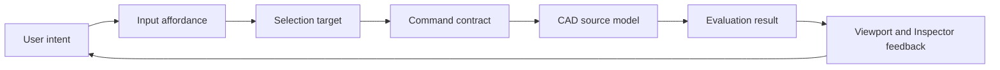
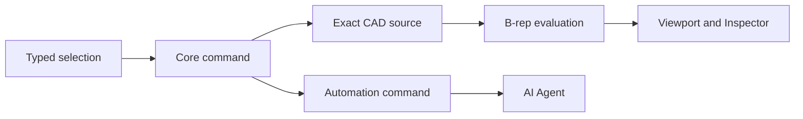
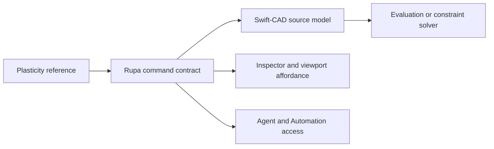
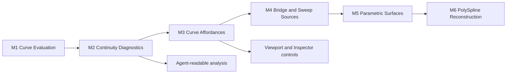

# Rupa CAD Interaction Architecture

## Purpose

This document defines the CAD interaction layers that must exist before growing Rupa into a full modeling surface. It keeps feature work ordered around explicit affordances, reusable components, and source-owned CAD state instead of isolated UI additions.

The milestone gates for deciding whether a feature is complete are defined in `CAD_QUALITY_MILESTONES.md`. This architecture document describes the interaction shape; the milestone document defines the acceptance bar.

`DESIGN_PROCESS.md` defines the process gate that must be satisfied before
broadening a CAD feature. In this architecture document, that process appears as
a `FlowGraph`: every claimed route must connect user intent, input affordance,
selection target, command contract, CAD source, evaluation result, feedback,
Automation, Agent, and diagnostics.

## Interaction Map

## Capability List

| Priority | Area | Required capability | First implementation slice |
|---|---|---|---|
| P0 | Selection | Select objects and subobjects with stable state | Object and face selection targets in Core |
| P0 | Affordances | Show active mode, snap, plane, and target scope near the viewport | Canvas chrome with selection scope, snap, plane, context panel |
| P0 | Inspector | Explain what is selected and which commands are valid | Target rows and command-backed sections for object, face, edge, vertex, and source curve selection |
| P0 | Curves | Represent source curves as editable sketch entities and curve bodies | Source point, line, circle, arc, and cubic Bezier spline entities are selectable and discoverable; selected line/circle/arc viewport dimension callouts show active editable size or angle, and line length/line angle/circle radius/arc radius/arc span angle labels can be dragged to commit persistent sketch dimensions through Core; generated circular fillet edges can resolve through dimension summary to editable source arc radius targets for the supported normal-extrude line-arc-line profile subset; point handles, circle radius, arc radius/angles, dimensions, spline control points, and supported source curve endpoint extension edit through Core, Automation, Agent, Inspector, and selected-viewport paths; supported smooth internal spline-knot constraints mirror adjacent cubic handles through Core, Automation, Agent, and Inspector; supported spline endpoint-to-line and spline endpoint-to-endpoint tangent constraints align endpoint handles through Core, Automation, Agent, and Inspector command paths; source lines can convert to editable cubic Bezier splines while migrating supported endpoint point references and spline endpoint tangencies through Core, Automation, Agent, and Inspector; curve-body commands remain follow-up work |
| P0 | Sketch profiles | Create closed source-owned sketch profiles that are immediately usable by later feature commands | Rectangle, circle, regular polygon, and Slot profiles are source-owned sketch features; regular polygons are created from center/sizing-radius/sizing-mode/inclination-mode/side-count/rotation commands and drag preview, remember EditorSession side count, sizing mode, inclination mode, and Knife state through `PolygonToolState`, expose workspace context controls for side-count changes plus inscribed/circumscribed, vertical/horizontal, and Knife toggling, route active polygon `Up`/`Down`/`Shift+Scroll`/`C`/`V`/`K` workspace input through Core-owned state, apply shared `SketchInputState` X/Y/Z axis constraints, `Tab`-cycled Length/Angle dimension input focus, Workspace compact numeric editing, focused Length radius commit, focused Angle rotation/span commit for polygon and arc tools, and Shift-tapped geometry-sourced reference-line anchors through viewport preview and command commit, then flow through Core, Automation, Agent, and typed object metadata; rectangle click/drag creation applies the same Core-owned dimension-input model for focused Width/Height values in preview and final commit; Slot creates an extrudable tangent-capped profile from a selected source line, connected open source line-chain, open source arc, connected open line/arc chain, or sampled open cubic Bezier spline through Core, workspace context controls, Inspector open-curve controls, selected open-curve viewport width arrows, Automation, and Agent; Polygon Knife now routes the same polygon draft into `createFaceKnife` for the first selected generated planar face subset and preserves generated-topology snap world points plus selected-Face projected interior points for center/radius input; exact spline Slot boundaries, multi-face Knife, and richer viewport Slot workflow coverage remain follow-up work |
| P0 | Snapping | Grid and object targeting must be visible, toggleable, modifier-aware, and resolved by the same Core service used by UI and Agent callers | Shared `SnapResolver` for grid, temporary reference-line, source-sketch point, endpoint, midpoint, center, quarter-point, closest-curve, arc, source spline CV, source profile region-center, generated topology vertex/edge-end/edge-middle/face-center, generated PolySpline Surface CV, Measurement annotation world-point/source-sketch/source-curve-parameter/generated-topology/generated-edge-parameter anchors for current line and circular BRep edges, supported line/circle/arc intersection candidates, reference-point X/Y/Z source-curve axis candidates, reference-point XY/YZ/ZX source-curve coordinate-plane candidates, and reference-point tangent/perpendicular source-curve candidates, with viewport snap tips, visible Shift-tapped geometry-sourced guide lines, Ctrl-held object-targeting force enable from viewport modifier flags, Shift+X candidate-kind suppression from the hovered snap target, and Agent readback; Core/Agent source profile region targets are discoverable and selectable, viewport sketch-region interior hit testing returns region targets without stealing edge/entity hits, and selected/hovered region targets render filled viewport highlights; broader construction-plane-specific behavior and future non-line/non-circle generated-edge parameter support remain follow-up work |
| P1 | Topology | Select edges and vertices through stable generated references | Agent-readable persistent generated topology summary exists; face/edge commands, viewport face/edge/vertex scopes, evaluated-mesh topology hits, rectangle-selection topology hits, a nonzero-ID identity target index plus projected identity render plan for generated topology and fallback subobjects, Metal offscreen identity-buffer render/readback, viewport hover/click and drag-rectangle identity hit resolution with CPU fallback, view-depth tie-breaks for overlapping generated candidates, policy-gated sketch control-point targets, scene/layout/policy-keyed identity-buffer cache reuse, explicit resolver invalidation, render/readback metrics, typed resolver resolution summaries for rendered/cache/fallback paths, per-hit picking backend reporting, and viewport picking-readiness summaries accept generated references and expose identity render cost plus budget rejection; production-scene budget calibration and broader cache policy hardening remain follow-up |
| P1 | Curve editing | Convert lines or edges to arcs/splines with constraints | Initial edge fillet writes `SketchArc`; Agent/Core can create partial arc sketches, create cubic Bezier spline sketches, convert selected source lines to arcs, convert selected source lines to cubic Bezier splines with supported endpoint reference and spline endpoint tangent migration, create Bridge Curve source splines between supported sketch endpoints with stored endpoint targets, endpoint-specific Tension 1/2/3 values, and continuity intent, edit supported source curve handles/parameters, drag selected point/line/circle/arc point handles, circle/arc radius handles, arc start/end angle handles, and spline control points in the viewport, solve supported smooth internal spline-knot constraints plus spline endpoint-to-line and endpoint-to-endpoint tangent constraints at add time from Agent/Automation/Core/Inspector and while related handles move, create one-shot arc and spline source curves from the viewport tool palette with curve-specific drag previews, and extrude closed spline profiles through tessellation; broader spline curvature, exact spline BRep boundaries, multi-step curve construction, dedicated Bridge Curve handles, and direct viewport constraint handles remain follow-up work |
| P1 | Curve editing | Fillet or chamfer editable source sketch corners with explicit target and distance contracts | `applySketchCornerTreatment` supports the first official Fillet Curve / Fillet Vertex slice for connected source line/arc endpoint targets and source line/arc curve-pair targets. It resolves the selected endpoint or the two selected curves into one shared connected corner, trims both source curves, inserts either an exact circular arc or straight chamfer segment, and refreshes affected distance/angle/radius/diameter dimensions from the resulting sketch geometry through Core, Inspector, Automation, and Agent. Yellow-dot side handles, spline corners, generated topology routing, selected-viewport handles, and command-dialog parity remain follow-up work |
| P1 | Feature edits | Apply commands to selected faces, edges, vertices, profiles, or curves | Initial `offsetBodyFace` for editable rectangle extrude faces and editable cylinder side/depth faces, including selected-face viewport drag commit where hit data exists; `filletBodyEdges` and `chamferBodyEdges` for editable rectangle extrude vertical edges, selected-edge viewport fillet/chamfer drag commit, generated-edge re-chamfer/re-fillet on closed line-loop profiles, generated-edge re-fillet on supported line-line and non-tangent line-arc/arc-line/arc-arc vertices in line+arc curve-loop profiles after prior fillet, and generated-edge re-chamfer on supported line/arc profile corners, including existing arcs traversed opposite their stored start/end direction; plus `moveBodyVertex` for rectangle profile corner moves and supported sharp line-line curve-loop vertex moves when adjacent existing arcs are preserved; general fillet/chamfer, shell, boolean, and NURBS surface commands remain separate kernel work |
| P1 | Exact curve evaluation | Preserve profile curve segments through evaluation boundaries | `Profile.boundarySegments` stores line and circular-arc boundaries; normal-direction circular-arc extrusion creates circular BRep edges and cylindrical side faces while meshes stay tessellated for display/export; closed cubic Bezier spline profiles currently extrude as tolerance-tessellated line boundaries |
| P1 | Viewport engine | Use identity-buffer picking for exact hit results | Evaluated mesh bodies now expose generated topology hits and highlights; single-point hover/pick and drag-rectangle selection route through `ViewportIdentityHitResolver`, which uses `ViewportIdentityPickIndex`, `ViewportIdentityPickRenderPlan`, and a protocol-backed `ViewportIdentityBufferRendering` renderer to sample a Metal offscreen identity texture, collect point or rectangle hits, reuse the last matching scene/layout/policy buffer, expose encode/GPU/readback/total metrics plus a typed resolution summary for rendered identity buffers, cache reuse, budget fallback, renderer unavailability, invalid viewport size, invalid rendered buffers, and renderer failures, and fall back to the shared CPU hit testers when exact identity picking is unavailable; CPU topology picking uses `ViewportProjectionBasis.viewNormal` depth to choose the front-most overlapping generated face/edge/vertex candidate; `ViewportHit` reports the active picking backend; and `ViewportPickingReadinessSummary` reports identity render cost plus budget rejection so UI can surface Identity versus CPU fallback before rendering. Calibrate thresholds against production scenes before replacing the remaining heuristic hit testing |
| P2 | Drawings | Dimensions, sheets, annotations, and saved views | Selected source-curve viewport callouts exist as interactive edit feedback for supported curve dimensions; persistent drawing dimensions, sheets, and annotation commands remain follow-up work |
| P2 | Assemblies | Joints, constraints, and external references | Component placement constraints |

## Plasticity-Class Gap Model

Plasticity-class modeling means direct solid and surface editing, edge-level control, dimensional precision, robust boolean operations, and advanced surfacing. Rupa must expose each capability through the same command surface used by UI and agents.

| Plasticity-class area | Rupa status | Next required slice |
|---|---|---|
| Sketch creation | Rectangle, circle, arc, spline, and regular polygon creation now share Core command paths where implemented; regular polygon creates a closed equal-length line loop with center/sizing radius/sizing mode/inclination mode/sides/rotation through viewport drag preview, Automation, and Agent; `PolygonToolState` keeps side count, sizing mode, inclination mode, and Knife state available to canvas click/drag creation, preview, context controls, and active polygon `Up`/`Down`/`Shift+Scroll`/`C`/`V`/`K` workspace input; when Knife is enabled, the polygon draft routes to `createFaceKnife` and creates a direct-edit body from the selected generated planar face subset instead of a sketch profile, using generated-topology snap world points or selected-Face projected interior points for center/radius input when available; Swift-CAD accepts simple convex or concave straight-line in-plane Knife loops on that one-face subset and tessellates the resulting one-hole planar face through a general polygon-hole bridge path; `SketchInputState` keeps X/Y/Z axis constraint state, tool-scoped `Tab`-cycled dimension input focus, validated dimension input values, and geometry-sourced temporary reference-line anchors for active sketch-creation tools, while Workspace compact numeric fields edit the focused input value and viewport sketch drag preview, snap probing, visible reference guides, focused Length radius commit for circle/arc/polygon, focused Angle commit for polygon rotation and arc span, focused Width/Height commit for rectangle click/drag creation, and command commit project drag input through the same state; viewport sketch coordinates pass through the shared SnapResolver when grid, object targeting, or reference guides are active, and the viewport renders selected snap tip labels from that same resolver | Add multi-face Knife, curved cutters, and source intent regeneration |
| Direct editing | Initial face, edge, vertex, and source-curve commands exist for supported rectangle-derived sources and editable cylinder side/depth faces, including selected-viewport point/line/circle/arc point, radius, angle, spline control handles, command-backed source-curve point-display toggles, endpoint-distance Extend Curve controls for selected source line/arc/spline endpoints, one-shot viewport arc/spline creation tools with matching drag previews, plus Agent-editable source-curve and sketch-constraint add/remove commands | Generalize topology commands to arbitrary profile loops and expose multi-step curve construction and constraint handles |
| Edge control | Vertical generated edges can fillet/chamfer from Inspector, Agent, Automation, and selected-edge viewport drag paths; rectangle first edits and generated re-edits share the same rewrite-safety gate; `chamferBodyEdges` can re-chamfer generated vertical edges after a prior chamfer has rewritten the profile into a line loop; `filletBodyEdges` can re-fillet generated vertical edges on the same closed line-loop profile path; after a prior fillet, supported line+arc curve loops can re-chamfer remaining line-line and line-arc generated vertices while preserving existing arcs even when the loop traverses them opposite their stored direction, and can re-fillet remaining non-tangent line-line, line-arc, arc-line, and arc-arc generated vertices; selected source lines can convert to circular arcs; selected source lines can convert to editable cubic Bezier splines with endpoint point-reference migration; source cubic Bezier spline curves can be created, edited by control point, constrained with supported smooth internal knots plus endpoint-to-line, endpoint-to-endpoint tangent, and endpoint-to-endpoint smooth constraints, and used as closed tessellated profiles | Add general edge fillet/chamfer, exact spline boundaries, broader spline curvature constraints, tangent-continuous curve blending, and broader curve conversion controls |
| Surface modeling | Circular-arc extrusion preserves cylindrical B-rep side faces; closed spline source curves can create tessellated extrudes; Bridge Curve creates sketch-curve sources; Sweep now has source IR, command, Agent contracts, profile/path/guide/target source references, viewport source picking with context preview, evaluated sketch-curve path/guide input, path frame sampling, identity straight-path exact solid evaluation, curved/twisted/end-scaled/compatible multiple point-or-chord guided/non-uniform affine, signed-axis, convex quadrilateral bilinear, convex mean-value cage, and radial point-guide rail/curve-contact guided polygonal swept-solid evaluation, straight identity capless exact swept-sheet side surfaces for line and circular-arc profile boundaries, polygonal swept-sheet output with surface scene metadata plus evaluated-mesh viewport display, semantic polygonal sweep topology names, source-level boolean target references, exact axis-aligned box-prism boolean evaluation, z-through rectangular-frame difference output with inner-loop B-rep faces, orthogonal cell-union connected box difference output, and semantic exact box/frame/cell-union boolean result topology names; PolySpline has a source command, mesh suitability analysis, Agent preflight diagnostics, selected patch-adjacency continuity diagnostics, generated B-spline topology summaries, Agent-readable explicit `surfaceFrames` UVN local-frame resolution for generated face UV addresses, Agent-readable surface continuity summaries, Inspector surface continuity diagnostics, Agent/Inspector-readable B-rep trim-boundary geometry diagnostics, selected trim-boundary viewport overlays, selected shared-edge viewport surface continuity overlays, source-owned generated patch boundary vertex moves through Core/Automation/Agent, selected viewport boundary-vertex handles with drag preview and command commit, and kernel output for one quad mesh or planar unmerged selected patch networks as selectable cubic B-spline sheet patches with shared adjacent B-rep edges. Direct B-spline surface sources now expose editable CV, weight, knot, span, source-owned rectangular outer trim-domain mutation, source-owned authored UV p-curve trim-loop mutation, shared adaptive UV trim-loop validation for self-intersection, containment, overlapping holes, degenerate sampled areas, and rational 2D B-spline p-curve trim preservation, source-owned authored trim endpoint moves with selected viewport endpoint handles, source-owned strict interior polyline and 2D B-spline trim p-curve control-point moves with selected viewport interior control-point handles, exact isoparametric trim-boundary B-rep curves for rectangular trims, approximate 3D edge curves with recorded deviation for arbitrary p-curve trims, p-curve-first mesh tessellation for rectangular and authored trim loops, and typed trim-edge contracts with role, direction, endpoint UVs, control-row references where valid, explicit authored-loop continuity rejection reasons, and supported G0/G1/G2 boundary-continuity levels for full-domain rectangular surfaces; they support CV moves/slides, weight edits, internal knot value edits, shape-preserving knot insertion, fraction-based span splitting, explicit internal knot multiplicity edits, rectangular trim-domain editing, authored trim-loop editing, authored trim endpoint dragging through selected viewport handles plus Core/Automation/Agent/CLI commands, authored trim p-curve interior control-point dragging through selected viewport handles plus Core/Automation/Agent/CLI commands, and G0/G1/G2 trim-boundary matching with homogeneous inward derivative-scale solving for compatible clamped rectangular direct B-spline full-domain surfaces through Core, Automation, Agent, CLI, and Surface Inspector controls. | Continue the first-class parametric surface foundation with exact arbitrary NURBS trim-edge reconstruction, arbitrary B-rep adjacency solving, remaining span editing beyond direct fraction splits, viewport surface-frame handles, broader trim-curve workflows, broader surface controls, and typed continuity editing beyond the current compatible direct B-spline boundary subset. After that foundation, add rail deformation beyond current guide sections, non-box boolean operands, stable result topology across exact-surface rewrites, loft, surface bridge, patch, non-planar G2 PolySpline patch networks, and patch merge policy |
| Dimensions and precision | Source sketch parameters, object metadata, initial persistent sketch dimensions including line angle and arc span angle dimensions, constrained rectangle side dimensions, fixed point anchors, add-time solving and undoable removal for supported sketch constraints, point-reference propagation for `coincident` plus horizontal/vertical line constraints, initial affected-line propagation for `parallel`/`perpendicular` line angle constraints, equal-length line propagation, initial line-to-circle/arc tangent propagation, initial circular concentric center propagation, equal-radius circular propagation, smooth internal cubic spline-knot propagation, spline endpoint-to-line tangent propagation, endpoint-to-endpoint tangent propagation, endpoint-to-endpoint smooth propagation, source corner-treatment dimension refresh, `SketchDimensionSummaryService` readback, generated extrude cap Edge and supported generated arc Edge to source sketch curve resolution through `SketchDimensionTargetResolver`, generated arc Edge radius-primary readback and direct `setSketchEntityDimension` generated-edge mutation for supported line-arc-line fillet-style arc edges, generated face-normal and generated extrusion-depth Edge object readback through `ObjectDimensionSummaryService`, generated opposing face-pair object readback, source-curve `setSketchEntityDimension`, selected-object `setObjectDimension` routing, persistent selection dimension add/target-edit/source line length apply/source circle or arc radius apply/source line relative angle apply/source arc span angle apply/remove/evaluate lifecycle, Agent readback, and Workspace `=` Dimension context-panel cycling for supported source curves, generated cap edges, generated arc edges, generated face-normal picks, generated extrusion-depth edges, rectangle-extrude bodies, and cylinder-extrude bodies synchronize through Core, Automation, Agent, and CLI for current supported primitives | Add broader dimension constraints, arbitrary face-normal dimensions beyond supported source-owned box/cylinder faces, solid face-distance dimensions, arbitrary non-extrusion generated Edge dimensions, fillet-radius rewrites beyond line-arc-line source profiles, drawing-sheet annotation layout, and general solver-driven updates |
| Boolean precision | Partial exact kernel subset: Sweep can store body target references, rejects invalid targetless/new-body target combinations, and evaluates exact axis-aligned box-prism union, difference, intersection, and slice with target replacement, separated-fragment difference output, z-through rectangular-frame difference output, orthogonal cell-union connected box difference output, semantic box/frame/cell-union result topology names, or keep-tools generated-name coverage | Add non-box operands, broader connected boolean topology outside the axis-aligned box cell-union subset, and stable result topology naming beyond the exact box/frame/cell-union boolean subset |
| Agent operability | Discovery and mutation use `SelectionTarget`, Automation, Agent paths, and structured capability descriptors for implemented commands, including source-curve curvature, point-display, endpoint Extend Curve controls, and persistent selection dimension add/target-edit/source line length apply/source circle or arc radius apply/source line relative angle apply/source arc span angle apply/remove lifecycle commands | Broaden capability coverage as new modeling commands land |

## Plasticity Reference Capability Matrix

The following matrix tracks the Plasticity features currently used as product references. A capability is complete only when it reaches the same Core command surface used by UI, Automation, Agent, and CLI where relevant.

Regular Polygon has two distinct coordinate contracts. Standard polygon creation commits in the active construction plane. Polygon Knife commits in the selected generated planar Face coordinate system and only then stores a world-space loop for `createFaceKnife`; viewport drag also carries generated-topology snap world points and selected-Face projected interior points so center/radius input survives the 2D canvas projection boundary.

| Reference feature | Plasticity behavior to follow | Current Rupa status | Required next implementation |
|---|---|---|---|
| Regular Polygon | Create from center and cursor-defined size, with vertex count changes, vertical/horizontal inclination, circumscribed/inscribed mode, knife behavior, and axis constraints. | Partial: `createPolygonSketch` persists a regular polygon as a closed equal-length sketch line loop from center, sizing radius, `PolygonSizingMode`, `PolygonInclinationMode`, side count, and rotation through Core, Automation, Agent, and viewport drag preview. The sizing radius can be interpreted as either circumradius or inradius while render metadata stores the resulting circumradius and construction-plane-relative inclination intent. `PolygonToolState` adds side-count, sizing-mode, inclination-mode, and Knife memory, context-panel count/mode/Knife editing, active polygon `Up`/`Down`/`Shift+Scroll`/`C`/`V`/`K` input routing, and preview propagation. Shared sketch axis constraints, `Tab`-cycled Length/Angle dimension input focus, Workspace compact numeric editing, focused Length radius commit, and focused Angle rotation commit are held by `SketchInputState` and applied to normal polygon preview and commit in the active construction plane. `createFaceKnife` covers the first Knife subset through Swift-CAD source operation, Core command, viewport rendering, Inspector, Automation, Agent, measurement, and topology summary for one selected generated planar face and one simple straight-line in-plane polygon loop, including concave loops; viewport topology snap world points and selected-Face projected interior points can now provide the selected-Face local center/radius input for that Knife loop. | Add multi-face cuts, curved cutters, arbitrary trimmed/curved face targets, and richer source intent regeneration. |
| Offset Curve | Route selected vertices, planar curves, regions, face loops, and solid edges to the matching offset command, with distance input, symmetric mode, gap fill, snapping, and Slot activation. | Partial: `offsetCurve` is now a Core/Automation/Agent dispatcher. Selected source line, circle, and arc sketch targets create one-sided or symmetric planar offset sketch curves while preserving the original curve; command options carry `round`, `linear`, and `natural` gap-fill intent for future joined corners, plus `mode == .slot` for the documented Offset Planar Curve to Slot activation on supported source-line, connected open source line-chain, open source arc, connected open line/arc chain, and open cubic Bezier spline targets. Selected source line or arc endpoints with `vertexHandle` route into the supported Offset Vertex branch and edit the owning sketch; supported generated body vertex targets on normal extrudes now resolve through topology summary to source line/arc endpoints and execute the same branch. Core/Automation/Agent source profile region targets are discoverable through `sketchEntitySummary`, selectable through `selectTargets`, viewport-hit-testable through sketch-region interior picking, render selected/hovered viewport highlights, expose selected-region Inspector controls for distance/gap-fill/inward-outward execution, enter explicit Offset Region command mode with `O`, draw selected-region distance arrows only while that command is active, cycle Gap Fill with `V`, expose distance input mode with `D`, execute `S` lock-distance for supported source line-loop regions by creating both signed offset regions after prevalidating both sides, route `I` individual/combined state through `offsetRegions`, create individual multi-region output in one undoable command, create same-plane independent disjoint combined-region output in one source sketch feature, create same-plane Natural/Linear polygon-union combined output when offset loops overlap or touch, including simple concave outer boundaries, commit signed viewport arrow drags through the same `offsetCurve` path, create source-owned closed convex line-loop regions with Round, Linear, or Natural gap fill, and create source-owned simple concave line-loop regions with Natural gap fill, Linear gap fill that miters concave corners and adds straight extra-vertex connections only at convex corners, and Round gap fill that rounds convex corners while mitering concave corners. Unsupported source point entities, planar spline offsets outside Slot mode, non-line source regions, self-intersecting or collapsing region output, Round curved-boundary union, nested/touching/intersecting same-sketch loops without union extraction, polygon unions with holes or multiple outer boundaries, invalid Slot option combinations, closed or branched line/arc Slot chains, closed spline Slot targets, disconnected line/arc Slot joins, Slot arc widths that collapse the inner radius, generated vertices that cannot resolve to normal-extrude source line/arc endpoints, face-loop, edge, and object targets fail before mutation with typed diagnostics. | Add Round curved-boundary combined union, joined spline/curve-loop offset, richer command-dialog numeric editing, solid-edge/face-loop dispatcher branches, actual joined-corner gap-fill geometry for non-region joined curves, freestyle snapped-distance input, broader generated-vertex cases, and hole-aware/union-aware multi-loop extraction. |
| Offset Vertex | Insert new vertices along both adjacent sides of a selected vertex. | Partial: `offsetSketchVertex` supports source line-line, line-arc, arc-line, and arc-arc sketch corners through Core, Automation, and Agent, and `offsetCurve` can dispatch to that branch when a selected source line or arc endpoint supplies `vertexHandle` or when a generated body vertex on a normal extrude resolves back to a connected source line/arc endpoint. It splits adjacent source lines by distance and adjacent source arcs by arc length, preserves analytic arc source geometry plus coincident and line-side horizontal/vertical constraints in the supported subset, migrates dimensions attached to the original split corner by rewriting endpoint references to the inserted corner segments and refreshing point-backed distance/angle plus circular radius/diameter values, preserves arc-span angle dimensions across connected same-circle split arc chains, exposes selected line/arc endpoint Inspector controls and viewport vertex-distance arrows through the same command path, keeps the edited closed profile extrudable through split-vertex profile extraction, and rejects unsupported constraints, disconnected arc-span migrations, planar offset options on vertex dispatch, unresolved generated vertices, or unsupported target kinds before mutation. | Add spline vertex support, broader generated-vertex cases beyond normal-extrude line/arc endpoint resolution, broader constraint/dimension migration, and broad UI workflow coverage. |
| Fillet Curve / Fillet Vertex | Apply Fillet or Chamfer between two curve segments or connected vertices with explicit radius/chamfer distance and interactive side selection. | Partial: `applySketchCornerTreatment` applies the source-sketch Fillet command subset to selected connected source line/arc endpoints or to selected source line/arc curve pairs supplied as `target` plus `adjacentTarget`. Fillet trims both source curves and inserts an exact circular `SketchArc`; Chamfer trims both source curves by path distance and inserts a straight source line segment. It is available through Core, Inspector, Automation, and Agent, preserves safe endpoint and line-orientation constraints, refreshes affected distance/angle/radius/diameter dimensions from the post-treatment geometry, rejects ambiguous curve pairs and unsupported constraints before mutation, and keeps closed profiles extrudable for line-line, line-arc, arc-line, and arc-arc corners. | Add yellow-dot side switching, spline support, generated edge/vertex routing, selected-viewport handles, and command-dialog parity. |
| Slot | Offset an open non-self-intersecting curve symmetrically, close both ends with tangent arcs, and create a closed slot profile. | Partial: `createSlotSketch` and `offsetCurve` Slot mode create an extrudable closed Slot profile from a selected source line, connected open source line-chain, open source arc, connected open line/arc chain, or open cubic Bezier spline by generating symmetric offsets and tangent semicircular end caps in the source sketch plane. Spline Slot uses the shared sketch curve sampler to create a validated sampled centerline profile and records `source.kind = spline`. It routes through Core, workspace context controls, Inspector open-curve controls, selected open-curve viewport width arrows, Automation, and Agent, keeps the line-chain, arc, line/arc-chain, and sampled-spline results extrudable through profile tessellation, and rejects unsupported closed/branched/point targets, closed spline targets, full-circle arcs, disconnected line/arc joins, arc widths that collapse the inner radius, sampled self-intersection, invalid tangent caps, plus invalid Slot mode option combinations before mutation. | Support exact spline-offset boundaries, exact self-intersection diagnostics, and richer viewport Slot workflow coverage. |
| Snapping Intelligence / Precise Snapping | Snap sketch creation and measurement to object, grid, reference-line, midpoint, endpoint, center, intersection, tangent, perpendicular, region-center, face-center, edge, CV, and measurement targets with visible snap feedback. | Partial: `SnapResolver` ranks grid, temporary reference-line, source-sketch, source profile region-center, generated topology, and Measurement annotation candidates for sketch points, line endpoints/midpoints/closest points, circle centers/quarter/closest points, arc centers/endpoints/midpoints/closest points, source spline CV/endpoint/closest points, source profile region centers, generated vertex/edge-end/edge-middle/face-center points, generated PolySpline Surface CV points, Measurement world-point/source-sketch/source-curve-parameter/generated-topology/generated-edge-parameter anchors for current line and circular BRep edges, supported line/circle/arc intersections, reference-point X/Y/Z source-curve axis candidates, reference-point XY/YZ/ZX source-curve coordinate-plane candidates, reference-point tangent/perpendicular source-curve candidates, and active/explicit CPlane-projected source/profile/topology/measurement candidates; viewport sketch creation, active drag snap tips, Shift-tapped geometry-sourced guide lines, Ctrl-held object-targeting force enable, Shift+X hovered-candidate suppression, and Agent `resolveSnap` use the same non-mutating resolver. Core/Agent region targets are discoverable through sketch summaries, viewport-hit-testable through region interior picks, and visibly highlighted on hover/selection. | Add broader CPlane workflow coverage and future non-line/non-circle generated-edge parameter support. |
| Tangent Snaps | Align curves or surfaces into smooth tangent continuity while modeling. | Partial: `SnapResolver` can infer reference-point tangent source-curve candidates during sketch creation and Agent readback; supported sketch constraints include line-to-circle/arc tangent, spline endpoint-to-line tangent, tangent spline endpoints, and smooth spline endpoints through Core, Inspector, Automation, and Agent paths. | Add surface tangent targets, viewport constraint handles, and broader curve/surface continuity targets. |
| Curvature Combs | Visualize curve or surface flow and continuity defects. | Partial: selected or hovered non-linear source circle, arc, and cubic Bezier spline entities render viewport curvature combs through a shared `CurveEvaluationSample` overlay model, while linear curves correctly suppress combs. Persistent Toggle Curve Curvature source-curve state is stored in `ProductMetadata.curveCurvatureDisplays`, targets source line/circle/arc/spline entities, uses the official Comb Scale default `0.1`, flows through Core/Automation/Agent/Inspector, and lets linear curves keep measurement state while rendering no comb. Inspector shows selected source-curve samples, length, max curvature, continuity rows, display state, and scale control; `curveAnalysis` returns curve samples, curvature, length, internal spline continuity diagnostics, and constrained endpoint G0/G1/G2 diagnostics for Agent-side inspection. `surfaceAnalysis` now returns generated B-spline bounded UV samples, oriented normals, exact B-spline derivative tangents, mean/Gaussian/U/V/principal curvature, principal directions, B-rep trim-boundary roles/closure/edge counts/ordered boundary points/estimated lengths, and finite-difference U/V normal-change comb diagnostics; the Inspector and selected viewport comb/principal-direction/trim-boundary overlays read that same result for surface objects, generated faces, and generated edges, with workspace toggles for comb/principal-direction/trim visibility and low/standard/high analysis density. Agent `surfaceAnalysis` accepts the same density and trim-boundary geometry contract, and Agent/Core can mutate supported generated PolySpline patch boundary vertices from topology-summary targets. | Add Measurements/Outliner curvature measurement records, surface-edge/isoparam Toggle Curve Curvature targets, viewport trim handles, general trim-curve editing affordances, surface CV editing, and broader edge/isoparam diagnostics. |
| Angle Dimensions | Measure and define exact angles. | Partial: line angle and arc span angle dimensions exist for supported source curves; persistent selection dimensions can apply source line relative angle and source arc span angle targets. | Add general angular dimensions between arbitrary sketch references, persistent annotation display, and solver-backed edits. |
| Dimensions | Add and edit linear dimensions with engineering precision. | Partial: supported source dimensions include line length/angle, circle radius/diameter, arc radius/diameter/span, rectangle side propagation, generated cap-edge-to-source-curve readback, supported generated arc-edge-to-source-arc readback with radius-primary fillet affordance and direct generated-edge mutation for line-arc-line source profile fillets, generated face-normal and generated extrusion-depth-edge object readback, selected object/face target dimension edits for source-owned rectangle-extrude and cylinder-extrude bodies through `setObjectDimension`, persistent selection dimension add/target-edit/source line length apply/source circle or arc radius apply/source line relative angle apply/source arc span angle apply/remove/evaluate through Core, Automation, Agent, and CLI, `sketchDimensionSummary`, `objectDimensionSummary`, and the Workspace `=` Dimension context panel. | Add arbitrary face-normal dimensions beyond supported source-owned box/cylinder faces, general dimension constraints, drawing-sheet annotations, ordinate dimensions, solid face-distance dimensions, fillet-radius rewrites beyond line-arc-line source profiles, and multi-reference dimension editing. |
| Construction Planes | Model on custom planes at arbitrary orientation. | Partial: sketches own a plane and section planes can be created; arbitrary persistent construction planes are not a modeling target yet. | Add construction-plane source entities, plane selection targets, plane editing handles, and sketch-on-plane creation. |
| Bridge Curves | Create controlled smooth transitions between curves or surfaces. | Partial: `createBridgeCurve` creates a two-span cubic Bezier sketch source between supported line, arc, or spline curve positions using endpoint Value parameters and Sense direction flags; `setBridgeCurveParameters` regenerates an existing bridge source from updated endpoints, endpoint-specific Value/Sense, source-curve Trim, endpoint-specific Tension 1/2/3 values, or continuity parameters while preserving the generated spline entity ID; the document stores `BridgeCurveSource` endpoint targets, endpoint value parameters, endpoint sense flags, trim state, endpoint tension values, generated ownership, and continuity intent; G0 is accepted for supported curve positions, Trim rewrites the current unconstrained line/arc/open-spline subset so interior Values become persistent endpoints, tangent continuity is accepted for line/spline endpoints including trimmed endpoints, and smooth continuity is accepted for spline endpoints through Core, Automation, Agent, codec, Inspector, curve analysis, and generic source-curve curvature display. | Add dedicated viewport bridge handles, arc/surface persistent continuity constraints, edge/face endpoint targets, surface bridge targets, constrained/dimensioned source-curve trim migration, Bridge-specific Show curvature dialog wiring, and preview controls. |
| Sweep | Sweep faces or regions into solids and curves into sheets along a path, with twist, scale, alignment, distance, corner, guide, and boolean options. | Partial: `SweepFeature` source IR, profile/path/guide/target dependency roles, command path, Automation command, Agent capability, native package validation, viewport profile/path/guide source picking, context-panel selection preview, evaluated sketch-curve extraction, `SweepPathFrame` sampling, identity straight-path exact solid evaluation, straight-path parallel transformed/guided profile-plane section sweep evaluation when the path has a profile-normal component, straight identity capless exact swept-sheet side surfaces for line and circular-arc profile boundaries, curved/twisted/end-scaled/compatible multiple point-or-chord guided/non-uniform affine, signed-axis, convex quadrilateral bilinear, convex mean-value cage, radial point rail, and curve-contact guided polygonal swept-solid evaluation, polygonal swept-sheet output with `surface` scene metadata, source-level body target references for boolean operations with invalid targetless/new-body combinations rejected before mutation, exact axis-aligned box-prism union/difference/intersection/slice boolean evaluation with target replacement, separated-fragment difference output, z-through rectangular-frame difference output with inner-loop B-rep faces, orthogonal cell-union connected box difference output, semantic box/frame/cell-union result topology names, or keep-tools generated-name coverage, overconstrained-guide and degenerate swept-topology rejection, semantic generated topology naming for polygonal sweep ring vertices, ring edges, rail edges, diagonal edges, and side triangles, evaluated-mesh viewport display, evaluated-mesh face/edge/vertex topology hits and highlights, mesh/topology summary support for evaluated sweep bodies, typed `MeasurementService` solid measurements for exact-prismatic and evaluated B-rep sweep volume with mesh-derived surface area/bounds, and typed support-matrix reporting for evaluation kind, output topology kind, boolean support kind, active guide strategies, unsupported option codes, and Agent-readable option axes. | Add rail deformation beyond the current affine, signed-axis, convex quadrilateral bilinear, convex mean-value cage, and radial point-guide sections, stable result topology naming beyond the exact box/frame/cell-union boolean subset and across exact-surface rewrites, non-box boolean operands, broader connected boolean topology outside the axis-aligned box cell-union subset, exact swept surfaces outside the straight identity analytic-boundary subset, and broader mass-property diagnostics. |
| PolySplines | Convert mesh objects into smooth untrimmed G2 B-spline surfaces with patch merge and exact boundary options. | M6.2 partial: `createPolySplineSurface` converts the supported single quad mesh/two-triangle subset and planar unmerged selected patch networks into cubic B-spline sheet B-reps, exposes selectable generated face/edge/vertex topology including shared adjacent patch edges, reports B-spline degree/control-point counts and patch count, rejects unsupported options before mutation, and `polySplineMeshAnalysis` returns structured Agent-readable diagnostics plus `PolySplinePatchGraph` quad candidates, split edges, shared-boundary relationships, competing-triangle relationships, exact selected/rejected patch partitions, selected shared-edge adjacencies, tangent-plane classification, planar supported-network status, unresolved curvature-continuity requirements where needed, unpaired triangles, and ambiguous triangles before rejecting unsupported non-planar G2 or merge-required multi-patch reconstruction. `movePolySplineSurfaceVertex` mutates supported generated patch boundary vertices by updating the owning source mesh vertex through Core, Automation, Agent, and selected viewport planar, global-axis, or patch-hull local U/V/Normal constrained drag handles while preserving selected patch identity; `slideSurfaceControlPoints` moves strict interior PolySpline CVs along override-aware B-spline control-hull U/V/N directions through the same source-owned command model; `surfaceFrames` resolves explicit generated B-spline face UV addresses into oriented UVN frames, derivative tangents, principal directions, and curvature values for Agent callers; `surfaceAnalysis` exposes generated B-spline UV samples, normals, exact derivative curvature/principal-direction samples, B-rep trim-boundary point summaries, and finite-difference U/V comb diagnostics; `surfaceContinuitySummary`, the Inspector, selected trim-boundary overlays, and selected shared-edge viewport overlays expose generated B-spline surface state for selected surface objects, faces, and edges. | Add local-frame editing beyond the current generated boundary-vertex handles, quad-dominant reconstruction, triangle/n-gon handling, non-planar G2 multi-patch continuity solving, rounded-corner and merge generation policies, richer viewport surface controls, general trim-curve editing, arbitrary NURBS surface editing beyond the current direct B-spline source subset and PolySpline corner/strict interior control-point subsets, and creation affordances. |

## CAD Quality Milestones

| Milestone | Completion contract | Required systems |
|---|---|---|
| M1 Curve Evaluation | Lines, circles, arcs, and cubic splines evaluate samples with point, tangent, normal, curvature, and approximate length. | `SketchCurveEvaluator`, `CurveAnalysisService`, unit tests |
| M2 Continuity Diagnostics | Source curves report G0/G1/G2 status, numeric gaps, tangent angles, curvature gaps, constrained endpoint relationships, required continuity, and involved constraint kinds without mutating the document. | `CurveAnalysisResult`, Agent `curveAnalysis`, tolerance policy |
| M3 Curve Affordances | Viewport and Inspector expose analysis controls and actionable continuity handles rather than passive overlays. | Selection scopes, overlay toggles, command-backed handles |
| M4 Bridge and Sweep Sources | Bridge and Sweep are source features with stable target references, options, preview geometry, and Agent commands. M4.1 lands Bridge Curve source definition and Agent command first; M4.2 must add editable bridge handles; M4.3 lands Sweep source options and Agent/Automation contracts; M4.4 starts the Sweep evaluator with path-frame sampling and straight open path solid new-body B-rep generation; M4.5 covers viewport profile/path/guide picking and context preview; M4.6 adds curved-path, section-transform, and single point/chord guide polygonal swept-solid evaluation plus evaluated-mesh viewport display; M4.7 adds a section constraint solver for compatible multiple point/chord guides, affine, signed-axis, convex quadrilateral bilinear point-guide rail deformation, convex mean-value cage point-guide rail deformation, radial point rail deformation, and curve-contact guides, then continues toward broader rail-style deformation; M4.8 adds polygonal sheet output, straight identity exact sheet side surfaces, source-level boolean target references, exact axis-aligned box-prism boolean evaluation including split-shell slice, z-through rectangular-frame difference output, orthogonal cell-union connected box difference output, semantic polygonal sweep topology naming, and semantic exact box/frame/cell-union boolean result topology naming, then must continue into non-box operands, broader connected difference topology outside the axis-aligned box cell-union subset, broader exact swept surfaces where supported, and stable result topology names beyond the exact box/frame/cell-union boolean subset and across exact-surface rewrites. | Source feature model, evaluator, preview, topology naming |
| M5 Parametric Surfaces | Surfaces evaluate UV samples, normals, curvature, seams, and trimming boundaries. | Surface source representation, surface analysis result |
| M6 PolySpline Reconstruction | Meshes convert into editable B-spline patch networks with diagnostics and boundary choices. | Mesh analysis result, patch graph, reconstruction diagnostics, surface editing commands |

## Component Contracts

| Component | Responsibility | State source | Affordance rule |
|---|---|---|---|
| Viewport | Render source-derived geometry, curve-aware creation previews, and return hit targets | `DesignDocument`, `SelectionModel`, shared Core curve drafts | Visual feedback must follow Core selection state and creation preview geometry must match the command that will commit |
| Selection Scope | Choose which target type a click resolves to | UI local state until persisted as preferences | Enable only modes backed by real hit data |
| Tool Palette | Select the command family | `EditorSession.selectedTool` | Buttons change mode only; command execution happens through canvas input |
| Utility Rail | Control snap, plane, and selection filters | UI state plus document settings where available | Small toggles expose immediate click behavior |
| Context Panel | Summarize active target and fast commands | `SelectionModel`, selected scene nodes | It must name the selected target before exposing edit actions |
| Inspector | Provide complete properties and command-backed edits | `EditorSession`, document metadata | It must separate object selection from subobject selection |

## Selection Target Model

| Target | Backing identity | Current status |
|---|---|---|
| Object | `SceneNodeID` | Implemented |
| Face | `SceneNodeID` plus `SelectionComponentID` | Implemented for initial body face hit IDs and `generatedTopology:<persistentName>` Agent, command, viewport-selection targets, evaluated-mesh topology hit/highlight targets, Inspector face offsets, selected-face viewport drag commit, and editable cylinder side/depth face offsets |
| Edge | `SceneNodeID` plus `SelectionComponentID` | Implemented for initial vertical body edge hit IDs and `generatedTopology:<persistentName>` Agent, command, viewport-selection targets, evaluated-mesh topology hit/highlight targets, Inspector edge edits, selected-edge viewport fillet handle drag commit, selected-edge viewport chamfer drag commit, generated-edge re-chamfer/re-fillet on closed line-loop profiles, and generated-edge re-chamfer/re-fillet on supported line+arc curve-loop profiles after prior fillet |
| Vertex | `SceneNodeID` plus `SelectionComponentID` | Implemented for supported rectangle-extrude generated topology selection, evaluated-mesh topology hit/highlight targets, hover, viewport highlights, viewport drag commit, Agent topology discovery, Agent selection state updates, command-backed rectangle profile corner moves, command-backed generated sharp line-line curve-loop vertex moves after prior fillet, and command-backed supported PolySpline generated patch boundary vertex moves through source mesh mutation plus selected viewport boundary-vertex drag commit; general freeform surface CV and trim-handle viewport edits remain open |
| Sketch entity | `SceneNodeID` plus `SelectionComponentID` | Implemented for Agent source-curve discovery, viewport click/hover selection, Inspector selection, and direct edit commands through `sketchEntity:<featureID>:<entityID>` |

## Command Surface Model

| Command family | UI entry | Agent entry | Source ownership | Current status |
|---|---|---|---|---|
| Object dimensions | Inspector Shape controls | `AutomationCommand` through `AgentRequest.execute` | Swift-CAD sketch/extrude source plus Rupa object metadata | Implemented for Cube and Cylinder dimensions |
| Analytic topology discovery | Selection scopes and Inspector context | `topologySummary` through `AgentRequest` | Swift-CAD generated BRep persistent names plus line/circle and plane/cylinder definitions | Implemented for generated body, face, edge, and vertex summaries with selection component IDs |
| Surface analysis discovery | Surface Inspector diagnostics and selected surface comb/principal-direction/trim-boundary overlays | `surfaceAnalysis` through `AgentRequest` | Swift-CAD evaluated BRep B-spline faces, bounded UV domains, generated topology names, sampled points, oriented normals, analytic surface tangents, mean/Gaussian/U/V/principal curvature, principal directions, ordered trim-boundary points, and finite-difference normal-change combs | Implemented for generated B-spline face analysis readback with persistent face/edge names, source feature linkage, U/V degree/control-net counts, trim-boundary roles/closure/edge counts/point loops, selected Inspector rows including curvature and representative principal directions, selected viewport comb, principal-direction, and trim-boundary overlays, workspace display toggles, Agent capability discovery, Agent codec, and Agent dispatch without mutating document state |
| Surface continuity discovery | Surface Inspector diagnostics and selected shared-edge viewport overlays | `surfaceContinuitySummary` through `AgentRequest` | Swift-CAD evaluated BRep faces, shared edges, B-spline surface definitions, and generated topology edge coordinates | Implemented for generated B-spline face adjacency readback with persistent face/edge names, G0/G1/G2 status, normal angle, explicit unresolved-curvature continuity reporting, Inspector rows, and selected viewport continuity edge labels without mutating document state |
| Direct surface span split | Surface Parameter Inspector Split control | `splitSurfaceSpan` through `AutomationCommand` and `AgentRequest.execute`; `rupa surface split-span` through CLI | Source-owned direct B-spline surface span `SelectionReference` values discovered from `surfaceSourceSummary` plus a normalized scalar fraction | Implemented by resolving the selected span bounds in Core and inserting a shape-preserving knot at the resolved parameter. The command reaches Core, Automation, Agent capability descriptors, Agent codec/execution, CLI, and Inspector state, and rejects non-span references, PolySpline generated spans, stale generations, invalid fractions, non-editable surface sources, and invalid rebuilt sheet topology. |
| Surface boundary continuity preflight | Surface Inspector Boundary Continuity section and Agent readback before mutation | `surfaceBoundaryContinuityCompatibility` through `AgentRequest`; `inspect surface-boundary-continuity-compatibility` through CLI | Source-owned direct B-spline trim `SelectionReference` values, boundary/inward basis profiles, clamped-boundary status, control-row counts, and G0/G1/G2 compatibility diagnostics | Implemented for direct B-spline rectangular outer trim pairs without mutating document state. The same Core boundary profile/evaluator feeds source summary edge support, Agent/CLI preflight, Inspector pair-level rows, and mutation guards for `matchSurfaceBoundaryContinuity`, so callers can inspect maximum supported continuity, reference direction, match side, and incompatibility reasons before editing target control rows. |
| PolySpline boundary edit | Selected viewport boundary-vertex free-move handles, Slide Surface CV workspace route, Automation, and Agent can mutate generated patch boundary vertex targets discovered from topology summary | `movePolySplineSurfaceVertex` through selected viewport drag, `AutomationCommand`, and `AgentRequest.execute`; `slidePolySplineSurfaceVertices` through `AutomationCommand`, `AgentRequest.execute`, workspace keyboard routing, Surface CV context controls, and viewport Surface CV slide gizmo drags | Swift-CAD `PolySplineFeature.sourceMesh` is the source of truth; Rupa resolves generated PolySpline patch vertex persistent names back to source mesh vertex indices, derives Surface CV slide +U/-U/+V/-V/Normal directions from the original selected patch hull, and validates the patch/role after mutation; RupaRendering reconstructs the same generated patch-hull directions for interaction distance input only | Implemented for supported single-quad and still-supported patch-network targets that preserve selected patch identity and boundary role; viewport free-move drag previews center planar X/Z movement and selected global X/Y/Z axis-constrained movement before commit; Surface CV Slide moves selected generated PolySpline boundary CVs by signed distance along local U, V, or Normal directions and rejects duplicate source vertices, unsupported targets, stale generations, zero or invalid deltas, collapsed local directions, unsupported source meshes, removed patches, and role changes before commit; viewport Surface CV slide gizmos provide U+/U-/N/V+/V- signed-distance drags through the same Core command path, preview the regenerated moved PolySpline cubic patch mesh plus moved selected CV positions during drag, and show the original patch mesh plus original selected CV positions while Ctrl is held; full evaluated-BRep comparison beyond the current patch mesh preview remains open |
| Snap resolution | Grid/object snap toggles and viewport sketch input | `resolveSnap` through `AgentRequest` | RupaCore `SnapResolver` reads Swift-CAD source sketches, source profiles, generated topology summaries, Measurement annotations, and Rupa scene references without mutation | Implemented for grid and source-sketch point, line endpoint/midpoint/closest, circle center/quarter/closest, arc center/endpoint/midpoint/closest, source spline CV/endpoint/closest, source profile region-center, generated topology vertex/edge-end/edge-middle/face-center, generated PolySpline Surface CV, Measurement world-point/source-sketch/source-curve-parameter/generated-topology/generated-edge-parameter anchors for current line and circular BRep edges, supported line/circle/arc intersection, reference-point X/Y/Z source-curve axis candidates with `SnapAxisReference`, reference-point XY/YZ/ZX source-curve coordinate-plane candidates with `SnapCoordinatePlaneReference`, reference-point tangent/perpendicular source-curve candidates, construction-plane projection for source/profile/topology/measurement candidates, Ctrl-held object-targeting force enable from `ViewportInputModifierFlags`, and Shift+X hovered-candidate suppression through `WorkspaceSnapOverrideState` with resolved coordinates, distance ranking, labels, source, related-source, region, topology, axis, coordinate-plane, and measurement references, viewport tip rendering, and Agent readback; Core/Agent source profile region targets are discoverable through `sketchEntitySummary`, viewport-hit-testable, and highlighted when hovered or selected; broader CPlane workflow coverage and future non-line/non-circle generated-edge parameter support remain open |
| Source curve discovery | Curve selection scope and Inspector Curve Selection | `sketchEntitySummary` through `AgentRequest` | Swift-CAD source sketch entities plus `sketchEntity:<featureID>:<entityID>` component IDs | Implemented for line, circle, arc, spline control points, source expressions, related constraints, related dimensions, viewport selection, Inspector selection, and Agent selection |
| Source curve analysis | Selected-curve curvature comb overlays, point/CV visibility controls, and Inspector analysis rows | `curveAnalysis` through `AgentRequest`; `setCurveCurvatureDisplay` and `setPointDisplay` through `AutomationCommand` | Swift-CAD source sketch entities evaluated into `CurveEvaluationSample` plus continuity diagnostics; Rupa `ProductMetadata` stores display state keyed by source curve selection component IDs | Implemented for line, circle, arc, and cubic spline point/tangent/normal/curvature samples, approximate length, internal spline G-continuity diagnostics, constrained endpoint continuity diagnostics, selected or hovered non-linear circle/arc/spline viewport curvature combs, persistent source-curve curvature-comb state, persistent source-curve point-display state for line/circle/arc/spline vertex and CV layouts, selected source-curve Inspector analysis rows, and Agent-readable analysis |
| Source curve edit | Inspector Curve Edit controls and selected source-curve viewport point/radius/angle/control handles | `sketchEntitySummary` for discovery, then `addSketchConstraint`, `removeSketchConstraint`, `createBridgeCurve`, `setBridgeCurveParameters`, `moveSketchEntityPoint`, `moveSketchSplineControlPoint`, `extendSketchCurve`, `setSketchCircleParameters`, `setSketchArcParameters`, `setSketchEntityDimension`, `convertSketchLineToArc`, or `convertSketchLineToSpline` through `AutomationCommand` | Swift-CAD source sketch entity expressions, dimensions, point references, fixed anchors, constrained rectangle profiles, bridge source definitions, and spline control points | Implemented for point moves, line endpoint moves, circle center/radius edits, arc center/radius/start/end angle edits, source line/arc/spline endpoint distance extension for the supported Extend Curve shape/entity subset, selected viewport dimension callouts for line length/angle, circle radius, and arc radius/span angle, selected viewport dimension-label drag commit for line length, line angle, circle radius, arc radius, and arc span angle through `setSketchEntityDimension`, selected viewport point handles for point/line/circle/arc entities, selected viewport circle/arc radius handles, selected viewport arc start/end angle handles, spline control-point moves through selected viewport handles, Inspector, and Agent/Automation/Core with fixed/coincident spline point references plus smooth internal spline-knot, endpoint-to-line tangent, endpoint-to-endpoint tangent, and endpoint-to-endpoint smooth constraints, command-backed removal of existing sketch constraints without changing current solved geometry, Inspector smooth action for selected internal cubic spline knots, Inspector endpoint tangent and endpoint smooth menus for selected spline start/end constraints to line or spline endpoint targets, Bridge Curve source creation and source-parameter editing through Core/Automation/Agent/Inspector with stored endpoint targets, endpoint-specific Tension 1/2/3 values, continuity intent, endpoint coincidence, stable generated two-span spline ownership, and supported line/spline tangent or smooth constraints, source dimension-driven length/line-angle/radius/diameter/arc-span angle edits, fixed point preservation, `coincident` plus horizontal/vertical point propagation including supported spline control-point references, initial `parallel`/`perpendicular` line angle propagation for affected line groups, equal-length line propagation, initial line-to-circle/arc tangent propagation, spline endpoint tangent and smooth endpoint propagation, initial circular concentric center propagation, equal-radius circular propagation, constrained rectangle side dimension propagation to generated body metadata, source line-to-arc conversion, and source line-to-spline conversion with endpoint fixed/coincident/distance/angle reference migration, spline endpoint tangent migration, and mutation-before-failure guards for line-specific constraints |
| Sketch corner treatment | Inspector selected source line/arc endpoint and curve-pair corner controls | `applySketchCornerTreatment` through `AutomationCommand` | Source sketch line/arc endpoints, source line/arc curve-pair targets, endpoint point references, line-orientation constraints, affected dimensions, and inserted source arc or chamfer line entities | Implemented for connected source line-line, line-arc, arc-line, and arc-arc endpoints or source curve pairs. The command uses one distance parameter and a typed treatment (`fillet` or `chamfer`), resolves the selected endpoint or two selected curves into exactly one shared connected corner, trims both adjacent source curves, inserts an exact circular arc or straight chamfer segment, remaps the original corner coincidence into new endpoint coincidences, preserves safe endpoint and line-orientation constraints, refreshes affected distance/angle/radius/diameter dimensions from the post-treatment geometry, and rejects ambiguous corners, generated Bridge Curve sources, collapsing distances, and unsupported constraints before mutation. |
| Offset region source | Selected region Inspector controls, Offset Region command mode, `O` activation, `S` lock-distance execution, `I` individual/combined mode, and selected-region viewport distance arrows | `offsetCurve` for single region dispatch and `offsetRegions` through `AutomationCommand` for multi-selected region output | Swift-CAD source sketch profiles are read through `SelectionComponent.region`; Rupa writes new source-owned offset sketch features and keeps the original profile untouched | Implemented for convex source line-loop regions with Round, Linear, and Natural gap fill, simple concave source line-loop regions with Natural, Linear, and Round gap fill where Round rounds convex corners and miters concave corners, one-sided and symmetric output with prevalidation, individual multi-region output in one undoable command, same-plane independent disjoint combined output in one source sketch feature, same-plane Natural/Linear polygon-union combined output for overlapping/touching offset loops including simple concave outer boundaries, Core/Automation/Agent dispatch, selected-region viewport highlights, Inspector controls, and self-intersecting source-region, Round curved-boundary union, nested/touching/intersecting same-sketch loops, hole, or multiple-boundary rejection before mutation |
| Bridge curve source | Inspector exposes bridge source Value 1/2, Sense 1/2, Trim, continuity, and endpoint Tension 1/2/3 controls; dedicated viewport bridge controls are pending | `createBridgeCurve` and `setBridgeCurveParameters` through `AutomationCommand` | Rupa `BridgeCurveSource` records endpoint targets, endpoint value parameters, endpoint sense flags, source-curve trim state, endpoint tension values, continuity intent, and generated spline entity ownership | Implemented for Core/Automation/Agent creation and source-parameter editing between supported sketch curve positions, metadata validation, generated two-span cubic Bezier spline regeneration with stable entity ownership, endpoint coincidence constraints when endpoints resolve to persistent point references, source-curve Trim for unconstrained line/arc/open-spline sources, line endpoint tangency constraints, spline endpoint tangent/smooth constraints, Inspector bridge source controls, Agent-readable curve analysis, and generic source-curve curvature display; viewport handles, preview controls, edge/face endpoint targets, constrained/dimensioned trim migration, Bridge-specific Show curvature dialog wiring, and surface bridge targets remain open |
| Sweep source | The Sweep tool can create a source feature from a selected profile or body source profile, optional selected sketch guide curves, and a clicked or selected sketch path; the context panel previews resolved profile/path/guide state before mutation | `createSweep` through `AutomationCommand`; Sweep tool routes through `EditorSession.createSweepFromSelection` | Swift-CAD `SweepFeature` stores profile references, a path curve reference, optional guide curve references, optional body target references, twist angle, end scale, alignment, distance fraction, corner style, guide method, boolean operation, keep-tools, simplify, and result-kind options | Implemented for CADIR source contract, RupaCore document mutation, scene body/surface metadata, native package schema validation, Automation dispatch, Agent capability discovery/codec/dispatch with structured option axes, viewport profile/path/guide source picking, context-panel setup preview, boolean body target reference storage with targetless/new-body target rejection, evaluated sketch-curve path and guide extraction, path-frame sampling, section constraint solving for twist/end-scale plus compatible multiple point/chord guides, non-uniform affine point-guide rail deformation, signed-axis point-guide rail deformation, convex quadrilateral bilinear point-guide rail deformation, convex mean-value cage point-guide rail deformation, radial point rail deformation, and curve-contact guides, identity straight-path exact solid evaluation, straight identity exact sheet side-surface evaluation, exact axis-aligned box-prism union/difference/intersection/slice boolean evaluation with target replacement, separated-fragment difference output, z-through rectangular-frame difference output, orthogonal cell-union connected box difference output, semantic box/frame/cell-union result topology names, or keep-tools generated-name coverage, curved/twisted/end-scaled/guided polygonal swept-solid evaluation, polygonal swept-sheet output, overconstrained-guide and degenerate swept-topology rejection, typed support-matrix reporting for evaluation kind/output topology/boolean kind/guide strategies/unsupported option codes, semantic polygonal sweep topology names, evaluated-mesh viewport display, evaluated-mesh generated topology hits/highlights, mesh/topology summaries for evaluated sweep bodies, and typed measurement of exact-prismatic and evaluated-mesh sweep solids; rail deformation beyond the current affine, signed-axis, convex quadrilateral bilinear, convex mean-value cage, and radial point-guide sections, stable result topology naming beyond the exact box/frame/cell-union boolean subset and across exact-surface rewrites, non-box boolean operands, broader connected boolean topology outside the axis-aligned box cell-union subset, broader exact swept surfaces, and broader mass-property diagnostics remain open |
| PolySpline surface | UI creation affordance remains pending; selected/generated topology plus generated-surface analysis and continuity are discoverable after command execution, visible in the Inspector, and marked in the viewport; supported generated boundary CVs can be moved or slid | `createPolySplineSurface` through `AutomationCommand` and `AgentRequest.execute`; `movePolySplineSurfaceVertex` through selected viewport drag, `AutomationCommand`, and `AgentRequest.execute`; `slidePolySplineSurfaceVertices` through `AutomationCommand`, `AgentRequest.execute`, workspace keyboard routing, Surface CV context controls, and viewport Surface CV slide gizmo drags; `polySplineMeshAnalysis`, `topologySummary`, `surfaceAnalysis`, and `surfaceContinuitySummary` through `AgentRequest` for preflight and readback | Swift-CAD `PolySplineFeature` stores the source mesh and `PolySplineOptions`; `PolySplineMeshAnalyzer` reports supported and unsupported source-mesh conditions, selected patch adjacencies, and unresolved continuity constraints; the evaluator emits one B-spline sheet body for the supported single-quad mesh subset or planar unmerged selected patch networks; RupaCore reads generated B-spline face UV/normal/exact-curvature/principal-direction/comb samples, trim-boundary point loops, plus generated face adjacencies and shared edges as G0/G1/G2 continuity summaries; Rupa resolves generated PolySpline patch vertex persistent names back to source mesh vertex indices for supported boundary moves and reconstructs local patch U/V/Normal directions for supported boundary slides and constrained boundary-vertex drags; RupaUI Inspector filters summaries for selected surface objects or generated face/edge targets; RupaRendering maps the same summaries onto selected surface comb, principal-direction, trim-boundary, shared-edge continuity overlays, selected boundary-vertex planar/global-axis/local U/V/Normal drag handles, and Surface CV slide U+/U-/N/V+/V- gizmo arrows | Implemented for one quad mesh represented by two triangles and planar unmerged selected patch networks, structured mesh suitability diagnostics, rounded-corner and unsupported patch-network preflight rejection before mutation, exact boundary interpolation into cubic B-spline patches, selected patch-adjacency and tangent-plane continuity diagnostics, shared adjacent patch B-rep edges, sheet B-rep output, B-spline tessellation, semantic generated topology names, source-owned supported patch boundary vertex moves with post-mutation patch/role stability validation and selected viewport planar/global-axis/local U/V/Normal drag preview/commit, official Slide Surface CV local +U/-U/+V/-V/Normal direction moves for supported generated boundary CVs with duplicate/collapsed-direction rejection and post-mutation patch/role stability validation, viewport Surface CV slide gizmos that map U+/U-/N/V+/V- arrow drags into signed command distances, preview the regenerated moved PolySpline cubic patch mesh plus moved selected CV positions during drag, and show the original patch mesh plus original selected CV positions while Ctrl is held, Rupa typed surface object metadata with patch count, topology summaries with B-spline degree/control-point counts, surface analysis summaries with exact derivative tangents, U/V normal curvature, mean/Gaussian/principal curvature, principal directions, trim-boundary point loops, finite-difference U/V normal-change combs, low/standard/high surface-analysis density options, surface continuity summaries for generated B-spline shared-edge adjacencies, Inspector surface analysis and continuity rows, selected surface comb, principal-direction, trim-boundary overlays with workspace display toggles, selected shared-edge viewport continuity overlays, Agent capability discovery, Agent codec, Agent preflight analysis, Agent surface analysis and continuity readback, and Agent dispatch; non-planar G2 multi-patch output, rounded-corner generation, patch merge, triangle/n-gon handling, general editable trim-curve commands, surface CV editing beyond generated boundary vertices, full evaluated-BRep comparison beyond the current patch mesh preview, local-frame editing beyond generated boundary vertices, viewport trim handles, and creation controls remain open |
| Arc sketch | Tool Palette Arc creates center/quarter-arc sources from canvas click or center-to-endpoint drag with an arc-shaped drag preview | `createArcSketch` through `AutomationCommand` | Swift-CAD `SketchArc` source entity plus Rupa curve metadata | Implemented for partial circular arcs, direct viewport click placement, direct viewport drag radius/orientation placement, and preview geometry shared with Core curve drafts |
| Spline sketch | Tool Palette Spline creates cubic Bezier source curves from canvas click or endpoint drag with a spline/control-polygon drag preview | `createSplineSketch` through `AutomationCommand` | Swift-CAD cubic Bezier `SketchSpline` source entity plus Rupa curve metadata | Implemented for source curve creation, direct viewport click/drag placement, preview geometry shared with Core curve drafts, source discovery, curve analysis, viewport rendering with selected curvature combs, control-point hit testing, selected viewport control-point drag, Inspector and Agent-routed control-point moves, smooth internal knot constraints, endpoint tangent constraints, endpoint smooth constraints, and closed spline profile extrusion through adaptive tessellation; exact spline BRep surfaces remain open |
| Face offset | Inspector Face Edit controls and selected-face viewport drag | `topologySummary` for discovery, then `offsetBodyFace` through `AutomationCommand` | Swift-CAD rectangle profile, circle profile, or extrude distance plus scene transform compensation | Implemented for editable rectangle extrude faces, including profile side faces and front/back depth faces, plus editable cylinder side radius and front/back depth faces |
| Source edge fillet | Inspector Edge Edit controls and selected-edge viewport fillet handle drag | `topologySummary` for discovery, then `filletBodyEdges` through `AutomationCommand` | Rectangle and generated-edge edits share an ordered profile-loop rewrite. The supported source subset is literal line loops and line+arc loops with no sketch dimensions, no parameterized expressions, and only endpoint `coincident` plus line `horizontal`/`vertical` constraints. Source lines and arcs are trimmed by path distance. Existing arcs keep their stored `SketchArc` geometry while the loop can traverse either `arcStart` to `arcEnd` or `arcEnd` to `arcStart`. Selected non-tangent line-line, line-arc, arc-line, and arc-arc corners are stored as exact `SketchArc` entities, while segment count is preserved as profile-arc tessellation policy; normal-direction extrusion preserves circular BRep edges and cylindrical side faces, then tessellates for viewport/export. | Implemented for editable normal rectangle extrude vertical edges, generated-edge re-fillet on line-loop profiles, and generated-edge re-fillet on supported non-tangent line-line, line-arc, arc-line, and arc-arc corners in line+arc curve-loop profiles after prior fillet |
| Source edge chamfer | Inspector Edge Edit controls and selected-edge viewport drag | `topologySummary` for discovery, then `chamferBodyEdges` through `AutomationCommand` | Rectangle and generated-edge edits share an ordered profile-loop rewrite. The supported source subset is literal line loops and line+arc loops with no sketch dimensions, no parameterized expressions, and only endpoint `coincident` plus line `horizontal`/`vertical` constraints. Source lines and arcs are trimmed by path distance, existing arcs keep their stored `SketchArc` geometry, and the loop can traverse either endpoint direction before a new chamfer line is inserted. | Implemented for editable normal rectangle extrude vertical edges, generated-edge re-chamfer on line-loop profiles, and generated-edge re-chamfer on supported line-line and line-arc corners in line+arc curve-loop profiles after prior fillet |
| Source vertex move | Inspector Vertex Edit controls and selected-vertex viewport drag | `topologySummary` for discovery, then `moveBodyVertex` through `AutomationCommand` | Rectangle profile bounds rewrite for rectangular profiles, or ordered supported curve-loop rewrite for generated vertices that map to sharp line-line source vertices while preserving existing arc elements and their endpoint traversal direction. Generated curve-loop vertex moves reject corners whose adjacent line is already tangent to an existing arc. | Implemented for editable rectangle extrude corner vertices and supported line+arc curve-loop sharp vertices after prior fillet |
| General fillet / chamfer | Not exposed | Not exposed | Requires broader topology command resolution and kernel feature support for non-rectangle bodies; exact spline boundary and surface support remain open | Open |
| Loft / bridge / patch | Not exposed | Not exposed | Requires curve/surface source entities and kernel feature support | Open |
| General NURBS surface CV editing | Direct B-spline surface sources expose stable CV/knot/span references, rectangular trim-domain references, authored UV p-curve trim-loop references, authored trim endpoint and strict interior p-curve control-point handles, and source-owned CV moves/slides, weights, knot edits, fraction span split, knot multiplicity, rectangular outer trim-domain mutation, authored trim-loop mutation, authored trim endpoint moves, authored trim p-curve interior control-point moves, selected viewport trim endpoint and interior control-point handles, and p-curve-first mesh tessellation for current direct surface trims; generated PolySpline boundary corner CVs and strict interior control points are exposed through the PolySpline surface route | Exposed for the current direct B-spline and PolySpline subsets through `surfaceSourceSummary`, `AutomationCommand`, Agent, CLI, and Inspector; not exposed for arbitrary NURBS polysurface sources | Requires arbitrary NURBS source identity, exact arbitrary trim-edge reconstruction, watertight polysurface ownership, stable cross-patch CV identities, and patch-local U/V/Normal evaluation beyond generated topology names | Open beyond the current direct B-spline source subset and generated PolySpline corner/strict interior control-point subset |

## Harmonic UI Tokens

| Token | Value | Usage |
|---|---:|---|
| `lk-space-tiny` | 8 | Compact toolbar internals |
| `lk-space-compact` | 12 | Canvas chrome edge padding |
| `lk-space-default` | 16 | Inspector sections |
| `lk-radius-control` | 7 | Dense buttons and pills |
| `lk-radius-panel` | 8 | Floating canvas panels |
| `lk-state-layer-selected` | 18% accent | Selected mode background |
| `lk-state-layer-disabled` | 6% primary | Disabled or inactive controls |

## Implementation Gate

Each new CAD capability must answer these questions before implementation:

| Question | Required answer |
|---|---|
| What can the user select? | A typed `SelectionTarget` or an explicit reason selection is not involved |
| What visual affordance changes? | Viewport, rail, context panel, Inspector, or command feedback |
| What command owns mutation? | A named `EditorCommand` path or a deliberate non-mutating read |
| What is persisted? | CAD source, product metadata, document setting, or transient session state |
| What is disabled? | Controls without backing model data must stay disabled or absent |
| Does the command honor subobject targets? | Object-only commands must say so or stay unavailable for face, edge, vertex, and sketch-entity targets |
