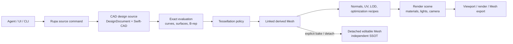
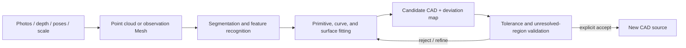

# Rupa CAD and Mesh Responsibility Contract

## Status

This document is the normative ownership contract for CAD source, Mesh data,
rendering data, reconstruction inputs, and the Rupa product layer.

| Field | Decision |
|---|---|
| Product position | CAD-first, Agent-ready direct-modeling CAD |
| Exact design authority | Swift-CAD source inside the Rupa `DesignDocument` |
| Default Mesh role | Derived representation for viewport, rendering, analysis, and mesh export |
| Editable Mesh role | An explicitly detached asset with its own source identity |
| Scan and photo role | Observation input for an explicit, approximate CAD reconstruction workflow |
| Product owner | Rupa owns sessions, commands, project orchestration, presentation, Agent access, and provenance |
| Performance rule | Repeated geometry paths use owned buffers and borrowed views; copy budgets are correctness contracts |

This contract replaces the previous goal of making CAD source and general
editable Mesh source coequal by default. Rupa is not a Blender-class mesh-first
DCC application. Mesh capability exists where it supports CAD presentation,
exchange, analysis, reconstruction, or an explicit detached-Mesh workflow.

## Product Model

Rupa models exact design intent first, derives display geometry from it, and
keeps every representation's role visible.



The normal modeling route is `CAD source -> exact evaluation -> Mesh -> render`.
The derived Mesh can be discarded and regenerated. An editable Mesh is created
only by an explicit transition that ends automatic CAD linkage for that asset.

## Single-Source-of-Truth Rule

SSOT means one owner for each semantic fact. It does not require every kind of
data to be stored in one file.

| Semantic fact | Authoritative owner | Derived consumers |
|---|---|---|
| Exact shape, dimensions, constraints, feature history, topology intent | Swift-CAD source | Evaluation, tessellation, drawings, validation, export |
| Domain design parameters and ownership declarations | Rupa product source and registered domain contract | CAD projection, validation, documentation |
| Scene organization, material assignment, saved presentation, export policy | Rupa product source | Evaluation scene, renderer, exporters |
| Tessellation and repeatable Mesh-processing intent | Rupa product source | Mesh derivation pipeline |
| Linked Mesh vertices, indices, generated normals, acceleration structures | Derived artifact owner | Viewport, renderer, selection, analysis, Mesh export |
| Detached Mesh topology and authored attributes | Detached Mesh asset | Evaluation scene, renderer, Mesh export |
| Photos, depth, poses, point clouds, and scan Mesh | Immutable observation input | Reconstruction and comparison jobs |
| Reconstructed exact design | A newly created CAD source after explicit acceptance | Normal CAD evaluation pipeline |
| Active camera, hover, selection, transient LOD | Workspace state | Current UI and viewport only |
| GPU buffers and render passes | Renderer/cache owner | Display output |

The following invariants are mandatory:

1. One object occurrence identifies exactly one authoritative geometry source
   kind: CAD, detached Mesh, or an external reference.
2. A linked derived Mesh is never editable source. A persistent operation on it
   must either update a repeatable derivation recipe or explicitly detach it.
3. CAD and detached Mesh may exist in the same package, but they must not both
   claim authority for the same object's shape.
4. Detaching records provenance and the originating CAD content identity, but it
   creates no implicit reverse synchronization.
5. Mesh-to-CAD reconstruction creates a new CAD source with explicit tolerance,
   deviation, unresolved-region, and provenance records. It never silently
   overwrites the input or claims lossless conversion.
6. Derived Mesh and render caches are invalidated by their declared CAD,
   product-source, recipe, and evaluator dependencies. Transaction revision
   alone is not a freshness proof.

## CAD Responsibility

CAD represents the design that must remain exact, measurable, editable by
dimensions or topology-aware operations, and suitable for downstream
manufacturing or documentation.

| CAD responsibility | Required behavior |
|---|---|
| Source geometry | Preserve sketches, curves, surfaces, B-rep features, parameters, constraints, and persistent references. |
| Direct modeling | Express face, edge, vertex, surface, and feature edits as source commands with typed failure and undo. |
| Evaluation | Produce deterministic exact geometry or an explicit failure; never substitute a display Mesh as exact success. |
| Measurement | Derive unit-aware dimensions, area, volume, mass properties, and topology readback from the exact model where supported. |
| Exchange | Preserve exactness and provenance through exact formats where the format and case set support it. |
| Reconstruction target | Accept fitted primitives, curves, surfaces, and features only through a validated, explicit source transaction. |

Swift-CAD owns exact geometry algorithms, source-level feature semantics, B-rep
evaluation, and the tessellator's geometric correctness. Rupa owns the product
policy that selects tolerances, schedules evaluation, exposes commands, records
provenance, and presents results.

## Mesh Roles

Every Mesh value must carry or inherit one declared role. A bare Mesh that can be
mistaken for source or cache is invalid at a persistence or command boundary.

| Role | Mutable? | Persisted as | Rebuild rule |
|---|---:|---|---|
| Linked derived Mesh | No | Optional artifact cache | Rebuild from CAD plus recipe when dependencies change |
| Detached editable Mesh | Yes, through Mesh source commands | Authored source plus content-addressed buffers | Its own source identity changes; originating CAD is not changed |
| Scan observation Mesh | Raw input is immutable; annotations may be authored separately | Input evidence plus provenance | Reprocess from the retained capture input or import identity |
| Reconstruction intermediate Mesh | No direct source authority | Job artifact | Rebuild from capture inputs and reconstruction configuration |
| Mesh export | No | External or retained export artifact | Rebuild from its exact declared source and export preset |

### Linked Derived Mesh

The Agent may control a linked Mesh through repeatable intent rather than by
editing generated vertex memory. Supported intent may include:

- tessellation tolerance and angular policy;
- viewport or export LOD policy;
- generated normal and tangent policy;
- UV generation policy;
- deterministic decimation or optimization where the operation declares the
  accepted loss and can be reapplied after CAD regeneration.

A transient viewport choice remains workspace state. A saved recipe is product
source and enters the same source transaction, undo, validation, and identity
rules as other authored intent.

### Detached Editable Mesh

`Bake` or `Detach` is an explicit source mutation. It materializes one independent
Mesh asset, records its origin and recipe, switches the occurrence's source kind,
and makes the loss of exact CAD editability visible before commit.

Subsequent vertex, edge, polygon, attribute, UV, normal, repair, or sculpt-like
operations modify only the detached Mesh asset. Replacing CAD from the detached
Mesh requires the reconstruction workflow; it is not an undo-free synchronization
shortcut.

## Scan and Photo Reconstruction

An iPhone scan, depth capture, point cloud, or photo reconstruction is evidence
about a real object, not exact CAD source.



The workflow must preserve:

- original capture identity, coordinate system, scale source, and sensor/import
  metadata;
- the observation data used by each reconstruction job;
- segmentation, fitting policy, tolerances, confidence, deviation measurements,
  holes, occlusions, and unresolved regions;
- the exact candidate CAD content that was accepted;
- a reproducible comparison between the accepted CAD and retained observations.

Reconstruction may be Agent-assisted, but the Agent must report approximation
and uncertainty. It must not infer that a noisy triangle surface contains the
original design dimensions, constraints, or feature history.

## Rupa Responsibility

Rupa is the product and orchestration layer above the kernel.

| Responsibility | Rupa owner | Boundary |
|---|---|---|
| Session, source mutation, undo/redo, revision, diagnostics | `RupaCore` | All UI, CLI, and Agent mutations enter the same command/transaction path. |
| Exact geometry | Swift-CAD adapter coordinated by `RupaCore` and CAD integration | Rupa must not reimplement or weaken kernel correctness. |
| Geometry evaluation projection | `RupaCADIntegration` and `RupaEvaluation` | Immutable, dependency-keyed results; projection is not a second editable CAD source. |
| Mesh buffer ownership and codecs | `RupaGeometry` | Role-aware owners, validated topology, bounded streaming, and borrowed views. |
| CAD-to-Mesh policy and saved recipes | Rupa product source and evaluation orchestration | Kernel tessellation correctness stays in Swift-CAD. |
| Detached Mesh lifecycle | Rupa source transaction and package layers | Explicit creation, source identity, commands, provenance, and no implicit CAD sync. |
| Capture/reconstruction workflow | Rupa project/job orchestration plus injected reconstruction providers | Inputs and intermediate artifacts remain distinct from accepted CAD source. |
| Scene, materials, lights, cameras, render intent | Rupa product source and workspace state according to lifetime | No exact-geometry ownership. |
| Viewport and rendering | `RupaViewportScene` and `RupaRendering` | Consume derived snapshots and never mutate persistent geometry directly. |
| Agent operation | Automation/Agent adapters over project use cases | Typed effects, expected revisions, progress, cancellation, and explicit role transitions. |
| Package, artifacts, provenance | `RupaProjectPackage` and project services | Preserve disjoint source owners, input evidence, derived caches, and atomic I/O. |

## Agent Effect Contract

| Agent intent | Primary effect | Required result |
|---|---|---|
| Model or directly edit exact shape | CAD source mutation | One validated CAD transaction and one undo entry |
| Save tessellation or Mesh-processing policy | Product-source mutation | Recipe identity changes; linked Mesh becomes stale |
| Change transient viewport LOD | Workspace mutation | No source identity or dirty-state change |
| Bake or detach linked Mesh | Source mutation | New detached Mesh identity, provenance, and explicit occurrence source switch |
| Edit detached Mesh | Mesh-source mutation | CAD remains unchanged |
| Import scan/photo evidence | Input-source transaction | Immutable input identity plus declared units, coordinates, and provenance |
| Run reconstruction | External job/artifact generation | Candidate CAD, deviation evidence, diagnostics, progress, and cancellation |
| Accept reconstructed CAD | CAD source mutation | New authoritative CAD source linked to reconstruction evidence |
| Render or export Mesh | Artifact generation/export | Dependency-keyed output; no implicit source mutation |

## Document Package Boundary

The target package separates owners by meaning. Paths describe roles; they do
not create duplicate truth.

```text
Model.swcad
|-- manifest.json
|-- source/
|   |-- cad.json
|   |-- product.json
|   |-- mesh-assets.json
|   `-- blobs/sha256/<content-identity>
|-- inputs/
|   |-- capture.json
|   `-- blobs/sha256/<content-identity>
|-- records/
|   |-- reconstruction/*.json
|   `-- validation/*.json
|-- artifacts/
|   |-- render-mesh/*
|   `-- renders/*
`-- extensions/<namespace>/*
```

| Entry | Authority |
|---|---|
| `source/cad.json` | Exact Swift-CAD source only |
| `source/product.json` | Disjoint Rupa-authored intent such as scene organization, materials, semantic envelopes, saved recipes, validation policy, and export presets |
| `source/mesh-assets.json` and source blobs | Explicit detached Mesh assets only |
| `inputs/capture.json` and input blobs | Immutable observation inputs and their provenance |
| `records/reconstruction` | Decisions and evidence connecting inputs, jobs, candidates, and accepted CAD |
| `artifacts/render-mesh` | Rebuildable linked Mesh caches |
| `artifacts/renders` | Rebuildable presentation outputs |

`source/product.json` must not contain a materialized projection of CAD facts.
Scene objects may reference CAD identities, but they must not duplicate exact
shape, feature, or topology authority. Input evidence has its own content identity
and is included in the dependency identity of reconstruction records. Artifacts
never contribute editable source merely because they are stored in the package.

## Zero-Copy and Resource Contract

Geometry size, repetition, and latency make buffer ownership part of correctness.

- Tessellation, evaluation, selection, viewport construction, and rendering use
  immutable buffer owners plus ranges or borrowed views. A stage must not
  materialize `Array` or `Data` merely to cross an internal API boundary.
- A derived Mesh may share immutable storage across evaluation, scene, and
  renderer preparation while the owning snapshot remains alive.
- Mutable detached-Mesh edits use one explicit mutable owner or lease and publish
  a validated immutable snapshot. Borrowed pointers do not escape their scope.
- Package and process boundaries use bounded streaming or memory mapping. Required
  copies at file, IPC, GPU upload, or foreign-API boundaries are measured and
  attributed to that boundary.
- A claim of zero-copy requires allocation/copy telemetry or a benchmark for the
  named path, input size, target, and backend. Evidence from one path must not be
  generalized to another.

## Confirmed Current Implementation

The following facts describe the current development implementation and are not
the target source contract:

| Current fact | Assessment |
|---|---|
| `DesignDocumentProjectBridge` projects `DesignDocument` into `ProjectSourceModel` in one direction. | Correct as an evaluation adapter; the projected value must remain derived. |
| `ProjectSourceModel` can own `MeshSource` values and scene occurrences. | Useful primitives exist, but the type does not yet distinguish detached source, observation input, and derived Mesh roles. |
| Package schema v2 requires both `source/cad.json` and `source/rupa.json`. | Superseded development schema. The second entry currently materializes CAD-derived project state and violates the target SSOT partition. |
| `ProjectController` decodes CAD, projects it, and requires equality with stored universal source. | This proves duplication consistency, not independent source ownership. It must not become the final RupaKit integration boundary. |
| Mesh codecs and content-addressed blobs are bounded and streaming. | Preserve this implementation and reuse it behind the corrected role-aware package contract. |

## Required Migration Before RupaKit Project Integration

1. Replace package schema v2 with the disjoint CAD, product, detached-Mesh, input,
   record, and artifact roles defined here. Because v2 is unreleased, remove the
   incorrect schema instead of adding a permanent compatibility layer.
2. Separate the CAD-derived immutable evaluation projection from authored product
   source. Do not persist the projection as a second CAD truth.
3. Add explicit Mesh role and provenance contracts before exposing Mesh mutation
   through project, UI, CLI, or Agent surfaces.
4. Implement linked Mesh recipe ownership and invalidation before adding direct
   Mesh control to the normal CAD workflow.
5. Implement `Bake`/`Detach` as a complete atomic source transition before
   enabling detached-Mesh editing.
6. Add capture/reconstruction inputs and records only after their identities,
   tolerances, deviation evidence, and acceptance transaction are defined.
7. Integrate `ProjectController` into the app only after the migrated package and
   evaluation boundaries preserve CAD command, undo, failure, viewport, and
   zero-copy behavior.

## Non-Goals

- A Blender clone, general DCC replacement, or broad sculpt/rig/animation system.
- Silent bidirectional synchronization between CAD and Mesh.
- A generic lossless Mesh-to-CAD conversion claim.
- Persisting renderer buffers as authored source.
- Moving exact geometry semantics from Swift-CAD into Rupa product modules.
- Requiring a production path tracer before CAD viewport and export correctness.

## Required Evidence

| Evidence family | Required cases |
|---|---|
| Ownership | Every occurrence resolves to exactly one geometry source kind; duplicate authority rejects load or mutation. |
| CAD-to-Mesh | CAD edits invalidate and rebuild linked Mesh with the same saved recipe and current dependencies. |
| Workspace | Transient LOD/camera changes do not alter source identity or dirty state. |
| Detach | One atomic transaction creates the Mesh source, records provenance, switches the occurrence, and supports undo/redo. |
| Isolation | Detached-Mesh edits do not change CAD; CAD edits do not rewrite detached Mesh. |
| Reconstruction | Inputs remain unchanged; accepted CAD records tolerances, deviation, unresolved regions, and exact evidence identities. |
| Failure | Unsupported reconstruction, role transition, stale dependency, or resource limit returns typed failure with no partial publication. |
| Package | Removing artifacts preserves all source and inputs; removing a referenced source/input blob rejects validation. |
| Zero-copy | Named hot paths prove buffer sharing and bounded copy/allocation counts; process/GPU copies are measured separately. |
| Agent parity | UI, CLI, and Agent routes execute the same typed effects and cannot mutate derived Mesh memory directly. |
