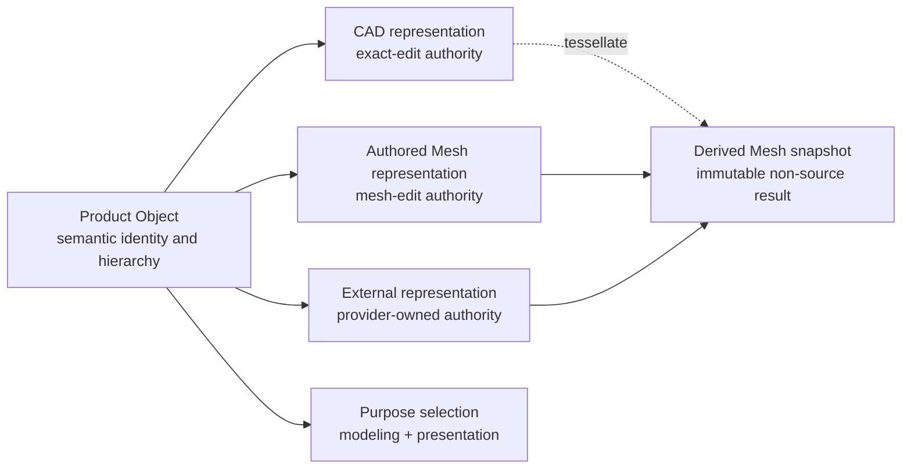
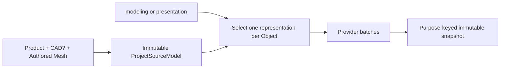
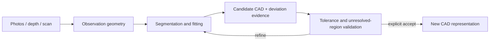

# Rupa CAD and Mesh Responsibility Contract

## Status

This document is the normative ownership contract for Product Objects, geometry
representations, evaluation snapshots, rendering data, and reconstruction input.

| Field | Decision |
|---|---|
| Product position | Agent-ready direct-modeling CAD with first-class authored Mesh workflows |
| Product identity | A Product Object owns semantic identity, hierarchy, name, and representation selection |
| CAD authority | A CAD representation owns its exact design payload |
| Authored Mesh authority | An Authored Mesh representation owns its topology, vertex data, and authored attributes |
| Derived Mesh role | An immutable evaluation snapshot or cache; never Authored Mesh source |
| Performance rule | Repeated geometry paths use owned buffers and borrowed views; copy budgets are correctness contracts |

## Product and Representation Model

One Product Object may retain multiple geometry representations. Retention and
selection are independent: adding or editing one representation does not delete,
replace, or synchronize another representation.



The mandatory invariants are:

1. A non-geometry Object retains no geometry representation and no selection.
2. A geometry Object retains at least one representation and explicitly selects
   one retained representation for both `modeling` and `presentation`.
3. Both purposes may select the same representation.
4. A representation payload is the source of truth for that representation;
   purpose selection is the source of truth for its use context.
5. Unselected representations remain retained until an explicit source mutation
   removes them.
6. CAD edits do not overwrite Authored Mesh bytes, provenance, identity, or
   presentation selection. Mesh edits do not rewrite CAD source.
7. CAD evaluation may create a Derived Mesh snapshot, but that snapshot is never
   persisted as an Authored Mesh asset.
8. Source role changes are explicit transactions. There is no silent fallback,
   synchronization, conversion, or authority inference.

## Source Authority

SSOT means one owner for each semantic fact, not one universal geometry payload.

| Semantic fact | Authority |
|---|---|
| Object identity, hierarchy, naming, materials, and purpose selection | Product source |
| Exact curves, surfaces, B-rep, parameters, and topology intent | Selected or retained CAD representation payload |
| Authored topology, positions, indices, UVs, normals, and Mesh attributes | Referenced Authored Mesh asset payload |
| Provider-owned geometry | Referenced external source under the provider contract |
| Tessellation result and generated acceleration data | Immutable evaluation snapshot or rebuildable cache |
| Camera, hover, transient selection, and transient LOD | Workspace state |
| GPU buffers and render passes | Renderer/cache owner |

`SceneNodeReference` is a navigation/index value. It must agree with the selected
modeling representation when it references native CAD or Authored Mesh data, but
it does not establish source authority.

## CAD Responsibility

CAD represents exact, measurable design intent and topology-aware editing.

| Responsibility | Required behavior |
|---|---|
| Source geometry | Preserve sketches, curves, surfaces, B-rep features, parameters, constraints, and persistent references |
| Direct modeling | Express face, edge, vertex, surface, and feature edits as typed source transactions |
| Evaluation | Produce deterministic exact geometry or explicit failure; never substitute display Mesh as exact success |
| Measurement | Derive unit-aware dimensions and topology readback from exact source where supported |
| Exchange | Preserve exactness and provenance where the format and supported case set permit it |

Swift-CAD owns exact geometry algorithms and source-level feature semantics.
Rupa owns Product Objects, purpose selection, source transactions, evaluation
orchestration, provenance, presentation, and Agent access.

## Authored and Derived Mesh Responsibility

| Role | Source authority? | Persistence | Mutation |
|---|---:|---|---|
| Authored Mesh | Yes | Asset catalog plus content-addressed buffers | Explicit Mesh source command |
| CAD-derived evaluation Mesh | No | Snapshot or optional rebuildable cache | Never edited as source |
| External observation Mesh | External/input authority | Input record plus provenance | Import/reconstruction workflow |
| Export Mesh | No | External or retained export artifact | Rebuilt from the selected source and export policy |

An Authored Mesh may be created directly, imported, or explicitly baked from a
CAD representation. Baking adds an Authored Mesh representation and may switch
the presentation selection; it does not remove the CAD representation. Its
provenance records the originating CAD representation and content identity.

T04 establishes this authority and provenance contract. T05-A provides typed
Core commands for Authored Mesh vertex edits, supported face edits, and purpose
selection with stale-content rejection. T05-B integrates those commands into
atomic Project transactions. T05-C provides explicit Make Editable from a
modeling-purpose CAD evaluation.

```mermaid
sequenceDiagram
    participant P as ProjectController
    participant E as Modeling evaluation
    participant C as Core source command
    participant A as Authority aggregate

    P->>E: evaluate CAD representation at current revision
    E-->>P: immutable occurrence Mesh + copy telemetry
    P->>P: bind project, purpose, revision, representation, and CAD content identity
    P->>P: accept MakeCADRepresentationEditableCommand
    P->>E: re-evaluate current modeling source
    E-->>P: current immutable occurrence Mesh
    P->>P: match snapshot, reference, and exact Mesh payload
    P->>C: apply validated source command
    C->>C: revalidate revision, representation, and CAD identity
    C->>A: add reidentified Authored Mesh with shared buffers
    C->>A: retain CAD/modeling; optionally switch presentation
```

Make Editable is a two-step explicit source transaction: preparation evaluates
the selected `modeling` CAD representation without publishing a new controller
state; commit revalidates the captured transaction revision and exact CAD source
identity, then evaluates the current modeling projection and requires the
command's complete Mesh payload to equal the selected current occurrence before
adding authority. Snapshot IDs and content identities alone are not proof that a
caller-provided Mesh came from CAD evaluation. The new asset records
`derivedFromCAD` provenance. Reidentification changes only the Authored Mesh
source ID and shares all immutable geometry and attribute buffers with the
evaluated snapshot. A wrong-purpose snapshot, stale or concurrently superseded
revision, changed CAD payload, mismatched retained representation, forged Mesh
payload, or duplicate source/representation ID is a typed failure and publishes
no partial CAD, Product, package, or evaluation state.

## Evaluation Contract

`ProjectSourceModel` is an immutable evaluation projection produced from current
Product, CAD, and Authored Mesh source. It is not persisted source.



- Evaluation resolves only the representation selected for the requested purpose.
- Snapshot identity includes purpose so modeling and presentation results cannot collide.
- Evaluated occurrences retain the selected representation ID, source reference,
  and copy telemetry attributable to that provider result.
- Authored Mesh evaluation shares immutable geometry buffer storage.
- CAD evaluation keeps its explicit CAD-to-Mesh materialization boundary and cache.
- Missing providers, invalid results, and stale revisions are typed failures.

## Mesh-only and Mixed Workflows

A package may be CAD-only, Mesh-only, or retain both representations on one or
more Objects.

| Workflow | Modeling selection | Presentation selection |
|---|---|---|
| CAD-only | CAD | CAD |
| Mesh-only | Authored Mesh | Authored Mesh |
| CAD design with art-directed presentation | CAD | Authored Mesh |
| Provider-owned source | External or a retained local representation | Any retained representation |

Runtime APIs keep a non-optional `CADDocument`. Loading a Mesh-only package
constructs an empty adapter with the Product document identity, units, and name.
The adapter is not CAD source authority; `hasAuthoritativeCADSource` is true only
when CAD source-bearing content or a CAD representation exists.

## Scan and Photo Reconstruction

Photos, depth captures, point clouds, and scan Meshes are observations, not exact
CAD source.



Reconstruction retains input identity, coordinate and scale information,
configuration, uncertainty, deviation, unresolved regions, and acceptance
provenance. It never claims lossless Mesh-to-CAD conversion.

## Package Boundary

The Product package separates source owners by meaning.

```text
Project Package
|-- manifest.json
|-- source/
|   |-- product.json          required
|   |-- cad.json              optional
|   |-- mesh-assets.json      optional
|   `-- blobs/sha256/...      Authored Mesh payloads
`-- adjuncts/...              namespaced opaque entries
```

| Entry | Authority |
|---|---|
| `source/product.json` | Product metadata, Object representation sets, and purpose selection |
| `source/cad.json` | CAD source only; absent for Mesh-only packages |
| `source/mesh-assets.json` and source blobs | Authored Mesh identity, provenance, and payload references |
| Namespaced adjuncts | Opaque extension-owned data; never inferred as Product, CAD, or Mesh authority |

The package never persists `ProjectSourceModel`. Derived snapshots and caches do
not become source by being stored. Product and CAD identity fields must agree;
mismatch is a typed load failure, not a merge policy.

## Transaction Contract

Commit and load stage all source, projection, evaluation, and package work before
publishing controller state.

Within a source transaction, CAD editor commands execute in their declared order,
then Geometry source commands execute in their declared order. The two phases
produce one undo entry and advance the transaction revision at most once. An
Authored Mesh source mutation stages Product/CAD/Mesh authority validation, separated source
encoding, projection, and presentation evaluation before publication. Superseded
Mesh blobs become eligible for explicit package garbage collection only in the
successfully published package state; unchanged blobs remain reusable by content
identity.

```mermaid
sequenceDiagram
    participant C as ProjectController
    participant S as Staged sources
    participant E as Evaluation
    participant P as Package
    C->>S: apply or decode in isolation
    S->>S: validate Product/CAD/Mesh authority
    S->>E: build projection and evaluate presentation
    S->>P: encode separated source owners
    alt every stage succeeds and revision is current
        C->>C: publish session, package, and evaluation together
    else failure, cancellation, or stale revision
        C->>C: discard staged values; preserve published state
    end
```

## Zero-Copy and Resource Contract

- Repeated geometry paths use immutable buffer owners plus ranges or borrowed
  views. Internal stages do not materialize `Array` or `Data` merely to cross an
  API boundary.
- Authored Mesh source and evaluated snapshots share buffer page/chunk identity.
- Mutable Mesh editing uses an explicit mutable owner or lease and publishes a
  validated immutable result; borrowed pointers never escape their scope.
- Package I/O is bounded and content-addressed. Required copies at file, IPC,
  GPU, or foreign-API boundaries are measured and attributed to that boundary.
- A zero-copy claim requires buffer identity and materialization telemetry or a
  benchmark for the named path and target.

## Rupa Ownership

| Package | Owns |
|---|---|
| `RupaCoreTypes` | Representation IDs and purposes |
| `RupaProjectModel` | Provider-neutral representations, purpose selections, Authored Mesh assets, and provenance |
| `RupaCore` | Product Objects, retained representations, source mutation, and semantic validation |
| `RupaEvaluation` | Purpose selection resolution, provider batches, and immutable snapshots |
| `RupaProjectPackage` | Opaque separated Product/CAD/Mesh bytes and package integrity |
| `RupaProject` | Atomic Core, package, and evaluation integration |
| `RupaKit` | Concrete application integration and existing provider bridges |
