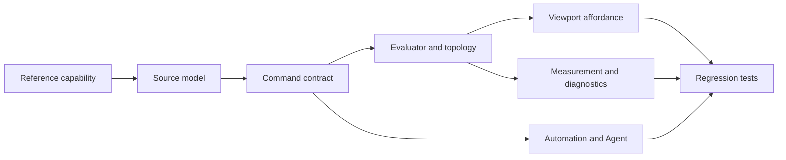
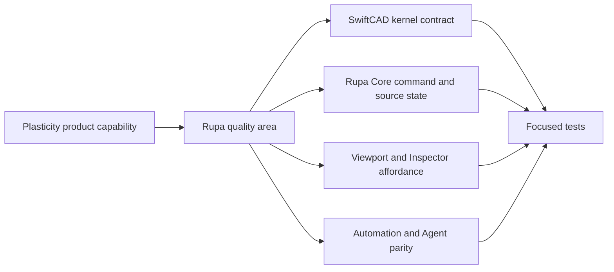
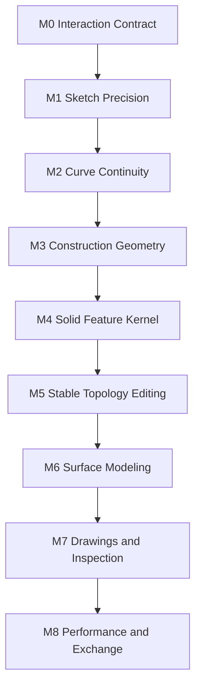
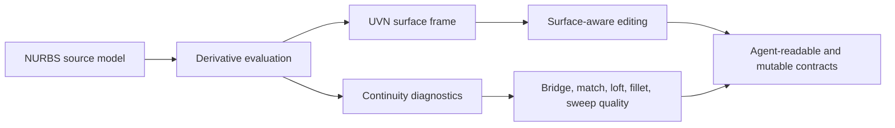
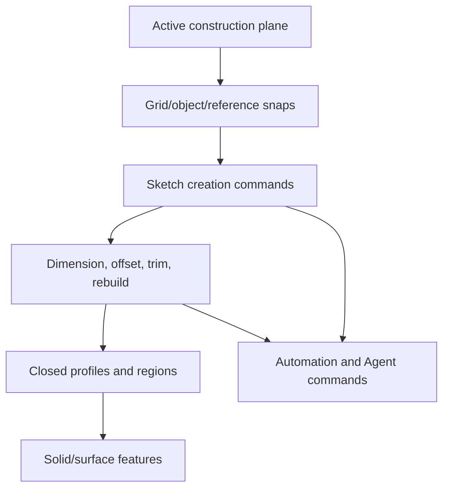
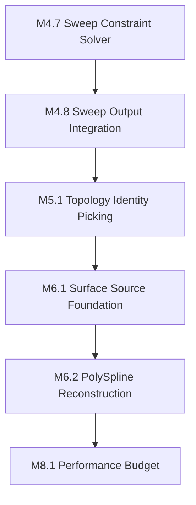
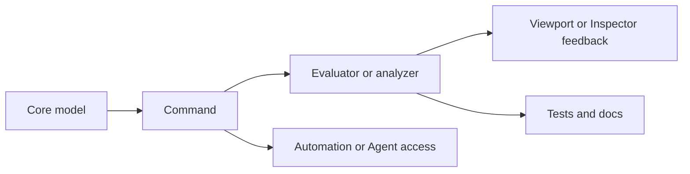

# CAD Quality Milestones

## Purpose

This document defines the milestone gates for moving Rupa toward Plasticity-class CAD quality. A feature is not considered complete just because one UI control or one command path exists. It must satisfy the full CAD contract across source ownership, evaluation, selection, feedback, automation, and verification.

## Completion Model

| Gate | Required result |
|---|---|
| Source ownership | The persisted document stores the editable source of truth, not only generated display geometry. |
| Command contract | Mutation runs through a typed Core command with validation, diagnostics, undo/redo, and stale-generation protection. |
| Evaluation | The kernel evaluates the supported subset into deterministic B-rep, mesh, or analysis output with explicit unsupported cases. |
| Selection and topology | Users and agents can address the relevant object, profile, face, edge, vertex, sketch entity, or construction target with stable IDs. |
| Viewport affordance | The UI makes the valid action visible, previews risky edits where needed, and disables unsupported targets. |
| Inspector affordance | Editable properties and diagnostics are exposed from the same command and analysis contracts used by the viewport. |
| Automation and Agent | The capability is discoverable and executable through structured Automation or Agent APIs when it mutates or reads CAD state. |
| Measurement and diagnostics | The result is measurable or explainable through structured summaries when the geometry type supports it. |
| Verification | Unit, package, rendering, and app-build coverage exist at the same scope as the shipped behavior. |

## Product Tour Parity Tracks

The current parity target is based on the Plasticity product tour checked on
2026-06-24. The tour highlights robust filleting, direct face manipulation,
xNURBS surface blending, PolySplines, hidden-line SVG export, surface
continuity, section analysis, pattern and array tools, CV editing, powerful
booleans, dimensions, construction planes, snapping, offset curves, tangent
snaps, bridge curves, curvature combs, and surface extension. Rupa must track
these as explicit capability areas because an Agent cannot produce reliable CAD
results when the product surface cannot represent, validate, select, or inspect
the same operation.

| Track | Product capability | Primary owner | Required implementation result | Verification gate |
|---|---|---|---|---|
| P0 | Robust filleting and blending | SwiftCAD kernel first, Rupa Core second | Edge/face blend requests must carry radius law, continuity intent, affected topology references, and explicit unsupported diagnostics before broad UI exposure. | Kernel evaluator tests for exact supported subsets, Rupa command rejection tests for unsupported selections, and Agent capability readback. |
| P0 | Powerful booleans | SwiftCAD kernel first, Rupa Core second | Boolean operands, operation kind, keep-tool policy, topology naming, and failure diagnostics must be typed source contracts rather than mesh-only operations. | Exact subset tests for union/difference/intersection, topology naming tests, and Agent execution tests. |
| P0 | Direct face manipulation | Rupa Core and SwiftCAD jointly | Face, edge, and vertex edits must resolve from stable selection to source-owned feature edits or fail before mutation when the source cannot be rewritten. | Selection-to-command tests, undo/redo tests, viewport handle tests for supported scopes, and Agent parity tests. |
| P1 | Surface modeling, CV editing, surface extension, xNURBS-like blending | SwiftCAD surface foundation first | NURBS/B-spline source surfaces, CV/knot/span/trim identity, UVN frames, continuity diagnostics, and exact surface edit requests must exist before adding broad surfacing tools. | Surface evaluator tests, continuity measurement tests, selected CV/trim identity tests, and Agent analysis readback. |
| P1 | PolySplines mesh-to-NURBS conversion | SwiftCAD reconstruction plus Rupa diagnostics | Mesh suitability, patch partition, continuity constraints, generated B-spline topology, and editable CV/trim handles must remain source-owned and diagnosable. | Mesh preflight tests, patch topology tests, surface continuity tests, and Inspector/Agent readback tests. |
| P1 | Hidden-line export and section analysis | SwiftCAD analysis plus Rupa export/readback | Visible/hidden edge classification, section planes, hatching, stroke metadata, and saved view context must be analysis output, not viewport screenshots. | Deterministic hidden-line/section tests with stable SVG or structured output fixtures. |
| P1 | Pattern and array tools | Rupa Core source contract with kernel transform support | Linear, radial, grid, and curve-driven repetitions must preserve source instance identity, editable parameters, and downstream topology naming. | Source mutation tests, generated naming tests, transform precision tests, and Agent execution/readback tests. |
| P2 | Sketch precision family | Rupa Core and UI with kernel geometry queries | Dimensions, snapping, tangent snaps, offset curves, polygons, bridge curves, and curvature combs must share exact curve references and diagnostics. | Existing sketch, snap, dimension, curve edit, and Agent tests remain the regression boundary; new tools add tests at the shared command layer. |

## Milestone Roadmap

| Milestone | Goal | Done when |
|---|---|---|
| M0 Interaction Contract | Typed selection, command ownership, undo/redo, diagnostics, and Agent access form one shared editing surface. | Object, face, edge, vertex, sketch entity, and construction targets can be discovered, selected, validated, mutated or rejected consistently across UI, Automation, and Agent paths. |
| M1 Sketch Precision | Sketches are solver-owned, dimensioned, and editable with predictable constraints. | Linear, angular, radius, tangent, coincident, equal, parallel, perpendicular, fixed, and smooth constraints are represented as source state and solved through command-backed edits. |
| M2 Curve Continuity | Curve creation and editing support continuity-aware workflows. | Lines, arcs, circles, splines, bridge curves, tangent snaps, curvature combs, and continuity diagnostics operate through the same source and analysis model. |
| M3 Construction Geometry | Construction planes and reference geometry are first-class modeling inputs. | Persistent planes, axes, and reference targets can be created, selected, edited, used as sketch planes, and consumed by feature commands. |
| M4 Solid Feature Kernel | Core solid features produce robust source-owned B-rep results. | Extrude, revolve, sweep, loft, shell, fillet, chamfer, draft, boolean, and transform features have explicit source contracts, evaluators, topology naming, previews, and Agent support for their shipped subsets. |
| M5 Stable Topology Editing | Generated faces, edges, and vertices remain useful after feature edits. | Persistent names survive supported rewrites, direct edits target generated topology safely, and unsupported topology edits fail before mutation. |
| M6 Surface Modeling | Surface and curve networks become editable modeling primitives. | NURBS or B-spline surface sources, trimming, bridge surfaces, patch surfaces, PolySpline reconstruction, surface continuity diagnostics, and surface combs exist as source-owned commands. |
| M7 Drawings and Inspection | Precision information can be authored, inspected, and exported. | Model-driving dimensions, drawing annotations, sections, measurements, mass properties, and saved views are separate but cross-referenced where needed. |
| M8 Performance and Exchange | Large documents remain interactive and interoperable. | Incremental evaluation, zero-copy mesh/data flow, cache invalidation, import/export reports, and format policy diagnostics are covered by performance and regression tests. |

## Current Cursor

| Area | Current cursor | Next non-negotiable result |
|---|---|---|
| Selection | M0/M5 partial | Evaluated mesh bodies now carry generated topology hit targets for projected face/edge/vertex selection and highlights; viewport hits expose their picking backend; CPU topology picking uses view-depth tie-breaks for overlapping generated face/edge/vertex candidates; `ViewportSelectionHitPolicy` maps object/face/edge/vertex/region/sketch-entity scopes into the same GPU and CPU hit contract; `WorkspaceSelectionScope` now owns the matching viewport hit policy and allows drag-rectangle selection across object, face, edge, vertex, region, and sketch-entity scopes; drag-rectangle selection now publishes preview hits back through the same `SelectionTarget` conversion path and renders object, sketch entity, region, face, edge, vertex, and generated-topology preview highlights before commit; selected generated/body edge targets can enter an `O`-activated Offset Edge command state and expose a viewport distance-arrow handle plus exact-distance offset-edge preview segment that commits through the same `offsetCurve` edge dispatch used by Inspector, Automation, and Agent; `ViewportIdentityPickIndex` maps nonzero identity-buffer IDs back to exact body, generated face/edge/vertex, projected fallback body subobject, sketch entity, sketch region, and policy-gated sketch control-point hits; `ViewportIdentityPickRenderPlan` turns policy-filtered identities into projected polygon, polyline, segment, and point primitives with depth where available; `ViewportIdentityBufferRenderer` renders those primitives into a Metal offscreen `r32Uint` identity buffer, records encode/GPU/readback/total timing plus command/point/pixel counts, and reads back identity-backed point or rectangle hits; and viewport hover/click plus drag-rectangle selection now route through `ViewportIdentityHitResolver` with projected-CPU fallback when Metal is unavailable. The resolver now reuses the last identity buffer for matching scene/layout/sketch-control-point/selection-hit policy keys, shares that cache between point and rectangle hits, exposes typed resolution summaries for rendered identity buffers, cache reuse, budget fallback, renderer unavailability, invalid viewport size, invalid rendered buffers, and renderer failures, exposes the last render metrics and render cost, enforces pixel/draw-item/encoded-point budget thresholds before rendering, rejects mismatched rendered buffers before caching, and invalidates cache, metrics, cost, budget rejection, and resolution summaries explicitly. `ViewportPickingReadinessSummary` now reports identity render cost, budget rejection, and fallback status from the same render-plan policy so UI and Agent diagnostics can explain CPU fallback before rendering. Next: broaden the remaining selection-mode edit-handle affordances and calibrate identity-buffer budgets against larger production scenes before retiring the remaining CPU picking heuristics. |
| Sketch precision | M1 partial | Generalize angular and linear dimensions between arbitrary sketch references. |
| Snapping | M1 partial | `SnapResolver` now owns shared grid, temporary reference-line, source-sketch point/line/circle/arc/spline, source profile region-center, generated topology vertex/edge/face-center candidate resolution, first-class source spline CV snap targets, generated PolySpline Surface CV snap targets, Measurement annotation world-point/source-sketch/source-curve-parameter/generated-topology/generated-edge-parameter anchor candidates for current line and circular BRep edges, closest curve points, supported line/circle/arc intersections, reference-point X/Y/Z source-curve axis candidates, reference-point XY/YZ/ZX source-curve coordinate-plane candidates, reference-point tangent/perpendicular source-curve candidates, construction-plane projection for source sketch/profile-region/generated-topology/measurement candidates, typed related-source, region, topology, axis, coordinate-plane, and measurement references, resolved coordinates, source/generated/measurement selection context, viewport snap tips, viewport sketch creation coordinates, Shift-tapped geometry-sourced reference-line guide anchors, Ctrl-held object-targeting force enable from viewport modifier flags, Shift+X hovered-candidate suppression, and Agent readback without mutating generation. Source-sketch, source-curve-parameter, generated-topology, and generated-edge-parameter measurement anchors re-resolve from the current document geometry; generated topology identity uses persistent names plus selection components, not transient evaluated reference IDs. Core/Agent source profile region targets are discoverable and selectable; viewport sketch-region interior hit testing now returns region targets while preserving sketch edge/entity hit priority, and selected/hovered region targets render viewport highlights. Next: broader CPlane workflow coverage and generated-edge parameter support for future non-line/non-circle curve kinds when the kernel adds them. |
| Curve continuity | M2 partial | Extend reference-point tangent/perpendicular snaps into broader live viewport constraint affordances and surface targets. |
| Construction geometry | M3 partial | Persisted saved construction-plane source entities now exist, can be marked active, renamed through the same undoable source/scene-node mutation, produce linked construction scene nodes, feed default sketch creation when no explicit plane is supplied, expose a Workspace 2D CPlane snap toggle, project source sketch/profile-region/generated-topology snap candidates into the active or explicit construction plane, and are readable/mutable through Automation and Agent. Generated face targets, source profile region targets, exactly one generated Face plus one generated Edge for perpendicular planes, two or more parallel normal-separated Face/Region targets for midplanes, generated vertex targets, source point sketch entities, source line/arc point handles and endpoints, circle/arc center handles, and source spline CV targets can now create saved custom construction planes through Core, Automation, Agent, and Workspace selection. Workspace `Space`/`Shift+Space` routes face/region, Face+Edge, midplane, generated-vertex point, and source sketch point selected-target sets, passing the current viewport projection normal when two selected points require a camera-parallel plane; plain `Space` aligns the viewport to the created plane through the same projection request path while `Shift+Space` keeps the current view. Core, Automation, Agent, and Workspace now also expose view-aligned construction-plane creation: `Ctrl+Space` creates through world origin and `Ctrl+Shift+Space` enters a picked-origin command state that consumes the next viewport point. The Workspace Plane rail lists saved planes with active-state affordance, activation, rename controls, and active-plus-view-align double-click/viewfinder affordances. Next: selectable/editable plane handles and full sketch-on-arbitrary-plane workflow coverage. |
| Sweep | M4 partial | Curved-path, section-transform, compatible multiple point/chord guide, non-uniform affine point-guide rail deformation, signed-axis point-guide rail deformation for independent top/bottom/left/right section rails, convex quadrilateral bilinear point-guide rail deformation with flipped/self-intersecting target rejection, convex mean-value cage point-guide rail deformation for five-or-more-point enclosing cages with flipped/self-intersecting target rejection, radial point rail deformation for non-cage local point-guide sections with transformed-profile collapse/flip/self-intersection rejection, curve-contact guide polygonal swept-solid evaluation, curved-path parallel alignment as a profile-plane parallel section sweep with twist, scale, and profile-plane guide projection, straight-path parallel identity sections as profile-plane-preserving exact extrusion when the path has a profile-normal component, straight-path parallel transformed or guided sections as profile-plane parallel section sweeps when the path has a profile-normal component, straight identity capless exact swept-sheet side surfaces for line and circular-arc profile boundaries, polygonal swept-sheet output, source-level boolean target references, and exact axis-aligned box-prism union/difference/intersection/slice boolean evaluation now exist, including twist, end scale, straight-path normal alignment as a path-normal section sweep, guide contact validation, targetless-boolean rejection, target replacement or keep-tools generated-name coverage, separated-fragment difference output, z-through rectangular-frame difference output with inner-loop B-rep faces, connected non-rectangular box difference output as orthogonal cell-union B-reps, split-shell slice output, conflicting signed-axis rail guide rejection, overconstrained-guide rejection, degenerate swept-topology rejection, semantic polygonal sweep topology names for ring vertices, ring edges, rail edges, diagonal edges, and side triangles, semantic exact box/frame/cell-union boolean result topology names, evaluated-mesh viewport display/selection, surface scene metadata for sheet output, typed solid measurement of path length, volume, surface area, and bounds, and a shared typed evaluator support contract that classifies exact straight extrusion, path-normal section sweep, profile-plane parallel sweep, exact/polygonal solid or sheet output topology, target-boolean support kind, and active guide strategy families while rejecting profile-plane degenerate parallel alignment, round corner style, simplify output, boolean target operations with sheet output, and zero distance fraction before those options can become silent no-ops. Agent capability descriptors now expose the same structured sweep option axes for alignment, guide method, boolean operation, result kind, corner style, and simplify. Next: rail deformation beyond the current affine, signed-axis, convex quadrilateral bilinear, convex mean-value cage, and radial point-guide sections, non-box boolean operands, broader connected boolean topology outside the axis-aligned box cell-union subset, exact swept surfaces outside the straight identity analytic-boundary subset, and stable result topology naming beyond the exact box/frame/cell-union boolean subset and across exact-surface rewrites. |
| Bridge curves | M2/M6 partial | Preserve the endpoint-specific G0/G1/G2 Bridge Curve contract, Value 1/2 curve-position parameters, Sense 1/2 direction flags, source-curve Trim state, and endpoint-specific Tension 1/2/3 controls through Core, ProductMetadata validation, Automation, Agent, Inspector controls, curve analysis, and generic source-curve curvature display; generated bridge output is a two-span cubic Bezier source so Value selects source positions, Sense reverses endpoint tangents and chooses the retained side for Trim, source-curve Trim can turn current unconstrained line/arc/open-spline interior Values into persistent endpoints, and the three tension levels have distinct control-vertex effects. Keep G3 constraints, constrained/dimensioned trim migration, Bridge-specific Show curvature dialog wiring, dedicated viewport handles, edge/face endpoint targets, and surface-boundary workflows as explicit open work. |
| PolySplines | M6.2 partial | Preserve the single-quad and planar unmerged multi-patch cubic B-spline sheet foundation, structured mesh suitability diagnostics, quad patch graph IR, exact non-overlapping patch partition, selected patch adjacencies, shared adjacent B-rep edges, Agent-readable explicit surface UVN frame resolution for generated B-spline face UV addresses, Inspector-visible, and viewport-visible selected trim-boundary, comb, principal-direction, shared-edge surface continuity summaries, selected viewport patch boundary-vertex planar, global-axis, and patch-hull local U/V/Normal handles, supported source-owned patch boundary vertex moves, official Slide Surface CV U/V/N direction slides for generated patch boundary CVs, viewport U+/U-/N/V+/V- Surface CV slide gizmos with regenerated moved patch-mesh drag preview, moved-CV drag preview, Ctrl-held original patch-mesh comparison, and Ctrl-held original-CV comparison, and unresolved continuity constraints before adding non-planar G2 multi-patch reconstruction and broad mesh-to-surface conversion. |
| Performance | M8 early | Keep mesh and analysis paths zero-copy where data ownership allows it, and add measurements before broadening dense features. |

## Plasticity Sketch Reference Slices

These slices are based on the Plasticity manual pages checked on 2026-06-22:
`https://doc.plasticity.xyz/sketch`, `https://doc.plasticity.xyz/tool/polygon`,
`https://doc.plasticity.xyz/tool/sketching-essentials`,
`https://doc.plasticity.xyz/sketch/offset-curve`,
`https://doc.plasticity.xyz/sketch/offset-planar-curve`,
`https://doc.plasticity.xyz/sketch/offset-region`,
`https://doc.plasticity.xyz/sketch/offset-vertex`,
`https://doc.plasticity.xyz/sketch/slot`,
`https://doc.plasticity.xyz/solid/offset-face-loop`,
`https://doc.plasticity.xyz/solid/offset-edge`,
`https://doc.plasticity.xyz/sketch/fillet-curve`,
`https://doc.plasticity.xyz/sketch/trim`,
`https://doc.plasticity.xyz/sketch/split-segment`,
`https://doc.plasticity.xyz/sketch/cut-curve`,
`https://doc.plasticity.xyz/sketch/insert-knot`,
`https://doc.plasticity.xyz/sketch/slide`,
`https://doc.plasticity.xyz/sketch/slide-curve-cv`,
`https://doc.plasticity.xyz/solid/slide`,
`https://doc.plasticity.xyz/solid/slide-surface-cv`,
`https://doc.plasticity.xyz/sketch/project`,
`https://doc.plasticity.xyz/sketch/rebuild-curve`,
`https://doc.plasticity.xyz/sketch/convert-vertex`,
`https://doc.plasticity.xyz/sketch/toggle-curve-curvature`,
`https://doc.plasticity.xyz/plasticity-essentials/plasticity-interface/snap`,
`https://doc.plasticity.xyz/plasticity-essentials/plasticity-interface/construction-plane`,
and `https://doc.plasticity.xyz/common/dimension`.
See `PLASTICITY_SKETCH_REFERENCE.md` for the source-backed extraction table.

## Plasticity CAD Essentials Reference Slices

These slices are based on the Plasticity manual pages checked on 2026-06-23:
`https://doc.plasticity.xyz/cad-essentials/nurbs-overview`,
`https://doc.plasticity.xyz/cad-essentials/uvn-coordinate-system`,
and `https://doc.plasticity.xyz/cad-essentials/continuity-curve-and-surface`.

| Reference concept | Required Rupa contract | Missing product capability |
|---|---|---|
| NURBS curves | First-class curve sources must support degree/order, knot vectors, weights, spans, CVs, edit points, local-control evaluation, exact conics, and stable CV/knot/span IDs. | Current cubic Bezier sketch splines are not enough for Insert Knot, Rebuild, exact circles/ellipses as rational curves, or higher-degree continuity workflows. |
| NURBS surfaces | First-class surface sources must support U/V degree, U/V knot vectors, weighted control nets, trim loops, watertight joined polysurfaces, and stable face/edge/CV identities. | Current generated PolySpline B-spline sheets are useful but do not yet provide arbitrary editable NURBS surface ownership. |
| UVN local frame | Every evaluated surface target must expose U tangent, V tangent, normal, derivatives, curvature, and orientation consistency at selected UV parameters. | `surfaceFrames` now gives Agent-readable UVN frames for generated B-spline face UV addresses; viewport surface-frame handles, snap consumption, trim editing, offset, and sweep/loft section placement still need to consume that contract. |
| Curve continuity | Curve constraints and analyzers must distinguish G0 position, G1 tangent, G2 curvature, and G3 curvature-change continuity. | Bridge Curve currently preserves G0/G1/G2 intent, but G3, richer matching, and viewport continuity handles remain open. |
| Surface continuity | Surface analyzers and match commands must distinguish G0 position, G1 tangent, and G2 curvature across shared boundaries. | PolySpline shared-edge summaries expose early diagnostics, but surface bridge, match face, loft, patch, and G2 reconstruction need source-level constraints. |
| Visual analysis | Curvature comb, porcupine-style normal-change, zebra/reflection-style surface-flow, and numeric continuity reports must read the same evaluator output. | Current comb and surface summaries are partial; reflection-quality diagnostics are not yet a reusable analysis layer. |

The important implication is that M6 cannot be treated as a collection of individual surface tools. It needs a shared parametric geometry foundation first: source-owned NURBS/B-spline data, differential evaluation, UVN frames, typed continuity contracts, and stable subobject identity for UI, Automation, and Agent callers.

## Source-Backed Planning Rule

Plasticity parity work starts from the official manual page for the command family, not from a screenshot or inferred UI behavior. Each implementation slice must name the manual command, the selection-driven dispatcher rule, the command-dialog options, keyboard modifiers, output topology/source ownership, and unsupported cases before code changes are accepted.

For Regular Polygon Knife, the supported interaction contract is target-Face based: normal polygon creation uses the active construction plane, while Knife creation converts the polygon draft through the selected generated planar Face coordinate system before storing the world-space loop. Viewport drag keeps generated-topology snap world points and selected-Face projected interior hit points alongside the 2D resolved point, so the current Face-input slice can use center/radius points on the selected Face instead of relying on the active view or XY plane.

| Reference slice | Manual behavior to match | Current implementation cursor | Required next result |
|---|---|---|---|
| Regular Polygon | Create from center, move cursor to size, confirm; supports vertex-count changes, vertical/horizontal inclination, circumscribed/inscribed toggle, knife mode, X/Y axis constraints, and remembers the last vertex count. | `createPolygonSketch` persists a regular polygon as a closed equal-length sketch line loop with center/sizing radius/sides/sizing mode/inclination mode/rotation inputs through Core, Automation, Agent, and viewport drag preview. `PolygonSizingMode` preserves whether the sizing radius is a circumradius or inradius, stores both source intent and render radius metadata, and keeps the generated loop extrudable. `PolygonInclinationMode` stores construction-plane-relative vertical/horizontal intent in metadata. `PolygonToolState` remembers the EditorSession side count, sizing mode, inclination mode, and `cutsFaces` Knife state, feeds canvas click/drag creation, drives the polygon drag preview, exposes workspace context controls for side-count changes plus inscribed/circumscribed, vertical/horizontal, and Knife toggling, and handles active polygon `Up`/`Down`/`Shift+Scroll`/`C`/`V`/`K` workspace input. `SketchInputState` provides shared X/Y/Z axis constraint state and `Tab`-cycled Length/Angle dimension input focus for polygon tools; focused Length values override polygon radius; focused Angle values override polygon rotation; Workspace compact numeric fields show and edit the focused Length/Angle value; and non-Knife viewport drag preview plus final command commit project input onto the requested global axis within the active construction plane through the shared `CanvasSketchCurveDrafts` path. Rectangle tools use the same Core dimension-input contract for focused Width/Height commit and preview. `createFaceKnife` now implements the first official Knife subset: a selected generated planar face is cut by a simple closed world-space polygon loop, including concave straight-line loops, and generated-topology snap world points or selected-Face projected interior points can drive the Knife center/radius input on that selected Face before producing a direct-edit body with persistent center-face topology through Swift-CAD evaluation, Rupa Core, viewport rendering, Inspector, Automation, Agent, measurement, and topology summaries. The resulting one-hole planar face is tessellated by a general polygon-hole bridge plus ear clipping path. | Extend Knife from this exact one-face straight-line polygon plus selected-Face point-input subset to multi-face cuts, curved/generated-surface cutters, arbitrary trimmed or curved faces, and richer viewport preview/diagnostics. |
| Offset Curve | Dispatches by selected target: vertices, planar curves, regions, face loops, and solid edges each route to a more specific offset command. | `offsetCurve` now exists as the Core/Automation/Agent dispatcher. It routes selected source sketch line, circle, and arc targets into the current Offset Planar Curve subset, supports one-sided or symmetric output through `OffsetCurveOptions`, carries gap-fill intent for later joined curves, routes `OffsetCurveOptions.mode == .slot` on supported selected source lines, connected open source line-chains, open source arcs, and connected open line/arc chains into Slot profile generation, routes selected source line or arc endpoints with `vertexHandle` into the current Offset Vertex source line/arc corner subset, routes generated body vertex targets on normal extrudes back to connected source line/arc endpoints for the same Offset Vertex branch, routes Core/Agent/viewport-hit-tested source profile region targets into the current Offset Region subset, routes generated Face targets into the current Offset Face Loop subset, and routes generated Edge targets into the current Offset Edge subset when `OffsetCurveOptions.supportTarget` supplies a generated support Face on the same body, `EditorSession` can infer exactly one selected same-body generated support Face from the active selection context, or the selected generated line Edge lies on exactly one generated start/end cap Face. `offsetRegions` handles individual multi-region output, same-plane independent disjoint combined output, and same-plane Natural/Linear polygon-union combined output including simple concave outer boundaries. Selected regions expose Inspector controls for editable distance, gap fill, and inward/outward command execution through the same command path. Face-loop dispatch currently supports one generated rectangular planar face with positive inward distance and creates a direct-edit body with persistent offset edges. Edge dispatch currently supports one generated line edge on a rectangular planar support face with positive inward distance and creates a direct-edit body with one persistent offset edge, while Agent/UI-style command flows can select the edge plus support face or a supported cap edge and execute without a low-level support-target payload. It rejects unsupported source point entities, spline, non-line source regions, self-intersecting or collapsing region output, Round concave-corner offset, Round curved-boundary unions, nested/touching/intersecting same-sketch loops without union extraction, hole or multi-boundary polygon unions, invalid Slot mode option combinations, Slot support targets, unsupported Slot spline/closed/branched/point targets, closed or branched line/arc Slot chains, disconnected line/arc Slot joins, Slot arc widths that collapse the inner radius, generated vertices that cannot resolve to normal-extrude source line/arc endpoints, face-loop symmetric or non-rectangular/non-planar cases, edge symmetric cases, missing or ambiguous support-face context, unsupported edge/support-face topology, and object paths before mutation. | Complete Round concave-corner offset, Round curved-boundary union, multi-face and arbitrary-loop face-loop offset, multi-edge and arbitrary-support-face edge offset, general adjacent-face disambiguation for lone side/ambiguous edge selections, broader generated-vertex cases, hole-aware/union-aware profile extraction, then connect broader command-dialog controls and full UI workflow coverage. |
| Offset Planar Curve | Offsets selected planar curves by distance, supports symmetric offsets, gap fill modes `round`, `linear`, and `natural`, freestyle cursor distance using snaps, and Slot activation from Offset Curve. | Partial: selected source lines produce parallel line sketches, circles produce concentric circle sketches, and arcs produce concentric arc sketches while leaving the original curve unchanged. The supported subset now creates both sides for symmetric offsets and rejects circular collapse before mutation; `round`, `linear`, and `natural` gap-fill intent is represented in the command schema but not yet applied to joined corners. Slot mode creates supported selected source-line, connected open source line-chain, open source arc, and connected open line/arc chain Slot profiles through the same `offsetCurve` command path. Spline, joined-loop planar offset, actual gap-fill geometry, and freestyle snapped-distance behavior are not implemented. | Add joined planar curve offset with line/arc/spline segment continuity, actual gap-fill corner construction, freestyle snapped distance input, and exact self-intersection diagnostics before broader UI exposure. |
| Offset Region | Offsets selected closed regions inward or outward, with distance, gap fill, symmetric distance, and individual/combined behavior for multiple regions. | Closed profile extraction exists and Core/Agent `sketchEntitySummary` now emits selectable source profile region targets with area, center, boundary points, and `SelectionComponent.region` IDs; viewport sketch-region interior hit testing now returns the same region component IDs while preserving edge/entity hit priority, and selected/hovered region targets render filled viewport highlights beneath sketch curves. `offsetCurve` creates a new source-owned closed sketch region for convex line-loop region targets with Round, Linear, or Natural gap fill and simple concave line-loop region targets with Natural gap fill plus convex-only Linear connections and concave miters, supports symmetric lock-distance output after prevalidating both sides, rejects collapsing, inverted, or self-intersecting offsets before mutation, and selected-region Inspector controls reach the same command with editable distance and gap-fill options. `offsetRegions` creates individual output, same-plane independent disjoint combined output, and same-plane Natural/Linear polygon-union combined output including simple concave outer boundaries. | Add Round concave-corner offset, Round curved-boundary combined union, nested-loop holes, touching/intersecting same-sketch region union, hole and multi-boundary union support, broader command-dialog controls, and UI workflow coverage. |
| Offset Face Loop | Offsets selected Face outline edges by distance to create new Edges; multiple Faces can output individual or combined edge results, with Distance, Round/Linear/Natural gap fill, lock distances, and individual/combined behavior. | `FaceLoopOffsetFeature` now represents the CADIR operation, validates a target body feature plus generated face persistent name, and evaluates the current single rectangular planar face subset into a direct-edit body whose selected face becomes a ring around a new center face. RupaCore routes generated Face `offsetCurve` selections into that feature, adds the output body scene node, and exposes the result through topology summary, mesh summary, viewport rendering, Inspector operation display, Automation, Agent, Core tests, and direct-edit solid measurement for volume, mesh-derived surface area, and bounds without double-counting the superseded source body. | Extend the kernel to arbitrary planar loops, curved boundary loops, multi-face individual/combined output, symmetric lock-distance output, outward/side selection semantics, exact gap-fill geometry, and broader mass-property reporting. |
| Offset Edge | Offsets selected solid Edges by distance to create new Edges, with symmetric output and gap-fill options. | `EdgeOffsetFeature` now represents the CADIR operation with generated edge and generated support-face persistent names, distance, symmetric flag, and gap-fill intent. The current kernel subset validates one selected generated line edge on one rectangular planar support face, rejects symmetric output, splits the support face and adjacent boundary edges to preserve BRep manifold topology, creates one persistent generated offset edge plus a remainder face, and routes through RupaCore `offsetCurve`, topology summary, mesh summary, viewport rendering, Inspector operation display, Automation, Agent capability descriptors, direct-edit solid measurement for volume, mesh-derived surface area, and bounds, and focused Core/kernel tests. `EdgeOffsetSupportFaceResolver` is now the shared support-context contract for Core and UI: it resolves selected Edge + exactly one same-body generated Face, infers a single generated start/end cap Face for supported cap edges, and reports missing or ambiguous support contexts before mutation. `MainView` exposes selected-edge Offset Edge controls for distance, gap fill, and support-source status in the Inspector and `O`-activated workspace command state; while active, supported selected edges render a viewport distance-arrow handle and exact-distance offset-edge preview segment whose drag updates the distance and commits through the same `offsetCurve` command path. | Extend to multiple edges, arbitrary planar support loops, curved edges, curved support faces, symmetric lock-distance output, exact Round/Natural corner construction, general adjacent-face disambiguation for lone side/ambiguous edge selections, richer support-face-specific preview diagnostics, and broader mass-property reporting. |
| Reverse Curve | Inverts curve direction for selected curves. | `reverseSketchCurve` reverses source lines and cubic Bezier splines through Core, Inspector, Automation, and Agent. It preserves physical endpoint meaning by rewriting line start/end references, spline control-point indexes, spline endpoint references, fixed/coincident constraints, dimensions, and Bridge Curve source metadata in one undoable mutation. Arc targets fail before mutation because current `SketchArc` stores only a positive start/end angle span and cannot represent reversed direction without changing the curve to its complement. | Add a directed arc/trimmed-curve source model so arc reverse can preserve geometry, then expose viewport direction affordances and command-palette parity. |
| Split Segment | Splits a curve at a selected point and inserts a vertex, producing two or more curve segments. | `splitSketchCurve` splits source lines, source arcs, and cubic Bezier splines through Core, Inspector, Automation, and Agent. The command resolves a scalar parameter, keeps the original entity as the first segment, creates the second segment as a new source entity, inserts a coincident split-vertex constraint, migrates physical end references in fixed/coincident constraints and dimensions, updates Bridge Curve endpoint metadata that references the original physical end, and rejects generated Bridge Curve sources, closed splines, internal spline control-point references, entity-level references, arc center/radius references, circular constraints/dimensions, and unsupported constraints before mutation. | Add viewport click-to-curve parameter picking, joined-curve segment ownership, exact reverse-direction arc source support for commands that need reversed arc orientation, and use this segment-boundary model as the foundation for Trim and Cut Curve. |
| Trim | Removes selected curve segments where intersections, endpoints, or control points divide a curve into distinct sections. | `trimSketchCurveSegment` removes already bounded source line, arc, and open spline entities through Core, Inspector, Automation, and Agent. It deletes the selected source segment, removes constraints and dimensions attached to that segment, keeps the remaining sketch source valid, marks single-segment sketch objects as source-edited before mutation, and rejects point, circle, closed spline, generated Bridge Curve source, and Bridge Curve metadata-dependent targets before mutation. | Add viewport click-to-segment picking, intersection-defined temporary segment boundaries, joined-curve ownership, richer constraint cleanup policies, and Cut Curve integration for cutter-derived boundaries. |
| Cut Curve | Cuts a target Curve using a cutter Curve or Face. Curve cutters cut through generated-surface semantics; the command exposes target selection, cutter selection, `Extend`, and screen-space cutting direction. | `cutSketchCurve` is implemented for same-plane source line, source arc, or unconstrained source circle targets cut by source line, circle, or arc cutters through Core, Inspector, Automation, and Agent. The command owns `target`, `cutter`, and `CutCurveOptions`, computes strict interior target intersections, supports the documented `Extend` option for short cutter lines, maps arc-target intersections back to target-curve parameters, filters target/cutter arc intersections by represented arc span, rejects screen-space direction, unsupported target/cutter kinds, constrained or dimensioned circle targets, tangent circle-target cuts with fewer than two distinct intersections, coincident circular curve intersections, and unsupported arc-cutter extension before mutation. Open line/arc target mutation delegates to `splitSketchCurve` so split-vertex and reference migration behavior stays shared; circle target mutation converts exactly two distinct intersections into two source arcs with coincident arc endpoints. | Add curve cutter generated-surface semantics beyond same-plane analytic intersections, face cutters, screen-space direction, spline targets, spline cutters, generated topology cutters, arc-cutter extension semantics, viewport target/cutter picking, and command-dialog diagnostics. |
| Offset Vertex | Inserts new vertices along both adjacent curve sides at a chosen distance. | Partial: `offsetSketchVertex` inserts two new source vertices on the two adjacent selected line/arc sides for supported line-line, line-arc, arc-line, and arc-arc sketch corners, keeps the original source sketch loop extrudable, routes through Core, Automation, and Agent, and is reachable through `offsetCurve` when a source line or arc endpoint supplies `vertexHandle` or a generated body vertex on a normal extrude resolves back to a connected source line/arc endpoint. Selected line/arc endpoints expose Inspector distance controls and viewport vertex-distance arrows that commit through the same command path. It rejects unsupported constraints, unsupported handles, open single-curve selections, planar offset options on vertex dispatch, unresolved generated vertices, and collapsing curve-side distances before mutation. Profile extraction accepts split vertices and simple concave line loops while still rejecting zero-length and self-intersecting loops. | Add spline vertices, broader generated-vertex cases beyond normal-extrude line/arc endpoint resolution, broader constraint/dimension migration, and full UI workflow coverage. |
| Slot | Symmetrically offsets an open non-self-intersecting curve and closes both ends with tangent arcs. | Partial: `createSlotSketch` and `offsetCurve` Slot mode create a closed source-owned Slot profile from a selected source line, connected open source line-chain, open source arc, or connected open line/arc chain by generating two symmetric offsets and two tangent semicircular arc caps in the original sketch plane. The resulting profile is extrudable, stores width/path/radius metadata, routes through Core, workspace context controls, Inspector line controls, selected source-line viewport width arrows, Automation, and Agent, and rejects closed circles, closed or branched line/arc chains, disconnected line/arc offset joins, points, spline targets, zero widths, zero-length source curves, source self-intersection, full-circle arcs, arc widths that collapse the inner radius, invalid tangent caps, Slot vertex dispatch, and planar symmetric/gap-fill options in Slot mode before mutation. | Generalize Slot to spline curves, exact non-self-intersection diagnostics, and broader viewport affordances beyond selected source-line width arrows. |
| Insert Knot | Inserts a CV into a spline curve at the picked point; the official note says regular segmented curves are not affected because the command requires a spline. | `insertSketchSplineControlPoint` inserts inside an open cubic Bezier spline span by de Casteljau subdivision, preserving the curve shape while expanding the same source entity by one cubic segment. The command reaches Core, Inspector, Automation, and Agent, updates object metadata, migrates preservable later control-point references, and rejects non-spline targets, closed splines, generated Bridge Curve sources, endpoint or existing-knot fractions, replaced-handle references, whole-spline relationship constraints, smooth-boundary constraints that would be invalidated by exact shape preservation, and stale generations before mutation. | Add viewport click-to-curve parameter picking, a visible inserted-knot affordance, a future B-spline/NURBS source model that can represent one-CV knot insertion directly, and richer migration policies for smooth-boundary constraints. |
| Rebuild Curve | Repositions CVs to optimize curve layout while preserving the original shape as closely as possible; command methods are Refit, Points, and Explicit Control. | `rebuildSketchCurve` implements the official Points, Refit, and degree-3 Explicit Control method subsets for open cubic Bezier source splines. It rebuilds the same source entity into a cubic `3n + 1` layout, updates object metadata, migrates endpoint and preserved-knot references, preserves internal CV references only when they can be mapped or the count is unchanged, and rejects non-cubic Explicit Control degrees, closed splines, generated Bridge Curve sources, whole-spline constraints, unmappable internal references, and unsupported smooth-boundary constraints before mutation. Points and Refit preserve endpoints and endpoint tangents using cubic Hermite reconstruction; Refit resolves a positive tolerance, chooses the minimum span count that stays within analytic cubic Bezier maximum deviation, and can keep sharp internal corners as rebuild interval boundaries; Explicit Control accepts degree 3, span count, and a 0...1 weight that blends from chord-based handles toward tangent-preserving handles. Inspector exposes Points, Refit, and Explicit controls; Automation and Agent expose the same typed options. Core, Automation, and Agent return a structured analytic cubic Bezier deviation report for each successful Rebuild Curve command, including source IDs, method, CV/span counts, maximum deviation, RMS deviation, max-deviation fraction, evaluated interval count, and critical point count. | Add higher-degree Explicit Control through a B-spline/NURBS source model, viewport preview and click/command-dialog workflow, and richer constraint migration. |
| Snap | Supports mesh/image snaps, object snaps to CV, curve beginning/end/middle/closest/intersection/axis/center/quarter/perpendicular/tangent, region center, edge end/middle, face center, and measurement points; snapping is automatic while drawing curves if object snaps are enabled and can be temporarily enabled/disabled by modifier keys. | `SnapResolver` now returns typed grid, geometry-sourced temporary reference-line, source-sketch, source profile region-center, generated topology, and Measurement annotation candidates for points, line endpoints/midpoints/closest points, circle centers/quarter/closest points, arc centers/endpoints/midpoints/closest points, source spline CV/endpoint/closest points, source profile region centers, generated vertex/edge-end/edge-middle/face-center points, generated PolySpline Surface CV points, Measurement world-point/source-sketch/source-curve-parameter/generated-topology/generated-edge-parameter anchors for current line and circular BRep edges, supported line/circle/arc intersections, reference-point X/Y/Z source-curve axis candidates, reference-point XY/YZ/ZX source-curve coordinate-plane candidates, reference-point tangent/perpendicular source-curve candidates, and CPlane-projected source/profile/topology/measurement candidates when construction-plane projection is enabled; candidates include distance, labels, resolved coordinates, source, related-source, region, topology, axis, coordinate-plane, or measurement references where applicable, viewport snap tip rendering, viewport sketch creation use, Ctrl-held object-targeting force enable, Shift+X hovered-candidate suppression, and Agent `resolveSnap` readback. Core/Agent source profile region targets are also discoverable through sketch summaries, and viewport region interior hit testing plus selected/hovered highlights now make them usable in the workspace. | Add broader CPlane creation/edit workflow coverage and generated-edge parameter support for future non-line/non-circle curve kinds when the kernel adds them. |
| Construction Plane | Active construction planes own sketch creation; XY/YZ/XZ shortcuts, 2D snapping, face/region aligned planes, face+edge perpendicular planes, opposing parallel face/region midplanes, multi-point planes, view-aligned planes, saved planes, activation, and renaming are separate behaviors. | Partial: `ConstructionPlaneSource` persists named saved planes in document metadata, `activeConstructionPlaneID` records the active plane, construction scene nodes link to saved plane IDs, `renameConstructionPlane` updates the source and linked construction scene nodes in one undoable Core command, default rectangle/circle/extruded sketch creation uses the active plane when no explicit plane is supplied, Workspace adaptive-plane creation checks the active saved plane before fallback, Workspace exposes 2D construction-plane snap, `SnapResolver` projects source sketch/profile-region/generated-topology candidates into the active or explicit construction plane, Automation/Agent expose create, set-active, rename, summary, projected `resolveSnap` paths, and `createConstructionPlaneFromTarget`/`createConstructionPlaneFromTargets` create saved custom planes from generated Face, source Region, generated Face+Edge perpendicular, parallel normal-separated Face/Region midplane targets, generated vertex targets, source point sketch entities, source line/arc endpoints, circle/arc centers, and source spline CV targets. `SelectionComponentID` distinguishes whole sketch entities, sketch point handles, and sketch control-point targets while preserving one Sketch selection scope. Two point targets use the current viewport projection normal for the camera-parallel point plane; three point targets create the exact point plane; four or more point targets use a non-collinear point normal at the averaged origin. `createViewAlignedConstructionPlane` creates a saved plane from explicit origin and view normal through Core, Automation, and Agent. Workspace `Space`/`Shift+Space` routes supported selected target sets, with plain `Space` aligning the viewport to the created plane and `Shift+Space` preserving the current view; `Ctrl+Space` creates a view-aligned plane through world origin; `Ctrl+Shift+Space` creates one through the next snapped viewport point; and the Plane rail lists saved planes with activation, rename, and active-plus-view-align double-click/viewfinder controls. | Add saved-plane selection/edit handles and broad sketch-on-arbitrary-plane workflow coverage. |
| Dimension | Modifies selected object dimensions, including rectangle side lengths, circle/arc diameter, cylinder diameter, sphere diameter, cube side lengths, fillet size, and distance between solid planes; displayed values cycle with `Tab`. | Source curve dimensions cover line length/angle, circle radius/diameter, arc radius/diameter/span, and rectangle side propagation. `SketchDimensionSummaryService` exposes editable Dimension candidates for selected source lines, circles, and arcs without mutation. `SketchDimensionTargetResolver` maps supported generated extrude cap Edge targets back to editable source sketch line or circle targets while preserving the originally requested target in the read model, and Agent exposes the same through `sketchDimensionSummary` with sketch-entity and edge target discovery. Active sketch tools now have Core-owned `SketchDimensionInputFocus`, validated Length/Angle/Width/Height input values, Workspace `Tab` cycling per active tool, Workspace compact numeric editing, focused Length commit for circle, arc, and polygon radius creation, focused Angle commit for polygon rotation and arc span, focused Width/Height commit for rectangle click/drag creation, and shared preview/commit draft generation where each tool supports it. Selected object, face, or generated extrusion-depth Edge targets now route through `ObjectDimensionSummaryService` for non-mutating candidate discovery and `setObjectDimension` for mutation on the current source-owned rectangle-extrude body and circle-extrude cylinder body subsets, including Core, Automation, Agent capability discovery, Agent readback, Agent execution, and Workspace `=`/`Tab`/`Enter` context-panel operation for source-curve, supported generated cap-edge, generated extrusion-depth-edge, and object candidates. | Add automatic face-normal dimension inference, solid face-distance dimensions, arbitrary non-extrusion generated Edge dimensions, fillet-size dimensions, spheres, broader generated edge/face target Dimension parity beyond current cap-edge/object subsets, separate drawing annotations, and final UI workflow coverage. |

## Active Execution Queue

The next work is ordered by dependency, not by whichever control is easiest to expose. Each row must land as a vertical slice across Core, kernel evaluation, viewport feedback, Agent access, measurement or diagnostics, tests, and documentation when applicable.

| Order | Slice | Required implementation result | Completion gate |
|---|---|---|---|
| 1 | M4.7 Sweep Constraint Solver | Continue the section constraint solver from compatible multiple point/chord, non-uniform affine point-guide rail deformation, signed-axis point-guide rail deformation, convex quadrilateral bilinear point-guide rail deformation, convex mean-value cage point-guide rail deformation, radial point rail deformation, curve-contact guide evaluation, and structured `SweepEvaluationCapabilities` option-matrix reporting toward broader rail-style deformation while preserving typed overconstraint diagnostics. | Guided sweeps either evaluate deterministically or fail with typed diagnostics before mutation; Agent capability descriptors expose the same option matrix. |
| 2 | M4.8 Sweep Output Integration | Continue from polygonal sheet-result metadata, straight identity exact sheet side surfaces, exact box-prism boolean evaluation, z-through rectangular-frame difference output, orthogonal cell-union connected box difference output, semantic polygonal sweep topology names, and semantic exact box/frame/cell-union boolean result topology names into non-box boolean operands, broader connected difference topology outside the axis-aligned box cell-union subset, broader exact swept surfaces for supported analytic cases, and stable result topology names beyond the exact box/frame/cell-union boolean subset and across exact-surface rewrites. | Sweep is no longer only a polygonal swept-solid subset; generated topology remains addressable after supported option changes. |
| 3 | M5.1 Topology Identity Picking | Continue from typed `ViewportPickingBackend`, per-hit backend reporting, `ViewportPickingReadinessService`, the nonzero-ID `ViewportIdentityPickIndex`, `ViewportIdentityPickRenderPlan`, Metal offscreen `ViewportIdentityBufferRenderer`, viewport hover/click integration, drag-rectangle integration, scene/layout/policy-keyed resolver cache reuse, explicit invalidation, render/readback metrics, typed resolver resolution summaries, and readiness-level render-budget diagnostics through `ViewportIdentityHitResolver` into production-scene budget calibration and broader cache policy hardening. | UI and Agent select the same generated topology references under object, face, edge, and vertex scopes, and reported hits are identity-buffer backed rather than CPU-projected. |
| 4 | M6.1 Surface Source Foundation | Promote the existing `BSplineSurface3D`, `Surface3D.bSpline`, single-patch PolySpline sheet evaluation, analytic differential geometry, B-spline topology summaries, explicit `surfaceFrames` UVN frame resolution for generated B-spline face UV addresses, trim-boundary diagnostics, surface analysis overlays, and surface continuity summaries into a first-class parametric surface foundation. The slice must add explicit NURBS/B-spline source contracts for U/V degree, U/V knot vectors, weights, spans, CV/control-net identity, trim loops, stable UV parameter addresses, UI-facing surface-frame affordances, and typed G0/G1/G2 surface plus G0/G1/G2/G3 curve continuity diagnostics. | Surface modeling commands have source-owned parametric data, stable CV/knot/span/trim identities, UVN local-frame evaluation, Agent-readable analysis/continuity diagnostics, and UI affordance data before advanced surface tools are exposed. |
| 5 | M6.2 PolySpline Reconstruction | Continue from the single-quad and planar unmerged multi-patch cubic B-spline patch subset, structured mesh suitability diagnostics, quad patch graph IR, exact non-overlapping patch partition, selected shared-edge patch adjacencies, tangent-plane classification, planar supported-network output, selected viewport generated boundary-vertex planar/global-axis/local U/V/Normal handles, source-owned generated boundary vertex moves, Agent-readable and Inspector/viewport-visible generated-surface exact derivative curvature analysis plus finite-difference normal-change comb diagnostics and G0/G1 continuity summaries, and unresolved curvature-continuity diagnostics into non-planar G2 multi-patch B-spline surface output, rounded-corner policy, patch merge policy, broader local-frame editing, and exact-boundary option handling for quad-dominant meshes while explicitly handling triangle and n-gon inputs. | PolySpline reports why a mesh can or cannot become an editable surface, exposes patch candidates, conflicts, selected reconstruction partition, selected adjacencies, generated B-rep shared edges, exact principal-curvature diagnostics, finite-difference surface-flow diagnostics, and G0/G1/G2 continuity requirements before attempting G2 reconstruction, and supported meshes produce selectable editable patch topology with shared B-rep edges where patches meet. |
| 6 | M8.1 Performance Budget | Add timing and memory measurements for dense curve, sweep, mesh, and surface workflows, preserving zero-copy data paths where ownership allows. | New high-density CAD workflows have measurable budgets and regression coverage before broader import/export expansion. |

## Slice Policy

Each implementation slice must land as a vertical slice. The expected shape is:

| Slice rule | Reason |
|---|---|
| Implement source state before UI polish. | UI-only features cannot be saved, automated, or repaired. |
| Implement explicit unsupported diagnostics before broad options. | Silent partial support makes CAD behavior untrustworthy. |
| Prefer narrow exact subsets over broad approximate behavior. | CAD users need predictable geometry more than visual demos. |
| Keep Agent parity with UI-visible commands. | AI operation is a product requirement, not a later integration. |
| Add measurement or analysis when the feature creates geometry users must verify. | Users need inspectable consequences for every modeling operation. |
| Add tests at the contract boundary, not only at implementation helpers. | The important regression is the user-visible CAD contract. |
