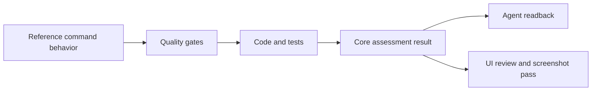
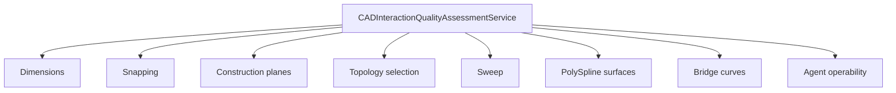
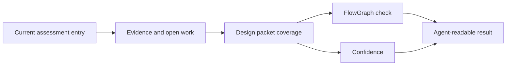

# CAD UI Objective Evaluation

This document defines how Rupa evaluates CAD UI quality without relying on subjective impressions. The canonical machine-readable form is `CADInteractionQualityAssessmentService` in RupaCore, and Agent callers can read it through `cadInteractionQualityAssessment`.

This evaluation model is an implementation surface for `DESIGN_PROCESS.md`.
Assessment entries now carry Agent-readable design process packets with case
sets, route mappings, observations, confidence, and connection graph checks.
Case sets, route surfaces, invariants, and decision records are now
capability-specific. The remaining upgrade is direct observation ingestion from
review, test, performance, and missing-channel evidence plus confidence
calibration against measured results.

## Evaluation Flow

## Quality Gates

| Gate | Objective question |
|---|---|
| Reference contract | Is the workflow backed by the official reference behavior instead of a screenshot guess? |
| Source ownership | Is the editable CAD source persisted instead of only display geometry? |
| Command contract | Does mutation go through a typed command with validation, diagnostics, undo/redo, and stale-generation protection? |
| Selection topology | Can object, face, edge, vertex, region, sketch, or construction targets be addressed with stable IDs? |
| Viewport affordance | Does the viewport expose valid actions, target state, previews, and rejection states? |
| Inspector affordance | Does the Inspector explain selected targets and backed editable properties? |
| Agent parity | Can the same workflow be discovered and executed or read by the Agent without private UI-only state? |
| Measurement diagnostics | Can users inspect the result or receive a structured unsupported diagnostic? |
| Verification | Are tests scoped to the shipped behavior rather than only helper functions? |
| Performance budget | Is there a timing or memory budget before broadening dense workflows? |

## Current Assessment Shape

| Rating | Meaning |
|---|---|
| `missing` | No usable implementation evidence exists. |
| `planned` | The design direction is recorded, but implementation evidence is not present. |
| `partial` | Some vertical slices exist, but at least one important CAD gate is incomplete. |
| `implemented` | The feature has source, command, selection, UI/Inspector or Agent paths, and diagnostics for its supported subset. |
| `verified` | The implemented subset is covered by tests at the same scope as the claimed behavior. |

## Rule

No new CAD UI feature is complete until its assessment entry names the reference source, evidence files, tests, open work, and next required result. Screenshot comparison and UI tests are the final verification layer, not the definition of completion.

## Required Upgrade

| Assessment field | DBN role | Current state |
|---|---|---|
| Case matrix | `CaseSet` | Present on every assessment entry; supported, boundary, degenerate, rejected, and performance cases are authored per capability and augmented by gate evidence/open work. |
| Route matrix | `MappingSpec` | Present on every assessment entry; routes now use capability-specific documentation, UI, Core, Automation, Agent, CLI, kernel, evaluation, measurement, and diagnostics surfaces instead of layer-name defaults. |
| Decision records | `ResolvedMapping` and `DecisionLog` | Present as packet resolution records; selected route IDs are derived from the actual route matrix and feature-specific conflicts/rationales are recorded. |
| Observation records | `ObservationSet` and `FeedbackSignal` | Present from open work; D3 must ingest review, test, performance, and missing-channel observations directly. |
| Connection checks | `FlowGraph` | Present and validated in Core tests; documentation-to-product and capability-specific route requirements are part of the graph. |
| Confidence | Posterior confidence proxy | Present as static evidence/test/performance/calibration fields; D3/D4 calibration work must connect human anchors and measured performance. |
