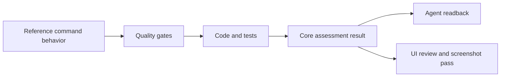
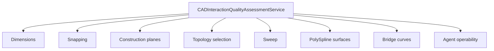
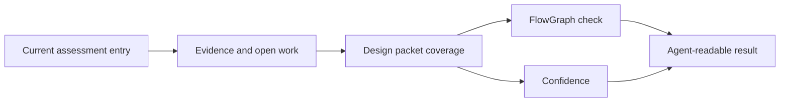

# CAD UI Objective Evaluation

This document defines how Rupa evaluates CAD UI quality without relying on subjective impressions. The canonical machine-readable form is `CADInteractionQualityAssessmentService` in RupaCore, and Agent callers can read it through `cadInteractionQualityAssessment`.

This evaluation model is an implementation surface for `DESIGN_PROCESS.md`.
Assessment entries currently act as `ValidatedArtifact` records. They must evolve
to include the missing DBN process artifacts: case sets, route mappings,
observations, confidence, and connection graph checks.

## Evaluation Flow

## Quality Gates

| Gate | Objective question |
|---|---|
| Reference contract | Is the workflow backed by the official reference behavior instead of a screenshot guess? |
| Source ownership | Is the editable CAD source persisted instead of only display geometry? |
| Command contract | Does mutation go through a typed command with validation, diagnostics, undo/redo, and stale-generation protection? |
| Selection topology | Can object, face, edge, vertex, region, sketch, or construction targets be addressed with stable IDs? |
| Viewport affordance | Does the viewport expose valid actions, target state, previews, and rejection states? |
| Inspector affordance | Does the Inspector explain selected targets and backed editable properties? |
| Agent parity | Can the same workflow be discovered and executed or read by the Agent without private UI-only state? |
| Measurement diagnostics | Can users inspect the result or receive a structured unsupported diagnostic? |
| Verification | Are tests scoped to the shipped behavior rather than only helper functions? |
| Performance budget | Is there a timing or memory budget before broadening dense workflows? |

## Current Assessment Shape

| Rating | Meaning |
|---|---|
| `missing` | No usable implementation evidence exists. |
| `planned` | The design direction is recorded, but implementation evidence is not present. |
| `partial` | Some vertical slices exist, but at least one important CAD gate is incomplete. |
| `implemented` | The feature has source, command, selection, UI/Inspector or Agent paths, and diagnostics for its supported subset. |
| `verified` | The implemented subset is covered by tests at the same scope as the claimed behavior. |

## Rule

No new CAD UI feature is complete until its assessment entry names the reference source, evidence files, tests, open work, and next required result. Screenshot comparison and UI tests are the final verification layer, not the definition of completion.

## Required Upgrade

| Missing assessment field | DBN role | Required result |
|---|---|---|
| Case matrix | `CaseSet` | Supported, rejected, missing, boundary, degenerate, and performance cases are visible to UI review and Agent callers. |
| Route matrix | `MappingSpec` | UI, Core, Automation, Agent, CLI, kernel, evaluation, measurement, and diagnostics routes are explicit. |
| Decision records | `ResolvedMapping` and `DecisionLog` | Route conflicts and source-ownership tradeoffs are recorded instead of being implicit in code. |
| Observation records | `ObservationSet` and `FeedbackSignal` | Reviews, test failures, performance measurements, and missing channels route work back to the right layer. |
| Connection checks | `FlowGraph` | A claimed capability cannot be unreachable from a required caller surface. |
| Confidence | Posterior confidence proxy | Ratings account for evidence freshness, missing channels, performance data, and calibration state. |
