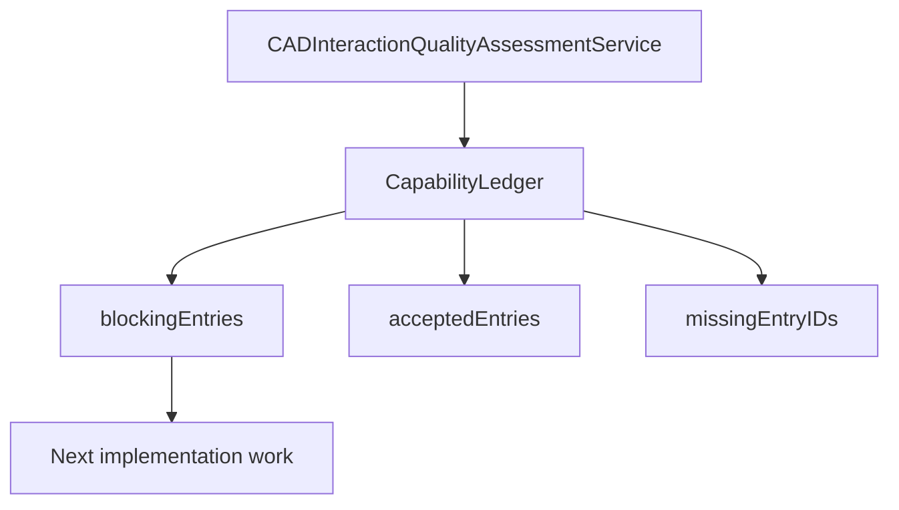

# Rupa Capability Ledger

## Status

This document defines the implementation ledger used to decide whether a
capability can be treated as complete.

| Field | Value |
|---|---|
| Scope | Capability completion tracking |
| Source model | `CapabilityLedger` in `RupaCore` |
| Initial data source | `CADInteractionQualityAssessmentService` |
| Capability completion authority | The capability design packet and its executable evidence audit, under `SPECIFICATION_AUTHORITY.md` |
| Workflow authority | `ACCEPTANCE_WORKFLOW_CONTRACTS.md` |
| Release authority | `CONFORMANCE_PROFILES.md` |
| Specification authority | `SPECIFICATION_AUTHORITY.md` |

## Purpose

Rupa must not treat a feature as complete because one narrow command works. The
ledger exposes each capability as a gate-backed record so UI, Agent, CLI, docs,
and tests can agree on what remains incomplete.

## Gate Model

The initial ledger reuses `CADInteractionQualityGate` so it stays aligned with
the existing CAD quality assessment.

| Gate family | Meaning |
|---|---|
| Reference contract | The target behavior and references are explicit. |
| Source ownership | Editable source ownership is known. |
| Command contract | Mutation enters command-backed routes. |
| Selection topology | Stable object and subobject references exist. |
| Viewport affordance | Canvas interaction exposes the capability. |
| Inspector affordance | Contextual property editing exposes the capability. |
| Agent parity | Agent can discover, query, or execute the capability. |
| Measurement diagnostics | Readback and diagnostics are typed. |
| Verification | Tests cover the claimed surface. |
| Performance budget | Dense or large-scale behavior has a budget. |

## Implementation Contract

| Type | Responsibility |
|---|---|
| `CapabilityLedgerEntry` | Queryable capability record with gate assessments, evidence, open work, and next required result. |
| `CapabilityLedger` | Sorted collection with accepted entry, blocking gate, and missing required ID queries. |
| `CapabilityLedgerService` | Builds the initial ledger from the current CAD interaction quality assessment. |

The ledger is intentionally neutral. Concrete domain modules can add entries
later, but lower layers must not import concrete domains just to build the
ledger.

Ledger entries are evidence indexes, not evidence authorities. A handwritten
rating, source path, or test name cannot mark a capability conforming unless the
referenced artifact directly proves the requirement and the completion audit
checks that coverage.

## Current Boundary

The current implementation covers the universal CAD interaction ledger and can
merge ledger entries provided by higher-level modules. Domain Foundation and the
initial Manufacturing module now provide their own completion entries without
making `RupaCore` import concrete domains.

| Area | Current status |
|---|---|
| Universal CAD interaction entries | Implemented through `CADInteractionQualityAssessmentService`. |
| Query API | Implemented through `CapabilityLedgerService`, including `additionalEntries` composition and category filtering. |
| Domain Foundation entry | Experimental foundation. Per-entity/source ownership, exact persisted-document projection dependency identities, isolated staged transactions, single-state transaction publication, immutable query contexts with executor-owned result identity, artifact-bound references, typed capability effects/results, and dry-run mutation reporting are implemented and covered by focused tests. Per-source edit preflight, external dependency resolution, effect-specific artifact/export/job executors, typed result schemas, and performance budgets remain blocking. |
| Manufacturing entry | Experimental. Outcome/fidelity separation, required-policy blocking, artifact-bound mesh regions, process catalogs, and initial export preflight are implemented. Persisted build-frame/machine/material source, typed quantities, exact-geometry rules, format-specific mapping, override provenance, shared region resolution, spatial acceleration, copy budgets, and powder escape-path analysis remain blocking. |
| Architecture, turbomachinery, character, simulation entries | Next step with the corresponding concrete modules. |
