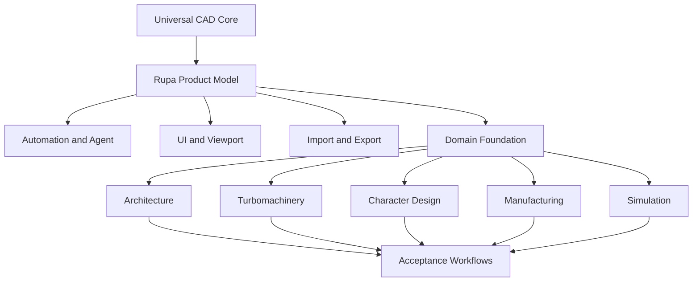
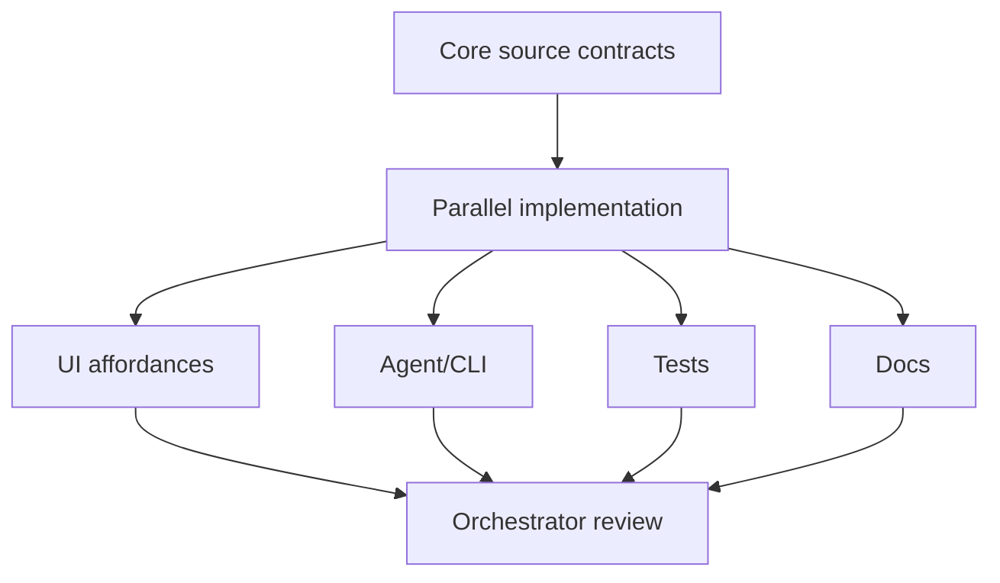
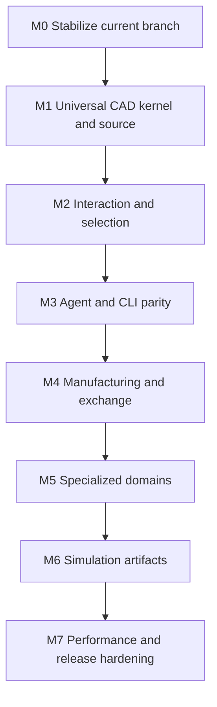

# Rupa Complete Implementation Plan

## Status

This document defines the no-compromise implementation plan for completing Rupa
as a universal, agent-ready CAD system with specialized domain extensions.

| Field | Value |
|---|---|
| Product | Rupa |
| Scope | Complete implementation planning |
| Related architecture | `DOMAIN_EXTENSION_ARCHITECTURE.md` |
| Universal 3D architecture | `UNIVERSAL_3D_ARCHITECTURE.md` |
| Universal 3D detailed work packages | `UNIVERSAL_3D_IMPLEMENTATION_PLAN.md` |
| Related foundation design | `DOMAIN_FOUNDATION_DESIGN.md` |
| Capability ledger | `CAPABILITY_LEDGER.md` |
| Process authority | `DESIGN_PROCESS.md` |
| Quality authority | `CAD_QUALITY_MILESTONES.md` |
| Workflow acceptance authority | `ACCEPTANCE_WORKFLOW_CONTRACTS.md` |
| Release completion authority | `CONFORMANCE_PROFILES.md` |
| Specification precedence | `SPECIFICATION_AUTHORITY.md` |
| Reference authority | `REFERENCE_ARTIFACT_CONTRACT.md` |
| Transaction authority | `DOMAIN_TRANSACTION_CONTRACT.md` |
| Validation authority | `VALIDATION_CONTRACT.md` |
| Completion rule | A capability is not complete until source, command, evaluation, selection, UI, Automation, Agent, diagnostics, performance, and tests all pass their gates. |

## Completion Definition

The long-term Rupa suite targets every workflow below. A named release is
complete for the profiles it declares in `CONFORMANCE_PROFILES.md`; it does not
need to pretend every future domain is part of the same release gate. Every
declared profile still requires complete vertical evidence and uses one `.swcad`
document without command or document forks.

| Area | Complete means |
|---|---|
| Universal CAD | All required body types, feature types, parameters, constraints, topology references, drawing/inspection, validation, and exchange workflows are command-backed and tested. |
| Agent readiness | Every supported operation is discoverable, executable or queryable, generation-safe, dry-run aware where applicable, and returns typed diagnostics. |
| Domain extensibility | Specialized semantics live in domain modules, use neutral RupaCore storage, register through `RupaDomainFoundation`, and never force lower layers to import concrete domains. |
| Specialized workflows | Architecture, turbomachinery, character, manufacturing, and simulation workflows use the same document, command stack, selection model, validation model, and Agent transport. |
| Performance | Large coordinate ranges, dense topology, heavy mesh/surface data, import/export, and analysis paths have measured budgets and regression tests. |
| Reliability | Undo/redo, stale generation, transactional batch rollback, unknown namespace preservation, file safety, and app-connected live editing are proven by tests. |

## Non-Negotiable Gates

No feature is allowed to claim completion unless every gate below is satisfied.

```mermaid
flowchart LR
    Intent["Design packet"] --> Source["Source ownership"]
    Source --> Command["Command path"]
    Command --> Eval["Evaluation"]
    Eval --> Select["Selection references"]
    Select --> UI["UI affordance"]
    UI --> Automation["CLI/Agent"]
    Automation --> Diagnostics["Diagnostics"]
    Diagnostics --> Performance["Performance budget"]
    Performance --> Tests["Tests and review"]
```

| Gate | Required evidence |
|---|---|
| Design packet | `DESIGN_PROCESS.md` artifacts exist: intent, cases, mapping, constraints, resolved decisions, validation evidence, observations, and flow graph. |
| Source ownership | Exactly one editable source owner exists for every parameter and generated reference. |
| Command path | Mutation enters `CommandStack`, participates in undo/redo, handles stale generations, and rejects unsupported cases before mutation. |
| Evaluation | The source regenerates deterministic geometry, topology, measurements, or analysis artifacts. |
| Selection | Object, face, edge, vertex, sketch, surface, semantic, and analysis references are stable where supported. |
| UI affordance | Canvas, Inspector, Browser, command palette, and diagnostics expose the same capability contract without duplicating domain rules. |
| Automation and Agent | The capability is discoverable and executable/queryable through structured APIs with typed results. |
| Diagnostics | Failure explains what changed, what did not change, what reference failed, and how to proceed. |
| Performance | Dense-scene, large-coordinate, and large-payload budgets are measured or explicitly blocked before broadening support. |
| Tests | Unit, integration, package, CLI/Agent, rendering, and app-build or UI workflow tests cover the implemented surface. |

## Workstream Map

| Workstream | Primary owner | Depends on | Deliverables |
|---|---|---|---|
| W0 Architecture enforcement | Rupa documents and package graph | Current architecture docs | Dependency rules, module ownership tests, forbidden import checks, completion dashboards. |
| W1 Universal source model | Swift-CAD, RupaCore | Existing CAD source | Parameters, constraints, feature graph, body kinds, persistent references, object semantics. |
| W2 Modeling kernel parity | Swift-CAD first, RupaCore second | W1 | Robust booleans, fillets, chamfers, shell, draft, holes, sweep, loft, pattern, direct edits. |
| W3 Surface and curve foundation | Swift-CAD, RupaCore | W1, W2 | NURBS/B-spline curves and surfaces, UVN frames, trims, continuity, PolySpline reconstruction. |
| W4 Selection and viewport interaction | RupaRendering, RupaUI, RupaCore | W1-W3 | Stable picking, handles, previews, hover, drag, subobject and semantic selection. |
| W5 Drawings and inspection | RupaCore, RupaUI, export services | W1-W4 | Hidden-line, sections, dimensions, sheets, schedules, annotations, mass/area/volume. |
| W6 Automation and Agent contract | RupaAutomation, RupaAgent, RupaCLIKit | W1-W5 | Capability discovery, command execution, batch transactions, dry run, typed diagnostics. |
| W7 Domain foundation | RupaCore, RupaDomainFoundation | W0-W6 baseline | Semantic storage, projection manifest, registry, validators, ownership resolver, capability registry. |
| W8 Manufacturing | RupaManufacturing | W1-W7 | 3D print/CNC readiness, thickness, clearance, supportability, build volume, export validation. |
| W9 Architecture | RupaArchitecture | W7, W5 | Site, level, room, wall, opening, roof, schedules, building drawings, IFC/DXF/PDF paths. |
| W10 Turbomachinery | RupaTurbomachinery, RupaSimulation | W3, W7 | Airfoil, blade, rotor/stator, duct/nozzle, boundary tags, CFD/FEA handoff. |
| W11 Character and visual assets | RupaCharacterDesign | W3, W7 | Skeleton, control cage, skin surface/mesh, blend shape, UV/export readiness. |
| W12 Simulation | RupaSimulation | W7-W11 | Solver input manifests, boundary conditions, derived result artifacts, result visualization. |
| W13 Exchange and interoperability | Swift-CAD, RupaCore, export/import services | W1-W12 | STEP, IGES, STL, 3MF, OBJ, GLB, USD/USDZ, DXF, IFC, PDF, SVG with reports. |
| W14 Performance and reliability | All layers | Continuous | Zero-copy data flow, cancellable tasks, benchmarks, stress tests, recovery tests. |

## Execution Phases

### Phase 0: Architecture Lock

Goal: prevent future responsibility leaks before adding more behavior.

| Task | Done state |
|---|---|
| Dependency guard | Package graph and source imports prove lower layers do not import concrete domains. |
| Completion dashboard | Each capability has gate status across source, command, evaluation, selection, UI, Agent, diagnostics, performance, tests. |
| Design packet index | Every planned capability has a DBN design packet or an explicit missing-packet task. |
| Unknown extension policy | Documents with unknown semantic namespaces load/save safely and reject semantic edits with typed diagnostics. |

### Phase 1: Universal CAD Completeness

Goal: finish the shared CAD foundation before relying on domain semantics.

| Capability family | Required completion |
|---|---|
| Units and scale | Micrometer through kilometer workflows, local origins, workspace rebase, readable units, mixed-unit inputs. |
| Parameters and constraints | Named formulas, dependency tracking, sketch/entity constraints, overdefined/underdefined diagnostics. |
| Body types | Solid, surface, mesh, curve, sketch, construction bodies remain distinct in source, UI, and Agent output. |
| Persistent references | Source and generated topology references survive supported edits or fail with repair diagnostics. |
| Components and assemblies | Reusable definitions, instances, hierarchy, transforms, local origins, visibility, locks, simple joints. |
| Materials and metadata | Visual, physical, manufacturing, per-object/per-face bindings, classification, custom properties. |

### Phase 2: Modeling Kernel Completeness

Goal: implement the modeling operations expected from a serious CAD system.

| Track | Required operations |
|---|---|
| Sketch and curves | Lines, arcs, circles, rational curves, NURBS, splines, bridge curves, offsets, trims, joins, rebuild, continuity. |
| Solids | Extrude, revolve, sweep, loft, shell, hole, draft, fillet, chamfer, boolean, pattern, mirror, direct face/edge/vertex edits. |
| Surfaces | Planar, ruled, lofted, swept, offset, trim, stitch, thicken, patch, bridge, match, extend, CV/knot/weight editing. |
| Mesh | Mesh import, analysis, repair, decimation, normals, smoothing, mesh-to-surface reconstruction, tessellation controls. |
| Drawings | Hidden-line, sections, hatches, dimensions, annotations, sheets, schedules, PDF/SVG/DXF export. |

### Phase 3: Automation and Agent Parity

Goal: Agent can do everything the product claims, with the same safety model as UI.

| Area | Required completion |
|---|---|
| Capability discovery | Universal and domain capabilities are listed with inputs, units, reference types, dry-run support, mutation behavior, and failure modes. |
| Execution | Every mutating capability has GUI, CLI/file, CLI/live, Agent/live, and batch transaction paths where safe. |
| Readback | Agent can inspect source, generated topology, semantic objects, dimensions, validation, drawings, exports, and analysis results. |
| Planning | Agent can preflight operations, resolve references, request snap/measurement/topology summaries, and avoid stale generation. |
| Recovery | Failed operations return structured rollback and no-mutation evidence. |

### Phase 4: Domain Foundation Completion

Goal: add domain semantics without compromising universal CAD.

| Area | Required completion |
|---|---|
| Core storage | `SemanticExtensionEnvelope` and `ProjectionManifest` round-trip in `.swcad`, preserve unknown namespaces, and validate structurally. |
| Registry | Namespace, capability, validator, projection repair, and simulation adapter registries are immutable and injected. |
| Ownership resolver | Domain-owned, universal-owned, classified, unknown, and stale projections are resolved before edits. |
| Command lowering | Domain operations lower to universal command batches or explicit domain editor commands through `CommandStack`. |
| UI/CLI/Agent discovery | All surfaces consume the same registered capability descriptors. |

### Phase 5: Specialized Workflow Completion

Goal: prove the same system works across very different expert domains.

| Domain | Required complete workflow |
|---|---|
| Architecture | Import or define site, create levels, rooms, walls, openings, roofs, validate area/clearance/enclosure, generate drawings/schedules, export IFC/DXF/PDF. |
| Manufacturing | Validate wall thickness, clearance, overhangs, supportability, build volume, material/process metadata, export STL/3MF/STEP with diagnostics. |
| Turbomachinery | Create airfoil sections, blade laws, rotor/stator arrays, ducts/nozzles, manufacturable fillets, boundary tags, CFD/FEA handoff artifacts. |
| Character design | Create skeleton/control cage/skin, edit surface/mesh, validate topology/UV/deformation readiness, export DCC-ready assets. |
| Simulation | Prepare reproducible solver inputs, run/import results where supported, visualize results, and require explicit commands for design changes. |

### Phase 6: Interoperability Completion

Goal: production handoff is explicit, diagnosable, and testable.

| Format family | Required behavior |
|---|---|
| Exact CAD | STEP and IGES import/export with units, topology, source provenance, and unsupported-feature diagnostics. |
| Mesh and print | STL, OBJ, 3MF, GLB with tessellation policy, normals, scale, material, and repair diagnostics. |
| DCC and spatial | USD, USDA, USDC, USDZ, GLB with hierarchy, pivots, transforms, materials, and mesh exchange diagnostics. |
| Building and drawings | IFC, DXF, PDF, SVG with semantic mapping reports, drawing scales, annotations, schedules, and fallback diagnostics. |

### Phase 7: Performance and Release Hardening

Goal: completion is measured, not assumed.

| Area | Required completion |
|---|---|
| Zero-copy and memory | Heavy geometry paths use shared buffers, streaming, or immutable snapshots where ownership allows; avoid repeated large array copies. |
| Incremental evaluation | Edits invalidate only affected dependencies where possible. |
| Cancellable work | Import, export, tessellation, evaluation, and simulation prep are cancellable with cleanup. |
| Benchmarks | Dense topology, large assemblies, large coordinate scenes, domain projections, and import/export have budgets and regression tests. |
| Reliability | File safety, live session safety, undo/redo, batch rollback, unknown namespace preservation, stale generation, and crash recovery are covered. |

## Acceptance Matrix

`ACCEPTANCE_WORKFLOW_CONTRACTS.md` is the workflow-level authority for these
cases. The matrix below is only a summary; completion requires the full source,
command, evaluation, selection, UI, Agent/CLI, export or handoff, diagnostics,
performance, and test evidence defined by that document.

| Acceptance case | Required proof |
|---|---|
| Precision part | Parametric part with dimensions, fillets, booleans, material, print/fabrication validation, STEP/STL/3MF export. |
| Architecture house | Site, levels, rooms, walls, doors/windows, roof, drawings, schedules, IFC/DXF/PDF export, Agent-editable changes. |
| Turbomachinery component | Airfoil/blade/duct source, surface continuity, manufacturability checks, boundary tags, CFD/FEA handoff artifact. |
| Character asset | Control cage or skeleton-backed body, surface/mesh editing, UV/export diagnostics, DCC-ready USD/GLB output. |
| Agent-generated variant set | Agent creates variants, runs validation, exports artifacts, and reports structured differences without manual source edits. |

## Parallelization Plan

Parallel work is allowed only where ownership boundaries are clear.

| Safe to parallelize | Must stay centralized |
|---|---|
| Tests after source contract is fixed | Source ownership decisions |
| UI affordance after command contract is fixed | Document schema and migration decisions |
| Agent/CLI adapters after Automation contract is fixed | Dependency direction changes |
| Import/export adapters after format policy is fixed | Kernel geometry semantics |
| Domain validators after semantic schema is fixed | Cross-domain shared type promotion |

The orchestrator must review final integration, enforce dependency direction,
run targeted tests, and correct architectural drift before any milestone is
called complete.

## Implementation Order

| Order | Work item | Reason |
|---:|---|---|
| 1 | Add architecture/dependency guards and capability completion dashboard | Prevent responsibility leaks while the surface expands. Source-import guards, Package.swift production target graph guards, extensible `CapabilityLedger` composition, DomainFoundation ledger entry, and initial Manufacturing ledger entry are implemented; keep the expected graph and ledger providers current as modules land. |
| 2 | Maintain workflow acceptance contracts | Prevent broad completion claims from drifting away from source, command, evaluation, selection, UI, Agent/CLI, export/handoff, performance, and test evidence. |
| 3 | Implement RupaCore semantic storage DTOs and unknown namespace preservation | Required before any domain can persist safely. |
| 4 | Add `RupaDomainFoundation` registry contracts | Enables domain discovery without concrete imports. |
| 5 | Add ownership resolver and projection manifest checks | Prevents semantic/CAD source drift. |
| 6 | Wire domain capability discovery and typed execution into Agent/CLI/UI | Proves one registered contract before specialized mutations. Typed scalar/choice parameter paths, units, defaults, nullability, numeric bounds, nested payload construction, Agent discovery, Workspace forms, DomainCommandExecutor dispatch, AgentHost/CLIService injection, and macOS app composition are implemented for the initial Manufacturing registry. Selection-reference/collection/file parameters, CLI executable standard-domain wiring, and plugin composition remain open. |
| 7 | Add generic domain execution and transaction tests | Enables safe domain commands. |
| 8 | Finish the precision mechanical part workflow foundation | Domains must not work around missing universal source, topology, material, validation, exchange, or Agent gaps. |
| 9 | Implement manufacturing validators first | Cross-cutting validation proves domain-neutral analysis. `RupaManufacturing` now includes typed injectable process profiles, catalog-derived UI/Agent choices, unknown-process rejection, initial process-specific support strategies, face-process conflict checks, required material gating, generated-body/triangle/build-volume/mesh/wall-thickness/clearance analysis, artifact-bound mesh violation regions, and STL/3MF/STEP export preflight. Persisted build-frame/process/machine/material settings, orientation-aware support regions, trapped-powder/escape-path analysis, format-specific face-material/process export mapping, shared region resolution, typed quantities, exact-geometry cases, policy override provenance, spatial acceleration, and performance budgets remain open. |
| 10 | Implement Agent-generated variants on the precision workflow | Proves dry-run, rollback, diff, validation, and export fan-out before domain workflows rely on Agent autonomy. |
| 11 | Implement architecture pilot to full workflow | Exercises semantic modeling, drawings, schedules, building-scale units, and export. |
| 12 | Implement turbomachinery pilot to solver handoff | Exercises surfaces, continuity, boundary tags, and simulation. |
| 13 | Implement character/visual asset workflow | Exercises mesh/surface/DCC export, pivots, UV/material readiness, and non-engineering assets. |
| 14 | Complete exchange formats and performance hardening | Production workflows require reliable handoff and scale. |

## No-Compromise Milestone Backlog

The implementation backlog is organized by vertical proof, not by isolated
source files. A milestone is complete only when the acceptance workflow can be
performed by the UI and by Agent/CLI on the same `.swcad` document with the same
diagnostics and ownership rules.

| Milestone | Required result | Blocking work | Proof before moving on |
|---|---|---|---|
| M0 Stabilize current branch | Completed on 2026-07-10 for the previous implementation baseline. The later specification audit found reference, entity-ownership, atomic transaction, validation-outcome, and conformance-authority defects that now form the next architecture correction. | Preserve baseline behavior while replacing the invalid contracts; do not treat the previous M0 result as proof of the corrected architecture. | Corrected contract tests, focused package tests, app build, `git diff --check`, forbidden-pattern scan, and updated evidence ledger. |
| M1 Universal CAD kernel and source | Shared CAD source supports the precision mechanical part workflow without domain workarounds. | Robust booleans, fillets, chamfers, shell/hollow, holes, sweep, loft, draft, pattern, direct edits, body kind separation, stable persistent references, object-level and face-level material/process binding. | Precision mechanical part workflow evidence in `ACCEPTANCE_WORKFLOW_CONTRACTS.md`, including source, evaluation, selection, UI, Agent/CLI, export, undo/redo, diagnostics, performance, and tests. |
| M2 Interaction and selection | Canvas, Inspector, Browser, command palette, and viewport overlays expose object, face, edge, vertex, curve CV, surface CV, semantic, and analysis references through one selection contract. | Remove UI-local rule duplication, fix intrusive canvas affordances, stabilize hover/snap/gizmo behavior, keep overlay controls compact and non-blocking. | Rendering tests, package UI tests, app build, and final UI workflow tests only after logic is stable. |
| M3 Agent and CLI parity | Agent and CLI can discover, preflight, execute, dry-run, and query every supported UI operation. | Scalar/choice domain forms and generic registered execution are implemented. Selection-reference/collection/file domain inputs, full live/file safety, rollback evidence, and readback summaries for planning remain. | Agent contract tests, runtime tests, CLI file/live tests, and golden JSON response tests. |
| M4 Manufacturing and exchange | Manufacturing is a production gate, not a report-only helper. | Typed process catalog, initial angle-limited/surrounding-powder strategies, outcome/fidelity policy, and artifact-bound mesh regions are implemented. Persisted build-frame/process/machine/material settings, orientation-aware support regions, trapped-powder/escape-path analysis, format-specific face-material/process export mapping, shared region resolution, typed quantities, exact-geometry cases, policy override provenance, spatial acceleration, mesh repair diagnostics, USD/GLB mesh-exchange diagnostics, and measured performance budgets remain. STL/3MF/STEP preflight now enforces required material and face-process consistency in addition to current geometry checks. | Printability acceptance case exports only when validators pass or when explicit override policy records risk. |
| M5 Specialized domains | Architecture, turbomachinery, and character workflows use semantic extensions and projection manifests without forking `.swcad`. | Architecture site/level/wall/opening/room/roof/drawing/export; turbomachinery airfoil/blade/duct/boundary tags; character skeleton/control cage/skin/UV/export readiness. | The single-story house, turbomachinery component, and character/game-asset contracts pass through UI and Agent with projection ownership and repair diagnostics. |
| M6 Simulation artifacts | Simulation handoff is reproducible and does not mutate CAD source implicitly. | Solver input manifests, boundary-condition mapping, input hashes, solver/result metadata, stale-result invalidation, result visualization. | CFD/FEA handoff artifact can be regenerated and compared from the same document generation. |
| M7 Performance and release hardening | Completion is measured against large scenes, large coordinates, dense topology, and large payloads. | Zero-copy geometry paths, streaming exchange, incremental evaluation, cancellable work, benchmark fixtures, recovery tests. | Budgeted benchmark suite and reliability suite pass before release claims. |

## Parallel Execution Rules

Parallel work is allowed only after the source contract and acceptance evidence
for that milestone are written down. Sub-agents may implement independent
adapters and tests, but the orchestrator owns schema, dependency direction,
source ownership, kernel semantics, and final integration review.

| Parallel lane | May start when | Must deliver |
|---|---|---|
| UI affordance lane | Command descriptor, selection references, and diagnostics are fixed. | Compact controls, Inspector/Browser integration, rendering/package tests. |
| Agent/CLI lane | Automation or domain execution contract is fixed. | Discovery, dry-run, live/file execution, rollback evidence, JSON tests. |
| Validation lane | Evaluated geometry and semantic references are fixed. | Typed diagnostics, non-mutating reports, edge-case tests, ledger updates. |
| Exchange lane | Export/import policy, units, and topology/material mapping are fixed. | Format-specific reports, round-trip tests where possible, failure diagnostics. |
| Documentation lane | Acceptance case and implementation result are known. | Design packet, capability ledger, status update, completion report. |

The following decisions are not parallelized: persisted document shape, semantic
ownership, dependency direction, source-kernel behavior, generated topology
identity, and cross-domain shared type promotion.

## Stabilization Gate Evidence

M0 was completed on 2026-07-10. The current domain-extension baseline proves
that Manufacturing analysis is non-mutating, empty documents
produce printability diagnostics instead of evaluation failures, export
readiness handles CAD tessellation with duplicated face vertices, STL/3MF/STEP
export preflight uses the same Manufacturing diagnostics, object-level material
assignment reaches validation and export preflight through evaluated mesh/body
material readback, complete face-level material coverage reaches validation
through topology material bindings, and lower layers still do not import
concrete domain modules.

| Check | Required command or evidence |
|---|---|
| Manufacturing focused tests | `xcodebuild test -scheme RupaKit-Package -destination 'platform=macOS' -only-testing:RupaManufacturingTests` |
| Domain/Agent/CLI focused tests | `xcodebuild test -scheme RupaKit-Package -destination 'platform=macOS' -only-testing:RupaManufacturingTests -only-testing:RupaDomainFoundationTests -only-testing:RupaKitTests/ArchitectureBoundaryTests -only-testing:RupaAgentContractTests/AgentProtocolCodecTests/agentMessageCodecRoundTripsDomainExecuteRequestAndResponse -only-testing:RupaCLITests/CLIResponseTests/cliServiceExecutesDomainFileThroughRegisteredLowering -only-testing:RupaCLITests/CLIResponseTests/cliServiceDomainFileDryRunDoesNotPersist` |
| Static hygiene | `git diff --check` and a focused forbidden-pattern scan over touched Swift files. |
| App composition | Rupa app build after package checks pass. |
| Documentation | `CAPABILITY_LEDGER.md`, `DOMAIN_FOUNDATION_DESIGN.md`, and this plan reflect the current gate status. |

The focused Domain Foundation, Manufacturing, architecture-boundary,
Agent-codec, and CLI file/dry-run suites pass from one build-for-testing
baseline. The complete `RupaManufacturingTests` target passes, the Rupa macOS
scheme builds with the composed registry, `git diff --check` passes, and the
focused forbidden-pattern scan reports no `try?`, forced cast, `fatalError`,
`DispatchQueue`, `EventLoopFuture`, or `@unchecked Sendable` use in the touched
contract and UI files.

## Completion Reporting

Each milestone completion report must include:

| Section | Required content |
|---|---|
| Scope | Capabilities completed and explicitly unsupported cases. |
| Architecture | Dependency graph check and ownership decisions. |
| Implementation | Source files and command/data flow summary. |
| Verification | Exact test commands, results, and remaining coverage gaps. |
| Performance | Benchmarks or reason performance is not on the critical path. |
| Agent readiness | Discovery, execution, dry-run, result, and diagnostic evidence. |
| Risks | Known risks with owner and next action, not vague future work. |
