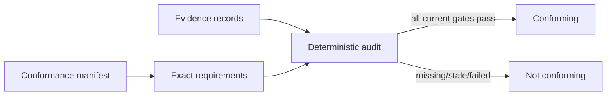

# Rupa Conformance Manifest Contract

## Purpose

This document defines the machine-verifiable release profile and evidence model.
Human plans, status notes, and capability ledgers may project this data but cannot
replace it.

## Terminology

| Term | Meaning |
|---|---|
| Conformance manifest | Immutable release claim listing exact required capabilities, cases, workflows, schemas, and evidence gates |
| Workspace preset | User-facing defaults and UI emphasis; does not define implementation availability or release conformance |
| Manufacturing process definition | Domain input describing a physical process, machine, material compatibility, and limits |
| Capability implementation | Registered executable operation with a stable ID and contract version |
| Capability case set | Versioned supported, rejected, boundary, degenerate, and performance cases |
| Evidence record | Reproducible observation that one requirement passed or failed under a declared source revision and environment |

The unqualified word `profile` is not used in normative APIs or new requirements.

## Conformance Manifest

Every releasable claim has a stable manifest ID and version and contains:

| Field | Requirement |
|---|---|
| Product/release identity | Product version, build identity, source commit, manifest ID/version |
| Required capabilities | Capability ID, contract version, implementation provider/version, and case-set ID/version |
| Required workflows | Workflow ID/version and ordered requirement IDs |
| Required fixtures | Fixture ID/version/content fingerprint and expected source/artifact identities |
| Required evidence gates | Source, command, evaluation, reference, interaction, automation, diagnostics, handoff, performance, and verification gates per capability/workflow |
| Compatibility tuple | Accepted package, CAD source, Rupa source, protocol, domain namespace, exchange-policy, record, and artifact-cache schema versions |
| Dependencies | Exact IDs and versions of prerequisite conformance manifests |
| Unsupported boundary | Cases and claims deliberately outside this manifest |

Broad nouns such as "relevant manufacturing capabilities" or "supported direct
edits" do not define a conformance scope. They must resolve to exact capability
and case-set IDs.

## Evidence Record

An evidence record contains:

- requirement ID and revision;
- capability/workflow/case/fixture IDs and versions;
- product commit and build identity;
- test or observation provider and version;
- host/toolchain/OS/architecture environment;
- input source and artifact fingerprints;
- start/end time and result;
- diagnostics and measured performance/copy budgets;
- referenced output artifact fingerprints;
- freshness state against the manifest and current requirement revision.

A test filename, handwritten status sentence, or passing build alone is not an
evidence record.

## Completion Evaluation

`Experimental` means a bounded case set executes but the corresponding manifest
audit is incomplete. `Conforming` means every required current evidence record is
present and passing. Implementation ledgers may use progress states, but those
states do not map to conformance without this audit.

## Workspace Preset Authority

Workspace presets may choose defaults, visibility, ordering, and UI emphasis for
already registered capabilities. Module composition and authorization policy
determine whether a capability exists or may execute. A workspace preset cannot
change command semantics, hide a required capability from automation discovery,
or turn an unavailable implementation into a supported claim.

## Required Tests

| Test family | Required cases |
|---|---|
| Manifest | Duplicate IDs, unresolved dependencies, vague capability references, and incompatible schema tuples reject. |
| Evidence | Missing, failed, stale, wrong-fixture, wrong-provider, and wrong-environment evidence remain distinct. |
| Scope | Core, manufacturing, DCC, architecture, simulation, and Agent-variant claims cannot acquire requirements from another manifest implicitly. |
| Projection | Human status and ledger output are generated from the same manifest/evidence set and cannot elevate maturity. |
