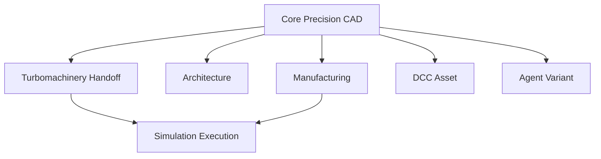

# Rupa Conformance Profiles

## Purpose

Rupa has one product vision and one `.swcad` document model, but it has several
independently testable expert workflows. This file is a human catalog. A release
claim exists only as a versioned machine-readable manifest governed by
`CONFORMANCE_MANIFEST_CONTRACT.md`.

Conformance manifests do not fork the document, command stack, selection model,
UI model, or Agent transport. They define exact conformance scope.

No catalog section below is itself a conformance claim. Each corresponding
manifest must enumerate capability IDs, contract versions, case-set IDs/versions,
workflow IDs/versions, fixture fingerprints, compatibility tuple, and evidence
requirements.

## Profile Model

Every profile uses the same completion gates:

| Gate | Required proof |
|---|---|
| Source | Editable intent has one owner and deterministic regeneration. |
| Command | Mutations use an atomic command transaction with undo/redo and generation checks. |
| Evaluation | Exact or explicitly classified approximate results are reproducible. |
| Reference | Required source, topology, semantic, artifact, and region references resolve or return typed stale/unsupported results. |
| Interaction | UI affordances are usable and do not duplicate domain rules. |
| Automation | Agent and CLI discover, preflight, execute or query, and read back the same supported contract. |
| Diagnostics | Failure, inconclusive, and unsupported outcomes are distinct and actionable. |
| Handoff | Export, drawing, or solver artifacts carry units, coordinates, provenance, and fidelity reports. |
| Performance | Named fixtures meet wall-clock, memory, cancellation, and copy-budget limits. |
| Verification | Unit, integration, workflow, and external-consumer checks cover the claimed surface. |

## Capability Maturity

| State | Meaning |
|---|---|
| Unavailable | No supported product contract exists. |
| Experimental | A bounded case set works, but one or more conformance gates are missing. |
| Conforming | Every required gate for the declared case set has direct evidence. |

`Partial` is permitted in implementation ledgers, but it is not a user-facing
support claim. A profile may expose experimental capabilities only when they are
clearly separated from conforming output and cannot silently satisfy a required
export or safety gate.

## Core Precision CAD Profile

This profile is required by every other profile.

| Area | Required scope |
|---|---|
| Units and coordinates | Meter-based canonical quantities, mixed-unit input, micrometer-detail through kilometer-workspace display, local frames, render origin, and command-backed rebase. |
| Source model | Parameters, formulas, sketches, constraints, construction geometry, feature dependencies, suppression, and deterministic regeneration. |
| Geometry | Distinct solid, surface, mesh, curve, sketch, and construction bodies. |
| Modeling | Production case sets for extrude, revolve, sweep, loft, boolean, shell, hole, draft, fillet, chamfer, pattern, mirror, and supported direct edits. |
| Curves and surfaces | NURBS/B-spline source, UVN frames, trims, continuity, curvature readback, and supported control editing. |
| Structure | Object occurrences, components, hierarchy, local origins, transforms, materials, and stable source ownership. |
| References | Typed persistent model references and artifact-bound derived references. |
| Documentation | Measurements, dimensions, saved views, sections, drawing views, sheets, and the claimed PDF/SVG/DXF subset. |
| Exchange | Format-specific fidelity reports rather than extension-only success. |
| Automation | Capability discovery, typed inputs and outputs, generation-safe execution, deterministic readback, cancellation, and atomic batches. |

The Core precision-source workflow in `ACCEPTANCE_WORKFLOW_CONTRACTS.md` is the
primary acceptance fixture. Manufacturing validation and STL/3MF readiness belong
to the Manufacturing manifest and are not imported into Core implicitly.

## Manufacturing Profile

Depends on Core Precision CAD.

| Area | Required scope |
|---|---|
| Process source | Persisted process, machine, material, build orientation, build volume, and rule-set selection. |
| Analysis | Mesh and exact-geometry fidelity are distinguished for watertightness, wall thickness, clearance, small features, overhangs, supportability, and process-specific limitations. |
| Regions | Every failing or inconclusive geometric rule returns artifact-bound regions resolvable by UI and Agent. |
| Output | STL and 3MF mesh handoff plus the declared STEP exact/approximate policy, with units and material/process mapping reports. |
| Safety | Required unsupported or inconclusive rules block output unless an explicit recorded override policy allows them. |

`manufacturing.printable-enclosure.v1` in
`ACCEPTANCE_WORKFLOW_CONTRACTS.md` is the primary acceptance workflow.

## Architecture Profile

Depends on Core Precision CAD.

| Area | Required scope |
|---|---|
| Semantic source | Site, level, grid, room, wall, opening, slab, roof, and building-element metadata. |
| Projection | Atomic semantic-to-CAD projection with per-entity ownership and repair. |
| Documentation | Plans, sections, elevations, dimensions, sheets, and schedules. |
| Exchange | IFC mapping report and declared entity subset, plus DXF/PDF drawing output. |
| Scale | Building and site coordinates remain usable with local coordinate frames and explicit georeference metadata. |

The single-story house is the primary acceptance fixture.

## Turbomachinery Handoff Profile

Depends on Core Precision CAD and the relevant Manufacturing capabilities.

| Area | Required scope |
|---|---|
| Semantic source | Airfoil sections, stacking, twist, chord, thickness, blade count, hub/shroud, duct/nozzle, clearance, and boundary tags. |
| Geometry | Exact curve/surface generation, trims, continuity, fillets, shells, arrays, and quality diagnostics. |
| Handoff | Reproducible CFD/FEA input manifest with units, frames, boundary tags, source fingerprint, meshing policy, and stale-result rules. |
| Claim boundary | A valid handoff is not a claim that Rupa ran or validated a solver. |

A blade or duct with reproducible solver handoff is the primary acceptance
fixture.

## DCC Asset Profile

Depends on Core Precision CAD.

| Area | Required scope |
|---|---|
| Hard-surface source | Parametric solids, surfaces, pivots, hierarchy, materials, normals, UV metadata, and LOD/export intent. |
| Mesh source | Explicit supported editing and validation subset. |
| Exchange | USD family, GLB, and OBJ mesh exchange with hierarchy, transform, material, normal, UV, unit, and unsupported-schema reports. |
| Organic boundary | Sculpting, retopology, skinning, animation, and full rig authoring are not implied unless a later profile declares them. |

A hard-surface game or visualization asset is the primary acceptance fixture.
Skeleton, skinning, blend-shape, and deformation-readiness requirements belong to
a future character/rig manifest and are not implied by this DCC Asset manifest.

## Agent Variant Profile

Depends on an exact named Core manifest and one exact named domain manifest. The
phrase "any conforming domain" is not a machine-readable dependency.

| Area | Required scope |
|---|---|
| Variant source | Explicit parameter set, source branch, component configuration, or semantic variant identity. |
| Transaction | Create, apply, compare, validate, export, and rollback are atomic and generation-safe. |
| Readback | Source, geometry, metadata, validation, and artifact differences are deterministic and typed. |
| Performance | Cache reuse, bounded fan-out, cancellation, and large-result paging are measured. |

## Simulation Execution Profile

Depends on an exact named handoff manifest. It is separate because preparing input,
running a solver, and validating a physical result are different claims.

| Level | Required scope |
|---|---|
| S1 Prepare | Reproducible input and boundary-condition manifest. |
| S2 Import | Solver result import with provenance, units, source generation, and stale detection. |
| S3 Execute | Managed solver execution with version, environment, progress, cancellation, logs, and artifact cleanup. |
| S4 Validate | Benchmark comparison, convergence criteria, uncertainty, and domain-specific result acceptance. |

A release must name the highest supported level. Turbomachinery efficiency cannot
be claimed from S1 or S2 alone.

## Suite Completion

The long-term Rupa suite is complete for a named release only when every profile
selected by that release is conforming. Future profiles can be added without
invalidating an already conforming release or changing the shared document and
command invariants.
