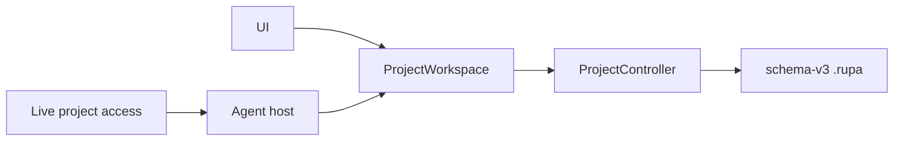

# Rupa Application Package

## Purpose and Scope

This design owns the macOS Rupa application composition built by
`Rupa.xcworkspace`. It is a direct child of the [system design](../DESIGN.md).
Its direct application component is [Rupa App](Rupa/Rupa/DESIGN.md).

## Responsibilities and Boundaries

The package composes UI, `ProjectWorkspace`, `ProjectController`, project
package codecs, the Agent runtime, and the internal live transport. It does not
define CAD/Mesh source semantics, duplicate project state, expose endpoint
placement through semantic status, or let transport mutate project bytes.

## Related Designs

| Design | Relationship | Contract Used | Summary | Cautions |
|---|---|---|---|---|
| [system design](../DESIGN.md) | parent | single project authority | Defines the global access invariant. | Product composition cannot create a second authority. |
| [Rupa App](Rupa/Rupa/DESIGN.md) | child | application lifecycle | Owns the executable process composition. | ACCESS-C completes process-lifetime hosting. |
| [RupaKit package](../RupaKit/DESIGN.md) | depends on | workspace/controller, access, runtime, transport contracts | Supplies all domain and integration modules. | Depend on public contracts only. |

## Architecture

## Contracts and Invariants

1. The App-owned workspace/controller pair is the sole live mutation,
   evaluation, publication, and save authority.
2. The Agent host transports intent to the same registered workspace.
3. Endpoint and App Group placement are product composition details.
4. An attached access session finishing never closes the live document.

## Runtime Flows

UI and live access both resolve the same registered workspace. Explicit save is
delegated to the application lifecycle coordinator and then to the same project
controller. ACCESS-C implements the final launch/readiness/save flow.

## State, Ownership, and Lifecycle

The application process owns windows, current project URL, workspace
registration, and the live transport host. Scene visibility is not project or
host ownership; ACCESS-C moves host lifetime to the application process.

## Failure, Concurrency, and Constraints

Dirty replacement, unavailable session, endpoint, deadline, and save failures
are typed and do not select another authority. MainActor owns UI composition;
the project controller actor owns source publication.

## Verification and Change Impact

ACCESS-A verifies dependency and semantic-status boundaries. ACCESS-C/IV own
actual signed App launch, process-lifetime host, explicit save, dirty-open
rejection, and same-workspace viewport evidence.
