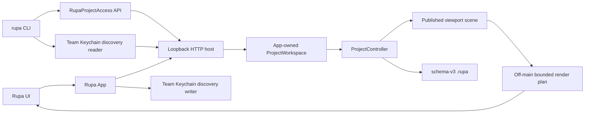
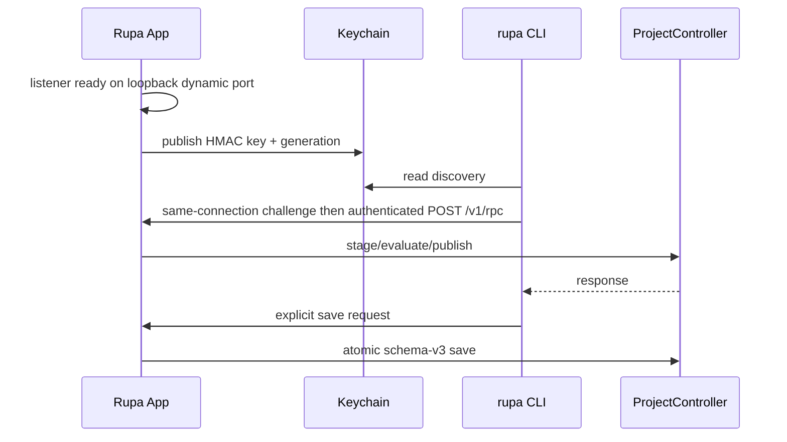

# Rupa Application Package

## Purpose and Scope

This package owns the macOS Rupa App and its signed CLI product. It is a
direct child of the [system design](../DESIGN.md) and has two children:
[Rupa App](Rupa/Rupa/DESIGN.md) and [Rupa CLI Product](Rupa/RupaCLI/DESIGN.md).

## Responsibilities and Boundaries

The package composes UI, `ProjectWorkspace`, `ProjectController`, the Agent
runtime, the loopback HTTP adapter, and the Team Keychain discovery boundary.
It owns product document identity and executable packaging, but not CAD/Mesh
semantics, tessellation, render preparation, or transport framing. The App is
the only live project authority; the CLI is an API client.

## Related Designs

| Design | Relationship | Contract Used | Summary | Cautions |
|---|---|---|---|---|
| [system design](../DESIGN.md) | parent | one ProjectController authority | Defines global project access. | No sibling writer may be added. |
| [Rupa App](Rupa/Rupa/DESIGN.md) | child | process-lifetime host and workspace | Owns live project state and save. | Listener starts independently of scene restoration. |
| [Rupa CLI Product](Rupa/RupaCLI/DESIGN.md) | child | signed thin API client | Sends intent through the public access API. | It has no project authority. |
| [RupaKit package](../RupaKit/DESIGN.md) | depends on | workspace, transport, and access contracts | Supplies domain and integration modules. | Use public contracts only. |

## Architecture

## Contracts and Invariants

1. UI, CLI, and future external clients submit intent through
   `RupaProjectAccess`; project mutation, evaluation, and save pass through
   the App-owned `ProjectWorkspace` and `ProjectController`.
2. The App listener binds only to loopback with a dynamic port. It publishes
   port, a 32-byte HMAC key, and generation to the Team Keychain only after
   listener readiness. The key is never sent over the API connection.
3. The CLI reads discovery and never writes it. Discovery has no project
   payload and grants no project authority.
4. The API uses one same-connection `POST /v1/challenge` then `POST /v1/rpc`
   exchange, a 16-MiB body ceiling, 32 active connections, bounded headers,
   required Content-Length, and one monotonic deadline. Response loss after
   dispatch is not retried.
5. The App sandbox has the network-server and Keychain access-group
   capabilities. The CLI is non-sandboxed and has only the Keychain
   access-group capability.
6. Explicit save is the only persistence trigger. Failures preserve the last
   published project and package bytes.
7. Viewport render-plan preparation is cancellable derived work outside
   MainActor. Agent capability/status, lease, compilation, immutable projection,
   and response encoding remain on a separate control plane. Neither becomes
   project authority, and only exact workspace/save operations enter the
   existing MainActor owners.

## Runtime Flows

## State, Ownership, and Lifecycle

The App owns listener, discovery generation, workspace, controller, current
project URL, and UI state for the process lifetime. The CLI owns only API
request state. The viewport cache owns one derived plan task/result and the
Agent runtime owns only control-plane leases and immutable request values. The
Keychain record is replaced per generation and removed
conditionally during App shutdown after bounded drain.

## Failure, Concurrency, and Constraints

Duplicate App authority, unavailable discovery, invalid credentials, stale
generation, dirty replacement, semantic failure, deadline, cancellation,
save failure, and response loss are typed. No alternate writer, local
controller, renderer, or transport fallback is selected. Render preparation
cannot prevent listener accept or capability/status progress.

## Verification and Change Impact

ACCESS-IV verifies design consistency, transport limits, Keychain record
lifecycle, signed App/CLI entitlements, stopped-App launch, attach,
mutation/readback, explicit save, restart recovery, rollback, and no fallback.
The actual signed-App multi-body gate additionally verifies visible matching
geometry, UI/run-loop progress, bounded retained plan memory, and Agent
capability/status plus immutable-read progress during render preparation.
Changes require rechecking both child designs and the `RupaKit` access
composition.
