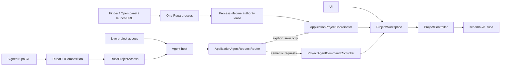
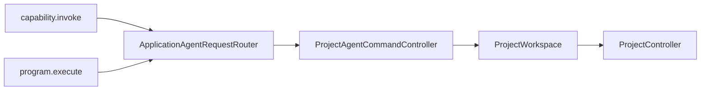
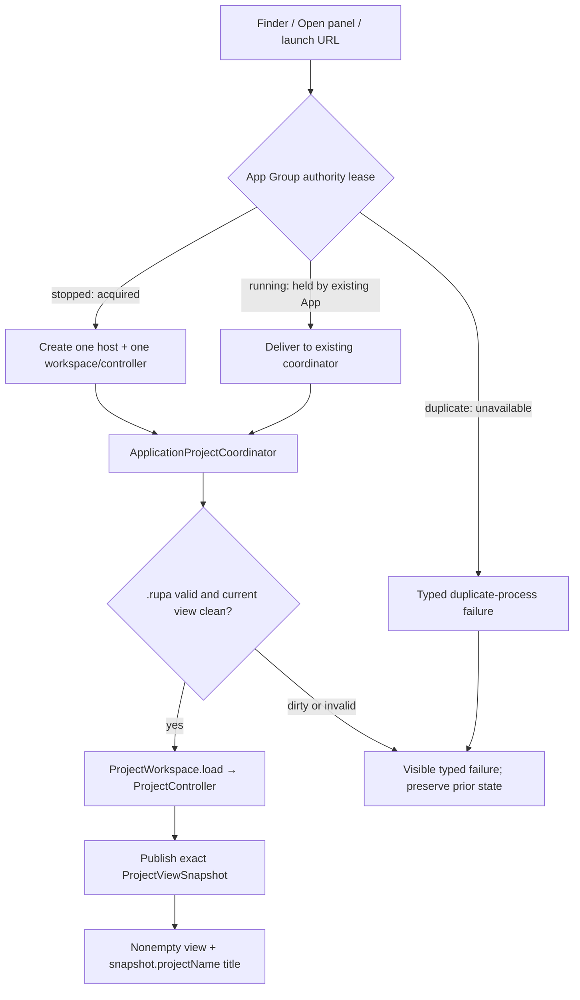

# Rupa Application Package

## Purpose and Scope

This design owns the macOS Rupa application and distributable CLI composition
built by `Rupa.xcworkspace`. It is a direct child of the
[system design](../DESIGN.md). Its direct product components are
[Rupa App](Rupa/Rupa/DESIGN.md) and
[Rupa CLI Product](Rupa/RupaCLI/DESIGN.md).

## Responsibilities and Boundaries

The package composes UI, `ProjectWorkspace`, `ProjectController`, project
package codecs, the Agent runtime, and the internal live transport. It does not
define CAD/Mesh source semantics, duplicate project state, expose endpoint
placement through semantic status, or let transport mutate project bytes.
It also owns the product-level `.rupa` document identity and ensures file
activation reaches the existing application authority. Its one application
authority lease is stored in the App Group coordination directory for the
process lifetime; that directory stores coordination metadata only, never CAD,
Mesh, package, or persisted projection data. The application composes one
`ProjectAgentCommandController` over the same workspace as the UI and one
`ApplicationAgentRequestRouter`; non-lifecycle requests delegate to the
controller and only explicit Agent save reaches the typed coordinator port.
For CADAPI-D, both `capability.invoke` and `program.execute` are semantic
requests delegated through that same controller/workspace path. The application
does not interpret program nodes, allocate modeling IDs, expand patterns, or
create a second transaction; explicit save remains a separate lifecycle intent.
The distributable `rupa` command-line product is a separate non-sandboxed
executable target signed by the same Team and App Group entitlement. Its
SwiftPM and Xcode entries both call the single public `RupaCLIComposition` async
entry; neither entry owns access, project, mutation, save, endpoint, or
fallback policy.

## Related Designs

| Design | Relationship | Contract Used | Summary | Cautions |
|---|---|---|---|---|
| [system design](../DESIGN.md) | parent | single project authority | Defines the global access invariant. | Product composition cannot create a second authority. |
| [Rupa App](Rupa/Rupa/DESIGN.md) | child | process authority, file activation, application lifecycle | Owns the executable process composition and the one App-owned workspace/controller. | Acquire application authority before composing the host or workspace. |
| [Rupa CLI Product](Rupa/RupaCLI/DESIGN.md) | child | signed command-line distribution | Builds the non-sandboxed `rupa` tool with the same Team and App Group coordination entitlement. | It must remain a thin entry over the shared CLI composition. |
| [RupaKit package](../RupaKit/DESIGN.md) | depends on | workspace/controller, access, runtime, transport contracts | Supplies all domain and integration modules. | Depend on public contracts only. |
| [Agent host](../RupaKit/Sources/RupaAgentUI/DESIGN.md) | depends on | process-lifetime listener and injected request-handler contract | Provides the host while this application composes its controller, router, and workspace. | It must not become a second project or package authority. |
| [RupaCLIComposition](../RupaKit/Sources/RupaCLIComposition/DESIGN.md) | used by | one public async executable composition | Supplies the same project-access composition to SwiftPM and Xcode `rupa` entries. | The CLI product is not a second project authority and is not sandboxed. |

## Architecture

## Contracts and Invariants

1. The App-owned workspace/controller pair is the sole live mutation,
   evaluation, publication, and save authority.
2. The Agent host transports intent through `ApplicationAgentRequestRouter` to
   one `ProjectAgentCommandController` registered against the same App-owned
   workspace; explicit Agent save alone uses the typed coordinator port.
3. Endpoint and App Group placement are product composition details.
4. An attached access session finishing never closes the live document.
5. Only schema-v3 `.rupa` is registered as a product document type; `.swcad`
   has no application document association.
6. One process-lifetime application authority is acquired before the workspace,
   controller, router, or Agent host is created. Scene visibility never stops
   that host.
7. The two CAD mutation forms share one semantic compiler and arrive at this
   composition as one workspace action. The App defines no raw-feature-graph,
   program-only operation switch, or modeling-specific save path.
8. A successful CAD mutation changes in-memory project state only. Persistence
   occurs only after a separately requested save reaches the coordinator and
   the same `ProjectController`.
9. The distributable CLI is signed by Team `WWCKBW8CKN`, carries the same
   product App Group entitlement, and is not sandboxed. It invokes the same
   `RupaCLIComposition` entry as the SwiftPM executable and owns no project
   state, direct file mutation, or fallback route.

## Runtime Flows

Finder, the Open panel, and launch URL delivery converge on one application
coordinator and its existing workspace load path:

When the App is stopped, lease acquisition precedes host/workspace/controller/
router creation and the initial URL is loaded before Agent registration. When
the App is running, activation is delivered to the same coordinator and
serialized with UI operations. UI and live access resolve that same registered
workspace. Semantic Agent requests delegate to the one controller; an explicit
Agent save is delegated to the coordinator and then to that same workspace and
project controller using the current URL. Create/open/close remain application
file lifecycle and are not redirected through the Agent route. Package save
stages and fully validates a destination-appropriate replacement before one
atomic publication; post-replacement cleanup warnings are returned as typed
metadata rather than triggering a fallible post-publication step.
`capability.invoke` and `program.execute` follow the semantic delegation branch;
the router never decomposes a program into multiple requests or retries it
through a file adapter.

## State, Ownership, and Lifecycle

The application process owns its authority lease, windows, current project URL,
workspace registration, the one controller/router composition, and the live
transport host. The lease and host are held from composition through process
shutdown and the lease is represented only in the App Group coordination
directory. The lease and security-scoped current URL live independently: a
requested URL becomes current only after its project view has published
successfully. Scene visibility is not project or host ownership.

## Failure, Concurrency, and Constraints

Duplicate process authority, dirty replacement, unsupported format, invalid
package, unavailable session, endpoint, deadline, and save failures are typed
and do not select another authority. A failed file activation or
prepublication package save preserves the prior URL, security scope, project
coordinates, viewport, title, destination bytes, and Agent registration; it
never falls back to closed-file mutation. If package replacement and clean-state
publication committed but save-result view projection fails, the exact
committed coordinates are returned as an `AgentCommittedMutationOutcome` with
`Mutation.save`, `Stage.viewProjection`, and must-not-retry semantics.
MainActor owns UI composition; the project controller actor owns source
publication.
An unknown operation/version, invalid program, stale coordinate, cancellation,
limit failure, or dispatch-uncertain result remains typed. A program that
published is never replayed; a program that failed before publication leaves
the current App view and destination package unchanged.

## Verification and Change Impact

ACCESS-O verifies product metadata, process authority, `.rupa` delivery,
visible project identity, one-controller/same-workspace Agent routing,
process-lifetime host behavior, explicit Agent save through the coordinator,
destination-preserving package staging, and failure preservation. ACCESS-O.5
owns the package replacement implementation and ACCESS-O.6 owns application
source composition; ACCESS-O.7/IV own the final signed App/CLI and
same-workspace viewport evidence.
ACCESS-IV additionally builds the Xcode-owned CLI with project-default signing,
inspects its Team/App Group/non-sandbox entitlements, and exercises that exact
binary against the signed App before the access design is accepted.
CADAPI-D integration later adds actual signed-App/CLI proof that both forms use
the same workspace/controller, complex programs publish once, explicit save is
separate, and the App exposes no raw graph route. This document does not claim
that source cutover is already implemented.
