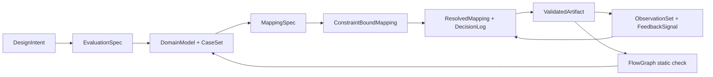
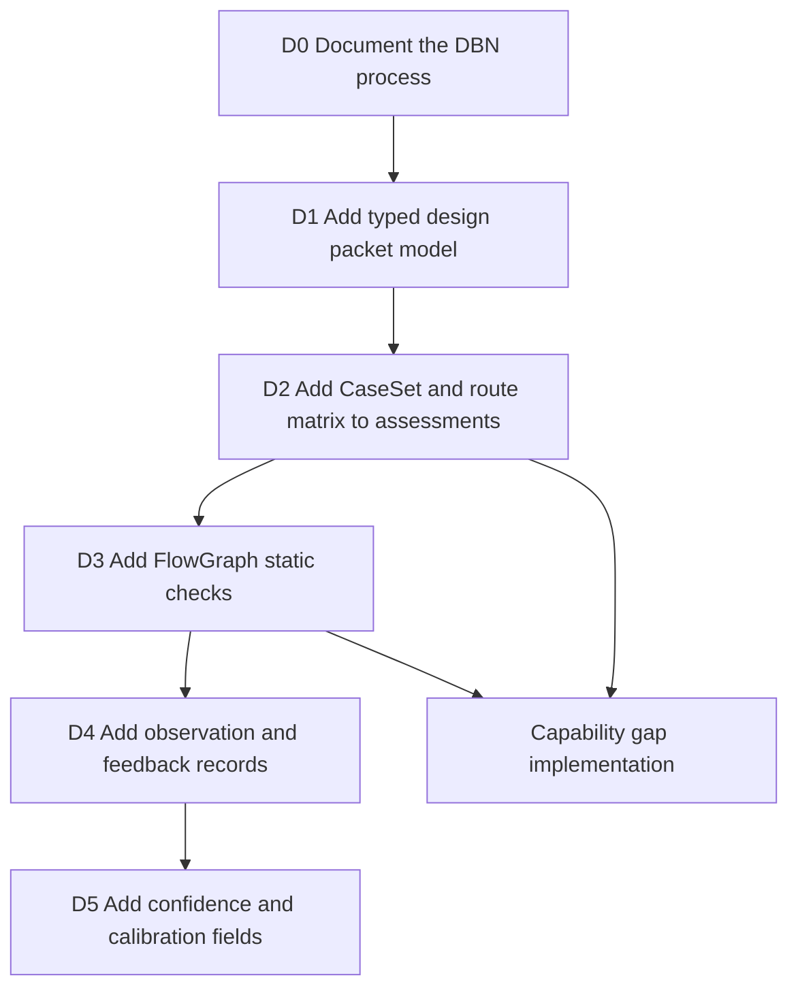
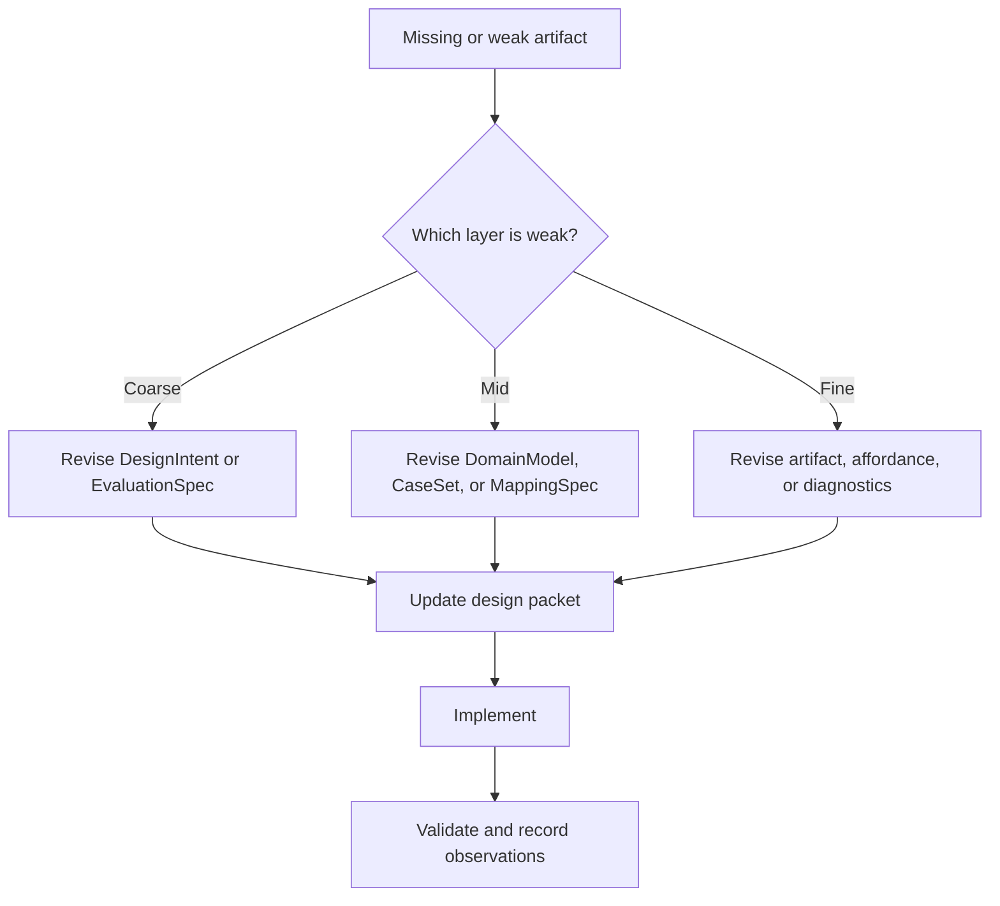

# Rupa Design Process

## Purpose

This document defines how Rupa turns an ambiguous CAD capability request into
implementation work that can be validated by humans, tests, and Agents. It
aligns Rupa's existing CAD quality gates with the Design Compiler DBN process:
intent, evaluation, domain cases, mappings, validation, feedback, and global
connection checks.

The process is mandatory for broadening CAD features. A feature is not ready for
implementation when only a UI control, kernel helper, or Agent command has been
named. It is ready when the design packet below identifies the source of truth,
supported case set, command mapping, evidence, and connection graph.

## Process Map

## Required Design Packet

Every new or broadened CAD capability must have a design packet before
implementation begins. The packet may live in a focused design document or in a
tracked assessment entry, but the fields must be explicit.

| DBN IR | Rupa artifact | Required content |
|---|---|---|
| `DesignIntent` | Capability statement | The user-visible modeling outcome and the owning product area. |
| `EvaluationSpec` | Quality and verification contract | The reference behavior, success channels, diagnostics, and performance budget. |
| `DomainModel` | Source and target model | The editable source entities, generated topology, units, tolerances, and ownership boundary. |
| `CaseSet` | Supported and rejected case matrix | Normal cases, boundary cases, degenerate cases, unsupported cases, and dense-performance cases. |
| `MappingSpec` | Command and data mapping | UI, Core, Automation, Agent, CLI, kernel, evaluation, measurement, and export routes. |
| `ConstraintBoundMapping` | Policy and invariant binding | Validation rules, stale-generation rules, undo/redo rules, source rewrite limits, and topology identity rules. |
| `ResolvedMapping` | Final selected route | The route that will ship, including conflicts that were resolved across UI, Agent, kernel, and source ownership. |
| `DecisionLog` | Decision record | Why the selected route is correct, what was rejected, and what remains open. |
| `ValidatedArtifact` | Implementation evidence | Source files, tests, diagnostics, build/test commands, and supported subset claims. |
| `ObservationSet` | Review and runtime evidence | Test failures, review findings, performance measurements, user-visible gaps, and missing channels. |
| `FeedbackSignal` | Update instruction | Which layer must change next: fine UI affordance, mid command/source mapping, or coarse product intent. |
| `FlowGraph` | Connection graph | The `In` and `Out` ports across UI, Core, Automation, Agent, CLI, SwiftCAD, evaluation, and diagnostics. |

## Relationship to Existing Documents

The current Rupa documents already cover many pieces of the process, but they do
not yet make the DBN packet a first-class artifact.

| Current document or service | Current role | Required upgrade |
|---|---|---|
| `GOAL_STATEMENT.md` | Release completion loop | Reference this process as the required design gate before implementation. |
| `CAD_QUALITY_MILESTONES.md` | CAD completion gates and roadmap | Attach each milestone slice to explicit `CaseSet`, `MappingSpec`, and `FlowGraph` requirements. |
| `CAD_UI_OBJECTIVE_EVALUATION.md` | Objective rating model | Treat assessment entries as `ValidatedArtifact` records, then add missing channels and confidence. |
| `CADInteractionQualityAssessmentService` | Agent-readable assessment | Evolve from static ratings into machine-readable design packets with evidence, open work, and missing channels. |
| `CAD_INTERACTION_ARCHITECTURE.md` | Interaction layer contract | Use `FlowGraph` checks to prove UI, command, source, evaluation, and Agent routes are connected. |
| `IMPLEMENTATION_STATUS.md` | Status ledger | Report progress by design packet maturity, not only feature count. |

## Current Process Gaps

These are the process gaps that must be implemented before broad feature work can
be considered systematic.

| Gap | Impact | Required implementation |
|---|---|---|
| Design packets are not typed | Feature work can skip intent, case coverage, mapping, or feedback without being detected. | Add a Core-owned, Codable design-process model that can represent capability packets and be read by Agent callers. |
| `CaseSet` is not canonical | Boundary, degenerate, unsupported, and performance cases are scattered across tests and prose. | Add a feature case matrix structure and require assessment entries to list supported, rejected, and missing cases. |
| `MappingSpec` is implicit | UI, Core, Automation, Agent, CLI, and kernel routes can drift apart. | Add an explicit route matrix for each capability and validate that each shipped route has source, command, diagnostics, and tests. |
| `DecisionLog` is informal | Tradeoffs and rejected routes can disappear, making future refactors repeat old mistakes. | Add decision records to capability packets with conflict area, selected route, rejected route, and follow-up owner. |
| Observation is not modeled | Reviews and test failures update prose but do not become structured feedback. | Add observation records with channel, severity, affected DBN layer, and required next action. |
| Confidence is static | `implemented` and `verified` ratings do not distinguish missing channels or stale evidence. | Add confidence fields derived from evidence freshness, test coverage, performance measurements, and missing channels. |
| `FlowGraph` is not machine-checked | A feature can exist in Core but remain unreachable from UI, Agent, CLI, or diagnostics. | Add static connection checks for feature routes and fail assessment when required ports are disconnected. |
| Evaluation calibration is absent | Subjective UI or modeling-quality judgments cannot be delegated safely. | Add an evaluator calibration path later, with human anchors and evidence before Agent-visible confidence is raised. |

## Implementation Order From Missing Foundations

The next implementation work should start with process infrastructure, then use
it to drive capability gaps.

| Step | Goal | Completion condition |
|---|---|---|
| D0 | Establish this process in documentation | Goal, milestone, quality, and architecture documents point to this process. |
| D1 | Make design packets representable | RupaCore owns Codable packet types and tests their encoding. |
| D2 | Make missing cases visible | Assessment entries expose supported, rejected, missing, and performance case groups. |
| D3 | Make route drift visible | Static checks detect missing UI, Core, Automation, Agent, CLI, kernel, evaluation, or diagnostics routes where a capability claims support. |
| D4 | Make reviews actionable | Review findings and test failures can be recorded as observations and routed to the right design layer. |
| D5 | Make confidence meaningful | Agent-readable confidence reflects evidence, missing channels, performance data, and calibration state. |

## Feature Implementation Rule

When a capability gap is selected, implementation starts at the lowest missing
DBN artifact that blocks correctness. If `CaseSet` is missing, write the cases
before code. If `MappingSpec` is missing, define the routes before UI. If
`FlowGraph` is disconnected, fix the route before expanding geometry. If
`ObservationSet` points to a mid-level mapping failure, do not patch only the
fine-level UI affordance.

