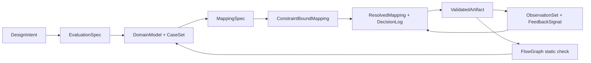
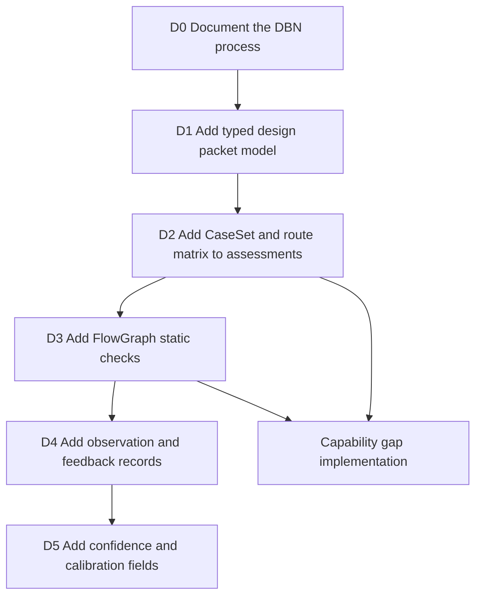
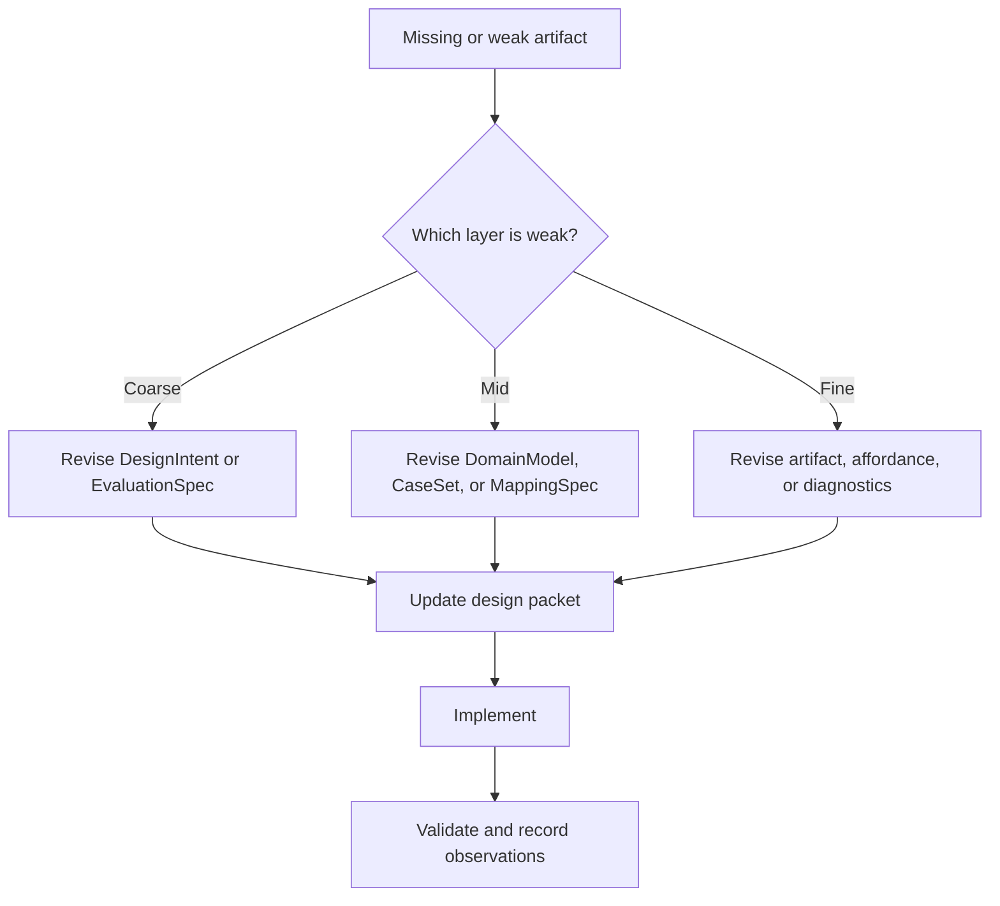

# Rupa Design Process

## Purpose

This document defines how Rupa turns an ambiguous CAD capability request into
implementation work that can be validated by humans, tests, and Agents. It
aligns Rupa's existing CAD quality gates with the Design Compiler DBN process:
intent, evaluation, domain cases, mappings, validation, feedback, and global
connection checks.

The process is mandatory for broadening CAD features. A feature is not ready for
implementation when only a UI control, kernel helper, or Agent command has been
named. It is ready when the design packet below identifies the source of truth,
supported case set, command mapping, evidence, and connection graph.

## Process Map

## Required Design Packet

Every new or broadened CAD capability must have a design packet before
implementation begins. The packet may live in a focused design document or in a
tracked assessment entry, but the fields must be explicit.

| DBN IR | Rupa artifact | Required content |
|---|---|---|
| `DesignIntent` | Capability statement | The user-visible modeling outcome and the owning product area. |
| `EvaluationSpec` | Quality and verification contract | The reference behavior, success channels, diagnostics, and performance budget. |
| `DomainModel` | Source and target model | The editable source entities, generated topology, units, tolerances, and ownership boundary. |
| `CaseSet` | Supported and rejected case matrix | Normal cases, boundary cases, degenerate cases, unsupported cases, and dense-performance cases. |
| `MappingSpec` | Command and data mapping | UI, Core, Automation, Agent, CLI, kernel, evaluation, measurement, and export routes. |
| `ConstraintBoundMapping` | Policy and invariant binding | Validation rules, stale-generation rules, undo/redo rules, source rewrite limits, and topology identity rules. |
| `ResolvedMapping` | Final selected route | The route that will ship, including conflicts that were resolved across UI, Agent, kernel, and source ownership. |
| `DecisionLog` | Decision record | Why the selected route is correct, what was rejected, and what remains open. |
| `ValidatedArtifact` | Implementation evidence | Source files, tests, diagnostics, build/test commands, and supported subset claims. |
| `ObservationSet` | Review and runtime evidence | Test failures, review findings, performance measurements, user-visible gaps, and missing channels. |
| `FeedbackSignal` | Update instruction | Which layer must change next: fine UI affordance, mid command/source mapping, or coarse product intent. |
| `FlowGraph` | Connection graph | The `In` and `Out` ports across UI, Core, Automation, Agent, CLI, SwiftCAD, evaluation, and diagnostics. |

## Relationship to Existing Documents

The current Rupa documents already cover many pieces of the process, and the
CAD interaction assessment now emits first-class design packets. The remaining
work is to keep packet maturity visible and to extend the current Agent payload
and deterministic dense geometry fixture measurements into production
wall-clock and memory regression fixtures for heavy geometry paths.

| Current document or service | Current role | Required upgrade |
|---|---|---|
| `GOAL_STATEMENT.md` | Release completion loop | Reference this process as the required design gate before implementation. |
| `CAD_QUALITY_MILESTONES.md` | CAD completion gates and roadmap | Attach each milestone slice to explicit `CaseSet`, `MappingSpec`, and `FlowGraph` requirements. |
| `CAD_UI_OBJECTIVE_EVALUATION.md` | Objective rating model | Treat assessment entries as `ValidatedArtifact`, `ObservationSet`, confidence, calibration-anchor, and performance-measurement records. |
| `CADInteractionQualityAssessmentService` | Agent-readable assessment | Emit machine-readable design packets with evidence, open work, route observations, performance observations, calibration anchors, performance measurement records, and confidence. |
| `CAD_INTERACTION_ARCHITECTURE.md` | Interaction layer contract | Use `FlowGraph` checks to prove UI, command, source, evaluation, and Agent routes are connected. |
| `IMPLEMENTATION_STATUS.md` | Status ledger | Report progress by design packet maturity, not only feature count. |

## Current Process State

These are the process foundations that gate broad feature work.

| Area | Impact | Current state |
|---|---|---|
| Typed design packets | Feature work can skip intent, case coverage, mapping, or feedback without being detected. | Implemented in RupaCore as Codable packet types attached to every CAD interaction assessment entry. |
| `CaseSet` | Boundary, degenerate, unsupported, and performance cases must be canonical. | Implemented with capability-specific supported, boundary, degenerate, rejected, missing, and performance groups. |
| `MappingSpec` | UI, Core, Automation, Agent, CLI, and kernel routes can drift apart. | Implemented with capability-specific route matrices and selected route IDs. |
| `DecisionLog` | Tradeoffs and rejected routes can disappear, making future refactors repeat old mistakes. | Implemented with packet decision records tied to actual route IDs. |
| `ObservationSet` | Reviews, test coverage, route drift, and performance gaps must become structured feedback. | Implemented for CAD interaction packets from open work, gate ratings, test evidence, route status, performance status, and FlowGraph validation. |
| Confidence | `implemented` and `verified` ratings must distinguish missing channels and stale evidence. | Implemented from ObservationSet, evidence completeness, tests, calibration anchors, performance measurement records, and calibration state. CAD interaction packets measure Agent JSON payload size and deterministic dense geometry fixture budgets; production wall-clock and memory regression fixtures remain open for heavy geometry paths. |
| `FlowGraph` | A feature can exist in Core but remain unreachable from UI, Agent, CLI, or diagnostics. | Implemented with static connection checks for required capability routes. |
| Evaluation calibration | Subjective UI or modeling-quality judgments cannot be delegated safely. | Implemented at the packet level with calibration anchors. Production calibration still depends on feeding measured benchmark fixtures and review anchors into those records. |

## Implementation Order From Missing Foundations

The next implementation work should start with process infrastructure, then use
it to drive capability gaps.

| Step | Goal | Current status | Completion condition |
|---|---|---|---|
| D0 | Establish this process in documentation | Implemented | Goal, milestone, quality, and architecture documents point to this process. |
| D1 | Make design packets representable | Implemented | RupaCore owns Codable packet types and tests their encoding. |
| D2 | Make missing cases visible | Implemented | Assessment entries expose supported, rejected, missing, and performance case groups. |
| D3 | Make route drift visible | Implemented | Static checks detect missing UI, Core, Automation, Agent, CLI, kernel, evaluation, or diagnostics routes where a capability claims support. |
| D4 | Make reviews actionable | Implemented | Review findings, test evidence, route drift, performance status, and FlowGraph validation are recorded as observations routed to the right design layer. |
| D5 | Make confidence meaningful | Implemented at packet level | Agent-readable confidence reflects ObservationSet severity, evidence, missing channels, calibration anchors, performance measurement records, and calibration state. CAD interaction packets measure Agent JSON payload size and deterministic dense geometry fixture budgets; capability teams must add production wall-clock and memory regression fixtures before claiming verified heavy-geometry performance. |

## Feature Implementation Rule

When a capability gap is selected, implementation starts at the lowest missing
DBN artifact that blocks correctness. If `CaseSet` is missing, write the cases
before code. If `MappingSpec` is missing, define the routes before UI. If
`FlowGraph` is disconnected, fix the route before expanding geometry. If
`ObservationSet` points to a mid-level mapping failure, do not patch only the
fine-level UI affordance.

