# Rupa Document Package Contract

## Purpose

This document defines package schema v3, source-region authority, integrity,
resource, and atomic-publication rules. Schema v2 is not a compatibility input.

## Source Regions

```text
Project Package
|-- manifest.json
|-- source/
|   |-- product.json          required
|   |-- cad.json              optional
|   |-- mesh-assets.json      optional
|   `-- blobs/sha256/...      Authored Mesh payloads
`-- adjuncts/<namespace>/...  opaque extension-owned entries
```

| Region | Authority |
|---|---|
| `source/product.json` | Document identity, name, units, modeling settings, Product metadata, representation sets, and modeling/presentation selection |
| `source/cad.json` | Optional Swift-CAD source only |
| `source/mesh-assets.json` | Optional Authored Mesh identities, provenance, media/schema declarations, and blob references |
| `source/blobs/sha256/...` | Content-addressed Authored Mesh payload bytes |
| Namespaced adjuncts | Opaque extension-owned bytes; never inferred as Product, CAD, or Mesh source |

`ProjectSourceModel` is an evaluation projection and is never package source.
Schema v3 output never contains `source/rupa.json` or a persisted project
projection.

## Representation Invariants

- A Product Object may retain CAD, Authored Mesh, and external representations.
- Every geometry Object selects retained representation IDs for both modeling and
  presentation; a non-geometry Object retains no geometry representation.
- CAD and Authored Mesh may coexist on one Object. Their payloads remain
  independent and no save/load operation synchronizes them.
- A CAD-derived evaluation Mesh is a snapshot/cache and is never written into the
  Authored Mesh catalog.
- An Authored Mesh asset referenced by Product source must resolve to exactly one
  declared catalog item and content-addressed payload set.

## Identity Agreement

Product source owns the package document identity, name, and units. If CAD source
is present, its document identity, name, and units must match exactly. A mismatch
is typed `sourceMismatch`; neither source is adopted as a merge fallback.

Mesh-only packages omit `source/cad.json`. Runtime integration may construct an
empty, non-authoritative `CADDocument` adapter with the Product identity, name,
and units. The adapter is never encoded as CAD authority unless it gains
source-bearing CAD content through an explicit transaction.

## Manifest and Integrity

The manifest declares exactly one required Product record, zero or one CAD
record, zero or one Mesh catalog record, referenced blobs, schema/media versions,
content fingerprints, byte counts, and package limits.

- Schema version is exactly 3. Schema v2 and unknown versions fail with typed
  `unsupportedSchema`.
- Every declared entry exists exactly once; undeclared authority-like entries are
  rejected.
- Entry paths are canonical, relative, traversal-free, and non-conflicting.
- Entry byte counts and SHA-256 identities are checked before decoding.
- Duplicate archive names, duplicate source roles, duplicate blob identities, and
  conflicting media/schema declarations are typed failures.
- Unknown entries are preserved only under a valid namespace in `adjuncts/`.

## Resource Contract

Package limits are correctness contracts and apply before allocation or decode.

| Limit family | Required enforcement |
|---|---|
| Entry count and path length | Reject before indexing unbounded metadata |
| Per-entry and aggregate bytes | Reject before allocation or decompression |
| Mesh catalog and element counts | Reject before constructing geometry storage |
| Compression ratio and decoded bytes | Reject archive expansion beyond declared bounds |
| Streaming chunk size | Bound every package-to-codec and codec-to-package transfer |

Metadata open does not eagerly materialize Authored Mesh blobs. Mesh decoding
streams directly into its owned geometry storage. Unchanged content-addressed
blobs are reused byte-for-byte. An explicit source-blob garbage-collection save
removes unreferenced blobs; ordinary saves retain them for recoverability. Both
paths preserve valid namespaced adjunct bytes.

## Determinism

- Canonical Product, CAD, and Mesh catalog encoders produce stable bytes for the
  same values.
- Manifest source records and archive entry order use one defined canonical order.
- Content identity is derived from canonical source bytes and declared source
  blob identities, never from timestamps, archive order, or transient revisions.
- Required timestamps or metadata do not participate in source content identity.

## Atomic Save and Load

Save writes a new adjacent temporary package, validates its manifest, hashes,
limits, source cross-references, and archive structure, then replaces the
destination atomically. Failure leaves the prior destination and published
controller state unchanged.

Load stages these operations before publication:

```mermaid
flowchart LR
    Archive["Archive index"] --> Integrity["Manifest, path, hash, and limit validation"]
    Integrity --> Product["Decode Product source"]
    Product --> CAD["Decode optional CAD source"]
    CAD --> Mesh["Reconstruct Authored Mesh assets"]
    Mesh --> Cross["Cross-source semantic validation"]
    Cross --> Projection["Build evaluation projection"]
    Projection --> Evaluate["Evaluate presentation purpose"]
    Evaluate --> Publish["Atomic controller publication"]
```



Any decode, cross-reference, evaluation, cancellation, revision, or stale
publication failure discards all staged values.

## Verification

Required behavior tests cover:

- CAD-only, CAD-plus-Authored-Mesh, and Mesh-only round trips;
- absence of CAD source for Mesh-only and absence of all schema-v2 entries;
- explicit schema-v2 rejection;
- missing blobs, checksum mismatch, duplicate entries, traversal, and limits;
- deterministic bytes and entry order;
- unchanged-blob byte reuse and unreferenced-blob garbage collection;
- unknown namespaced adjunct preservation;
- bounded I/O and copy telemetry on a large Mesh fixture;
- save/load/projection/evaluation through the actual controller path.
