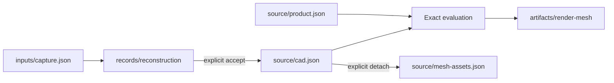

# Rupa Document Package Contract

## Purpose

This document defines the `.swcad` package boundary, disjoint source ownership,
observation inputs, source and input identity, optional records, derived artifacts,
schema versioning, integrity, and unknown-entry behavior. It is independent from
Swift-CAD's internal document schema and follows
`CAD_MESH_RESPONSIBILITY_CONTRACT.md`.

## Package Aggregate

`DesignDocument` is the logical editable aggregate used by a session.
`DocumentPackage` stores that aggregate as disjoint entries plus immutable inputs,
records, and derived artifacts. File services load and save the package;
`EditorSession` mutates only source and attached-input references through explicit
transactions.

```text
Model.swcad
|-- manifest.json
|-- source/
|   |-- cad.json
|   |-- product.json
|   |-- mesh-assets.json
|   `-- blobs/
|       `-- sha256/<content-identity>
|-- inputs/
|   |-- capture.json
|   `-- blobs/
|       `-- sha256/<content-identity>
|-- records/
|   |-- reconstruction/*.json
|   `-- validation/*.json
|-- artifacts/
|   |-- index.json
|   |-- render-mesh/*
|   `-- renders/*
`-- extensions/
    `-- <namespaced preserved entries>
```

The target development schema requires `manifest.json`, `source/cad.json`, and
`source/product.json`. `source/mesh-assets.json` is present only when the document
owns detached Mesh assets. `inputs/capture.json` is present only when the document
retains observation inputs. Records, artifacts, and namespaced extensions are
optional.

| Region | Meaning | Authority |
|---|---|---|
| `source/cad.json` | Sketches, exact curves and surfaces, B-rep features, parameters, constraints, and exact topology intent | Swift-CAD source |
| `source/product.json` | Scene organization, material assignment, saved Mesh recipes, semantic envelopes, documentation, validation, and export intent that does not duplicate CAD facts | Rupa product source |
| `source/mesh-assets.json` and source blobs | Explicitly detached editable Mesh assets | Detached Mesh source |
| `inputs/capture.json` and input blobs | Photos, depth, poses, point clouds, scan Mesh, scale, coordinate, and import provenance | Immutable observation evidence |
| `records/reconstruction` | Job configuration, candidate identity, tolerance, deviation, confidence, unresolved regions, and acceptance decision | Immutable audit record |
| `artifacts/render-mesh` | Linked CAD tessellation and repeatable Mesh-processing results | Rebuildable artifact |
| `artifacts/renders` | Viewport captures and renderer outputs | Rebuildable artifact |

Removing artifacts must not remove source or observation inputs. Removing a
referenced source/input blob or reconstruction record is an explicit package
operation and must fail while a retained source or record depends on it.

## Source Authority Rules



- `source/product.json` may reference CAD identities but must not contain a
  materialized copy of exact CAD shape, feature, or topology authority.
- Each object occurrence declares one authoritative geometry source kind: CAD,
  detached Mesh, or external reference.
- Linked render Mesh, reconstruction intermediates, BVH, adjacency, and GPU data
  are artifacts even when retained for fast reopen.
- A CAD-derived artifact does not become source because it is content-addressed.
- Capture inputs are immutable evidence, not exact CAD. Their annotations and
  attachment references may be edited separately without rewriting raw bytes.
- Bake/detach and reconstruction acceptance are explicit source transactions with
  provenance; normal package save never infers either transition.

## Independent Schema Versions

The manifest declares independent compatibility domains.

| Field | Meaning |
|---|---|
| `packageSchemaVersion` | Archive layout and manifest semantics |
| `cadSourceSchemaVersion` | Swift-CAD source encoding |
| `productSourceSchemaVersion` | Disjoint Rupa product-source encoding |
| `meshAssetSchemaVersions` | Detached-Mesh metadata and media-type-specific buffer schemas |
| `captureInputSchemaVersions` | Observation-input manifests and media-type-specific schemas |
| `recordSchemaVersions` | Reconstruction, validation, and other immutable record families |
| `artifactIndexSchemaVersion` | Portable artifact index and locator encoding |

One schema version must not be reused as another domain's version. Changing
product metadata does not silently change the CAD schema. Changing an artifact
codec does not silently change source or input identity.

## Identities

The manifest contains:

- package format ID and package schema version;
- document ID;
- each source and input entry path, role, media type, schema version, byte length,
  and SHA-256 content fingerprint;
- `CADSourceIdentity`, `ProductSourceIdentity`, optional detached-Mesh source
  identities, and optional `InputEvidenceIdentity` values;
- canonical `DocumentContentIdentity` derived from sorted authored-source entries
  and the immutable input identities referenced by that source;
- optional record/artifact indexes and their fingerprints;
- required feature declarations for safe unsupported-version diagnostics.

Archive layout, ZIP timestamps, compression, file order, save time, retained
artifacts, and workspace state are not editable source identity. Canonical
identity hashes logical entry role and canonical content, not container bytes.

A reconstruction record separately fingerprints its input-evidence identity,
provider/version, configuration, candidate CAD, deviation output, and acceptance
decision. Replacing input evidence makes that record stale; it never silently
rewrites accepted CAD.

## Source and Input Blobs

Large source and input data is content-addressed. Stable object/input IDs reference
declared blob identities; blob paths are not editable object identities.

| Data | Classification | Reason |
|---|---|---|
| Detached Mesh topology and authored attributes | Source blob | Removing it removes independent editable geometry. |
| Raw photo/depth/point-cloud/scan-Mesh bytes | Input blob | They are immutable evidence used to reconstruct or compare design. |
| Authored image pixels or packed material textures | Product source blob | They are direct presentation/material intent. |
| External asset reference metadata | Product source JSON | External content remains outside the package unless explicitly packed. |
| CAD tessellation, generated normals, adjacency, BVH, and GPU buffers | Artifact | They are reproducible evaluation/render results. |
| Reconstruction intermediate Mesh and deviation map | Artifact referenced by a record | They are job outputs, not accepted exact design. |
| Thumbnail, render output, and simulation cache | Artifact | They are derived outputs with independent artifact identity. |

Blob rules:

- every blob has a declared role, path, media type, schema version, byte length,
  and content fingerprint;
- the fingerprint covers canonical uncompressed encoding; archive compression and
  container metadata are excluded;
- a source, input, or record cannot reference an undeclared blob;
- unchanged blobs are reused byte-for-byte during atomic save;
- decoding and encoding are bounded, streaming, or memory-mapped;
- changing archive compression does not change logical identity;
- packing an external asset adds exact blobs while preserving referenced asset
  and version provenance separately;
- garbage collection removes an unreferenced source or input blob only through an
  explicit package operation, never artifact-cache cleanup.

## Zero-Copy and Resource Rules

- Metadata open must not eagerly decode detached Mesh, capture, or artifact blobs.
- Mesh and point-cloud codecs stream directly between validated owners and bounded
  I/O buffers without whole-payload `Array` or `Data` materialization.
- Memory mapping may expose immutable borrowed views only while the owning package
  aggregate remains alive.
- Save reuses unchanged blob storage and streams changed blobs once. Any required
  encryption, compression, process, or GPU copy is attributed and measured at
  that boundary.
- Package limits cover entry count, compressed and uncompressed size, per-role
  limits, nesting, and total mapped/decoded memory.

## Source, Input, and Adjunct Mutation

| Operation | Source transaction revision | Dirty state | Document content identity |
|---|---:|---:|---:|
| CAD/product/detached-Mesh source command | Increments once on commit | Dirty | Changes when canonical content changes |
| Attach or remove observation input reference | Increments once on commit | Dirty | Changes |
| Run reconstruction without accepting candidate | Unchanged | Unchanged | Unchanged |
| Accept reconstructed CAD | Increments once on commit | Dirty | Changes |
| Workspace-state save | Unchanged | Unchanged | Unchanged |
| Add or evict artifact cache | Unchanged | Unchanged | Unchanged |
| Record validation/reconstruction audit adjunct | Unchanged unless the acceptance itself is one source transaction | Unchanged | Unchanged |

Package adjunct updates use atomic file replacement but do not enter source undo
history. When one operation commits source and an acceptance record together, the
project layer stages both and publishes neither if either validation/write fails.

## Unknown Entries

- Unknown entries under a valid namespaced `extensions/` path are preserved
  byte-for-byte when saved without a registered handler.
- Unknown required manifest features reject load with a typed unsupported-version
  result.
- Unknown arbitrary top-level entries are invalid and are not silently ignored.
- A loader that exposes only source retains opaque adjuncts so later save cannot
  discard records or extensions.
- Unknown geometry/input roles reject load; they must not default to editable or
  derived behavior.

## Integrity and Safety

- Every declared entry is checked against manifest length and fingerprint.
- Entry paths are normalized and cannot escape the archive root.
- Duplicate normalized paths, symlink-like entries, invalid UTF-8 names, and
  resource-limit violations are rejected.
- Role references are validated before any session source is published.
- Atomic save prepares a complete package next to the destination, validates it,
  then replaces the destination.
- Cancellation or failure removes temporary output and publishes no partial
  source, input, record, artifact index, or destination.

## Development Schema Migration

The current code implements unreleased package schema v2 with
`source/cad.json` and `source/rupa.json`. `source/rupa.json` stores a
`ProjectSourceModel` that is reproduced from `DesignDocument` and is checked for
equality on load. That is a duplicated projection, not a disjoint source owner.

Schema v2 is superseded. The implementation must replace it with this contract
before RupaKit project integration. Migration must:

1. retain `source/cad.json` as exact CAD authority;
2. encode only disjoint Rupa-authored facts in `source/product.json`;
3. classify existing Mesh records as detached source, input, or derived and
   reject ambiguous records;
4. omit a CAD-derived project projection from authored source;
5. preserve the existing bounded streaming, blob reuse, integrity, unknown-entry,
   and atomic-save guarantees;
6. remove the unreleased v2 schema rather than adding a permanent compatibility
   shim.

Released conformance manifests list the exact accepted schema tuple. A migration
between released tuples is an explicit transform and preserves unknown namespaced
entries.

## Required Tests

| Test family | Required cases |
|---|---|
| Versioning | Package, CAD, product, Mesh-asset, capture-input, record, and artifact schemas vary independently. |
| Authority | CAD/project duplication, ambiguous Mesh role, and two source kinds for one occurrence reject load. |
| Identity | Compression and entry order do not change logical identity; source or referenced-input changes do. |
| Adjuncts | Artifact and audit-record updates do not alter source identity or dirty state. |
| Role lifecycle | CAD-to-Mesh cache, detach, detached edit, reconstruction candidate, and acceptance preserve their declared ownership. |
| Preservation | Unknown namespaced entries survive load/save byte-for-byte. |
| Blobs | Missing or undeclared blobs reject load; unchanged blobs are reused; garbage collection retains every reference. |
| Integrity | Hash/length mismatch, duplicates, traversal, unsupported required features, and size limits reject safely. |
| I/O | Save failure leaves the original intact; large source, input, and artifact entries remain bounded and streaming. |
| Zero-copy | Large Mesh/input fixtures prove bounded I/O and named copy/allocation budgets without eager package materialization. |
