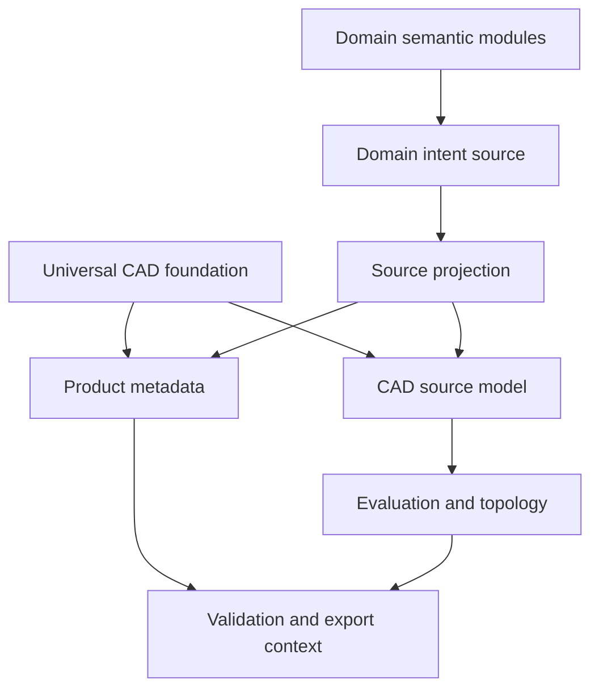
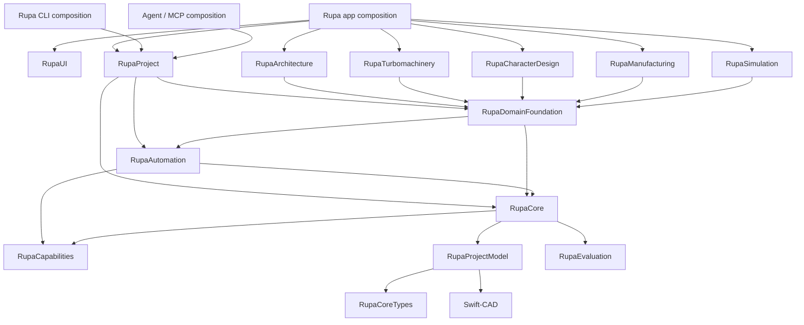
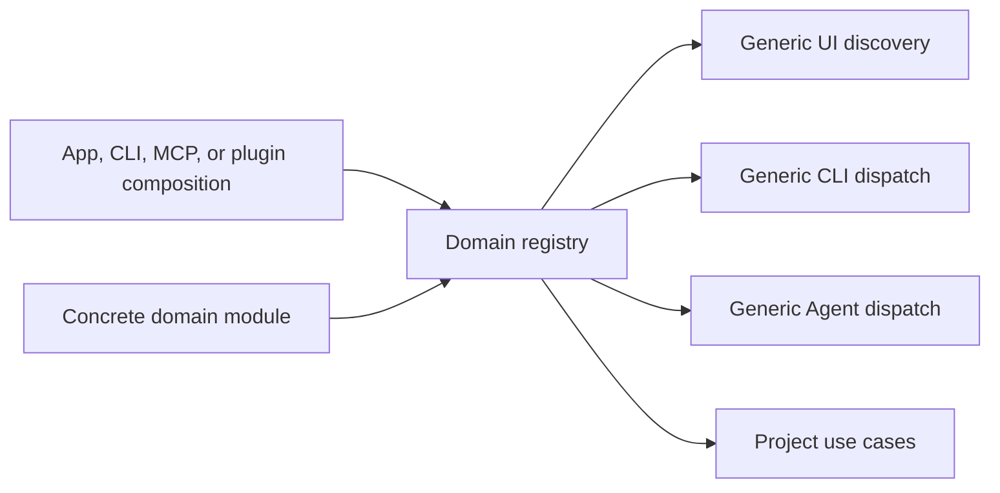
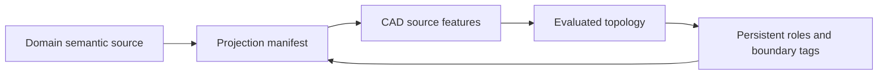
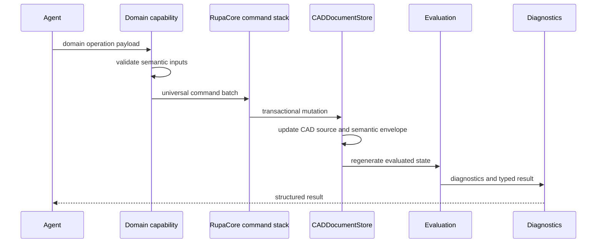
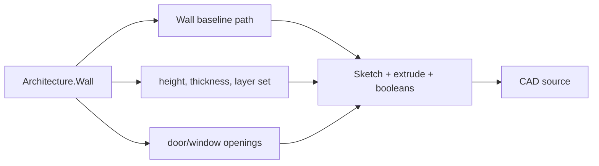
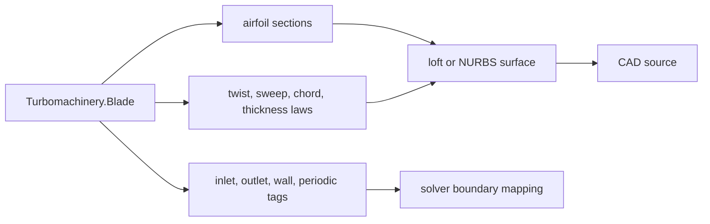
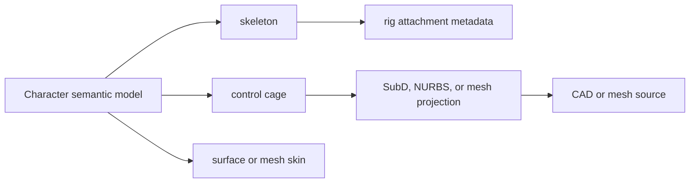
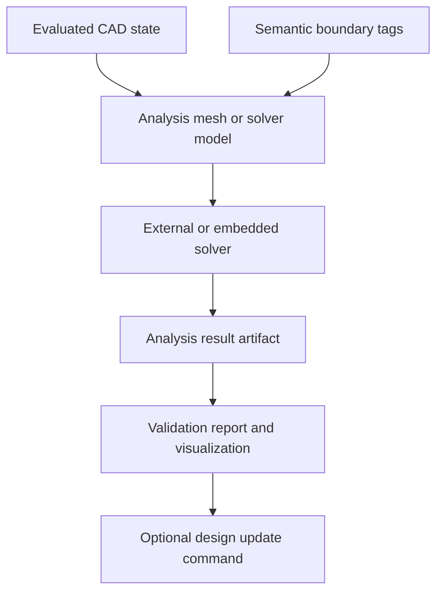
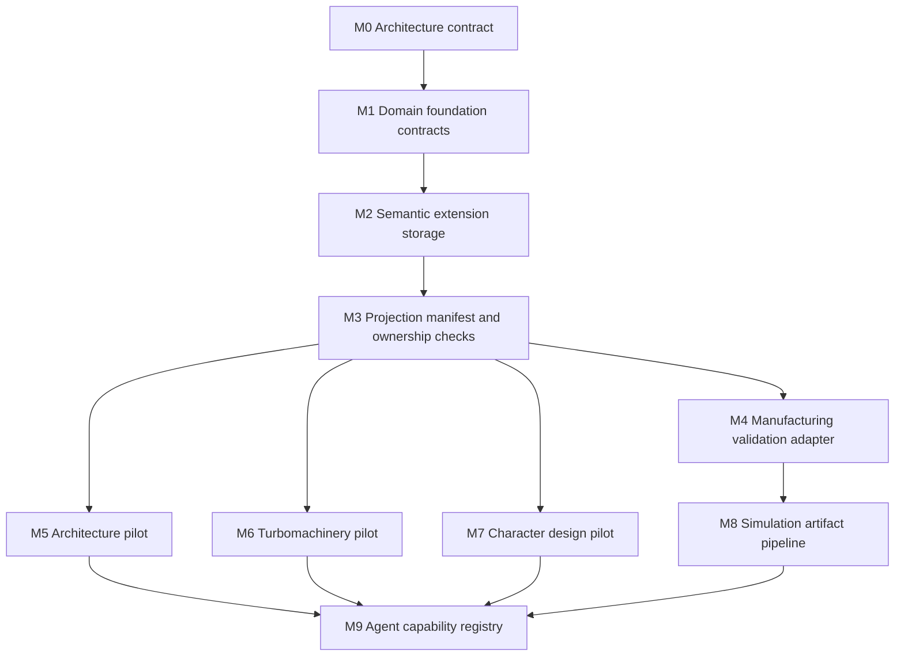

# Rupa Domain Extension Architecture

## Status

This document defines how Rupa remains a universal CAD product while adding
specialized workflows such as architecture, turbomachinery, character design,
manufacturing preparation, and simulation.

| Field | Value |
|---|---|
| Product | Rupa |
| Scope | Domain extension architecture |
| Primary rule | Specialized domains extend the universal CAD model; they do not fork the document type, command stack, UI model, or agent transport. |
| Document type | `.swcad` |
| CAD foundation | Swift-CAD |
| Implementation design | `DOMAIN_FOUNDATION_DESIGN.md` |
| Transaction authority | `DOMAIN_TRANSACTION_CONTRACT.md` |
| Reference authority | `REFERENCE_ARTIFACT_CONTRACT.md` |
| Validation authority | `VALIDATION_CONTRACT.md` |
| State/project authority | `STATE_AND_PROJECT_CONTRACT.md` |
| Package authority | `DOCUMENT_PACKAGE_CONTRACT.md` |
| Related documents | `PHILOSOPHY.md`, `SPEC.md`, `PRODUCT_REQUIREMENTS.md`, `UNIVERSAL_CAD_REQUIREMENTS.md`, `UNIVERSAL_3D_ARCHITECTURE.md`, `DESIGN_PROCESS.md` |

## Design Goal

Rupa must support specialized design intent without turning the CAD core into a
collection of domain-specific branches.



The product must be able to model a house, a jet-engine component, a printable
mechanical part, or a game character using the same document and command
discipline. Domain modules may add meaning, workflows, validators, generators,
and simulation adapters, but they must not redefine the universal editing
pipeline.

## Dependency Direction

Specialized modules are above the universal CAD layers. Lower layers never
import a domain module.



| Layer | May import | Must not import |
|---|---|---|
| Swift-CAD | Foundation-level dependencies only | Rupa, domains, UI, CLI, Agent, simulation services |
| `RupaCoreTypes` | Foundation | RupaCore, domains, UI, CLI, Agent |
| `RupaProjectModel` | `RupaCoreTypes`, Swift-CAD, universal source-value modules | Evaluation caches, domains, UI, CLI, Agent |
| `RupaCore` | `RupaProjectModel`, `RupaEvaluation`, `RupaCapabilities`, generic transaction infrastructure | Architecture, turbomachinery, character, manufacturing, simulation, UI, CLI, Agent |
| `RupaAutomation` | `RupaCore`, `RupaCapabilities` | `RupaProject`, CLI, Agent runtime, UI, concrete domains |
| `RupaDomainFoundation` | `RupaCore`, `RupaAutomation` | Concrete domains, UI, CLI, Agent transport |
| Concrete domain modules | `RupaDomainFoundation`, `RupaCore`, `RupaAutomation` | Other concrete domains unless the dependency is moved to a shared lower module |
| `RupaProject` | `RupaCore`, `RupaAutomation`, `RupaDomainFoundation`, `RupaCapabilities`, artifact/decision infrastructure | Concrete domains, UI, CLI, Agent transport |
| `RupaUI` | `RupaProject`, `RupaCore`, rendering, preview, injected registries | Concrete domains by default |
| Optional domain UI adapter | Corresponding domain module plus public Rupa UI/overlay contracts | Domain rule duplication or lower-layer mutation |
| `RupaAgentRuntime` | `RupaProject`, protocol | Concrete domains and transport implementations |
| `RupaCLIKit` | `RupaProject`, protocol, generic command adapters | Concrete domains or app host |
| App composition | UI, Agent UI, selected domain modules | Kernel internals |

Concrete domains can be linked by product composition, package feature set, or a
future plugin loader. The dependency rule remains the same: domains depend on
the universal CAD foundation; the foundation does not depend on domains.

## Registration Boundary

Domain availability is a composition decision. The runtime layers consume
registries through protocols; they do not instantiate concrete domain modules by
name.



| Registry | Registered by | Consumed by | Must not do |
|---|---|---|---|
| Domain namespace registry | Composition root or plugin loader | Document load/save validation and semantic payload decoding | Instantiate UI, CLI, Agent transport, or solver processes |
| Object descriptor registry | Domain module through composition | Inspector, Browser, selection summaries, Agent display snapshots | Mutate documents directly |
| Capability registry | Domain module through composition | UI command palette, CLI adapter, Agent capability catalog | Bypass `CommandStack` or return untyped errors |
| Validator registry | Universal and domain modules | Validation service, CLI, Agent, Inspector reports | Own unrelated domain rules |
| Simulation adapter registry | Simulation composition | Analysis preparation and result import services | Mutate CAD source as a side effect of solving |

This keeps `RupaAgentRuntime`, `RupaUI`, and `RupaCLIKit` generic. They can list
and execute registered capabilities, but the concrete domain module owns the
operation payload, semantic validation, source projection, and domain diagnostics.

## Responsibility Map

| Concern | Owner | Contract |
|---|---|---|
| Exact geometry primitives, feature graph, B-rep evaluation | Swift-CAD | Domain-neutral source and evaluation primitives. |
| Persisted universal source aggregate and neutral semantic envelopes | `RupaProjectModel` | One document model independent from session, UI, and transport. |
| Session state, source transaction engine, undo/redo, structural validation | `RupaCore` | One mutation path over the project model. |
| Stable operation schema shared by UI, CLI, Agent, and batches | `RupaAutomation` | Typed commands, typed results, transaction-revision/dependency checks, dry run where supported. |
| Neutral semantic storage | `RupaProjectModel` | Stored semantic extension envelopes, projection manifests, and unknown namespace preservation. |
| Domain extension contracts | `RupaDomainFoundation` | Namespace registration, typed payload decoding, generator protocols, validator protocols, capability descriptors. |
| Session, artifact, decision, export, and external-job orchestration | `RupaProject` | One use-case boundary shared by UI, CLI, MCP, and Agent adapters. |
| Building concepts | `RupaArchitecture` | Site, level, room, wall, opening, roof, building drawings, architecture validation rules. |
| Engine and rotating-flow concepts | `RupaTurbomachinery` | Airfoil, blade, rotor, stator, duct, nozzle, clearance, boundary tags. |
| Character and organic asset concepts | `RupaCharacterDesign` | Skeleton, control cage, skin surface, blend shapes, rig attachment, deformation validation. |
| Manufacturing preparation | `RupaManufacturing` | Process constraints, wall thickness, clearance, supportability, build volume, material process metadata. |
| Simulation connection | `RupaSimulation` | Solver input preparation, boundary-condition mapping, result import, analysis artifact metadata. |
| UI presentation | `RupaUI`, generic descriptors, and optional domain UI adapters | Generic controls cover schema-driven operations; specialized adapters provide rich interactions without owning domain rules. |
| Agent operation | Agent runtime over `RupaProject` | Agent discovers capabilities and dispatches project use cases without owning sessions or domain semantics. |

## Document Model

The `.swcad` package remains the editable document type. Domain source is stored
as semantic extensions with explicit source ownership and projection state.
Project/session, artifact, audit, and package-adjunct lifetimes follow
`STATE_AND_PROJECT_CONTRACT.md` and `DOCUMENT_PACKAGE_CONTRACT.md`.

```text
Model.swcad
|-- manifest.json
|-- source/cad.json
|-- source/rupa.json
    |-- universal project source
    `-- semantic extension envelopes
        |-- namespace
        |-- schemaVersion
        |-- payload
        `-- projectionManifest
            |-- semantic entities with ownership
            `-- source, scene, topology, and boundary references
```

| Document region | Meaning | Owner |
|---|---|---|
| `source/cad.json` | Swift-CAD source: sketches, features, parameters, dependencies, generated-source references. | Swift-CAD and RupaCore source commands |
| Universal `source/rupa.json` source | Scenes, object definitions, geometry/material/animation/simulation libraries, saved view/documentation definitions, validation policies, and export presets. | `RupaProjectModel` storage and RupaCore source transactions |
| Semantic extension envelope | Domain intent data and source ownership for a namespace, stored as neutral project source. | `RupaProjectModel` storage, domain module mutation through RupaCore transaction boundary |
| Projection manifest | Mapping from domain semantic entities to CAD source features, persistent topology roles, scene nodes, and boundary tags. | `RupaProjectModel` storage, domain generator updates through RupaCore transactions |
| Analysis artifacts | Derived results keyed by dependency, producer, configuration, and output-content identity. | Artifact producer and `RupaProject` store |

Unknown semantic namespaces must be preserved during load/save when the payload is
valid generic JSON. They are inert until a matching domain module registers a
decoder and validator. Editing an unknown semantic model must fail with a typed
diagnostic instead of guessing.

## Semantic Source and CAD Source

Domain intent and CAD source must not become two independent truths. Ownership is
assigned per semantic entity and generated source mapping. An extension envelope
may contain entities with different ownership policies.



| State | Rule |
|---|---|
| Domain-owned geometry | The semantic entity and its generated source mappings declare domain ownership. The semantic object owns editable design parameters and CAD source features are the generated projection. |
| Universal CAD geometry | The semantic entity and source mappings declare universal ownership. The Swift-CAD source feature owns editable design parameters and domain metadata may classify it but must not override it. |
| Direct edit on domain-owned projection | Route the edit to the owning domain command, explicitly convert ownership to universal CAD, or reject the edit. |
| Projection mismatch | Emit diagnostics and block unsafe domain edits until regenerated or repaired. |
| Regeneration | Rebuild projection deterministically from semantic source, update the projection manifest, then evaluate through the normal command pipeline. |

This rule prevents a wall, blade, or character skin from silently drifting away
from the sketches, lofts, booleans, surfaces, and topology that represent it.

## Extension Contracts

`RupaDomainFoundation` should define small protocols and registry contracts
instead of concrete domain behavior. Persisted neutral DTOs that live inside the
project source aggregate belong to `RupaProjectModel`, because lower source and
Core transaction layers must not import `RupaDomainFoundation`.

| Contract | Purpose |
|---|---|
| `DomainNamespace` | Stable namespace, schema version, compatibility policy, and payload decoder registration. |
| `SemanticObjectDescriptor` | Type ID, display name, property schema, selectable references, source ownership policy. |
| `SemanticExtensionEnvelope` | RupaProjectModel-owned Codable storage boundary for domain payloads in project source. |
| `ProjectionManifest` | RupaProjectModel-owned mapping between semantic entity IDs, Swift-CAD feature IDs, scene node IDs, persistent topology names, drawing references, and solver boundary tags. |
| `SourceProjectionGenerator` | Converts one semantic operation into validated RupaCore or RupaAutomation commands. |
| `DomainCommandAdapter` | Parses domain-specific operation payloads and returns universal command batches or typed failures. |
| `DomainValidator` | Emits typed validation findings for semantic consistency, projection consistency, manufacturability, documentation readiness, or simulation readiness. |
| `DomainCapabilityProvider` | Exposes command descriptors, required inputs, dry-run behavior, and result schemas for UI, CLI, and Agent discovery. |
| `SimulationAdapter` | Converts evaluated geometry plus semantic tags into solver inputs and imports solver results as derived artifacts. |

The contracts are intentionally narrow. Concrete modules implement them, and
composition layers register them.

## Command Flow

Every domain mutation still enters through the same command stack and follows
`DOMAIN_TRANSACTION_CONTRACT.md`. Semantic payload, projection manifest, CAD
source, scene metadata, and ownership changes are one atomic history entry.



| Step | Required behavior |
|---|---|
| Parse | Decode the domain operation payload with typed errors. |
| Preflight | Validate references, parameters, units, ownership, and projection freshness before mutation. |
| Generate | Produce one neutral source transaction containing universal source and semantic mutations. |
| Commit | Commit one staged transaction through `CommandStack` so semantic source and CAD projection share one undo/redo entry and one transaction-revision increment. |
| Evaluate | Use normal evaluation and diagnostics publication. |
| Report | Return semantic references, CAD references, generated topology roles, validation summaries, and actionable diagnostics. |

## Domain Examples

### Architecture



| Semantic concept | CAD projection | Validation |
|---|---|---|
| Site | Construction references, boundary curves, georeference metadata | Boundary closure, setbacks where rules exist, coordinate range |
| Level | Construction planes and drawing references | Elevation consistency |
| Room | Closed region references and labels | Area, adjacency, circulation, missing enclosure |
| Wall | Baseline, thickness, height, material layers | Openings inside host wall, joins, thickness, height |
| Door/window | Opening cut and component instance | Host relation, sill/head height, clearance |
| Roof | Profiles, surfaces, booleans | Slope, overhang, drainage intent |

### Turbomachinery



| Semantic concept | CAD projection | Validation or simulation |
|---|---|---|
| Airfoil section | Curve or sketch profiles | Closure, leading/trailing edge quality |
| Blade | Lofted surfaces or solid | Thickness, curvature, manufacturable fillets |
| Rotor/stator | Component array and local coordinate systems | Clearance, interference, balance metadata |
| Duct/nozzle | Swept or lofted flow path | Area continuity, throat location, boundary tags |
| CFD setup | Analysis artifact and solver input | Mesh quality, boundary completeness |

### Character Design



| Semantic concept | CAD projection | Validation |
|---|---|---|
| Skeleton | Construction hierarchy and metadata | Joint hierarchy, naming, orientation |
| Control cage | Mesh or surface control data | Non-manifold cage, symmetry, density |
| Skin surface | Surface or mesh body | Normals, UV readiness, deformation quality |
| Blend shape | Variant or shape delta artifact | Topology compatibility |

### Manufacturing and 3D Printing

Manufacturing is a cross-cutting domain. It must validate universal and
domain-authored geometry without owning architecture or turbomachinery concepts.

| Concern | Input | Output |
|---|---|---|
| Wall thickness | Evaluated solids and material/process metadata | Thin-wall diagnostics and highlighted references |
| Clearance | Persistent topology and component transforms | Clearance diagnostics |
| Supportability | Mesh or B-rep plus build frame and process definition | Support or overhang report |
| Build volume | Bounding boxes plus machine/build-frame definition | Fit/fail report |
| Export readiness | Watertightness, normals, units, metadata | STL/3MF/export diagnostics |

## Simulation Boundary

Simulation is derived analysis, not CAD source mutation.



| Rule | Contract |
|---|---|
| Solver input | Built from evaluated geometry, units, materials, loads, and semantic boundary tags. |
| Solver output | Stored as derived analysis artifacts keyed by source dependencies, computation identity, and output content. |
| Design update | Any geometry change suggested by a solver must become an explicit command. |
| Reproducibility | Solver version, source dependencies, artifact content, units, tolerances, mesh settings, and boundary conditions must be recorded. |
| Failure | Incomplete boundary tags, mesh failures, solver failures, and stale results are typed diagnostics. |

## Agent Capability Model

Agents must operate through explicit capabilities. They should not infer private
module behavior from file internals.

| Capability level | Example | Contract |
|---|---|---|
| Universal CAD | Create sketch, extrude, fillet, measure, export | `RupaAutomation` command or query |
| Domain command | Create wall, place window, create blade row, create control cage | Registered domain capability mapped to command batch |
| Validation | Check room closure, check blade clearance, check printability | Registered validator with structured diagnostics |
| Simulation | Prepare CFD run, import result, compare variants | Simulation adapter with reproducible artifact metadata |
| Repair | Regenerate projection, fix stale boundary tags, convert domain object to universal CAD | Explicit capability with ownership consequences |

Agent-facing capability descriptors must include required inputs, units, reference
types, dry-run support, mutation behavior, expected outputs, and failure modes.

Domain capabilities may appear as high-level commands, but source mutation lowers
to a neutral transaction. Artifact, export, job, and decision effects lower to
their registered project execution plans. Concrete domain commands never become
cases in a central command enum.

## UI and Inspector Boundary

The UI must render capabilities and property schemas. It must not encode domain
business rules directly.

| UI concern | Correct owner |
|---|---|
| Toolbar placement and interaction affordance | `RupaUI` |
| Generic property control rendering | `RupaUI` using registered property schemas |
| Domain property definitions | Domain module |
| Domain validation messages | Domain validator |
| Domain object generation | Domain generator through command boundary |
| Domain-specific visual overlays | Domain-provided overlay descriptors rendered by generic viewport services |

If a UI control needs domain-specific validation, it calls the registered domain
capability or validator. It does not duplicate the rule locally. Descriptor-driven
forms are the portable baseline; a specialized interaction may live in a separate
domain UI adapter composed above both `RupaUI` and the domain logic module.

## Cross-Domain Sharing Rule

When two domains need the same concept, that concept moves down to a shared
module only when it is truly domain-neutral.

| Shared need | Correct location |
|---|---|
| Units, tolerances, geometry, topology, features | Swift-CAD or RupaCore |
| Object descriptors, materials, scene hierarchy, validation result format | RupaCore |
| Semantic extension envelope, projection manifest storage DTOs | RupaCore |
| Domain namespace registry, generator protocols, domain capability contracts | RupaDomainFoundation |
| Wall thickness, build volume, print material process | RupaManufacturing |
| CFD boundary tag schema and result artifacts | RupaSimulation |
| Building room adjacency | RupaArchitecture |
| Blade twist/chord law | RupaTurbomachinery |
| Rig skeleton and blend-shape topology | RupaCharacterDesign |

Concrete domains must not import each other to reuse convenient implementation
details. Shared functionality must be promoted deliberately with tests and a
clear owner.

## Workspace Preset Boundary

Workspace presets provide defaults and UI emphasis. They are not domain modules,
conformance manifests, authorization policies, or document forks.

| Concept | Meaning |
|---|---|
| Domain module | Adds semantic object types, generators, validators, simulation adapters, and capabilities. |
| Workspace preset | Chooses default units, templates, validation sets, export presets, and UI emphasis. |
| Document type | Remains `.swcad` regardless of selected profile. |
| Capability availability | Determined by registered modules and project authorization; a workspace preset only changes discoverability/emphasis. |

A building workspace preset may surface room and wall tools first, while a
manufacturing workspace preset may surface printability validators first. Both operate on the same
document model, command stack, selection references, and Agent transport.

## Performance and Zero-Copy Requirements

Domain modules must preserve the universal performance model.

| Area | Requirement |
|---|---|
| Heavy geometry | Domain payloads store semantic parameters and stable references, not duplicated evaluated mesh buffers. |
| Projection | Generators operate from immutable snapshots and produce compact mutation plans. |
| Simulation | Mesh export and solver input preparation should stream or share buffers where possible instead of copying large arrays repeatedly. |
| Result artifacts | Analysis results are keyed by dependency, producer, configuration, and output-content identity; session revision is provenance only. |
| Selection | Domain references resolve through persistent IDs and projection manifests, not viewport-only hit data. |
| Large coordinates | Domains use document ruler, tolerance, local origins, and rebase commands rather than private coordinate hacks. |

## Responsibility Leak Checks

Every domain feature must pass these checks before implementation is considered
ready.

| Check | Expected answer |
|---|---|
| Does Swift-CAD know the domain concept by name? | No, unless the concept is truly universal geometry. |
| Does RupaCore import the concrete domain module? | No. |
| Is there exactly one owner for each editable parameter? | Yes. |
| Can the CAD source projection be regenerated deterministically? | Yes. |
| Is direct editing of generated projection handled deliberately? | Yes: route, convert, or reject. |
| Can UI, CLI, and Agent discover the same capability contract? | Yes. |
| Are validation and simulation outputs derived artifacts, not hidden source mutations? | Yes. |
| Are unsupported or unknown semantic namespaces preserved but not edited blindly? | Yes. |
| Can the document remain a valid `.swcad` without profile-specific branches? | Yes. |

## Milestones



| Milestone | Required result |
|---|---|
| M0 | This dependency and responsibility contract is documented, referenced by product/spec documents, and enforced by source-import plus Package.swift production target graph tests. |
| M1 | `RupaDomainFoundation` contracts are introduced without concrete domain behavior. |
| M2 | `.swcad` can preserve registered and unknown semantic extension envelopes with validation diagnostics. |
| M3 | Projection manifests map semantic references to CAD source, topology, scene nodes, and analysis boundary tags. |
| M4 | Manufacturing validators run on universal CAD and domain-authored projections without owning domain semantics. |
| M5 | Architecture pilot creates and edits a small semantic building model through shared commands. |
| M6 | Turbomachinery pilot creates and edits an airfoil/blade/duct model and prepares CFD boundary tags. |
| M7 | Character pilot creates a control cage or skeleton-backed surface model and validates deformation readiness. |
| M8 | Simulation pipeline records solver inputs/results as reproducible derived artifacts. |
| M9 | Agent, CLI, and UI discover registered domain capabilities through the same schema and execute through one command pipeline. |
