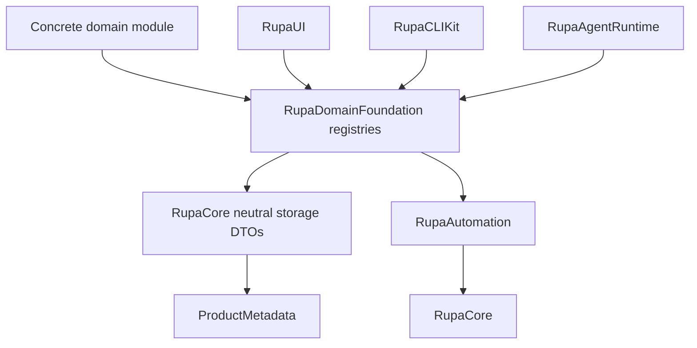
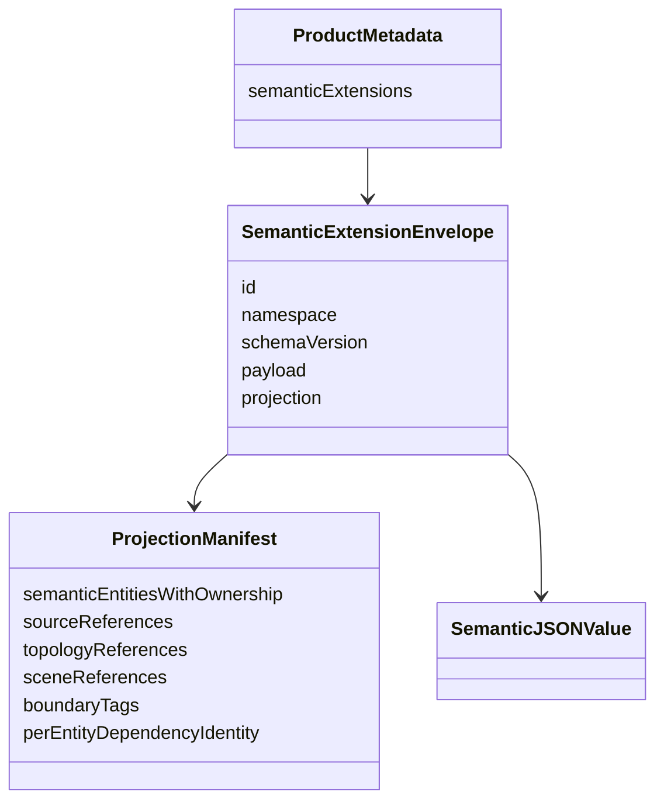
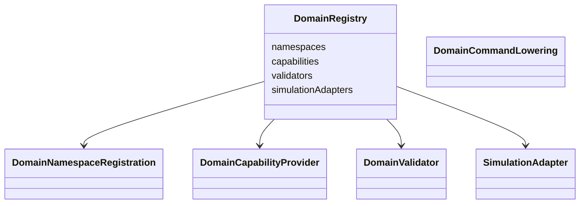
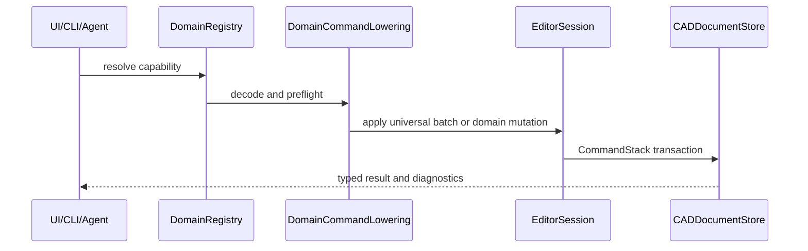
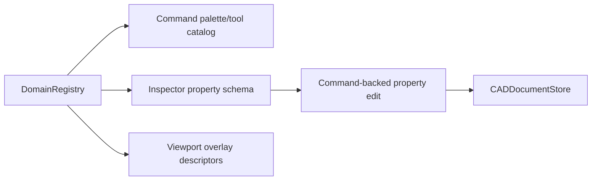
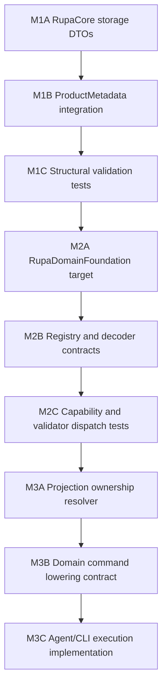

# Rupa Domain Foundation Design

## Status

This document turns `DOMAIN_EXTENSION_ARCHITECTURE.md` into an implementation
design for the first domain-extension milestones.

| Field | Value |
|---|---|
| Scope | M1-M3 implementation design |
| Depends on | `DOMAIN_EXTENSION_ARCHITECTURE.md` |
| Transaction contract | `DOMAIN_TRANSACTION_CONTRACT.md` |
| Reference contract | `REFERENCE_ARTIFACT_CONTRACT.md` |
| Validation contract | `VALIDATION_CONTRACT.md` |
| Primary goal | Add domain extensibility without moving concrete domain knowledge into Swift-CAD, RupaCore, RupaAutomation, RupaUI, RupaCLIKit, or RupaAgentRuntime. |
| Non-goal | Implement architecture, turbomachinery, character, manufacturing, or simulation behavior directly in this phase. |

## Design Summary

The implementation splits domain support into two parts:



| Part | Location | Why |
|---|---|---|
| Neutral stored data | `RupaCore` | `ProductMetadata` already lives in `RupaCore`, so stored DTOs cannot live in a higher module. |
| Registries and protocols | `RupaDomainFoundation` | UI, CLI, Agent, and concrete domains need a shared discovery contract without making `RupaCore` import domains. |
| Concrete domain behavior | Future domain modules | Specialized semantics must remain above the universal CAD foundation. |

## Module Plan

### Existing Targets

| Target | Change |
|---|---|
| `RupaCore` | Add neutral semantic extension storage, projection manifest storage, validation hooks for structural consistency. |
| `RupaAutomation` | Add generic domain operation envelopes only after registry dispatch is ready; keep current universal commands unchanged. |
| `RupaUI` | Consume capability/property descriptors from an injected registry in a later UI milestone. |
| `RupaAgentRuntime` | Merge registered domain capability descriptors into capability discovery without importing concrete domains. |
| `RupaCLIKit` | Add generic dispatch adapter for registered domain commands in a later CLI milestone. |

### New Target

| Target | Dependencies | Responsibility |
|---|---|---|
| `RupaDomainFoundation` | `RupaCore`, `RupaAutomation` | Namespace registry, capability registry, typed payload decoding, domain command lowering, validator and simulation adapter contracts. |

`RupaDomainFoundation` must not be required to load or save a basic `.swcad`
document. Core documents remain valid without domain modules.

## RupaCore Storage Types

The following types belong in `RupaCore` because they are persisted by
`ProductMetadata`.



| Type | Required fields | Responsibility |
|---|---|---|
| `SemanticNamespaceID` | raw string | Stable namespace such as reverse-DNS or product namespace. |
| `SemanticExtensionID` | UUID | Stable identity for one semantic model payload inside a document. |
| `SemanticSchemaVersion` | major, minor, patch | Stored compatibility metadata. |
| `SemanticJSONValue` | object, array, string, number, bool, null | Domain-neutral JSON payload preservation. |
| `SemanticExtensionEnvelope` | id, namespace, schemaVersion, payload, projection | One stored semantic payload plus its projection manifest. |
| `ProjectionManifest` | entities with ownership and dependency identity plus typed source, scene, topology, and boundary references | Mapping from semantic entities to universal CAD source and derived references. |
| `ProjectionSemanticEntity` | entity ID, ownership, semantic payload source paths, dependency identity when source-bound | Defines editable ownership and the exact semantic input set per entity rather than per envelope. |
| `ProjectionDependencyIdentity` | document ID, provenance generation, SHA-256 dependency fingerprint | Detects changes to one entity's transitive semantic, CAD, parameter, scene, component, plane, material, topology-binding, and referenced-entity dependencies without invalidating it for unrelated edits. |
| `ProjectionSourceReference` | feature ID, optional sketch/entity/body section | Links semantic entities to Swift-CAD source. |
| `ProjectionSceneReference` | scene node ID, object type ID | Links semantic entities to Rupa scene occurrences. |
| `ProjectionTopologyReference` | persistent topology name, role, owning feature | Links semantic entities to evaluated face/edge/vertex roles. |
| `ProjectionBoundaryTag` | semantic entity, tag kind, target reference | Links semantics to simulation or export boundary conditions. |
| `SemanticOwnershipPolicy` | domainOwned, universalOwned, classified | Defines who owns editable parameters. |

### Storage Shape

The first storage shape should live inside `rupa.json`.

```json
{
  "semanticExtensions": {
    "A4D0...": {
      "namespace": "architecture",
      "schemaVersion": { "major": 0, "minor": 1, "patch": 0 },
      "payload": { "walls": { "wall-1": { "height": 3.0 } } },
      "projection": {
        "semanticEntities": [
          {
            "id": "wall-1",
            "ownership": "domainOwned",
            "sourcePaths": [
              { "components": [
                { "kind": "key", "key": "walls" },
                { "kind": "key", "key": "wall-1" }
              ] }
            ],
            "dependencyIdentity": {
              "documentID": "...",
              "generation": 12,
              "fingerprint": {
                "algorithm": "sha256-projection-dependencies-v1",
                "value": "..."
              }
            }
          }
        ],
        "sourceReferences": [
          {
            "semanticEntityID": "wall-1",
            "featureID": "...",
            "ownership": "domainOwned"
          }
        ],
        "sceneReferences": [],
        "topologyReferences": [],
        "boundaryTags": []
      }
    }
  }
}
```

Large simulation results and heavy meshes must not be stored in `payload`. They
belong to derived artifact entries introduced by the simulation milestone.

## ProductMetadata Integration

`ProductMetadata` gains one optional/defaulted field:

| Field | Type | Default |
|---|---|---|
| `semanticExtensions` | `[SemanticExtensionID: SemanticExtensionEnvelope]` | `[:]` |

Validation remains structural in `RupaCore`.

| Validation | RupaCore behavior |
|---|---|
| Namespace is empty | Reject. |
| Schema version is invalid | Reject. |
| Envelope ID mismatch | Reject. |
| Projection references missing CAD source | Reject as invalid product metadata. |
| Projection references stale generation | Emit diagnostic through domain validation; do not reject load solely for staleness. |
| Unknown namespace | Preserve and structurally validate only. |
| Known namespace | Structural validation in RupaCore, semantic validation through registered domain validator. |

This keeps loading safe when a document includes a domain module not installed in
the current build.

## RupaDomainFoundation Contracts

The foundation target owns registries and operation contracts. It does not own
stored document truth.



| Protocol or type | Responsibility |
|---|---|
| `DomainRegistry` | Immutable registry of namespace, capability, validator, and simulation registrations. |
| `DomainNamespaceRegistration` | Namespace ID, supported schema versions, payload decoder, payload upgrader if needed. |
| `DomainPayloadDecoder` | Decode `SemanticJSONValue` into a typed domain payload. |
| `DomainCapabilityProvider` | Provide capability descriptors for UI, CLI, and Agent discovery. |
| `DomainCommandLowering` | Convert a domain operation payload into universal command batches or a domain editor mutation. |
| `DomainValidator` | Validate typed payload plus projection consistency and return structured diagnostics. |
| `DomainProjectionRepairProvider` | Provide repair/regeneration operations when projection state is stale. |
| `SimulationAdapter` | Prepare solver inputs and import analysis results as derived artifacts. |

The registry is value-based and injected. It must not use global mutable
singletons.

## Command Boundary

Domain commands are high-level operations, but their effects must still commit
through the universal command stack.



| Operation kind | Allowed commit path |
|---|---|
| Pure universal operation | Existing `AutomationCommand` batch. |
| Semantic payload plus CAD projection update | Atomic transaction defined by `DOMAIN_TRANSACTION_CONTRACT.md`: generic semantic-extension mutations plus universal commands staged, evaluated, and committed as one history entry. |
| Derived validation or simulation query | Non-mutating service result keyed by generation. |
| Solver-suggested geometry change | Explicit follow-up mutation command. |

No domain command may directly mutate `ProductMetadata` outside
`CADDocumentStore`, bypass undo/redo, or expose a successful state in which the
semantic payload and CAD projection can be undone separately.

## Agent and CLI Design

Agent and CLI should see domain functions as registered capabilities, not as
hard-coded enum cases for every domain.

| Surface | Design |
|---|---|
| Agent capabilities | Base `AgentCapabilityCatalog` plus injected `DomainCapabilityDescriptor` values, including typed input parameters. |
| Agent execution | Generic `domain.execute` request can carry capability ID, payload, expected generation, and dry-run flag. |
| CLI | Generic `rupa domain <namespace> <capability>` dispatch can be added after capability registry and payload decoding exist. |
| JSON output | Same `AutomationResult` or domain result envelope with typed diagnostics, generated semantic references, CAD references, and generation. |

Domain discovery and execution use one descriptor contract. A parameter declares
its stable ID, nested payload path, value kind, payload unit, group, required and
nullable state, default, numeric bounds, and choices. `DomainCommandPayloadBuilder`
validates these contracts and constructs `SemanticJSONValue` payloads before the
request reaches domain lowering.

| Parameter kind | Payload contract | Current generic UI |
|---|---|---|
| Text, Boolean, integer, number | Unitless scalar | Implemented |
| Length | Number in meters; displayed in the document unit | Implemented |
| Angle | Number in degrees | Implemented |
| Choice | Registered stable string value | Implemented |
| Nullable scalar | Explicit `null` or a validated scalar | Implemented |
| Selection reference, collection, file, artifact | Typed contract not yet defined | Blocking future domain workflows |

## UI Design

The UI consumes descriptors and property schemas.



| UI feature | Data source |
|---|---|
| Tool availability | Capability registry and active profile policy. |
| Command inputs | `DomainCommandParameterDescriptor` rendered by `WorkspaceDomainCommandPanel`. |
| Command execution | Generation-safe `DomainCommandRequest` dispatched through `DomainCommandExecutor`. |
| Inspector fields | `SemanticObjectDescriptor` and object property schema. |
| Validation panel | Domain validator diagnostics. |
| Viewport overlays | Domain overlay descriptors rendered by generic viewport services. |
| Disabled state | Capability preflight result, not duplicated SwiftUI logic. |

## Ownership and Editing Rules

Every semantic entity and generated source mapping must have one owner. One
envelope may contain entities with different ownership policies.

| Source state | Edit behavior |
|---|---|
| `domainOwned` projection | Route compatible edits to the domain capability. |
| `universalOwned` CAD source | Use normal universal CAD commands. |
| `classified` metadata | Allow CAD edits; update or invalidate classification if references change. |
| Unknown namespace | Preserve payload; reject semantic edits; allow universal CAD edits only if they do not require unknown projection repair. |
| Stale projection | Allow read, validation, and repair; block unsafe semantic mutation. |

Direct subobject edits are allowed only when the resolver can prove the edit
maps back to a single editable semantic parameter. Otherwise the user or Agent
must explicitly convert that projection region to universal CAD ownership.

## Design Process Integration

Every domain capability must produce a design packet before implementation.

| DBN artifact | Domain requirement |
|---|---|
| DesignIntent | User-visible domain operation and ownership model. |
| DomainModel | Semantic payload schema, source projection, derived artifacts. |
| MappingSpec | UI, CLI, Agent, Automation, Core, generator, validator, simulation routes. |
| ConstraintBoundMapping | Ownership, units, tolerances, feature references, projection consistency. |
| FlowGraph | Ports from domain capability through command stack, evaluation, diagnostics, and display. |
| ValidatedArtifact | Tests proving storage, command, validation, and unknown namespace behavior. |

## Test Plan

| Test target | Required coverage |
|---|---|
| `RupaCoreTests` | ProductMetadata round-trip, unknown namespace preservation, structural validation, projection reference validation. |
| `RupaDomainFoundationTests` | Registry duplicate rejection, payload decoder routing, capability descriptor discovery, parameter schema validation, nested payload construction, validator dispatch, and Domain Foundation ledger entry coverage. |
| `RupaManufacturingTests` | Manufacturing namespace registration, injected process catalog discovery, unknown-process rejection, process-family result payloads, powder-analysis limitation reporting, face-process conflict rejection, non-mutating dispatch, dry-run behavior, unsupported payload rejection, missing-body diagnostics, build-volume pass/fail checks, required-material failure, assigned-material validation/export pass, mesh readiness, wall-thickness and clearance failures, STL/3MF/STEP preflight, and unfinished ledger gate coverage. |
| `RupaAutomationTests` | Domain operation lowering result shape once execution is added. |
| `RupaAgentTests` | Capability discovery and generic domain execution dispatch once exposed. |
| `RupaCLITests` | CLI discovery/dispatch behavior once exposed. |

Tests must first prove that a document with no registered domains still loads,
saves, validates, and evaluates exactly as before.

## Milestone Breakdown



| Milestone | Done state |
|---|---|
| M1A | Neutral DTOs compile in `RupaCore`; no domain target exists yet. |
| M1B | `ProductMetadata.semanticExtensions` round-trips through `.swcad`. |
| M1C | Unknown namespaces are preserved and structurally validated. |
| M2A | `RupaDomainFoundation` target exists and depends only on approved modules. |
| M2B | Registries reject duplicate namespaces/capabilities and route decoders deterministically. |
| M2C | Validators and capability descriptors are discoverable without concrete domain imports in runtime consumers. |
| M3A | Ownership resolver can classify domain-owned, universal-owned, classified, unknown, and stale projections per semantic entity. |
| M3B | Domain operations can lower to atomic staged transactions or immutable snapshot queries; query providers cannot access a mutable `EditorSession` or construct execution identity/generation/mutation flags. |
| M3C | Agent and CLI can discover and execute registered domain capabilities through injected registries. |

## Current Implementation Status

| Milestone | Status | Evidence | Remaining gate |
|---|---|---|---|
| M1A | Implemented | `RupaCore` semantic DTOs compile and use single-value Codable IDs for stored payload readability. | Broader schema migration policy. |
| M1B | Implemented | `ProductMetadata.semanticExtensions` saves as a UUID-keyed object and round-trips through `.swcad`. | Package-level artifact entries for large derived results. |
| M1C | Implemented | Structural tests cover missing legacy field, invalid UUID keys, key/envelope mismatch, missing source references, and non-finite JSON numbers. | More projection reference variants as domain pilots add them. |
| M2A | Implemented | `RupaDomainFoundation` target depends on `RupaCore` and `RupaAutomation`, not concrete domains; `ArchitectureBoundaryTests` enforce source-import boundaries and Package.swift production target dependency rules for Core, Automation, DomainFoundation, Agent, CLI, UI, and concrete domain modules. | Keep the expected production target graph updated as new modules are added. |
| M2B | Implemented | `DomainRegistry` routes payload decoders, validators, command lowerings, projection repair providers, and simulation adapters. | Registry composition from app/plugin roots. |
| M2C | Implemented | Agent, CLI, and RupaUI consume injected domain capability descriptors without importing concrete domain modules. Typed scalar/choice parameters are preserved through Agent discovery and rendered by a generic Workspace execution panel. | Selection-reference, collection, file, and artifact parameter contracts. |
| M3A | Implemented foundation | Ownership resolves per semantic entity. Source-bound entities carry exact transitive dependency identities; generation-only and unrelated document edits do not mark them stale. Missing identities, conflicting mapping targets, invalid topology owners, and broken references fail structural validation. | Add per-source edit preflight and explicit ownership-transfer capabilities. External linked-source freshness requires the future external dependency resolver. |
| M3B | Implemented foundation | Domain mutations stage universal commands and semantic mutations in an isolated session, canonicalize per-entity dependency identities after universal source changes, evaluate the final state, and publish one coherent editor state and undo entry. Immutable queries cannot access `EditorSession` or construct executor-owned result identity. | Add effect-specific artifact, export, and external-job executors plus measured staging budgets. |
| M3C | Implemented | Agent protocol exposes `domain.execute`; `AgentCommandController` dispatches it through the injected `DomainRegistry`; `CLIService` supports file, live, and auto domain execution with typed `CLIDomainExecutionResponse`; typed parameter descriptors are published through Agent capability discovery; RupaUI builds generation-safe nested payloads and executes registered scalar/choice commands from `WorkspaceDomainCommandPanel`; `DomainRegistry.merged` composes independent registries; `AgentHost` accepts injected registry and export service dependencies; the macOS app composes the initial Manufacturing registry once and injects it into both `MainView` and `AgentHost`, while also injecting a Manufacturing export preflight validator into `DocumentExportService`. Focused Foundation/Manufacturing/Agent/CLI/UI tests and the app build cover schema validation, nested payload construction, execution, dry-run restoration, discovery, and composition. | CLI executable standard-domain composition, plugin composition, selection-reference/collection/file/artifact form inputs, semantic Inspector integration, and broader real domain validators beyond the current Manufacturing checks. |

## Open Decisions

| Decision | Current direction | Blocking milestone |
|---|---|---|
| Raw JSON storage representation | Use `SemanticJSONValue` for small semantic payloads. | M1A |
| Large artifact package entries | Add artifact manifest and package entries during simulation milestone, not M1. | M8 |
| Generic `domain.execute` request name | Resolved as Agent method `domain.execute` with capability ID, namespace, payload, expected generation, and dry-run. | M3C |
| Domain-backed editor command shape | Resolved by `DOMAIN_TRANSACTION_CONTRACT.md`: use a neutral staged transaction with generic semantic-extension mutations and universal commands, committed as one history entry. | M3B |
| Profile gating | Profiles filter visible capabilities, but do not change command behavior. | Later profile milestone |
