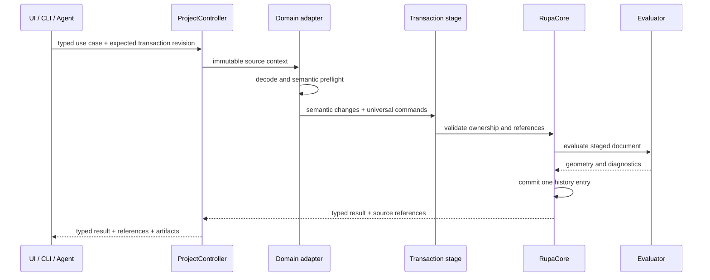

# Rupa Domain Transaction Contract

## Purpose

This document defines how a domain operation updates semantic source and its CAD
projection without creating two truths, bypassing undo, or exposing partially
committed state.

## Transaction Flow

## Atomicity

A semantic projection transaction has one before state and one after state.

| Requirement | Contract |
|---|---|
| Source update | Semantic payload, projection manifest, CAD source, scene metadata, and ownership changes commit together. |
| Validation | Structural, semantic, ownership, source-reference, and evaluation checks run before commit. |
| Undo/redo | One successful domain transaction creates one command-history entry. Undo cannot leave semantic payload and CAD projection at different revisions. |
| Failure | Any failure discards the isolated source stage. Workspace state, source history, diagnostics, and project artifacts remain unchanged. |
| Transaction revision | Expected revision is checked before staging. One committed transaction advances it exactly once, independent of internal command count. |
| Observation | Intermediate staged states are not published to UI, Agent session observers, exports, or external services. |

Executing normal commands and restoring a snapshot afterward is not a valid
dry-run mechanism when commands can publish observers, write files, start jobs,
or create external artifacts.

## Neutral Transaction Model

RupaCore owns a domain-neutral transaction representation. Concrete domains do
not add cases to a central command enum, and RupaCore does not decode concrete
domain payloads. The current development `EditorCommand` enum is a migration
source, not the target extension contract; `UNIVERSAL_3D_ARCHITECTURE.md` replaces
it with registered typed command and mutation values.

The normative transaction contract contains:

| Field | Meaning |
|---|---|
| Capability identity | Namespace and capability that produced the transaction. |
| Preconditions | Document ID, expected transaction revision, source dependency identities when required, namespace version, and reference resolutions. |
| Semantic mutations | Upsert/remove operations for neutral `SemanticExtensionEnvelope` values. |
| Universal mutations | Ordered registered typed mutation plans generated by the domain adapter. |
| Ownership changes | Explicit per-entity or per-source mapping transitions carried by semantic mutations. |
| Projection result | Complete replacement manifests for affected semantic entities, carried by semantic mutations. |
| Evaluation policy | Required exact/mesh/drawing evaluation and accepted diagnostic threshold. |
| Result mapping | Semantic, source, topology, region, and artifact references returned after commit. |

The source-changing representation contains ordered universal source mutations
and neutral semantic mutations. The executor applies both to one isolated source
stage, computes per-entity projection dependencies from the final staged source,
canonicalizes source-bound manifests, evaluates the final state, and publishes one
history entry and one transaction-revision increment only after all checks pass.
A failure discards the complete stage.

Concrete domain modules never add cases to a central command enum and never pass
opaque executable closures into RupaCore. They produce the neutral transaction
representation or a registered effect-specific query/artifact/export/job plan.

This representation does not authorize query, artifact, export, or external-job
implementations to receive a mutable session. Those effects require read-only or
effect-specific execution contexts.

## Ownership Preconditions

| Existing state | Allowed transaction |
|---|---|
| Domain-owned | Same registered domain may regenerate or edit through a declared capability. |
| Universal-owned | Domain may classify or reference it but cannot replace source intent without an explicit ownership-transfer operation. |
| Classified | Universal command remains the source mutation route; classification is updated or invalidated. |
| Unknown namespace | No semantic mutation; payload and references are preserved. |
| Stale projection | Repair or explicit ownership conversion only. |

Ownership transfer is a first-class transaction. It reports which editable
parameters, generated source, semantic data, and future regeneration behavior
change.

## Dry Run

Dry run executes the same decode, preflight, staging, and evaluation path as
commit, but against an isolated staged document.

| Dry-run behavior | Requirement |
|---|---|
| Source | Current document and command history remain unchanged. |
| Transaction revision | Result reports base revision and the single proposed revision separately. |
| Artifacts | Temporary artifacts are scoped to the dry run and cleaned up unless explicitly retained as a preview artifact. |
| External work | File writes, solver starts, network calls, and irreversible actions are prohibited. |
| Diagnostics | Same typed diagnostics and proposed output references are returned, marked as provisional. |

Capabilities that cannot satisfy these rules declare dry run unsupported. A
boolean descriptor alone is insufficient; the effect classification must make
the restriction machine-readable.

`didMutate` reports whether the caller's document committed. `wouldMutate`
reports whether the validated plan changes the staged document. Therefore a
successful mutating dry run has `didMutate == false` and
`wouldMutate == true`.

## Capability Effects

Every domain capability declares exactly one primary effect:

| Effect | Semantics |
|---|---|
| Query | Reads one immutable source/evaluation identity and returns typed data. |
| Source mutation | Commits one atomic source transaction. |
| Workspace mutation | Commits one non-source workspace-state transaction. |
| Artifact generation | Produces a derived artifact without mutating source. |
| Export | Produces an external handoff artifact under an explicit destination policy. |
| External job | Starts or controls a solver or other managed process. |
| Decision recording | Records an authorized immutable validation/handoff decision. |

Descriptors also declare input reference kinds, typed result schema, known error
codes, cancellation support, progress support, deterministic behavior, and
whether a result is exact or approximate.

## External Side Effects

Artifact generation, export, external jobs, and decision recording run through
`ProjectController`, not a mutable `EditorSession`. Export and external jobs use
prepare/commit discipline:

1. Resolve and validate source dependency identity.
2. Prepare output in a temporary location or managed job workspace.
3. Validate the prepared artifact.
4. Recheck transaction revision and source dependencies where publication depends
   on the current source.
5. Atomically publish the destination, decision record, or job identity.
6. Clean up on cancellation or failure.

An external side effect is never hidden inside a source `ProjectMutation`.

## Publication Boundary

Atomic staging and one undo entry are insufficient if observers can read fields
from different transaction states. Commit publication replaces one coherent
observable editor-state value or provides an equivalent observation barrier.
Sequentially publishing document, generation, evaluation, diagnostics, history,
and selection is not conforming even when the final values are correct.

## Required Tests

| Test family | Required cases |
|---|---|
| Atomic success | Semantic source and CAD projection commit as one undo entry. |
| Failure rollback | Failures at every stage restore document, selection, history, diagnostics, and temporary artifacts. |
| Dry run | Full preflight/evaluation occurs with no observer-visible mutation or external side effect. |
| Ownership | Domain-owned, universal-owned, classified, unknown, stale, and ownership-transfer routes are enforced. |
| Stale request | Transaction-revision mismatch rejects source mutation; dependency mismatch rejects artifact/effect publication. |
| Agent/CLI | File and live routes return the same transaction result schema. |
| Revision | A transaction containing multiple universal and semantic mutations advances exactly once; failed and dry-run stages advance zero times. |
| Performance | Staging uses copy-on-write/immutable snapshots and meets the conformance-manifest copy budget. |
