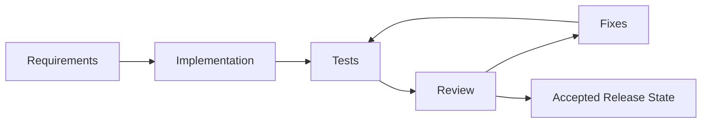
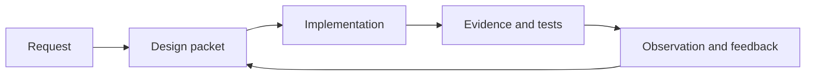
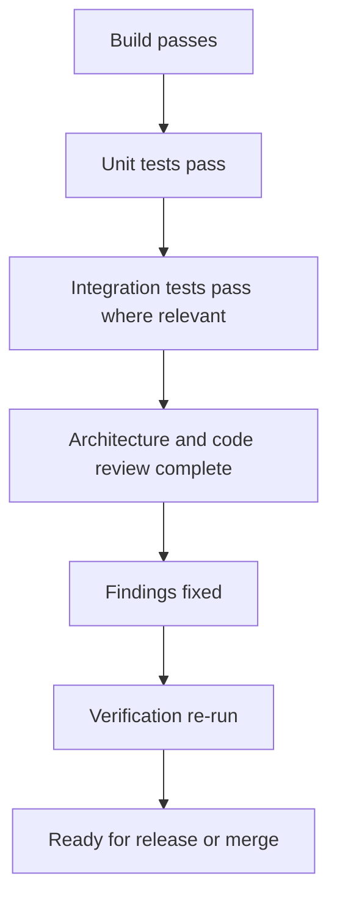

# Rupa Goal Statement

## Goal

Rupa is complete when it provides a reliable, general-purpose CAD workflow for precise modeling across video 3D assets, 3D printing objects, and architecture, while preserving one shared document model, command pipeline, validation system, and automation surface.

The goal is not only to write code. The goal is to reach an accepted release state through implementation, test execution, review, correction, and re-verification.

## Design Process Gate

Feature work must follow `DESIGN_PROCESS.md` before implementation begins. The
process turns ambiguous requests into a design packet: `DesignIntent`,
`EvaluationSpec`, `DomainModel`, `CaseSet`, `MappingSpec`,
`ConstraintBoundMapping`, `ResolvedMapping`, `ValidatedArtifact`,
`ObservationSet`, `FeedbackSignal`, and `FlowGraph`.

If a requested capability has no explicit case set, route mapping, or connection
graph, that missing process artifact is the next implementation target before
the capability is broadened.

## Completion Contract

| Phase | Required result |
|---|---|
| Design packet | Intent, evaluation, cases, mapping, constraints, decisions, validation evidence, observations, and connection graph are explicit enough to drive implementation. |
| Implementation | The requested behavior is implemented in the correct module boundary and follows the universal CAD model rather than domain-specific branches. |
| Tests | Automated tests cover the new behavior, regression risk, and relevant edge cases, and are run with explicit timeout control. |
| Review | The change is reviewed for correctness, architecture fit, command/data ownership, error handling, performance risk, and missing tests. |
| Fixes | Review findings, test failures, build failures, and specification mismatches are corrected without hiding or bypassing the underlying issue. |
| Re-verification | The corrected change is built and tested again, and the final state is reported with commands and results. |

## Definition of Done

A task is done only when all of these statements are true.

| Area | Done state |
|---|---|
| Scope | The implementation satisfies the stated requirement without adding unrelated product behavior. |
| Architecture | The app host remains thin, RupaKit owns product behavior, and Swift-CAD remains the CAD foundation. |
| Generality | The solution supports the universal CAD direction and does not encode video, printing, or architecture as separate product forks. |
| Design process | The feature has an explicit design packet or an assessment entry that covers the same DBN artifacts. |
| Units and precision | Length display and modeling behavior remain valid across micrometer-to-meter workflows. |
| Errors | Failure paths are explicit, typed where applicable, and not silently discarded. |
| Tests | Relevant unit, integration, UI, CLI, or automation tests exist and pass for the changed behavior. |
| Review | Code and documentation are reviewed against `PHILOSOPHY.md`, `SPEC.md`, `PRODUCT_REQUIREMENTS.md`, and `UNIVERSAL_CAD_REQUIREMENTS.md`. |
| Fixes | Any discovered issue is fixed or documented as a deliberate deferred decision with owner, impact, and follow-up path. |
| Handoff | The final response lists what changed, what was verified, what remains, and any known risks. |

## Review Checklist

| Question | Expected answer |
|---|---|
| Does the change preserve one shared CAD model? | Yes. |
| Does every mutation pass through an intentional command or session boundary? | Yes. |
| Does the UI distinguish component Browser, canvas tools, logs, and Inspector? | Yes, `NavigationSplitView` owns the component Browser sidebar, modeling tools float on the bottom of the canvas as Liquid Glass controls, and `MacComponent` owns the collapsed-by-default logs pane plus the right-side Inspector Pane for contextual properties. |
| Does the change respect the deferred `ApplicationProfile` requirement? | Yes, profiles can later group defaults without changing core semantics. |
| Do tests prove the behavior rather than only proving construction? | Yes. |
| Were failed tests or review findings fixed and re-run? | Yes. |

## Release Gate

No implementation is considered ready for release or merge until the fix-and-reverify loop has completed.
