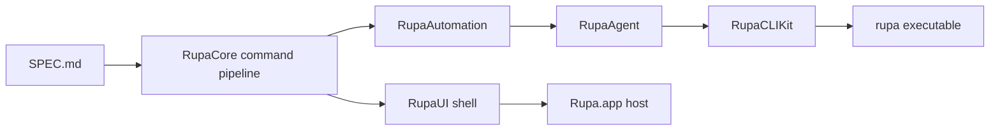

# Rupa Implementation Status

## Snapshot

This file records the current implementation review state against `GOAL_STATEMENT.md`.

| Field | Value |
|---|---|
| Snapshot date | 2026-06-04 |
| Goal state | Active |
| Current focus | Shared command/session foundation plus general sketch primitives, initial sketch constraint attachment, CLI existing-profile extrusion workflow, parameter deletion, component transform command coverage, single-use canvas creation tools, compact 3D Canvas axes, selectable Axis Gizmo with Reset and Isometric controls, animated axis-front projection, shared X/Y/Z axis colors, compact side rulers, viewport-click, Sketch/Surface/Solid viewport-drag execution, Core-owned selection state, direct Canvas picking, selected-body transform/deform affordance hover and drag interaction, selected-object measurement, structured mesh reads, evaluation, save, and export workflows |
| Verification state | `swift build --package-path RupaKit` previously passed after the selected-body transform/deform affordance interaction update, projected three-dimensional rotation arc correction, and projected three-dimensional cube affordance rendering update. Current build verification is blocked by concurrent `swift-CAD` changes outside the viewport work. UI tests were intentionally not run during current viewport iteration. |
| Release state | Not complete |



## Implemented Foundation

| Area | Current state |
|---|---|
| Package graph | `RupaKit`, `RupaCore`, `RupaUI`, `RupaRendering`, `RupaPreview`, `RupaAutomation`, `RupaAgent`, `RupaCLIKit`, and `RupaCLI` are present. |
| App host | The app host imports `RupaUI`, owns the app-wide `AgentHost`, and delegates product behavior to the package. |
| Editor shell | `RupaUI` uses SwiftUI `NavigationSplitView` for the leading component Browser sidebar, a bottom canvas-local Liquid Glass modeling tool palette over the viewport, a collapsed-by-default `MacComponent` logs pane inside the detail column, and a hidden-by-default right-side `MacComponent` Inspector Pane for contextual properties. The SwiftUI Inspector API is not used. The Inspector Pane has an ideal width of about 420 px, shows document, scene, evaluation, asset, unit, and ruler properties when no object is selected; shows selection, reference, hierarchy, state, Object type Shape, position, transform scale, material, and transform properties when one or more objects are selected; exposes command-backed object visibility/lock/material/transform reset controls; supports multi-selection mixed values for shared object properties; exposes Cube Size X/Y/Z, Cylinder radius/height, position, transform scale, and Canvas ruler values through paired TextField and Slider controls backed by RupaCore commands; and shows unsupported kernel properties such as advanced corners as read-only until feature commands exist. Browser and initial viewport selection are stored in RupaCore `SelectionModel`, drive clicked/selected-profile solid creation, selected-object measurement, Inspector content, source-derived viewport highlighting, Select-mode rectangle selection, and Command/Shift selection toggling. Browser visibility and lock controls now route through `EditorSession` component/scene commands. Canvas toolbar buttons now only select the active tool; viewport clicks and drags create rectangle sketches, circular profiles, footprint-sized rectangular bodies, selected-profile solids, section-plane scene nodes, structured mesh diagnostics, and structured measurement diagnostics through `EditorSession`. Successful Sketch, Surface, Solid, and Section creation returns the active tool to Select after one use. |
| Initial viewport | `RupaRendering` draws grid, X/Y/Z Canvas axes, compact side rulers, a selectable compact 3D axis triad with Reset and Isometric controls plus projection mode display, animated axis-front viewport projection, center and button isometric reset, camera pan/zoom reset, shared X/Y/Z axis colors, feature count, selected-body volume geometry from all eight transformed vertices and six projected faces, selected/editing body source-sketch suppression, edited-body coordinate-aware hover and pick hit testing, Select-mode screen-space rectangle selection from projected object bounds, single-body and multi-body selection affordances, multi-body outer-bound selection volumes treated as one selection object for shared move/scale interactions, six face-center handles, body-centered projected long axis arrows with three-dimensional cone heads, inward one-sided scale cubes, projected sphere center-scale handles at rotation-arc intersections, projected three-dimensional vertex cubes, face-parallel projected circular face handles, body-centered projected three-dimensional rotation arcs on coordinate planes, projected pivot cubes, hover highlights, transient selected-body drag interaction, and a source-derived sketch/body preview for initial line, circle, rectangle, and extrusion commands, then maps viewport clicks back to product scene-node references and model-space coordinates for Select mode, active-tool canvas execution, and model-space drag ranges for initial Sketch rectangle, Surface circle, and Solid footprint body creation. |
| Document generation | `DocumentGeneration` exists and is enforced for stale mutation detection. |
| Document store | `CADDocumentStore` owns document state, dirty state, diagnostics, evaluation status, evaluation snapshot metadata, product metadata, and snapshots. |
| Selection model | `SelectionModel` owns selected and hovered scene-node references, validates them against the current Rupa document, and prunes stale selection after document or metadata changes without mutating generation, dirty state, or undo history. |
| Universal product metadata | `ProductMetadata` defines persistent scene nodes, Object descriptors, component definitions and instances, material library, validation rules, export presets, and template defaults without domain-specific branches. `SceneNode` is now the selectable Object occurrence and `ObjectDescriptor` records the CAD object category, geometry role, object type ID, flexible property values, source feature, source profile, and component instance separately from generated geometry. Object typing is now backed by `ObjectType`, `ObjectTypeDefinition`, `ObjectRepresentationKind`, `ObjectPropertyDefinition`, `ObjectPropertySet`, and `ObjectTypeRegistry`; definitions now separate source representation from generated representation so Path and closed profile shapes can use 2D source data while generating 3D output through extrusion and bevel properties. The initial built-in object list is an `ObjectTypeDefinition` catalog array, not a stored enum. |
| Commands | `EditorCommand` routes unit changes, document rename, reset, product metadata replacement, parameter upsert and deletion, component definition and instance creation, scene/component visibility, lock, and local transform state changes, section-plane creation, line sketch creation, circle sketch creation, size-defined and corner-defined rectangle sketch creation, sketch constraint attachment, profile extrude, size-defined and corner-defined extruded rectangle creation, extruded circle creation, `setCubeDimensions`, `setCylinderDimensions`, and validation through one mutation path. Cube and Cylinder dimension commands are Object type property edits; they expose CAD dimensions instead of source-level extrude-depth terminology. |
| Parameters | RupaCore can upsert Swift-CAD parameters by name with typed `CADExpression` and `QuantityKind`, delete parameters by name, preserve Swift-CAD validation and revision semantics, and reject deletion while a parameter is still referenced. |
| Initial modeling | RupaCore can create line, positive-radius circle, size-defined rectangle, and corner-defined rectangle sketches, attach validated non-duplicate Swift-CAD sketch constraints to existing sketch features, extrude an existing supported closed line-loop or circular profile reference, reject open line profiles before extrusion mutation, and create size-defined rectangular, corner-defined rectangular, or circular bodies while updating Swift-CAD `DesignGraph` and Rupa scene metadata together. |
| Undo and redo | `CommandStack` records undoable mutations, redo state, and advances generation on undo and redo. |
| Evaluation scheduler | `EvaluationScheduler` runs deterministic Swift-CAD evaluation, publishes `EvaluationSnapshot`, records evaluated generation, and emits render invalidation tokens. |
| Mesh summary service | `MeshSummaryService` evaluates source as needed and reports generated mesh body, vertex, normal, triangle, index, per-body, and bounds summaries without mutating source. |
| Measurement service | `MeasurementService` computes non-mutating source-derived counts, bounds, closed profile area, extruded solid volume, selected sketch measurement, and selected body measurement for initial line, circle, rectangle, and extrusion workflows. |
| Empty document evaluation | Empty documents validate as valid Rupa source with zero generated bodies instead of surfacing a kernel empty-mesh failure to the UI. |
| Typed errors | `EditorError` provides explicit codes for generation mismatch, load/save failure, command failure, references, and evaluation. |
| File service | `DocumentFileService` loads and saves Rupa `.swcad` packages containing Swift-CAD source plus Rupa metadata, with legacy Swift-CAD native package fallback. |
| Save result | `SaveResult` reports save path, generation, dirty state, and diagnostics for file and live save operations. |
| Export service | `DocumentExportService` evaluates Rupa documents and writes Swift-CAD exchange artifacts with preset selection, output-unit override, destination policy resolution, typed result metadata, and dry-run support. |
| Automation | `AutomationRunner` applies commands and ordered batches through `EditorSession`. |
| Agent | `AgentServer` handles in-memory status, sessions, and command dispatch; `MainActorAgentBridge`, `AgentSocketListener`, `AgentSocketService`, `AgentClientProtocol`, `AgentClient`, socket path, and message codec define the IPC boundary. |
| UI agent host | `AgentHost` starts and stops the socket listener from app lifecycle and registers UI-owned sessions through a MainActor-safe bridge. |
| CLI | `RupaCLIKit` provides testable commands and workflow service; `RupaCLI` is a thin executable entry point. |
| CLI status and sessions | `rupa agent status` and `rupa sessions` route through `AgentClientProtocol`. |
| CLI attach | `rupa attach` resolves open sessions by file path or explicit session ID and returns typed session metadata. |
| CLI rename mode matrix | Rename workflow supports `auto`, `file`, and `live` modes through a shared testable service path. |
| CLI parameter mode matrix | `param set` and `param delete` support the same `auto`, `file`, and `live` mode model for numeric literals, parsed length, angle, scalar formulas, and dependency-validated deletion; `param list` reads file or live parameters. |
| CLI sketch/modeling mode matrix | `sketch line`, `sketch circle`, `sketch rectangle`, `model box`, `model box-corners`, `model cylinder`, and `model extrude` support the same `auto`, `file`, and `live` mode model for creating primitive sketches, first solid bodies from numeric dimensions or footprint corners, and existing-profile extrusion by Feature ID. |
| CLI evaluation, mesh, and measurement mode matrix | `eval`, `mesh`, and `measure` support the same `auto`, `file`, and `live` mode model for generation-keyed non-mutating reads. |
| CLI save mode matrix | `save` supports the same `auto`, `file`, and `live` mode model for persisting source and marking live sessions clean. |
| CLI export mode matrix | `export` supports the same `auto`, `file`, and `live` mode model for exporting evaluated documents while preserving open-document safety, named preset selection, and destination policy overrides. |
| CLI live mutation | `rename-live` and `rename --mode live` route live document rename through Agent, Automation, and Core. |
| CLI file safety | File rename supports dry-run and optional open-document conflict detection through agent sessions. |
| CLI error mapping | Typed `EditorError` codes map to stable CLI exit code categories. |
| Agent IPC lifecycle | Package-level Unix socket listener supports start, stop, stale socket replacement, malformed request recovery, status, sessions, and command round trips. |

## Verified Behaviors

| Behavior | Evidence |
|---|---|
| Core command mutation increments generation and marks dirty | `RupaCoreTests` |
| Stale generation fails before mutation | `RupaCoreTests`, `RupaAgentTests` |
| Undo and redo restore document snapshots and advance generation | `RupaCoreTests` |
| Validation does not create an undo entry | `RupaCoreTests` |
| Empty document evaluation publishes valid status, generation, zero bodies, and render invalidation | `RupaCoreTests` |
| Kernel evaluation failure publishes failed status, diagnostics, and failed render invalidation | `RupaCoreTests` |
| Undo and redo re-evaluate the restored source generation | `RupaCoreTests` |
| File metadata round trip persists through Swift-CAD | `RupaCoreTests` |
| Product metadata command participates in generation, dirty state, undo, redo, evaluation, and diagnostics | `RupaCoreTests` |
| Component definition creation, component instance creation, and scene/component visibility, lock, and local transform state changes participate in generation, dirty state, undo, redo, evaluation, Automation, and Agent dispatch | `RupaCoreTests`, `RupaAutomationTests`, `RupaAgentTests` |
| Product metadata persists through Rupa `.swcad` package load and save | `RupaCoreTests` |
| Legacy Swift-CAD native packages load into Rupa with default product metadata | `RupaCoreTests` |
| Invalid product metadata references publish failed evaluation diagnostics and render invalidation | `RupaCoreTests` |
| EditorSession canvas toolbar selection does not mutate source, mark dirty, or create undo history; viewport-target activation and Canvas click/drag creation cover Select, Sketch, Solid, Surface, Mesh, Measure, and Section through a Core-owned result contract; successful creation tools return to Select after one use | `RupaCoreTests`, `RupaUITests` |
| EditorSession Canvas click helpers create default-sized rectangle sketches, circle sketches, background solids, selected-sketch solids, and section-plane scene nodes through the shared command path | `RupaCoreTests`, `RupaUITests` |
| Canvas displays X/Y/Z axes, compact top and leading unit-aware rulers, and a selectable compact 3D axis triad that animates the viewport projection to the selected front axis without blocking floating Toolbar interaction | `RupaRenderingTests`, `RupaUITests` |
| EditorSession selection validates scene-node references, does not mutate document state, prunes stale references after reset and undo, and feeds selected-sketch solid creation | `RupaCoreTests` |
| Initial viewport scene extraction, projection/unprojection, model coordinate mapping, and hit testing select source-derived sketches and bodies, return no hit for background points, and feed active-tool canvas execution through the UI bridge | `RupaRenderingTests`, `RupaCoreTests` |
| Structured mesh and measurement Canvas activations publish diagnostics without source mutation | `RupaCoreTests` |
| Mesh summary service reports evaluated mesh body, vertex, triangle, index, and bounds data while returning zero-mesh summaries for valid sketch-only documents | `RupaCoreTests` |
| Measurement service reports source counts, bounds, closed profile area, extruded rectangle volume, extruded circle volume, selected sketch/body measurement scope, and excludes open lines from area/volume totals | `RupaCoreTests` |
| Parameter upsert participates in generation, dirty state, undo, redo, revision, evaluation, and diagnostics | `RupaCoreTests` |
| Parameter deletion participates in generation, dirty state, undo, redo, revision, evaluation, Automation, Agent dispatch, CLI file mode, and CLI auto/live mode while rejecting still-referenced parameters before mutation | `RupaCoreTests`, `RupaAutomationTests`, `RupaAgentTests`, `RupaCLITests` |
| Parameter formula parsing resolves references, units, arithmetic, default units, and rejects unknown or self-referential formulas before mutation | `RupaCoreTests` |
| Parameter listing reports sorted parameter summaries with normalized expressions and resolved values | `RupaCoreTests`, `RupaCLITests` |
| Line, positive-radius circle, and rectangle sketch creation participate in generation, dirty state, undo history, scene metadata, valid sketch-only evaluation, Automation, Agent, and CLI mode paths | `RupaCoreTests`, `RupaAutomationTests`, `RupaAgentTests`, `RupaCLITests` |
| Sketch constraint attachment participates in generation, dirty state, undo history, evaluation, Automation, and Agent dispatch while rejecting duplicate constraints and invalid sketch geometry before mutation | `RupaCoreTests`, `RupaAutomationTests`, `RupaAgentTests` |
| Size-defined and corner-defined extruded rectangle plus circle creation produce Swift-CAD sketch plus extrude features, dependency edges, scene references, and one evaluated body | `RupaCoreTests`, `CADKernelTests` |
| Profile extrusion accepts supported closed line-loop and circle sketches, rejects open line sketches before mutation, and reaches CLI file/process and auto/live mode paths | `RupaCoreTests`, `CADKernelTests`, `RupaCLITests` |
| Unresolved profile extrude references fail before mutation | `RupaCoreTests` |
| Automation can set and delete typed Swift-CAD parameters and mutate component metadata state, including local transforms, through the shared command path | `RupaAutomationTests` |
| Automation can create size-defined and corner-defined extruded rectangle bodies, circle bodies, and construction section planes through the shared command path | `RupaAutomationTests` |
| Agent can dispatch modeling and component commands through Automation and Core | `RupaAgentTests` |
| Agent can evaluate, summarize meshes, and measure an open session, including selected-body measurement, without mutating generation | `RupaAgentTests` |
| Agent can save a file-backed open session and marks it clean; pathless save fails with a typed command error | `RupaAgentTests` |
| Agent can export an open session without mutating generation | `RupaAgentTests` |
| Export presets apply output units and destination policies through Core, Agent, and CLI paths | `RupaCoreTests`, `RupaAgentTests`, `RupaCLITests` |
| CLI file and auto/live parameter set, formula, deletion, and listing workflows preserve open-document safety | `RupaCLITests` |
| Agent can set parameter formulas, delete parameters, and list live-session parameters through Codable message payloads or Automation command dispatch | `RupaAgentTests` |
| CLI file and auto/live sketch and modeling workflows, including footprint-corner box creation, preserve open-document safety | `RupaCLITests` |
| CLI file and auto/live evaluation, mesh summary, and measurement workflows preserve generation, use live state when a document is open, and report live selected-body measurement scope | `RupaCLITests` |
| CLI file and auto/live save workflows preserve generation, persist live state, and enforce open-document safety | `RupaCLITests` |
| CLI file and auto/live export workflows preserve open-document safety and support dry-run, preset, and destination policy output checks | `RupaCLITests` |
| Automation batch respects expected generation | `RupaAutomationTests` |
| Agent lists sessions, dispatches commands, and round-trips message payloads | `RupaAgentTests` |
| CLI response JSON is stable and testable through `RupaCLIKit` | `RupaCLITests` |
| CLI executable starts and returns command output for `rupa capabilities` | `RupaCLITests` |
| CLI executable validates a closed document and persists a closed-document parameter mutation through JSON process output | `RupaCLITests` |
| CLI executable renames closed documents, creates sketch line and rectangle primitives, creates model boxes from dimensions and footprint corners, extrudes an existing profile, evaluates the result, summarizes generated meshes, exports STL output, and preserves rename/model/export dry-run semantics through process execution | `RupaCLITests` |
| CLI executable lists sessions, attaches to a file-backed open session, and mutates a live session through a temporary agent socket | `RupaCLITests` |
| CLI executable routes auto live evaluation, save, and export through a temporary agent socket while preserving persisted-file safety | `RupaCLITests` |
| CLI executable rejects open-document file-mode conflicts and allows explicit `--force-file-edit` without mutating the open session | `RupaCLITests` |
| CLI executable returns real process exit categories for usage, input/output, unavailable agent, and stale live generation failures | `RupaCLITests` |
| CLI reports agent status and sessions through a client boundary | `RupaCLITests` |
| CLI attach resolves open file-backed sessions, explicit session IDs, and missing or ambiguous targets | `RupaCLITests` |
| CLI live rename mutates an open session through Agent and Core | `RupaCLITests` |
| CLI auto rename prefers a matching open session and leaves the persisted file unchanged | `RupaCLITests` |
| CLI file mode rejects open-document conflicts unless forced | `RupaCLITests` |
| CLI live mode resolves an open session from file path or explicit session ID | `RupaCLITests` |
| CLI dry-run avoids persisted file mutation | `RupaCLITests` |
| CLI file rename refuses agent-reported open documents | `RupaCLITests` |
| CLI exit code mapping covers typed Rupa errors | `RupaCLITests` |
| Socket listener round-trips status through `AgentClient` | `RupaAgentTests` |
| Socket listener routes command execution through Agent, Automation, and Core | `RupaAgentTests` |
| Socket listener stop removes the socket and rejects new clients | `RupaAgentTests` |
| Socket listener replaces stale socket files | `RupaAgentTests` |
| Socket listener survives malformed requests and accepts later valid requests | `RupaAgentTests` |
| Socket listener can mutate UI-owned sessions through a MainActor bridge | `RupaAgentTests` |
| App-level agent host starts IPC and publishes registered UI sessions | `RupaUIPackageTests` |

## Open Work

| Priority | Area | Required next result |
|---|---|---|
| P0 | Full CLI workflows | Continue process-level coverage for parameter listing/formula editing, export preset and destination-policy options, unsupported format/unit errors, unknown-command/help behavior, and broader file/live matrix combinations. |
| P0 | Universal CAD model | Broaden the initial rectangle/extrude, sketch constraint attachment, and component metadata path into general sketches, profile reference resolution, bodies, assemblies, solved constraints, stable references, and typed diagnostics. |
| P1 | Modeling commands | Broaden constraint editing and solving, then add revolve, sweep, loft, boolean, surface, geometric transform, dimension annotation, and broader construction commands through `CommandStack`. |
| P1 | Async and incremental evaluation | Move deterministic evaluation to a cancellable generation-aware scheduler and publish stale/running state without touching undo history. |
| P1 | Rendering | Implement Metal viewport scene building, camera navigation, selection identity buffer, and buffer cache on top of the Core selection contract. |
| P1 | Import and export | Build production import/export workflows on top of the initial exchange export service: validation rule gating, tessellation/metadata policy application, format-specific diagnostics, and import reports. |
| P1 | UI workflow | Replace the current shell with feature-complete SwiftUI component Browser, command-backed bottom canvas Liquid Glass tool palette, MacComponent detail panes, MacComponent Inspector Pane, diagnostics, broader drag-based canvas editing, and full contextual property editing. |
| P2 | Drawings and annotation | Add layouts, dimensions, sheets, and print/export workflows. |
| P2 | ApplicationProfile layer | Add profile switching only after universal behavior is implemented and stable. |

## Current Review Notes

| Finding | Status |
|---|---|
| The implementation is a foundation, not a complete CAD application. | Open |
| Package-level socket listener and app-hosted startup route UI-owned sessions through a MainActor-safe bridge. | Fixed |
| `CommandStack` undo and redo generation behavior was reviewed against `SPEC.md`. | Fixed |
| CLI status, sessions, attach, file rename, dry-run, conflict check, live rename, numeric/formula parameter set, parameter deletion, parameter listing, initial `model box`, `model box-corners`, `model cylinder`, `model extrude`, explicit `eval`, `mesh`, `measure`, `save`, exchange `export`, validation, mode selection, export preset selection, output policy controls, and typed exit-code mapping exist; process-level coverage now includes capabilities, validation, rename, parameter mutation and deletion, model box, model box-corners, profile extrude, eval, mesh, save, export, sessions, attach, live rename, live auto eval/save/export, open-document conflict, force-file-edit, dry-run, and representative usage/input-output/unavailable/data exit categories, with remaining process-level coverage still open for the broader command matrix. | Partially fixed |
| Deterministic evaluation now uses Swift-CAD reports, stores evaluated generation/body count, and invalidates render state; async/incremental scheduling and evaluated artifact handoff remain open. | Partially fixed |
| Universal product metadata now persists scene/component/material/validation/export/template defaults and participates in command history; initial sketch/body scene references, component definitions, component instances, and scene/component visibility-lock-transform state are command-backed, while general reference resolver, joints, assembly solving, geometric transforms, and broader modeling coverage remain open. | Partially fixed |
| Parameter upsert and deletion now reach Core, Automation, Agent capabilities, and CLI file/live modes using Swift-CAD `ParameterTable`; formula parsing/listing reaches Core, Agent, and CLI, while dependency-aware UI editing remains open. | Partially fixed |
| Line sketch, circle sketch, rectangle sketch, sketch constraint attachment, profile extrude, size-defined and corner-defined extruded rectangle, and extruded circle commands now reach Core, Automation, and Agent; sketch/model creation also reaches CLI `sketch`/`model` commands, while CLI constraint editing and the complete constraint/profile/feature toolset remain open. | Partially fixed |
| Core-owned selection now reaches the Browser, selected/clicked-profile Solid tool, Inspector, initial viewport highlighting, Select-mode picking, active-tool Canvas click execution with model coordinates, initial Sketch drag rectangle creation, initial Surface drag circle creation, and initial Solid drag rectangular body creation; Metal selection buffers, broader drag editing, and broader interaction modes remain open. | Partially fixed |
| Structured measurement now reaches Core, the floating canvas Measure tool, Agent, and CLI `measure` with file/live/auto modes for initial supported profiles, solids, selected sketch measurement, and selected body measurement; dimensions and full geometry interrogation remain open. | Partially fixed |
| Structured mesh summary now reaches Core, the floating canvas Mesh tool, Agent, and CLI `mesh` with file/live/auto modes for evaluated body mesh counts and bounds; mesh repair, decimation, smoothing, preview tessellation controls, and mesh editing remain open. | Partially fixed |
| Exchange export now reaches Core, Agent, and CLI `export` with file/live/auto modes, dry-run, named presets, unit override, and destination policies; validation rule gating, tessellation/metadata policy application, import reports, and format-specific production policy remain open. | Partially fixed |
| Evaluation and save now reach Agent and CLI `eval`/`save` with file/live/auto modes; app sessions need file-backed registration for live save, with pathless sessions returning typed errors. | Partially fixed |
| Agent payloads have a Codable client/server codec, but the final JSON-RPC style envelope is not complete. | Open |
| RupaRendering and RupaPreview are early surfaces, now hosted by a `NavigationSplitView` shell with a leading component Browser, a collapsed-by-default `MacComponent` logs pane, and a hidden-by-default `MacComponent` Inspector Pane, with command-backed modeling tools floating on the bottom of the canvas, Canvas X/Y/Z axes, side rulers, a selectable 3D Axis Gizmo that exposes Reset and Isometric controls, animates the projection to the selected front axis, and resets to default isometric from the center or Isometric button, shared axis colors, selection-only Toolbar activation, active-tool viewport-click placement, initial viewport-drag sketch rectangle, surface circle, and solid footprint body creation, Core-owned Browser and initial Canvas selection, selected sketch/body visualization, selected-body vertex and face-center transform affordances, and contextual properties in the Inspector Pane. | Partially fixed |

## Verification Commands

The implementation must continue to be verified with these command classes after each change:

```bash
swift build --package-path RupaKit
(cd swift-CAD && perl -e 'alarm shift; exec @ARGV' 180 xcodebuild test -scheme SwiftCAD-Package -destination 'platform=macOS')
(cd RupaKit && perl -e 'alarm shift; exec @ARGV' 180 xcodebuild test -scheme RupaKit-Package -destination 'platform=macOS')
perl -e 'alarm shift; exec @ARGV' 180 xcodebuild build -workspace Rupa/Rupa.xcworkspace -scheme Rupa -destination 'platform=macOS'
rg -n "try\\?|@unchecked Sendable|DispatchQueue|EventLoopFuture" Rupa RupaKit swift-CAD/Sources --glob '*.swift' --glob '!**/.build/**' --glob '!**/DerivedData/**'
```
