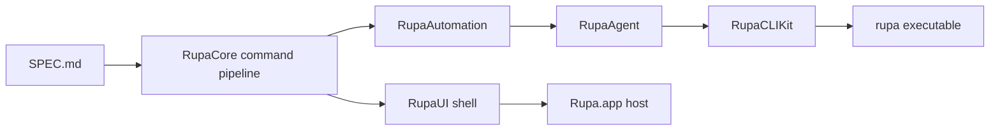

# Rupa Implementation Status

## Snapshot

This file records the current implementation review state against `GOAL_STATEMENT.md`.

| Field | Value |
|---|---|
| Snapshot date | 2026-06-25 |
| Current sketch offset verification | 2026-06-22 verification covers the official Plasticity Offset Curve dispatcher split across Offset Planar Curve, Offset Region, Offset Vertex, Slot, Offset Face Loop, and Offset Edge. The implemented slices now include source line/circle/arc planar offsets, Slot mode for selected source lines/chains/arcs, source line/arc endpoint Offset Vertex, generated body vertex dispatch on normal extrudes, source profile region offsets including the current convex/simple-concave and multi-region union subsets, generated Face dispatch into the current Offset Face Loop CADIR/kernel subset, and generated Edge dispatch into the current Offset Edge CADIR/kernel subset when options supply a generated support Face target on the same body, `EditorSession` can infer exactly one selected same-body generated support Face from selection context, or a selected generated line Edge lies on exactly one generated start/end cap Face. Offset Face Loop currently supports one generated rectangular planar face with positive inward distance, creates a direct-edit body with persistent offset edges and a center face, and is exposed through Core, Automation, Agent, topology/mesh summaries, viewport rendering, Inspector operation display, and direct-edit solid measurement. Offset Edge currently supports one generated line edge on one rectangular planar support face with positive inward distance, creates a direct-edit body with a persistent offset edge and remainder face, and is exposed through Core, Automation, Agent, topology/mesh summaries, viewport rendering, Inspector operation display, Inspector selected-edge distance/gap-fill controls, selected-support-face and single-cap-edge Agent flows, workspace `O` command state, and direct-edit solid measurement. Measurement now reports the final direct-edit body volume, mesh-derived surface area, and bounds without double-counting the superseded source body. Current support-context and UI-control work is verified with `swift build --package-path RupaKit`, `xcodebuild test ... -only-testing:RupaUIPackageTests -only-testing:RupaCoreTests -only-testing:RupaAgentTests`, `swift build --package-path swift-CAD`, `git diff --check`, `git -C swift-CAD diff --check`, and focused `try?` scans; full UI workflow verification remains deferred for the final UI pass. |
| Current official sketch reference audit | 2026-06-22 audit uses the official Plasticity Sketch index and linked command pages as the source of truth. `PLASTICITY_SKETCH_REFERENCE.md` now records selection-driven dispatcher behavior for Bridge, Align, Extend, Fillet, Join, Unjoin, Offset Curve, Project, and Rebuild, and separates implemented Rupa slices from open Plasticity parity work before further implementation. |
| Current dimension verification | 2026-06-22 verification covers the current source-curve, generated cap-edge, generated extrusion-depth edge, and selected-object Dimension slices from the official Plasticity `Dimension` command. `SketchDimensionSummaryService` lists editable candidates for selected source line (`length`, `angle`), circle (`diameter`, `radius`), and arc (`diameter`, `radius`, `angle` span) sketch entities without mutation. `SketchDimensionTargetResolver` also maps generated extrude cap Edge targets back to their editable source sketch line or circle target before summary/mutation, while rejecting unsupported topology edges before mutation. `setSketchEntityDimension` owns the corresponding mutation path after the resolver returns an editable sketch target. `ObjectDimensionSummaryService` lists editable candidates for object, face, or generated extrusion-depth Edge `SelectionTarget`s on supported rectangle-extrude bodies (`sizeX`, `sizeY`, `sizeZ`) and circle-extrude cylinder bodies (`diameter`, `radius`, `sizeY`) without mutation, while `setObjectDimension` uses the same source resolver before mutating through Core, Automation, and Agent. Workspace selection mode now wires `=` into the shared Dimension state, shows a focused Dimension context panel, follows the official `Tab` input/cycle flow, supports length and angle input, routes generated cap edges to sketch dimensions, routes generated extrusion-depth edges to object depth dimensions, and confirms through `Enter` or the panel checkmark. Agent exposes both `sketchDimensionSummary` and `objectDimensionSummary`; `sketchDimensionSummary` accepts source sketch entities and generated cap Edge targets, while `objectDimensionSummary` and `setObjectDimension` accept generated extrusion-depth Edge targets so AI callers can read candidate lists before executing mutating dimension commands. Verified with `swift build --package-path RupaKit` and focused `swift test --package-path RupaKit --filter 'objectDimension|sketchDimensionSummaryMapsGenerated|agentDispatchesObjectDimensionCommandFromGeneratedDepthEdge|agentReturnsObjectDimensionSummaryFromGeneratedDepthEdgeWithoutMutation|agentCapabilityDescriptorsExposeDiscoveryAndMutationContracts|dimensionCommandState'`. Automatic face-normal inference, solid face-distance pairs, arbitrary non-extrusion generated Edge dimensions, fillet-size dimensions, sphere dimensions, drawing annotations, and broader solver dimensions remain open. |
| Current slide CV verification | 2026-06-22 verification covers the official Plasticity `Slide` dispatcher for the current source-owned Curve CV subset and the generated PolySpline Surface CV boundary subset. Rupa now has `slideSketchSplineControlPoints` with typed Positive U, Negative U, and Normal directions, original local control-cage U direction resolution per selected CV, signed nonzero `CADExpression` distance preservation, fixed/control-point constraint validation, empty/duplicate/negative/out-of-range index rejection, non-spline/collapsed-direction rejection before mutation, sketch-entity scope spline CV hit/toggle/rectangle selection, selected-CV viewport highlighting, Inspector selected-CV index routing with contiguous CV-count fallback, selected-CV viewport U+/U-/N slide arrows with signed-distance drag commit, drag-time active curve/cage preview computed from each selected CV local direction, Ctrl-held original curve/cage comparison during active drag, workspace `U`/`Shift+U`/`N` keyboard routing while Slide Curve CV is active, and Automation/Agent command dispatch. The `SlideCommandState` dispatcher now has Curve CV and Surface CV routes. `Shift+G` resolves selected curve CVs into Curve CV, resolves generated PolySpline patch boundary vertices into Surface CV, and rejects unsupported selections before mutation. `slidePolySplineSurfaceVertices` moves one or more supported generated PolySpline patch boundary CVs along local +U, -U, normal, +V, or -V directions derived from the original patch hull, rejects duplicate source vertices and collapsed local directions, validates patch/role stability after mutation, and is exposed through Core, Automation, Agent capability discovery/codec/execution, workspace `U`/`Shift+U`/`N`/`V`/`Shift+V` routing, Surface CV context controls, viewport U+/U-/N/V+/V- slide gizmo arrows with signed-distance drag commit, drag-time regenerated moved PolySpline cubic patch-mesh preview overlay, moved-CV preview overlay, Ctrl-held original patch-mesh comparison overlay, Ctrl-held original-CV comparison overlay, workspace OK, and non-dragging right-click completion. Selected PolySpline boundary vertex drag handles now reuse the same patch-hull local direction geometry to expose U, V, and Normal constrained arrows alongside planar and global-axis movement, committing through the existing source-owned `movePolySplineSurfaceVertex` delta path. Verified with `xcodebuild test -workspace RupaKit/.swiftpm/xcode/package.xcworkspace -scheme RupaKit-Package -destination 'platform=macOS' -only-testing:RupaCoreTests -only-testing:RupaAutomationTests -only-testing:RupaAgentTests -only-testing:RupaUIPackageTests` and `xcodebuild test -workspace RupaKit/.swiftpm/xcode/package.xcworkspace -scheme RupaKit-Package -destination 'platform=macOS' -only-testing:RupaRenderingTests`. Broader NURBS surface CV source support, full evaluated-BRep comparison beyond the current PolySpline cubic patch mesh preview, and full modal command-dialog parity remain open. |
| Current snap verification | 2026-06-22 verification covers the official Plasticity Snap CV target class for the current generated PolySpline Surface CV subset, the official Measurement Point snap target for persisted Measurement annotation anchors, and the first modifier-backed snap contract slice from Core through Workspace input. `SnapResolver` classifies generated PolySpline boundary vertices as `surfaceControlVertex` candidates with stable persistent-name selection targets, labels them `Surface CV`, prioritizes them over co-located edge endpoints, projects them through construction-plane snap when requested, and exposes the same result through Agent `resolveSnap` without mutating document generation. Measurement annotations now persist in `ProductMetadata.measurements`, create annotation SceneNodes through `addMeasurementAnnotation`, and expose `measurementPoint` candidates with `SnapMeasurementReference` readback, anchor role/index/kind, resolved world point, optional source sketch/source curve/topology/topology edge reference, construction-plane projection, and Agent readback without mutation. `MeasurementAnchor` supports fixed world points, source sketch point references, source curve parameter references, generated topology point references, and generated edge parameter references for current line and circular BRep edges; these anchors are re-resolved from current document geometry instead of freezing stale coordinates. Circular generated-edge parameters use topology summary curve basis vectors derived with the same deterministic circle-basis rule used by the kernel. `SnapResolutionOptions` now carries object-targeting force enable for Ctrl-style temporary object snapping and candidate-kind suppression for Shift+X-style snap-type bypass, and Agent codec/descriptors expose the same options. `ViewportInputSurface` carries modifier flags into `ViewportCanvasTarget` and `ViewportModelDrag`; `MainView` maps Ctrl-held clicks, drags, and snap resolution into object-targeting force enable even when object snapping is globally off. `Viewport` publishes the currently hovered snap candidate kind, and `WorkspaceSnapOverrideState` maps Shift+X press/release into temporary suppression of that candidate kind before subsequent resolution. Source-curve X/Y/Z axis candidates now resolve from a reference point against the active snap coordinate system and preserve `SnapAxisReference` for Agent readback; source-curve XY/YZ/ZX coordinate-plane candidates resolve from the same reference point and preserve `SnapCoordinatePlaneReference`. Standard-plane labels follow world axes while honoring the existing ZX canvas-axis swap. `referenceID` remains a transient evaluated-BRep identifier for generated topology; stable cross-call identity is the generated topology persistent name plus selection component. Verified with `xcodebuild test -workspace RupaKit/.swiftpm/xcode/package.xcworkspace -scheme RupaKit-Package -destination 'platform=macOS' -only-testing:RupaCoreTests -only-testing:RupaAgentTests` and `xcodebuild test -workspace RupaKit/.swiftpm/xcode/package.xcworkspace -scheme RupaKit-Package -destination 'platform=macOS' -only-testing:RupaRenderingTests -only-testing:RupaUIPackageTests`. Broader CPlane workflow coverage and future non-line/non-circle generated-edge parameter support remain open. |
| Goal state | Active |
| CAD quality gate | `CAD_QUALITY_MILESTONES.md` now defines the source, command, evaluator, selection, viewport, Inspector, Agent, measurement, and verification gates required before a CAD feature is considered complete. `CADInteractionQualityAssessmentService` turns those gates into a Core-owned, Codable, Agent-readable assessment so UI quality review can be compared by objective workflow evidence instead of ad hoc impressions. |
| Current surface source reference verification | 2026-06-25 verification extends the source-owned PolySpline surface foundation from discovery-only data into kernel-native selection references. `SurfaceSourceSummaryService` now reports structured `SelectionReference.surface` values for generated B-spline patch faces, UV parameter addresses, outer trim edges, and patch-corner surface control points while preserving generated topology component IDs for viewport selection. `SelectionMeasurementService` evaluates Swift-CAD `CADAgentMeasurementQuery` values against the current evaluation cache when available, and Agent exposes the same path through `selectionMeasurement` for point, distance, and angle queries without mutating document generation. This lets Agent workflows discover a Surface CV from `surfaceSourceSummary` and immediately verify it through the same kernel `SelectionMeasurementEvaluator` used by dimensions and CAD queries rather than relying on display-mesh inference. Verified with `git diff --check`, `xcodebuild test -workspace RupaKit/.swiftpm/xcode/package.xcworkspace -scheme RupaKit-Package -destination 'platform=macOS' -only-testing:RupaCoreTests`, and `xcodebuild test -workspace RupaKit/.swiftpm/xcode/package.xcworkspace -scheme RupaKit-Package -destination 'platform=macOS' -only-testing:RupaAgentTests`. |
| Current reverse curve verification | 2026-06-20 verification passes `swift build`, focused `xcodebuild test -workspace RupaKit/.swiftpm/xcode/package.xcworkspace -scheme RupaKit-Package -destination 'platform=macOS' -only-testing:RupaCoreTests -only-testing:RupaAutomationTests -only-testing:RupaAgentTests`, focused `RupaUIPackageTests`, `git diff --check`, and focused Swift rule scans after adding official Sketch `Reverse Curve` support for source lines and cubic Bezier splines through Core, Inspector, Automation, and Agent. The command swaps line endpoints or reverses spline control-point order, rewrites fixed/coincident constraints, dimensions, spline endpoint constraints, and Bridge Curve metadata, and rejects arcs until arc direction is represented in the source model. |
| Current split segment verification | 2026-06-20 verification passes `swift build`, focused `xcodebuild test -workspace RupaKit/.swiftpm/xcode/package.xcworkspace -scheme RupaKit-Package -destination 'platform=macOS' -only-testing:RupaCoreTests -only-testing:RupaAutomationTests -only-testing:RupaAgentTests`, focused `RupaUIPackageTests`, `git diff --check`, and focused Swift rule scans after extending official Sketch `Split Segment` support for source lines, source arcs, and cubic Bezier splines through Core, Inspector, Automation, and Agent. The command keeps the selected entity as the first segment, creates a new source entity for the second segment, inserts a coincident split vertex, migrates physical end references in constraints/dimensions, updates Bridge Curve endpoint metadata, and rejects generated Bridge Curve sources, closed splines, internal spline references, entity-level references, arc center/radius references, circular constraints/dimensions, and unsupported constraints before mutation. |
| Current trim verification | 2026-06-20 verification passes `swift build`, focused `xcodebuild test -workspace RupaKit/.swiftpm/xcode/package.xcworkspace -scheme RupaKit-Package -destination 'platform=macOS' -only-testing:RupaCoreTests -only-testing:RupaAutomationTests -only-testing:RupaAgentTests`, and focused `RupaUIPackageTests` after adding official Sketch `Trim` support for already bounded source line, arc, and open spline segments through Core, Inspector, Automation, and Agent. The command removes the selected source segment, removes attached segment-local constraints and dimensions, keeps the remaining sketch valid, marks single-segment sketch objects as source-edited, and rejects point, circle, closed spline, generated Bridge Curve source, and Bridge Curve metadata-dependent targets before mutation. Intersection-defined temporary segment boundaries remain open. |
| Current cut curve verification | 2026-06-20 verification passes `swift build`, focused `xcodebuild test -workspace RupaKit/.swiftpm/xcode/package.xcworkspace -scheme RupaKit-Package -destination 'platform=macOS' -only-testing:RupaCoreTests -only-testing:RupaAutomationTests -only-testing:RupaAgentTests`, focused `RupaUIPackageTests`, `git diff --check`, and focused Swift rule scans after extending official Sketch `Cut Curve` support for the same-plane source line, source arc, or unconstrained source circle target plus source line, circle, or arc cutter subset through Core, Inspector, Automation, and Agent. The command owns `target`, `cutter`, and `CutCurveOptions`, computes strict interior target intersections, supports line-cutter extension with `extendsCutter`, maps arc-target intersections back to target-curve parameters, splits open line/arc target intersections through `splitSketchCurve`, converts circle targets with exactly two distinct cutter intersections into two source arcs, filters target/cutter arc intersections by represented arc span, and rejects screen-space direction, non-line/non-arc/non-circle targets, constrained or dimensioned circle targets, non-line/circle/arc cutters, different planes, same-curve cutters, parallel line cutters, endpoint-only intersections, tangent circle-target cuts with fewer than two distinct intersections, coincident circular curve intersections, and unsupported arc-cutter extension before mutation. Face cutters, generated-surface cutter semantics beyond same-plane analytic intersections, screen-space direction, spline targets, spline cutters, generated topology cutters, arc-cutter extension semantics, and full viewport command-dialog workflows remain open. |
| Current extend curve verification | 2026-06-20 verification passes `swift build`, `xcodebuild test -workspace RupaKit/.swiftpm/xcode/package.xcworkspace -scheme RupaKit-Package -destination 'platform=macOS' -only-testing:RupaCoreTests`, `-only-testing:RupaAutomationTests`, and `-only-testing:RupaAgentTests` after adding official Sketch `Extend Curve` endpoint-distance support for source line endpoints, source arc endpoints, and open cubic Bezier spline endpoint CVs through Core, Inspector, Automation, and Agent. The command owns `target`, `distance`, and typed `ExtendCurveShape`, preserves `CADExpression` distance terms in rewritten endpoints/control points, extends lines as straight continuations for Natural/Linear/Soft/Reflective, extends arcs as circular continuations for Natural/Soft/Reflective/Arc while preventing full-circle overextension, appends or prepends one linear cubic span for spline Linear shape, and rejects whole-curve selections, unsupported shape/entity combinations, generated Bridge Curve sources, closed splines, changing extents with unsupported constraints or dimensions, stale generations, and non-positive distances before mutation. Dependent extend to target curves, generated edges, sheets, solids, and the Extend Sheet dispatcher remain open. |
| Current sketch corner treatment verification | 2026-06-22 verification passes `swift build --package-path RupaKit`, focused `xcodebuild test -workspace RupaKit/.swiftpm/xcode/package.xcworkspace -scheme RupaKit-Package -destination 'platform=macOS' -only-testing:RupaCoreTests`, `-only-testing:RupaAutomationTests`, and `-only-testing:RupaAgentTests` after extending the official Sketch `Fillet Curve` / `Fillet Vertex` first source-owned subset through `applySketchCornerTreatment`. The command targets either a selected connected source line/arc endpoint or two selected connected source line/arc curve targets supplied as `target` plus `adjacentTarget`, accepts typed `SketchCornerTreatment.fillet` or `.chamfer`, trims both adjacent source curves, inserts an exact circular `SketchArc` or straight source line, remaps the original corner coincidence into inserted-entity endpoint coincidences, preserves safe endpoint and line-orientation constraints, refreshes affected distance/angle/radius/diameter dimensions from the post-treatment geometry, and rejects unsupported whole-curve single targets, ambiguous curve pairs, generated Bridge Curve sources, unsupported constraints, tangent or unsolvable fillet corners, collapsing distances, stale generations, and non-positive distances before mutation. It now covers line-line, line-arc, arc-line, and arc-arc source corners through Core, Inspector, Automation, and Agent. Yellow-dot side switching, spline corners, generated topology routing, selected-viewport drag handles, and command-dialog parity remain open. |
| Current insert CV verification | 2026-06-20 verification passes `swift build`, focused `xcodebuild test -workspace RupaKit/.swiftpm/xcode/package.xcworkspace -scheme RupaKit-Package -destination 'platform=macOS' -only-testing:RupaCoreTests -only-testing:RupaAutomationTests -only-testing:RupaAgentTests`, focused `RupaUIPackageTests`, `git diff --check`, and focused Swift rule scans after adding official Sketch `Insert Knot` / `Insert CV` support for open cubic Bezier spline source curves through Core, Inspector, Automation, and Agent. The command inserts inside a cubic span by shape-preserving de Casteljau subdivision, keeps the same source entity ID, expands the control-point chain by one cubic segment, updates object metadata, migrates preservable later control-point references, and rejects non-spline targets, closed splines, generated Bridge Curve sources, endpoint or existing-knot fractions, references to replaced handles, unsupported whole-spline relationship constraints, and smooth-boundary constraints that exact shape preservation cannot preserve yet. Viewport click-to-curve insertion and a future true B-spline/NURBS one-CV knot source model remain open. |
| Current rebuild curve verification | 2026-06-20 verification passes `swift build`, focused `xcodebuild test -workspace RupaKit/.swiftpm/xcode/package.xcworkspace -scheme RupaKit-Package -destination 'platform=macOS' -only-testing:RupaCoreTests -only-testing:RupaAutomationTests -only-testing:RupaAgentTests`, focused `RupaUIPackageTests`, `git diff --check`, and focused Swift rule scans after adding official Sketch `Rebuild Curve` Points, Refit, and degree-3 Explicit Control method support for open cubic Bezier spline source curves through Core, Inspector, Automation, and Agent. The command rebuilds the same source entity into a cubic `3n + 1` layout, updates object metadata, migrates endpoint and preserved-knot references, preserves internal CV references only when they can be mapped or the count is unchanged, and rejects non-cubic Explicit Control degrees, non-spline targets, closed splines, generated Bridge Curve sources, invalid point counts, invalid Explicit Control spans or weights, non-positive Refit tolerance, whole-spline constraints, unmappable internal references, and unsupported smooth-boundary constraints before mutation. Points and Refit preserve endpoints and endpoint tangents with cubic Hermite reconstruction; Refit chooses the minimum rebuilt span count within analytic cubic Bezier maximum deviation and can keep sharp internal corners as interval boundaries; Explicit Control accepts degree 3, span count, and a 0...1 weight that blends from chord-based handles toward tangent-preserving handles. Successful Core, Automation, and Agent command results include a structured analytic cubic Bezier deviation report with source IDs, method, CV/span counts, maximum deviation, RMS deviation, max-deviation fraction, evaluated interval count, and critical point count. Viewport preview/click workflow, higher-degree Explicit Control, and true B-spline/NURBS rebuild remain open. |
| Current point display verification | 2026-06-20 verification covers the official Sketch `Toggle Points` source-curve subset. `PointDisplay` stores persistent source line/circle/arc/spline point-display state in product metadata, selected curve point handles and spline CV targets normalize to the owning source curve, Core/Automation/Agent/Inspector paths use the same command contract, and the Viewport uses the same state for point-handle rendering plus point/CV interaction. Face/sheet/body CV display remains open until editable surface CV source state exists. |
| Current focus | Shared command/session foundation plus general sketch primitives, initial sketch constraint attachment with add-time solving for supported constraints, CLI existing-profile extrusion workflow, parameter deletion, component transform command coverage, single-use canvas creation tools, compact 3D Canvas axes, selectable Axis Gizmo with Reset and Isometric controls, animated axis-front projection, shared X/Y/Z axis colors, compact side rulers, viewport-click, Sketch/Surface/Solid viewport-drag execution, Arc/Spline viewport-click and viewport-drag execution with curve-specific drag previews shared with Core curve drafts, Core-owned object/face/edge/vertex/source-curve selection state, direct Canvas picking, source-owned rectangle-extrude face offset, editable cylinder side/depth face offset, selected-face viewport drag commit, vertical-edge fillet/chamfer, generated-edge re-chamfer/re-fillet on closed line-loop profiles, generated-edge re-fillet on supported line-line, non-tangent line-arc, non-tangent arc-line, and non-tangent arc-arc corners in line+arc curve-loop profiles after prior fillet, generated-edge re-chamfer on supported line-line and line-arc corners in line+arc curve-loop profiles after prior fillet, selected-edge viewport fillet handle drag commit, selected-edge viewport chamfer drag commit, rectangle profile corner vertex move, generated-vertex move on supported sharp line-line curve-loop vertices after prior fillet, selected-vertex viewport drag commit, source sketch entity point/radius/angle edits, source sketch entity dimension edits, selected source-curve viewport point handles with drag preview and command commit, selected circle/arc viewport radius handles and arc start/end angle handles with drag preview and command commit, selected line/circle/arc viewport dimension callouts with drag commit for line length, line angle, circle radius, arc radius, and arc span angle, Inspector spline control-point edits, smooth internal-knot constraint attachment, endpoint-to-line tangent constraint attachment, and endpoint-to-endpoint tangent constraint attachment, selected spline viewport control-point handles with drag preview and command commit, selected non-linear source-curve viewport curvature combs, Agent-readable `curveAnalysis` samples, Inspector selected source-curve analysis rows, plus internal spline and constrained endpoint continuity diagnostics, fixed point anchors, point-reference propagation for `coincident` plus horizontal/vertical sketch constraints, spline control-point fixed/coincident, smooth internal-knot, endpoint-to-line tangent, and endpoint-to-endpoint tangent constraint attachment/propagation, initial affected-line propagation for `parallel`/`perpendicular` line angle constraints, equal-length line constraint propagation, initial line-to-circle/arc tangent propagation, initial circular concentric center propagation, equal-radius circular propagation, constrained rectangle side dimension propagation, source line-to-arc conversion, source line-to-spline conversion with endpoint reference and spline endpoint tangent migration, Bridge Curve source creation with stored endpoint targets, endpoint-specific Tension 1/2/3 values, generated two-span spline ownership, and continuity intent, source cubic Bezier spline sketch creation/discovery/rendering/measurement, adaptive tessellated closed spline profile extraction/extrusion, Agent-routed Bridge Curve source creation, Agent-routed source point edits, fixed-aware line angle and arc span angle dimension edits, spline control-point edits, and closed spline profile extrusion, generated topology summary, Agent-discoverable, Agent-selectable, and viewport-selectable persistent face/edge/vertex/source-curve targets, structured Agent capability descriptors for discovery and mutation contracts, selected-body transform/deform affordance hover and drag interaction, selected-object measurement, structured mesh reads, evaluation, save, and export workflows |
| Verification state | `xcodebuild test -scheme SwiftCAD-Package -destination 'platform=macOS,arch=arm64'` passes after adding `SketchArc`, arc native package round trip, arc profile extraction, `Profile.boundarySegments` circular-arc preservation, exact circular-arc extrusion, cylindrical BRep surfaces, curved-face tessellation tests, equal-length sketch constraint graph coverage, tangent sketch constraint graph coverage, circular `concentric`/`equalRadius` sketch constraint graph coverage, smooth spline control-point constraint validation/round-trip/graph coverage, spline endpoint-to-line tangent validation/round-trip/graph coverage, tangent spline endpoints validation/round-trip/graph coverage, `SketchDimension.angle` validation plus line/arc graph coverage, `SketchSpline` source entity validation/native package round trip, spline control-point reference validation/constraint-graph coverage, adaptive spline profile extraction, and tessellated spline profile extrusion. `xcodebuild test -scheme RupaKit-Package -destination 'platform=macOS,arch=arm64'` passes after source-owned arc fillet, direct Agent/Core arc sketch creation, direct viewport arc/spline creation, Core curve draft construction coverage, viewport arc primitive, arc hit testing, arc measurement, profile circular-arc boundary preservation, cylindrical topology summary, editable cylinder side face offset through generated topology, generated-edge re-chamfer/re-fillet on closed line-loop profiles, generated-edge re-fillet on supported line-line, non-tangent line-arc, non-tangent arc-line, and non-tangent arc-arc corners in line+arc curve-loop profiles after prior fillet, generated-edge re-chamfer on supported line-line and line-arc corners in line+arc curve-loop profiles after prior fillet, generated-vertex move on supported line+arc curve-loop profiles after prior fillet, Agent/Automation routed generated-edge and generated-vertex edits after prior fillet, Agent-routed generated-edge re-fillet after prior chamfer, Agent-routed cylinder side face offset, Agent-routed edge fillet coverage, source-curve selection, command-backed source-curve edit coverage, source dimension-driven line/circle/arc edits including fixed-aware line angle and arc span angle, constrained rectangle side dimension propagation, fixed point preservation, add-time solving for supported sketch constraints, point-reference propagation for `coincident` plus horizontal/vertical line constraints, initial affected-line propagation for `parallel`/`perpendicular` line angle constraints, equal-length line constraint propagation, initial line-to-circle/arc tangent propagation, spline endpoint-to-line tangent propagation, circular concentric center propagation, equal-radius circular propagation, source line-to-arc conversion, source line-to-spline conversion with endpoint reference and spline endpoint tangent migration plus line-specific constraint failure guards, source cubic Bezier spline summary/rendering/measurement coverage, direct Core and Agent-routed spline control-point edit coverage, Core/Automation/Agent spline control-point fixed/coincident and smooth internal-knot constraint coverage, Core/Agent spline endpoint-to-line tangent and tangent spline endpoints constraint coverage, RupaCore closed spline profile extrusion, Agent-routed closed spline profile extrusion, Inspector spline control-point controls, selected viewport source point handles, selected viewport source radius/angle handles, selected viewport source dimension callouts and dimension-label drag payloads, Automation/Agent fixed-aware line angle and arc span angle dimension coverage, selected viewport spline control-point handles with hit-index coverage, selected source-curve Inspector analysis rows, curve analysis sample, internal spline continuity, constrained endpoint continuity coverage, Bridge Curve source creation/metadata/Agent dispatch coverage, and structured Agent capability descriptors for discovery, target kinds, mutation behavior, and failure contracts. `xcodebuild test -workspace Rupa/Rupa.xcworkspace -scheme RupaRenderingTests -destination 'platform=macOS,arch=arm64'` passes with selected source-curve point-handle hit coverage, selected-edge fillet radius mapping, selected source-curve dimension callouts, direct arc/spline creation preview geometry shared with Core curve drafts, and selected spline control-point sample/control-point preservation and hit-index coverage. `xcodebuild build -workspace Rupa/Rupa.xcworkspace -scheme Rupa -destination 'platform=macOS,arch=arm64'` passes after the latest fixed point handling, point constraint propagation, source dimension propagation including fixed-aware line angle and arc span angle, initial line angle propagation, equal-length line propagation, initial tangent propagation, spline endpoint-to-line tangent propagation, circular concentric/equal-radius propagation, line-to-arc changes, source line-to-spline changes including spline endpoint tangent migration, Bridge Curve source creation/metadata/Agent dispatch, source spline control-point fixed/coincident/smooth internal-knot constraint changes, Inspector line-to-spline conversion, Inspector spline control-point controls, Inspector selected source-curve analysis rows, Inspector smooth internal-knot action, Inspector endpoint tangent controls including spline endpoint targets, selected viewport source point handles, selected viewport source radius/angle handles, selected viewport source dimension callouts and dimension-label drag commit path, selected-edge fillet handle drag commit path, generated line+arc curve-loop edge/vertex edit path, selected viewport spline control-point handles, selected non-linear source-curve viewport curvature combs, Agent-readable `curveAnalysis` including constrained endpoint continuity, and structured Agent capability descriptors. |
| Current verification note | 2026-06-18 xcodebuild verification passes for `CADKernelTests` 81 tests, `RupaCoreTests` 242 tests, `RupaAgentTests` 89 tests, `RupaRenderingTests` 29 tests, and `RupaUIPackageTests` 1 test after adding the PolySpline foundation, mesh suitability diagnostics, quad patch graph IR, exact non-overlapping patch partition, selected patch-adjacency continuity diagnostics, planar unmerged multi-patch B-spline sheet output, Agent-readable generated-surface continuity summaries, Inspector surface continuity diagnostics, selected shared-edge viewport surface continuity overlays, and generic generated-body mesh resolution for non-`generated:body` features such as PolySpline. The focused PolySpline coverage includes kernel single-patch and planar multi-patch B-spline sheet topology, shared generated edge references for adjacent patches, structured single-quad, supported planar patch-network, and unsupported non-planar patch-network mesh analysis, patch graph candidate/conflict/partition/selected-adjacency reporting, rounded-corner preflight rejection before mutation, typed Rupa surface metadata with patch count, topology summaries with B-spline degree/control-point counts, surface continuity summaries for planar shared-edge B-spline adjacencies, Agent capability descriptors, Agent command dispatch, Agent preflight analysis, Agent surface continuity readback, Agent codec round trips, selected surface object and selected generated face viewport continuity overlay mapping, and SwiftUI package build coverage for the Inspector and viewport summary connection. 2026-06-20 latest snap/offset/slot slice verification passes `swift build`, `xcodebuild test -scheme RupaKit-Package -destination 'platform=macOS,arch=arm64'`, `xcodebuild build -workspace Rupa/Rupa.xcworkspace -scheme Rupa -destination 'platform=macOS,arch=arm64'`, `git diff --check`, and focused Swift rule scans for `try?`, `@unchecked Sendable`, and `DispatchQueue` after adding reference-point tangent/perpendicular source-curve snap candidates, first-class source spline CV snap candidates, the `offsetCurve` dispatcher with source line/circle/arc planar offset subset, source line/arc endpoint dispatch into Offset Vertex through `vertexHandle`, `OffsetCurveOptions`, symmetric line/circle output, gap-fill intent schema, pre-mutation symmetric circular collapse rejection, collinear split-vertex planar cap mesh simplification, and `createSlotSketch` selected source-line, connected open source line-chain, open source arc, and connected open line/arc chain Slot profile generation plus extrusion through Core, Automation, and Agent. 2026-06-20 curve-comb slice verification passes `swift build`, focused `RupaRenderingTests` including line suppression plus circle/arc/spline comb coverage, `git diff --check`, and focused Swift rule scans after moving viewport curve-comb rendering onto a shared `CurveEvaluationSample` overlay model. Full app/UI workflow verification remains required before declaring the product-level suite green. |
| Current snap verification | 2026-06-19 verification passes `xcodebuild test -scheme RupaKit-Package -destination 'platform=macOS,arch=arm64'`, `xcodebuild build -workspace Rupa/Rupa.xcworkspace -scheme Rupa -destination 'platform=macOS,arch=arm64'`, `git diff --check`, and focused Swift rule scans after adding source profile `Region Center` candidates with `SnapRegionReference` readback through Core and Agent `resolveSnap`. UI workflow tests remain deferred. |
| Current region target verification | 2026-06-20 verification passes focused Core/Automation/Agent xcodebuild targets, the full `RupaKit-Package` xcodebuild test, the Rupa app build, `git diff --check`, and focused Swift rule scans after adding `SelectionComponent.region`, `SelectionComponentID.profileRegion`, `SketchEntitySummaryResult.RegionEntry`, Core selection validation for closed source profiles, Agent `sketchEntitySummary` region readback, Agent `selectTargets` region selection, and `offsetCurve` source-owned Offset Region generation for convex line-loop regions with Round, Linear, and Natural gap fill plus simple concave line-loop regions with Natural gap fill and convex-only Linear connections with concave miters. UI workflow tests remain deferred for this slice. |
| Current viewport region verification | 2026-06-20 latest selected-region viewport-arrow and command-state verification passes focused `RupaUIPackageTests`, focused `RupaRenderingTests/ViewportSceneTests`, app build, `git diff --check`, and focused Swift rule scans after adding explicit Offset Region command mode, `O` activation, `D` distance input state, `V` gap-fill cycling, `S` lock-distance option routing, `I` individual/combined state routed through `offsetRegions`, and selected-region viewport offset arrows that map signed drag distance into the same `EditorSession.offsetCurve` path while preserving current command options. Latest symmetric, multi-region, and simple concave source Offset Region verification passes focused `RupaCoreTests/SketchEntityEditCommandTests`, `RupaAutomationTests/AutomationRunnerTests`, and `RupaAgentTests/AgentServerTests` after creating both signed source-owned regions for supported line-loop regions, prevalidating both sides before mutation, creating individual multi-region output in one undoable command, creating same-plane independent disjoint combined-region output in one source sketch feature, creating same-plane Natural/Linear polygon-union combined output for overlapping/touching offset loops including simple concave outer boundaries, and Agent-routed Natural/Linear concave offset paths. The latest kernel verification also passes Swift-CAD `CADKernelTests` after allowing simple concave line-loop profile extrusion and replacing planar cap fan triangulation with ear clipping. The broader region target slice already covers `ViewportSketchRegion` candidates, region interior hit testing that returns `SelectionComponent.region` while preserving source sketch entity edge/point hit priority, selected/hovered region highlights beneath sketch curves, rectangle-selection region hits, and selected-region Inspector controls for editable distance, gap fill, and inward/outward execution. UI workflow tests remain deferred for this slice. |
| Current construction plane verification | 2026-06-20 verification passes `swift build`, `xcodebuild test -workspace RupaKit/.swiftpm/xcode/package.xcworkspace -scheme RupaKit-Package -destination 'platform=macOS' -only-testing:RupaCoreTests` with 334 passed Swift Testing tests, `xcodebuild test -workspace RupaKit/.swiftpm/xcode/package.xcworkspace -scheme RupaKit-Package -destination 'platform=macOS' -only-testing:RupaAutomationTests` with 55 passed Swift Testing tests, and `xcodebuild test -workspace RupaKit/.swiftpm/xcode/package.xcworkspace -scheme RupaKit-Package -destination 'platform=macOS' -only-testing:RupaAgentTests` with 124 passed Swift Testing tests after adding `ConstructionPlaneTargetResolver`, Core/Automation/Agent `createConstructionPlaneFromTarget` and `createConstructionPlaneFromTargets`, generated-face and source-region aligned plane coverage, generated Face+Edge perpendicular plane coverage, parallel normal-separated Face/Region midplane coverage, coplanar-region midplane rejection, generated vertex/source point point-plane coverage, sketch point-handle and source spline CV target IDs, `sketchEntitySummary` point-handle/control-point target discovery IDs, Agent capability target descriptors for sketch point handles and sketch control points, line endpoint, arc endpoint, and spline CV point-plane coverage, selection validation for point-handle/control-point compatibility, viewport sketch hit conversion to point-handle/control-point selection IDs, two-point view-normal rejection, `ViewportProjectionBasis.viewNormal`, viewport projection-basis publication, Workspace `Space`/`Shift+Space` routing for supported selected-target sets, Core/Automation/Agent/Workspace `createViewAlignedConstructionPlane` support for `Ctrl+Space` world-origin and `Ctrl+Shift+Space` picked-origin workflows, and saved construction-plane rename through Core, Automation, Agent, and Workspace Plane rail controls while keeping linked construction scene-node names synchronized. Latest focused Rendering/UI verification also passes `RupaRenderingTests` with 46 tests and `RupaUIPackageTests` with 4 tests after adding `ViewportProjectionBasis.aligned(to:)`, `ViewportProjectionRequest`, plain-`Space` view alignment for created construction planes, and saved-plane double-click/viewfinder view alignment. Full app UI workflow tests remain deferred for the final UI pass. |
| Latest surface slice | `surfaceAnalysis` reports B-rep trim-boundary counts, inner/open boundary counts, boundary edge counts, per-face loop roles, closure state, ordered boundary points, persistent edge names, and estimated boundary length to Agent and Inspector; selected viewport surface analysis can draw outer and inner trim-boundary overlays from the same result. `movePolySplineSurfaceVertex` moves a selected generated PolySpline patch boundary vertex by mutating the owning source mesh vertex through Core, Automation, Agent, and selected viewport boundary-vertex drag handles while rejecting stale targets, zero deltas, unsupported meshes, removed patches, or changed boundary roles before commit. `slidePolySplineSurfaceVertices` now adds the official Slide Surface CV direction contract for supported generated PolySpline patch boundary CVs: local +U/-U and +V/-V are reconstructed from the selected patch hull, Normal is derived from U cross V, all selected deltas are computed from the original source mesh before mutation, duplicate source vertices are rejected, and patch/role stability is validated after mutation. The viewport reconstructs the same generated patch-hull directions for U+/U-/N/V+/V- slide gizmo arrows, maps drag projection into signed command distance, previews the regenerated moved PolySpline cubic patch mesh plus moved selected CV positions during drag, shows the original patch mesh plus original selected CV positions while Ctrl is held for comparison, and now exposes local U, V, and Normal constrained boundary-vertex drag arrows that commit through the same source-owned move path. This advances source-owned surface boundary editing; general NURBS surface CV sources, surface CV editing beyond generated PolySpline boundary vertices, full evaluated-BRep comparison beyond the current PolySpline cubic patch mesh preview, general trim-curve editing, local-frame editing beyond current boundary vertices, and viewport trim handles remain open. |
| Latest snap slice | `SnapResolver` is now the shared non-mutating input resolver for grid, source-sketch, source profile region-center, generated topology, Measurement annotations, relation, temporary reference-line, and construction-plane-projected snap candidates. It resolves sketch points, line endpoints/midpoints/closest points, circle centers/quarter/closest points, arc centers/endpoints/midpoints/closest points, source spline CV/endpoint/closest points, supported line/circle/arc intersections, source profile region-center candidates with `SnapRegionReference` readback, generated topology vertex/edge-end/edge-middle/face-center candidates with `SelectionTarget` readback, generated PolySpline Surface CV candidates with stable persistent-name `SelectionTarget` readback, Measurement world-point, source-sketch-reference, source-curve-parameter, generated-topology-reference, and generated-edge-parameter anchors for current line and circular BRep edges with `SnapMeasurementReference` readback, reference-point X/Y/Z source-curve axis candidates with `SnapAxisReference`, reference-point XY/YZ/ZX source-curve coordinate-plane candidates with `SnapCoordinatePlaneReference`, reference-point tangent/perpendicular source-curve candidates, and `SketchInputState` reference-line anchors into typed candidates with distance, labels, source, related-source, region, topology, axis, coordinate-plane, or measurement references where applicable, selection context where applicable, and resolved coordinates. When construction-plane projection is enabled, source sketch, profile region, generated-topology, and measurement candidate coordinates are projected into the active or explicit construction-plane local coordinate system while generated topology and measurement readback preserve the original world point. Viewport sketch creation consumes the resolver, active drag snap tips can use the drag start as the reference point, Shift-tapped geometry snap anchors draw viewport guides, and Agent exposes `resolveSnap` without advancing document generation. Snap options can force object targeting even when object snaps are off, and can suppress candidate kinds so callers can bypass a currently locked snap type. Future non-line/non-circle generated-edge parameter support remains open. |
| Latest sketch offset slice | `offsetCurve` now owns the selected-target dispatcher for source line/circle/arc planar offset subsets, can route `OffsetCurveOptions.mode == .slot` on selected source lines, connected open source line-chains, open source arcs, and connected open line/arc chains into the current Slot profile subset, can route selected source line or arc endpoints with `vertexHandle` into the current Offset Vertex line-line, line-arc, arc-line, and arc-arc sketch-corner subset, can route selected source profile regions into the current Offset Region line-loop subset with Round, Linear, or Natural gap fill for convex sources, Natural gap fill for simple concave sources, and Linear gap fill that miters concave corners while adding straight extra-vertex connections only at convex corners, can create symmetric lock-distance Offset Region output for that subset by creating both signed source-owned regions after prevalidating both sides, and keeps `createSlotSketch` as the direct Plasticity Slot command for the same selected source-line, connected open source line-chain, open source arc, and connected open line/arc chain subsets. `offsetRegions` now owns multi-selected source-region offset execution: individual mode creates separate source-owned offset regions in one undoable command, combined mode creates same-plane independent disjoint offset loops in one source sketch feature, overlapping/touching Natural or Linear combined mode creates a same-plane polygon-union loop that can include a simple concave outer boundary, and symmetric combined mode creates both signed combined outputs after prevalidating both sides. Offset Region generation creates new source-owned closed sketch profiles from offset boundary geometry: Round inserts circular corner arcs for the supported convex subset, Linear inserts straight extra-vertex connections at convex corners and miter points at concave corners, and Natural uses miter intersections without extra vertices. Same-sketch disjoint loops are extracted as independent regions; nested, touching, or intersecting same-sketch loops remain explicit unsupported cases until hole-aware or region-union extraction lands. It rejects non-line regions, self-intersecting source regions, collapsing or inverted one-sided results, collapsing or inverted symmetric-side results, Round concave-corner offset, cross-plane combined requests, Round curved-boundary union, and polygon unions with holes or multiple outer boundaries before mutation, and reaches Core, Automation, Agent, viewport-hit-tested/highlighted region selection, selected-region Inspector distance/gap-fill controls, explicit viewport command mode with `O`, `D`, `V`, `S`, and `I` command state, and selected-region viewport signed-distance arrow drags through the same selection target path. Offset Vertex splits adjacent source lines by linear distance and adjacent source arcs by arc length, inserts the two new vertices on either side of the selected corner, preserves analytic `SketchArc` source geometry and the supported coincident plus line-side horizontal/vertical constraint subset, migrates dimensions attached to the original split corner by rewriting endpoint references to inserted corner segments and refreshing point-backed distance/angle plus circular radius/diameter values, keeps closed profiles extrudable through split-vertex profile extraction, and keeps collinear split-vertex planar caps meshable by simplifying only the tessellation polygon while preserving source topology. The command path reaches Core, Automation, and Agent both directly through `offsetSketchVertex` and through `offsetCurve` vertex dispatch; arc-span dimensions across connected same-circle split arc chains are preserved by path-aware measurement, and selected line/arc endpoint Inspector controls and viewport vertex-distance arrows execute direct vertex offsets through the same command path. Slot generation creates an extrudable closed sketch profile from symmetric offsets plus two tangent semicircular caps, records width/path/radius metadata, validates closed/branched line/arc-chain failures, disconnected line/arc offset joins, source/profile self-intersection, invalid tangent caps, and full-circle/collapsing-inner-radius arc failures before mutation, stays extrudable through curved-profile cap tessellation, and reaches Core, workspace context controls, Inspector line controls, selected source-line viewport width arrows, Automation, and Agent both directly through `createSlotSketch` and through `offsetCurve` Slot mode. Joined open curve planar offsets, Round concave-corner offset, Round curved-boundary combined union, spline Offset Vertex, generated-vertex Offset Vertex dispatch, spline Slot inputs, richer numeric command-dialog editing, and UI workflow tests remain open. |
| Release state | Not complete |



## Plasticity Reference Status

This table answers the current implementation state for the referenced Plasticity capabilities.

| Capability | Current status | Evidence | Gap |
|---|---|---|---|
| Regular Polygon | Partial | `createPolygonSketch` creates a source-owned regular polygon profile as a closed equal-length line loop from center, sizing radius, `PolygonSizingMode`, `PolygonInclinationMode`, side count, and rotation angle through Core, Automation, Agent, and viewport drag preview. The sizing radius can represent either circumradius or inradius, and metadata stores sizing intent, construction-plane-relative inclination intent, and render circumradius. `PolygonToolState` remembers the EditorSession side count, sizing mode, inclination mode, and Knife state, feeds canvas click/drag creation and polygon drag previews, exposes workspace context controls for side-count changes plus inscribed/circumscribed, vertical/horizontal inclination, and Knife toggling, and routes active polygon `Up`/`Down`/`Shift+Scroll`/`C`/`V`/`K` input through the same state. Shared `SketchInputState` holds X/Y/Z axis constraints, tool-scoped `Tab`-cycled dimension input focus, and validated Length/Angle/Width/Height input values for active sketch-creation tools; Workspace compact numeric fields edit the focused input value; focused Length values override polygon radius; focused Angle values override polygon rotation; focused Width/Height values override rectangle click/drag creation; and non-Knife viewport drag preview, snap probing, and final command commit apply construction-plane-aware global-axis projection from that state where supported by the active tool. When Knife is enabled, polygon canvas creation routes to `createFaceKnife`; generated-topology snap candidates preserve their world point through viewport drag, selected generated planar Face interior hit points are restored from the viewport-projected Face polygon, and those Face points are projected into the selected Face local coordinate system before the closed world-space loop is stored, producing a direct-edit body from one selected generated planar face through Swift-CAD evaluation, Core, viewport rendering, Inspector, Automation, Agent, measurement, and topology summary. Swift-CAD now validates simple in-plane Knife loops, supports convex and concave straight-line polygon cuts inside one generated planar line-loop face, and tessellates the resulting one-hole planar face through polygon-hole bridge plus ear clipping instead of a rectangle-only hole path. | Multi-face Knife, curved cutters, arbitrary trimmed/curved face targets, and richer viewport preview/diagnostics remain open. |
| Offset Curve | Partial | Plasticity's Offset Curve dispatches by selected target into Offset Vertex, Offset Planar Curve, Offset Region, Offset Face Loop, or Offset Edge, and Offset Planar Curve can activate Slot. Rupa exposes `offsetCurve` through Core, Automation, and Agent as that dispatcher. Implemented branches create new source sketch curves for selected source line/circle/arc targets, route selected source lines/chains/arcs with `OffsetCurveOptions.mode == .slot` into Slot profile generation, route selected source line/arc endpoints plus supported generated body vertices into Offset Vertex, create new source-owned closed line-loop regions for selected source profile regions including the current convex/simple-concave and multi-region union subsets, route generated Face targets into `FaceLoopOffsetFeature`, and route generated Edge targets into `EdgeOffsetFeature` when `OffsetCurveOptions.supportTarget` supplies a generated support Face on the same body, selection context supplies exactly one same-body generated support Face, or a selected generated line Edge lies on exactly one generated start/end cap Face. The face-loop branch currently accepts one generated rectangular planar face with positive inward distance, creates a direct-edit body whose selected face is split into a ring and a center face, exposes persistent offset edges through topology summary, mesh summary, viewport rendering, Inspector display, Automation, and Agent, and measures final direct-edit volume, mesh-derived surface area, and bounds without double-counting the superseded source body. The edge branch currently accepts one generated line edge on one rectangular planar support face with positive inward distance, splits the support face and adjacent boundary edges, creates a direct-edit body with one persistent offset edge and a remainder face, exposes the result through topology summary, mesh summary, viewport rendering, Inspector display, selected-edge Inspector/workspace command controls, Automation, and Agent, and measures final direct-edit volume, mesh-derived surface area, and bounds without double-counting the superseded source body. The source line/circle/arc subset accepts `OffsetCurveOptions`, supports one-sided and symmetric output, carries gap-fill intent, and rejects zero/collapsing distances. The region subset rejects non-line regions, self-intersecting sources, cross-plane combined output, Round concave-corner offset, Round curved-boundary union, nested/touching/intersecting same-sketch loops without union extraction, polygon unions with holes or multiple boundaries, and collapsing/inverted/self-intersecting output. Unsupported source point entities, spline targets, generated vertices outside the normal-extrude source line/arc endpoint subset, invalid Slot options, Slot support targets, unsupported Slot spline/closed/branched/point branches, disconnected Slot joins, collapsing Slot arc widths, non-rectangular/non-planar face loops, symmetric face loops, edge selections without explicit/selected/cap-inferred support faces, symmetric edge offsets, unsupported edge/support-face topology, multiple selected edge offsets, and object selections reject before mutation with typed diagnostics. | Need spline/joined planar curve offset, Round concave-corner offset, Round curved-boundary combined union, hole and multi-boundary region union support, arbitrary/multi-face Offset Face Loop, multi-edge and arbitrary-support-face Offset Edge, general adjacent-face disambiguation for lone side/ambiguous edge selections, broader generated-vertex cases, actual joined-corner gap-fill geometry for non-region joined curves, freestyle snapped distance input, direct viewport drag affordances, broader mass-property reporting, and UI workflow coverage. |
| Offset Vertex | Partial | Plasticity's Offset Vertex inserts new vertices along both sides of a selected vertex. Rupa now exposes `offsetSketchVertex` through Core, Automation, and Agent for source line-line, line-arc, arc-line, and arc-arc sketch corners and also routes `offsetCurve` to that branch when a selected source line or arc endpoint supplies `vertexHandle` or a generated body vertex on a normal extrude resolves back to a connected source line/arc endpoint. It splits adjacent source lines by distance and adjacent source arcs by arc length while preserving analytic arc source geometry, preserves supported coincident plus line-side horizontal/vertical constraints, migrates dimensions attached to the original split corner by rewriting endpoint references to inserted corner segments and refreshing point-backed distance/angle plus circular radius/diameter values, preserves arc-span dimensions across connected same-circle split arc chains through path-aware measurement, exposes selected line/arc endpoint Inspector distance controls and viewport vertex-distance arrows through the same `offsetSketchVertex` command path, rejects unsupported constraints, disconnected arc-span migrations, planar offset options on vertex dispatch, and unresolved generated vertices before mutation, and keeps the edited profile extrudable through split-vertex profile extraction. | Need spline vertex support, broader generated-vertex cases beyond normal-extrude line/arc endpoint resolution, broader constraint/dimension migration, and broad UI workflow coverage. |
| Slot | Partial | Plasticity's Slot offsets an open non-self-intersecting curve symmetrically and closes both ends with tangent arcs. Rupa now exposes the supported selected-source-line, connected open source line-chain, open source arc, and connected open line/arc chain subsets through `createSlotSketch` and `offsetCurve` Slot mode in Core, workspace context controls, Inspector line controls, selected source-line viewport width arrows, Automation, and Agent. It creates a closed source-owned Slot profile from symmetric offsets and two tangent semicircular arc caps in the source sketch plane, records width/path/radius metadata, rejects closed or branched line/arc chain targets, disconnected line/arc joins, sampled self-intersection, invalid tangent caps, and full-circle or inner-radius-collapsing arc targets before mutation, and the resulting profile can be extruded through existing profile extrusion, including concave line-chain caps, open-arc loops, and connected open line/arc-chain loops after curved planar face tessellation. Unsupported point, closed circle, spline, non-source targets, Slot vertex dispatch, and planar symmetric/gap-fill options in Slot mode reject before mutation. | Need spline source curves, exact self-intersection diagnostics, broader non-line Slot affordances, and UI workflow coverage. |
| Snapping Intelligence / Precise Snapping | Partial | `SnapResolver` returns ranked grid, temporary reference-line, source-sketch, source profile region-center, generated topology, and Measurement annotation candidates for points, line endpoints/midpoints/closest points, circle centers/quarter/closest points, arc centers/endpoints/midpoints/closest points, source spline CV/endpoint/closest points, generated PolySpline Surface CV points, Measurement world-point/source-sketch/source-curve-parameter/generated-topology/generated-edge-parameter anchors for current line and circular BRep edges, supported line/circle/arc intersections, source profile region-center candidates with `SnapRegionReference`, generated topology vertex/edge-end/edge-middle/face-center candidates, Measurement candidates with `SnapMeasurementReference`, reference-point X/Y/Z source-curve axis candidates with `SnapAxisReference`, reference-point XY/YZ/ZX source-curve coordinate-plane candidates with `SnapCoordinatePlaneReference`, reference-point tangent/perpendicular source-curve candidates, active/explicit CPlane-projected source/profile/topology/measurement candidates, object-targeting force enable, and candidate-kind suppression; viewport sketch creation, active drag snap tips, Shift-tapped geometry-sourced reference guides, viewport region interior hit testing/highlighting, Workspace 2D CPlane snap, and Agent `resolveSnap` use the same source/selection references without mutating generation. | Need broader CPlane creation/edit workflow coverage and future non-line/non-circle generated-edge parameter support. |
| Tangent Snaps | Partial | `SnapResolver` can return reference-point tangent source-curve snap candidates for sketch creation and Agent readback; sketch constraints can solve line-to-circle/arc tangent, spline endpoint-to-line tangent, tangent spline endpoints, and smooth spline endpoints through Core, Inspector, Automation, and Agent paths. | Broader curve/surface target snapping, tangent-to-surface targets, and dedicated viewport constraint handles are not implemented. |
| Curvature Combs | Partial | Selected or hovered non-linear source circle, arc, and cubic Bezier spline entities render viewport curvature combs through a shared `CurveEvaluationSample` overlay model; linear curves suppress combs because their curvature is zero. Persistent Toggle Curve Curvature source-curve state is now stored in `ProductMetadata.curveCurvatureDisplays`, targets source line/circle/arc/spline entities, uses Comb Scale default `0.1`, and flows through Core, Automation, Agent, Inspector, and viewport rendering; linear curves can keep command state but render no comb. Inspector shows selected source-curve samples, length, max curvature, continuity rows, display state, and scale control; `curveAnalysis` returns curve samples, curvature, approximate length, internal spline continuity diagnostics, and constrained endpoint G0/G1/G2 diagnostics for Agent-side inspection. `surfaceAnalysis` returns generated B-spline bounded UV samples, oriented normals, analytic tangents, mean/Gaussian/U/V/principal curvature, principal directions, B-rep trim-boundary roles/closure/edge counts/ordered boundary points/estimated lengths, and finite-difference U/V normal-change comb diagnostics; the Inspector and selected viewport comb/principal-direction/trim-boundary overlays read that same result for surface objects, generated faces, and generated edges, with workspace toggles for comb/principal-direction/trim visibility and low/standard/high sample density. Agent `surfaceAnalysis` accepts the same density and trim-boundary geometry contract, and Agent/Core can now move supported generated PolySpline patch boundary vertices through source mesh mutation. | Needs Measurements/Outliner curvature records, surface-edge/isoparam Toggle Curve Curvature targets, general trim-curve editing, viewport trim handles, surface CV editing, and broader edge/isoparam diagnostics. |
| Angle Dimensions | Partial | Supported source curves can store and edit line angle and arc span angle dimensions. | General angular dimensions between arbitrary references and drawing annotations are not implemented. |
| Dimensions | Partial | Supported source curves can store and edit line length, line angle, circle radius/diameter, arc radius/diameter, and arc span dimensions. Supported selected object or face targets can now set source-owned rectangle-extrude body sizeX/sizeY/sizeZ and circle-extrude cylinder radius/diameter/sizeY through Core, Automation, and Agent. | Full selected-dimension modal UI cycling, automatic face-normal inference, general solver dimensions, solid face-distance dimensions, fillet-size dimensions, ordinate dimensions, and drawing sheets remain open. |
| Construction Planes | Partial | `ConstructionPlaneSource` now persists named saved planes, `ProductMetadata.activeConstructionPlaneID` stores the active plane, construction scene nodes link back to saved plane IDs, `renameConstructionPlane` updates saved-plane metadata plus linked construction scene-node labels in one undoable mutation, default rectangle/circle/extruded sketch creation uses the active plane when no explicit plane is supplied, Workspace adaptive-plane creation checks the active saved plane before fallback, Workspace exposes 2D CPlane snap, `SnapResolver` projects source sketch/profile-region/generated-topology snap candidates into the active or explicit construction plane, Automation/Agent can create, set, rename, summarize, and resolve snaps against saved planes, and supported face/region, Face+Edge perpendicular, parallel separated Face/Region midplane, generated-vertex point, source-point selections, source line/arc endpoints, circle/arc centers, and source spline CV targets create saved planes through Core, Automation, Agent, and Workspace routing. View-aligned planes can now be created through Core, Automation, Agent, and Workspace using explicit origin plus view normal; Workspace `Ctrl+Space` creates through world origin, `Ctrl+Shift+Space` enters a picked-origin state for the next snapped viewport point, plain `Space` aligns the viewport to the created plane, `Shift+Space` preserves the current view, and the Plane rail lists saved planes with activation, rename, double-click view alignment, and viewfinder alignment controls. | Saved-plane selection/edit handles and broad sketch-on-arbitrary-plane workflow coverage remain open. |
| Bridge Curves | Partial | `createBridgeCurve` creates a two-span cubic Bezier sketch source between supported line, arc, or spline curve positions; `setBridgeCurveParameters` regenerates an existing bridge source from updated endpoints, endpoint-specific Value 1/2 parameters, Sense 1/2 flags, source-curve Trim, endpoint-specific Tension 1/2/3 values, or endpoint-specific continuity parameters while preserving the generated spline entity ID; `BridgeCurveSource` stores endpoint targets, endpoint value parameters, endpoint sense flags, source-curve trim state, endpoint tension values, generated spline ownership, and `BridgeCurveContinuity(first:second:)` intent. G0 bridges arbitrary supported curve positions, Trim rewrites the current unconstrained line/arc/open-spline subset so interior Values become persistent endpoints, G1 is accepted for supported line/spline endpoints including trimmed endpoints, G2 is accepted for supported spline endpoints, and G3 rejects before mutation through Core, Automation, Agent, codec, ProductMetadata validation, Inspector start/end value/sense/continuity/tension/trim controls, curve analysis, and generic source-curve curvature display. | Needs constrained/dimensioned source-curve trim migration, Bridge-specific Show curvature dialog wiring, dedicated viewport bridge handles, arc/surface persistent continuity constraints, edge/face endpoint targets, surface bridge targets, and preview controls. |
| Sweep | Partial | Swift-CAD now has `SweepFeature` source IR with profile/path/guide/target roles and option storage; RupaCore creates undoable Sweep source features; Automation and Agent expose `createSweep`; native package validation accepts the source including body target references; `EditorSession.createSweepFromSelection` and the Sweep tool create a source feature from a selected profile or body source profile, optional selected sketch guide curves, and a separate clicked or selected sketch path target; Core and Agent can store body target references for boolean sweep operations while rejecting targetless boolean operations and new-body target references before mutation; the viewport context panel previews resolved profile/path/guide state before mutation; `SketchCurveExtractor` resolves path sketches and guide sketches; `SweepPathSampler` samples path frames; the kernel evaluates identity straight open path solid new-body sweeps as exact extrudes, evaluates straight-path parallel transformed or guided sections as profile-plane parallel section sweeps when the path has a profile-normal component, evaluates identity straight sheet sweeps without guides as capless exact open-shell side surfaces for line and circular-arc profile boundaries, evaluates exact axis-aligned box-prism union, difference, intersection, and slice boolean sweeps through a B-rep boolean stage with target replacement, separated-fragment difference output, z-through rectangular-frame difference output with inner-loop B-rep faces, orthogonal cell-union connected box difference output, semantic box/frame/cell-union result topology names, or keep-tools generated-name coverage, and evaluates curved, twisted, end-scaled, compatible multiple point/chord guided, non-uniform affine point-guide rail, signed-axis point-guide rail, convex quadrilateral bilinear point-guide rail, convex mean-value cage point-guide rail, or curve-contact guided solid new-body sweeps as polygonal swept B-rep/mesh output with semantic generated topology names for ring vertices, ring edges, rail edges, diagonal edges, and side triangles plus overconstrained-guide rejection, flipped/self-intersecting bilinear quadrilateral or mean-value cage rail rejection, degenerate swept-topology rejection, and guide contact validation; non-exact sheet sweeps create polygonal open-shell B-rep output as `BodyKind.sheet`, skip start/end caps, carry `surface` scene metadata, and display through the evaluated mesh path; RupaRendering displays evaluated sweep meshes instead of flattening them to boxes; evaluated mesh bodies carry generated topology face/edge/vertex hit targets and highlights; viewport hits now report their picking backend, and the workspace surfaces CPU picking versus the required identity-buffer next gate; Agent capability descriptors distinguish the implemented target-reference, section-constraint, non-uniform affine/signed-axis/convex-quadrilateral bilinear/convex mean-value cage point-guide rail, exact swept-sheet, polygonal swept-sheet, and exact box-boolean subsets from unsupported output options; `MeshSummaryService` and `TopologySummaryService` read evaluated sweep bodies including semantic sweep and exact box/frame/cell-union boolean subshape roles; `MeasurementService` reports typed linear dimensions, volume, and bounds for straight-path sweeps plus typed path length, evaluated B-rep volume, mesh-derived surface area, and bounds for curved/twisted/scaled/guided evaluated solid sweeps. | Needs rail deformation beyond the current affine, signed-axis, convex quadrilateral bilinear, and convex mean-value cage point-guide sections, non-box boolean operands, broader connected boolean topology outside the axis-aligned box cell-union subset, exact swept surfaces outside the straight identity analytic-boundary subset, broader mass-property diagnostics, Metal identity-buffer topology picking, and stable result topology naming beyond the exact box/frame/cell-union boolean subset and across exact-surface rewrites. |
| PolySplines | M6.2 partial | Swift-CAD now has `BSplineSurface3D`, `Surface3D.bSpline`, analytic B-spline surface differential geometry, `PolySplineFeature`, `PolySplinePatchGraph`, `PolySplineMeshAnalysisResult`, `PolySplineMeshAnalyzer`, kernel evaluation for a single quad mesh represented by two triangles and planar unmerged multi-patch networks, structured diagnostics for invalid meshes, unsupported rounded corners, non-manifold adjacency, inconsistent boundary winding, unsupported non-planar or merge-required patch networks, single-quad support, planar patch-network support, quad patch candidates, candidate boundary edges, split edges, shared-boundary relationships, competing-triangle relationships, exact non-overlapping patch partitions with selected/rejected candidate IDs and covered/uncovered triangles, selected shared-edge patch adjacencies with normal-angle tangent-plane classification, unresolved curvature-continuity diagnostics where needed, unpaired triangles, ambiguous triangles, B-spline sheet B-rep output with shared adjacent patch edges, B-spline tessellation, semantic generated topology names, RupaCore `createPolySplineSurface`, RupaCore `movePolySplineSurfaceVertex`, RupaCore `PolySplineMeshAnalysisService`, `SurfaceAnalysisService`, `SurfaceContinuityService`, and low/standard/high `SurfaceAnalysisOptions`, selected viewport boundary-vertex planar, global-axis, and patch-hull local U/V/Normal constrained drag handles with source-owned command commit, Automation/Agent command dispatch, Agent `polySplineMeshAnalysis` preflight, Agent `surfaceAnalysis` and `surfaceContinuitySummary` readback, Agent capability descriptors, Inspector surface analysis and continuity diagnostics including principal direction and trim-boundary rows, selected surface comb, principal-direction, trim-boundary, and shared-edge continuity overlays with workspace display/density controls, and topology summaries that report B-spline degree and control-point counts for selectable faces, edges, and vertices. | Current support intentionally evaluates exact-boundary cubic B-spline patch output for one quad or planar unmerged selected patch networks, can move supported generated patch boundary vertices by mutating source mesh vertices from Core, Automation, Agent, and selected viewport planar, global-axis, or patch-hull local U/V/Normal constrained drag, and can read generated planar shared-edge adjacencies as G1 without claiming G2. Non-planar multi-patch meshes are analyzed, partitioned, and continuity-diagnosed but rejected before mutation until G2 reconstruction exists. Needs triangle/n-gon handling, non-planar G2 multi-patch continuity solving, rounded-corner generation, patch merge policy, local-frame editing beyond current boundary vertices, surface CV editing beyond boundary vertices, general trim-curve editing, viewport trim handles, and creation affordances. |

## Implemented Foundation

| Area | Current state |
|---|---|
| Package graph | `RupaKit`, `RupaCore`, `RupaUI`, `RupaRendering`, `RupaPreview`, `RupaAutomation`, `RupaAgent`, `RupaCLIKit`, and `RupaCLI` are present. |
| App host | The app host imports `RupaUI`, owns the app-wide `AgentHost`, and delegates product behavior to the package. |
| Editor shell | `RupaUI` uses SwiftUI `NavigationSplitView` for the leading component Browser sidebar, a bottom canvas-local Liquid Glass modeling tool palette over the viewport, a collapsed-by-default `MacComponent` logs pane inside the detail column, and a hidden-by-default right-side `MacComponent` Inspector Pane for contextual properties. The SwiftUI Inspector API is not used. The Inspector Pane has an ideal width of about 420 px, shows document, scene, evaluation, asset, unit, and ruler properties when no object is selected; shows selection, reference, hierarchy, state, Object type Shape, selected-face edit controls, selected-edge fillet/chamfer controls, selected-vertex profile-corner move controls, selected-region Offset Region controls, position, transform scale, material, and transform properties when one or more objects are selected; shows source-curve selection and curve-edit controls when a sketch entity is selected; exposes command-backed object visibility/lock/material/transform reset controls; supports multi-selection mixed values for shared object properties; exposes Cube Size X/Y/Z, Cylinder radius/height, selected rectangle-extrude Face Offset steps, selected rectangle-extrude vertical-edge Fillet and Chamfer steps, selected rectangle-extrude Vertex Move X/Y steps, selected source-region Distance, Gap Fill, and Inward/Outward offset controls, selected source-curve point moves, selected source-curve radius/angle fields, selected spline control-point index, X/Y move controls, and Slide CV distance/direction controls, position, transform scale, and Canvas ruler values through RupaCore commands; and shows unsupported kernel properties such as advanced corners as read-only until feature commands exist. Browser and initial viewport selection are stored in RupaCore `SelectionModel`, drive clicked/selected-profile solid creation, selected-object measurement, Inspector content, source-derived viewport highlighting, Select-mode rectangle selection, selected-face viewport drag commit, selected-edge viewport fillet handle drag commit, selected-edge viewport chamfer drag commit, selected-vertex viewport drag commit, selected source-region Inspector offset commit, selected source-curve highlighting, selected source-curve dimension callouts with supported label drag commit, selected source-curve point-handle viewport drag commit, selected source-curve radius/angle-handle viewport drag commit, selected spline viewport control-point drag commit, and Command/Shift selection toggling. Browser visibility and lock controls now route through `EditorSession` component/scene commands. Canvas toolbar buttons now only select the active tool; viewport clicks and drags create rectangle sketches, circular profiles, footprint-sized rectangular bodies, selected-profile solids, section-plane scene nodes, structured mesh diagnostics, and structured measurement diagnostics through `EditorSession`. Successful Sketch, Surface, Solid, and Section creation returns the active tool to Select after one use. |
| Initial viewport | `RupaRendering` draws grid, X/Y/Z Canvas axes, compact side rulers, a selectable compact 3D axis triad with Reset and Isometric controls plus projection mode display, animated axis-front viewport projection, center and button isometric reset, camera pan/zoom reset, shared X/Y/Z axis colors, feature count, selected line/circle/arc source-curve dimension callouts with highlighted label hit state and supported label drag commit, selected-body volume geometry from all eight transformed vertices and six projected faces, selected/editing body source-sketch suppression, edited-body coordinate-aware hover and pick hit testing, Select-mode screen-space rectangle selection from projected object bounds and source profile region bounds, single-body and multi-body selection affordances, multi-body outer-bound selection volumes treated as one selection object for shared move/scale interactions, six face-center handles, body-centered projected long axis arrows with three-dimensional cone heads, inward one-sided scale cubes, projected sphere center-scale handles at rotation-arc intersections, projected three-dimensional vertex cubes, face-parallel projected circular face handles, body-centered projected three-dimensional rotation arcs on coordinate planes, projected pivot cubes, source sketch entity and source region hover/selection highlights, transient selected-body drag interaction, and a source-derived sketch/body preview for initial line, circle, rectangle, and extrusion commands, then maps viewport clicks back to product scene-node references and model-space coordinates for Select mode, active-tool canvas execution, and model-space drag ranges for initial Sketch rectangle, Surface circle, and Solid footprint body creation. |
| Document generation | `DocumentGeneration` exists and is enforced for stale mutation detection. |
| Document store | `CADDocumentStore` owns document state, dirty state, diagnostics, evaluation status, evaluation snapshot metadata, product metadata, and snapshots. |
| Selection model | `SelectionModel` owns selected and hovered scene-node references plus typed `SelectionTarget` values for object and subobject selection, validates scene-node ownership against the current Rupa document, validates `generatedTopology:<persistentName>`, `sketchEntity:<featureID>:<entityID>`, and `profileRegion:<featureID>:<profileIndex>` component IDs in supported paths, and prunes stale selection after document or metadata changes without mutating generation, dirty state, or undo history. Viewport face, edge, and vertex scopes store supported rectangle-extrude body hits as generated topology component IDs and resolve them back to viewport highlights. The source-curve scope stores hit sketch entities as `sketchEntity:<featureID>:<entityID>` targets and highlights the selected or hovered primitive. The source-region scope stores closed profile region hits as `profileRegion:<featureID>:<profileIndex>` targets and highlights the selected or hovered region fill. |
| Universal product metadata | `ProductMetadata` defines persistent scene nodes, Object descriptors, component definitions and instances, material library, validation rules, export presets, and template defaults without domain-specific branches. `SceneNode` is now the selectable Object occurrence and `ObjectDescriptor` records the CAD object category, geometry role, object type ID, flexible property values, source feature, source profile, and component instance separately from generated geometry. Object typing is now backed by `ObjectType`, `ObjectTypeDefinition`, `ObjectRepresentationKind`, `ObjectPropertyDefinition`, `ObjectPropertySet`, and `ObjectTypeRegistry`; definitions now separate source representation from generated representation so Path and closed profile shapes can use 2D source data while generating 3D output through extrusion and bevel properties. The initial built-in object list is an `ObjectTypeDefinition` catalog array, not a stored enum. |
| Commands | `EditorCommand` routes unit changes, document rename, reset, product metadata replacement, parameter upsert and deletion, component definition and instance creation, scene/component visibility, lock, and local transform state changes, section-plane creation, line sketch creation, circle sketch creation, arc sketch creation, cubic Bezier spline sketch creation, size-defined and corner-defined rectangle sketch creation, regular polygon sketch creation, sketch constraint attachment, Bridge Curve source creation, profile extrude, size-defined and corner-defined extruded rectangle creation, extruded circle creation, `setCubeDimensions`, `setCylinderDimensions`, `setObjectDimension`, `offsetCurve`, `offsetRegions`, `offsetSketchVertex`, `applySketchCornerTreatment`, `offsetBodyFace`, `filletBodyEdges`, `chamferBodyEdges`, `moveBodyVertex`, `moveSketchEntityPoint`, `moveSketchSplineControlPoint`, `slideSketchSplineControlPoints`, `insertSketchSplineControlPoint`, `reverseSketchCurve`, `rebuildSketchCurve`, `splitSketchCurve`, `trimSketchCurveSegment`, `cutSketchCurve`, `setSketchCircleParameters`, `setSketchArcParameters`, `setSketchEntityDimension`, `convertSketchLineToArc`, `convertSketchLineToSpline`, and validation through one mutation path. Cube and Cylinder dimension commands are Object type property edits; they expose CAD dimensions instead of source-level extrude-depth terminology. `setObjectDimension` is the target-driven selected-object Dimension command for supported rectangle-extrude and circle-extrude body sources. `createArcSketch` creates partial `SketchArc` curve source and rejects full-circle arcs. `createSplineSketch` creates cubic Bezier `SketchSpline` curve source and validates its `3n + 1` control-point contract before mutation. `createPolygonSketch` creates a closed equal-length line-loop sketch profile from center, positive sizing radius, `PolygonSizingMode`, side count, and rotation angle while storing polygon metadata for Inspector and Agent discovery. `offsetCurve` follows the Offset Curve dispatcher contract for source sketch entity targets: it creates new source line, circle, or arc curves for supported planar offsets while leaving the original curve intact, supports one-sided or symmetric source output through `OffsetCurveOptions`, carries `round`/`linear`/`natural` gap-fill intent for later joined curve branches, routes selected source line or arc endpoints into the supported Offset Vertex branch, routes selected source profile regions into the supported line-loop Offset Region branch with Round, Linear, or Natural gap fill for convex sources and Natural gap fill for simple concave sources and Linear gap fill that miters concave corners while adding straight extra-vertex connections only at convex corners, supports symmetric lock-distance output for that region subset by creating both signed source-owned regions after prevalidating both sides, routes supported generated face targets into the current Offset Face Loop direct-edit feature, rejects zero/collapsing distances including symmetric circular or region-side collapse before mutation, and rejects unsupported point, spline, non-line source region, Round concave-corner offset, unsupported face-loop cases, edge, and object targets before mutation. `offsetRegions` owns multi-selected source-region offsets, creating individual output in one undoable command, same-plane independent disjoint combined output in one source sketch feature, or same-plane Natural/Linear polygon-union combined output when offset loops overlap or touch, remapping sketch entity IDs and constraints when combining loops, and rolling back all appended source features if any append fails. `offsetSketchVertex` implements the current Offset Vertex subset for source line/arc sketch corners by splitting adjacent source lines by distance and adjacent source arcs by arc length, inserting one new vertex on each adjacent curve side, preserving analytic arc geometry plus supported coincident and line-side horizontal/vertical constraints, migrating dimensions attached to the original split corner by rewriting endpoint references to inserted corner segments and refreshing point-backed distance/angle plus circular radius/diameter values, rejecting unsupported constraints and disconnected path-spanning arc angle dimensions before mutation, and leaving closed profiles extrudable. `applySketchCornerTreatment` implements the current Fillet Curve / Fillet Vertex subset for connected source line/arc corners by trimming both adjacent source curves, inserting an exact circular arc or straight chamfer line, remapping endpoint coincidence constraints, preserving safe endpoint and line-orientation constraints, and refreshing affected distance/angle/radius/diameter dimensions from the resulting geometry. `addSketchConstraint` now validates duplicate/reference errors before mutation, then satisfies supported `fixed`, `coincident`, `horizontal`, `vertical`, `parallel`, `perpendicular`, `equalLength`, line-to-circle/arc `tangent`, circular `concentric`, circular `equalRadius`, spline `smoothSplineControlPoint`, spline endpoint-to-line `splineEndpointTangent`, and spline endpoint-to-endpoint `tangentSplineEndpoints` constraints at add time while respecting fixed anchors, including fixed/coincident/smooth/tangent spline control-point references, and synchronizing sketch object metadata; the Inspector uses this same command for selected internal cubic spline knots. `createBridgeCurve` resolves supported sketch endpoints, creates a two-span cubic Bezier bridge spline, stores `BridgeCurveSource` endpoint tension and continuity intent in product metadata, and attaches endpoint coincidence plus supported line/spline continuity constraints before commit. `moveSketchEntityPoint` and center parameter updates now reject fixed point moves, propagate connected point references through `coincident` and circular `concentric` constraints, maintain horizontal/vertical line constraints, and propagate affected `parallel`/`perpendicular` line angle constraints, `equalLength` line length constraints, supported line-to-circle/arc tangent constraints, supported spline endpoint-to-line tangent constraints, and supported circular equal-radius constraints for supported sketches. `moveSketchSplineControlPoint` edits one spline control point through the same selected sketch entity target contract, rejects fixed control-point moves, propagates supported coincident point references, smooth internal-knot handle mirroring, and endpoint-to-line tangency, endpoint-to-endpoint tangency, and revalidates the spline before commit. `slideSketchSplineControlPoints` implements the current Slide Curve CV selected-CV subset by deriving Positive U, Negative U, or Normal from each original local spline control cage, preserving signed nonzero distance expressions, rejecting empty/duplicate/negative/out-of-range indexes and invalid spline/control-cage cases before mutation, and reusing the same constraint propagation path. `insertSketchSplineControlPoint` inserts a CV inside an open cubic Bezier spline span with shape-preserving subdivision while keeping the same entity ID. `rebuildSketchCurve` implements Rebuild Curve Points, Refit, and degree-3 Explicit Control subsets for open cubic Bezier source splines, producing a cubic `3n + 1` CV layout while preserving endpoints and endpoint tangents where the method requires them, choosing minimum analytic maximum-deviation span counts for Refit, optionally keeping sharp internal corners, returning a structured analytic cubic Bezier deviation report through Core, Automation, and Agent, and rejecting unsupported reference/constraint cases before mutation. `setSketchCircleParameters`, `setSketchArcParameters`, and `setSketchEntityDimension` radius edits propagate supported circular `equalRadius` constraints. `setSketchEntityDimension` updates supported line length/angle, circle radius/diameter, arc radius/diameter, and arc span angle while storing the matching Swift-CAD `SketchDimension`; line angle edits rotate the unconstrained endpoint while preserving length; arc span angle edits move the unfixed arc endpoint while preserving a fixed opposite endpoint when possible; line length/angle and arc span angle edits reject fully fixed conflicting dimensions; for supported constrained rectangle profiles, line length updates propagate across the rectangle loop, preserve fixed rectangle sides when possible, and synchronize generated Cube body metadata. `convertSketchLineToArc` rewrites a selected source line into a circular arc while preserving the sketch entity target, migrating endpoint references, removing line-only constraints, and keeping supported closed profiles extrudable. `offsetBodyFace` is implemented for editable rectangle extrude faces and editable cylinder side/depth faces, rejects unsupported target/body types before mutation, and accepts both initial fixed body-face IDs and generated topology face component IDs resolved from persistent names. `filletBodyEdges` is implemented for editable normal rectangle extrude vertical edges by rewriting source profiles into convex closed curve loops with exact `SketchArc` rounded corners, and can re-fillet generated vertical edges on closed line-loop profiles plus supported non-tangent line-line, line-arc, arc-line, and arc-arc vertices in line+arc curve-loop profiles. `chamferBodyEdges` rewrites supported source profiles into convex line/arc loops and can re-chamfer generated vertical edges on closed line-loop profiles plus supported line-line and line-arc vertices in line+arc curve-loop profiles. Both accept initial fixed body-edge IDs and generated topology edge component IDs resolved from persistent names in supported paths. `moveBodyVertex` is implemented for generated rectangle-extrude corner vertex targets by moving the corresponding rectangle profile corner and preserving the rectangle profile for future topology resolution. Source-curve edit commands resolve `sketchEntity:<featureID>:<entityID>` targets, update or create source sketch entities through undoable command paths, validate before commit, and keep generated object metadata synchronized for supported line/circle/arc/spline/rectangle/polygon properties and dimensions. |
| Sketch corner treatment command | `applySketchCornerTreatment` is the source-owned Fillet/Chamfer command for the current connected line/arc sketch corner subset. It resolves selected source line or arc endpoint handles, requires exactly one adjacent line or arc endpoint at the same vertex, rejects unsupported constraints before mutation, trims both source curves by radius/chamfer distance, inserts either an exact circular `SketchArc` fillet or straight chamfer line, remaps the original corner coincidence into new endpoint coincidences, refreshes affected distance/angle/radius/diameter dimensions from the post-treatment geometry, and flows through Core, Inspector, Automation, Agent, codec, and focused tests. |
| Offset Region combined command | `offsetRegions` now creates individual output in one undoable command, same-plane independent disjoint combined loops in one source sketch feature, and same-plane Natural/Linear polygon-union output for overlapping/touching line-loop offsets, including simple concave outer boundaries. It remaps sketch entity IDs and constraints when combining loops, rolls back all appended source features if any append fails, rejects nested/touching/intersecting same-sketch loops without union extraction plus hole or multiple-boundary polygon unions before mutation, and leaves Round curved-boundary union for a later exact-curve union milestone. |
| Parameters | RupaCore can upsert Swift-CAD parameters by name with typed `CADExpression` and `QuantityKind`, delete parameters by name, preserve Swift-CAD validation and revision semantics, and reject deletion while a parameter is still referenced. |
| Initial modeling | RupaCore can create line, positive-radius circle, positive-radius partial arc, cubic Bezier spline, size-defined rectangle, and corner-defined rectangle sketches, attach validated non-duplicate Swift-CAD sketch constraints to existing sketch features while solving supported add-time geometry changes, extrude an existing supported closed line-loop, circular, or closed cubic Bezier spline profile reference, reject open line, arc, and open spline profiles before extrusion mutation, and create size-defined rectangular, corner-defined rectangular, circular, or tessellated closed-spline bodies while updating Swift-CAD `DesignGraph` and Rupa scene metadata together. |
| Undo and redo | `CommandStack` records undoable mutations, redo state, and advances generation on undo and redo. |
| Evaluation scheduler | `EvaluationScheduler` runs deterministic Swift-CAD evaluation, publishes `EvaluationSnapshot`, records evaluated generation, and emits render invalidation tokens. |
| Mesh summary service | `MeshSummaryService` evaluates source as needed and reports generated mesh body, vertex, normal, triangle, index, per-body, and bounds summaries without mutating source. |
| Sketch entity summary service | `SketchEntitySummaryService` reports source sketch feature, scene-node, entity ID, line/circle/arc/spline geometry, spline control points, source expressions, related constraints, related dimensions, and `sketchEntity:<featureID>:<entityID>` selection component IDs without mutating source. Agent requests can use the result to discover, select, and edit supported source curves through the shared Automation/Core command path. |
| Bridge curve source metadata | `BridgeCurveSource` records generated two-span spline ownership, endpoint references, endpoint Value parameters, endpoint Sense flags, source-curve trim state, endpoint-specific Tension 1/2/3 values, and endpoint-specific G0/G1/G2/G3 continuity intent for bridge curves created through Core, Automation, or Agent; `ProductMetadata` validates each endpoint parameter, tension, continuity, trim state, and generated `3n + 1` cubic spline against the owning sketch. Current commands support G0 for supported line/arc/spline curve positions, source-curve Trim for unconstrained line/arc/open-spline sources, G1 line/spline endpoint tangency including trimmed endpoints, and G2 spline endpoint smoothness; G3 rejects before mutation until a higher-order bridge constraint exists. |
| Topology summary service | `TopologySummaryService` evaluates source as needed and reports Swift-CAD generated BRep body, face, edge, vertex, persistent-name, reference, source-feature, scene-node, role, index, face center/normal, plane/cylinder surface definitions, line/circle curve definitions, edge trim parameters, edge endpoint, and vertex point summaries without mutating source, including semantic polygonal sweep and exact box/frame/cell-union boolean subshape roles where the evaluator provides them. `GeneratedTopologySelectionResolver` maps supported rectangle-extrude face, vertical edge, and corner vertex component IDs plus editable cylinder front/back/side face IDs to and from generated persistent topology references for command and viewport selection paths. |
| Measurement service | `MeasurementService` computes non-mutating source-derived counts, bounds, closed profile area, curve-loop area, typed solid linear dimensions, extruded solid volume, straight Sweep volume, evaluated B-rep Sweep volume with mesh-derived surface area and bounds, direct-edit Offset Face Loop / Offset Edge solid volume with mesh-derived surface area and bounds while avoiding superseded-source double-counting, selected sketch measurement, and selected body measurement for initial line, circle, arc, spline, rectangle, extrusion, supported Sweep, and current direct-edit offset workflows. |
| Profile curve contract | Swift-CAD `Profile` preserves `boundarySegments` for line and circular-arc source boundaries alongside tessellated `vertices`; closed cubic Bezier spline profiles are adaptively tessellated into line boundaries. Rupa's custom profile extractor mirrors the same contract. Planar extrude consumes exact boundary segments for normal-direction circular-arc profiles, creates circular BRep edges and cylindrical side faces, and keeps tessellated vertices for area, measurement, viewport, and exchange mesh workflows. |
| Empty document evaluation | Empty documents validate as valid Rupa source with zero generated bodies instead of surfacing a kernel empty-mesh failure to the UI. |
| Typed errors | `EditorError` provides explicit codes for generation mismatch, load/save failure, command failure, references, and evaluation. |
| File service | `DocumentFileService` loads and saves Rupa `.swcad` packages containing Swift-CAD source plus Rupa metadata, with legacy Swift-CAD native package fallback. |
| Save result | `SaveResult` reports save path, generation, dirty state, and diagnostics for file and live save operations. |
| Export service | `DocumentExportService` evaluates Rupa documents and writes Swift-CAD exchange artifacts with preset selection, output-unit override, destination policy resolution, typed result metadata, and dry-run support. |
| Automation | `AutomationRunner` applies commands and ordered batches through `EditorSession`. |
| Agent | `AgentServer` handles structured capability descriptors, in-memory status, sessions, sketch entity summaries, topology summaries, surface continuity summaries, selection state updates, and command dispatch; `MainActorAgentBridge`, `AgentSocketListener`, `AgentSocketService`, `AgentClientProtocol`, `AgentClient`, socket path, and message codec define the IPC boundary. |
| UI agent host | `AgentHost` starts and stops the socket listener from app lifecycle and registers UI-owned sessions through a MainActor-safe bridge. |
| CLI | `RupaCLIKit` provides testable commands and workflow service; `RupaCLI` is a thin executable entry point. |
| CLI status and sessions | `rupa agent status` and `rupa sessions` route through `AgentClientProtocol`. |
| CLI attach | `rupa attach` resolves open sessions by file path or explicit session ID and returns typed session metadata. |
| CLI rename mode matrix | Rename workflow supports `auto`, `file`, and `live` modes through a shared testable service path. |
| CLI parameter mode matrix | `param set` and `param delete` support the same `auto`, `file`, and `live` mode model for numeric literals, parsed length, angle, scalar formulas, and dependency-validated deletion; `param list` reads file or live parameters. |
| CLI sketch/modeling mode matrix | `sketch line`, `sketch circle`, `sketch rectangle`, `model box`, `model box-corners`, `model cylinder`, and `model extrude` support the same `auto`, `file`, and `live` mode model for creating primitive sketches, first solid bodies from numeric dimensions or footprint corners, and existing-profile extrusion by Feature ID. |
| CLI evaluation, mesh, and measurement mode matrix | `eval`, `mesh`, and `measure` support the same `auto`, `file`, and `live` mode model for generation-keyed non-mutating reads. |
| CLI save mode matrix | `save` supports the same `auto`, `file`, and `live` mode model for persisting source and marking live sessions clean. |
| CLI export mode matrix | `export` supports the same `auto`, `file`, and `live` mode model for exporting evaluated documents while preserving open-document safety, named preset selection, and destination policy overrides. |
| CLI live mutation | `rename-live` and `rename --mode live` route live document rename through Agent, Automation, and Core. |
| CLI file safety | File rename supports dry-run and optional open-document conflict detection through agent sessions. |
| CLI error mapping | Typed `EditorError` codes map to stable CLI exit code categories. |
| Agent IPC lifecycle | Package-level Unix socket listener supports start, stop, stale socket replacement, malformed request recovery, status, sessions, and command round trips. |

## Verified Behaviors

| Behavior | Evidence |
|---|---|
| Core command mutation increments generation and marks dirty | `RupaCoreTests` |
| Stale generation fails before mutation | `RupaCoreTests`, `RupaAgentTests` |
| Undo and redo restore document snapshots and advance generation | `RupaCoreTests` |
| Validation does not create an undo entry | `RupaCoreTests` |
| Empty document evaluation publishes valid status, generation, zero bodies, and render invalidation | `RupaCoreTests` |
| Kernel evaluation failure publishes failed status, diagnostics, and failed render invalidation | `RupaCoreTests` |
| Undo and redo re-evaluate the restored source generation | `RupaCoreTests` |
| File metadata round trip persists through Swift-CAD | `RupaCoreTests` |
| Product metadata command participates in generation, dirty state, undo, redo, evaluation, and diagnostics | `RupaCoreTests` |
| Component definition creation, component instance creation, and scene/component visibility, lock, and local transform state changes participate in generation, dirty state, undo, redo, evaluation, Automation, and Agent dispatch | `RupaCoreTests`, `RupaAutomationTests`, `RupaAgentTests` |
| Product metadata persists through Rupa `.swcad` package load and save | `RupaCoreTests` |
| Legacy Swift-CAD native packages load into Rupa with default product metadata | `RupaCoreTests` |
| Invalid product metadata references publish failed evaluation diagnostics and render invalidation | `RupaCoreTests` |
| EditorSession canvas toolbar selection does not mutate source, mark dirty, or create undo history; viewport-target activation and Canvas click/drag creation cover Select, Sketch, Polygon, Arc, Spline, Solid, Surface, Mesh, Measure, and Section through a Core-owned result contract; Polygon creation uses remembered side count, sizing mode, and inclination mode; successful creation tools return to Select after one use | `RupaCoreTests`, `RupaRenderingTests`, `RupaUITests` |
| EditorSession Canvas click helpers create default-sized rectangle sketches, circle sketches, background solids, selected-sketch solids, and section-plane scene nodes through the shared command path | `RupaCoreTests`, `RupaUITests` |
| Canvas displays X/Y/Z axes, compact top and leading unit-aware rulers, and a selectable compact 3D axis triad that animates the viewport projection to the selected front axis without blocking floating Toolbar interaction | `RupaRenderingTests`, `RupaUITests` |
| EditorSession selection validates scene-node references, preserves object-compatible selected scene-node views for typed object/face/edge targets, does not mutate document state, prunes stale references after reset and undo, and feeds selected-sketch solid creation | `RupaCoreTests` |
| Initial viewport scene extraction, projection/unprojection, model coordinate mapping, and hit testing select source-derived sketches and bodies, return no hit for background points, and feed active-tool canvas execution through the UI bridge | `RupaRenderingTests`, `RupaCoreTests` |
| Structured mesh and measurement Canvas activations publish diagnostics without source mutation | `RupaCoreTests` |
| Mesh summary service reports evaluated mesh body, vertex, triangle, index, and bounds data while returning zero-mesh summaries for valid sketch-only documents | `RupaCoreTests` |
| PolySpline mesh analysis reports supported single-quad patches and unsupported rounded-corner or patch-network requests without mutating source state | `CADKernelTests`, `RupaCoreTests`, `RupaAgentTests` |
| Measurement service reports source counts, bounds including cubic Bezier spline sample/control extents, closed profile area including closed spline curve loops, extruded rectangle volume, extruded circle volume, extruded closed spline volume, direct-edit Offset Face Loop / Offset Edge final solid volume with mesh-derived surface area and bounds without double-counting superseded source bodies, selected sketch/body measurement scope, and excludes open lines and open splines from area/volume totals | `RupaCoreTests` |
| Parameter upsert participates in generation, dirty state, undo, redo, revision, evaluation, and diagnostics | `RupaCoreTests` |
| Parameter deletion participates in generation, dirty state, undo, redo, revision, evaluation, Automation, Agent dispatch, CLI file mode, and CLI auto/live mode while rejecting still-referenced parameters before mutation | `RupaCoreTests`, `RupaAutomationTests`, `RupaAgentTests`, `RupaCLITests` |
| Parameter formula parsing resolves references, units, arithmetic, default units, and rejects unknown or self-referential formulas before mutation | `RupaCoreTests` |
| Parameter listing reports sorted parameter summaries with normalized expressions and resolved values | `RupaCoreTests`, `RupaCLITests` |
| Line, positive-radius circle, positive-radius partial arc, cubic Bezier spline, and rectangle sketch creation participate in generation, dirty state, undo history, scene metadata, valid sketch-only evaluation, Automation, and Agent paths; line, circle, and rectangle creation also cover CLI mode paths | `RupaCoreTests`, `RupaAutomationTests`, `RupaAgentTests`, `RupaCLITests` |
| Sketch constraint attachment participates in generation, dirty state, undo history, evaluation, Automation, and Agent dispatch while rejecting duplicate constraints and invalid sketch geometry before mutation; supported `fixed`, `coincident`, `horizontal`, `vertical`, `parallel`, `perpendicular`, `equalLength`, line-to-circle/arc `tangent`, circular `concentric`, circular `equalRadius`, spline `smoothSplineControlPoint`, spline endpoint-to-line `splineEndpointTangent`, and spline endpoint-to-endpoint `tangentSplineEndpoints` additions solve geometry immediately, support spline control-point fixed/coincident/smooth/tangent references, and reject fixed-anchor conflicts before mutation | `RupaCoreTests`, `RupaAutomationTests`, `RupaAgentTests` |
| Bridge Curve source creation and source-parameter editing participate in generation, dirty state, undo history, product metadata validation, Automation, Agent dispatch, Agent message codec round trips, Inspector bridge source controls, and Agent-readable curve analysis while storing endpoint targets, endpoint Value parameters, endpoint Sense flags, source-curve trim state, endpoint-specific Tension 1/2/3 values, generated two-span spline ownership, and endpoint-specific G continuity intent | `BridgeCurveCommandTests`, `RupaAutomationTests`, `RupaAgentTests` |
| Size-defined and corner-defined extruded rectangle plus circle creation produce Swift-CAD sketch plus extrude features, dependency edges, scene references, and one evaluated body | `RupaCoreTests`, `CADKernelTests` |
| Profile extrusion accepts supported closed line-loop and circle sketches, rejects open line sketches before mutation, and reaches CLI file/process and auto/live mode paths | `RupaCoreTests`, `CADKernelTests`, `RupaCLITests` |
| Unresolved profile extrude references fail before mutation | `RupaCoreTests` |
| Automation can set and delete typed Swift-CAD parameters and mutate component metadata state, including local transforms, through the shared command path | `RupaAutomationTests` |
| Automation can create size-defined and corner-defined extruded rectangle bodies, circle bodies, source spline sketches, closed spline profile extrudes, construction section planes, rectangle-extrude face offsets, rectangle-extrude vertical-edge fillets/chamfers, generated-edge re-chamfer on closed line-loop profiles and supported line-line or line-arc corners in line+arc curve-loop profiles after prior fillet, generated-edge re-fillet on closed line-loop profiles and supported line-line, non-tangent line-arc, non-tangent arc-line, or non-tangent arc-arc corners in line+arc curve-loop profiles after prior fillet, including existing arcs traversed opposite their stored endpoint direction, and rectangle or supported curve-loop profile vertex moves through the shared command path while rejecting non-rewritable source dimensions, parameterized expressions, and unsupported constraints before mutation | `RupaAutomationTests`, `RupaCoreTests`, `RupaAgentTests` |
| Automation can edit selected source sketch entity points, circle parameters, arc parameters, spline control points, source line/arc/spline endpoint-distance extension, spline CV insertion, spline Points/Refit/Explicit-Control-method rebuild, dimensions, fixed-aware constrained rectangle side dimensions, point-reference propagation through `coincident` plus horizontal/vertical constraints, spline control-point fixed/coincident constraints, smooth internal spline-knot constraints, initial `parallel`/`perpendicular` line angle propagation, equal-length line propagation, initial line-to-circle/arc tangent propagation, circular concentric center propagation, equal-radius circular propagation, line-to-arc conversion, line-to-spline conversion with endpoint reference and spline endpoint tangent migration, Bridge Curve source creation/source-parameter editing, selected source-line, connected open source line-chain, open source arc, and connected open line/arc chain Slot profile creation directly and through `offsetCurve` Slot mode, generated Face Offset Face Loop dispatch through `offsetCurve`, generated Edge Offset Edge dispatch through `offsetCurve` with a generated support Face target, and multi-selected source-region offset output including same-plane independent disjoint and Natural/Linear polygon-union combined output through the shared command path | `RupaAutomationTests`, `RupaCoreTests`, `RupaAgentTests` |
| Agent can dispatch modeling, component, direct arc sketch creation, source spline sketch creation, selected source-line, connected open source line-chain, open source arc, and connected open line/arc chain Slot profile creation directly and through `offsetCurve` Slot mode, generated Face Offset Face Loop dispatch through `offsetCurve`, generated Edge Offset Edge dispatch through `offsetCurve` with a generated support Face target, by selecting the generated Edge plus exactly one same-body generated support Face before command execution, or by selecting a generated cap Edge whose start/end cap support Face is uniquely inferred, multi-selected source-region offset output including same-plane independent disjoint and Natural/Linear polygon-union combined output, Bridge Curve source creation/source-parameter editing, closed spline profile extrusion, spline control-point moves, source line/arc/spline endpoint-distance extension, spline CV insertion, spline Points/Refit/Explicit-Control-method rebuild, spline control-point fixed/coincident and smooth internal-knot constraints, rectangle-extrude face offset, rectangle-extrude vertical-edge fillet/chamfer, generated-edge re-fillet after prior chamfer, generated-edge re-fillet on supported line-line, non-tangent line-arc, non-tangent arc-line, and non-tangent arc-arc curve-loop vertices after prior fillet, generated-vertex move after prior fillet on supported sharp line-line curve-loop vertices, rectangle profile corner vertex move, source-curve edit commands, source point edits with fixed-aware constraint propagation including affected `parallel`/`perpendicular` line angle propagation, `equalLength` line length propagation, supported line-to-circle/arc tangent propagation, and circular concentric center propagation, source dimension edits including fixed-aware constrained rectangle side dimensions and equal-radius circular propagation, selected-object dimension edits for supported rectangle-extrude and cylinder-extrude bodies, line-to-arc conversion, and line-to-spline conversion with endpoint reference and spline endpoint tangent migration through Automation and Core | `RupaAgentTests` |
| Agent can evaluate, resolve snap candidates, analyze source curves and constrained endpoint continuity, analyze PolySpline source-mesh suitability, summarize meshes, summarize generated topology, summarize generated B-spline surface continuity, summarize editable selected-object dimensions, and measure an open session, including selected-body measurement and generated Edge Offset direct-edit final solid measurement, without mutating generation | `RupaAgentTests` |
| Agent can discover a generated persistent face target through topology summary and dispatch both rectangle-extrude face offset and generated Face Offset Face Loop commands through Automation and Core | `RupaAgentTests` |
| Agent can discover generated persistent edge targets through topology summary and dispatch rectangle-extrude edge fillet commands plus generated Edge Offset Edge commands that include a same-body generated support Face target, infer that support target from selected Edge+Face context, or infer a start/end cap support Face from a single selected generated cap Edge; edge fillet also covers generated-edge re-fillet after prior chamfer and generated-edge re-fillet after prior fillet on supported line-line, non-tangent line-arc, non-tangent arc-line, and non-tangent arc-arc curve-loop profile corners, through Automation and Core | `RupaAgentTests` |
| Agent can discover generated persistent vertex targets through topology summary, select typed object/subobject targets without mutating generation, and dispatch generated vertex move commands for rectangle profiles and supported line+arc curve-loop sharp vertices when adjacent existing arcs are preserved | `RupaAgentTests` |
| Agent can discover source curve targets through sketch entity summary, including point handles and spline control points, select typed sketch entity targets without mutating generation, and dispatch source curve edit with Bridge Curve source creation, spline control-point movement, source endpoint-distance extension, spline CV insertion, spline Points/Refit/Explicit-Control-method rebuild, spline control-point fixed/coincident/smooth internal-knot constraints, spline endpoint-to-line tangent constraints, tangent spline endpoint constraints, initial line angle constraint propagation, equal-length propagation, tangent propagation, circular concentric/equal-radius propagation, dimension edit including constrained rectangle side propagation, plus line-to-arc and line-to-spline conversion with endpoint reference and spline endpoint tangent migration commands | `RupaAgentTests` |
| Agent can save a file-backed open session and marks it clean; pathless save fails with a typed command error | `RupaAgentTests` |
| Agent can export an open session without mutating generation | `RupaAgentTests` |
| Export presets apply output units and destination policies through Core, Agent, and CLI paths | `RupaCoreTests`, `RupaAgentTests`, `RupaCLITests` |
| CLI file and auto/live parameter set, formula, deletion, and listing workflows preserve open-document safety | `RupaCLITests` |
| Agent can set parameter formulas, delete parameters, and list live-session parameters through Codable message payloads or Automation command dispatch | `RupaAgentTests` |
| CLI file and auto/live sketch and modeling workflows, including footprint-corner box creation, preserve open-document safety | `RupaCLITests` |
| CLI file and auto/live evaluation, mesh summary, and measurement workflows preserve generation, use live state when a document is open, and report live selected-body measurement scope | `RupaCLITests` |
| CLI file and auto/live save workflows preserve generation, persist live state, and enforce open-document safety | `RupaCLITests` |
| CLI file and auto/live export workflows preserve open-document safety and support dry-run, preset, and destination policy output checks | `RupaCLITests` |
| Automation batch respects expected generation | `RupaAutomationTests` |
| Agent lists sessions, dispatches commands, and round-trips message payloads | `RupaAgentTests` |
| Agent exposes structured capability descriptors for command discovery, access path, mutation behavior, required discovery summaries, target kinds, and failure contracts | `RupaAgentTests` |
| CLI response JSON is stable and testable through `RupaCLIKit` | `RupaCLITests` |
| CLI executable starts and returns command output for `rupa capabilities` | `RupaCLITests` |
| CLI executable validates a closed document and persists a closed-document parameter mutation through JSON process output | `RupaCLITests` |
| CLI executable renames closed documents, creates sketch line and rectangle primitives, creates model boxes from dimensions and footprint corners, extrudes an existing profile, evaluates the result, summarizes generated meshes, exports STL output, and preserves rename/model/export dry-run semantics through process execution | `RupaCLITests` |
| CLI executable lists sessions, attaches to a file-backed open session, and mutates a live session through a temporary agent socket | `RupaCLITests` |
| CLI executable routes auto live evaluation, save, and export through a temporary agent socket while preserving persisted-file safety | `RupaCLITests` |
| CLI executable rejects open-document file-mode conflicts and allows explicit `--force-file-edit` without mutating the open session | `RupaCLITests` |
| CLI executable returns real process exit categories for usage, input/output, unavailable agent, and stale live generation failures | `RupaCLITests` |
| CLI reports agent status and sessions through a client boundary | `RupaCLITests` |
| CLI attach resolves open file-backed sessions, explicit session IDs, and missing or ambiguous targets | `RupaCLITests` |
| CLI live rename mutates an open session through Agent and Core | `RupaCLITests` |
| CLI auto rename prefers a matching open session and leaves the persisted file unchanged | `RupaCLITests` |
| CLI file mode rejects open-document conflicts unless forced | `RupaCLITests` |
| CLI live mode resolves an open session from file path or explicit session ID | `RupaCLITests` |
| CLI dry-run avoids persisted file mutation | `RupaCLITests` |
| CLI file rename refuses agent-reported open documents | `RupaCLITests` |
| CLI exit code mapping covers typed Rupa errors | `RupaCLITests` |
| Socket listener round-trips status through `AgentClient` | `RupaAgentTests` |
| Socket listener routes command execution through Agent, Automation, and Core | `RupaAgentTests` |
| Socket listener stop removes the socket and rejects new clients | `RupaAgentTests` |
| Socket listener replaces stale socket files | `RupaAgentTests` |
| Socket listener survives malformed requests and accepts later valid requests | `RupaAgentTests` |
| Socket listener can mutate UI-owned sessions through a MainActor bridge | `RupaAgentTests` |
| App-level agent host starts IPC and publishes registered UI sessions | `RupaUIPackageTests` |

## Open Work

| Priority | Area | Required next result |
|---|---|---|
| P0 | Full CLI workflows | Continue process-level coverage for parameter listing/formula editing, export preset and destination-policy options, unsupported format/unit errors, unknown-command/help behavior, and broader file/live matrix combinations. |
| P0 | Universal CAD model | Broaden the initial rectangle/extrude, sketch constraint attachment, and component metadata path into general sketches, profile reference resolution, bodies, assemblies, solved constraints, stable references, and typed diagnostics. |
| P1 | Modeling commands | Broaden constraint editing and solving, then add revolve, sweep, loft, boolean, surface, geometric transform, dimension annotation, and broader construction commands through `CommandStack`. |
| P1 | Async and incremental evaluation | Move deterministic evaluation to a cancellable generation-aware scheduler and publish stale/running state without touching undo history. |
| P1 | Rendering | Implement Metal viewport scene building, camera navigation, selection identity buffer, and buffer cache on top of the Core selection contract. |
| P1 | Import and export | Build production import/export workflows on top of the initial exchange export service: validation rule gating, tessellation/metadata policy application, format-specific diagnostics, and import reports. |
| P1 | UI workflow | Replace the current shell with feature-complete SwiftUI component Browser, command-backed bottom canvas Liquid Glass tool palette, MacComponent detail panes, MacComponent Inspector Pane, diagnostics, broader drag-based canvas editing, and full contextual property editing. |
| P2 | Drawings and annotation | Add layouts, dimensions, sheets, and print/export workflows. |
| P2 | ApplicationProfile layer | Add profile switching only after universal behavior is implemented and stable. |

## Current Review Notes

| Finding | Status |
|---|---|
| The implementation is a foundation, not a complete CAD application. | Open |
| Package-level socket listener and app-hosted startup route UI-owned sessions through a MainActor-safe bridge. | Fixed |
| `CommandStack` undo and redo generation behavior was reviewed against `SPEC.md`. | Fixed |
| CLI status, sessions, attach, file rename, dry-run, conflict check, live rename, numeric/formula parameter set, parameter deletion, parameter listing, initial `model box`, `model box-corners`, `model cylinder`, `model extrude`, explicit `eval`, `mesh`, `measure`, `save`, exchange `export`, validation, mode selection, export preset selection, output policy controls, and typed exit-code mapping exist; process-level coverage now includes capabilities, validation, rename, parameter mutation and deletion, model box, model box-corners, profile extrude, eval, mesh, save, export, sessions, attach, live rename, live auto eval/save/export, open-document conflict, force-file-edit, dry-run, and representative usage/input-output/unavailable/data exit categories, with remaining process-level coverage still open for the broader command matrix. | Partially fixed |
| Deterministic evaluation now uses Swift-CAD reports, stores evaluated generation/body count, and invalidates render state; async/incremental scheduling and evaluated artifact handoff remain open. | Partially fixed |
| Universal product metadata now persists scene/component/material/validation/export/template defaults and participates in command history; initial sketch/body scene references, component definitions, component instances, and scene/component visibility-lock-transform state are command-backed, while general reference resolver, joints, assembly solving, geometric transforms, and broader modeling coverage remain open. | Partially fixed |
| Parameter upsert and deletion now reach Core, Automation, Agent capabilities, and CLI file/live modes using Swift-CAD `ParameterTable`; formula parsing/listing reaches Core, Agent, and CLI, while dependency-aware UI editing remains open. | Partially fixed |
| Line sketch, circle sketch, direct arc sketch creation, cubic Bezier source spline sketch creation, adaptive tessellated closed spline profile extraction/extrusion, arc-backed rounded profile corners, rectangle sketch, sketch constraint attachment with add-time solving for supported constraints, profile extrude, size-defined and corner-defined extruded rectangle, extruded circle, editable rectangle-extrude face offset, editable rectangle-extrude vertical-edge fillet/chamfer, generated-edge re-chamfer/re-fillet on closed line-loop profiles, generated-edge re-fillet on supported non-tangent line+arc profile corners including arc-arc corners, rectangle profile corner vertex move, source sketch entity point/radius/angle edits, source spline control-point edits, source line-to-spline conversion with endpoint reference and spline endpoint tangent migration, fixed-aware source sketch point-reference propagation through `coincident` plus horizontal/vertical constraints, spline control-point fixed/coincident constraints, smooth internal spline-knot constraints, spline endpoint-to-line tangent constraints, tangent spline endpoint constraints, initial affected-line propagation for `parallel`/`perpendicular` line angle constraints, equal-length line constraint propagation, initial line-to-circle/arc tangent propagation, circular concentric center propagation, equal-radius circular propagation, source sketch entity dimension edits with fixed-aware constrained rectangle side propagation and line-angle/arc-span angle dimensions, Agent-discoverable generated topology face/edge/vertex targets, Agent-discoverable source curve targets, and viewport-generated face/edge/vertex/source-curve selection targets now reach Core, Automation, and Agent, with selected source-curve Inspector controls for supported point/radius/angle/dimension/spline-control-point edits, smooth internal spline-knot constraint attachment, endpoint-to-line and endpoint-to-endpoint tangent constraint attachment through the shared command path, and line-to-spline conversion, selected source-curve dimension callouts for line length/angle, circle radius, and arc radius/span angle, selected source-curve dimension-label drag commit for line length/angle, circle radius, arc radius, and arc span angle through `setSketchEntityDimension`, selected point/line/circle/arc viewport point-handle drag commit, selected circle/arc viewport radius-handle drag commit, selected arc viewport start/end angle-handle drag commit, selected spline viewport control-point drag commit, and one-shot viewport Arc/Spline creation tools; sketch/model creation also reaches CLI `sketch`/`model` commands for supported CLI primitives, while CLI constraint editing, CLI edge-edit exposure, broader spline curvature constraints, multi-step viewport curve construction, direct viewport constraint handles, exact spline BRep boundaries, persistent annotation-style drawing dimensions, freeform single-vertex surface edits, general sketch constraint solving, tangent-continuous curve blending, and the complete constraint/profile/feature toolset remain open. | Partially fixed |
| Core-owned selection now reaches the Browser, selected/clicked-profile Solid tool, Inspector, initial viewport highlighting, Select-mode picking, typed object/face/initial vertical-edge/source-curve targets, generated topology summary targets for Agent-driven face/edge/vertex discovery, sketch entity summary targets for Agent-driven source-curve discovery including spline control points, Agent-driven typed selection state updates, viewport-selected generated face/edge/vertex targets for supported rectangle extrudes, CPU-projected evaluated-mesh generated topology face/edge/vertex hits and highlights, identity-buffer point and rectangle picking for generated topology and fallback subobjects with render metrics, render-cost budgets, fallback diagnostics, and readiness summaries, viewport-selected source curve targets for point/line/circle/arc/spline sketches, selected source-curve dimension callouts with drag commit for supported length/radius dimensions, selected point/line/circle/arc viewport point handles with drag preview and command-backed commit, selected circle/arc viewport radius handles and selected arc viewport start/end angle handles with drag preview and command-backed commit, selected spline viewport control-point handles with drag preview and command-backed commit, command-backed rectangle-extrude face offset, command-backed rectangle-extrude vertical-edge fillet/chamfer, command-backed rectangle profile corner vertex move, command-backed source curve point/radius/angle/spline-control-point edits, command-backed Inspector line-to-spline conversion, viewport rendering and hit testing for `SketchArc` and `SketchSpline`, active-tool Canvas click execution with model coordinates, initial Sketch drag rectangle creation, initial Surface drag circle creation, and initial Solid drag rectangular body creation; production-calibrated identity-buffer thresholds, direct viewport constraint handles, broader drag editing, freeform single-vertex surface edits, analytic curved BRep fillet/chamfer, loft/sweep/bridge/patch, NURBS surface editing, and broader interaction modes remain open. | Partially fixed |
| Structured measurement now reaches Core, the floating canvas Measure tool, Agent, and CLI `measure` with file/live/auto modes for initial supported profiles, solids, selected sketch measurement, and selected body measurement; selected source-curve viewport callouts now cover line length/angle, circle radius, and arc radius/span angle, and supported length/radius/angle label drags commit through source dimension commands, while persistent drawing dimensions and full geometry interrogation remain open. | Partially fixed |
| Structured mesh summary now reaches Core, the floating canvas Mesh tool, Agent, and CLI `mesh` with file/live/auto modes for evaluated body mesh counts and bounds; mesh repair, decimation, smoothing, preview tessellation controls, and mesh editing remain open. | Partially fixed |
| Exchange export now reaches Core, Agent, and CLI `export` with file/live/auto modes, dry-run, named presets, unit override, and destination policies; validation rule gating, tessellation/metadata policy application, import reports, and format-specific production policy remain open. | Partially fixed |
| Evaluation and save now reach Agent and CLI `eval`/`save` with file/live/auto modes; app sessions need file-backed registration for live save, with pathless sessions returning typed errors. | Partially fixed |
| Agent payloads have a Codable client/server codec, but the final JSON-RPC style envelope is not complete. | Open |
| RupaRendering and RupaPreview are early surfaces, now hosted by a `NavigationSplitView` shell with a leading component Browser, a collapsed-by-default `MacComponent` logs pane, and a hidden-by-default `MacComponent` Inspector Pane, with command-backed modeling tools floating on the bottom of the canvas, Canvas X/Y/Z axes, side rulers, a selectable 3D Axis Gizmo that exposes Reset and Isometric controls, animates the projection to the selected front axis, and resets to default isometric from the center or Isometric button, shared axis colors, selection-only Toolbar activation, active-tool viewport-click placement, initial viewport-drag sketch rectangle, surface circle, arc curve, spline curve, and solid footprint body creation with rectangle/arc/spline-specific drag previews, Core-owned Browser and initial Canvas selection, selected sketch/body visualization, selected-body vertex and face-center transform affordances, and contextual properties in the Inspector Pane. | Partially fixed |

## Verification Commands

The implementation must continue to be verified with these command classes after each change:

```bash
swift build --package-path RupaKit
perl -e 'alarm shift; exec @ARGV' 180 xcodebuild test -scheme SwiftCAD-Package -destination 'platform=macOS,arch=arm64'
perl -e 'alarm shift; exec @ARGV' 180 xcodebuild test -workspace Rupa/Rupa.xcworkspace -scheme RupaUIPackageTests -destination 'platform=macOS,arch=arm64'
perl -e 'alarm shift; exec @ARGV' 180 xcodebuild test -workspace Rupa/Rupa.xcworkspace -scheme RupaRenderingTests -destination 'platform=macOS,arch=arm64'
perl -e 'alarm shift; exec @ARGV' 180 xcodebuild build -workspace Rupa/Rupa.xcworkspace -scheme Rupa -destination 'platform=macOS,arch=arm64'
rg -n "try\\?|@unchecked Sendable|DispatchQueue|EventLoopFuture" Rupa RupaKit swift-CAD/Sources --glob '*.swift' --glob '!**/.build/**' --glob '!**/DerivedData/**'
```
