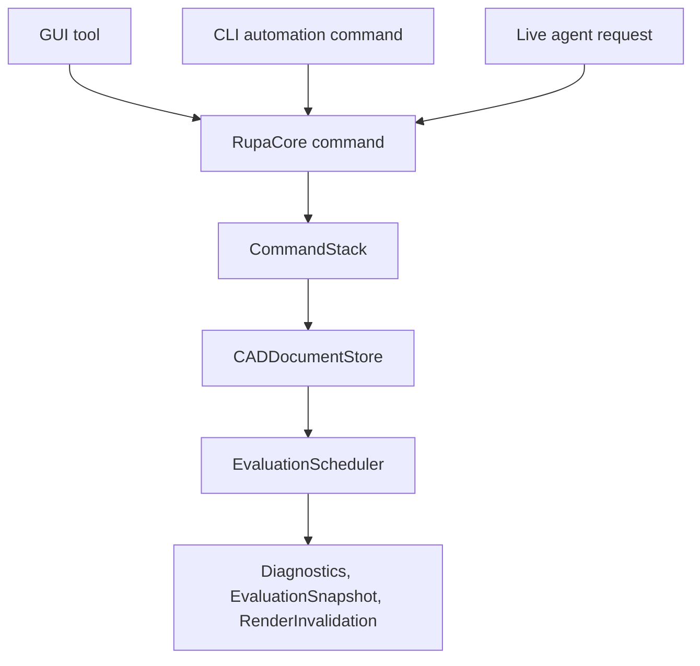
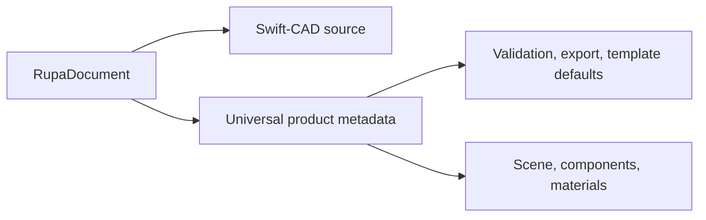
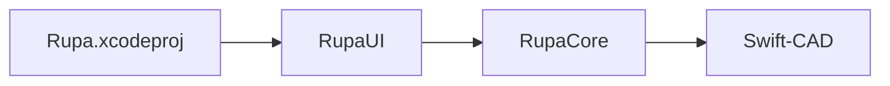
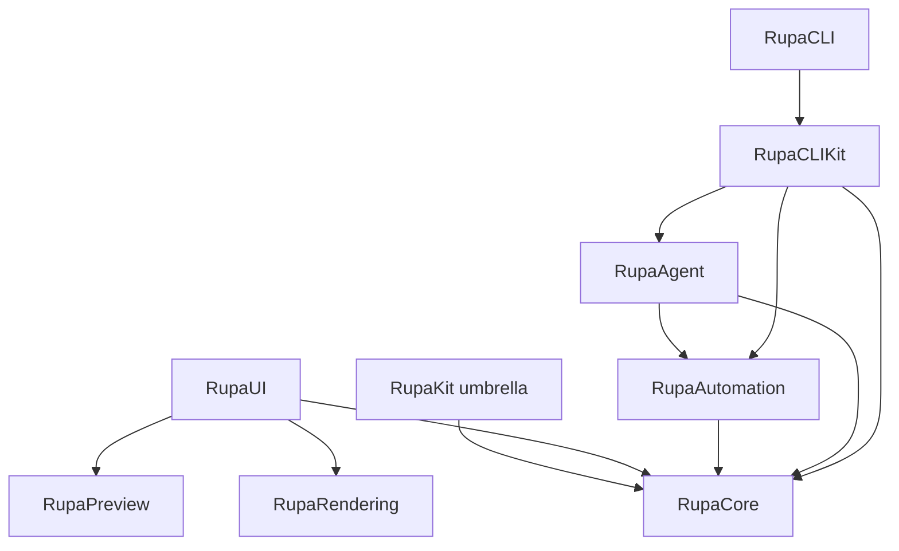
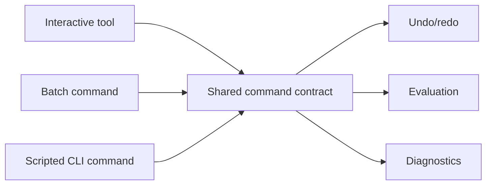
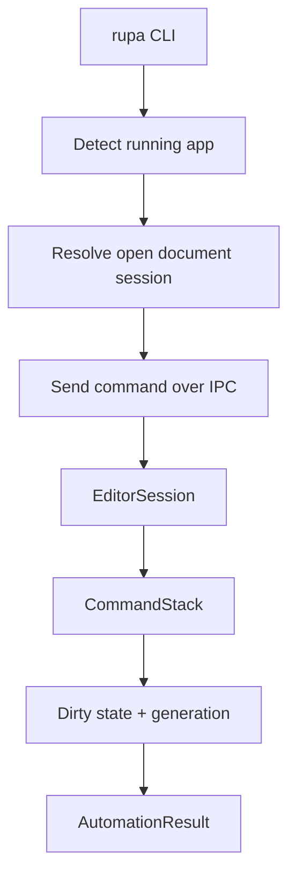
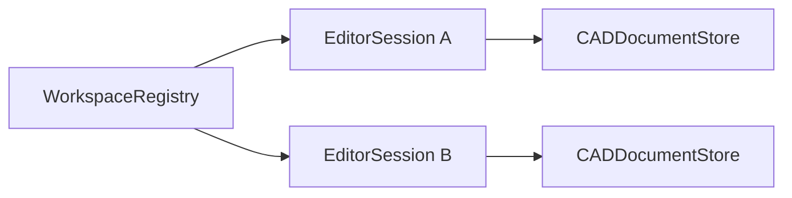
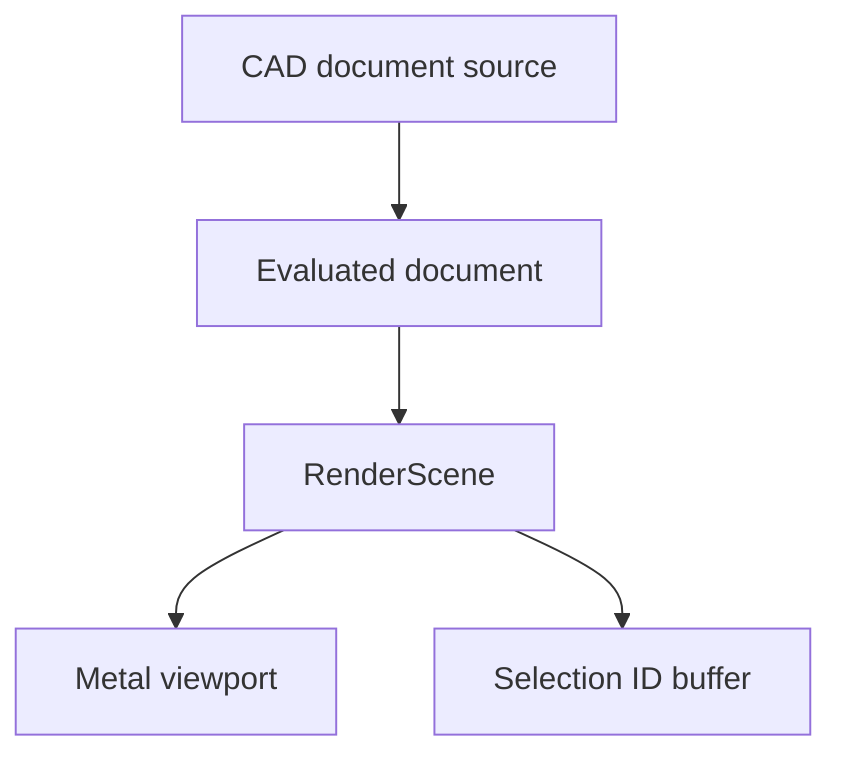
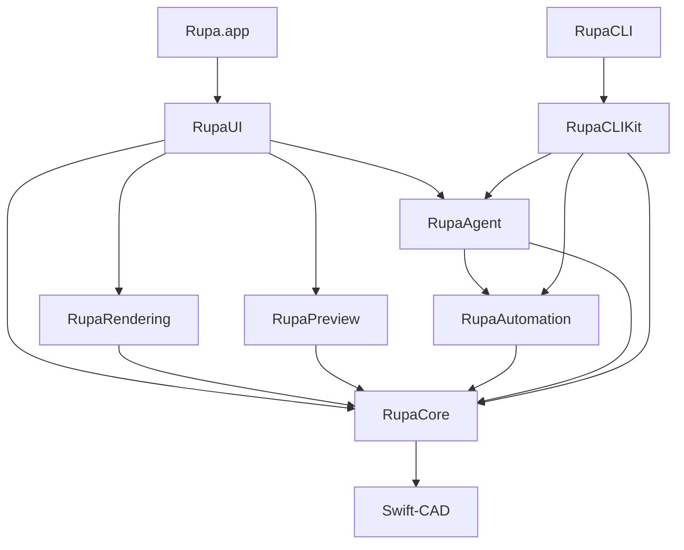

# Rupa Philosophy

## Purpose

Rupa is a native CAD application and automation surface built on top of Swift-CAD.

The project exists to make parametric CAD editable through the same core model from three entry points:

| Entry point | Responsibility |
|---|---|
| App | Provide a native editor for interactive design, inspection, preview, and export. |
| CLI | Provide deterministic headless and app-connected operations for scripts, agents, and batch workflows. |
| Agent bridge | Connect the running app and CLI safely so open documents can be changed without corrupting files or bypassing undo. |

Rupa is not a second CAD kernel. Swift-CAD remains the lower-level foundation for document source, exact geometry, evaluation, and exchange. Rupa owns the product experience, document sessions, commands, UI, rendering, automation, and process coordination.

## Core Belief

Every CAD mutation must pass through one shared command pipeline.

The source of truth is not a view, file handle, renderer buffer, command-line process, or agent message. The source of truth is the current `EditorSession` state owned by RupaCore and backed by a validated Rupa document.

| State | Role |
|---|---|
| `CADDocumentStore` | Owns the editable document source for a session. |
| `CommandStack` | Owns mutation ordering, undo, redo, and command participation. |
| `EvaluationScheduler` | Owns deterministic regeneration after source changes and publishes generation-keyed derived state. |
| `RupaProductMetadata` | Owns generic product metadata that Swift-CAD should not specialize, such as scene organization, components, materials, validation rules, export presets, and template defaults. |
| Swift-CAD `DesignGraph` | Owns source-level sketches, feature dependencies, body-producing operations, and parameter references. |
| `WorkspaceRegistry` | Owns the list of open app sessions visible to the agent layer. |
| `RenderScene` | Derived view state for interactive display. |
| Export files | Derived boundary output. |

## Architectural Principles

### 1. Keep the App Shell Thin

`Rupa/Rupa.xcodeproj` is an app host, not the application implementation.

| App host owns | RupaKit owns |
|---|---|
| App lifecycle | Editor UI |
| Entitlements | Command implementation |
| App sandbox | Document mutation |
| Window and document scenes | Rendering bridge |
| Assets, signing, provisioning | Automation, CLI, and agent IPC |

This boundary keeps the product testable as a Swift package and prevents behavior from becoming trapped inside an Xcode-only target.

### 2. Put the Product in RupaKit

RupaKit is the shared implementation package.

| Module | Product-level responsibility |
|---|---|
| `RupaCore` | Sessions, document stores, command stack, evaluation, services, diagnostics. |
| `RupaUI` | Complete SwiftUI editor surface. |
| `RupaRendering` | Metal viewport and editor render scene. |
| `RupaPreview` | RealityKit, Quick Look, and USDZ preview surfaces. |
| `RupaAutomation` | Stable command schema and batch execution contract. |
| `RupaAgent` | Running-app coordination, IPC, workspace registry, locking. |
| `RupaCLIKit` | Testable CLI command implementation, terminal UX, JSON output, exit codes. |
| `RupaCLI` | Thin `rupa` executable entry point. |

The umbrella module exists for convenient composition. Feature ownership remains in the specific modules.

### 3. Treat GUI, CLI, and Agent as Peers

The app should not receive special mutation privileges that the CLI cannot use, and the CLI should not bypass app state when a document is open.

| Surface | Contract |
|---|---|
| GUI | Convert gestures and controls into RupaCore commands. |
| CLI file mode | Load a document, apply RupaCore commands, evaluate, validate, and write atomically. |
| CLI live mode | Send automation commands to the app, where the active `EditorSession` applies them through the same stack. |
| Agent | Transport commands and results without owning CAD semantics. |

This keeps undo, diagnostics, generation tracking, and rendering aligned across every entry point.

### 4. Make Live Editing Safer Than Direct File Editing

When the app has a document open, the app owns the active session.

| Concern | Rupa policy |
|---|---|
| Unsaved app changes | Route CLI mutations to the open app session. |
| Undo and redo | Live CLI commands participate where the command declares undo support. |
| File corruption | Direct file mutation is rejected while the document is open unless explicitly forced by a supported command path. |
| Stale commands | Generation checks reject commands prepared against old document state. |
| Diagnostics | The app and CLI receive the same structured result model. |

The agent bridge is part of the product architecture, not an optional utility.

### 5. Keep IPC Boring and Typed

The first IPC contract should be local, inspectable, and easy to test.

| Layer | Decision |
|---|---|
| Transport | Unix domain socket in a per-user runtime directory. |
| Message style | JSON-RPC style request and response envelopes. |
| Command payload | `RupaAutomation` Codable types. |
| Result payload | `AutomationResult` with diagnostics and document summary. |
| Session discovery | `WorkspaceRegistry` exposed through `RupaAgentServer`. |

IPC transports may evolve later. CAD semantics stay in RupaCore and RupaAutomation so transport changes do not redefine commands.

### 6. Make Documents Observable, Not Globally Mutable

An open document is represented by an `EditorSession`. A workspace is represented by a registry of sessions.

| Object | Responsibility |
|---|---|
| `EditorSession` | Coordinates tools, selection, commands, evaluation, diagnostics, and document state. |
| `CADDocumentStore` | Owns the mutable document value and generation. |
| `WorkspaceRegistry` | Registers and resolves open sessions by document URL and session ID. |
| `DocumentLock` | Prevents unsafe file mutation and validates expected generation. |

Global mutable CAD state is avoided. Shared app state is explicit and injectable.

### 7. Rendering Is Derived State

Rendering is essential to the editor, but it does not own the model.

| Rendering data | Source status |
|---|---|
| Camera | Editor view state. |
| Grid, axes, overlays | View configuration. |
| Mesh buffers | Derived from evaluated geometry. |
| Selection ID buffer | Derived interaction aid. |
| Highlight state | Derived from selection and hover state. |

RupaRendering may cache aggressively, but caches are invalidated by explicit document generation and evaluation results.

Evaluation output is a snapshot, not source truth.

| Derived value | Policy |
|---|---|
| `EvaluationSnapshot` | Records status, diagnostics, evaluated generation, render invalidation, and generated body count. |
| `RenderInvalidation` | Tells rendering and preview surfaces when derived scene state is stale. |
| Evaluated geometry artifacts | May be cached, but must be replaceable from the document source and evaluated generation. |
| Undo history | Does not store running tasks or heavy evaluated artifacts. |

### 8. Automation Is a Stable Product Surface

Automation commands are not an internal test hook. They are the stable contract for CLI, agents, future MCP servers, and batch operations.

| Automation type | Purpose |
|---|---|
| `AutomationCommand` | One user-meaningful operation. |
| `AutomationBatch` | Ordered set of commands with shared options. |
| `AutomationResult` | Structured result for humans, scripts, and agents. |
| `ReferenceResolver` | Stable object lookup from user or agent references to document objects. |
| `AgentSchema` | Versioned schema for machine-readable operation contracts. |

Automation must preserve typed errors. A failed operation should explain what changed, what did not change, and which diagnostics are actionable.

Initial modeling automation follows the same rule: rectangle sketch creation, profile extrusion, and extruded rectangle creation update Swift-CAD source and Rupa scene metadata through one command boundary.

Export automation is derived output, not source mutation. File, live, and automatic export paths evaluate the same Rupa document source and return typed artifact metadata without advancing generation or writing undo history. Export presets are universal document metadata: they choose format, output unit, validation references, and destination policy without introducing domain-specific branches.

Evaluation and saving keep the same boundary discipline. Evaluation refreshes derived diagnostics and render invalidation without source mutation; saving persists the current source and clears live dirty state without changing generation.

Parameter formulas follow the same source-truth rule. CLI and Agent expression strings are parsed at the command boundary into Swift-CAD `CADExpression` AST values; saved documents persist the typed AST, not the transient input string.

### 9. Keep Dependencies Directional

Rupa modules should form a one-way graph.

| Rule | Reason |
|---|---|
| `RupaCore` imports Swift-CAD and not UI. | The editor core must run headlessly. |
| `RupaAutomation` imports RupaCore and not CLI. | Automation must be reusable by app, CLI, and future servers. |
| `RupaAgent` imports Automation and Core. | IPC dispatches stable commands into active sessions. |
| `RupaUI` imports Agent, Rendering, and Preview. | UI composes app-facing services and visual surfaces without owning CAD mutation semantics. |
| `RupaCLIKit` imports Agent, Automation, and Core. | The CLI command implementation chooses live or file mode and reports results. |
| `RupaCLI` imports RupaCLIKit. | The executable remains a thin shell that can be built and tested around a library boundary. |

Lower-level modules do not import higher-level product shells.

### 10. Prefer Protocol-Oriented Services

Public boundaries should be small protocols with replaceable implementations.

| Boundary | Protocol role |
|---|---|
| File service | Load, save, write atomically, coordinate file access. |
| Import/export service | Convert between Rupa documents and supported external formats. |
| Command execution | Apply typed commands to an editor session. |
| Evaluation scheduling | Queue and publish deterministic evaluation results. |
| Agent client/server | Transport requests and responses. |
| Diagnostics | Collect and expose structured errors, warnings, and notes. |

Concrete implementations belong behind these contracts so tests can exercise core behavior without launching the app or renderer.

### 11. Concurrency Must Protect Ordering

Rupa has both high-frequency UI state and ordered asynchronous work.

| State kind | Preferred tool |
|---|---|
| UI-facing session orchestration | `@MainActor` where SwiftUI requires it. |
| App-hosted agent session access | MainActor bridge before touching UI-owned editor sessions. |
| Ordered asynchronous evaluation | `actor` or an explicit scheduler. |
| Short memory-only cache access | `Mutex`. |
| Long-running import/export | `async` service methods with cancellation. |
| IPC server lifecycle | Explicit `start()` and `stop()` with typed errors. |

Command ordering, document generation, and diagnostics publication must remain deterministic.

### 12. Errors Are Part of the UX

CAD failures are normal product events.

| Error class | Required meaning |
|---|---|
| Command error | The requested operation cannot be applied. |
| Reference error | A stable object reference cannot be resolved. |
| Generation error | The document changed after the caller prepared the request. |
| Evaluation error | The document source exists but cannot regenerate successfully. |
| File coordination error | The requested file mutation is unsafe or unavailable. |
| Agent error | The app session, socket, or request dispatch failed. |
| Export error | The target format cannot represent the requested document state. |

Errors should be typed, serializable where they cross process boundaries, and surfaced through diagnostics.

## Product Discipline

Rupa development should preserve the following contracts:

| Contract | Practical test |
|---|---|
| One mutation path | A GUI operation and equivalent CLI command produce the same document generation and diagnostics. |
| Open documents are session-owned | CLI defaults to live mode when the target document is open in the app. |
| File mode is atomic | Headless edits either fully succeed or leave the input untouched. |
| Automation is stable | JSON command schemas are versioned and backward compatibility is intentional. |
| App shell stays thin | Most behavior can be tested from RupaKit without launching `Rupa.app`. |
| Rendering is derived | Rebuilding the render scene from evaluated document state yields equivalent visible geometry. |
