# Rupa Philosophy

## Purpose

Rupa is a native CAD application and automation surface built on top of Swift-CAD.

The project exists to make parametric CAD editable through the same core model from three entry points:

| Entry point | Responsibility |
|---|---|
| App | Provide a native editor for interactive design, inspection, preview, and export. |
| CLI | Provide deterministic headless and app-connected operations for scripts, agents, and batch workflows. |
| Agent bridge | Connect the running app and CLI safely so open documents can be changed without corrupting files or bypassing undo. |

Rupa is not a second CAD kernel. Swift-CAD is the lower-level kernel for an
optional authoritative CAD representation, exact CAD evaluation, and exchange.
Rupa owns the provider-neutral Product aggregate, representation authority,
Authored Mesh source, project lifecycle, commands, UI, rendering, automation, and
process coordination.

## Core Belief

Every CAD mutation must pass through one shared command pipeline.

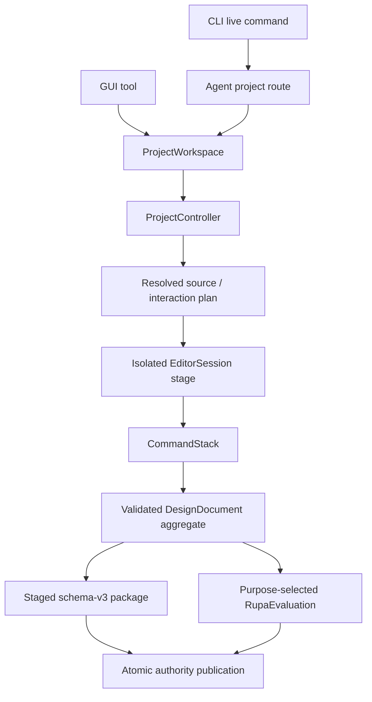
```mermaid
flowchart TD
    GUI["GUI tool"] --> Workspace["ProjectWorkspace"]
    CLI["CLI live command"] --> Agent["Agent project route"]
    Agent --> Workspace
    Workspace --> Project["ProjectController"]
    Project --> Command["Resolved source / interaction plan"]
    Command --> Stage["Isolated EditorSession stage"]
    Stage --> Stack["CommandStack"]
    Stack --> Aggregate["Validated DesignDocument aggregate"]
    Aggregate --> Package["Staged schema-v3 package"]
    Aggregate --> Evaluation["Purpose-selected RupaEvaluation"]
    Package --> Results["Atomic authority publication"]
    Evaluation --> Results
```

The source of truth is not a view, file handle, renderer buffer, command-line process, or agent message. For one open project, `ProjectController` owns the coherent Product/CAD/Authored-Mesh source aggregate, source history, package, and evaluation publication. `EditorSession` remains the isolated RupaCore staging engine used inside that boundary; it is not a parallel application authority.

| State | Role |
|---|---|
| `ProjectController` / `DesignDocument` | Own the authoritative Product aggregate, optional CAD source, Authored Mesh assets, representation selection, and atomic project publication. |
| `CADDocumentStore` | Owns the runtime CAD document inside an isolated transaction stage; an empty Mesh-only adapter does not create CAD authority. |
| `CommandStack` | Owns mutation ordering, undo, redo, and command participation. |
| Project evaluation | Resolves the selected representation for a purpose and produces immutable, representation-bound evaluation snapshots before publication. |
| `ProductMetadata` | Owns generic product metadata that Swift-CAD should not specialize, such as scene organization, components, materials, validation rules, export presets, and template defaults. |
| Swift-CAD `DesignGraph` | Owns source-level sketches, feature dependencies, body-producing operations, and parameter references. |
| `ProjectWorkspace` | Exposes one ordered application-operation and observation boundary over the project authority. |
| `ProjectWorkspaceRegistry` | Retains the same app-owned workspaces for Agent access and reconciles their current project identity. |
| `ProjectViewSnapshot.viewport` / `UniversalViewportScene` | Purpose-selected, immutable presentation state for interactive display, picking, and sectioning. |
| Export files | Derived boundary output. |

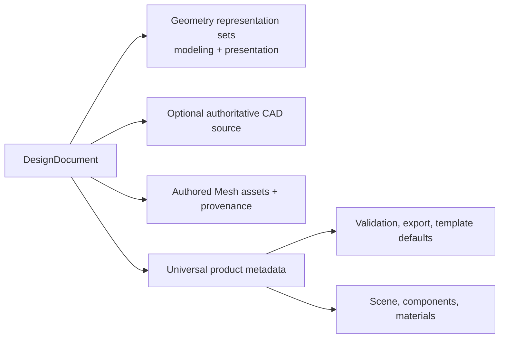
```mermaid
flowchart LR
    DesignDoc["DesignDocument"] --> Representations["Geometry representation sets<br/>modeling + presentation"]
    DesignDoc --> CAD["Optional authoritative CAD source"]
    DesignDoc --> Mesh["Authored Mesh assets + provenance"]
    DesignDoc --> Metadata["Universal product metadata"]
    Metadata --> Presets["Validation, export, template defaults"]
    Metadata --> Organization["Scene, components, materials"]
```

## Architectural Principles

### 1. Keep the App Shell Thin

`Rupa/Rupa.xcodeproj` is an app host, not the application implementation.

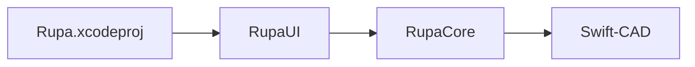
```mermaid
flowchart LR
    Xcode["Rupa.xcodeproj"] --> UI["RupaUI"]
    UI --> Core["RupaCore"]
    Core --> SwiftCAD["Swift-CAD"]
```

| App host owns | RupaKit owns |
|---|---|
| App lifecycle | Editor UI |
| Entitlements | Command implementation |
| App sandbox | Document mutation |
| Window and document scenes | Rendering bridge |
| Assets, signing, provisioning | Automation, CLI, and agent IPC |

This boundary keeps the product testable as a Swift package and prevents behavior from becoming trapped inside an Xcode-only target.

### 2. Put the Product in RupaKit

RupaKit is the shared implementation package.

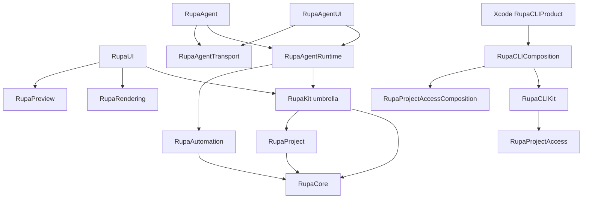
```mermaid
flowchart TD
    Umbrella["RupaKit umbrella"] --> Core["RupaCore"]
    Umbrella --> Project["RupaProject"]
    Project --> Core
    UI["RupaUI"] --> Umbrella
    UI --> Rendering["RupaRendering"]
    UI --> Preview["RupaPreview"]
    Automation["RupaAutomation"] --> Core
    AgentUI["RupaAgentUI"] --> Runtime["RupaAgentRuntime"]
    AgentUI --> Transport["RupaAgentTransport"]
    Runtime --> Umbrella
    Runtime --> Automation
    Agent["RupaAgent"] --> Runtime
    Agent --> Transport
    CLIProduct["Xcode RupaCLIProduct"] --> CLIComposition["RupaCLIComposition"]
    CLIComposition --> CLIKit["RupaCLIKit"]
    CLIComposition --> AccessComposition["RupaProjectAccessComposition"]
    CLIKit --> Access["RupaProjectAccess"]
```

| Module | Product-level responsibility |
|---|---|
| `RupaCore` | Isolated source staging, document stores, command stack, services, diagnostics. |
| `RupaProject` / `RupaKit` | Project source/package/evaluation authority and the shared application workspace boundary. |
| `RupaUI` | Complete SwiftUI editor surface. |
| `RupaRendering` | Provider-neutral viewport presentation and interaction rendering, with Metal limited to the identity-buffer backend. |
| `RupaPreview` | RealityKit, Quick Look, and USDZ preview surfaces. |
| `RupaAutomation` | Stable command schema and batch execution contract. |
| `RupaAgent` | Running-app coordination, IPC, workspace registry, locking. |
| `RupaCLIKit` | Testable CLI command implementation, terminal UX, JSON output, exit codes. |
| Xcode `RupaCLIProduct` | Sole signed product wrapper for the thin `rupa` executable. |

The umbrella module exists for convenient composition. Feature ownership remains in the specific modules.

Specialized domains are product extensions, not lower-level dependencies.
Architecture, turbomachinery, character design, manufacturing, and simulation
workflows must follow `DOMAIN_EXTENSION_ARCHITECTURE.md`: concrete domain modules
depend on the universal CAD foundation, while Swift-CAD, RupaCore, base
automation, rendering, and agent transport remain domain-neutral.

### 3. Treat GUI, CLI, and Agent as Peers

The app should not receive special mutation privileges that the CLI cannot use, and the CLI should not bypass app state when a document is open.

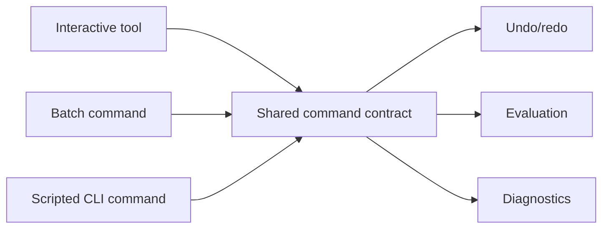
```mermaid
flowchart LR
    Tool["Interactive tool"] --> Shared["Shared command contract"]
    Batch["Batch command"] --> Shared
    Script["Scripted CLI command"] --> Shared
    Shared --> Undo["Undo/redo"]
    Shared --> Eval["Evaluation"]
    Shared --> Diag["Diagnostics"]
```

| Surface | Contract |
|---|---|
| GUI | Convert gestures and controls into RupaCore commands. |
| CLI | Send automation commands to the app, where the registered `ProjectWorkspace` plans and applies them through `ProjectController`; explicit save persists the result atomically. |
| Agent | Transport commands and results without owning CAD semantics. |

This keeps undo, diagnostics, generation tracking, and rendering aligned across every entry point.

### 4. Make Live Editing Safer Than Direct File Editing

When the app has a document open, the app owns the active session.

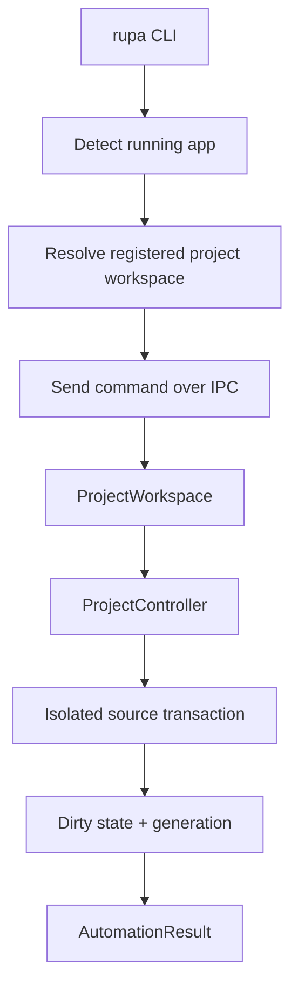
```mermaid
flowchart TD
    CLI["rupa CLI"] --> Detect["Detect running app"]
    Detect --> Resolve["Resolve registered project workspace"]
    Resolve --> IPC["Send command over IPC"]
    IPC --> Workspace["ProjectWorkspace"]
    Workspace --> Project["ProjectController"]
    Project --> Stack["Isolated source transaction"]
    Stack --> Dirty["Dirty state + generation"]
    Dirty --> Result["AutomationResult"]
```

| Concern | Rupa policy |
|---|---|
| Unsaved app changes | Route CLI mutations to the open app session. |
| Undo and redo | Live CLI commands participate where the command declares undo support. |
| File corruption | The App-owned project controller validates and saves atomically; external clients have no direct package mutation route. |
| Stale commands | Generation checks reject commands prepared against old document state. |
| Diagnostics | The app and CLI receive the same structured result model. |

The agent bridge is part of the product architecture, not an optional utility.

### 5. Keep IPC Boring and Typed

The first IPC contract should be local, inspectable, and easy to test.

| Layer | Decision |
|---|---|
| Transport | Authenticated loopback HTTP over a dynamic TCP endpoint discovered through the Team Keychain. |
| Message style | JSON-RPC style request and response envelopes. |
| Command payload | `RupaAutomation` Codable types. |
| Result payload | `AutomationResult` with diagnostics and document summary. |
| Session discovery | `ProjectWorkspaceRegistry` exposed through `ProjectAgentCommandController`; endpoint discovery is owned by App composition. |

IPC transports may evolve later. CAD semantics stay in RupaCore and RupaAutomation so transport changes do not redefine commands.

### 6. Make Projects Observable, Not Globally Mutable

An open project is represented by one `ProjectWorkspace` backed by one `ProjectController`. The Agent registry retains that same workspace; it does not construct another editor session.

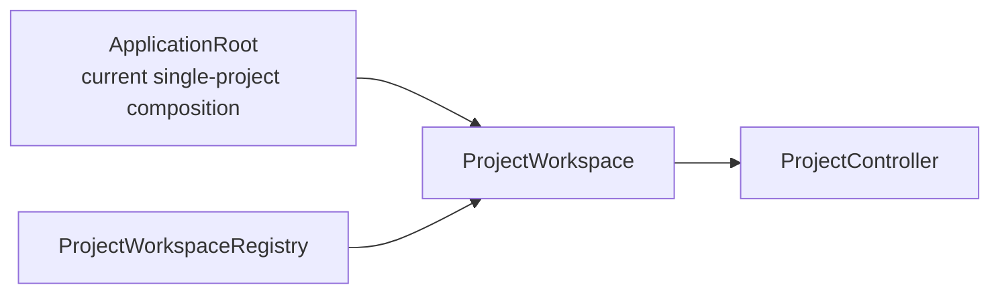
```mermaid
flowchart LR
    App["ApplicationRoot<br/>current single-project composition"] --> Workspace["ProjectWorkspace"]
    Registry["ProjectWorkspaceRegistry"] --> Workspace
    Workspace --> Project["ProjectController"]
```

| Object | Responsibility |
|---|---|
| `ProjectController` | Owns one coherent source, package, evaluation, history, and project-coordinate publication. |
| `ProjectWorkspace` | Orders application operations and publishes package-free immutable views on MainActor. |
| `EditorSession` | Stages Core commands inside a project transaction and never escapes as application authority. |
| `ProjectWorkspaceRegistry` | Registers and resolves shared workspaces by runtime session ID and file path while reconciling current project identity. |

Global mutable CAD state is avoided. Shared app state is explicit and injectable.
The current application composition owns one project workspace for the whole app
instance. A future multi-document or per-window authority model requires a
separate lifecycle design and is not implied by this contract.

### 7. Rendering Is Derived State

Rendering is essential to the editor, but it does not own the model.

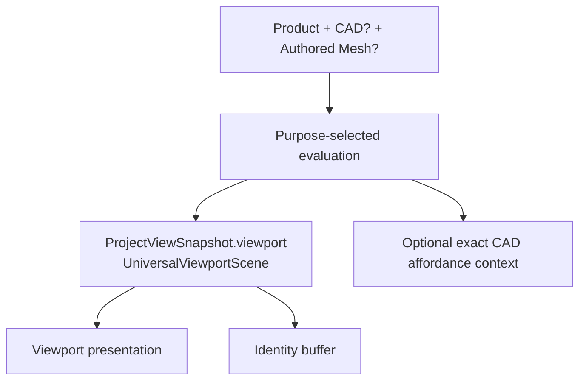
```mermaid
flowchart TD
    Sources["Product + CAD? + Authored Mesh?"] --> Evaluation["Purpose-selected evaluation"]
    Evaluation --> Scene["ProjectViewSnapshot.viewport<br/>UniversalViewportScene"]
    Scene --> Display["Viewport presentation"]
    Scene --> Selection["Identity buffer"]
    Evaluation --> CADContext["Optional exact CAD affordance context"]
```

| Rendering data | Source status |
|---|---|
| Camera | Editor view state. |
| Grid, axes, overlays | View configuration. |
| Mesh buffers | Derived from evaluated geometry. |
| Selection ID buffer | Derived interaction aid. |
| Highlight state | Derived from selection and hover state. |

RupaRendering may cache aggressively, but caches are invalidated by explicit document generation and evaluation results.

Evaluation output is a snapshot, not source truth.

| Derived value | Policy |
|---|---|
| `EvaluationSnapshot` | Records status, diagnostics, evaluated generation, render invalidation, and generated body count. |
| `RenderInvalidation` | Tells rendering and preview surfaces when derived scene state is stale. |
| Evaluated geometry artifacts | May be cached, but must be replaceable from the document source and evaluated generation. |
| Undo history | Does not store running tasks or heavy evaluated artifacts. |

### 8. Keep Geometry Representation Authority Explicit

Rupa is CAD-centered, while a Product Object may retain CAD and Authored Mesh
representations simultaneously or contain Authored Mesh without CAD. Each
representation payload owns its geometry facts, and purpose selection owns which
representation is used.

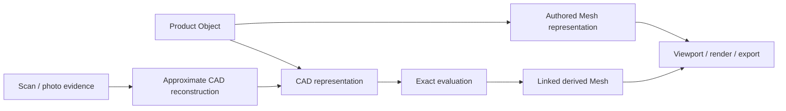
```mermaid
flowchart LR
    Object["Product Object"] --> CAD["CAD representation"]
    Object --> MeshSource["Authored Mesh representation"]
    CAD --> Exact["Exact evaluation"]
    Exact --> Mesh["Linked derived Mesh"]
    Mesh --> Render["Viewport / render / export"]
    MeshSource --> Render
    Capture["Scan / photo evidence"] --> Reconstruction["Approximate CAD reconstruction"]
    Reconstruction --> CAD
```

| Geometry state | Rule |
|---|---|
| CAD-derived Mesh snapshot | Rebuildable from CAD plus a repeatable Mesh recipe; direct persistent vertex edits are rejected. |
| Authored Mesh | Has its own source identity and provenance; it may coexist with CAD and is never silently synchronized. |
| Scan or photo reconstruction | Preserves input evidence, tolerance, deviation, and unresolved regions before explicit CAD acceptance. |
| Renderer/GPU data | Cache only; never document source. |

The complete ownership, Agent-effect, package, and zero-copy rules are defined in
`CAD_MESH_RESPONSIBILITY_CONTRACT.md`.

### 9. Treat Dimensions as Source, Not Scale

CAD dimensions are product truth. A Cube's `Size X`, `Size Y`, and `Size Z` describe the object itself; they are not a renderer convenience and they are not equivalent to scene-node scale.

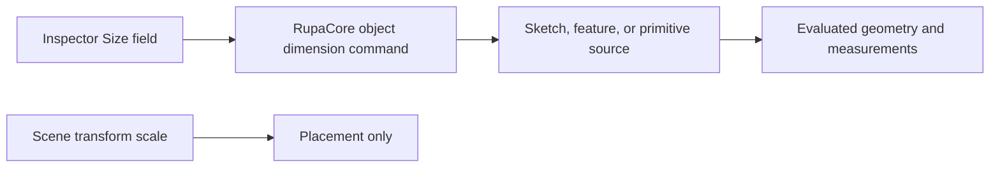
```mermaid
flowchart LR
    Inspector["Inspector Size field"] --> Command["RupaCore object dimension command"]
    Command --> Source["Sketch, feature, or primitive source"]
    Source --> Evaluation["Evaluated geometry and measurements"]
    Transform["Scene transform scale"] --> Placement["Placement only"]
```

| Property | Meaning |
|---|---|
| `Size` | Unit-aware model-space CAD dimension used by measurement, constraints, fabrication, export, and validation. |
| `Center` | The object center derived from shape extents plus placement. |
| `Transform.scale` | A placement transform for instances, groups, and visual composition. It must not replace source dimension edits. |
| Feature internals | Kernel-specific values such as sketch width, sketch height, radius, and extrude distance. They can back dimensions but should not define the user-facing Object contract. |

Object dimension commands therefore mutate the shape-defining source and then regenerate derived geometry. Rendering may preview transient edits, but persisted dimensional edits must enter RupaCore as typed commands.

### 10. Use CAD Object Semantics

Rupa treats an Object as a selectable occurrence with identity, placement, appearance, hierarchy, and a typed source descriptor. Feature IDs, sketches, bodies, and generated meshes are related layers, not interchangeable names for the same thing.

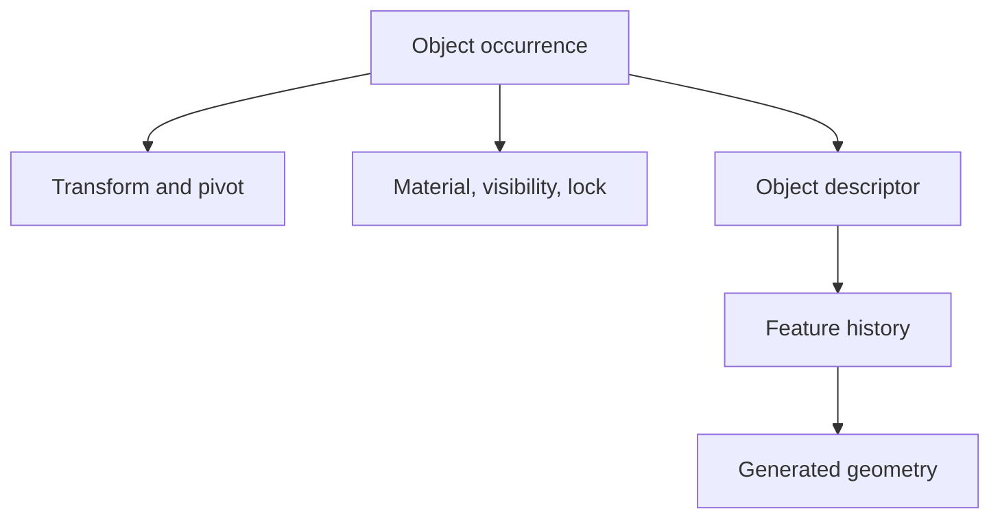
```mermaid
flowchart TD
    Object["Object occurrence"] --> Placement["Transform and pivot"]
    Object --> Appearance["Material, visibility, lock"]
    Object --> SourceDescriptor["Object descriptor"]
    SourceDescriptor --> Feature["Feature history"]
    Feature --> Geometry["Generated geometry"]
```

| Term | Product meaning |
|---|---|
| Object | The user-selectable occurrence in the scene or assembly. |
| Body | A generated or source-backed geometric region owned or referenced by an Object. |
| Feature | A parametric operation in history that can create or modify geometry. |
| Sketch | A source profile or construction object that can drive features. |
| Component | A reusable definition and/or placed instance with its own local coordinate system. |
| Subobject | Face, edge, vertex, sketch entity, or construction reference selected within an Object. |

The Inspector and Browser should therefore speak in Object terms first and source terms second. Feature IDs remain available for traceability, debugging, and advanced source editing, but they must not replace object identity in the default editing experience.

Object types are open. The product must not require a new stored enum case every time a modeling primitive, imported object, plugin object, construction helper, or domain-specific component is introduced. The stable contract is:

| Contract | Responsibility |
|---|---|
| `ObjectTypeID` | Stable identifier for the object type. |
| `ObjectType` | Protocol for code-owned object definitions. |
| `ObjectTypeDefinition` | Source representation, generated representation, Inspector, and rendering contract for a type. |
| `ObjectRepresentationKind` | Declares whether source or generated output is represented as 2D, 3D, or Text. |
| `ObjectPropertyDefinition` | One typed property plus its Inspector control and render binding. |
| `ObjectPropertySet` | Persisted values for a specific Object occurrence. |

This lets Rupa keep Inspector and renderer interfaces stable while allowing the object catalog to grow beyond the initial built-in list. A Path can have a 2D editable source and resolve to a 3D generated result through extrusion and bevel, while zero extrusion remains 2D. Renderer bindings are semantic IDs, not a closed enum, so new object definitions can extend the catalog without forcing a stored document-schema change.

### 11. Automation Is a Stable Product Surface

Automation commands are not an internal test hook. They are the stable contract for CLI, agents, future MCP servers, and batch operations.

| Automation type | Purpose |
|---|---|
| `AutomationCommand` | One user-meaningful operation. |
| `AutomationBatch` | Ordered set of commands with shared options. |
| `AutomationResult` | Structured result for humans, scripts, and agents. |
| `ReferenceResolver` | Stable object lookup from user or agent references to document objects. |
| `AgentSchema` | Versioned schema for machine-readable operation contracts. |

Automation must preserve typed errors. A failed operation should explain what changed, what did not change, and which diagnostics are actionable.

Initial modeling automation follows the same rule: rectangle sketch creation, profile extrusion, and extruded rectangle creation update Swift-CAD source and Rupa scene metadata through one command boundary.

Export automation is derived output, not source mutation. File, live, and automatic export paths evaluate the same Rupa document source and return typed artifact metadata without advancing generation or writing undo history. Export presets are universal document metadata: they choose format, output unit, validation references, and destination policy without introducing domain-specific branches.

Evaluation and saving keep the same boundary discipline. Evaluation refreshes derived diagnostics and render invalidation without source mutation; saving persists the current source and clears live dirty state without changing generation.

Parameter formulas follow the same source-truth rule. CLI and Agent expression strings are parsed at the command boundary into Swift-CAD `CADExpression` AST values; saved documents persist the typed AST, not the transient input string.

### 12. Keep Dependencies Directional

Rupa modules should form a one-way graph.

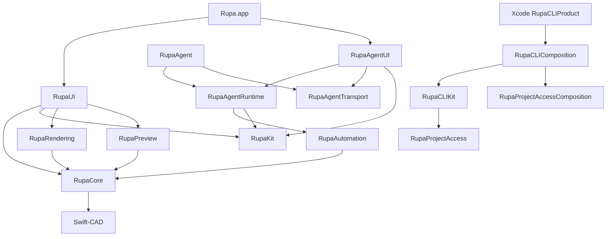
```mermaid
flowchart TD
    App["Rupa.app"] --> UI["RupaUI"]
    App --> AgentUI["RupaAgentUI"]
    UI --> Core["RupaCore"]
    UI --> Kit["RupaKit"]
    UI --> Rendering["RupaRendering"]
    UI --> Preview["RupaPreview"]
    AgentUI --> Runtime["RupaAgentRuntime"]
    AgentUI --> Transport["RupaAgentTransport"]
    AgentUI --> Kit
    Rendering --> Core
    Preview --> Core
    Automation["RupaAutomation"] --> Core
    Runtime --> Automation
    Runtime --> Kit
    Agent["RupaAgent"] --> Runtime
    Agent --> Transport
    CLIProduct["Xcode RupaCLIProduct"] --> CLIComposition["RupaCLIComposition"]
    CLIComposition --> CLIKit["RupaCLIKit"]
    CLIComposition --> AccessComposition["RupaProjectAccessComposition"]
    CLIKit --> Access["RupaProjectAccess"]
    Core --> SwiftCAD["Swift-CAD"]
```

| Rule | Reason |
|---|---|
| `RupaCore` imports Swift-CAD and not UI. | The editor core must run headlessly. |
| `RupaAutomation` imports RupaCore and not CLI. | Automation must be reusable by app, CLI, and future servers. |
| `RupaAgentRuntime` imports Kit, Automation, Core, and protocol contracts. | IPC dispatches stable commands into registered project workspaces without owning their source. |
| `RupaAgentUI` imports Agent runtime and transport. | The application-facing host owns Agent listener and workspace-registration lifecycle outside the editor UI. |
| `RupaUI` imports Kit, Rendering, and Preview but not the Agent stack. | The editor surface consumes project operations and views without owning Agent lifecycle or CAD mutation semantics. |
| `RupaCLIKit` imports Agent protocol/access and the semantic result contracts. | The CLI command implementation sends one live API request and reports results. |
| Xcode `RupaCLIProduct` links `RupaCLIComposition`. | The sole signed executable remains a thin shell around the live access composition and command library boundaries. |

Lower-level modules do not import higher-level product shells.

Concrete domain modules follow the same direction. They may be registered by the
app, CLI, or a future plugin loader, but lower-level universal targets must not
import them. When a domain semantic object generates CAD source, the ownership
and projection contract in `DOMAIN_EXTENSION_ARCHITECTURE.md` decides whether a
later edit is routed to the domain command, explicitly converted to universal CAD,
or rejected with diagnostics.

### 13. Prefer Protocol-Oriented Services

Public boundaries should be small protocols with replaceable implementations.

| Boundary | Protocol role |
|---|---|
| File service | Load, save, write atomically, coordinate file access. |
| Import/export service | Convert between Rupa documents and supported external formats. |
| Command execution | Apply typed commands to an editor session. |
| Evaluation scheduling | Queue and publish deterministic evaluation results. |
| Agent client/server | Transport requests and responses. |
| Diagnostics | Collect and expose structured errors, warnings, and notes. |

Concrete implementations belong behind these contracts so tests can exercise core behavior without launching the app or renderer.

### 14. Concurrency Must Protect Ordering

Rupa has both high-frequency UI state and ordered asynchronous work.

| State kind | Preferred tool |
|---|---|
| UI-facing session orchestration | `@MainActor` where SwiftUI requires it. |
| App-hosted Agent project access | MainActor `AgentHost` registers and unregisters the application-owned `ProjectWorkspace`; the registry resolves operation leases without exposing an editor session. |
| Ordered asynchronous evaluation | `actor` or an explicit scheduler. |
| Short memory-only cache access | `Mutex`. |
| Long-running import/export | `async` service methods with cancellation. |
| IPC server lifecycle | Explicit `start()` and `stop()` with typed errors. |

Command ordering, document generation, and diagnostics publication must remain deterministic.

### 15. Errors Are Part of the UX

CAD failures are normal product events.

| Error class | Required meaning |
|---|---|
| Command error | The requested operation cannot be applied. |
| Reference error | A stable object reference cannot be resolved. |
| Generation error | The document changed after the caller prepared the request. |
| Evaluation error | The document source exists but cannot regenerate successfully. |
| File coordination error | The requested file mutation is unsafe or unavailable. |
| Agent error | The app session, HTTP authentication, or request dispatch failed. |
| Export error | The target format cannot represent the requested document state. |

Errors should be typed, serializable where they cross process boundaries, and surfaced through diagnostics.

## Product Discipline

Rupa development should preserve the following contracts:

| Contract | Practical test |
|---|---|
| One mutation path | A GUI operation and equivalent CLI command produce the same document generation and diagnostics. |
| Open documents are session-owned | CLI resolves the App-owned live workspace through `RupaProjectAccess`. |
| Live batch is atomic | App-session batch edits either fully succeed or restore document, selection, and undo/redo state. |
| Automation is stable | JSON command schemas are versioned and backward compatibility is intentional. |
| App shell stays thin | Most behavior can be tested from RupaKit without launching `Rupa.app`. |
| Rendering is derived | Rebuilding the render scene from evaluated document state yields equivalent visible geometry. |
