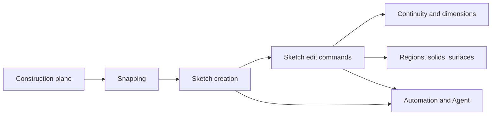

# Plasticity Sketch Reference

Checked on 2026-06-22 against the Plasticity manual:

- `https://doc.plasticity.xyz/sketch`
- `https://doc.plasticity.xyz/tool/sketching-essentials`
- `https://doc.plasticity.xyz/tool/line`
- `https://doc.plasticity.xyz/tool/spline-curve`
- `https://doc.plasticity.xyz/tool/control-point-curve`
- `https://doc.plasticity.xyz/sketch/bridge-curve`
- `https://doc.plasticity.xyz/sketch/bridge-edge`
- `https://doc.plasticity.xyz/sketch/bridge-vertex`
- `https://doc.plasticity.xyz/sketch/cut-curve`
- `https://doc.plasticity.xyz/sketch/fillet-curve`
- `https://doc.plasticity.xyz/sketch/fillet-vertex`
- `https://doc.plasticity.xyz/sketch/align-vertex`
- `https://doc.plasticity.xyz/sketch/join-curves`
- `https://doc.plasticity.xyz/sketch/unjoin-curve`
- `https://doc.plasticity.xyz/sketch/split-segment`
- `https://doc.plasticity.xyz/sketch/insert-knot`
- `https://doc.plasticity.xyz/sketch/trim`
- `https://doc.plasticity.xyz/sketch/extend`
- `https://doc.plasticity.xyz/sketch/extend-curve`
- `https://doc.plasticity.xyz/sketch/project`
- `https://doc.plasticity.xyz/sketch/project-body-body`
- `https://doc.plasticity.xyz/sketch/project-curve-curve`
- `https://doc.plasticity.xyz/sketch/project-curve-body`
- `https://doc.plasticity.xyz/sketch/project-outline`
- `https://doc.plasticity.xyz/sketch/alternative-duplicate`
- `https://doc.plasticity.xyz/sketch/duplicate-curve-and-project`
- `https://doc.plasticity.xyz/sketch/create-outline`
- `https://doc.plasticity.xyz/sketch/rebuild-curve`
- `https://doc.plasticity.xyz/sketch/reverse-curve`
- `https://doc.plasticity.xyz/sketch/convert-vertex`
- `https://doc.plasticity.xyz/sketch/toggle-curve-curvature`
- `https://doc.plasticity.xyz/sketch/toggle-points`
- `https://doc.plasticity.xyz/tool/polygon`
- `https://doc.plasticity.xyz/tool/spiral`
- `https://doc.plasticity.xyz/tool/center-point-arc`
- `https://doc.plasticity.xyz/tool/three-point-arc`

## Verified Sketch Behaviors

| Manual page | Behavior Rupa must preserve |
|---|---|
| `https://doc.plasticity.xyz/sketch` | Sketch commands are a family of selection-driven operations, not isolated toolbar shortcuts. Offset, Project, Bridge, Cut/Trim, Rebuild, and Display commands must route by target kind and keep unsupported target kinds explicit. |
| `https://doc.plasticity.xyz/tool/polygon` | Regular Polygon starts from a center point and cursor-defined size, supports direct dimension input, vertex-count changes, vertical/horizontal inclination, circumscribed/inscribed sizing, `K` Knife mode, and X/Y axis constraints. |
| `https://doc.plasticity.xyz/tool/sketching-essentials` | Knife mode cuts target Faces while drawing curves; points are expected to snap to the target Faces. Rupa therefore treats the selected generated Face as the authoritative drawing support for Polygon Knife, not the currently active construction plane. |
| `https://doc.plasticity.xyz/sketch/offset-curve` | Offset Curve dispatches from the selected object into Offset Vertex, Offset Planar Curve, Offset Region, Offset Face Loop, or Offset Edge. |
| `https://doc.plasticity.xyz/sketch/cut-curve` | Cut Curve cuts a target Curve using a cutter Curve or Face; curve cutters use generated-surface semantics and expose Extend and screen-space direction behavior. |
| `https://doc.plasticity.xyz/common/dimension` | Dimension is a selected-target command: it displays editable values, uses `Tab` to cycle multiple dimensions, and includes rectangle side lengths, circle/arc diameter, cylinder diameter, sphere diameter, cube side lengths, fillet size, and distance between solid planes. |
- `https://doc.plasticity.xyz/tool/tangent-arc`
- `https://doc.plasticity.xyz/tool/center-circle`
- `https://doc.plasticity.xyz/tool/two-point-circle`
- `https://doc.plasticity.xyz/tool/three-point-circle`
- `https://doc.plasticity.xyz/tool/tangent-circle`
- `https://doc.plasticity.xyz/tool/ellipse`
- `https://doc.plasticity.xyz/sketch/offset-curve`
- `https://doc.plasticity.xyz/sketch/offset-planar-curve`
- `https://doc.plasticity.xyz/sketch/offset-region`
- `https://doc.plasticity.xyz/sketch/offset-vertex`
- `https://doc.plasticity.xyz/sketch/slot`
- `https://doc.plasticity.xyz/sketch/slide`
- `https://doc.plasticity.xyz/sketch/slide-curve-cv`
- `https://doc.plasticity.xyz/solid/slide`
- `https://doc.plasticity.xyz/solid/slide-surface-cv`
- `https://doc.plasticity.xyz/solid/offset-face-loop`
- `https://doc.plasticity.xyz/solid/offset-edge`
- `https://doc.plasticity.xyz/solid/sweep`
- `https://doc.plasticity.xyz/solid/polyspline`
- `https://doc.plasticity.xyz/plasticity-essentials/plasticity-interface/snap`
- `https://doc.plasticity.xyz/plasticity-essentials/plasticity-interface/construction-plane`
- `https://doc.plasticity.xyz/common/dimension`

## Official Sketch Command Map

This map is the implementation backlog extracted from the official `Sketch` index. A row is not considered complete unless the source model, command contract, evaluator, selection target, viewport feedback, diagnostics, Automation, Agent, tests, and documentation all exist.

The manual pages verified for this map define dispatchers as first-class behavior: `Bridge`, `Align`, `Extend`, `Fillet`, `Join`, `Unjoin`, `Offset Curve`, `Project`, and `Rebuild` choose their concrete command from the current selection. Rupa must preserve that selection-driven dispatch contract rather than exposing isolated commands that only resemble the examples.

### Verified Manual Pages

| Manual page | Contract captured in this reference |
|---|---|
| [`Sketch`](https://doc.plasticity.xyz/sketch) | Official Sketch command categories and command-family membership. |
| [`Slide`](https://doc.plasticity.xyz/sketch/slide) | Selection-driven dispatch from curve CVs to Slide Curve CV and solid/surface CVs to Slide Surface CV. |
| [`Slide Curve CV`](https://doc.plasticity.xyz/sketch/slide-curve-cv) | Shift+G workflow, Distance option, U/Shift+U/N directions, gizmo handles, right-click/OK confirmation, Ctrl-held before/after comparison, and spline-only scope. |
| [`Slide Surface CV`](https://doc.plasticity.xyz/solid/slide-surface-cv) | Shift+G workflow, Distance option, U/Shift+U/N/V/Shift+V directions, gizmo handles, confirmation flow, and Ctrl-held before/after comparison. |
| [`Offset Curve`](https://doc.plasticity.xyz/sketch/offset-curve) | Selection-driven dispatch to Offset Vertex, Offset Planar Curve, Offset Region, Offset Face Loop, or Offset Edge. |
| [`Offset Planar Curve`](https://doc.plasticity.xyz/sketch/offset-planar-curve) | Distance, symmetric lock distance, Round/Linear/Natural gap fill, Freestyle cursor distance, Slot activation, and snapped freestyle input. |
| [`Bridge Curve`](https://doc.plasticity.xyz/sketch/bridge-curve) | Curve/edge/face endpoint snapping, Value 1/2, Sense 1/2, Tension 1/2/3, G0/G1/G2/G3 endpoint continuity, Trim, Show curvature, and axis constraints. |
| [`Align Vertex`](https://doc.plasticity.xyz/sketch/align-vertex) | Ordered target/reference alignment, parameter-space position, G0/G1/G2 continuity, CV continuity distances, curvature display, rigid polyline alignment, and overlap disambiguation. |
| [`Extend Curve`](https://doc.plasticity.xyz/sketch/extend-curve) | Endpoint extension by distance with Natural/Linear/Soft/Reflective/Arc shapes plus dependent extension to curves, sheets, or solids. |
| [`Fillet Curve`](https://doc.plasticity.xyz/sketch/fillet-curve) | Fillet/chamfer by selected curve segments, yellow-dot distance affordance, B shortcut, D fillet distance, and C chamfer distance. |
| [`Slot`](https://doc.plasticity.xyz/sketch/slot) | Open non-self-intersecting curve requirement, symmetric offset on both sides, tangent arc caps, Width option, and O twice activation from Offset Curve. |
| [`Rebuild Curve`](https://doc.plasticity.xyz/sketch/rebuild-curve) | Refit tolerance/keep-corners, Points CV count, Explicit Control degree/spans/weight, and shape-preserving rebuild intent. |
| [`Regular Polygon`](https://doc.plasticity.xyz/tool/polygon) | Center-first polygon creation, cursor sizing, vertex-count input, vertical/horizontal mode, circumscribed/inscribed toggle, knife mode, axis constraints, and last vertex-count memory. |
| [`Sketching Essentials`](https://doc.plasticity.xyz/tool/sketching-essentials) | Shared sketch behaviors: numeric dimensions, axis constraints, reference lines, and Knife mode cutting one or more target Faces while drawing a Curve. |
| [`Snap`](https://doc.plasticity.xyz/plasticity-essentials/plasticity-interface/snap) | Object snap toggles, Ctrl temporary enable, Shift+X temporary disable, CV/curve/region/edge/face/measurement snap target classes, labels, and snap tips. |
| [`Construction Plane`](https://doc.plasticity.xyz/plasticity-essentials/plasticity-interface/construction-plane) | Active CPlane creation plane, 2D snapping projection, Space/Shift+Space target-driven plane creation, Ctrl+Space view-aligned plane creation, saved plane activation, and plane naming. |
| [`Sweep`](https://doc.plasticity.xyz/solid/sweep) | Profile/path/guide selection order, region/face-to-solid and curve-to-sheet output split, twist, end scale, alignment, distance, simplify, corner type, boolean operations, keep-tools, and Ctrl angle-step snapping. |
| [`PolySplines`](https://doc.plasticity.xyz/solid/polyspline) | Mesh-to-untrimmed B-spline surface conversion, G2-continuity intent, quad-dominant mesh preference, rounded corners, patch merge, exact boundary interpolation, and current OBJ/FBX mesh source expectation. |

| Manual area | Official command families | Current Rupa status |
|---|---|---|
| Bridge and Connect | [`Bridge`](https://doc.plasticity.xyz/sketch/bridge), [`Bridge Curve`](https://doc.plasticity.xyz/sketch/bridge-curve), [`Bridge Edge`](https://doc.plasticity.xyz/sketch/bridge-edge), [`Bridge Vertex`](https://doc.plasticity.xyz/sketch/bridge-vertex). | Bridge Curve has source metadata, endpoint references, endpoint Value 1/2 parameters for supported line/arc/spline curve positions, Sense 1/2 direction flags, endpoint-specific G0/G1/G2 continuity intent, endpoint-specific Tension 1/2/3 values, generated two-span cubic Bezier source output, source-curve Trim for the current unconstrained line/arc/open-spline subset, Core/Automation/Agent paths, Inspector start/end value/sense/continuity/tension/trim controls, and curve analysis readback for the current curve subset. Official Bridge dispatch also covers two selected vertices and two selected surface edges, with endpoint side choice, G0/G1/G2/G3, Tension 1/2/3, and curvature display. G3 constraints, Bridge-specific Show curvature dialog wiring, Bridge Edge/Vertex, edge/face endpoint targets, constrained/dimensioned trim migration, and surface-boundary workflows remain explicit open work rather than implied support. |
| Cut and Trim | [`Cut Curve`](https://doc.plasticity.xyz/sketch/cut-curve), [`Trim`](https://doc.plasticity.xyz/sketch/trim), [`Split Segment`](https://doc.plasticity.xyz/sketch/split-segment). | Split Segment is implemented for source lines, source arcs, and cubic Bezier splines through Core, Inspector, Automation, and Agent. It inserts a persistent split vertex, keeps the original entity as the first segment, creates the second segment as a new source entity, migrates physical end references, and rejects generated Bridge Curve sources, closed splines, internal spline references, arc center/radius references, circular constraints/dimensions, and unsupported constraints before mutation. Trim is implemented for already bounded source line, arc, and open spline segments through the same paths: it removes the selected source segment, removes attached segment-local constraints and dimensions, marks single-segment sketch objects as source-edited, and rejects point/circle/closed-spline targets plus Bridge Curve metadata dependencies before mutation. Cut Curve is implemented for the current same-plane source line, source arc, sampled open cubic Bezier spline, or unconstrained source circle target plus source line, circle, arc, or sampled open cubic Bezier spline cutter subset through Core, Inspector, Automation, and Agent. It computes target intersections, supports the official `Extend` option for short line cutters and arc cutters by using the arc cutter's base circle, filters target/cutter arc intersections by represented arc span when not extended, reuses Split Segment for open line/arc/spline target mutation, converts a source circle target with exactly two distinct cutter intersections into two source arcs with coincident arc endpoints, samples spline targets and spline cutters for intersection discovery while preserving cubic Bezier source output through de Casteljau splits, and rejects screen-space cutting, non-line/non-arc/non-spline/non-circle targets, closed spline targets or cutters, constrained or dimensioned circle targets, non-line/circle/arc/spline cutters, different sketch planes, same-curve target/cutter pairs, parallel or endpoint-only intersections, tangent circle-target cuts with fewer than two distinct intersections, coincident circular curve intersections, and unsupported spline-cutter extension before mutation. Face cutters, generated cutter surfaces, screen-space direction, generated topology cutters, exact spline intersection, and broader viewport command-dialog workflows remain open. |
| Deform and Slide | [`Deform Curve`](https://doc.plasticity.xyz/sketch/deform-curve), [`Slide`](https://doc.plasticity.xyz/sketch/slide), [`Slide Curve CV`](https://doc.plasticity.xyz/sketch/slide-curve-cv), [`Slide Surface CV`](https://doc.plasticity.xyz/solid/slide-surface-cv). | Official `Slide` is a selection dispatcher: curve CV selections route to Slide Curve CV, solid/surface CV selections route to Slide Surface CV. Slide Curve CV is implemented for selected source spline CVs through Core, Inspector, Automation, Agent, keyboard routing, and viewport drag affordances. It owns Positive U, Negative U, and Normal directions, derives U from each original local control-cage direction, preserves the distance as `CADExpression`, rejects invalid CV indexes and collapsed directions before mutation, previews active curve/cage slides in the viewport, shows original curve/cage comparison while Ctrl is held during a drag, and closes through OK or non-dragging right click. Slide Surface CV is implemented for the current generated PolySpline patch boundary CV subset through Core, Automation, Agent, keyboard routing, workspace context controls, and viewport U+/U-/N/V+/V- slide gizmos. `slidePolySplineSurfaceVertices` resolves generated PolySpline patch vertex targets back to source mesh vertices, derives +U/-U and +V/-V from the original selected patch hull, derives Normal from U cross V, computes all deltas before mutation, rejects empty/duplicate/collapsed/unsupported targets, and validates selected patch/role stability after mutation. Viewport Surface CV slide gizmos reconstruct the same generated patch-hull directions for interaction, map arrow drags into signed distances, preview the regenerated moved PolySpline cubic patch mesh plus moved selected CV positions during drag, show the original patch mesh plus original selected CV positions while Ctrl is held, and commit through the same command path. Selected PolySpline boundary vertex drag handles now share that patch-hull local frame and expose U, V, and Normal constrained drag arrows in addition to planar and global-axis movement. Workspace `Shift+G` now routes selected curve CVs to Curve CV and generated PolySpline boundary vertices to Surface CV; Surface CV route handles `U`, `Shift+U`, `N`, `V`, and `Shift+V`. Deform Curve remains open. Broader NURBS surface CV sources, full evaluated-BRep comparison beyond the current PolySpline cubic patch mesh preview, and full modal command-dialog parity remain open. |
| Align | [`Align`](https://doc.plasticity.xyz/sketch/align), [`Align Vertex`](https://doc.plasticity.xyz/sketch/align-vertex). | Align Vertex now has a source-owned `alignSketchVertex` command for same-sketch point-backed target/reference selections through Core, Inspector, Automation, and Agent. The command preserves the ordered target/reference contract, adds persistent G0 coincidence for source point entities and supported curve endpoints, supports G1 for line-line, line-arc, arc-line, spline-line, and spline-spline endpoint combinations, supports G2 for spline-spline endpoints, and exposes the resulting continuity through curve analysis. It rejects stale generations, generated/non-point targets, different sketches, identical target/reference pairs, unsupported continuity combinations, reference-parameter requests, CV continuity distance controls, and command-scoped curvature display requests before mutation. Official Align dispatch still also routes curves to Align Vertex and edges to Align Surface; parameter-space curve position, polyline rigid alignment, overlap-disambiguation selection methods, command-dialog curvature display, CV continuity distance solving, and Align Surface remain open parity work. |
| Extend | Extend, Extend Curve. | Extend Curve is implemented for the current source endpoint + distance subset through Core, Inspector, Automation, and Agent. It requires selecting a source line endpoint, source arc endpoint, or source spline endpoint CV; carries typed `ExtendCurveShape`; extends lines in-place for Natural/Linear/Soft/Reflective as straight continuation; extends arcs in-place for Natural/Soft/Reflective/Arc as circular continuation by arc length; appends or prepends one linear cubic Bezier span to open splines for Linear; and rejects whole-curve selections, unsupported shape/entity combinations, generated Bridge Curve sources, closed splines, constrained or dimensioned changing extents, and full-circle arc overextension before mutation. The official dispatcher to Extend Sheet and dependent target matching against curves, edges, sheets, or solids remain open. |
| Fillet | Fillet, Fillet Curve, Fillet Vertex. | Source sketch corner treatment is now implemented for the connected line/arc endpoint and curve-pair subset through `applySketchCornerTreatment`: Fillet trims both source curves and inserts an exact circular `SketchArc`; Chamfer trims both source curves by path distance and inserts a straight `SketchLine`; affected distance, angle, radius, and diameter dimensions are preserved by refreshing their values from the post-treatment sketch geometry; Core, Inspector, Automation, Agent, codec, and tests share the same command. This intentionally covers the official connected-vertex / curve-segment corner slice first for line-line, line-arc, arc-line, and arc-arc source corners by resolving either a selected endpoint or two selected source curve targets into one connected corner before mutation. Yellow-dot side switching, spline, generated edge/vertex dispatcher parity, viewport drag handles, and command-dialog parity remain open. Generated solid edge fillet/chamfer remains a separate direct-editing path. |
| Join and Unjoin | [`Join`](https://doc.plasticity.xyz/sketch/join), [`Join Curves`](https://doc.plasticity.xyz/sketch/join-curves), [`Unjoin`](https://doc.plasticity.xyz/sketch/unjoin), [`Unjoin Curve`](https://doc.plasticity.xyz/sketch/unjoin-curve). | `joinSketchCurves` now implements two source-owned Join Curves branches through Core, Automation, Agent, direct CLI, and selected line/arc Inspector controls. Two distinct same-sketch source lines can still be merged destructively when exactly one endpoint pair is aligned and both lines are collinear; the target entity ID is retained, the adjacent line is removed, safe outer endpoint references migrate, and a `JoinedCurveSource` snapshot stores original geometry plus before/after constraints and dimensions. Same-sketch line-arc, arc-line, and arc-arc joins now use non-destructive `JoinedCurveGroupSource` ownership: exactly one aligned line/arc endpoint pair is required, both entities remain editable, a coincident endpoint constraint is added when absent, and before/after constraints and dimensions are snapshotted for reversible ownership. Group joins store a typed `SketchCurveJoinContinuity`; G0 records positional continuity, while G1 is supported for already-tangent line-arc or arc-line endpoint pairs by adding a persistent tangent constraint and exposing the G1 requirement through curve analysis. G2 is represented as an explicit unsupported request and rejects before mutation. `unjoinSketchCurve` restores either branch, recreating original source lines for destructive line joins or restoring only the pre-join constraints/dimensions for group joins. The Inspector shows `Join Source`, `Join Group`, and `Join Continuity`, enables Join for same-sketch line/arc multi-selection, and exposes a G0/G1 continuity picker. Spline joins, G2 solve support, curve/surface joins, downstream profile ownership rules, viewport endpoint-pair picking, full UI workflow automation, and command-dialog parity remain open. |
| Offset | Offset Curve dispatcher, Offset Planar Curve, Offset Region, Offset Vertex, Slot. | Current source-owned slices are tracked below. Unsupported target kinds must continue to fail before mutation instead of silently approximating behavior. |
| Project | [`Project`](https://doc.plasticity.xyz/sketch/project), [`Project Curve Curve`](https://doc.plasticity.xyz/sketch/project-curve-curve), [`Project Body Body`](https://doc.plasticity.xyz/sketch/project-body-body), [`Project Curve Body`](https://doc.plasticity.xyz/sketch/project-curve-body), [`Project Outline`](https://doc.plasticity.xyz/sketch/project-outline), [`Alternative Duplicate`](https://doc.plasticity.xyz/sketch/alternative-duplicate), [`Duplicate Curve and Project`](https://doc.plasticity.xyz/sketch/duplicate-curve-and-project), [`Create Outline`](https://doc.plasticity.xyz/sketch/create-outline). | `projectSketchCurvesToConstructionPlane` covers the Alternative Duplicate subset for source sketch curves and the first Duplicate Curve and Project subset for generated line/circular edges. `projectBodyOutlinesToConstructionPlane` covers the first Project Outline subset for selected generated body objects. Both create editable source curve sketches on the supplied or active construction plane through Core, Inspector, Automation, and Agent. Source lines, generated line edges, and cubic Bezier splines project exactly; source circle/arc, generated circular-edge, and body circular-outline projection require parallel source/target planes where the current sketch source model remains exact. Body outline projection deduplicates coincident projected front/back edges and drops depth edges that collapse along the projection normal. Unsupported cases reject before mutation: source points, duplicate targets, unresolved generated edges, non-body outline targets, generated edge kinds other than line/circle, collapsed single-curve projections, nonparallel circular projections, invalid target planes, invalid output sketches, and stale generations. Official Project dispatch still also covers curve-curve generated-surface intersection curves, body-body intersection curves, curve-body projection with normal/vector/bidirectional/hide-occluded/screen-space modes, broader 2D/3D outline projection, broader Duplicate Curve and Project targets, nonparallel conic projection sources, result target ownership, and command-dialog confirmation workflows. |
| Rebuild and Refine | [`Convert Vertex`](https://doc.plasticity.xyz/sketch/convert-vertex), [`Delete Redundant Topology`](https://doc.plasticity.xyz/sketch/delete-redundant-topology), [`Insert Knot`](https://doc.plasticity.xyz/sketch/insert-knot), [`Raise Curve Degree`](https://doc.plasticity.xyz/sketch/raise-curve-degree), [`Raise Degree`](https://doc.plasticity.xyz/sketch/raise-degree), [`Rebuild`](https://doc.plasticity.xyz/sketch/rebuild), [`Rebuild Curve`](https://doc.plasticity.xyz/sketch/rebuild-curve), [`Reverse Curve`](https://doc.plasticity.xyz/sketch/reverse-curve). | Line-to-arc and line-to-spline conversion, spline control-point edits, and curve analysis exist. Insert Knot / Insert CV is implemented for open cubic Bezier spline source curves through Core, Inspector, Automation, and Agent: it inserts inside a cubic span by shape-preserving de Casteljau subdivision, expands the same source entity from `3n + 1` to `3(n + 1) + 1` control points, migrates preservable later control-point references, and rejects non-spline targets, closed splines, generated Bridge Curve sources, existing-knot insertions, replaced-handle references, and unsupported smooth-boundary constraints before mutation. Rebuild Curve is implemented for the official Points, Refit, and degree-3 Explicit Control method subsets on open cubic Bezier spline source curves through Core, Inspector, Automation, and Agent: Points rebuilds the same source entity to a requested `3n + 1` CV count; Refit chooses the minimum rebuilt cubic span count that stays within the requested analytic cubic Bezier maximum-deviation tolerance and can preserve sharp internal knots when Keep Corners is enabled; Explicit Control accepts degree 3, span count, and a 0...1 weight that blends from chord-based handles toward tangent-preserving handles. These paths preserve endpoints and endpoint tangents where the selected method requires it, migrate preservable knot references, return analytic maximum and RMS deviation reports, and reject non-cubic Explicit Control degrees, closed splines, generated Bridge Curve sources, whole-spline constraints, internal references that cannot be mapped, and unsupported smooth-boundary constraints before mutation. Reverse Curve is implemented for source lines and cubic Bezier splines through Core, Inspector, Automation, and Agent. It rewrites physical endpoint references for fixed/coincident constraints, dimensions, spline endpoint constraints, and Bridge Curve metadata. Arc reverse remains explicit-error until the source model represents arc direction without turning the arc into its complement. Convert Vertex, Delete Redundant Topology, higher-degree Raise Degree, broad Rebuild dispatch, and reference-preserving degree/spans support remain open. |
| Instances | Create Instance, Create Curve Instance, Realize Instances, Realize Curve Instances. | Open for curve-instance semantics. |
| Text | Text as editable curves. | Open. Needs text source state and curve realization. |
| Display and Analysis | Toggle Curve Curvature, Toggle Points. | Selected or hovered non-linear circle, arc, and cubic Bezier spline curvature combs, curve analysis samples, and Inspector rows exist for current source-curve subsets. Persistent Toggle Curve Curvature state now stores selected source line/circle/arc/spline targets in product metadata, uses Comb Scale default `0.1`, exposes Core/Automation/Agent/Inspector paths, and lets linear source curves keep command state while rendering no comb because curvature is zero. Toggle Points now stores source line/circle/arc/spline point-display state in product metadata, normalizes selected curve point handles or spline CV targets back to the owning source curve, exposes Core/Automation/Agent/Inspector paths, and makes Viewport point-handle rendering plus point/CV hit behavior follow the same state. Surface-edge/isoparam curvature toggles, face/sheet/body CV point display, and Measurements/Outliner entries remain open. |

| Area | Manual requirement | Rupa requirement |
|---|---|---|
| Sketch essentials | Snapping must visibly confirm connected vertices, support temporary reference lines, numeric dimension input, axis constraints, and knife mode. | Shared snap resolution must feed viewport tips, creation coordinates, command previews, and Agent readback. `SketchInputState` now owns shared X/Y/Z axis constraint state, geometry-sourced temporary reference-line anchors, `SketchDimensionInputFocus` for `Tab`-cycled Length/Angle/Width/Height input focus during sketch creation, and validated dimension input values; focused Length input commits to circle, arc, and polygon radius creation, focused Angle input commits to polygon rotation and arc span, and focused Width/Height input commits to rectangle click/drag creation. `SnapResolver` snaps to reference guides from UI and Agent-readable options. Workspace readback and compact numeric fields show and edit the focused input value, and `CanvasSketchCurveDrafts` plus rectangle drag placeholders keep preview and commit paths aligned for the supported overrides. Spline entry and knife behavior remain separate command-aware milestones. |
| Regular polygon | Polygon creation starts from a center point and cursor-defined size; vertex count can change with `Shift+Scroll` or arrow keys; vertical/horizontal inclination and circumscribed/inscribed sizing are explicit modes; `K` enters Knife mode; X/Y axis constraints apply while drawing; and the command remembers the last vertex count. Sketching Essentials defines Knife mode as cutting target Faces while drawing a Curve, with points snapped to the target Faces. | `createPolygonSketch` carries center, sizing radius, `PolygonSizingMode`, `PolygonInclinationMode`, side count, and rotation through Core, Automation, Agent, and viewport preview. `PolygonToolState` now remembers side count, sizing mode, construction-plane-relative inclination, and `cutsFaces` Knife state for EditorSession creation, viewport preview, workspace polygon context controls, and `Up`/`Down`/`Shift+Scroll`/`C`/`V`/`K` workspace routing. Shared `SketchInputState` tracks X/Y/Z axis constraints plus `Tab`-cycled Length/Angle dimension input focus; focused Length input overrides polygon radius; focused Angle input overrides polygon rotation; Workspace compact numeric fields edit the focused input value; and non-Knife `ViewportModelDrag` applies construction-plane-aware global-axis projection before preview and commit. When Knife is enabled, the same polygon draft routes to `createFaceKnife`; generated-topology snap candidates preserve their world point, and selected generated planar Face interior hit points are restored from the viewport-projected Face polygon, then center/radius points are projected into that Face local coordinate system before the closed world-space loop is stored through Core, Swift-CAD evaluation, viewport rendering, Inspector, Automation, Agent, and topology summary. Current Knife support is intentionally limited to one selected generated planar line-loop face with no pre-existing inner loops, a simple in-plane straight-line polygon loop fully inside the face, selected-Face topology snap or projected interior points, and convex or concave polygon cuts. Multi-face cuts, curved cutters, generated-surface cutters, and arbitrary trimmed/curved faces remain open. |
| Cut curve | A target curve is cut by a cutter curve or face; curve cutters use generated-surface semantics, with explicit target/cutter selection, `Extend`, and screen-space direction. | `cutSketchCurve` is a typed Core/Automation/Agent command with `target`, `cutter`, and `CutCurveOptions`. The current source subset cuts same-plane source line, source arc, sampled open cubic Bezier spline, or unconstrained source circle targets with a source line, circle, arc, or sampled open cubic Bezier spline cutter, requires interior target intersections, supports `extendsCutter` for line cutters and for arc cutters by using the arc cutter's base circle, filters target/cutter arc intersections by represented arc span when not extended, delegates open line/arc/spline target mutation to `splitSketchCurve`, preserves spline source output as cubic Bezier segments after sampled intersection discovery, and converts circle targets with exactly two distinct cutter intersections into two source arcs. Screen-space direction, face cutters, generated cutter surfaces, generated topology cutters, exact spline intersection, spline-cutter extension, and full viewport command-dialog feedback remain open. |
| Extend curve | The selected endpoint of a curve can be extended by a distance with Natural, Linear, Soft, Reflective, or Arc shape options; the command can also extend to a target curve, sheet, or solid. | `extendSketchCurve` is a typed Core/Automation/Agent command with `target`, `distance`, and `shape`. The current exact subset requires an endpoint selection target from `sketchEntitySummary` point handles or spline control-point targets. Lines preserve straight direction for non-Arc shapes; arcs preserve circular radius for non-Linear shapes; open cubic Bezier splines support Linear extension by adding one cubic span. Target-dependent matching to curves, sheets, solids, and generated topology remains open. |
| Fillet curve / vertex | `Fillet Curve` applies Fillet or Chamfer between two curve segments, and `Fillet Vertex` applies the same command to connected vertices. The command uses `B`, a radius/chamfer distance, and direction-dependent Fillet vs Chamfer behavior. | `applySketchCornerTreatment` covers the first source-owned subset: either a selected source line/arc endpoint or a selected source line/arc curve pair with exactly one connected shared endpoint. It validates the connected vertex, rejects ambiguous or collapsing edits before mutation, preserves safe endpoint and line-orientation constraints, refreshes affected dimensions against the resulting line/arc/circle geometry, rewrites the two source curve endpoints, and inserts either an exact circular arc for Fillet or a straight line for Chamfer. Full Plasticity parity still needs interactive side/yellow-dot handles, spline corner treatment, generated topology routing, selected-viewport handles, and command-dialog parity. |
| Offset curve | The command dispatches by selection target: vertex, planar curve, region, face loop, or edge. | `offsetCurve` is the typed dispatcher. It routes source curves to Offset Planar Curve, source regions to Offset Region, source line/arc endpoints and supported generated body vertices to Offset Vertex, source lines/chains/arcs to Slot when Slot mode is active, generated face targets to the current Offset Face Loop feature subset, and generated edge targets to the current Offset Edge feature subset when options include a generated support face target on the same body, `EditorSession` can infer exactly one selected same-body generated support face from the active selection context, or the selected generated line edge lies on exactly one generated start/end cap face. Unsupported target kinds continue to fail before mutation instead of being approximated through source-curve offset. |
| Offset planar curve | Distance, symmetric offset, gap fill, freestyle cursor distance, snapped cursor input, and `O` Slot activation are part of the tool. Round and Linear are specified for convex corners; Natural preserves the original shape without extra vertices. | Gap-fill intent is represented now; `OffsetCurveOptions.mode == .slot` routes selected source lines, connected open source line-chains, open source arcs, connected open line/arc chains, and open cubic Bezier splines into Slot generation through `offsetCurve`; workspace context controls, Inspector line controls, and selected source-line viewport width arrows expose Slot width and creation. General spline planar offsets, joined non-Slot curve offsets, freestyle distance, exact non-self-intersection diagnostics, and broad UI workflow coverage remain required before broad UI exposure. |
| Offset region | Closed regions offset inward or outward, with individual or combined multi-region behavior. Round and Linear are specified for convex corners, while Natural preserves the original shape without adding vertices. | Closed source loops now produce Core/Agent selectable region targets through `sketchEntitySummary`; viewport sketch-region interior hit testing now returns `SelectionComponent.region` targets without stealing edge/entity hits; selected and hovered region targets render filled viewport highlights underneath sketch curves; `offsetCurve` can create one-sided or symmetric lock-distance source-owned closed regions for convex line-loop regions with Round, Linear, or Natural gap fill and for simple concave line-loop regions with Natural, Linear, or Round gap fill. Linear concave handling uses mitered concave corners and straight extra-vertex connections only at convex corners; Round concave handling rounds convex corners and miters concave corners. Selected region Inspector controls expose editable Distance, Gap Fill, and Inward/Outward actions through the same Core command; selected region viewport arrows now map signed drag distance to `offsetCurve` while preserving the current Gap Fill option. Region selections enter explicit Offset Region command mode with `O`; command state exposes distance input mode, `V` gap-fill cycling, `S` lock-distance execution, and `I` individual/combined state. `offsetRegions` now executes multi-selected region offsets as either individual source-owned output, same-plane independent disjoint combined output, or same-plane Natural/Linear polygon-union combined output in one undoable command, including simple concave outer boundaries and symmetric two-side combined output after prevalidating both sides. Same-sketch disjoint offset loops are extracted as independent regions; nested, touching, or intersecting loops remain unsupported until hole-aware or region-union extraction lands. Self-intersecting source regions, Round curved-boundary union, polygon unions with holes or multiple outer boundaries, and full UI workflow coverage remain required before Offset Region is workspace-complete. |
| Offset face loop | Selected Faces offset their outline edges by distance to create new Edges; multiple Faces can create individual or combined edge output. The command exposes Distance, Round/Linear/Natural gap fill, lock distances, and individual/combined behavior. | `offsetCurve` now routes generated Face targets into a CADIR `FaceLoopOffsetFeature`. The current kernel subset validates a single generated face target from a body feature, supports a positive inward offset on a single rectangular planar outer loop, creates a direct-edit body with the original selected face split into a ring plus a center face, emits persistent generated offset vertices/edges plus a center face for topology summaries, and reports final direct-edit solid volume, mesh-derived surface area, and bounds through Measurement without double-counting the superseded source body. It reaches viewport rendering, Inspector operation display, Automation, Agent, and Core/kernel tests. Symmetric lock-distance face loops, multi-face individual/combined output, arbitrary polygons, curved face boundaries, and non-planar loops remain open. |
| Offset edge | Selected Edges offset by distance to create new Edges, including symmetric offset and Round/Linear/Natural gap fill options. | `offsetCurve` now routes generated Edge targets into a CADIR `EdgeOffsetFeature` when the caller supplies a generated support Face target on the same body. `EditorSession` also resolves the Plasticity-style interaction slices where the selected targets contain the generated Edge plus exactly one same-body generated Face, or where a single selected generated line Edge lies on exactly one generated start/end cap Face, allowing Agent/UI flows to run `offsetCurve` without a low-level `supportTarget` payload for those proven support-face contexts. The current kernel subset supports a positive inward offset on one line edge of a rectangular planar support face, splits the support face and adjacent boundary edges to keep the BRep manifold, creates one persistent generated offset edge plus a remainder face, reports final direct-edit solid volume, mesh-derived surface area, and bounds through Measurement without double-counting the superseded source body, and exposes the output through topology summary, mesh summary, viewport rendering, Inspector operation display, Inspector selected-edge distance/gap-fill controls, workspace `O` command state, Automation, Agent, and Core/kernel tests. Symmetric output, multiple selected edges, general adjacent-face disambiguation for lone side/ambiguous edge selections, arbitrary support-face loops, curved edges, curved support faces, exact Round/Natural corner construction, and direct viewport drag affordances remain open. |
| Slot | Slot offsets an open non-self-intersecting curve symmetrically on both sides and closes each end with tangent arcs; it can be invoked directly from the command palette or through Offset Curve by pressing `O` twice. | `createSlotSketch` and `offsetCurve` Slot mode now create source-owned tangent-capped Slot profiles for selected source lines, connected open source line-chains, open source arcs, connected open line/arc chains, and open cubic Bezier splines through Core, UI workspace controls, Inspector, selected source-line viewport width arrows, Automation, and Agent. Open line/arc-chain Slot validates branch, closed-chain, full-circle arc, disconnected offset join, inner-radius collapse, and sampled self-intersection cases before mutation; open spline Slot samples the source centerline into the same validated tangent-capped profile path and records `source.kind = spline`. Supported subsets extrude through curved-profile tessellation. Exact spline-offset boundaries and exact curve self-intersection diagnostics remain unsupported. |
| Offset vertex | A selected vertex inserts new vertices along both connected curve sides by distance. | Source line and arc corner splitting is implemented for line-line, line-arc, arc-line, and arc-arc. Dimensions attached to the original split corner now migrate endpoint references to the inserted corner segments and refresh point-backed distance/angle plus circular radius/diameter values; arc-span angle dimensions also refresh across connected same-circle split arc chains. Inspector endpoint controls expose editable Vertex Offset distance, and selected line/arc endpoint viewport arrows expose distance drags; both execute the same `offsetSketchVertex` Core command path. Generated body vertex targets on normal extrudes now resolve through topology summary to connected source line/arc endpoints and use the same branch. Spline vertices, broader generated-vertex cases, broader constraint/dimension migration, and broad UI workflow coverage remain open. |
| Bridge curve | Bridge curves support endpoint snapping to curves, edges, and faces; Value 1/2 relative endpoint positions; Sense 1/2 direction reversal; G0/G1/G2/G3 continuity; Tension 1/2/3; Trim; and curvature display. | `createBridgeCurve` and `setBridgeCurveParameters` now store endpoint-specific continuity as `BridgeCurveContinuity(first:second:)` with official G-level values, endpoint Value parameters for supported line/arc/spline curve positions, Sense direction flags, source-curve Trim state, plus endpoint-specific `BridgeCurveTension` values for Tension 1/2/3. G0 can bridge arbitrary supported curve positions; source-curve Trim rewrites the current unconstrained line/arc/open-spline subset so an interior Value becomes a persistent source endpoint; supported G1 adds persistent tangent constraints for line/spline endpoints including those produced by Trim; supported G2 adds persistent smooth spline-endpoint constraints for spline endpoints; G3 is represented in the type but rejected before mutation until a higher-order bridge constraint exists. The generated source is a two-span cubic Bezier spline with `3n + 1` control points so Value selects source positions, Sense chooses the retained side for Trim and reverses endpoint tangents, and Tension 1, 2, and 3 affect the endpoint handle, pre/post-joint handle, and shared bridge joint separately. Core, Automation, Agent, codec, ProductMetadata validation, Inspector start/end value/sense/continuity/tension/trim controls, curve analysis, and the generic source-curve curvature-display command all use typed source references. Bridge-specific Show curvature dialog wiring, edge/face endpoint targets, constrained/dimensioned source-curve trim migration, viewport bridge handles, and surface-boundary targets remain open. |
| Rebuild curve | Rebuilds curves by repositioning CVs to optimize layout while preserving the original shape as closely as possible; official methods are Refit with tolerance/keep-corners, Points with a specified CV count, and Explicit Control with degree/span/weight. | `rebuildSketchCurve` implements the Points, Refit, and degree-3 Explicit Control method subsets for open cubic Bezier spline source curves. It keeps the same entity ID, produces a cubic `3n + 1` control-point layout, rewrites source expressions to resolved meter literals, migrates endpoints and preserved knot references, and is available through Inspector, Automation, and Agent. Points uses a requested CV count. Refit chooses the minimum span count within the requested analytic cubic Bezier maximum-deviation tolerance and optionally keeps sharp internal corners as interval boundaries. Explicit Control accepts degree 3, span count, and a 0...1 weight that blends from looser chord handles toward tangent-preserving handles. Core, Automation, and Agent command results now return a structured analytic cubic Bezier deviation report with source IDs, method, original/rebuilt CV and span counts, maximum deviation, RMS deviation, max-deviation parameter fraction, evaluated interval count, and critical point count. Higher-degree Explicit Control, non-cubic/NURBS sources, and viewport click/preview workflows remain open. |
| Snap | Object snapping covers CV, curve beginning/end/middle/closest/intersection/axis/center/quarter/perpendicular/tangent, region center, edge end/middle, face center, and measurement points. | `SnapResolver` now spans source sketch snaps, source profile region-center snaps, generated topology vertex/edge-end/edge-middle/face-center snaps, generated PolySpline Surface CV snaps, Measurement annotation world-point, source-sketch-reference, source-curve-parameter, generated-topology-reference, and generated-edge-parameter anchor snaps for current line and circular BRep edges, geometry-sourced temporary reference-line anchors, and construction-plane projection for source sketch, profile region, generated-topology, and measurement candidates through Core, viewport options, and Agent `resolveSnap`. Nonparallel projected circles/arcs are treated as sampled projected curves for closest-point behavior instead of being misrepresented as circles. Snap options and the Workspace input path now support Ctrl-style temporary object targeting by carrying modifier flags from `ViewportInputSurface` to `ViewportCanvasTarget`/`ViewportModelDrag` and into `SnapResolutionOptions`, and Shift+X-style temporary snap-type bypass by publishing the hovered candidate kind from `Viewport` into `WorkspaceSnapOverrideState` before suppressing that candidate kind. Source-curve X/Y/Z axis candidates now resolve against the active snap coordinate system from a reference point and report `SnapAxisReference` to Agent callers; source-curve XY/YZ/ZX coordinate-plane candidates resolve from the same reference point and report `SnapCoordinatePlaneReference`; standard-plane labels follow world axes while honoring the existing ZX canvas-axis swap. It still needs generated-edge parameter support for future non-line/non-circle curve kinds when the kernel adds them. Region targets are Core/Agent discoverable, viewport-hit-testable, and visibly highlighted for region-driven workspace tools. |
| Construction plane | Curves are created on the active plane; XY/YZ/XZ, 2D snapping, face/region aligned planes, face+edge perpendicular planes, opposing parallel face/region midplanes, point planes, view-aligned planes, saved planes, activation, and renaming are distinct behaviors. | `ConstructionPlaneSource` persists named saved planes, `ProductMetadata.activeConstructionPlaneID` stores the active plane, construction scene nodes reference saved plane IDs, `renameConstructionPlane` keeps saved-plane names and linked construction scene-node names synchronized, default sketch creation uses the active plane when no explicit plane is supplied, Workspace adaptive-plane creation uses the active saved plane before falling back, Workspace exposes a 2D construction-plane snap toggle, and Automation/Agent can create, set, rename, read, and snap against saved planes. `ConstructionPlaneTargetResolver` creates saved custom planes from generated face targets, source profile region targets, exactly one generated Face plus one generated Edge for a perpendicular plane, two or more Face/Region targets for a midplane only when the targets are parallel and separated along the shared normal, generated vertex targets, source point sketch entities, source line/arc endpoints, circle/arc centers, and source spline CV targets. Two point targets require an explicit view normal so the plane can pass through the points while staying camera-parallel; three point targets create the exact point plane; four or more point targets use a non-collinear point normal at the averaged origin. These paths are exposed through Core, Automation, and Agent `createConstructionPlaneFromTarget`/`createConstructionPlaneFromTargets`; Workspace `Space`/`Shift+Space` routes face/region, Face+Edge, midplane, generated-vertex point, and source-point selected-target sets while passing the current viewport projection normal for two-point planes; plain `Space` activates the created plane and aligns the viewport through `ViewportProjectionRequest`, while `Shift+Space` preserves the current view; Workspace `Ctrl+Space` and `Ctrl+Shift+Space` cover view-aligned creation; the Workspace Plane rail lists saved planes with activation, rename controls, double-click activation plus view alignment, and a viewfinder affordance that uses the same projection request. Still open: saved-plane selection/edit handles and broad UI workflow coverage for arbitrary planes. |
| Dimension | Dimension command modifies selected object dimensions, displays editable values, and cycles multiple values with `Tab`. | Source curve dimensions exist for lines, circles, arcs, and rectangles. `SketchDimensionSummaryService` lists editable Dimension candidates for selected source line Length/Angle, circle Diameter/Radius, and arc Diameter/Radius/Span without mutation, and `SketchDimensionTargetResolver` maps supported generated extrude cap Edge targets back to editable source sketch line or circle targets before summary/mutation. `setSketchEntityDimension` uses the resolved sketch target contract for mutation. `SketchDimensionInputFocus` gives active sketch tools a Core-owned `Tab` cycle between Length, Angle, Width, and Height input focus with Workspace compact numeric editing, validated values, focused Length commit for circle, arc, and polygon radius creation, focused Angle commit for polygon rotation and arc span, and focused Width/Height commit to rectangle click/drag creation. `ObjectDimensionSummaryService` lists editable selected-object, face, and generated extrusion-depth Edge Dimension candidates for supported rectangle-extrude bodies and circle-extrude cylinder bodies without mutation, and `setObjectDimension` uses the same source resolver to set sizeX/sizeY/sizeZ or radius/diameter/sizeY through Core, Automation, and Agent. Workspace `=` opens a focused Dimension context panel for supported source-curve, generated cap Edge, generated extrusion-depth Edge, object, or face targets; `Tab` enters input mode and cycles candidates; and `Enter`/checkmark confirms through the matching command path. Agent exposes `sketchDimensionSummary` and `objectDimensionSummary`; `sketchDimensionSummary` accepts source sketch entities and supported generated cap Edge targets, and `objectDimensionSummary` accepts generated extrusion-depth Edge targets so AI callers can read candidate dimensions before executing mutating commands. Automatic face-normal dimension inference, solid face-distance pairs, arbitrary non-extrusion generated Edge dimensions, fillet-size dimensions, spheres, broader generated edge/face Dimension parity beyond the current cap-edge/object subsets, general solver dimensions, and annotation-style dimensions remain open. |
