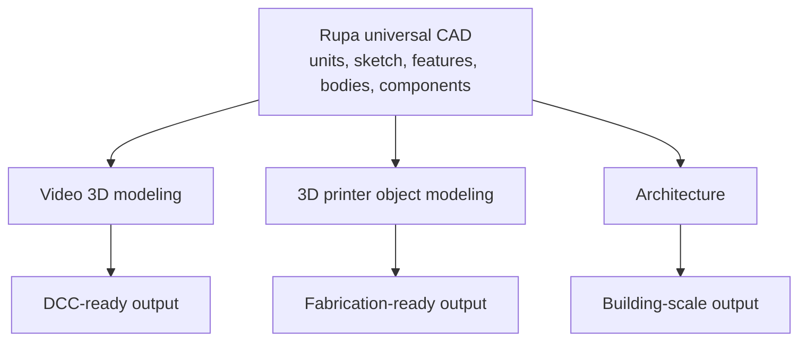
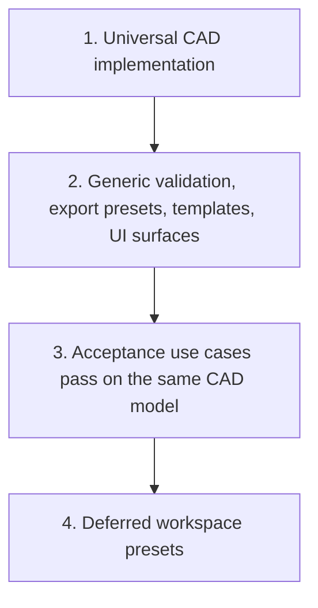
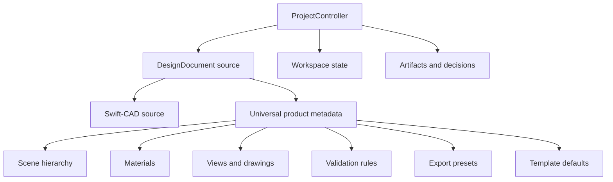
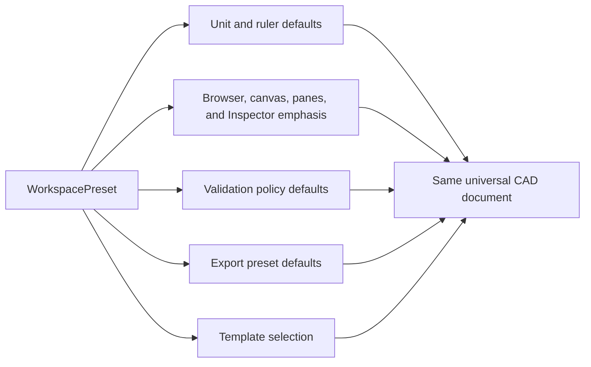
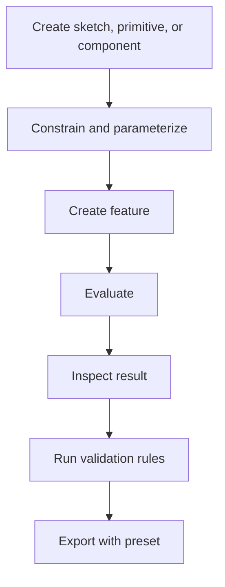

# Rupa Product Requirements

## Status

This document defines product-level requirements for Rupa as a general-purpose CAD application.

| Field | Value |
|---|---|
| Product | Rupa |
| Requirement level | Product requirements |
| Relationship to `SPEC.md` | Defines what the application must do; `SPEC.md` defines how the implementation is organized. |
| Universal CAD requirements | `UNIVERSAL_CAD_REQUIREMENTS.md` |
| Domain extension architecture | `DOMAIN_EXTENSION_ARCHITECTURE.md` |
| Domain foundation design | `DOMAIN_FOUNDATION_DESIGN.md` |
| Complete implementation plan | `COMPLETE_IMPLEMENTATION_PLAN.md` |
| Specification authority | `SPECIFICATION_AUTHORITY.md` |
| Release conformance | `CONFORMANCE_PROFILES.md` |
| Reference and artifact contract | `REFERENCE_ARTIFACT_CONTRACT.md` |
| Validation contract | `VALIDATION_CONTRACT.md` |
| Domain transaction contract | `DOMAIN_TRANSACTION_CONTRACT.md` |
| Required acceptance use cases | Video 3D modeling, 3D printer object modeling, architecture |
| Deferred convenience | Workspace preset switching after shared source and project contracts are stable |
| CAD foundation | Swift-CAD |

## Product Position

Rupa is a native, agent-ready, general-purpose CAD application for precise parametric modeling and production-oriented export.

Rupa must not branch into separate domain products. Video 3D modeling, 3D printer object modeling, and architecture are required acceptance use cases that prove the same universal CAD system works across scales, outputs, and workflows.

Rupa should not be defined as a general clone of Fusion. Fusion is the benchmark for integrated workflows, but Rupa's product thesis is:

| Benchmark expectation | Rupa product answer |
|---|---|
| Unified design environment | One document, one command pipeline, one UI model, one automation model. |
| Parametric CAD | First-class source model built on Swift-CAD. |
| Direct production output | Generic validation rules and export presets, not domain forks. |
| Automation | Stable CLI and live app automation are core product features. |
| Collaboration and cloud PDM | Later phase; local-first versioned documents are the initial requirement. |
| CAM, CAE, PCB parity | Not part of the first required scope unless explicitly added by roadmap phase. |

## Development Order

Rupa is built from universal source/project contracts and then proven through
vertical workflows. Workspace presets are deferred until commands, validation,
export policies, templates, and UI discovery work without preset-specific branches.

| Phase | Requirement |
|---|---|
| Universal-first | Implement one document model, one command pipeline, one UI model, and one automation model. |
| Profile-ready | Keep validation rules, export presets, templates, UI surface defaults, and unit defaults composable. |
| Acceptance | Prove video, 3D print, and architecture workflows using the same generic app behavior. |
| Workspace preset | Add preset switching only as a non-destructive selection of defaults and UI emphasis after the generic app is stable. |

## Required Acceptance Use Cases

| Use case | User outcome | Required success condition |
|---|---|---|
| Video 3D modeling | Create precise hard-surface props, set pieces, vehicles, devices, and architectural scenery for DCC pipelines. | Export geometry with correct scale, hierarchy, materials, normals, UVs, and pivots to DCC-ready formats. |
| 3D printer object modeling | Create dimensionally accurate printable parts, objects, jigs, cases, and assemblies. | Validate printability and export watertight manifold geometry with units and slicing-friendly metadata. |
| Architecture | Create building-scale parametric models, rooms, openings, levels, components, and drawing/export outputs. | Model architectural elements with dimensions, levels, schedules, drawing views, and interoperable BIM/CAD exports. |

These use cases define the original product acceptance set. The release-scoped
and extended expert workflow sets are defined as independently testable profiles
in `CONFORMANCE_PROFILES.md`. Profiles do not introduce separate document types,
command systems, or application modes.

Specialized workflows must follow `DOMAIN_EXTENSION_ARCHITECTURE.md`: domain modules
add semantic objects, generators, validators, simulation adapters, and Agent
capabilities above the universal CAD layers. Swift-CAD, RupaCore, and the base
automation pipeline must not import concrete domains.

Implementation order and completion gates follow
`COMPLETE_IMPLEMENTATION_PLAN.md`. A workflow is not accepted because a narrow
demo works; it is accepted only when source ownership, command routing,
evaluation, selection, UI, Automation, Agent, diagnostics, performance, and tests
are all complete for the claimed scope.

## User Needs

| User type | Needs |
|---|---|
| 3D artist / technical artist | Accurate hard-surface modeling, clean mesh export, named materials, scale-safe transfer to DCC tools. |
| Maker / product prototyper | Fast parametric parts, exact dimensions, tolerances, print validation, STL/3MF export. |
| Architect / designer | Building components, levels, rooms, dimensions, 2D drawings, IFC/DXF/PDF outputs. |
| Agent / automation user | Scriptable model edits, batch generation, live app control, deterministic JSON diagnostics. |

## Universal Product Requirements

The following capabilities are required in the universal CAD model and must be reusable in every workflow.

| Area | Requirement |
|---|---|
| Scale and units | Rulers, grids, dimensions, inputs, and display formatting must support at least micrometer (μm) detail through kilometer (km) range site work while keeping ordinary part and building edits readable in mm, cm, or m. |
| Object dimensions | Object `Size` values are first-class CAD dimensions, not renderer scale. Shape editing must preserve unit-aware `Size X/Y/Z`, centers, constraints, measurements, and export units separately from scene-node transform scale. |
| Object semantics | Browser, Canvas, Inspector, CLI, and Agent references must treat Object as the user-selectable occurrence and keep body geometry, feature source, sketch source, component instance, material, and transform as separate but linked layers. Object types must be registry/protocol-backed and property-schema driven so new object types do not require a stored enum or hard-coded Inspector layout. |
| Parameters | Named parameters, formulas, unit-aware expressions, and bulk parameter editing are required. |
| Timeline | Feature history must be inspectable, reorderable where safe, suppressible, and command-driven. |
| Sketching | 2D sketch entities, dimensions, geometric constraints, profiles, and construction geometry are required. |
| Solid modeling | Extrude, revolve, sweep, loft, boolean, shell, fillet, chamfer, draft, hole, mirror, linear pattern, circular pattern are required product capabilities. |
| Surface modeling | Planar, ruled, lofted, swept, offset, trim, stitch, thicken, and patch surfaces are required. |
| Body types | Solid, surface, mesh, curve, sketch, and construction bodies must be distinct in the document and UI. |
| Mesh conversion | Tessellation options, normals, smoothing, decimation, repair, and mesh export previews are required. |
| Components | Components, local origins, transforms, hierarchy, external references, and simple joints are required. |
| Materials | Named materials, display colors, PBR export metadata, manufacturing metadata, and per-body or per-face assignment are required. |
| Selection | Body, face, edge, vertex, sketch entity, component, material, annotation, and construction reference selection must be stable and command-addressable. |
| Validation | Validation rules must be generic, composable, typed, and available from GUI, CLI, and Agent workflows. |
| Export presets | Export settings must be saved in the document and invokable from GUI, CLI, and automation. |
| Templates | Templates may preconfigure units, UI surface defaults, materials, validation rules, and export presets, but they must create the same `.swcad` document type. |
| Deferred workspace preset | Workspace presets may eventually group templates, validation policies, export presets, UI emphasis, and unit/ruler defaults without changing document type, capability availability, command behavior, or geometry semantics. |

## Document Model Extensions

Rupa's product requirements need concepts above the Swift-CAD core, but these concepts remain universal product metadata.

| Model concept | Purpose |
|---|---|
| `DesignDocument` | Product-level document wrapper containing Swift-CAD source and Rupa metadata. |
| `SceneNode` | Hierarchical organization for bodies, components, cameras, lights, references, and semantic objects. |
| `ComponentDefinition` | Reusable parametric component source. |
| `ComponentInstance` | Transform, overrides, visibility, material bindings, and external reference. |
| `MaterialLibrary` | Named visual, physical, and export material definitions. |
| `ValidationRuleConfiguration` | Document-scoped typed configuration of a registered rule type. |
| `ValidationPolicy` | Versioned per-rule acceptance, evidence, freshness, and authorization policy. |
| `ExportPreset` | Named export target, format, unit, tessellation, metadata, and validation-policy reference. |
| `DrawingView` | 2D projection, section, dimension, annotation, and output sheet metadata. |
| `Schedule` | Tabular extraction of components, rooms, materials, quantities, or metadata. |
| `DocumentTemplateDefinition` | Versioned inputs used to create normal source and initial workspace state; it is not embedded as active template defaults in every document. |
| `WorkspacePreset` | Deferred selector that groups defaults and UI emphasis without controlling capability existence. |

## Deferred Workspace Preset Requirement

WorkspacePreset is a future convenience layer, not a core modeling, authorization,
or conformance layer.

| Rule | Requirement |
|---|---|
| Introduce late | Do not implement WorkspacePreset until generic discovery and required acceptance use cases work. |
| Non-destructive switching | Switching profiles must not rewrite geometry, feature history, component hierarchy, or command semantics. |
| Same document type | Profiles must operate on `.swcad`; no profile-specific document extension or package layout. |
| Same commands | GUI, CLI, MCP, and Agent commands remain preset-independent. Registered domain capabilities remain explicit. |
| Preset grouping only | Workspace presets group defaults and UI choices; they do not register, authorize, or remove capabilities. |
| Reversible | Switching presets does not rewrite source or lose CAD/domain data. |

## Interoperability Requirements

Rupa must treat import/export as production workflows, not secondary file utilities.

| Direction | Format | Requirement |
|---|---|---|
| Import | STEP | Required for exact CAD handoff and component reuse. |
| Import | IGES | Required for legacy CAD and surface-oriented interchange. |
| Import | STL | Required for print and mesh inspection workflows. |
| Import | OBJ | Required for simple mesh and DCC fallback workflows. |
| Import | GLB | Required for realtime asset inspection when Swift-CAD and Rupa exchange support are available. |
| Import | DXF | Required for 2D CAD input. |
| Import | IFC | Required roadmap item; initial support may be limited but must fail with typed diagnostics for unsupported entities. |
| Export | USD, USDZ, GLB, OBJ | Required for visualization and DCC workflows. |
| Export | STL, 3MF, STEP | Required for 3D printing and fabrication handoff. |
| Export | IFC, DXF, PDF, SVG | Required for building-scale, drawing, and review workflows. |

Import operations must preserve units, coordinate system assumptions, source provenance, and diagnostics. Unsupported source features must produce explicit diagnostics rather than silent data loss.

## Product Workflows

### Interactive Modeling

| Step | Requirement |
|---|---|
| Create | Commands must be available from the canvas Liquid Glass toolbar, menus, command palette, and automation where applicable. |
| Constrain | Sketch dimensions and constraints must surface overdefined, underdefined, and invalid states. |
| Feature | Feature creation must expose named parameters and stable references. |
| Evaluate | Evaluation must be cancellable and publish progress for large models. |
| Inspect | The MacComponent Inspector Pane must show contextual Object type dimensions, source and generated 2D/3D/Text representation, materials, metadata, references, and diagnostics. |
| Validate | Validation must be runnable without export. |
| Export | Export refuses unsafe output unless an authorized immutable decision record covers the exact policy, findings, source inputs, and prepared artifact. |

### Agent-Assisted Modeling

Agent-assisted workflows are product requirements, not developer-only tooling.

| Requirement | Contract |
|---|---|
| Live edits | Agents apply project use cases to an open document through the same `ProjectController` boundary as UI and CLI. |
| Batch generation | Agents can generate variations by editing parameters or command batches. |
| Validation loop | Agents can run validation rules and inspect typed diagnostics. |
| Export loop | Agents can invoke named export presets. |
| Safety | Expected transaction revision protects source mutation; dependency/content identity protects artifacts and decisions. |

## Non-Goals for Initial Product Scope

These are not required for the first complete Rupa product milestone.

| Area | Non-goal |
|---|---|
| Character sculpting | Organic sculpting, retopology suites, rigging, skinning, and character animation are outside initial scope. |
| Full CAM | Toolpath generation, machine simulation, probing, post-processors, and CNC G-code are outside initial scope. |
| Full CAE | Finite element solving, thermal simulation, injection molding simulation, and optimization solvers are outside initial scope. |
| PCB design | Schematic capture, PCB routing, SPICE, and ECAD libraries are outside initial scope. |
| Cloud PDM | Multi-user cloud storage, permissions, review links, and enterprise change orders are outside initial scope. |
| Photoreal renderer | Production path tracing is outside initial scope; material preview and export correctness are required. |
| Domain-specific app forks | Separate video, print, or architecture CAD applications are explicitly out of scope. |

## Product Acceptance Criteria

These scenarios are required by the profiles that name them. Release completion
is determined by `CONFORMANCE_PROFILES.md`, not by treating every future domain
as an implicit requirement of every release.

| Scenario | Acceptance criteria |
|---|---|
| Video prop asset | User creates a parametric hard-surface prop, assigns materials, checks normals/UVs, exports USD or GLB, and imports it into a DCC tool at correct scale. |
| 3D printed enclosure | User creates a two-part enclosure with wall thickness, holes, tolerances, and fastener features, validates printability, exports 3MF and STL, and receives no manifold errors. |
| Architectural room | User creates levels, walls, slab, openings, windows, doors, and dimensions, generates plan/elevation drawing views, exports DXF/PDF and an architectural interchange file. |
| Micrometer-to-meter editing | User can model μm-scale details and m-scale structures in the same document model with correct rulers, snapping, dimensions, tolerances, and export units. |
| Live automation | User changes a parameter from `rupa param set ... --live`; the open app updates viewport, dirty state, timeline, and diagnostics. |
| Batch variants | User runs a batch to create model variants for visualization, fabrication, or building-scale outputs; each result includes structured validation output. |
| Templates | User can create a new document from reusable templates without changing document type or command behavior. |
| Deferred preset switching | After the shared app contracts are stable, users can switch WorkspacePreset and only defaults and UI emphasis change. |
