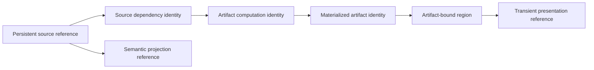

# Rupa Reference and Artifact Contract

## Purpose

This document defines identity, lifetime, and resolution rules for editable
source, generated topology, evaluated geometry, validation regions, drawings,
exchange outputs, and simulation results. It is normative for UI, CLI, Agent,
validators, exporters, project services, and domain modules.

## Identity Layers

| Layer | Lifetime | Rule |
|---|---|---|
| Persistent source | Across supported source edits | Stored logical IDs are source truth; destructive edits return typed removal or repair states. |
| Persistent topology role | Across a declared regeneration case set | Persistent topology name plus owning source context; never a raw evaluator index. |
| Source dependency | Until the logical dependency content changes | Stable logical subject plus content fingerprint. |
| Artifact computation | One exact dependency set, producer, and configuration | Reusable computation key independent of session transaction numbering. |
| Materialized artifact | One actual output content | Computation identity plus output content fingerprint and artifact kind. |
| Artifact region | One materialized artifact | References actual artifact content and typed ranges/parameters. |
| Semantic projection | One semantic entity dependency identity | Resolves through per-entity projection ownership. |
| Presentation | One viewport/layout/input snapshot | Never persisted or returned as stable automation identity. |

## Source Dependency Identity

A source dependency identity contains:

| Field | Meaning |
|---|---|
| Logical subject | Tagged document source, semantic entity, external asset, linked document, or registered input identity |
| Content fingerprint | Algorithm/version and canonical content digest |

Dependencies form a deterministic sorted set. Duplicate logical subjects,
conflicting fingerprints for one subject, missing content fingerprints, or
caller-invented current identities are invalid.

`DocumentTransactionRevision` may accompany a result as session provenance and
optimistic-concurrency information. It is not part of persistent content matching.
Two sessions with different transaction revisions may resolve the same dependency
content; two sessions with the same numeric revision may contain different source.

## Artifact Computation and Materialization

An artifact computation identity contains:

- document ID where applicable;
- complete source dependency set;
- artifact kind;
- stable producer ID and producer version;
- configuration fingerprint;
- determinism classification.

A materialized artifact reference additionally contains an output content
fingerprint. Regions bind to this materialized identity, not only to the inputs
that were expected to produce it. Deterministic producers with identical inputs
should reproduce the same output fingerprint; a mismatch is a typed producer or
integrity failure rather than a silently equivalent artifact.

Configuration fingerprints cover every non-source input that changes output,
including tolerance, tessellation, view, process definition, build frame, solver,
export options, and policy inputs. The canonical configuration remains inspectable
or resolvable; an opaque hash without a corresponding typed configuration cannot
support diagnostics or audit.

## Reference Algebra

The public reference model is a tagged union. Each case carries only valid fields.

| Reference case | Required identity |
|---|---|
| Source object | Document plus scene/object occurrence ID |
| Source feature | Document plus feature ID |
| Source sketch entity | Document plus feature/entity ID and typed component when needed |
| Generated topology | Document plus persistent name, topology kind, and owning source context |
| Semantic entity | Document plus namespace, extension ID, and semantic entity ID |
| Mesh triangle region | Materialized mesh artifact plus body IDs and compressed triangle ranges per body |
| Sampled geometry region | Materialized artifact plus typed indexes or bounded parameter-space region |
| Drawing item | Materialized drawing artifact plus sheet/view/item ID |
| Analysis field region | Materialized analysis artifact plus typed cell/sample range |

Multi-body regions preserve body-to-range mapping. They do not flatten unrelated
triangle indexes into one global list.

## Resolution Result

Resolution never guesses or collapses failure states.

| State | Meaning |
|---|---|
| Resolved | Exact logical target or artifact content exists |
| Stale | Declared dependency or configuration content changed |
| Removed | Explicit source mutation removed the target |
| Ambiguous | More than one target matches an invalid/legacy reference |
| Unsupported | No registered resolver implements this reference kind |
| Missing artifact | Source remains valid but materialized artifact content is unavailable or evicted |
| Invalid | Reference violates its own structure or integrity contract |

UI, CLI, Agent, and project services receive the same state and recovery action.
Transport error families may wrap the state but must preserve its discriminator.

## Validation Regions

A validation region is evidence, not a display hint.

| Rule | Contract |
|---|---|
| Artifact binding | Mesh and sampled regions reference exact materialized artifact content |
| Fidelity | Containing finding declares exact, conservative, sampled, or heuristic fidelity |
| Determinism | Region ordering and range compression are deterministic |
| Completeness | Finding declares complete, representative, summary-only, or unavailable evidence |
| UI | Overlays resolve through a reference service and never parse domain payload JSON |
| Agent | Structured regions are separate from human messages |
| Persistence | Findings and regions live in artifact/record storage, never editable source |

## Semantic Projection References

Ownership is assigned per semantic entity and generated source mapping.

| Source ownership | Edit route |
|---|---|
| Domain-owned | Registered domain source command |
| Universal-owned | Universal CAD source command |
| Classified | Universal source remains editable; classification is revalidated or invalidated |
| Unknown namespace | Preserve payload and reject semantic edits |
| Stale projection | Permit inspection/repair and reject unsafe mutation |

`source owner` means the one authority for editable intent. It is distinct from
storage module, mutation executor, artifact producer, and presentation renderer.

Projection freshness uses the complete dependency set of the affected semantic
entity. It includes declared semantic payload paths and the transitive closure of
referenced semantic entities, CAD feature inputs, referenced parameters, scene
subtrees and ancestors, nested component definitions and instances, construction
planes, materials, occurrence-specific topology material/process bindings, and
persistent topology owners. Unrelated edits do not stale the projection; relevant
non-geometry edits do.

Stored projection dependencies use canonical sorted encoding and
`sha256-projection-dependencies-v1`. Session transaction revision remains
provenance and is ignored for dependency-content equality.

External dependencies carry a stable logical ID and content fingerprint supplied
by an injected resolver. URI, timestamp, and file size alone are not content
identity.

## Artifact Storage and Invalidation

| Artifact size | Storage policy |
|---|---|
| Small summary | Inline with materialized artifact reference |
| Large geometry/field | Shared immutable buffer, stream, content-addressed cache, or package artifact entry |
| External output | File/artifact locator plus output fingerprint and provenance |

Source change makes a computation identity stale against current dependencies; it
does not mutate old artifact identity. Old artifacts may remain for comparison.
Cache eviction yields `missing artifact`, not `stale`.

## Performance and Copy Rules

- Source and evaluated geometry remain in owning immutable snapshots.
- References carry IDs, ranges, and fingerprints instead of copied geometry.
- Content fingerprints are computed incrementally while producing or streaming
  bytes; hashing does not require a second whole-artifact copy.
- Region construction compresses contiguous indexes during scanning.
- Large results use paging, streams, or artifact handles.
- Process-boundary copies are measured in the capability copy budget.
- Zero-copy is a verified path property with an explicit lifetime, not a blanket
  product claim.

## Required Tests

| Test family | Required cases |
|---|---|
| Structural | Every tagged reference and dependency subject round-trips and rejects invalid combinations |
| Session/content | Different session revisions with identical content remain reusable; equal numeric revisions with different content do not |
| Artifact | Dependency, producer, configuration, and output-content changes remain distinguishable |
| Mesh regions | One- and multi-body ranges resolve only against exact artifact content |
| Topology | Supported edits preserve persistent names; destructive edits return removed/repair states |
| Unknown domain | Semantic references remain preserved and non-editable without the module |
| Presentation | GPU/CPU hits normalize to persistent references and are never persisted directly |
| Performance | Dense regions remain compact and geometry buffers are not copied for reference creation |
