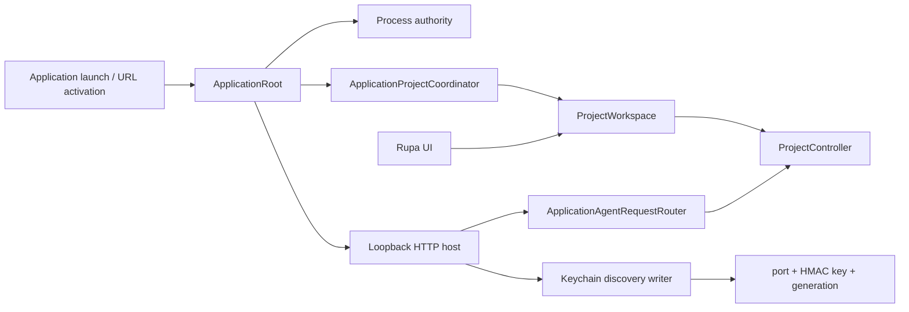
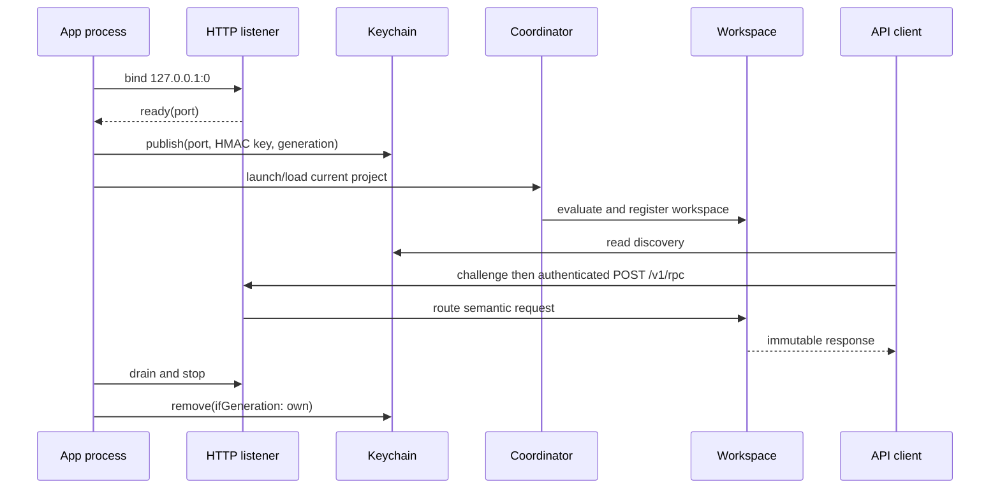

# Rupa App

## Purpose and Scope

The Rupa App component owns the macOS process lifecycle, file activation,
window composition, and the single live API host. It is a child of the
[Rupa application package](../../DESIGN.md). Children: none.

## Responsibilities and Boundaries

The component owns one App process authority, one `ProjectWorkspace`, one
`ProjectController` path, one HTTP listener, one discovery generation, and
the UI projection of the published workspace. It does not own semantic CAD or
Mesh definitions, HTTP parsing, CLI syntax, Keychain implementation, or a
second project writer.

## Related Designs

| Design | Relationship | Contract Used | Summary | Cautions |
|---|---|---|---|---|
| [application package](../../DESIGN.md) | parent | product composition | Defines the executable boundary. | Keep process state here. |
| [RupaProjectAccess](../../../RupaKit/Sources/RupaProjectAccess/DESIGN.md) | coordinates with | live target/session/save API | External clients reach this App through the API. | Access is an adapter only. |
| [RupaAgentTransport](../../../RupaKit/Sources/RupaAgentTransport/DESIGN.md) | depends on | loopback HTTP listener | Carries authenticated semantic requests. | The listener never owns project state. |
| [RupaProjectAccessPlatform](../../../RupaKit/Sources/RupaProjectAccessPlatform/DESIGN.md) | depends on | discovery-record writer | Publishes port, HMAC key, and generation after readiness. | Only this App writes the record. |
| [RupaAgentRuntime](../../../RupaKit/Sources/RupaAgentRuntime/DESIGN.md) | uses | registered-workspace semantic dispatch | Executes requests against the App workspace. | Runtime does not open projects. |
| [Rupa UI](../../../RupaKit/Sources/RupaUI/DESIGN.md) | uses | immutable project view | Shows the same publication as API reads. | UI is not an authority. |
| [Rupa CLI Product](../RupaCLI/DESIGN.md) | coordinates with | Keychain reader and API session | Reads discovery and sends API requests. | CLI never writes discovery. |

## Architecture

## Contracts and Invariants

1. The App-owned workspace/controller is the sole live mutation, evaluation,
   publication, and save authority.
2. The HTTP host starts for the process lifetime independently of window or
   scene restoration. It publishes discovery only after listener readiness.
3. Discovery contains no project bytes. Shutdown drains the host and removes
   only the exact generation published by this process.
4. Every semantic request is routed to the registered App workspace. Only an
   explicit save request reaches the coordinator save port.
5. A successful mutation changes memory and the published view; package bytes
   remain unchanged until explicit save succeeds.
6. Launch, load, dirty replacement, stale coordinates, deadline, cancellation,
   semantic, and save failures are typed and preserve the last published
   state. No request is redirected to a local controller.
7. The App is sandboxed with the network-server capability and the Team
   Keychain access group. Project files remain under the App's normal
   security-scoped document flow.
8. Product composition configures the listener with the same 120-second
   request budget as the signed CLI. The bound covers semantic execution,
   atomic package save, and authenticated response delivery; cancellation and
   typed failures may terminate earlier.

## Runtime Flows

## State, Ownership, and Lifecycle

`ApplicationRoot` owns process composition. `ApplicationProjectCoordinator`
owns current URL and application lifecycle. `ProjectWorkspace` and
`ProjectController` own project state and publication. `AgentHost` owns the
listener lifetime. The discovery writer owns only the current record and is
never used as project storage.

## Failure, Concurrency, and Constraints

The coordinator serializes lifecycle operations and the workspace preserves
its transaction guards. The host enforces 16-MiB bodies, 32 connections,
bounded headers, one same-connection challenge/RPC exchange, and a monotonic
deadline. Production uses the product-owned 120-second request budget. A
complete request with a lost response is outcome-unknown and is not replayed.

## Verification and Change Impact

App tests prove process-lifetime host startup, discovery publication and
conditional removal, session routing, mutation/readback, explicit save,
restart recovery, rollback, cancellation, and no fallback. Project-default
Xcode validation must inspect sandbox, network-server, and Keychain
entitlements and exercise the actual CLI against the same App workspace.
