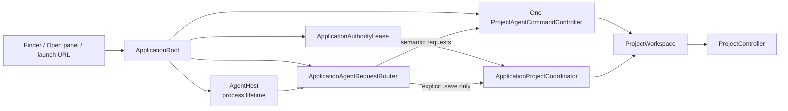
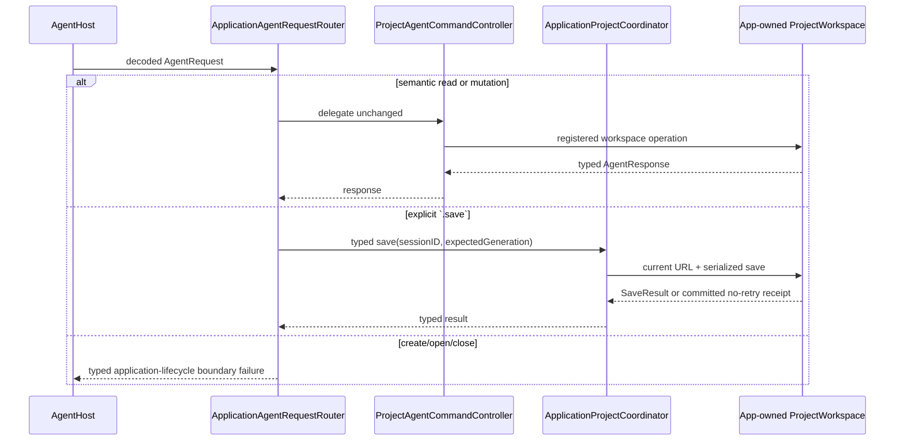

# Rupa App

## Purpose and Scope

The Rupa App component owns the macOS executable lifecycle, file activation,
and UI composition. It is a child of the
[Rupa application package](../../DESIGN.md) and has no child designs.

## Responsibilities and Boundaries

The component owns a process-lifetime application-authority lease, application
startup, window/project coordination, one App-owned `ProjectWorkspace`, one
current project URL/security-scoped lifetime, UI publication, and internal
Agent-host composition. It does not own CAD/Mesh semantics, socket framing,
CLI parsing, package-entry mutation outside `ProjectController`, file
migration, or save-as policy expansion.

## Related Designs

| Design | Relationship | Contract Used | Summary | Cautions |
|---|---|---|---|---|
| [application package](../../DESIGN.md) | parent | product composition | Defines the executable boundary. | Keep lifecycle state in the App. |
| [project access](../../../RupaKit/Sources/RupaProjectAccess/DESIGN.md) | used by future composition | live target/session/save contract | Exposes typed intent to the App-owned workspace. | Transport is an adapter only. |
| [Agent host](../../../RupaKit/Sources/RupaAgentUI/DESIGN.md) | used by | process-lifetime listener and injected request-handler contract | Provides the transport host while the App composes the controller and router. | Host must not create a second workspace or own package persistence. |
| [Agent runtime](../../../RupaKit/Sources/RupaAgentRuntime/DESIGN.md) | used by | registered-workspace semantic dispatch | Supplies the single `ProjectAgentCommandController` for non-lifecycle requests. | Runtime cannot open, close, or save a file. |
| [Agent transport](../../../RupaKit/Sources/RupaAgentTransport/DESIGN.md) | depends on | injected endpoint and request handling | Carries live requests. | Endpoint is not semantic status. |
| [Rupa UI](../../../RupaKit/Sources/RupaUI/DESIGN.md) | depends on | snapshot-owned visible project title | Displays the exact workspace publication. | CAD metadata and file names are not title authority. |

## Architecture



## Contracts and Invariants

1. UI and Agent requests address the same registered workspace/controller.
2. Semantic status contains no endpoint path.
3. The Agent host is an application-process resource. Active, inactive, and
   background scene phases do not stop it; only application shutdown drains
   accepted requests and releases the host.
4. Save is explicit and targets only the App's current project URL.
5. The authority lease is acquired before `ProjectWorkspace`,
   `ProjectAgentCommandController`, `ApplicationAgentRequestRouter`, or
   `AgentHost` creation and is retained until process termination.
6. One application-composed `ProjectAgentCommandController` registers the
   exact workspace used by UI and coordinator. The router delegates every
   non-lifecycle request to it and sends only explicit Agent `.save` through a
   typed coordinator lifecycle port.
7. The built App exports exactly one `.rupa` document type. The Open panel
   accepts that type only; `.swcad` is neither associated nor migrated.
8. Every accepted URL reaches `ApplicationProjectCoordinator`, which delegates
   to `ProjectWorkspace.load` and `ProjectController`.
9. `ProjectViewSnapshot.projectName` is the visible navigation/window title
   authority.

## Runtime Flows

```mermaid
sequenceDiagram
    participant O as Finder/Open panel/launch
    participant A as ApplicationRoot
    participant L as Authority lease
    participant C as ApplicationProjectCoordinator
    participant W as ProjectWorkspace
    participant P as ProjectController

    O->>A: schema-v3 .rupa URL
    A->>L: acquire or resolve process-lifetime lease
    alt stopped App: lease acquired
        A->>C: deliver initial URL
    else running App: existing lease
        A->>C: deliver activation to existing coordinator
    else duplicate process: lease unavailable
        L-->>A: typed duplicate-process failure
        A-->>O: visible failure; no workspace/host/load
    end
    C->>C: validate format and dirty policy
    alt clean and valid
        C->>W: load URL
        W->>P: stage, validate, evaluate, publish
        P-->>W: immutable project state
        W-->>C: nonempty ProjectViewSnapshot
        C-->>A: retain current URL and workspace registration after publication
        A-->>O: snapshot.projectName title + visible view
    else dirty or invalid
        C-->>O: requested-file typed failure
        Note over C,W: prior URL, coordinates, viewport, title, and registration remain
    end
```

When the App is stopped, LaunchServices starts it and URL delivery is retained
until the one workspace is ready. When it is running, the URL is delivered to
the existing coordinator. Dirty or unsupported input produces a visible
requested-file failure without changing the prior publication. The authority
lease is acquired from the App Group coordination directory before the
workspace/controller/router/host composition; the directory contains no
project payload.

Agent requests use the same composition:



The router never edits package entries or calls a second controller. A save
uses destination-appropriate package staging and complete prepublication
validation before one atomic replacement. Prepublication cleanup must succeed
or return a typed failure without changing the destination; failure to remove
the now-empty staging directory after replacement is represented in the
successful result as a typed warning and never converted into a retryable save
failure.

## State, Ownership, and Lifecycle

MainActor owns UI, current URL, coordinator, one controller/router composition,
registry binding, and host composition. The process owns the application-
authority lease and `AgentHost` in the App Group coordination directory from
startup until termination. A candidate security-scoped URL is retained only
after the corresponding load has published a valid view; a failed request does
not rebind it. `ProjectController` owns source state and publication. A
transport connection owns no document lifetime and scene visibility does not
stop the host.

## Failure, Concurrency, and Constraints

Unavailable App Group coordination, a duplicate process, unsupported format,
dirty replacement, invalid package, unavailable endpoint/session, stale
coordinates, uncertain dispatch, and prepublication save errors are surfaced
without discard, closed-file fallback, migration, or retry. Prepublication
failure preserves project ID, generation, revision, publication sequence,
document lifetime, viewport, title, current URL, destination bytes, and Agent
registration. If package replacement and the controller's clean-state
publication have committed but workspace save-result view projection fails,
the Agent receives `ApplicationAgentSaveOutcome.committed` carrying an
`AgentCommittedMutationOutcome` with `Mutation.save`, `Stage.viewProjection`,
the committed state's exact coordinates, and `mustNotRetry`; the route does not
imply a replay is safe. UI state stays MainActor-isolated.

## Verification and Change Impact

ACCESS-O tests lease exclusion and cleanup, `.rupa` metadata/Open-panel
restriction, stopped/running URL delivery, title authority, nonempty viewport,
same-workspace Agent registration/router delegation, explicit Agent save through
the coordinator port, process-lifetime host behavior, and exact failure
preservation. Its actual signed-App proof uses project signing/build locations
without command-line signing, team, or DerivedData overrides. ACCESS-O.5 owns
destination-appropriate package staging and ACCESS-O.6 owns the source
composition; ACCESS-O.7/ACCESS-IV own cumulative signed App/CLI proof.
