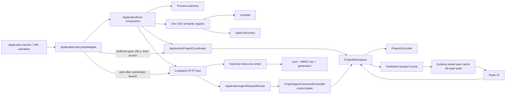
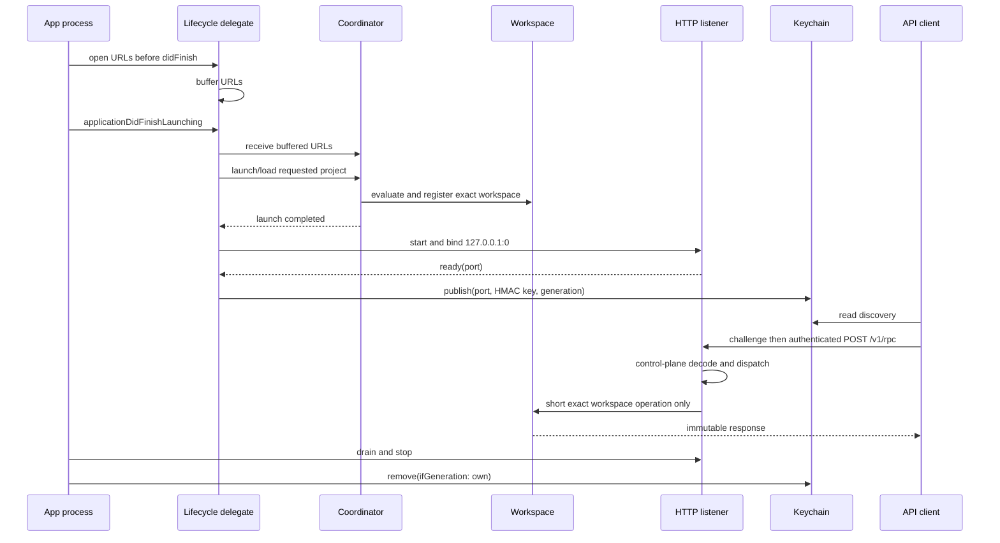

# Rupa App

## Purpose and Scope

The Rupa App component owns the macOS process lifecycle, file activation,
window composition, and the single live API host. It is a child of the
[Rupa application package](../../DESIGN.md). Children: none.

## Responsibilities and Boundaries

The component owns one App process authority, one `ProjectWorkspace`, one
`ProjectController` path, one HTTP listener, one discovery generation, the
single composition of the twelve-operation CAD semantic registry/compiler,
and the UI projection of the published workspace. It composes, but does not
own, one bounded derived render-plan cache. It does not own semantic CAD or Mesh
definitions, tessellation, render data, HTTP parsing, CLI syntax, Keychain
implementation, or a second project writer.

## Related Designs

| Design | Relationship | Contract Used | Summary | Cautions |
|---|---|---|---|---|
| [application package](../../DESIGN.md) | parent | product composition | Defines the executable boundary. | Keep process state here. |
| [RupaProjectAccess](../../../RupaKit/Sources/RupaProjectAccess/DESIGN.md) | coordinates with | live target/session/save API | External clients reach this App through the API. | Access is an adapter only. |
| [RupaAgentTransport](../../../RupaKit/Sources/RupaAgentTransport/DESIGN.md) | depends on | loopback HTTP listener | Carries authenticated semantic requests. | The listener never owns project state. |
| [RupaProjectAccessPlatform](../../../RupaKit/Sources/RupaProjectAccessPlatform/DESIGN.md) | depends on | discovery-record writer | Publishes port, HMAC key, and generation after readiness. | Only this App writes the record. |
| [RupaAgentRuntime](../../../RupaKit/Sources/RupaAgentRuntime/DESIGN.md) | uses | registered-workspace semantic dispatch | Executes requests against the App workspace. | Runtime does not open projects. |
| [Rupa UI](../../../RupaKit/Sources/RupaUI/DESIGN.md) | uses | immutable project view | Shows the same publication as API reads. | UI is not an authority. |
| [RupaRendering](../../../RupaKit/Sources/RupaRendering/DESIGN.md) | uses | cancellable snapshot-matched derived plan | Prepares bounded render data outside MainActor. | Plan failure never changes project publication. |
| [Rupa CLI Product](../RupaCLI/DESIGN.md) | coordinates with | Keychain reader and API session | Reads discovery and sends API requests. | CLI never writes discovery. |

## Architecture

## Contracts and Invariants

1. The App-owned workspace/controller is the sole live mutation, evaluation,
   publication, and save authority.
2. `ApplicationLifecycleDelegate` is the single launch and file-activation
   ordering owner. It buffers macOS open URLs received before
   `applicationDidFinishLaunching`, delivers them to the coordinator before
   calling `launch()`, and starts the HTTP host only after coordinator launch
   completes. SwiftUI scene appearance does not start either lifecycle.
3. Discovery contains no project bytes. Shutdown drains the host and removes
   only the exact generation published by this process.
4. Every semantic request is routed to the registered App workspace. Only an
   explicit save request reaches the coordinator save port.
5. A successful mutation changes memory and the published view; package bytes
   remain unchanged until explicit save succeeds.
6. Launch, load, dirty replacement, stale coordinates, deadline, cancellation,
   semantic, and save failures are typed and preserve the last published
   state. No request is redirected to a local controller.
7. The App is sandboxed with the network-server capability and the Team
   Keychain access group. Project files remain under the App's normal
   security-scoped document flow.
8. Product composition configures the listener with the same 120-second
   request budget as the signed CLI. The bound covers semantic execution,
   atomic package save, and authenticated response delivery; cancellation and
   typed failures may terminate earlier.
9. Application composition creates `RupaCADDomain.registry()` and one
   `DefaultSemanticProgramCompiler` before starting Agent authority, injects it
   into `ProjectAgentCommandController`, and fails App Agent startup if that
   composition fails. Discovery is projected from the compiler's exact registry
   and must contain the complete twelve-operation CAD set; it never substitutes
   an empty or independently composed semantic registry.
10. Cold file activation loads and registers the requested project before
    discovery publication. The first externally observable session therefore
    carries the loaded canonical path and its exact publication sequence; an
    empty-project session is never published as a startup intermediate.
11. Reopening the current canonical project URL is an idempotent lifecycle
    notification. The coordinator rejects it before reserving a load operation,
    so a concurrent API save does not observe a false busy state. The execution
    boundary repeats the same check because current project identity may change
    after submission.
12. `ProjectAgentCommandController`, `ProjectWorkspaceRegistry`, and ordinary
    application-router dispatch are not globally MainActor-isolated.
    Capability/status, lease, compiler, immutable projection, and encoding work
    remain on the control plane; exact workspace access and explicit save are
    short suspensions into their existing owners.
13. A published viewport scene starts at most one cache-owned cancellable plan
    build outside MainActor. Only a matching ready/failed state is atomically
    published to UI; stale results are discarded and plan failure cannot roll
    back or republish project state.

## Runtime Flows

## State, Ownership, and Lifecycle

Geometry import/export panels are owned by `ApplicationProjectCommands`.
The coordinator keeps a separate invocation-local security scope alive until
the Workspace operation finishes, including cancellation and cleanup; it never
replaces the current .rupa file association. Import appends through the
[GeometryExchange use case](../../../RupaKit/Sources/RupaKit/GeometryExchange/DESIGN.md)
and the same operation sequencer as other UI/API mutations. The panel offers an
explicit unit for unmarked STL/OBJ data; automatic mode requires file metadata.
Postcommit projection failure uses the existing recovery/no-retry contract.

`ApplicationRoot` owns process composition. `ApplicationLifecycleDelegate`
owns launch, pre-launch URL buffering, Agent-host startup, and process
shutdown ordering. `ApplicationProjectCoordinator` owns current URL and
project lifecycle. `ProjectWorkspace` and
`ProjectController` own project state and publication. `AgentHost` owns the
listener lifetime; accepted requests execute on transport/control-plane tasks.
The viewport cache owns one derived build task and matching bounded CPU/GPU
result. The native surface adapter draws depth-tested, lit geometry while
Canvas retains grids, dimensions, and interaction overlays; their resource
and cancellation contracts belong to RupaRendering. The
discovery writer owns only the current record and is never used as project
storage.

## Failure, Concurrency, and Constraints

The coordinator serializes project operations and the workspace preserves its
transaction guards. If coordinator launch fails, the delegate publishes the
terminal coordinator state before the Agent host becomes discoverable; that
host may expose zero sessions but never an unregistered transient workspace.
Agent-host startup failure does not repeat project launch or file activation.
Same-canonical file activation neither replaces a dirty project nor reserves
the operation sequencer; different URLs retain the normal dirty-project and
operation-ordering checks.
The host enforces 16-MiB
bodies, 32 connections,
bounded headers, one same-connection challenge/RPC exchange, and a monotonic
deadline. Production uses the product-owned 120-second request budget. A
complete request with a lost response is outcome-unknown and is not replayed.
Render-plan work is independently cancellable and cannot occupy the MainActor
control path for listener progress. Render failure remains visible UI state and
does not select an empty/stale fallback or affect exact project state.

### Integrated responsiveness acceptance

Release evidence pins the lowest-performance and lowest-memory supported Mac,
display refresh rate, macOS/build, app commit, presentation-policy version, and
the source digest/counts of the Agent-created multi-body fixture. The current
development reference is Mac16,6 (M4 Max, 36 GB) on macOS 27.0 build 26A5388g;
passing only that machine is development evidence, not the release gate.

After exactly one excluded warm-up run, the next ten consecutive signed-App
runs are recorded and every run must satisfy the
owning [rendering limits](../../../RupaKit/Sources/RupaRendering/DESIGN.md#performance-acceptance)
and [Agent limits](../../../RupaKit/Sources/RupaAgentRuntime/DESIGN.md#control-plane-performance-acceptance).
In addition, incremental presentation-pipeline peak bytes (evaluated Mesh,
scene, builder scratch, and ready plan above the exact loaded-source baseline)
must not exceed 10% of the lowest-memory supported Mac; steady incremental bytes
after readiness must not exceed 5%. Any memory-pressure event, rainbow spinner,
missed input event, stale/mismatched geometry, fallback, or typed failure hidden
as success rejects the run.

## Verification and Change Impact

App tests prove buffered open URLs precede coordinator launch, coordinator
launch and exact registration precede discovery publication, and one cold
activation performs exactly one registration. They also prove
process-lifetime host startup, conditional discovery removal, session routing,
mutation/readback, explicit save, restart recovery, rollback, cancellation,
and no fallback. Responsiveness tests must additionally run a large admitted
multi-body plan while proving UI/run-loop progress and capability/status plus
immutable-read completion, then verify visible matching geometry, retained
memory bounds, and unchanged project coordinates on plan failure. Project-default
Xcode validation must inspect sandbox, network-server, and Keychain
entitlements and exercise the actual CLI against the same App workspace.
