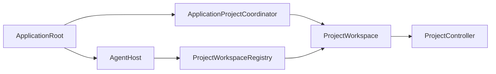

# Rupa App

## Purpose and Scope

The Rupa App component owns the macOS executable lifecycle and UI composition.
It is a child of the [Rupa application package](../../DESIGN.md) and has no
child designs.

## Responsibilities and Boundaries

The component owns application startup, window/project coordination, one
App-owned `ProjectWorkspace`, UI publication, and internal Agent-host
composition. It does not own CAD/Mesh semantics, socket framing, CLI parsing,
or package-entry mutation outside `ProjectController`.

## Related Designs

| Design | Relationship | Contract Used | Summary | Cautions |
|---|---|---|---|---|
| [application package](../../DESIGN.md) | parent | product composition | Defines the executable boundary. | Keep lifecycle state in the App. |
| [project access](../../../RupaKit/Sources/RupaProjectAccess/DESIGN.md) | used by future composition | live target/session/save contract | Exposes typed intent to the App-owned workspace. | Transport is an adapter only. |
| [Agent transport](../../../RupaKit/Sources/RupaAgentTransport/DESIGN.md) | depends on | injected endpoint and request handling | Carries live requests. | Endpoint is not semantic status. |

## Architecture

## Contracts and Invariants

1. UI and Agent requests address the same registered workspace/controller.
2. Semantic status contains no endpoint path.
3. Current scene-phase host start/stop is transitional; ACCESS-C replaces it
   with application-process lifetime without changing project authority.
4. Save is explicit and targets only the App's current project URL.

## Runtime Flows

ACCESS-C will start the host for process lifetime, resolve/open an explicit
live project under one deadline, reject dirty replacement, route intent to the
registered workspace, and explicitly save through the coordinator.

## State, Ownership, and Lifecycle

MainActor owns UI, current URL, coordinator, registry binding, and host
composition. `ProjectController` owns source state and publication. A transport
connection owns no document lifetime.

## Failure, Concurrency, and Constraints

Unavailable endpoint/session, dirty replacement, stale coordinates, uncertain
dispatch, and save errors are surfaced without closed-file fallback or retry.
UI state stays MainActor-isolated.

## Verification and Change Impact

ACCESS-C must test process-lifetime host, readiness, same-workspace routing,
dirty replacement, explicit save, no autosave, and no fallback. ACCESS-IV owns
the actual signed App/CLI end-to-end proof.
