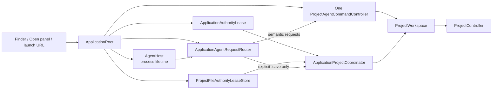
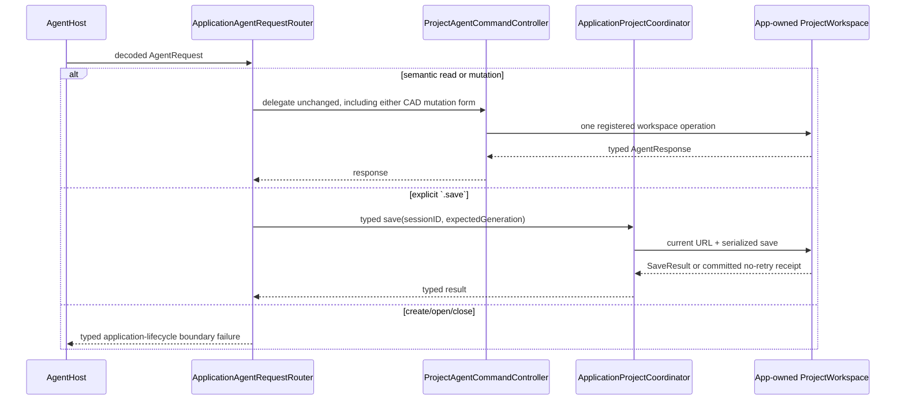

# Rupa App

## Purpose and Scope

The Rupa App component owns the macOS executable lifecycle, file activation,
and UI composition. It is a child of the
[Rupa application package](../../DESIGN.md) and has no child designs.

## Responsibilities and Boundaries

The component owns a process-lifetime application-authority lease, application
startup, window/project coordination, one App-owned `ProjectWorkspace`, one
current project URL/security-scoped lifetime, one current-project file-authority
lease, UI publication, and internal Agent-host composition. It does not own
CAD/Mesh semantics, socket framing,
CLI parsing, package-entry mutation outside `ProjectController`, file
migration, semantic program compilation, or save-as policy expansion.

## Related Designs

| Design | Relationship | Contract Used | Summary | Cautions |
|---|---|---|---|---|
| [application package](../../DESIGN.md) | parent | product composition | Defines the executable boundary. | Keep lifecycle state in the App. |
| [project access](../../../RupaKit/Sources/RupaProjectAccess/DESIGN.md) | coordinates with | live target/session/save and typed authority failures | The App lifecycle supplies the live save authority consumed by the access adapter. | Transport is an adapter only. |
| [Agent host](../../../RupaKit/Sources/RupaAgentUI/DESIGN.md) | used by | process-lifetime listener and injected request-handler contract | Provides the transport host while the App composes the controller and router. | Host must not create a second workspace or own package persistence. |
| [Agent runtime](../../../RupaKit/Sources/RupaAgentRuntime/DESIGN.md) | used by | registered-workspace semantic dispatch | Supplies the single `ProjectAgentCommandController` for non-lifecycle requests. | Runtime cannot open, close, or save a file. |
| [Agent transport](../../../RupaKit/Sources/RupaAgentTransport/DESIGN.md) | depends on | injected endpoint and request handling | Carries live requests. | Endpoint is not semantic status. |
| [Project access platform](../../../RupaKit/Sources/RupaProjectAccessPlatform/DESIGN.md) | depends on | product App Group/endpoint coordinates and project-file lease | Shares the exact coordination values with closed CLI access without importing high-level workspace composition. | It is not project authority and owns no App lifecycle. |
| [Rupa UI](../../../RupaKit/Sources/RupaUI/DESIGN.md) | depends on | snapshot-owned visible project title | Displays the exact workspace publication. | CAD metadata and file names are not title authority. |

## Architecture



## Contracts and Invariants

1. UI and Agent requests address the same registered workspace/controller.
2. Semantic status contains no endpoint path.
3. The Agent host is an application-process resource. Active, inactive, and
   background scene phases do not stop it; only application shutdown drains
   accepted requests and releases the host.
4. Save is explicit and targets only the App's current project URL.
5. The authority lease is acquired before `ProjectWorkspace`,
   `ProjectAgentCommandController`, `ApplicationAgentRequestRouter`, or
   `AgentHost` creation and is retained until process termination.
6. One application-composed `ProjectAgentCommandController` registers the
   exact workspace used by UI and coordinator. The router delegates every
   non-lifecycle request to it and sends only explicit Agent `.save` through a
   typed coordinator lifecycle port.
7. The built App exports exactly one `.rupa` document type. The Open panel
   accepts that type only; `.swcad` is neither associated nor migrated.
8. Every accepted URL reaches `ApplicationProjectCoordinator`, which delegates
   to `ProjectWorkspace.load` and `ProjectController`.
9. `ProjectViewSnapshot.projectName` is the visible navigation/window title
   authority.
10. `capability.invoke` and `program.execute` are both non-lifecycle semantic
    requests. The router delegates either unchanged to the same controller;
    it never expands nodes, interprets CAD operations, or exposes raw graph
    mutation.
11. A CAD mutation and save are separate intents. Successful in-memory
    publication does not cause implicit persistence.
12. The process `ApplicationAuthorityLease` excludes duplicate App processes;
    the project `ProjectFileAuthorityLease` excludes simultaneous App/closed-file
    ownership of one canonical `.rupa` path. Neither lease substitutes for the
    other.
13. Open and Save As start Powerbox security-scoped access first, acquire the
    candidate project-file lease second, and enter `ProjectWorkspace` only after
    both authorities exist. The previous file authority remains retained until
    replacement commits. Precommit failure releases only the candidate.
14. Save to the current canonical URL validates and reuses its existing lease.
    Lease loss before save makes the App terminally unavailable, clears current
    file authority, unregisters the Agent session, and does not enter workspace
    persistence. Every successful or postpublication save adopts the atomically
    replaced destination inode before the App reports a result.
15. Reopening the current canonical project URL validates the current lease
    before it can be an idempotent lifecycle no-op ahead of the dirty-replacement
    guard. A valid lease preserves package bytes, publication coordinates,
    Powerbox access, and Agent registration. A lost lease makes the App terminally
    unavailable and unregisters the Agent without reloading or publishing. A
    different dirty project remains a typed rejection.
16. Once a load, Save As, or New Project source publication commits, Agent path
    synchronization is part of access-authority publication rather than a
    recoverable warning. Failure makes the App terminally unavailable and
    unregisters the Agent session while preserving the committed operation's
    exact project ID, generation, transaction revision, publication sequence,
    workspace revision, mutation kind, request method, and no-retry receipt.
17. Any committed load that loses its candidate file authority unregisters the
    existing Agent session before returning. The committed source coordinates
    remain observable for recovery, but no authority-less semantic mutation can
    enter through the former session.

## Runtime Flows

```mermaid
sequenceDiagram
    participant O as Finder/Open panel/launch
    participant A as ApplicationRoot
    participant L as Authority lease
    participant C as ApplicationProjectCoordinator
    participant W as ProjectWorkspace
    participant P as ProjectController

    O->>A: schema-v3 .rupa URL
    A->>L: acquire or resolve process-lifetime lease
    alt stopped App: lease acquired
        A->>C: deliver initial URL
    else running App: existing lease
        A->>C: deliver activation to existing coordinator
    else duplicate process: lease unavailable
        L-->>A: typed duplicate-process failure
        A-->>O: visible failure; no workspace/host/load
    end
    C->>C: validate format and dirty policy
    alt clean and valid
        C->>C: start security-scoped access
        C->>C: acquire candidate file lease
        C->>W: load URL
        W->>P: stage, validate, evaluate, publish
        P-->>W: immutable project state
        W-->>C: nonempty ProjectViewSnapshot
        C->>C: install candidate; release previous lease
        C-->>A: retain current URL and workspace registration after publication
        A-->>O: snapshot.projectName title + visible view
    else dirty or invalid
        C-->>O: requested-file typed failure
        Note over C,W: prior URL, coordinates, viewport, title, and registration remain
    end
```

When the App is stopped, LaunchServices starts it and URL delivery is retained
until the one workspace is ready. When it is running, the URL is delivered to
the existing coordinator. Dirty or unsupported input produces a visible
requested-file failure without changing the prior publication. The authority
lease is acquired from the App Group coordination directory before the
workspace/controller/router/host composition; the directory contains no
project payload.

Agent requests use the same composition:



The router never edits package entries or calls a second controller. A save
uses destination-appropriate package staging and complete prepublication
validation before one atomic replacement. Prepublication cleanup must succeed
or return a typed failure without changing the destination; failure to remove
the now-empty staging directory after replacement is represented in the
successful result as a typed warning and never converted into a retryable save
failure.
Before save, the coordinator validates the retained current-path lease or,
for Save As, opens security-scoped access and acquires a candidate lease. After
atomic replacement, `adoptPublished` binds that same lease to the new inode.
Failure after replacement returns exact committed coordinates with
`mustNotRetry`; it is never represented as an ordinary retryable save failure.
If the published file lease cannot be adopted or validated, the coordinator
clears the current path, revokes the registered Agent session, and enters an
unavailable lifecycle even when the committed view remains readable. This
prevents either UI or Agent mutation from continuing without file authority.

CADAPI-D program failures preserve the same boundary: prepublication failure
leaves the App view and package unchanged, while postpublication projection or
dispatch uncertainty is reported with exact no-retry coordinates and is never
replayed through another route.

## State, Ownership, and Lifecycle

MainActor owns UI, current URL, coordinator, one controller/router composition,
registry binding, host composition, and the pairing of security-scoped access
with its project-file lease. The process owns the application-authority lease,
the shared project-file lease store, and `AgentHost` in the App Group
coordination directory from startup until termination. A candidate
security-scoped URL and file lease become current only after the corresponding
load/save replacement commits; precommit failure releases the candidate while
retaining the prior pair. `ProjectController` owns source state and publication.
A transport connection owns no document lifetime and scene visibility does not
stop the host.

## Failure, Concurrency, and Constraints

Unavailable App Group coordination, a duplicate process, project-file lease
conflict/loss/timeout, unsupported format, dirty replacement, invalid package,
unavailable endpoint/session, stale coordinates, uncertain dispatch, and
prepublication save errors are surfaced
without discard, closed-file fallback, migration, or retry. Prepublication
failure preserves project ID, generation, revision, publication sequence,
document lifetime, viewport, title, current URL, current file lease, destination
bytes, and Agent registration unless the failure proves that the current lease
itself is lost. Current-lease loss is terminal: source/publication and package
bytes remain unchanged while file authority and Agent registration are revoked.
Postcommit Agent-path synchronization failure is also terminal because the
source publication cannot be rolled back and the registered path would no longer
identify its authority. Its failure retains exact committed coordinates and
`mustNotRetry`; it is never downgraded to a ready-state warning.
File-lease coordination uses one finite
product-owned acquisition duration; this bounds coordination wait and is not an
assumption that conflicts disappear. If package replacement and the controller's clean-state
publication have committed but workspace save-result view projection fails,
the Agent receives `ApplicationAgentSaveOutcome.committed` carrying an
`AgentCommittedMutationOutcome` with `Mutation.save`, `Stage.viewProjection`,
the committed state's exact coordinates, and `mustNotRetry`; the route does not
imply a replay is safe. UI state stays MainActor-isolated.

## Verification and Change Impact

ACCESS-C tests cross-process project-file lease exclusion and cleanup,
validated same-canonical-path reuse, terminal current-lease-loss handling before
save/reopen, candidate release on load/save/cancellation failure,
previous-authority retention before commit, previous-authority release after
committed replacement, atomic-save inode adoption, and exact no-retry evidence
after postpublication lease/view failure. They also prove that committed-load
authority loss and committed load/Save As/New Project path-rebind failure remove
the former session, reject subsequent mutation, and retain exact committed
coordinates. ACCESS-O tests `.rupa` metadata/Open-panel
restriction, stopped/running URL delivery, title authority, nonempty viewport,
same-workspace Agent registration/router delegation, explicit Agent save through
the coordinator port, process-lifetime host behavior, and exact failure
preservation. Its actual signed-App proof uses project signing/build locations
without command-line signing, team, or DerivedData overrides. ACCESS-O.5 owns
destination-appropriate package staging and ACCESS-O.6 owns the source
composition; ACCESS-O.7/ACCESS-IV own cumulative signed App/CLI proof.
CADAPI-D later requires an actual signed-App/CLI test showing direct and
program forms reach this same workspace/controller, a complex program publishes
once, explicit save remains separate, and no raw graph route is reachable. The
current implementation has not yet satisfied that cutover proof.
