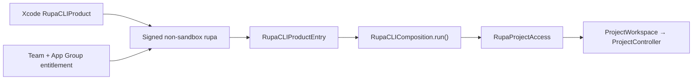
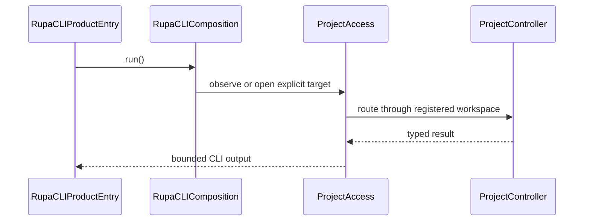

# Rupa CLI Product

## Purpose and Scope

`RupaCLIProduct` is the Xcode-owned distribution and signing component for the
`rupa` command-line executable. It is a child of the
[Rupa application package design](../../DESIGN.md). It has no child designs.

The target produces a tool named `rupa`, signed by Team `WWCKBW8CKN` with the
product App Group entitlement. Its executable entry delegates immediately to
the shared [`RupaCLIComposition`](../../../RupaKit/Sources/RupaCLIComposition/DESIGN.md).

## Responsibilities and Boundaries

This component owns only the Xcode native target, product name, code-signing
identity selection, CLI-specific entitlements, and a thin asynchronous entry.
It does not parse commands, choose live versus file access, locate an endpoint,
open a project, mutate CAD or Mesh, save a package, or own App lifecycle.

The CLI is intentionally not sandboxed. Explicit file-mode input and output
paths are caller-selected terminal paths and do not pass through a Powerbox.
The App Group entitlement is retained solely for the live endpoint and
cross-process project-file authority coordination shared with Rupa App.

## Related Designs

| Design | Relationship | Contract Used | Summary | Cautions |
|---|---|---|---|---|
| [Rupa application package](../../DESIGN.md) | parent | product composition and signing | Owns the App and CLI distribution graph. | The CLI target must not acquire application authority. |
| [RupaCLIComposition](../../../RupaKit/Sources/RupaCLIComposition/DESIGN.md) | depends on | one public async executable entry | Supplies the sole access composition and CLI invocation. | The Xcode entry contains no duplicated composition. |
| [RupaProjectAccessPlatform](../../../RupaKit/Sources/RupaProjectAccessPlatform/DESIGN.md) | reached through composition | product Team/App Group coordinates | Resolves live endpoint and authority coordination paths. | The group container stores no project payload. |
| [Rupa App](../Rupa/DESIGN.md) | coordinates with | same Team/App Group, separate process lifetime | Owns the live workspace/controller and Agent host. | CLI finish never closes the App document. |

## Architecture

## Contracts and Invariants

1. The native target is named `RupaCLIProduct`; its product name is `rupa`.
2. Project-default signing selects Team `WWCKBW8CKN` and includes
   `WWCKBW8CKN.team.stamp.rupa` in
   `com.apple.security.application-groups`.
3. The CLI entitlements contain no `com.apple.security.app-sandbox` key.
4. The executable source calls only `RupaCLIComposition.run()`.
5. SwiftPM and Xcode products therefore share one access composition, command
   tree, deadline, route selection, explicit-save behavior, and failure policy.
6. No endpoint option, fallback, direct package writer, `EditorSession`, or
   alternate project authority is introduced by this target.

## Runtime Flows

## State, Ownership, and Lifecycle

The executable target owns no mutable state beyond process-local CLI values.
Its entitlement grants access to coordination resources, not CAD, Mesh, or
package authority. Live document lifetime remains App-owned; a closed access
session owns its temporary workspace until finish.

## Failure, Concurrency, and Constraints

Signing or App Group resolution failure is terminal. The entry does not retry,
switch modes, or choose a temporary endpoint. Each process invokes one command
scope and one monotonic deadline through the shared composition. Arbitrary
file paths remain available because the tool is not sandboxed.

## Verification and Change Impact

The project-default Xcode build must produce `rupa` without command-line
signing, Team, or DerivedData overrides. `codesign` inspection must prove the
expected Team and App Group entitlement and the absence of App Sandbox. Static
tests must prove both executable entries call the same composition and contain
no second access route. The signed binary must observe a stopped App without
launching it and an explicitly launched App through the product endpoint.

Changing signing, entitlements, product naming, or the thin entry requires
rechecking the application package, `RupaCLIComposition`, platform endpoint,
file-authority lease, and actual App/CLI integration contracts.
