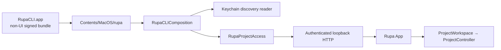
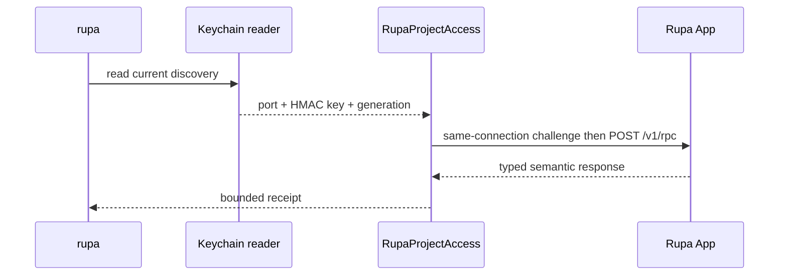

# Rupa CLI Product

## Purpose and Scope

The `RupaCLIProduct` target is the signed, non-sandboxed CLI application bundle
distributed beside the Rupa App. Its wrapper is `RupaCLI.app`, while its CLI
executable is `RupaCLI.app/Contents/MacOS/rupa`. The distinct wrapper name
avoids the case-insensitive filesystem collision with `Rupa.app`. It is a
child of the [Rupa application package](../../DESIGN.md). Children: none.

The bundle's executable is a thin entry over `RupaCLIComposition`; all project
operations use the public `RupaProjectAccess` API and the App-owned
`ProjectWorkspace`/`ProjectController`.

## Responsibilities and Boundaries

The target owns only bundle packaging, embedded provisioning, and product
signing. It does not
own project state, a listener, Keychain writes, package persistence, command
semantics, or a local controller.

## Related Designs

| Design | Relationship | Contract Used | Summary | Cautions |
|---|---|---|---|---|
| [Rupa application package](../../DESIGN.md) | parent | executable composition | Places the CLI beside the App. | Keep this entry thin. |
| [RupaCLIComposition](../../../RupaKit/Sources/RupaCLIComposition/DESIGN.md) | depends on | async CLI composition | Wires the API access ports. | No target-specific route. |
| [RupaProjectAccess](../../../RupaKit/Sources/RupaProjectAccess/DESIGN.md) | used by | live access API | Sends intent to the App. | The CLI is never project authority. |
| [RupaProjectAccessPlatform](../../../RupaKit/Sources/RupaProjectAccessPlatform/DESIGN.md) | used through composition | Keychain discovery reader | Resolves the current App endpoint. | It never writes discovery. |
| [Rupa App](../Rupa/DESIGN.md) | coordinates with | authenticated loopback API | Owns workspace and persistence. | CLI finish does not close the App. |

## Architecture

## Contracts and Invariants

1. The bundle is `LSBackgroundOnly`; its executable preserves ordinary CLI
   arguments, standard input/output, and exit codes. The executable is
   non-sandboxed and carries the Team Keychain access-group entitlement needed
   to read discovery. It has no network-server entitlement and cannot publish
   a listener record.
2. The CLI accepts no endpoint override, filesystem discovery, local project
   mode, or direct package mutation. It sends one API request through one
   access session under one monotonic deadline.
3. Status, sessions, and capabilities are observations of the running App.
   They do not start an App or create project state.
4. Mutation and evaluation run in the App-owned workspace/controller. Save is
   explicit, and response-loss after dispatch is outcome-unknown with no
   retry.

## Runtime Flows

## State, Ownership, and Lifecycle

The CLI process owns only command arguments and the API client. It never
retains a project workspace or package backing. Finishing a session releases
the client and does not alter App document lifetime.

Installing a shell symlink or launcher for
`RupaCLI.app/Contents/MacOS/rupa` is distribution work outside this component.

## Failure, Concurrency, and Constraints

Keychain, stale-generation, endpoint, session, semantic, deadline,
cancellation, and outcome-unknown failures are surfaced as nonzero typed CLI
results. No fallback or retry changes the authority route.

## Verification and Change Impact

Xcode project-default builds must show the embedded provisioning profile,
product Team, no App Sandbox, and the exact Keychain access group. CLI smoke
tests invoke `RupaCLI.app/Contents/MacOS/rupa`, resolve the App record,
perform a read and mutation, observe unchanged bytes before explicit save,
and use the App API for save and restart recovery.
