# Rupa Specification

## Status

This document defines the initial official implementation specification for Rupa.

| Field | Value |
|---|---|
| Project | Rupa |
| Workspace | `Rupa/Rupa.xcworkspace` |
| App host | `Rupa/Rupa/Rupa.xcodeproj` |
| Shared package | `RupaKit` |
| CLI product | `rupa` |
| User-facing document extension | `.swcad` |
| CAD foundation | Swift-CAD |
| Product requirements | `PRODUCT_REQUIREMENTS.md` |
| Universal CAD requirements | `UNIVERSAL_CAD_REQUIREMENTS.md` |
| Goal statement | `GOAL_STATEMENT.md` |
| Implementation status | `IMPLEMENTATION_STATUS.md` |
| Deferred profile layer | ApplicationProfile switching after the universal CAD implementation is complete |
| Initial app platforms | macOS |
| Initial CLI platform | macOS |
| macOS deployment target | `26.0` in current Swift/Xcode toolchains. `24.0` was rejected by clang target validation and must not be committed until the toolchain accepts it. |
| Implementation language | Swift 6 |

## System Overview

Rupa is organized as a thin app host plus one shared Swift package.

```text
3D/
  Rupa/
    Rupa.xcworkspace
    Rupa/
      Rupa.xcodeproj

  RupaKit/
    Package.swift
    Sources/
    Tests/

  swift-CAD/
    Package.swift
```

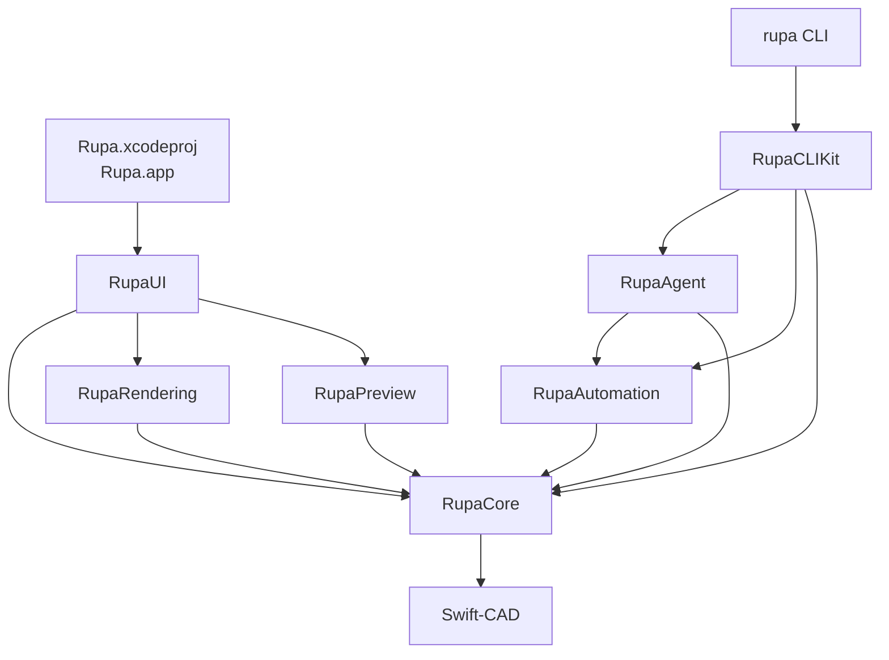

The supported implementation has one editing pipeline:

| Source | Mutation path | Result |
|---|---|---|
| GUI tool | RupaCore command through `CommandStack` | Undoable session mutation and UI update. |
| CLI file mode | RupaCore command on a loaded document | Atomic file write or structured failure. |
| CLI live mode | RupaAgent request into app `EditorSession` | App session mutation, dirty state, diagnostics, structured CLI result. |
| Batch automation | Ordered `AutomationCommand` execution | Ordered results with generation and diagnostics. |

The required product capabilities are defined separately from the implementation graph.

| Requirement document | Scope |
|---|---|
| `PRODUCT_REQUIREMENTS.md` | Product position, acceptance use cases, shared product requirements, workflows, and acceptance criteria. |
| `UNIVERSAL_CAD_REQUIREMENTS.md` | Units, scale, rulers, precision, geometry, components, validation, interoperability, automation, and performance requirements for the single universal CAD model. |

ApplicationProfile switching is deliberately excluded from the initial package graph. The initial implementation must expose generic validation rules, export presets, templates, unit defaults, and UI layout settings so that a later ApplicationProfile layer can group them without changing RupaCore semantics.

## Required Repository Layout

```text
3D/
  Rupa/
    Rupa.xcworkspace
    Rupa/
      Rupa.xcodeproj
      Rupa/
        RupaApp.swift

  RupaKit/
    Package.swift
    Sources/
      RupaKit/
      RupaCore/
      RupaUI/
      RupaRendering/
      RupaPreview/
      RupaAutomation/
      RupaAgent/
      RupaCLIKit/
      RupaCLI/
    Tests/
      RupaCoreTests/
      RupaAutomationTests/
      RupaAgentTests/
      RupaCLITests/

  swift-CAD/
```

## App Host Specification

`Rupa/Rupa/Rupa.xcodeproj` contains app targets only.

| Area | App host responsibility |
|---|---|
| Lifecycle | Define `@main` app entry and scene setup. |
| Platform integration | WindowGroup, DocumentGroup when introduced, menu commands, app activation. |
| Security | Entitlements, sandbox, security-scoped file access where required. |
| Distribution | Assets, signing, provisioning, bundle metadata. |
| Composition | Import `RupaUI` and start app-level services such as `RupaAgentServer`. |

The app host delegates editor behavior to RupaKit.

| Area | Owned outside the app host |
|---|---|
| CAD document mutation | `RupaCore` |
| Command implementation | `RupaCore` |
| Editor UI implementation | `RupaUI` |
| Rendering implementation | `RupaRendering` |
| Import and export workflows | `RupaCore` and `RupaPreview` as appropriate |
| CLI implementation | `RupaCLIKit` |
| Automation schema | `RupaAutomation` |
| Live app coordination | `RupaAgent` |

```swift
import SwiftUI
import RupaUI

@main
struct RupaApp: App {
    var body: some Scene {
        WindowGroup {
            RupaMainView()
        }
    }
}
```

When live CLI support is enabled, app startup creates the application model and starts the agent server.

```swift
import SwiftUI
import RupaUI
import RupaAgent

@main
struct RupaApp: App {
    @StateObject private var appModel = RupaAppModel()

    var body: some Scene {
        WindowGroup {
            RupaMainView()
                .environmentObject(appModel)
                .task {
                    await appModel.startAgentServerIfNeeded()
                }
        }
    }
}
```

## Package Products

`RupaKit/Package.swift` exposes libraries and one executable.

| Product | Type | Target |
|---|---|---|
| `RupaKit` | Library | `RupaKit` |
| `RupaCore` | Library | `RupaCore` |
| `RupaUI` | Library | `RupaUI` |
| `RupaRendering` | Library | `RupaRendering` |
| `RupaPreview` | Library | `RupaPreview` |
| `RupaAutomation` | Library | `RupaAutomation` |
| `RupaAgent` | Library | `RupaAgent` |
| `RupaCLIKit` | Library | `RupaCLIKit` |
| `rupa` | Executable | `RupaCLI` |

## Package Target Graph

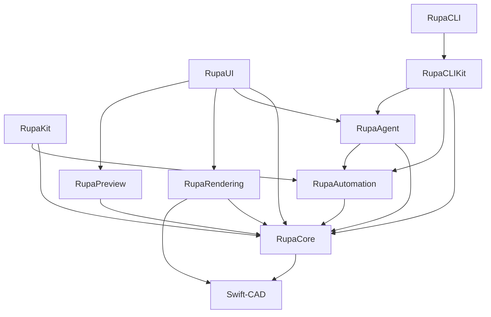

| Target | Dependencies | Responsibility |
|---|---|---|
| `RupaKit` | `RupaCore`, `RupaAutomation` | Umbrella module. |
| `RupaCore` | Swift-CAD, Collections | Editor sessions, document state, commands, evaluation, services, diagnostics. |
| `RupaUI` | `RupaCore`, `RupaAgent`, `RupaRendering`, `RupaPreview` | SwiftUI editor interface and app-facing service lifecycle. |
| `RupaRendering` | `RupaCore`, Swift-CAD | Editor viewport and render-scene extraction from CAD source/evaluated state. |
| `RupaPreview` | `RupaCore` | RealityKit, Quick Look, USDZ preview. |
| `RupaAutomation` | `RupaCore` | Codable command schema, batch execution, stable references. |
| `RupaAgent` | `RupaCore`, `RupaAutomation` | App and CLI coordination over IPC. |
| `RupaCLIKit` | `RupaCore`, `RupaAutomation`, `RupaAgent`, ArgumentParser | Testable CLI command implementation, terminal output, and exit mapping. |
| `RupaCLI` | `RupaCLIKit` | Thin `rupa` executable entry point. |

## Target Responsibilities

### RupaKit

Umbrella module for common imports.

```swift
@_exported import RupaCore
@_exported import RupaAutomation
```

`RupaUI` remains separately importable by the app host.

### RupaCore

RupaCore owns the editor model and command pipeline.

| Type | Responsibility |
|---|---|
| `EditorSession` | Coordinates document state, selection, tools, commands, evaluation, and diagnostics. |
| `CADDocumentStore` | Owns the current document value, dirty state, document generation, diagnostics, and evaluation snapshot metadata. |
| `CommandStack` | Applies commands, records undo and redo, and preserves mutation ordering. |
| `RupaDocument` | Wraps Swift-CAD source with Rupa display settings and universal product metadata. |
| `RupaProductMetadata` | Persists scene nodes, components, material library, validation rules, export presets, and template defaults. |
| `ModelingToolActivationResult` | Reports the Core-owned outcome of tool selection or canvas-target activation, including command name, mutation state, selected scene node, and whether diagnostics should be revealed. |
| `EditorCommand.upsertParameter` | Adds or updates a Swift-CAD parameter by name using typed `CADExpression` and `QuantityKind`. |
| `EditorCommand.deleteParameter` | Deletes a Swift-CAD parameter by name through the undoable command path and rejects deletion while the parameter is still referenced. |
| `EditorCommand.createComponentDefinition` | Creates a reusable generic component definition from existing scene roots without creating a domain-specific document branch. |
| `EditorCommand.createComponentInstance` | Creates a component instance with a local transform and records a component scene reference. |
| `EditorCommand.setSceneNodeVisibility` | Updates scene hierarchy visibility through the undoable command path. |
| `EditorCommand.setSceneNodeLock` | Updates scene hierarchy lock state through the undoable command path. |
| `EditorCommand.setSceneNodeTransform` | Updates a scene node local transform through the undoable command path after validating the transform matrix. |
| `EditorCommand.setComponentInstanceVisibility` | Updates component instance visibility through the undoable command path. |
| `EditorCommand.setComponentInstanceLock` | Updates component instance lock state through the undoable command path. |
| `EditorCommand.setComponentInstanceTransform` | Updates a component instance local transform through the undoable command path after validating the transform matrix. |
| `EditorCommand.createSectionPlane` | Creates a construction section plane scene node through the undoable command path. |
| `EditorCommand.createLineSketch` | Creates a Swift-CAD sketch feature containing one line primitive and records a Rupa scene sketch reference. |
| `EditorCommand.createCircleSketch` | Creates a Swift-CAD sketch feature containing one circle primitive and records a Rupa scene sketch reference. |
| `EditorCommand.createRectangleSketch` | Creates a Swift-CAD sketch profile from typed width and height expressions and records a Rupa scene sketch reference. |
| `EditorCommand.createRectangleSketchFromCorners` | Creates a Swift-CAD rectangle sketch profile from two model-space corner points and records a Rupa scene sketch reference. |
| `EditorCommand.extrudeProfile` | Creates a Swift-CAD extrude feature from a resolved `ProfileReference`, records the graph dependency, and records a Rupa body scene reference. |
| `EditorCommand.createExtrudedRectangle` | Creates a rectangle sketch plus new-body extrude as one undoable command for the initial solid modeling workflow. |
| `EditorCommand.createExtrudedCircle` | Creates a circle sketch plus new-body extrude as one undoable command for the initial cylindrical solid workflow. |
| `EvaluationScheduler` | Runs deterministic Swift-CAD evaluation after source changes and produces generation-keyed evaluation snapshots. |
| `EvaluationSnapshot` | Captures evaluation status, evaluated generation, render invalidation, generated body count, and diagnostics. |
| `RenderInvalidation` | Identifies when renderer-derived state must be rebuilt from an evaluated generation. |
| `RupaMeshSummaryService` | Evaluates source when needed and computes non-mutating mesh body, vertex, normal, triangle, index, and bounds summaries. |
| `RupaMeshSummaryResult` | Reports mesh summary totals, per-body mesh details, display unit, bounds, and diagnostics. |
| `RupaMeasurementService` | Computes structured, non-mutating document measurements from Swift-CAD source intent. |
| `RupaMeasurementResult` | Reports measurement counts, bounds, profile area, solid volume, measured profile details, measured solid details, display unit, and diagnostics. |
| `RupaSaveResult` | Reports successful save path, generation, dirty state, and diagnostics without changing document generation. |
| `RupaDocumentPackageStore` | Reads and writes Rupa `.swcad` packages containing Swift-CAD source plus Rupa metadata. |
| `FileService` | Loads, saves, writes atomically, supports legacy Swift-CAD native packages, and coordinates file access. |
| `RupaDocumentExportService` | Evaluates a Rupa document and writes Swift-CAD exchange output with typed result metadata. |
| `SelectionModel` | Owns selected and hovered scene-node references, validates them against the current document, and prunes stale references after source or metadata changes. |
| `ToolController` | Converts active tool state and canvas gestures into commands. The initial implementation is `EditorSession.activateTool`, `EditorSession.activateSelectedToolFromCanvas`, and `EditorSession.activateSelectedToolFromCanvasDrag`, keeping canvas toolbar selection, viewport click, and viewport drag behavior testable without importing SwiftUI. |
| `Diagnostics` | Stores structured errors, warnings, and notes. |

Required command flow:

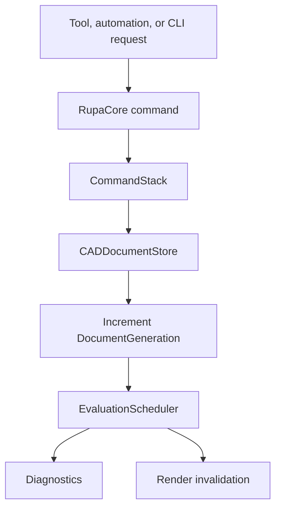

RupaCore is headless. It does not import SwiftUI, MetalKit, RealityKit, or app target code.

### Universal Product Metadata

Rupa-specific product metadata is generic CAD state. It is not an ApplicationProfile, and it must not encode video, print, or architecture as separate branches.

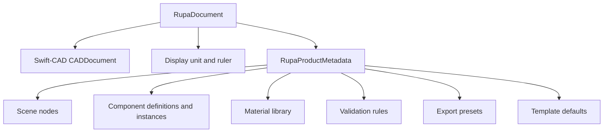

| Metadata type | Contract |
|---|---|
| `RupaSceneNode` | Hierarchical organization for feature, body, sketch, component, and construction references. |
| `RupaComponentDefinition` | Reusable generic component source grouping scene roots and properties. |
| `RupaComponentInstance` | Instance transform, visibility, lock state, and overrides. Component creation and instance visibility, lock, and transform state changes must use `EditorCommand`, not direct UI metadata mutation. |
| `RupaMaterialLibrary` | Document-level material table built from Swift-CAD `Material`. |
| `RupaValidationRule` | Serializable generic validation rule selection and severity. |
| `RupaExportPreset` | Format, unit, tessellation, validation, metadata, and destination defaults. |
| `RupaTemplateDefaults` | Generic defaults that can later be grouped by ApplicationProfile. |

`RupaProductMetadata.validate(against:)` checks local hierarchy consistency and references into the Swift-CAD source. Invalid metadata is reported through the same evaluation diagnostics and render invalidation path as CAD source failures.

### Parameter Contract

Parameters are Swift-CAD source, not Rupa-only metadata. Rupa commands provide the editing surface and safety checks.

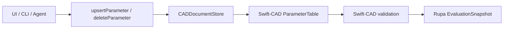

| Concern | Contract |
|---|---|
| Identity | Parameter upsert and deletion resolve by name; upsert preserves the existing parameter ID when updating. |
| Typing | Every command carries a `CADExpression` and `QuantityKind`; Swift-CAD validates expression kind and value. |
| Revision | Successful upsert and deletion advance `ParameterTable.revision`. |
| Undo and redo | Parameter edits, including deletion, participate in `CommandStack` like other source mutations. |
| Deletion safety | Deleting a parameter validates the resulting Swift-CAD document before mutation is committed; references from other parameters or model features reject the command. |
| Automation | Automation and Agent commands expose the same typed parameter upsert and deletion path. |
| CLI | `rupa param set` supports numeric literals and parsed formulas for length, angle, and scalar parameters in file, live, and auto modes. `rupa param delete` uses the same mode and open-document safety model. |
| Listing | `rupa param list` returns parameter IDs, names, kinds, normalized expression strings, resolved values, diagnostics, generation, and dirty state. |

Parameter formulas are saved as Swift-CAD `CADExpression` AST values. Formula input strings are parsed at the command boundary and are not the source of truth after save. Dependency-aware UI editing remains follow-up work.

### Modeling Command Contract

Initial modeling commands are generic CAD source operations. They do not encode video, printing, or architecture branches.

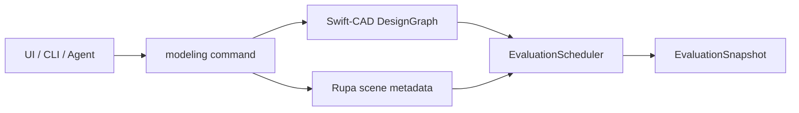

| Command | Contract |
|---|---|
| `createLineSketch` | Adds one Swift-CAD sketch feature with a line primitive, document generation update, undo entry, and scene sketch node. |
| `createCircleSketch` | Adds one Swift-CAD sketch feature with a positive-radius circle primitive, document generation update, undo entry, and scene sketch node. |
| `createRectangleSketch` | Adds one Swift-CAD sketch feature with a profile output, rectangle line loop, document generation update, undo entry, and scene sketch node. |
| `addSketchConstraint` | Adds a Swift-CAD `SketchConstraint` to an existing sketch feature as one undoable source mutation, rejecting missing features, non-sketch features, duplicate constraints, and invalid sketch geometry before mutation. |
| `createRectangleSketchFromCorners` | Adds one Swift-CAD sketch feature from two model-space corner points, preserving document generation update, undo entry, and scene sketch node semantics. |
| `extrudeProfile` | Requires a resolved existing supported closed sketch `ProfileReference`, adds one Swift-CAD extrude feature with a body output and dependency edge, and fails before mutation when the profile source cannot be resolved, is open, or uses unsupported mixed primitives for profile extraction. |
| `createExtrudedRectangle` | Adds a rectangle sketch and new-body extrude as one undoable command for the first solid creation workflow. |
| `createExtrudedRectangleFromCorners` | Adds a model-space corner-defined rectangle sketch and new-body extrude as one undoable command for Canvas footprint-based solid creation. |
| `createExtrudedCircle` | Adds a circle sketch and new-body extrude as one undoable command. Swift-CAD currently evaluates the circular profile as a tolerance-bounded polygonal solid until analytic cylindrical BRep surfaces are introduced. |
| Sketch-only evaluation | A document with valid sketch source and no body-producing active feature evaluates as valid with zero generated bodies. |
| CLI sketch | `rupa sketch line`, `rupa sketch circle`, and `rupa sketch rectangle` expose primitive sketch creation in `auto`, `file`, and `live` modes using numeric length literals. |
| CLI modeling | `rupa model box`, `rupa model box-corners`, and `rupa model cylinder` expose initial solid workflows in `auto`, `file`, and `live` modes using numeric length literals; `rupa model extrude` extrudes an existing closed sketch profile by Feature ID through the same mode model. |

Constraint solving, dimension annotations, analytic cylindrical BRep surfaces, stable reference resolution, CLI constraint editing, and the broader feature set remain follow-up work.

### Mesh Summary Contract

Mesh summary is derived state. It reads the same evaluated mesh data used by export and must not advance document generation or create undo history.

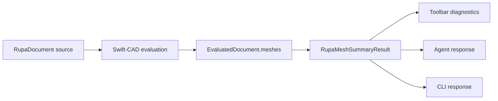

| Concern | Contract |
|---|---|
| Scope | Initial mesh summary reports body count, vertex count, normal count, triangle count, index count, per-body metadata, and axis-aligned mesh bounds. |
| Units | Mesh coordinates remain canonical meters; readable bounds use the document display unit. |
| Non-mutation | UI Mesh, Agent mesh summary, and CLI mesh read source/evaluated data without changing generation, dirty state, or undo stack. |
| Empty source | Valid sketch-only or empty documents return a zero-mesh summary with an informational diagnostic. |
| CLI | `rupa mesh` exposes the same `auto`, `file`, and `live` mode model as other document read commands. |

Mesh repair, decimation, smoothing, material-aware mesh editing, and preview tessellation controls remain follow-up work.

### Measurement Contract

Measurement is derived state. It must not advance document generation or create undo history.

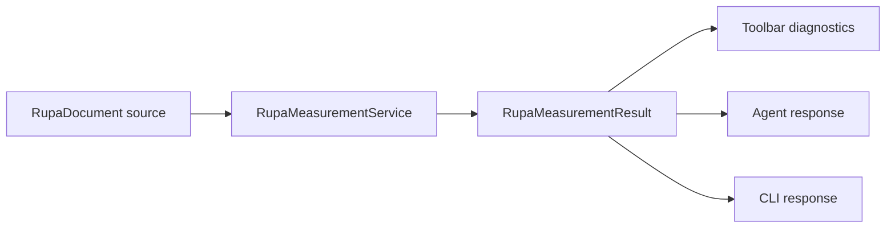

| Concern | Contract |
|---|---|
| Scope | Initial measurement supports sketch primitive counts, closed line-loop profile area, single-circle profile area, rectangular/circular extrude volume, selected sketch/body measurement, and axis-aligned bounds. |
| Units | Results store canonical meters, square meters, and cubic meters plus the document display unit for readable summaries. |
| Non-mutation | UI Measure, Agent measure, and CLI measure read source state without changing generation, dirty state, or undo stack. |
| Scope reporting | `RupaMeasurementResult.scope` reports whether the result was computed for the whole document or the current selection. |
| Selection | When a sketch scene node is selected, measurement reports that sketch profile and bounds. When a body scene node is selected, measurement reports the selected solid plus the source profile required to compute area and volume. Non-feature scene nodes return an empty selection measurement with diagnostics. |
| Unsupported source | Open sketches and unsupported mixed profile primitives remain counted as source/sketch primitives but do not contribute profile area or solid volume. |
| CLI | `rupa measure` exposes the same `auto`, `file`, and `live` mode model as other document read commands. File mode measures the document; live and auto-live modes use the open session selection when one exists. |

General distance, angle, radius, diameter, face area, edge length, and annotation-style dimensions remain follow-up work.

### Export Contract

Export is derived output. It must evaluate the current document source, write atomically, and preserve the document generation and undo history.

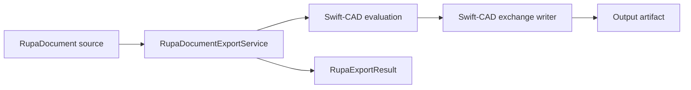

| Concern | Contract |
|---|---|
| File mode | Load the closed `.swcad`, evaluate it, and write the requested exchange file without mutating source. |
| Live mode | Export the running app session so unsaved in-memory edits are reflected in output. |
| Auto mode | Prefer a matching open session; otherwise export the closed file. |
| Safety | File mode rejects open-document conflicts unless explicitly forced. |
| Dry run | Evaluate and resolve the output format without writing an output file. |
| Preset selection | `RupaExportOptions` may select a `RupaExportPreset` by ID or name. The selected preset defines the exchange format, output unit, tessellation policy, validation rule references, metadata inclusion preference, and default destination policy. |
| Format check | When a preset is selected, the output path extension must resolve to the same `ExchangeFileFormat` as the preset. Mismatches fail before writing. |
| Output unit | Preset export units are applied to Swift-CAD exchange writers, including micrometer through meter scale workflows. Without a preset, the document unit system is used. |
| Destination policy | Export resolves `prompt`, `overwrite`, or `versioned` before writing. `prompt` refuses an existing path, `overwrite` replaces it atomically, and `versioned` writes the next available suffixed path. |
| Errors | Evaluation failures return `evaluation.failed`; output failures return `export.failed`. |
| Results | `RupaExportResult` includes format, final output path, byte count, generation, dry-run flag, preset name, output unit, destination policy, and diagnostics. |

### Evaluation Contract

Evaluation is derived state and must not advance document generation or write undo history.

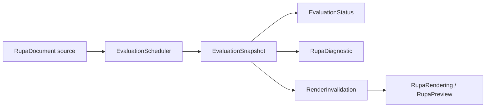

| Case | Required result |
|---|---|
| Valid generated document | `.valid`, current evaluated generation, generated body count, info diagnostic, and `.evaluated` render invalidation. |
| Empty valid document | `.valid`, current evaluated generation, zero bodies, info diagnostic, and `.evaluated` render invalidation. |
| Evaluation failure | `.failed`, current evaluated generation, error diagnostic, zero bodies, and `.evaluationFailed` render invalidation. |
| Undo or redo | Restore source snapshot, advance generation as a mutation, then evaluate the restored source. |
| Validation command | Evaluate without creating an undo entry. |
| CLI or Agent eval | Evaluate the file or live session without creating an undo entry or advancing generation. |
| Save | Validate and persist source without advancing generation or creating undo history; live save marks the session clean. |

The initial scheduler is synchronous and deterministic. A later asynchronous scheduler must keep the same snapshot contract, discard stale completions by generation, and avoid capturing UI-owned state outside MainActor boundaries.

### RupaUI

RupaUI contains the complete SwiftUI editor surface.

The root editor shell uses SwiftUI's native sidebar model for the leading component Browser column. The sidebar controls scene/component hierarchy, visibility, lock state, and component instances through RupaCore commands. The sidebar is not a modeling tool palette. Modeling tools are canvas-local controls shown as a floating Liquid Glass toolbar on the bottom edge of the viewport. Toolbar buttons call `EditorSession.activateTool` and only change the active tool. Viewport clicks call `EditorSession.activateSelectedToolFromCanvas`, viewport drags call `EditorSession.activateSelectedToolFromCanvasDrag`, and geometry is created from the canvas target or model-space coordinates rather than from toolbar selection alone. Creation tools are single-use: after a successful `Sketch`, `Surface`, `Solid`, or `Section` mutation, `EditorSession` returns the active tool to `Select`; rejected activations keep the active tool. `Select` changes selection mode and picks source-derived sketch/body previews from the initial viewport, Browser and viewport selection are stored in RupaCore `SelectionModel`, `Sketch` creates default-sized rectangle sketches centered on Canvas click coordinates and drag-sized rectangle sketches from Canvas model-space drags, `Surface` creates default-radius circular sketch profiles centered on Canvas click coordinates and drag-sized circular sketches from Canvas model-space center-to-edge drags, `Solid` extrudes a clicked sketch profile when available, creates default-sized rectangular bodies centered on Canvas background click coordinates, and creates drag-sized rectangular bodies from Canvas model-space footprint drags, `Mesh` evaluates and reports a structured generated-mesh summary with bounds and triangle counts from Canvas activation, `Measure` reports a structured clicked or selected-object measurement when a measurable scene node is selected and otherwise reports a document measurement summary with bounds, profile area, and solid volume from Canvas activation, and `Section` creates a construction section plane scene node through `EditorCommand.createSectionPlane` from Canvas activation. `NavigationSplitView` owns the sidebar boundary. The detail column uses `MacComponent` split components for editor panes such as viewport, logs, and the contextual property Pane. The logs pane and the Inspector Pane are collapsed by default. The Inspector Pane uses an ideal default width of about 420 px and must not add custom padding beyond the native control layout.

| File | Responsibility |
|---|---|
| `RupaMainView.swift` | Root editor view exported to the app host. |
| `MainWindow.swift` | Main composition of viewport, component Browser, bottom canvas tool palette, detail panes, inspector, and app model. |
| `DocumentToolbar.swift` | Document-level editor actions such as new document, validation, and inspector visibility. |
| `CanvasToolPalette.swift` | Bottom viewport-hosted Liquid Glass modeling tools and mode controls. |
| `Sidebar.swift` | Component Browser for hierarchy, visibility, lock state, and component instance control; it is not a modeling tool palette. |
| `Inspector.swift` | Contextual property editing hosted in a MacComponent detail Pane. |
| `Timeline.swift` | Feature history and command-aware editing. |
| `ParametersPanel.swift` | Parameter list and bulk editing; contextual parameter properties belong in the Inspector Pane. |
| `ExportPanel.swift` | Export workflow controls. |
| `DiagnosticsPanel.swift` | Structured diagnostics display. |

RupaUI converts user actions into RupaCore commands. It does not mutate `CADDocument` directly.

Selection is UI state owned by `EditorSession`, not CAD source. Selecting, clearing, or hovering scene nodes must not advance `DocumentGeneration`, dirty state, or undo history. Commands, undo, redo, reset, and metadata replacement prune selection entries that no longer exist in the current product metadata. The initial viewport consumes the same selection state to highlight source-derived sketch and body previews, maps click hits back to product scene-node references while `Select` is active, forwards clicked scene-node targets and model-space click coordinates to the active modeling tool when a non-select tool is active, and forwards model-space drag ranges to active tools that create geometry from Canvas gestures; the later Metal selection buffer and drag interaction layer must preserve the same Core selection and activation contract.

While `Select` is active, a plain click replaces the current selection with the clicked scene node and a background click clears selection. Dragging a screen-space rectangle replaces selection with every selectable object whose projected selectable bounds intersects the rectangle. Holding Command or Shift while clicking or rectangle-selecting changes the intent to toggle: objects already in the current selection are removed, and objects not yet selected are appended in stable scene order. Command/Shift background clicks and empty rectangle selections leave the existing selection unchanged.

Hover state is a transient selection preview. Sidebar row hover and viewport object hover while `Select` is active both update `SelectionModel.hoveredSceneNodeID`. The viewport must render the hovered scene node with a distinct non-committal highlight while leaving the selected highlight stable. Hover updates must not report diagnostics for background movement, create undo history, mark the document dirty, or advance generation.
Selected scene nodes must render a transient object-editing affordance in the viewport. The initial sketch affordance exposes planar transform handles, move axes, rotation arcs, and a pivot marker. The initial body affordance exposes five operation families: axis arrows translate along the selected axis by the drag amount; arrow-end boxes perform one-sided scaling in that displayed axis direction; inner handles at the rotation intersections scale symmetrically from the object center along that axis; rotation arcs rotate around the axis perpendicular to that arc; and body vertex or face handles deform the object by moving the selected vertex or face. Cube-like bodies therefore expose eight vertex handles and six face handles. When multiple body objects are selected, the viewport must not render separate transform affordances for each selected body. It must compute the model-space outer bounds of the selected body set, draw one selection volume around that outer boundary, and expose one shared transform affordance whose pivot, arrows, rotation arcs, face handles, and vertex handles are based on the selection volume. Group move and scale interactions apply to every selected body as one selection object; body-relative offsets inside the group are preserved proportionally. Body geometry rendering must project all eight transformed volume vertices and draw the resulting six faces; it must not render moved or transformed bodies from a stale footprint plus a depth offset. Transient viewport edits must update the body coordinate extents used by rendering, affordance placement, hover hit testing, picking, and construction-plane selection; they must not keep fixed body coordinates and merely apply a visual offset. When a body is selected or has an active transient viewport edit, its source sketch must not be rendered, hovered, picked, or given a separate selection affordance as a detached blue footprint. Body move axes, rotation arcs, and pivot marker must share the projected body-volume center, not an individual face center. Body move arrows must remain arrow-shaped controls projected onto the corresponding three-dimensional axis, with an axis shaft and a projected three-dimensional cone head at the tip; they must not be replaced by cube or cuboid shafts. Along each axis, the outermost handle must be the arrow cone, followed inward by the one-sided scale cube, then the inner sphere at the rotation-arc intersection. Body move arrows and their arrow-end scale boxes must be placed far enough from the object center to remain easy to grab without colliding with the pivot, inner handles, or rotation arcs. Body vertex handles must be rendered as projected three-dimensional cubes. Body face handles must be rendered as projected circles that are parallel to the corresponding face plane. Body inner handles at rotation-arc intersections must be rendered as spheres. Body arrow-end scale handles and the pivot marker remain projected three-dimensional cubes. The X/Y/Z rotation arcs must use the same center and the same model-space radius, but each arc must be drawn as a projected three-dimensional circle segment on its coordinate plane: X rotation on the YZ plane, Y rotation on the ZX plane, and Z rotation on the XY plane. A rotation arc must not be drawn as a viewport-facing two-dimensional circle. Every object-editing affordance must have hover hit testing and a visible hover highlight before drag, and rotation hover hit testing must use the same projected three-dimensional arc geometry as rendering. Rendering and transient viewport interaction must not mutate CAD source, report diagnostics, create undo history, mark the document dirty, or advance generation. Persisted drag handling for these controls must enter RupaCore through typed editor commands.

#### Sidebar and Inspector Information Architecture

The Sidebar uses native SwiftUI sidebar presentation. The Inspector uses a MacComponent detail Pane. Their responsibility is separated by information scope, not by visual styling.

In Rupa, **Inspector** always means the right-side MacComponent Pane inside the `NavigationSplitView` detail column. It does not mean SwiftUI's `inspector` modifier or SwiftUI Inspector presentation API. The SwiftUI Inspector API is not part of the Rupa UI architecture and must not be reintroduced for contextual properties.

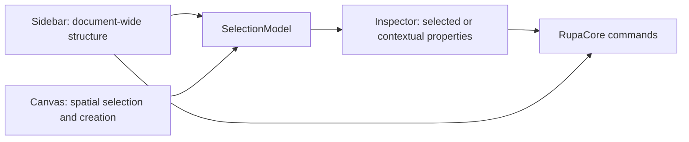

| Surface | Scope | Required content | Allowed actions |
|---|---|---|---|
| Sidebar / Scenes | Document-wide object hierarchy | Root scene nodes, child scene nodes, node kind, visibility, lock state | Select scene node, toggle visibility, toggle lock |
| Sidebar / Component Definitions | Reusable component sources | Definition name and referenced root count | Inspect definition identity; later open definition editing |
| Sidebar / Component Instances | Placed component occurrences | Instance name, source definition, visibility, lock state | Toggle visibility, toggle lock; later select instance |
| Sidebar / Assets | Document-wide reusable assets | Materials, validation rules, export presets | Inspect asset identity; later open asset editors |
| Inspector / Document | Current document context | Name, document ID, source/display units, source feature count, scene-node count, generated body count, diagnostics, render invalidation state, and asset counts | Validate through toolbar; document mutation through explicit document commands |
| Inspector / Selection | Current selected scene node or selected scene-node set | Name, kind, scene-node ID, primary object, reference type, reference target, hierarchy parent, child count, descendant count, visibility, lock state, material assignment, and mixed values for multi-selection | Toggle visibility and lock for one or every selected object; assign or clear material through RupaCore commands |
| Inspector / Transform | Current selected node transform or shared transform state | Local transform summary, position X/Y/Z, scale X/Y/Z, custom-transform count, single-object matrix rows, reset control, and later typed rotation fields | Edit position and scale through paired TextField and Slider controls backed by `setSceneNodeTransform`; reset transform through `setSceneNodeTransform`; later edit decomposed rotation through typed commands |
| Inspector / Source Geometry | Current selected feature-backed object or selected feature-backed set | Editable source dimensions when a matching feature command exists, including extrude depth; later rectangle width/height, circle radius, and corner operations | Edit supported feature dimensions through paired TextField and Slider controls backed by feature mutation commands |
| Inspector / Viewport | Current viewport context | Projection, grid plane, and in-plane ruler state | Later edit camera/projection/grid settings |
| Inspector / Units and Ruler | Canvas measurement context | Display unit, ruler minor, major, and visible in-plane spans | Change display unit through `setDisplayUnit`; change ruler configuration through `setRulerConfiguration` |

The Sidebar must not contain modeling tools. It answers what exists in the document, how it is organized, and what is globally visible or locked. The Inspector answers what is selected, what context is active, and which properties can be read or edited without changing the document hierarchy.

The Inspector has three explicit states:

| Selection state | Inspector content | Editing contract |
|---|---|---|
| No selected object | Canvas and document properties | Document identity, scene counts, evaluation/diagnostic state, asset counts, display unit, ruler spacing, visible span, grid/projection context, and later camera properties. |
| One selected object | Object properties | Name, kind, scene-node ID, reference target, hierarchy position, visibility, lock state, transform position/scale, transform matrix summary, source dimensions, material, and object-specific parameters where available. |
| Multiple selected objects | Shared object properties | Count, primary object, kind/reference/parent summaries, shared or mixed visibility and lock state, aggregate hierarchy counts, shared transform position/scale, source dimensions common to the selected feature type, material assignment, and common editable properties. Edits apply to every selected object through RupaCore commands. Type-specific properties are shown only when all selected objects support that property. |

Editable numeric properties must pair a precise `TextField` with a `Slider`. The text field is the exact value entry path; the slider is the coarse adjustment path. Both controls write through the same command-backed property binding, use the active display unit where the value is a length, and must not mutate document state directly from SwiftUI view code.

Mixed multi-selection values follow the Figma-style convention:

| Property condition | Display | User edit behavior |
|---|---|---|
| All selected objects share the value | Show the value normally. | Editing changes that value on every selected object. |
| Selected objects have different values | Show `Mixed` or an indeterminate control state. | Entering a new text value, choosing a menu value, toggling a state, or dragging a slider assigns the new value to every selected object. |
| Property is not supported by every selected object | Hide it from the shared section or move it into type-specific subsections. | No partial mutation is allowed from the shared control. |
| Numeric value is mixed | Text field placeholder is `Mixed`; slider shows an inactive or neutral mixed state until the user provides a concrete value. | The first concrete value assigned from text or slider becomes the value for every selected object. |

### RupaRendering

RupaRendering owns the editor viewport. The initial implementation may use a SwiftUI Canvas for source-derived sketch/body previews, highlighting, selected-object affordances, direct hit testing, visible X/Y/Z axes, coordinate-aligned projected grid lines, in-plane ruler scale lines, and viewport-to-model coordinate mapping for click and drag gestures. The default viewport projection is isometric. Objects, grid lines, axes, hit testing, model coordinate mapping, and transform affordances must share one projection basis. Viewport pan and zoom are camera state and must feed the same layout used by drawing, grid generation, hit testing, hover, click-to-model mapping, and drag-to-model mapping. Selection hover and construction hover are separate concerns: selection hover highlights selectable objects, while construction hover during drawing tools highlights the hovered body face or the zero-coordinate field cell that will define the drawing plane. Canvas click and drag creation commands must consume that highlighted construction plane so generated sketches, surfaces, section planes, and solids are parallel to the indicated face or zero-coordinate field. Selected body transform affordances must show coordinate-volume vertices and face centers separately from move and rotation controls. The Axis Gizmo is an interactive viewport UI control: positive X/Y/Z nodes must be selectable independently of canvas picking, selection must be visible on the Gizmo, and selecting an axis rotates the viewport projection so the selected axis becomes the front-facing coordinate. The Gizmo center and explicit Isometric button reset the projection to the default isometric view. The explicit Reset button resets viewport pan and zoom without mutating model coordinates. Axis-driven projection changes are camera-orientation changes, not model-coordinate mutations, and must animate by interpolating the active projection basis from the current visible basis to the target basis. Axis-driven projection changes must feed the same interpolated projection basis into grid drawing, canvas axes, object projection, selected-object affordances, hit testing, hover mapping, click-to-model mapping, drag-to-model mapping, pan, and zoom. The Axis Gizmo control must remain above the canvas input surface in hit-testing order. X/Y/Z colors must be defined once and reused by Canvas axes, Axis Gizmo nodes, and transform affordances. Rulers must not be fixed to the viewport edge; they are part of the projected modeling plane and share the same basis as the grid. The coordinate mapper must support empty documents by deriving a model-space plane from the current ruler and must preserve micrometer-to-meter scale behavior. The production viewport target remains a Metal-based renderer with camera navigation, GPU mesh buffers, and an offscreen selection identity buffer.

| File | Responsibility |
|---|---|
| `Viewport.swift` | Initial SwiftUI Canvas viewport drawing, axis and coordinate-grid hosting, selection highlighting, click-to-hit and click-to-model bridge, drag-to-model bridge, and camera navigation state ownership. |
| `ViewportCamera.swift` | Viewport pan and zoom state shared by rendering layout, hit testing, and model coordinate mapping. |
| `ViewportInputSurface.swift` | macOS input bridge for click, drag, hover, scroll pan, mouse-wheel zoom, and trackpad magnification. |
| `ViewportProjectionBasis.swift` | Shared viewport projection basis; default mode is isometric. |
| `ViewportCoordinateAxis+Style.swift` | Shared X/Y/Z labels and colors used by Canvas axes, Axis Gizmo, and transform affordances. |
| `ViewportProjectedGrid.swift` | Unit-aware projected coordinate-grid and in-plane ruler line calculation. |
| `ViewportScene.swift` | Source-derived viewport scene extraction, projection/unprojection layout, model coordinate mapping, and initial hit testing for selectable sketch/body previews. |
| `MetalViewport.swift` | SwiftUI/AppKit bridge for the viewport. |
| `MetalCADRenderer.swift` | Metal renderer lifecycle and draw loop. |
| `RenderScene.swift` | Renderable derived scene state. |
| `RenderSceneBuilder.swift` | Conversion from evaluated document state to render scene. |
| `MeshBufferCache.swift` | GPU buffer cache keyed by evaluated source generation. |
| `SelectionIDBuffer.swift` | Offscreen selection identity rendering. |
| `CADCamera.swift` | Camera state, projection, and navigation. |

RupaRendering consumes evaluated document state and selection state. It does not own CAD source.

### RupaPreview

RupaPreview owns non-editor preview surfaces.

| File | Responsibility |
|---|---|
| `RealityKitPreview.swift` | RealityKit-based preview surface. |
| `QuickLookPreview.swift` | Quick Look integration. |
| `USDZPreviewService.swift` | USDZ preview generation and handoff. |

RupaPreview is for preview and AR workflows, not primary document mutation.

### RupaAutomation

RupaAutomation defines the stable machine-facing command contract.

| Type | Responsibility |
|---|---|
| `AutomationCommand` | Codable command enum for supported operations. |
| `AutomationBatch` | Ordered command collection with execution options. |
| `AutomationResult` | Structured success or failure result. |
| `AutomationError` | Serializable typed errors. |
| `BatchExecutor` | Applies command batches through RupaCore. |
| `ReferenceResolver` | Resolves stable user and agent references into document objects. |
| `AgentSchema` | Versioned machine-readable schema. |

Automation command execution always routes into RupaCore. Initial automation coverage includes document description, display unit changes, rename, parameter upsert, parameter deletion, component definition creation, component instance creation, scene/component visibility, lock, and local transform state changes, validation, line sketch creation, circle sketch creation, rectangle sketch creation, profile extrude, extruded rectangle creation, and extruded circle creation.

### RupaAgent

RupaAgent coordinates the running app and command-line clients.

| Type | Responsibility |
|---|---|
| `RupaAgentServer` | Starts and stops IPC, handles requests, dispatches commands. |
| `RupaMainActorAgentBridge` | Routes app-hosted agent requests to UI-owned sessions on MainActor. |
| `RupaAgentSocketListener` | Owns Unix domain socket lifecycle and routes socket requests into the agent service. |
| `RupaAgentSocketService` | Serializes socket request handling and dispatches decoded requests to the in-memory server or MainActor app bridge. |
| `RupaAgentClient` | Connects from CLI, checks status, lists sessions, applies commands. |
| `RupaAgentClientProtocol` | Provides a testable boundary for in-memory and socket-backed clients. |
| `RupaAgentMessage` | Request, response, error, and session summary envelopes. |
| `AgentMessageCodec` | Encodes and decodes agent request and response payloads. |
| `AgentSocketAddress` | Builds Unix socket addresses for client and listener. |
| `AgentSocketIO` | Provides blocking read/write helpers for socket payloads. |
| `WorkspaceRegistry` | Registers, unregisters, and resolves open editor sessions. |
| `DocumentLock` | Prevents unsafe direct file mutation and validates generation. |
| `FileChangeBroadcaster` | Publishes file and session changes where needed. |

RupaAgent transports automation requests. It does not implement CAD commands.

### RupaCLIKit

RupaCLIKit provides the testable CLI command implementation used by the `rupa` executable.

| Type | Responsibility |
|---|---|
| `RupaCLICommand.swift` | ArgumentParser command tree. |
| `RupaCLIService.swift` | Testable CLI workflow implementation for file mode, live mode, status, sessions, and conflict checks. |
| `RupaCLIResponses.swift` | Stable Codable response shapes for JSON output. |
| `CLIOutput.swift` | Human and JSON output formatting. |
| `ExitCode.swift` | Process exit code mapping. |

The CLI supports both human-readable output and stable JSON output.

### CLI Edit Modes

CLI document mutation commands use one shared mode model.

| Mode | Behavior |
|---|---|
| `auto` | Prefer a matching live session when an agent client is supplied; otherwise mutate the closed file path. |
| `file` | Mutate only the closed document file and reject matching open sessions unless forced. |
| `live` | Mutate only a running app session, resolved by explicit session ID or matching file path. |

`rename` exposes this mode model with `--mode`, while `rename-live` remains a compatibility command for direct live-session rename.

### RupaCLI

RupaCLI is a thin executable target.

| Type | Responsibility |
|---|---|
| `RupaCLI.swift` | Executable entry point that starts `RupaCLICommand`. |

## Document Session Model

An open Rupa document is represented by an `EditorSession`.

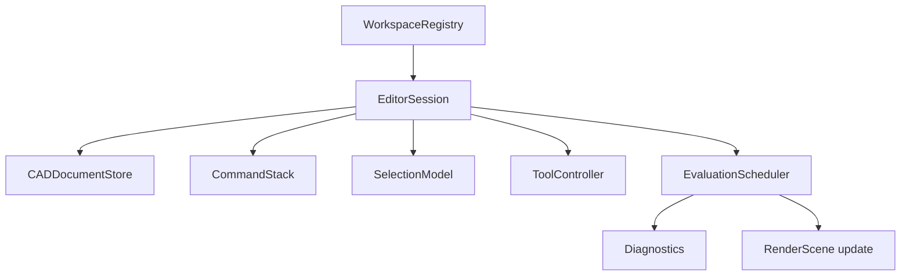

### DocumentGeneration

Each document session carries a monotonically increasing generation.

```swift
public struct DocumentGeneration: Codable, Hashable, Sendable {
    public var value: UInt64
}
```

| Event | Generation rule |
|---|---|
| Successful source mutation | Increment. |
| Failed command validation | Preserve. |
| Evaluation after existing mutation | Preserve. |
| Undo or redo mutation | Increment. |
| Save without source change | Preserve. |

Generation is used by the app, renderer, agent, and CLI to detect stale assumptions.

## Workspace Registry

The app registers open sessions with `WorkspaceRegistry`.

```swift
@MainActor
public final class WorkspaceRegistry: ObservableObject {
    public private(set) var sessions: [DocumentSessionID: EditorSession]

    public func register(_ session: EditorSession)
    public func unregister(_ session: EditorSession)
    public func session(forDocumentURL url: URL) -> EditorSession?
}
```

Session summaries exposed to CLI include:

| Field | Meaning |
|---|---|
| `id` | Stable session identifier for the current app run. |
| `path` | Canonical document file URL path when file-backed. |
| `dirty` | Whether the session has unsaved changes. |
| `generation` | Current document generation. |
| `documentName` | Display name. |

### Document Identity

Open document matching uses a canonical document identity before falling back to path text.

| Identity signal | Role |
|---|---|
| Security-scoped bookmark or persistent file reference | Preferred identity for sandboxed app documents when available. |
| Canonical file URL | Primary path-based identity for CLI and app coordination. |
| File system file ID | Optional stronger same-file check on supported platforms. |
| Normalized path string | Fallback display and diagnostics value. |

`WorkspaceRegistry` is responsible for hiding these details from CLI commands. CLI callers provide a path or session ID; the agent resolves that input to an open `EditorSession`.

## CLI Modes

`rupa` supports explicit and automatic execution modes.

| Option | Behavior |
|---|---|
| `--auto` | Default. Use live mode when the target document is open in the app, otherwise file mode. |
| `--live` | Require a running app session for the target document. Fail if unavailable. |
| `--file` | Force headless file mode. Fail if the document is open in Rupa unless `--force` is provided. |
| `--force` | Allow a supported override of the normal safety check. |
| `--in-place` | Write mutation back to the input file in file mode. |
| `--output <path>` | Write mutation to a new output file in file mode. |
| `--dry-run` | Apply and evaluate without saving. |
| `--json` | Emit stable JSON output. |

### Mode Selection

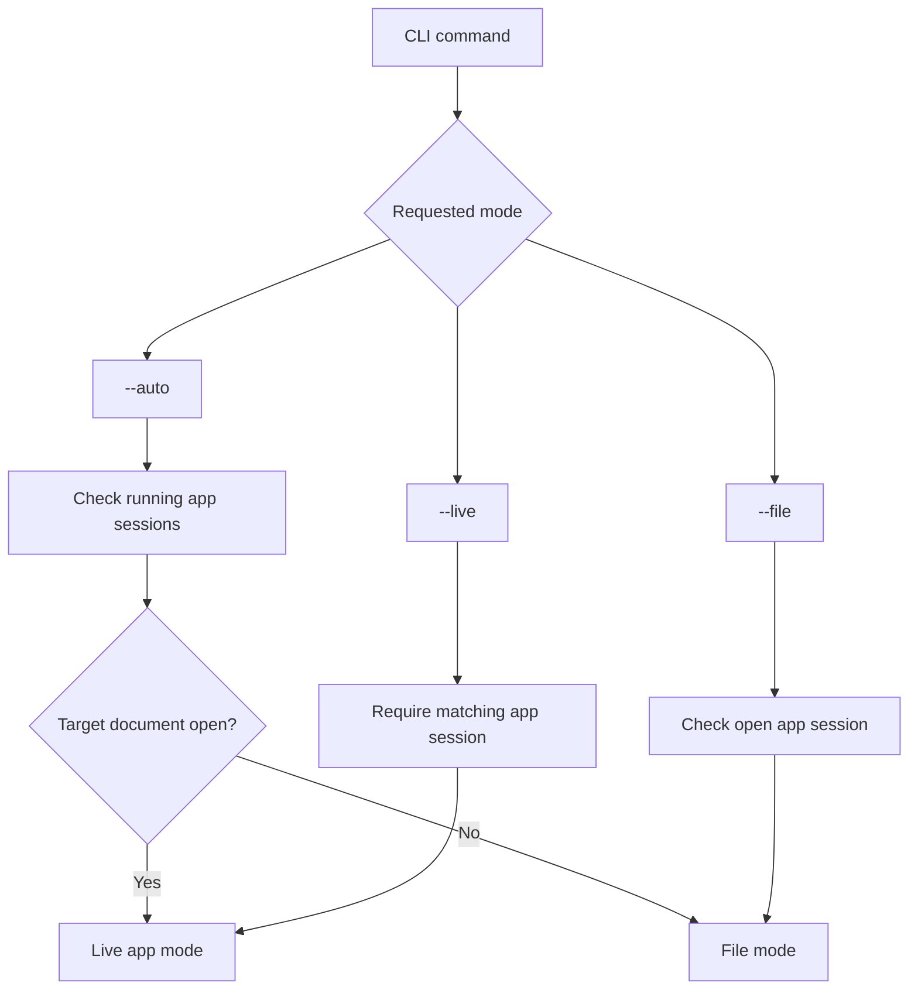

### File Mode

File mode edits a document without a running app session.

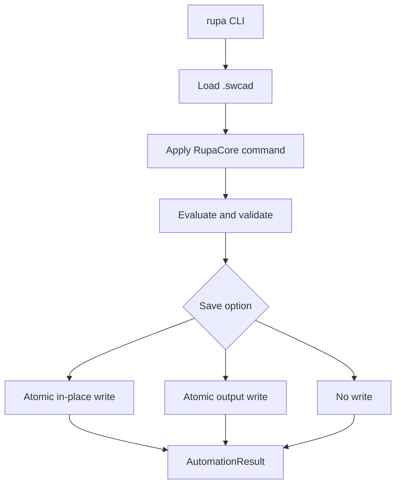

File mode requirements:

| Requirement | Contract |
|---|---|
| Loading | Parse and validate the Rupa package or a legacy Swift-CAD native package before mutation. |
| Mutation | Apply through RupaCore command execution. |
| Evaluation | Evaluate when requested by command options. |
| Writes | Use atomic writes for in-place and output-file saves. |
| Open document check | Refuse direct file mutation when the target is open in the app unless a supported forced path is selected. |

### Rupa Package Format

Rupa uses `.swcad` as the user-facing extension. New saves write a Rupa package with Swift-CAD source plus Rupa metadata. Existing Swift-CAD native packages remain loadable.

| Entry | Meaning |
|---|---|
| `manifest.json` | Package format, schema version, document path, Rupa metadata path, and document timestamps. |
| `document.json` | Swift-CAD `CADDocument` source. |
| `rupa.json` | Display unit, ruler configuration, and `RupaProductMetadata`. |

The file service must validate both the Swift-CAD source and the Rupa metadata after loading.

### Live App Mode

Live mode routes the command to the running app.

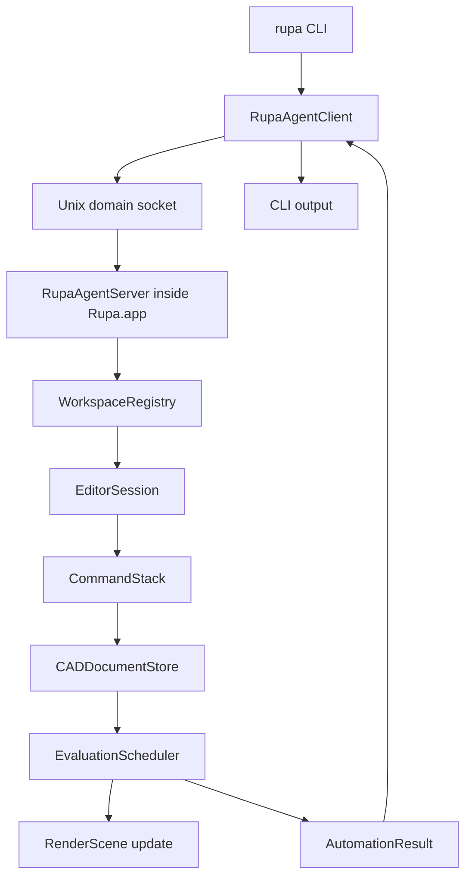

Live mode requirements:

| Requirement | Contract |
|---|---|
| Session resolution | Resolve by canonical document URL or explicit session ID. |
| Mutation | Dispatch into the active `EditorSession`. |
| Undo and redo | Commands participate when the command supports it. |
| UI update | Evaluation snapshots and render invalidation publish through normal app state. |
| Dirty state | Successful unsaved mutations mark the document dirty. |
| Result | Return structured diagnostics, dirty state, generation, and document summary. |

## Agent IPC

### Transport

Initial implementation uses a local Unix domain socket.

| Field | Value |
|---|---|
| Transport | Unix domain socket |
| Message format | JSON-RPC style request and response envelopes |
| Runtime directory | Per-user application support or temporary runtime directory |
| Preferred socket path | `~/Library/Application Support/Rupa/Agent/rupa.sock` |
| Alternate socket path | `$TMPDIR/rupa-agent/rupa.sock` |

The package-level socket listener supports start, stop, stale socket replacement, malformed request recovery, and client/server round trips. App-hosted startup routes open document session mutation through `RupaAgentHost` and `RupaMainActorAgentBridge` so UI-owned `EditorSession` state is read and mutated on MainActor.

### Request Envelope

```json
{
  "id": "request-id",
  "method": "command.apply",
  "params": {
    "document": "/absolute/path/to/document.swcad",
    "expectedGeneration": 42,
    "command": {
      "type": "setParameter",
      "name": "width",
      "expression": "50mm"
    },
    "options": {
      "save": false,
      "evaluate": true
    }
  }
}
```

### Response Envelope

```json
{
  "id": "request-id",
  "result": {
    "success": true,
    "document": {
      "path": "/absolute/path/to/document.swcad",
      "dirty": true,
      "generation": 43,
      "bodies": 1,
      "features": 2,
      "parameters": 3
    },
    "diagnostics": []
  }
}
```

### Error Envelope

```json
{
  "id": "request-id",
  "error": {
    "code": "document.generationMismatch",
    "message": "The document has changed since the CLI command was prepared."
  }
}
```

## Agent Methods

| Method | Purpose |
|---|---|
| `agent.status` | Return server status, socket path, and session count. |
| `sessions.list` | Return open document session summaries. |
| `command.apply` | Apply one automation command to an open session. |
| `batch.apply` | Apply an ordered automation batch to an open session. |
| `document.save` | Save an open document through its app session. |
| `document.evaluate` | Evaluate an open document through its app session. |
| `document.meshSummary` | Summarize generated meshes for an open document through its app session without mutating source. |
| `document.measure` | Measure an open document through its app session without mutating source. |
| `document.export` | Export an open document session to an exchange artifact without mutating source, using the same `RupaExportOptions` as file-mode CLI export. |

## Stable References

Automation references must remain stable enough for scripts and agents to target document objects across regeneration.

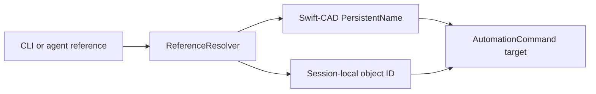

| Reference kind | Contract |
|---|---|
| Parameter name | Resolves through the document parameter table. |
| Feature name or ID | Resolves through the design graph and command context. |
| Persistent topology name | Uses Swift-CAD persistent naming for generated topology. |
| Session ID | Resolves through `WorkspaceRegistry` only for the current app run. |

`ReferenceResolver` owns user-facing and agent-facing lookup rules. RupaCore commands receive resolved typed references.

## Locking and Coordination

Rupa uses document locking to avoid app and CLI conflicts.

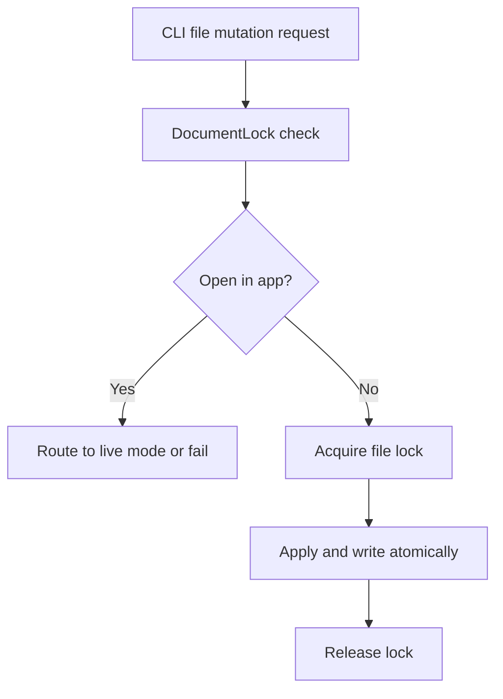

| Requirement | Contract |
|---|---|
| Open document detection | `WorkspaceRegistry` exposes file-backed open sessions. |
| Direct mutation prevention | File mode refuses open documents by default. |
| Atomic writes | File mode writes to a temporary file and replaces the destination after success. |
| Dirty state | Live sessions expose unsaved state to CLI. |
| Generation validation | Requests may include `expectedGeneration`; mismatches fail before mutation. |
| Lock lifetime | Locks are acquired for the shortest safe mutation window. |

## CLI Commands

Currently implemented command groups:

| Command | Purpose |
|---|---|
| `rupa agent status` | Inspect running agent server status. |
| `rupa sessions` | List open app sessions. |
| `rupa attach <document>` | Resolve and attach to an open file-backed document session. |
| `rupa attach --session <id>` | Resolve and attach to an open document session by session ID. |
| `rupa rename <document> --name <name>` | Rename a closed document file. |
| `rupa rename <document> --name <name> --dry-run` | Validate a file rename without saving. |
| `rupa rename <document> --name <name> --agent-socket <path>` | Refuse file mutation when the agent reports the same file as open. |
| `rupa rename-live <session-id> --name <name>` | Rename an open document through the running app session. |
| `rupa param set <document> <name> <value>` | Set a numeric length, angle, or scalar parameter literal. |
| `rupa param set <document> <name> --expression <formula>` | Set a parameter from a parsed formula using units, parameter references, arithmetic, parentheses, and basic trigonometric functions. |
| `rupa param delete <document> <name>` | Delete a parameter in file, live, or auto mode after dependency validation. |
| `rupa param list <document>` | List file or live-session parameters with resolved values and diagnostics. |
| `rupa sketch line <document> --start-x <value> --start-y <value> --end-x <value> --end-y <value>` | Create a line sketch from numeric length literals. |
| `rupa sketch circle <document> --center-x <value> --center-y <value> --radius <value>` | Create a circle sketch from numeric length literals. |
| `rupa sketch rectangle <document> --width <value> --height <value>` | Create a closed rectangle sketch profile from numeric length literals. |
| `rupa model box <document> --width <value> --height <value> --depth <value>` | Create an extruded rectangular body from numeric length literals. |
| `rupa model cylinder <document> --radius <value> --depth <value>` | Create an extruded circular body from numeric length literals. |
| `rupa model extrude <document> --profile-feature-id <id> --distance <value>` | Extrude an existing closed sketch profile by Feature ID. |
| `rupa eval <document>` | Evaluate a file or matching live session and return generation-keyed diagnostics. |
| `rupa mesh <document>` | Summarize evaluated meshes for a file or matching live session and return body, vertex, triangle, bounds, and diagnostics. |
| `rupa measure <document>` | Measure a file or matching live session and return counts, bounds, profile area, solid volume, and diagnostics. |
| `rupa save <document>` | Save a closed document or matching live session without changing generation. |
| `rupa export <document> --output <path>` | Export a closed or live document to a Swift-CAD exchange format selected by output extension. |
| `rupa export <document> --output <path> --preset <name>` | Export using a named `RupaExportPreset` for format, output unit, and default destination policy. |
| `rupa export <document> --output <path> --destination-policy <policy>` | Override destination behavior with `prompt`, `overwrite`, or `versioned`. |
| `rupa validate <document>` | Validate a closed document file. |

Required command groups:

| Command | Purpose |
|---|---|
| `rupa feature suppress <document> <feature>` | Suppress a feature. |
| `rupa eval <document>` | Evaluate a document. |
| `rupa save <document>` | Save a document. |
| `rupa batch --input <path>` | Execute a batch file. |

All mutating commands accept the relevant mode, save, dry-run, and JSON options.

### Undo and Batch Policy

| Command source | Undo contract |
|---|---|
| GUI command | Participates in undo and redo according to its command definition. |
| Live CLI command | Participates in the app undo stack when the command definition supports undo. |
| Live batch | Records either one batch undo unit or explicit per-command undo units according to batch options. |
| File mode command | Does not participate in app undo because no app session owns the mutation. |

The concrete batch grouping option is an open design detail, but live mode must not bypass the same undo-capable `CommandStack`.

## Automation Results

Every automation result includes enough information for humans, scripts, and agents.

| Field | Meaning |
|---|---|
| `success` | Whether the command or batch completed. |
| `mode` | `live`, `file`, or `dryRun`. |
| `document` | Document summary after execution when available. |
| `generationBefore` | Document generation before mutation when available. |
| `generationAfter` | Document generation after mutation when available. |
| `diagnostics` | Structured diagnostics emitted during validation or evaluation. |
| `evaluation` | Status, evaluated generation, render invalidation, and generated body count when available. |
| `outputs` | Written output paths or exported artifacts. |
| `error` | Typed error when execution failed. |

## Error Codes

Initial error code families:

| Code family | Meaning |
|---|---|
| `agent.unavailable` | No running agent server is available. |
| `agent.connectionFailed` | IPC connection failed. |
| `session.notFound` | No matching app session exists. |
| `document.openInApp` | File mode requested direct mutation of an open document. |
| `document.generationMismatch` | Expected generation does not match current generation. |
| `document.loadFailed` | The document could not be loaded. |
| `document.saveFailed` | The document could not be saved atomically. |
| `command.invalid` | The command payload is invalid. |
| `command.failed` | The command was valid but failed during application. |
| `reference.unresolved` | A document object reference could not be resolved. |
| `evaluation.failed` | Evaluation failed after mutation or dry run. |
| `export.failed` | Export failed. |

CLI exit codes map from these typed errors through `ExitCode`.

## Platform Notes

| Module | Platform note |
|---|---|
| `RupaCore` | Kept UI-free so it can be expanded beyond macOS later without changing document semantics. |
| `RupaUI` | Depends on SwiftUI and platform UI availability. |
| `RupaRendering` | Depends on Metal and platform view bridges. |
| `RupaPreview` | Depends on RealityKit, Quick Look, and USD tooling availability. |
| `RupaAgent` | Initial Unix domain socket implementation is macOS first. |
| `RupaCLIKit` | Testable CLI implementation. Commands that touch live sessions are macOS first through RupaAgent. |
| `RupaCLI` | macOS first. |

If package-wide iOS and visionOS platforms are declared, macOS-only targets and APIs must be guarded explicitly.

## Package.swift

```swift
// swift-tools-version: 6.3

import PackageDescription

let package = Package(
    name: "RupaKit",
    platforms: [
        .macOS("26.0")
    ],
    products: [
        .library(name: "RupaKit", targets: ["RupaKit"]),
        .library(name: "RupaCore", targets: ["RupaCore"]),
        .library(name: "RupaUI", targets: ["RupaUI"]),
        .library(name: "RupaRendering", targets: ["RupaRendering"]),
        .library(name: "RupaPreview", targets: ["RupaPreview"]),
        .library(name: "RupaAutomation", targets: ["RupaAutomation"]),
        .library(name: "RupaAgent", targets: ["RupaAgent"]),
        .library(name: "RupaCLIKit", targets: ["RupaCLIKit"]),
        .executable(name: "rupa", targets: ["RupaCLI"])
    ],
    dependencies: [
        .package(path: "../swift-CAD"),
        .package(url: "https://github.com/1amageek/mac-component", branch: "main"),
        .package(url: "https://github.com/apple/swift-argument-parser", from: "1.5.0"),
        .package(url: "https://github.com/apple/swift-collections", from: "1.1.0")
    ],
    targets: [
        .target(
            name: "RupaKit",
            dependencies: [
                "RupaCore",
                "RupaAutomation"
            ]
        ),
        .target(
            name: "RupaCore",
            dependencies: [
                .product(name: "SwiftCAD", package: "swift-CAD"),
                .product(name: "Collections", package: "swift-collections")
            ]
        ),
        .target(
            name: "RupaUI",
            dependencies: [
                "RupaCore",
                "RupaAgent",
                "RupaRendering",
                "RupaPreview",
                .product(name: "MacComponent", package: "mac-component")
            ]
        ),
        .target(
            name: "RupaRendering",
            dependencies: [
                "RupaCore",
                .product(name: "SwiftCAD", package: "swift-CAD")
            ]
        ),
        .target(
            name: "RupaPreview",
            dependencies: [
                "RupaCore"
            ]
        ),
        .target(
            name: "RupaAutomation",
            dependencies: [
                "RupaCore"
            ]
        ),
        .target(
            name: "RupaAgent",
            dependencies: [
                "RupaCore",
                "RupaAutomation"
            ]
        ),
        .target(
            name: "RupaCLIKit",
            dependencies: [
                "RupaCore",
                "RupaAutomation",
                "RupaAgent",
                .product(name: "ArgumentParser", package: "swift-argument-parser")
            ]
        ),
        .executableTarget(
            name: "RupaCLI",
            dependencies: [
                "RupaCLIKit"
            ]
        ),
        .testTarget(
            name: "RupaKitTests",
            dependencies: ["RupaKit"]
        ),
        .testTarget(
            name: "RupaCoreTests",
            dependencies: ["RupaCore"]
        ),
        .testTarget(
            name: "RupaAutomationTests",
            dependencies: ["RupaAutomation"]
        ),
        .testTarget(
            name: "RupaAgentTests",
            dependencies: ["RupaAgent"]
        ),
        .testTarget(
            name: "RupaCLITests",
            dependencies: ["RupaCLIKit"]
        ),
    ]
)
```

## Test Specification

RupaKit tests are split by module boundary.

| Test target | Required coverage |
|---|---|
| `RupaCoreTests` | Command pipeline, generation, undo/redo, parameters, formula parsing/listing, product metadata, package round trip, evaluation snapshots, render invalidation, file service contracts, and Core-owned canvas click/drag tool activation. |
| `RupaAutomationTests` | Codable schema, batch ordering, parameter mutation, reference resolution, result encoding. |
| `RupaAgentTests` | Message encoding, session resolution, generation mismatch, lock behavior, client/server lifecycle. |
| `RupaUIPackageTests` | App-level agent host lifecycle and MainActor-safe session publication. |
| `RupaRenderingTests` | Viewport scene extraction, projection/unprojection layout, model coordinate mapping, empty-document drag plane behavior, and source-derived hit testing. |
| `RupaCLITests` | Argument parsing, mode selection, file/live parameter workflows, JSON output, exit code mapping. |

Swift tests should be run through `xcodebuild test` with explicit timeouts when an Xcode workspace or project exists. Tests that touch shared files, sockets, or static state must use a shared serialization mechanism.

## Acceptance Criteria

Initial implementation is accepted when these behavior contracts pass.

| Scenario | Expected result |
|---|---|
| GUI parameter edit | Mutation goes through `CommandStack`, increments generation, evaluates, updates diagnostics, and invalidates rendering. |
| CLI parameter edit | `rupa param set` and `rupa param delete` mutate a closed file or live session through the same command path and generation checks. Parsed formulas validate references and cycles before mutation, and deletion rejects still-referenced parameters before mutation. |
| CLI file edit | Closed document loads, mutates through RupaCore, evaluates, and writes atomically. |
| CLI live edit | Open document resolves through `WorkspaceRegistry`, mutates in the app session, updates UI state, and returns JSON when requested. |
| Open document file conflict | `--file` refuses direct mutation of an open document unless a supported forced path is selected. |
| Generation mismatch | Request with stale `expectedGeneration` fails before mutation with `document.generationMismatch`. |
| Dry run | Command validates and evaluates without saving or incrementing persisted file state. |
| Product metadata persistence | Scene/component/material/validation/export/template metadata round-trips through `.swcad` and participates in undo/redo. |
| Sessions JSON | `rupa sessions --json` returns stable session summaries with ID, path, dirty state, generation, and display name. |
| Agent status | `rupa agent status --json` reports running state, socket path, and session count. |
| Stable reference failure | Unresolvable references fail with `reference.unresolved` and actionable diagnostics. |
| CLI dependency boundary | `RupaCLI` builds without importing `RupaUI` or the app target. |

## Implementation Phases

| Phase | Deliverable |
|---|---|
| 1 | Create `RupaKit` package skeleton, products, targets, and baseline tests. |
| 2 | Implement RupaCore session, document store, command stack, generation, and diagnostics. |
| 3 | Implement Automation command schema and batch executor against RupaCore. |
| 4 | Implement CLI file mode with atomic write and JSON output. |
| 5 | Implement WorkspaceRegistry, Agent messages, client/server lifecycle, and live mode dispatch. |
| 6 | Implement RupaUI root editor shell using RupaCore. |
| 7 | Implement Metal viewport bridge and render scene invalidation. |
| 8 | Implement MacComponent detail panes, export surfaces, app-host integration, and contextual properties in the MacComponent Inspector Pane. |
| 9 | Complete universal CAD acceptance use cases for video, 3D print, and architecture workflows without ApplicationProfile branching. |
| 10 | Add deferred ApplicationProfile switching as preset grouping over the completed universal CAD implementation. |

## Open Decisions

| Topic | Decision needed |
|---|---|
| Document format boundary | Confirm whether `.swcad` is a Rupa document package wrapping Swift-CAD source or a direct Swift-CAD native package extension. |
| App sandbox socket path | Validate the final socket location against sandbox and distribution requirements. |
| iPadOS and visionOS CLI exclusion | Decide whether `RupaCLI` is macOS-only in a separate package configuration or guarded in the shared package. |
| XPC migration | Decide the threshold for replacing Unix domain sockets with XPC. |
| Command schema versioning | Define compatibility policy before exposing automation as a public agent surface. |
| Force file mutation | Define the exact supported behavior for `--file --force` when the app has unsaved changes. |
| Batch undo grouping | Decide whether live batches default to one undo unit or per-command undo units. |
| Expected generation policy | Decide which commands require `expectedGeneration` and whether dry-run requires it. |
| Stable reference precedence | Define precedence when multiple reference forms match the same user input. |
| ApplicationProfile schema | Define the future schema only after generic validation rules, export presets, templates, unit defaults, and UI layout settings are stable. |
