# Rupa Specification

## Status

This document defines the initial official implementation specification for Rupa.

| Field | Value |
|---|---|
| Project | Rupa |
| Workspace | `Rupa/Rupa.xcworkspace` |
| App host | `Rupa/Rupa/Rupa.xcodeproj` |
| Shared package | `RupaKit` |
| CLI product | `rupa` |
| User-facing document extension | `.swcad` |
| CAD foundation | Swift-CAD |
| Product requirements | `PRODUCT_REQUIREMENTS.md` |
| Universal CAD requirements | `UNIVERSAL_CAD_REQUIREMENTS.md` |
| Goal statement | `GOAL_STATEMENT.md` |
| CAD quality milestones | `CAD_QUALITY_MILESTONES.md` |
| Implementation status | `IMPLEMENTATION_STATUS.md` |
| Deferred profile layer | ApplicationProfile switching after the universal CAD implementation is complete |
| Initial app platforms | macOS |
| Initial CLI platform | macOS |
| macOS deployment target | `26.0` in current Swift/Xcode toolchains. `24.0` was rejected by clang target validation and must not be committed until the toolchain accepts it. |
| Implementation language | Swift 6 |

## System Overview

Rupa is organized as a thin app host plus one shared Swift package.

```text
3D/
  Rupa/
    Rupa.xcworkspace
    Rupa/
      Rupa.xcodeproj

  RupaKit/
    Package.swift
    Sources/
    Tests/

  swift-CAD/
    Package.swift
```

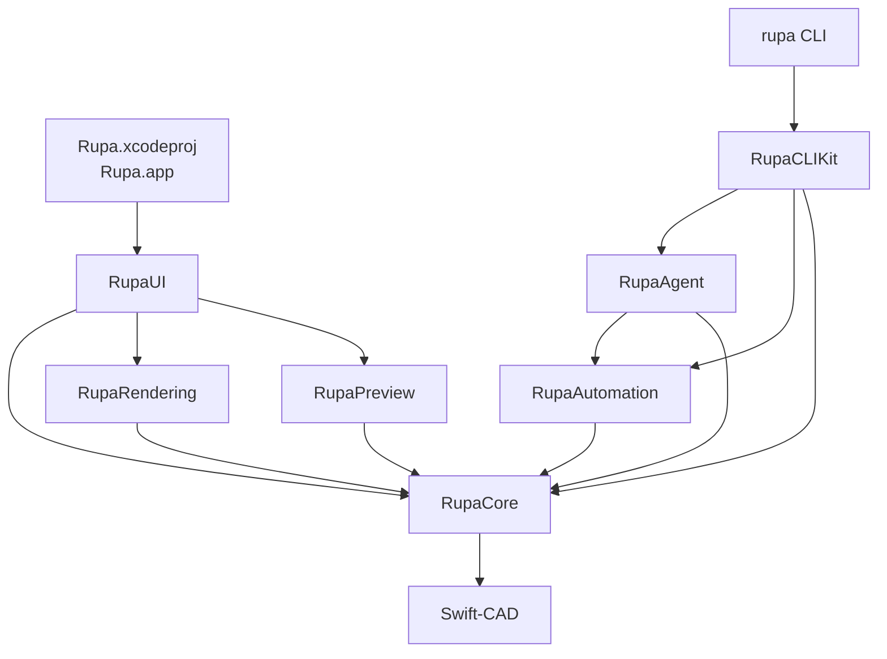

The supported implementation has one editing pipeline:

| Source | Mutation path | Result |
|---|---|---|
| GUI tool | RupaCore command through `CommandStack` | Undoable session mutation and UI update. |
| CLI file mode | RupaCore command on a loaded document | Atomic file write or structured failure. |
| CLI live mode | RupaAgent request into app `EditorSession` | App session mutation, dirty state, diagnostics, structured CLI result. |
| Batch automation | Ordered `AutomationCommand` execution | Ordered results with generation and diagnostics. |

The required product capabilities are defined separately from the implementation graph.

| Requirement document | Scope |
|---|---|
| `PRODUCT_REQUIREMENTS.md` | Product position, acceptance use cases, shared product requirements, workflows, and acceptance criteria. |
| `UNIVERSAL_CAD_REQUIREMENTS.md` | Units, scale, rulers, precision, geometry, components, validation, interoperability, automation, and performance requirements for the single universal CAD model. |

## Reference Modeling Targets

Rupa tracks Plasticity-class modeling as an implementation benchmark while preserving one command surface for UI, Automation, Agent, and CLI. The reference capabilities are not considered implemented until the backing source model, command contract, evaluator, selection targets, diagnostics, and automation access all exist.

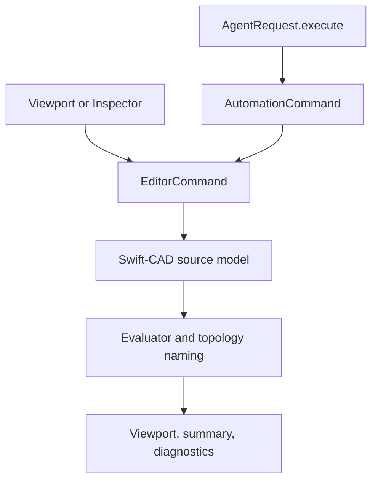

Regular Polygon has a split coordinate contract: normal sketch creation uses the active construction plane, while Knife mode uses the selected generated planar Face as the local support plane before persisting the `FaceKnifeFeature` world-space loop. Viewport drag must preserve selected generated-topology snap world points and selected-Face projected interior points separately from the 2D resolved point so Knife center/radius input can be projected into the selected Face local coordinate system.

| Reference target | Required Rupa command contract |
|---|---|
| Regular Polygon | Create a source-owned regular polygon profile from center, sizing radius, `PolygonSizingMode`, `PolygonInclinationMode`, side count, and rotation angle; preserve a stable command path for UI drag creation, Automation, and Agent execution; keep EditorSession side-count, sizing-mode, inclination-mode, and Knife memory in `PolygonToolState`; route active polygon `Up`/`Down`/`Shift+Scroll`/`C`/`V`/`K` workspace input through that state; keep shared X/Y/Z sketch axis constraint state, tool-scoped `Tab`-cycled dimension input focus, Workspace compact numeric editing, focused Length radius commit, focused Angle rotation commit, focused Width/Height rectangle commit, and geometry-sourced temporary reference-line anchors in `SketchInputState`, applying them to normal polygon viewport drag preview, snap probing, visible guide lines, and final command commit in the active construction plane; when Knife is active, route the polygon draft to `createFaceKnife` instead of `createPolygonSketch`, using a selected generated face target, selected generated-topology snap world points or selected-Face projected interior points when available, and a world-space loop stored in Swift-CAD `FaceKnifeFeature`; reject unsupported target/loop/face geometry before commit where possible and during immediate evaluation otherwise. |
| Offset Curves | Treat Offset Curve as a target-kind dispatcher, not a single geometry shortcut: vertices, planar curves, closed regions, face loops, and solid edges must route to specific source commands with typed unsupported diagnostics, gap-fill policies, symmetric offsets, Slot activation, and snap-driven freestyle distance input. The current vertex branch is `offsetSketchVertex` for supported source line/arc sketch corners and is reachable from `offsetCurve` when a selected source line or arc endpoint supplies `vertexHandle`; Slot activation is represented by `OffsetCurveOptions.mode == .slot` and currently routes supported selected source lines, connected open source line-chains, open source arcs, and connected open line/arc chains into source-owned Slot profile generation; closed source profile regions are Agent/Core discoverable and selectable, and `offsetCurve` now creates new source-owned closed convex line-loop regions with Round, Linear, or Natural gap fill plus simple concave line-loop regions with Natural gap fill, Linear gap fill that miter-connects concave corners while adding straight extra-vertex connections only at convex corners, and Round gap fill that rounds convex corners while mitering concave corners. Non-line sources and collapsing, inverted, or self-intersecting region results fail before mutation. `offsetRegions` handles multi-selected individual output plus same-plane independent disjoint and Natural/Linear polygon-union combined output, including simple concave outer boundaries; broader generated-vertex, spline vertex dispatch, and Round curved-boundary union remain explicit follow-up work. |
| Slot Profiles | Create closed Slot profiles from open non-self-intersecting source curves by symmetric offsets plus tangent end caps. The current command contract supports selected source-line, connected open source line-chain, open source arc, connected open line/arc chain, and sampled open cubic Bezier spline targets through `createSlotSketch`, `offsetCurve` Slot mode, workspace context controls, Inspector open-curve controls, and selected open-curve viewport width arrows; future exact spline boundaries must keep the same source-owned profile and typed rejection behavior. |
| Snapping | Provide a live snap resolver shared by sketch tools, dimensions, construction planes, and Agent-visible diagnostics; candidate output must include snapped coordinate, target reference when available, snap kind, ranking reason, and visible tip data before tool commands consume it. The current slice resolves grid, geometry-sourced temporary reference-line anchors, source-sketch point, endpoint, midpoint, center, quarter-point, closest-curve, arc, source spline CV, source profile region-center, generated topology vertex/edge-end/edge-middle/face-center, generated PolySpline Surface CV, Measurement annotation world-point/source-sketch/source-curve-parameter/generated-topology/generated-edge-parameter anchors for current line and circular BRep edges, supported line/circle/arc intersection, reference-point X/Y/Z source-curve axis candidates, reference-point XY/YZ/ZX source-curve coordinate-plane candidates, reference-point tangent/perpendicular source-curve candidates, construction-plane-projected source/profile/topology/measurement candidates, Ctrl-held object-targeting force enable from viewport modifier flags, and Shift+X hovered-candidate suppression through Core, viewport tip rendering, visible guide-line rendering, Workspace input state, and Agent. Source profile region-center candidates carry `SnapRegionReference`; source profile region targets are discoverable through `sketchEntitySummary` and selectable through `selectTargets`; source-curve axis candidates carry `SnapAxisReference`; source-curve coordinate-plane candidates carry `SnapCoordinatePlaneReference`; generated topology candidates carry persistent topology selection references and preserve source world points while exposing projected snap coordinates; measurement candidates carry `SnapMeasurementReference` with annotation ID, SceneNode, anchor index/role, anchor kind, optional source sketch/source curve/topology/topology edge reference, and resolved source world point, so Agent workflows can reuse the same face/edge/vertex/measurement targets returned by summaries or snap readback; viewport region picking and future non-line/non-circle generated-edge parameter support remain open. |
| Alternative Duplicate / Duplicate Curve and Project / Project Curve Body / Project Outline | Project selected source sketch curves, generated edges, or generated body outlines into editable source-owned curve sketches. The current CPlane contract is `projectSketchCurvesToConstructionPlane`: project source curves or generated line/circular edges onto the supplied or active construction plane along that plane normal; exact projection is supported for source lines, generated line edges, and cubic Bezier splines on any valid target plane, while source circle/arc and generated circular-edge projection require parallel source/target planes. The current face contract is `projectCurvesToGeneratedFace`: project source curves or generated line/circular edges onto one selected generated planar face along that face normal and create the source sketch on the resolved face plane. The current outline contract is `projectBodyOutlinesToConstructionPlane`: selected generated body objects project their generated line/circular edge outlines onto the target construction plane, deduplicate coincident projected front/back edges, skip depth edges that collapse along the projection normal, and produce a source sketch with geometry role `.curve`. These commands expose Core/Inspector/Automation/Agent parity and reject source points, duplicate targets, unresolved generated edges/faces, non-planar generated face targets, non-body outline targets, generated edge kinds other than line/circle, collapsed single-curve projections, empty non-collapsed outlines, nonparallel circular projections until exact ellipse/conic sketch sources exist, invalid planes, invalid output sketches, and stale generations before mutation. |
| Sweep | Select region, face, or curve profiles plus a path curve; optionally select ordered guide curves; expose twist angle, end scale, alignment mode, distance fraction, corner type, simplify, keep-tools, and boolean operation options; produce solids for region or face profiles and sheets for curve profiles. |
| PolySplines | Select mesh bodies; convert them into smooth untrimmed B-spline surface patches; expose rounded corners, merge patches, and exact boundary interpolation options; return patch topology, trim-boundary diagnostics, continuity diagnostics, and mesh suitability warnings. Current implementation starts this contract with `createPolySplineSurface`, which accepts one supported quad mesh represented by two triangles and planar unmerged multi-patch networks, then emits selectable cubic B-spline sheet patch topology through Core, Automation, and Agent. `movePolySplineSurfaceVertex` moves a supported generated PolySpline patch boundary vertex by mutating the owning source mesh vertex while preserving the selected patch and boundary role; selected viewport boundary-vertex drag handles invoke the same command and preview center planar X/Z deltas or selected global X/Y/Z axis-constrained deltas before commit. `polySplineMeshAnalysis` lets Agent callers preflight invalid meshes, rounded-corner requests, non-manifold adjacency, winding issues, supported single-quad candidates, supported planar unmerged patch networks, and unsupported non-planar or merge-required multi-patch meshes with `PolySplinePatchGraph` candidates/conflicts, exact selected/rejected patch partitions, selected shared-edge adjacencies, observed tangent-plane continuity, planar supported-network status, and unresolved curvature-continuity requirements before mutation. |
| Bridge Curves | Select two curve or surface boundary targets; expose continuity level, tangent direction, and tangent magnitude controls; produce an editable source curve rather than a transient display curve. |
| Align Vertex | Align ordered target/reference sketch vertices through a source-owned command, not an Inspector shortcut. The current command supports same-sketch point-backed source point entities, source line endpoints, arc endpoints, and cubic Bezier spline endpoint control points; persists G0 coincidence; adds supported G1 tangent/parallel intent for line-line, line-arc, arc-line, spline-line, and spline-spline endpoint pairs; adds supported G2 smooth intent for spline-spline endpoint pairs by solving endpoint, tangent handle, and curvature handle placement so curve analysis reads back curvature continuity; rejects unsupported target kinds, different sketches, identical references, unsupported continuity pairs, reference-parameter requests, CV continuity distances, and command-scoped curvature display before mutation; and exposes the same contract through Core, Inspector, Automation, Agent capability discovery, and curve analysis readback. |
| Curvature Combs | Evaluate source curves or surfaces into curvature samples; render combs and surface trim boundaries in the viewport; expose trim-boundary geometry and continuity diagnostics to Agent and measurement summaries. |
| Construction Planes | Persist named saved construction-plane source entities, store the active construction-plane ID in document metadata, link construction scene nodes back to saved plane IDs, route default sketch creation through the active plane when no explicit plane is supplied, expose Automation and Agent create/set/read/rename paths, expose CPlane-projected snap resolution for source sketch, profile region, and generated topology candidates, and create saved custom planes from generated Face targets, source profile Region targets, exactly one generated Face plus one generated Edge for perpendicular planes, two or more parallel Face/Region targets separated along the shared normal for midplanes, generated vertex targets, source point sketch entities, source line/arc endpoints, circle/arc centers, and source spline CV targets. Sketch point selection targets are encoded separately from whole sketch entities through point-handle and control-point component IDs, then resolved to `SketchReference` points before CPlane construction. Two point targets require an explicit view normal so the plane can contain both points while remaining camera-parallel; three point targets create an exact point plane; four or more point targets use a non-collinear point normal at the averaged origin. `createViewAlignedConstructionPlane` creates a saved custom plane from an explicit origin and view normal through the same undoable command path. Workspace `Space`/`Shift+Space` on supported face/region, Face+Edge, midplane, generated-vertex point, and source sketch point selected target sets routes to the same command, passes the current viewport projection normal for two-point planes, and activates the created plane; plain `Space` also sends a viewport projection request that aligns the view to the created plane while `Shift+Space` leaves the current view unchanged. Workspace `Ctrl+Space` creates a view-aligned plane through world origin, while `Ctrl+Shift+Space` enters a picked-origin state and commits the next snapped viewport point as the origin. Saved plane rows in the Workspace Plane section activate saved planes, rename them through `renameConstructionPlane`, and expose double-click plus viewfinder affordances that activate and align the viewport to the saved plane through `ViewportProjectionRequest`. Next add stable saved-plane selection targets, editable handles, and broad sketch-on-arbitrary-plane workflow coverage. |
| Dimensions | Store solver-backed dimensions and drawing annotations separately when the same measured value needs both model control and documentation display. |

ApplicationProfile switching is deliberately excluded from the initial package graph. The initial implementation must expose generic validation rules, export presets, templates, unit defaults, and UI layout settings so that a later ApplicationProfile layer can group them without changing RupaCore semantics.

## Required Repository Layout

```text
3D/
  Rupa/
    Rupa.xcworkspace
    Rupa/
      Rupa.xcodeproj
      Rupa/
        ApplicationRoot.swift

  RupaKit/
    Package.swift
    Sources/
      RupaKit/
      RupaCore/
      RupaUI/
      RupaRendering/
      RupaPreview/
      RupaAutomation/
      RupaAgent/
      RupaCLIKit/
      RupaCLI/
    Tests/
      RupaCoreTests/
      RupaAutomationTests/
      RupaAgentTests/
      RupaCLITests/

  swift-CAD/
```

## App Host Specification

`Rupa/Rupa/Rupa.xcodeproj` contains app targets only.

| Area | App host responsibility |
|---|---|
| Lifecycle | Define `@main` app entry and scene setup. |
| Platform integration | WindowGroup, DocumentGroup when introduced, menu commands, app activation. |
| Security | Entitlements, sandbox, security-scoped file access where required. |
| Distribution | Assets, signing, provisioning, bundle metadata. |
| Composition | Import `RupaUI` and start app-level services such as `AgentHost`. |

The app host delegates editor behavior to RupaKit.

| Area | Owned outside the app host |
|---|---|
| CAD document mutation | `RupaCore` |
| Command implementation | `RupaCore` |
| Editor UI implementation | `RupaUI` |
| Rendering implementation | `RupaRendering` |
| Import and export workflows | `RupaCore` and `RupaPreview` as appropriate |
| CLI implementation | `RupaCLIKit` |
| Automation schema | `RupaAutomation` |
| Live app coordination | `RupaAgent` |

```swift
import SwiftUI
import RupaUI

@main
struct ApplicationRoot: App {
    var body: some Scene {
        WindowGroup {
            MainView()
        }
    }
}
```

When live CLI support is enabled, app startup creates the application model and starts the Agent command service.

```swift
import SwiftUI
import RupaUI
import RupaAgent

@main
struct ApplicationRoot: App {
    @StateObject private var appModel = AppModel()

    var body: some Scene {
        WindowGroup {
            MainView()
                .environmentObject(appModel)
                .task {
                    await appModel.startAgentCommandServiceIfNeeded()
                }
        }
    }
}
```

## Package Products

`RupaKit/Package.swift` exposes libraries and one executable.

| Product | Type | Target |
|---|---|---|
| `RupaKit` | Library | `RupaKit` |
| `RupaCore` | Library | `RupaCore` |
| `RupaUI` | Library | `RupaUI` |
| `RupaRendering` | Library | `RupaRendering` |
| `RupaPreview` | Library | `RupaPreview` |
| `RupaAutomation` | Library | `RupaAutomation` |
| `RupaAgent` | Library | `RupaAgent` |
| `RupaCLIKit` | Library | `RupaCLIKit` |
| `rupa` | Executable | `RupaCLI` |

## Package Target Graph

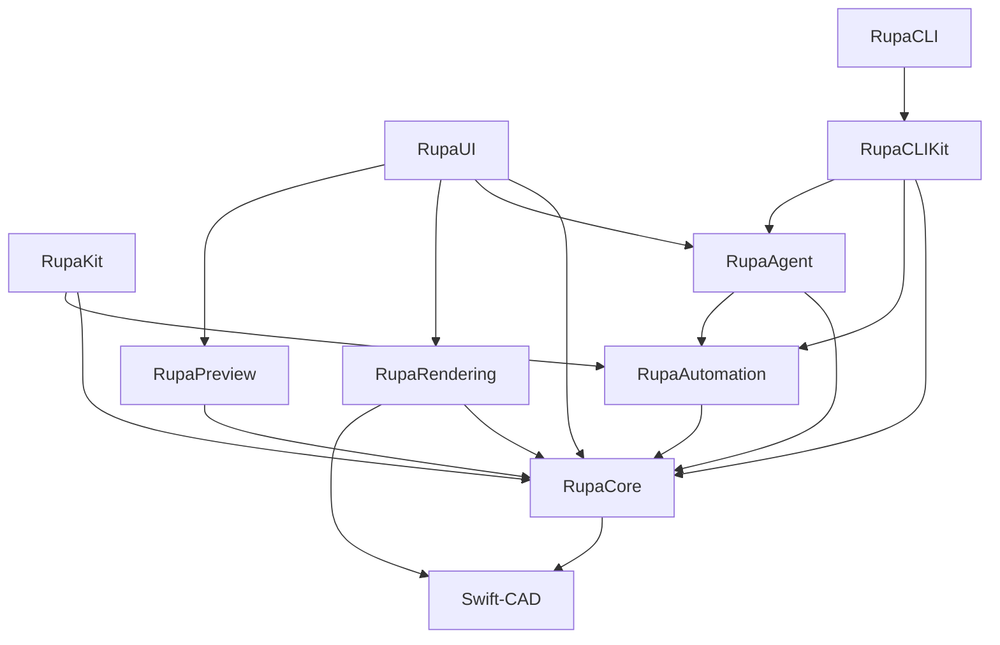

| Target | Dependencies | Responsibility |
|---|---|---|
| `RupaKit` | `RupaCore`, `RupaAutomation` | Umbrella module. |
| `RupaCore` | Swift-CAD, Collections | Editor sessions, document state, commands, evaluation, services, diagnostics. |
| `RupaUI` | `RupaCore`, `RupaAgent`, `RupaRendering`, `RupaPreview` | SwiftUI editor interface and app-facing service lifecycle. |
| `RupaRendering` | `RupaCore`, Swift-CAD | Editor viewport and render-scene extraction from CAD source/evaluated state. |
| `RupaPreview` | `RupaCore` | RealityKit, Quick Look, USDZ preview. |
| `RupaAutomation` | `RupaCore` | Codable command schema, batch execution, stable references. |
| `RupaAgent` | `RupaCore`, `RupaAutomation` | App and CLI coordination over IPC. |
| `RupaCLIKit` | `RupaCore`, `RupaAutomation`, `RupaAgent`, ArgumentParser | Testable CLI command implementation, CAD inspection, typed AutomationCommand application, sketch/model entrypoints, command-backed document mutation, terminal output, and exit mapping. |
| `RupaCLI` | `RupaCLIKit` | Thin `rupa` executable entry point. |

## Target Responsibilities

### RupaKit

Umbrella module for common imports.

```swift
@_exported import RupaCore
@_exported import RupaAutomation
```

`RupaUI` remains separately importable by the app host.

### RupaCore

RupaCore owns the editor model and command pipeline.

| Type | Responsibility |
|---|---|
| `EditorSession` | Coordinates document state, selection, tools, commands, evaluation, and diagnostics. |
| `CADDocumentStore` | Owns the current document value, dirty state, document generation, diagnostics, and evaluation snapshot metadata. |
| `CommandStack` | Applies commands, records undo and redo, and preserves mutation ordering. |
| `DesignDocument` | Wraps Swift-CAD source with Rupa display settings and universal product metadata. |
| `ProductMetadata` | Persists scene nodes, components, material library, validation rules, export presets, and template defaults. |
| `ModelingToolActivationResult` | Reports the Core-owned outcome of tool selection or canvas-target activation, including command name, mutation state, selected scene node, and whether diagnostics should be revealed. |
| `EditorCommand.upsertParameter` | Adds or updates a Swift-CAD parameter by name using typed `CADExpression` and `QuantityKind`. |
| `EditorCommand.deleteParameter` | Deletes a Swift-CAD parameter by name through the undoable command path and rejects deletion while the parameter is still referenced. |
| `EditorCommand.createComponentDefinition` | Creates a reusable generic component definition from existing scene roots without creating a domain-specific document branch. |
| `EditorCommand.createComponentInstance` | Creates a component instance with a local transform and records a component scene reference. |
| `EditorCommand.setSceneNodeVisibility` | Updates scene hierarchy visibility through the undoable command path. |
| `EditorCommand.setSceneNodeLock` | Updates scene hierarchy lock state through the undoable command path. |
| `EditorCommand.setSceneNodeTransform` | Updates a scene node local transform through the undoable command path after validating the transform matrix. |
| `EditorCommand.setComponentInstanceVisibility` | Updates component instance visibility through the undoable command path. |
| `EditorCommand.setComponentInstanceLock` | Updates component instance lock state through the undoable command path. |
| `EditorCommand.setComponentInstanceTransform` | Updates a component instance local transform through the undoable command path after validating the transform matrix. |
| `EditorCommand.createSectionPlane` | Creates a construction section plane scene node through the undoable command path. |
| `EditorCommand.createLineSketch` | Creates a Swift-CAD sketch feature containing one line primitive and records a Rupa scene sketch reference. |
| `EditorCommand.createCircleSketch` | Creates a Swift-CAD sketch feature containing one circle primitive and records a Rupa scene sketch reference. |
| `EditorCommand.createRectangleSketch` | Creates a Swift-CAD sketch profile from typed width and height expressions and records a Rupa scene sketch reference. |
| `EditorCommand.createRectangleSketchFromCorners` | Creates a Swift-CAD rectangle sketch profile from two model-space corner points and records a Rupa scene sketch reference. |
| `EditorCommand.extrudeProfile` | Creates a Swift-CAD extrude feature from a resolved `ProfileReference`, records the graph dependency, and records a Rupa body scene reference. |
| `EditorCommand.createExtrudedRectangle` | Creates a rectangle sketch plus new-body extrude as one undoable command for the initial solid modeling workflow. |
| `EditorCommand.createExtrudedCircle` | Creates a circle sketch plus new-body extrude as one undoable command for the initial cylindrical solid workflow. |
| `EvaluationScheduler` | Runs deterministic Swift-CAD evaluation after source changes and produces generation-keyed evaluation snapshots. |
| `EvaluationSnapshot` | Captures evaluation status, evaluated generation, render invalidation, generated body count, and diagnostics. |
| `RenderInvalidation` | Identifies when renderer-derived state must be rebuilt from an evaluated generation. |
| `MeshSummaryService` | Evaluates source when needed and computes non-mutating mesh body, vertex, normal, triangle, index, and bounds summaries. |
| `MeshSummaryResult` | Reports mesh summary totals, per-body mesh details, display unit, bounds, and diagnostics. |
| `MeasurementService` | Computes structured, non-mutating document measurements from Swift-CAD source intent. |
| `MeasurementResult` | Reports measurement counts, bounds, profile area, solid volume, measured profile details, measured solid details, display unit, and diagnostics. |
| `SaveResult` | Reports successful save path, generation, dirty state, and diagnostics without changing document generation. |
| `DocumentPackageStore` | Reads and writes Rupa `.swcad` packages containing Swift-CAD source plus Rupa metadata. |
| `FileService` | Loads, saves, writes atomically, supports legacy Swift-CAD native packages, and coordinates file access. |
| `DocumentExportService` | Evaluates a Rupa document and writes Swift-CAD exchange output with typed result metadata. |
| `SelectionModel` | Owns selected and hovered `SelectionTarget` values, exposes scene-node references as an object-compatible view for existing commands, validates target compatibility against the current document, and prunes stale references after source or metadata changes. |
| `SnapResolver` | Resolves non-mutating grid and source-sketch input candidates before sketch or dimension commands consume coordinates, returning typed snap kinds, distances, labels, resolved points, source and related-source selection references, source spline CVs, closest points, supported source-curve intersections, and reference-point tangent/perpendicular candidates for UI and Agent callers. |
| `ToolController` | Converts active tool state and canvas gestures into commands. The initial implementation is `EditorSession.activateTool`, `EditorSession.activateSelectedToolFromCanvas`, and `EditorSession.activateSelectedToolFromCanvasDrag`, keeping canvas toolbar selection, viewport click, and viewport drag behavior testable without importing SwiftUI. |
| `Diagnostics` | Stores structured errors, warnings, and notes. |

Required command flow:

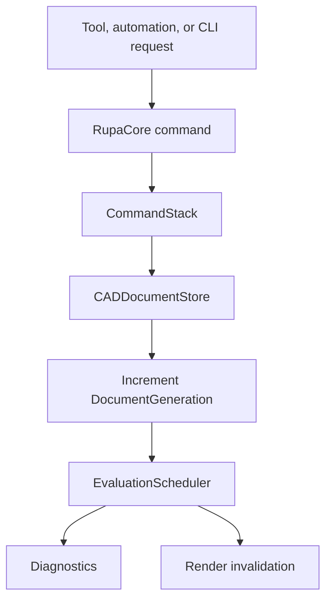

RupaCore is headless. It does not import SwiftUI, MetalKit, RealityKit, or app target code.

### Universal Product Metadata

Rupa-specific product metadata is generic CAD state. It is not an ApplicationProfile, and it must not encode video, print, or architecture as separate branches.

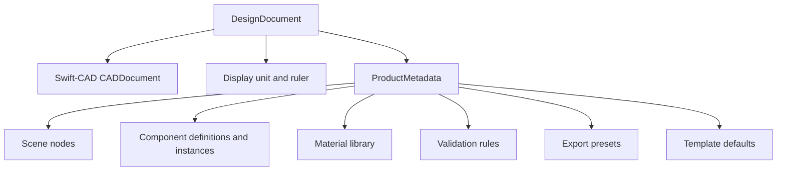

| Metadata type | Contract |
|---|---|
| `SceneNode` | Hierarchical organization for feature, body, sketch, component, and construction references. |
| `ComponentDefinition` | Reusable generic component source grouping scene roots and properties. |
| `ComponentInstance` | Instance transform, visibility, lock state, and overrides. Component creation and instance visibility, lock, and transform state changes must use `EditorCommand`, not direct UI metadata mutation. |
| `MaterialLibrary` | Document-level material table built from Swift-CAD `Material`. |
| `ValidationRule` | Serializable generic validation rule selection and severity. |
| `ExportPreset` | Format, unit, tessellation, validation, metadata, and destination defaults. |
| `TemplateDefaults` | Generic defaults that can later be grouped by ApplicationProfile. |

`ProductMetadata.validate(against:)` checks local hierarchy consistency and references into the Swift-CAD source. Invalid metadata is reported through the same evaluation diagnostics and render invalidation path as CAD source failures.

### Parameter Contract

Parameters are Swift-CAD source, not Rupa-only metadata. Rupa commands provide the editing surface and safety checks.

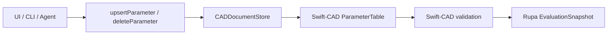

| Concern | Contract |
|---|---|
| Identity | Parameter upsert and deletion resolve by name; upsert preserves the existing parameter ID when updating. |
| Typing | Every command carries a `CADExpression` and `QuantityKind`; Swift-CAD validates expression kind and value. |
| Revision | Successful upsert and deletion advance `ParameterTable.revision`. |
| Undo and redo | Parameter edits, including deletion, participate in `CommandStack` like other source mutations. |
| Deletion safety | Deleting a parameter validates the resulting Swift-CAD document before mutation is committed; references from other parameters or model features reject the command. |
| Automation | Automation and Agent commands expose the same typed parameter upsert and deletion path. |
| CLI | `rupa param set` supports numeric literals and parsed formulas for length, angle, and scalar parameters in file, live, and auto modes. `rupa param delete` uses the same mode and open-document safety model. |
| Listing | `rupa param list` returns parameter IDs, names, kinds, normalized expression strings, resolved values, diagnostics, generation, and dirty state. |

Parameter formulas are saved as Swift-CAD `CADExpression` AST values. Formula input strings are parsed at the command boundary and are not the source of truth after save. Dependency-aware UI editing remains follow-up work.

### Modeling Command Contract

Initial modeling commands are generic CAD source operations. They do not encode video, printing, or architecture branches.

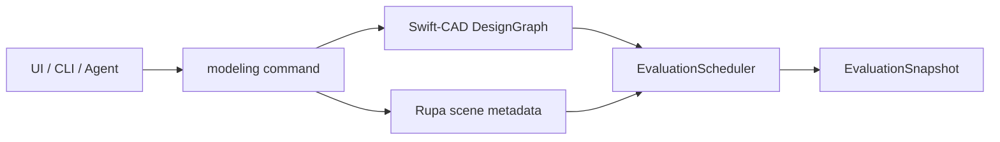

| Command | Contract |
|---|---|
| `createLineSketch` | Adds one Swift-CAD sketch feature with a line primitive, document generation update, undo entry, and scene sketch node. |
| `createCircleSketch` | Adds one Swift-CAD sketch feature with a positive-radius circle primitive, document generation update, undo entry, and scene sketch node. |
| `createArcSketch` | Adds one Swift-CAD sketch feature with a positive-radius partial `SketchArc`, document generation update, undo entry, scene sketch node, and curve object metadata. Full circles are rejected and must use `createCircleSketch`. |
| `createSplineSketch` | Adds one Swift-CAD sketch feature with a cubic Bezier `SketchSpline`, document generation update, undo entry, scene sketch node, and curve object metadata. Control points must satisfy the `3n + 1` cubic segment contract before mutation. |
| `createRectangleSketch` | Adds one Swift-CAD sketch feature with a profile output, rectangle line loop, document generation update, undo entry, and scene sketch node. |
| `addSketchConstraint` | Adds a Swift-CAD `SketchConstraint` to an existing sketch feature as one undoable source mutation, rejecting missing features, non-sketch features, duplicate constraints, and invalid sketch geometry before mutation. Supported `fixed`, `coincident`, `horizontal`, `vertical`, `parallel`, `perpendicular`, `equalLength`, line-to-circle/arc `tangent`, circular `concentric`, circular `equalRadius`, internal cubic spline `smoothSplineControlPoint`, spline endpoint-to-line `splineEndpointTangent`, and spline endpoint-to-endpoint `tangentSplineEndpoints` additions satisfy the new constraint immediately where possible, preserve fixed anchors, support fixed/coincident/smooth/tangent spline control-point references through `splineControlPoint(entity:index:)`, reject unsatisfiable fixed-anchor conflicts, and synchronize single-entity sketch object metadata after geometry changes. |
| `removeSketchConstraint` | Removes one existing Swift-CAD `SketchConstraint` from an existing sketch feature as one undoable source mutation, rejecting missing features, non-sketch features, nonexistent constraints, and invalid post-removal sketch state before mutation. Removing a constraint leaves the current solved geometry in place while updating the source constraint graph for future edits. |
| `createRectangleSketchFromCorners` | Adds one Swift-CAD sketch feature from two model-space corner points, preserving document generation update, undo entry, and scene sketch node semantics. |
| `extrudeProfile` | Requires a resolved existing supported closed sketch `ProfileReference`, adds one Swift-CAD extrude feature with a body output and dependency edge, and fails before mutation when the profile source cannot be resolved, is open, or uses unsupported mixed primitives for profile extraction. Supported sources include closed line loops, single circles, circular-arc loops, and closed cubic Bezier spline profiles. Closed spline profiles are adaptively tessellated into line boundaries before BRep evaluation. |
| `createSweep` | Requires one or more supported closed profile references, one path sketch curve reference, optional guide sketch curve references, optional body target references for boolean operations, and typed sweep options for twist angle, end scale, alignment, distance fraction, corner style, guide method, boolean operation, keep-tools, simplify, and result kind. It adds one Swift-CAD `SweepFeature` with profile/path/guide/target dependency roles and a body or sheet output as an undoable source mutation. New-body sweeps reject target bodies and `keepTools`; boolean sweeps require at least one target body and store those body targets through Core, Automation, Agent, native package validation, and the design graph. The evaluator resolves target body persistent names from the evaluation context, builds the sweep tool body, then applies the B-rep boolean stage. Exact axis-aligned box-prism union, difference, intersection, and slice are implemented with target replacement, keep-tools support, separated-fragment difference output, z-through rectangular-frame output, orthogonal cell-union connected difference output, split-shell slice output, generated-name removal/remapping, and semantic persistent subshape names for box fragments, z-through rectangular frames, and cell-union boundary topology so final B-rep topology and persistent names stay consistent. `EditorSession.createSweepFromSelection` maps a selected sketch profile or selected body source profile plus a separate sketch path target into the same command, and the Sweep tool uses that path from the viewport. The evaluator resolves path and supported guide sketches into `EvaluatedSketchCurve` values, samples the path into `SweepPathFrame` values, and generates B-rep/mesh output for the supported single-profile subset. Identity section transforms on straight open solid paths without guides use the exact extrude evaluator; parallel transformed or guided sections on straight paths with a profile-normal component use the profile-plane parallel polygonal sweep evaluator; identity section transforms on straight sheet paths without guides use a capless exact side-surface evaluator for line and circular-arc profile boundaries; curved paths, non-zero twist angle, non-unit end scale, compatible multiple `point`/`chord` guides, multiple `point` guides requiring non-uniform affine, signed-axis, convex quadrilateral bilinear, or convex mean-value cage rail deformation, `curve` contact guides, or non-exact sheet cases use the polygonal swept evaluator and reject degenerate swept topology before returning invalid geometry. Point guides solve a section similarity transform for one-contact or compatible constraints, a non-uniform affine section transform for multiple non-collinear contacts, signed-axis rail scaling for independent axis-side contacts, convex quadrilateral bilinear rail deformation for four-point profile-enclosing same-orientation guide cages, and convex mean-value cage rail deformation for five-or-more-point profile-enclosing same-orientation guide cages; chord guides solve rotation without scale; curve guides require the path to touch the profile and solve rotating profile-boundary contact without scale. Sheet output is represented as `BodyKind.sheet`, open-shell B-rep topology, `surface` scene metadata, and evaluated mesh display without start/end caps. Polygonal sweep generated topology emits semantic persistent subshape names for ring vertices, ring edges, rail edges, diagonal edges, and side triangles; exact box/frame/cell-union boolean result topology emits semantic persistent subshape names for box corners, box edges, box faces, frame corners, frame edges, outer faces, hole faces, cap faces, and cell-union boundary faces, edges, and vertices so topology summaries and Agent selections do not depend on flat element indexes. Overconstrained guide sets fail with typed diagnostics before invalid geometry is committed. RupaRendering displays evaluated sweep meshes through the generic viewport mesh body path where the exact prism path is not applicable and exposes CPU-projected generated topology face/edge/vertex hits and highlights from the evaluated B-rep. `MeasurementService` reports straight-prismatic sweeps with typed normal-height/path-length dimensions, profile area, volume, and bounds; evaluated solid sweeps report typed path length, profile area, evaluated B-rep volume, mesh-derived surface area, and bounds. Rail deformation beyond the current affine, signed-axis, convex quadrilateral bilinear, and convex mean-value cage point-guide sections, non-box boolean operands, broader connected boolean topology outside the axis-aligned box cell-union subset, exact swept surfaces outside the straight identity analytic-boundary subset, and stable result topology naming beyond the exact box/frame/cell-union boolean subset and across exact-surface rewrites report explicit unsupported evaluation until those kernel stages land. |
| `createExtrudedRectangle` | Adds a rectangle sketch and new-body extrude as one undoable command for the first solid creation workflow. |
| `createExtrudedRectangleFromCorners` | Adds a model-space corner-defined rectangle sketch and new-body extrude as one undoable command for Canvas footprint-based solid creation. |
| `createExtrudedCircle` | Adds a circle sketch and new-body extrude as one undoable command. Swift-CAD evaluates normal-direction circular profiles as exact circular curve edges and cylindrical side BRep faces, while generated meshes remain tessellated for viewport and exchange output. |
| `setCubeDimensions` | Edits a Cube object as center-preserving `Size X`, `Size Y`, and `Size Z` CAD dimensions. Internally this updates the rectangle profile width/height and extrude distance, but public object APIs must not expose it as a single depth property. |
| `setCylinderDimensions` | Edits a Cylinder object as radius plus `Size Y` CAD dimensions. Internally this updates the circle profile radius and extrude distance while preserving the profile center. |
| `moveSketchEntityPoint` | Edits a selected source sketch point reference through `sketchEntity:<featureID>:<entityID>` targets. Supported point edits reject fixed point moves, propagate through `coincident` and circular `concentric` constraints, maintain horizontal/vertical line constraints, and propagate affected `parallel`/`perpendicular` line angle constraints, affected `equalLength` line length constraints, supported line-to-circle/arc tangent constraints, supported spline endpoint-to-line tangent constraints, and supported circular equal-radius constraints before the command commits source and metadata. |
| `moveSketchSplineControlPoint` | Edits one control point of a selected source spline through `sketchEntity:<featureID>:<entityID>` targets. The command rejects non-spline targets, out-of-range control-point indexes, zero or non-finite deltas, fixed control-point moves, and invalid spline geometry before committing source and metadata. Supported `fixed`, `coincident`, smooth internal-knot, endpoint-to-line tangent, and endpoint-to-endpoint tangent constraints use Swift-CAD `splineControlPoint(entity:index:)` references. |
| `setSketchEntityDimension` | Edits a selected source sketch entity dimension through `sketchEntity:<featureID>:<entityID>` targets or supported generated Edge targets that resolve back to one editable source sketch curve. Supported source entities update line length/angle, circle radius/diameter, arc radius/diameter, and arc span angle while storing the matching `SketchDimension`. Circle and arc radius/diameter edits propagate supported circular `equalRadius` constraints. Line length/angle and arc span angle edits preserve fixed endpoints when possible and reject fully fixed conflicting dimensions. Arc span angle dimensions must remain positive partial-arc spans. Supported normal-extrude source profile line-arc-line fillet radius/diameter edits may be driven by the generated circular fillet Edge target directly, preserving the source arc entity ID and re-trimming adjacent source lines. Supported constrained rectangle side edits update the rectangle loop as one profile, preserve fixed rectangle sides when possible, and synchronize generated Cube body metadata. |
| `addSelectionDimension` | Adds one persistent Swift-CAD selection dimension between measurable sketch, generated topology, or object targets as an undoable source mutation. The command stores target references and intended value separately from transient measurement results, validates that the new dimension can be evaluated, updates generation, and leaves drawing-sheet annotation layout as a separate future layer. |
| `setSelectionDimensionTarget` | Updates the target expression of one existing persistent Swift-CAD selection dimension by `SelectionDimensionID` as an undoable source mutation. The command validates the stored dimension kind against the new target quantity, revalidates the CAD document, updates generation, and does not solve arbitrary geometry; residual evaluation reports whether the current model satisfies the new target. |
| `applySelectionDimensionTarget` | Applies the stored target of one existing persistent Swift-CAD selection dimension to supported source geometry as an undoable source mutation. The current supported subset includes source line endpoint distance to line length, source sketch point-to-point distance by moving the first non-fixed source line endpoint, circular center, standalone sketch point entity, or spline control point along its current vector from the other point, falling back to the second non-fixed point when the first point is anchored, source sketch point-to-whole-source-line closest finite-segment distance by moving the non-fixed source point along the current closest-point vector or translating the whole source line in parallel when the point is fixed and both line endpoints are movable, source arc endpoint point-to-point distance by solving the circle intersection that preserves the arc radius and mutates the selected endpoint angle, source circle/arc center-to-curve distance to radius, source line-to-line angle to the first line's relative angle, source arc start/end tangent angle to arc span, and generated opposing editable body face-pair distance to the corresponding object dimension. Already-satisfied zero-distance point dimensions refresh references without requiring a movable point. The command resolves selection references back to source sketch entities or generated topology, routes edits through `setSketchEntityDimension`, `moveSketchEntityPoint`, `moveSketchSplineControlPoint`, `setObjectDimension`, or the internal whole-line translation path, rewrites stored line or arc endpoint parameters when the underlying endpoint parameter changes, and leaves unsupported topology, stale endpoint parameters, invalid targets, non-coplanar source points, point-line dimensions whose point belongs to the measured source line, point-line dimensions with fixed points and non-translatable source lines, arc endpoint point-line dimensions, impossible arc endpoint distance targets, unsupported generated face pairs, and unsatisfied fixed/constraint conflicts as pre-mutation failures. |
| `removeSelectionDimension` | Removes one existing persistent Swift-CAD selection dimension by `SelectionDimensionID` as an undoable source mutation. Missing IDs fail before mutation, the CAD document is revalidated after removal, and the removed dimension no longer appears in measurement, Agent, or CLI selection-dimension readback. |
| `convertSketchLineToSpline` | Converts a selected source line into a cubic Bezier `SketchSpline` through the same `sketchEntity:<featureID>:<entityID>` target. The converted spline preserves the entity ID, uses the original line endpoints as control points 0 and 3, places the inner handles at one-third and two-thirds along the line, migrates endpoint `fixed`, `coincident`, `distance`, and `angle` references to `splineControlPoint(entity:index:)`, migrates supported spline endpoint-to-line tangent constraints to endpoint-to-endpoint tangent constraints, updates single-entity object metadata to Spline, and rejects non-line, line-specific constrained, or zero-length targets before mutation. |
| `offsetCurve` | Implements the Plasticity-style Offset Curve dispatcher as a selected-target command, separate from body-face push/pull. The command accepts `OffsetCurveOptions` with `mode`, one-sided or symmetric output, plus `round`, `linear`, or `natural` gap-fill intent for planar source-curve output. The current source-curve subset supports selected source sketch line, circle, and arc targets: lines create parallel line sketches in the same plane, circles create concentric circle sketches, and arcs create concentric arc sketches while leaving the original curve unchanged. Symmetric output creates both sides from the original source curve. Slot mode interprets the command distance as Slot width and routes supported selected source lines, connected open source line-chains, open source arcs, connected open line/arc chains, and open cubic Bezier splines into the same source-owned tangent-capped Slot profile generation as `createSlotSketch`; Slot mode rejects vertex handles and planar symmetric or gap-fill option combinations before mutation. When the selected source line or arc endpoint supplies `vertexHandle`, or when a generated body vertex on a normal extrude resolves back to a connected source line/arc endpoint, `offsetCurve` dispatches into the Offset Vertex branch and edits the owning sketch through the same source line/arc corner logic as `offsetSketchVertex`; planar offset options are rejected on that branch. When the selected target is a source profile region, `offsetCurve` creates a new source-owned closed line-loop sketch region while preserving the original region: convex source regions support Round, Linear, or Natural gap fill; simple concave source regions support Natural gap fill, Linear gap fill that miter-connects concave corners while adding straight extra-vertex connections only at convex corners, and Round gap fill that inserts circular corner arcs at convex corners while mitering concave corners. Natural gap fill extends offset edges to miter intersections without extra vertices. `offsetRegions` is the multi-region command path and can create individual, same-plane independent disjoint combined, or same-plane Natural/Linear polygon-union combined output with simple concave outer boundaries. Same-sketch disjoint loops are extracted as independent regions; nested, touching, or intersecting same-sketch loops fail until hole-aware or union-aware extraction lands. Zero distances, collapsing circular radii, collapsing, inverted, or self-intersecting region offsets, non-line source regions, Round curved-boundary combined union, hole or multi-boundary polygon union, and unsupported target kinds fail before mutation. Point source entities without a supported line/arc endpoint handle, planar spline offset outside Slot mode, face-loop, edge, generated vertices that cannot resolve to normal-extrude source line/arc endpoints, object targets, closed or branched Slot targets, closed spline Slot targets, and Slot arc widths that collapse the inner radius return typed diagnostics before mutation. |
| `offsetSketchVertex` | Implements the current Offset Vertex subset as a selected source sketch corner command. It accepts selected source line or arc endpoints and inserts two new source vertices on both adjacent curve sides when exactly one coincident adjacent line or arc endpoint exists. The command covers line-line, line-arc, arc-line, and arc-arc source corners, splits lines by distance, splits arcs by arc length while preserving analytic `SketchArc` source geometry, preserves the supported coincident plus line-side horizontal/vertical constraint subset, migrates supported dimensions attached to the original split corner, rejects unsupported constraints before mutation, keeps closed line/arc profiles extrudable, and routes through Core, Automation, and Agent. `offsetCurve` dispatches into this branch when the command payload includes a supported source line or arc endpoint `vertexHandle` or a generated body vertex on a normal extrude resolves back to a connected source line/arc endpoint; planar offset options are rejected on that vertex branch. Selected line/arc endpoints expose Inspector distance controls and viewport vertex-distance arrows that commit through the same command path. Spline vertices, broader generated-vertex cases, broader constraint/dimension migration, and UI workflow coverage remain follow-up work. |
| `createSlotSketch` | Creates a source-owned Slot profile from a selected open source curve target. The current supported subset accepts a selected source line, connected open source line-chain, open source arc, connected open line/arc chain, or open cubic Bezier spline. Line/arc-chain targets validate positive width, non-zero source segment lengths, open-chain topology, non-branching topology, full-circle arc rejection, non-collapsing inner arc radius, connected offset joins, tangent cap validity, and sampled source/profile self-intersection before mutation. Spline targets are sampled through `SketchCurveSampler` into a centerline profile path, reject closed splines before mutation, and reuse the same Slot profile validation. The command creates a closed profile in the same sketch plane from two symmetric offsets plus two tangent semicircular arc caps, stores Slot object metadata including `source.kind`, width, source path length, cap radius, and profile arc tessellation policy, routes through Core, workspace context controls, Inspector open-curve controls, selected open-curve viewport width arrows, Automation, and Agent, and is also reachable through `offsetCurve` Slot mode for the same supported subset. Line-chain, arc, line/arc-chain, and sampled-spline Slot profiles remain extrudable through profile tessellation; points, closed circles, closed or branched line/arc chains, full-circle arcs, closed splines, and unsupported targets return typed diagnostics before mutation. |
| `joinSketchCurves` | Joins two selected source curve targets in the same sketch. Two distinct same-sketch source lines still use the destructive collinear-line subset: exactly one aligned endpoint pair is required, line directions must be collinear, the target line entity ID is retained, the adjacent line entity is removed, safe adjacent outer endpoint `fixed`, `coincident`, `distance`, and `angle` references migrate onto the retained target endpoint, and a `JoinedCurveSource` ownership snapshot stores the original two source lines plus before/after constraints and dimensions. Mixed source line/arc pairs and source arc/arc pairs use non-destructive `JoinedCurveGroupSource` ownership: exactly one aligned line or arc endpoint pair is required, both entities remain in the sketch, a coincident endpoint constraint is appended when absent, typed `SketchCurveJoinContinuity` is stored, and before/after constraints and dimensions are stored for reversible group ownership. G0 records positional ownership. G1 currently requires one source line endpoint and one source arc endpoint that are already tangent; it appends a matching persistent `tangent` constraint and exposes the G1 requirement through curve analysis. G2 is represented as an unsupported request and rejects before mutation until a source continuity solver exists. The command routes through Core, Automation, Agent, direct CLI `rupa sketch join --continuity`, and selected line/arc Inspector controls. It rejects different sketches, same-curve pairs, missing or ambiguous aligned endpoint pairs, non-collinear line-line pairs, unsupported point/circle/spline join targets, existing joined-curve ownership, generated Bridge Curve metadata dependencies, destructive line-join constraints attached to the disappearing interior endpoint, removed-line whole-curve relationships, unsupported G1/G2 continuity requests, non-tangent G1 endpoint pairs, and stale generations before mutation. Spline joins, G2 solve support, downstream profile ownership policy, viewport endpoint-pair picking, and command-dialog diagnostics remain follow-up work. |
| `unjoinSketchCurve` | Restores a prior `joinSketchCurves` ownership source. For destructive line joins, the command requires a selected retained `JoinedCurveSource` line, verifies the current retained line geometry plus constraints and dimensions still match the stored post-join snapshot, restores the original retained and adjacent line sources, restores pre-join constraints and dimensions, and removes the joined-curve ownership source. For non-destructive line/arc and arc/arc group joins, the command accepts any member source curve in a `JoinedCurveGroupSource`, verifies current constraints and dimensions still match the stored post-join snapshot, restores pre-join constraints and dimensions while leaving member entities intact, and removes the group ownership source. It routes through Core, Automation, Agent, direct CLI `rupa sketch unjoin`, and selected line/arc Inspector controls. It rejects targets without joined-curve ownership, changed joined geometry for destructive line joins, changed group constraints or dimensions, restored entity ID collisions, generated Bridge Curve metadata dependencies, and stale generations before mutation. |
| `cutSketchCurve` | Cuts one source curve target by a distinct source cutter curve in the same sketch plane. The current supported target subset accepts source lines, source arcs, sampled open cubic Bezier splines, and unconstrained source circles. The current cutter subset accepts source lines, circles, arcs, and sampled open cubic Bezier splines; line cutters can be extended through `CutCurveOptions.extendsCutter`, arc cutters can use `extendsCutter` to cut with their base circle, and spline cutter extension plus screen-space direction remain unsupported. Open line, arc, and spline target cuts resolve cutter intersections before mutation and then delegate each split to `splitSketchCurve`, preserving the shared split-vertex, endpoint-reference, Bridge Curve metadata, and dimension/constraint validation behavior. Spline target and cutter intersections are discovered from sampled cubic Bezier curve segments and converted back to normalized target parameters; the resulting source output remains cubic Bezier segments through de Casteljau splitting. Circle target cuts require exactly two distinct intersections and replace the circle with two source arcs with coincident arc endpoints. The command rejects same-curve target/cutter pairs, different sketch planes, unsupported target/cutter kinds, closed spline targets or cutters, constrained or dimensioned circle targets, endpoint-only intersections, line cutter misses without `extendsCutter`, tangent circle-target cuts with fewer than two distinct intersections, coincident circular curve intersections, unsupported Split Segment references, and stale generations before mutation. |
| `offsetBodyFace` | Applies a source-owned offset to a selected body face target. Editable rectangle extrude bodies support left/right/top/bottom profile edits, back depth edits, and front depth edits plus scene-node Y translation so the opposite face remains fixed. Editable cylinder bodies support side radius edits plus front/back depth edits. Targets can be the initial fixed body-face IDs or `generatedTopology:<persistentName>` IDs resolved from `document.topologySummary`. Unsupported faces or body types fail before mutation. |
| `chamferBodyEdges` | Applies a source-owned chamfer to selected body edge targets. Editable normal rectangle extrude vertical corner edges and generated vertical profile edges now resolve through the same ordered profile-loop rewrite path. The rewrite supports literal line loops and line+arc loops whose selected target maps to a line-line or line-arc source vertex; source elements are trimmed by path distance, existing arcs preserve their stored `SketchArc` geometry even when the ordered loop traverses them from `arcEnd` to `arcStart`, and a new chamfer line is inserted between the trimmed endpoints. Rewritable loops must not contain sketch dimensions, parameterized expressions, or constraints beyond endpoint `coincident` plus line `horizontal`/`vertical`; unsupported source state fails before mutation instead of dropping source intent. Targets can be the initial fixed body-edge IDs or `generatedTopology:<persistentName>` IDs resolved from `document.topologySummary`. The resulting body is marked as a source-edited solid instead of a Cube object. Unsupported edge targets, mixed body targets, unsupported profile loops, non-normal extrudes, and collapsing chamfer distances fail before mutation. |
| `filletBodyEdges` | Applies a source-owned fillet to selected body edge targets. Editable normal rectangle extrude vertical corner edges and generated vertical profile edges now resolve through the same ordered profile-loop rewrite path. The rewrite supports literal line loops and line+arc loops whose selected target maps to a non-tangent convex line-line, line-arc, arc-line, or arc-arc source vertex. Source lines and arcs are trimmed by path distance, existing arcs preserve their stored `SketchArc` geometry even when the ordered loop traverses them from `arcEnd` to `arcStart`, and selected corners are stored as exact `SketchArc` entities. Rewritable loops must not contain sketch dimensions, parameterized expressions, or constraints beyond endpoint `coincident` plus line `horizontal`/`vertical`; unsupported source state fails before mutation instead of dropping source intent. The validated segment count is saved as profile-arc tessellation policy for evaluation/display/export compatibility and does not polygonize the source arc. Targets can be the initial fixed body-edge IDs or `generatedTopology:<persistentName>` IDs resolved from `document.topologySummary`. The resulting body is marked as a source-edited solid instead of a Cube object. Unsupported edge targets, mixed body targets, unsupported profile loops, non-normal extrudes, invalid segment counts, tangent-continuous arc-adjacent targets, and collapsing fillet radii fail before mutation. |
| Sketch-only evaluation | A document with valid sketch source and no body-producing active feature evaluates as valid with zero generated bodies. |
| CLI sketch | `rupa sketch line`, `rupa sketch circle`, and `rupa sketch rectangle` expose primitive sketch creation in `auto`, `file`, and `live` modes using numeric length literals. |
| CLI modeling | `rupa model box`, `rupa model box-corners`, and `rupa model cylinder` expose initial solid workflows in `auto`, `file`, and `live` modes using numeric length literals; `rupa model extrude` extrudes an existing closed sketch profile by Feature ID through the same mode model. |
| CLI dimension | `rupa dimension add-selection`, `rupa dimension set-selection`, `rupa dimension apply-selection`, and `rupa dimension remove-selection` persist, retarget, apply supported source line length, fixed-aware source sketch point-to-point distance including standalone sketch point entities and fixed-first fallback to a second movable point, source sketch point-to-whole-source-line closest finite-segment distance, solved arc endpoint distance, and spline control-point distance, circle/arc radius, line relative angle, and arc span selection dimensions, and remove selection dimensions in `auto`, `file`, and `live` modes using the same open-document safety model as other mutating commands. |

General constraint solving, broader spline curvature constraints, exact spline BRep boundary preservation, drawing-sheet annotation layout, Metal identity-buffer generated-topology picking, direct viewport constraint handles, exact spline Slot boundary generation, general trim-curve editing, arbitrary NURBS surface editing beyond the current direct B-spline source subset and PolySpline corner/strict interior control-point subsets, evaluated UVN handles beyond the current strict interior Surface CV command path and selected boundary-vertex constraints, general kernel fillet/chamfer, tangent-continuous curve blending, continuity-driven smooth Loft, exact smooth rail-surface solving, rail-style sweep guide deformation beyond the current affine, signed-axis, convex quadrilateral bilinear, and convex mean-value cage point-guide sections, bridge surfaces, patch, and the broader feature set remain follow-up work. Selected-source-curve viewport dimension callouts exist for line length/angle, circle radius, and arc radius/span angle; line length, line angle, circle radius, arc radius, and arc span angle labels can be dragged to commit source dimensions through `setSketchEntityDimension`. Persistent selection dimensions can be created, target-edited, evaluated, removed, undone, redone, automated, discovered by Agent capabilities, mutated through CLI, and applied to the current source-line endpoint distance, same-plane source sketch point-to-point distance for non-fixed line endpoint/circle center/arc center references, standalone sketch point entities, first-fixed/second-movable source point pairs, same-plane source sketch point-to-whole-source-line closest finite-segment distance targets for non-arc source points or fixed-point/movable-line pairs, same-plane source arc endpoint point-distance targets with a valid circle-intersection solution, same-plane source spline control-point distance targets, source circle/arc radius, source line relative angle, and source arc span angle subsets without conflating them with drawing-sheet annotations or claiming arbitrary geometry solving before the solver exists. Already-satisfied zero-distance point dimensions refresh references without requiring a movable point. Initial fixed-aware point-reference propagation exists for `coincident` plus horizontal/vertical line constraints, initial affected-line angle propagation exists for `parallel`/`perpendicular` line angle constraints, equal-length line propagation exists for `equalLength` line constraints, initial line-to-circle/arc tangent propagation exists for `tangent` constraints, circular center propagation exists for `concentric` constraints, circular radius propagation exists for `equalRadius` constraints, spline control points have Swift-CAD point references for fixed/coincident constraints, endpoint reference and spline endpoint tangent migration, supported smooth internal-knot constraints, endpoint-to-line tangent constraints, and endpoint-to-endpoint tangent constraints, and fixed-aware constrained rectangle side dimension propagation exists through `setSketchEntityDimension`. `SketchArc` exists for source-owned curve loops, direct Agent/Core arc sketch creation, selected source line-to-arc conversion, Slot tangent end caps, open source arc Slot profiles, connected open line/arc chain Slot profiles, and one-shot viewport Arc tool creation. `SketchSpline` exists for source-owned cubic Bezier curve sketches, sketch summary, viewport rendering, control-point hit testing, measurement bounds, Inspector, selected viewport, Agent/Core control-point edits, selected source line-to-spline conversion with endpoint reference and spline endpoint tangent migration, one-shot viewport Spline tool creation, sampled open-spline Slot profile generation, and closed profile extrusion through adaptive tessellation. `offsetSketchVertex` exists for source-owned line/arc sketch vertex offset through Core, Automation, and Agent; `offsetCurve` dispatches into the same branch when a source line or arc endpoint `vertexHandle` is supplied; the branch splits adjacent source lines by distance and adjacent source arcs by arc length, inserts the two new vertices required by the Offset Vertex subset, preserves analytic `SketchArc` source geometry, migrates supported split-corner dimensions, and rejects unsupported constraints, disconnected arc-span dimensions, or planar offset options before mutation. `createSlotSketch` exists for source-owned selected source-line, connected open source line-chain, open source arc, connected open line/arc chain, and sampled open cubic Bezier spline Slot profiles with tangent semicircular caps, workspace context controls, Inspector open-curve controls, selected open-curve viewport width arrows, Core/Automation/Agent access, and closed-profile extrusion compatibility. `SweepFeature` exists for source-owned sweep history with explicit profile/path/guide/target roles and Automation/Agent command access; the Sweep tool can create that source from selected profile/path targets; Core and Agent can store body target references for boolean sweep operations while rejecting targetless boolean operations and new-body targets before mutation; its evaluator resolves identity straight paths into the exact prismatic solid subset, resolves curved paths, twist, end scale, compatible multiple point/chord guides, non-uniform affine point-guide rail deformation, signed-axis point-guide rail deformation, convex quadrilateral bilinear point-guide rail deformation, convex mean-value cage point-guide rail deformation, or curve-contact guides into a polygonal swept-solid subset with semantic generated topology names, resolves straight identity sheet output for line and circular-arc profile boundaries into capless exact open-shell side surfaces with `surface` scene metadata, resolves non-exact sheet output into an open-shell polygonal swept-sheet subset, and resolves exact axis-aligned box-prism union/difference/intersection/slice booleans with target replacement, separated-fragment difference output, z-through rectangular-frame difference output, orthogonal cell-union connected box difference output, keep-tools generated-name coverage, and semantic exact box/frame/cell-union boolean topology names; evaluated mesh bodies expose generated face/edge/vertex topology hit and highlight targets; `MeasurementService` reports typed sweep dimensions, volume, surface area where mesh-backed, and bounds for the supported sweep solid subsets, while rail deformation beyond the current affine, signed-axis, convex quadrilateral bilinear, and convex mean-value cage point-guide sections, non-box boolean operands, broader connected boolean topology outside the axis-aligned box cell-union subset, exact swept surfaces outside the straight identity analytic-boundary subset, Metal selection-buffer picking, broader mass-property diagnostics, and stable result topology naming beyond the exact box/frame/cell-union boolean subset and across exact-surface rewrites remain explicit unsupported evaluation cases. `LoftFeature` exists for source-owned ordered profile sections, optional guide curves, explicit section seam starts, ruled or smooth surface mode, solid or sheet output, and sheet-only closed section loops; the evaluator matches or boundary-progress resamples profile loops, uses guide endpoints to lock first and last section seams when explicit section starts are absent, inserts rail-following intermediate section rings for the multi-section multi-guide subset, and emits degree-1 ruled B-spline side faces or smooth cubic section-direction B-spline side faces plus cubic connector edges for open section chains with generated body/face/edge/vertex names. `Profile.boundarySegments` preserves line and circular-arc boundaries across profile extraction; closed spline profiles currently produce tessellated line boundaries, and collinear split vertices remain valid profile vertices when adjacent edges have non-zero length and the loop is still convex. Normal-direction circular-arc extrusion preserves analytic circular BRep edges and cylindrical side faces; curved planar faces use ear clipping after boundary sampling so concave line-chain Slot caps, open-arc Slot loops, connected open line/arc chain Slot loops, and sampled open-spline Slot loops remain meshable. Agent capability discovery returns structured descriptors for each supported command, including mutation behavior, discovery surfaces such as topology or sketch-entity summaries, compatible target kinds, and failure contracts, so Agent workflows can choose face, edge, vertex, and source-curve operations without relying on command-name guessing.

### Object Type Contract

Rupa exposes creation and inspection as Object types, not as raw implementation features such as extrude depth. An Object type can describe a 2D source representation, a 3D generated representation, or a Text representation while still presenting one object-centered property model.

Rupa uses the common CAD distinction between object occurrence, source definition, feature history, and generated geometry. A selected object is a scene occurrence first. It may point to a body-producing feature, a sketch profile, a component instance, construction geometry, or a future annotation/camera/light object, but the user-facing object identity must not be reduced to a raw Feature ID.

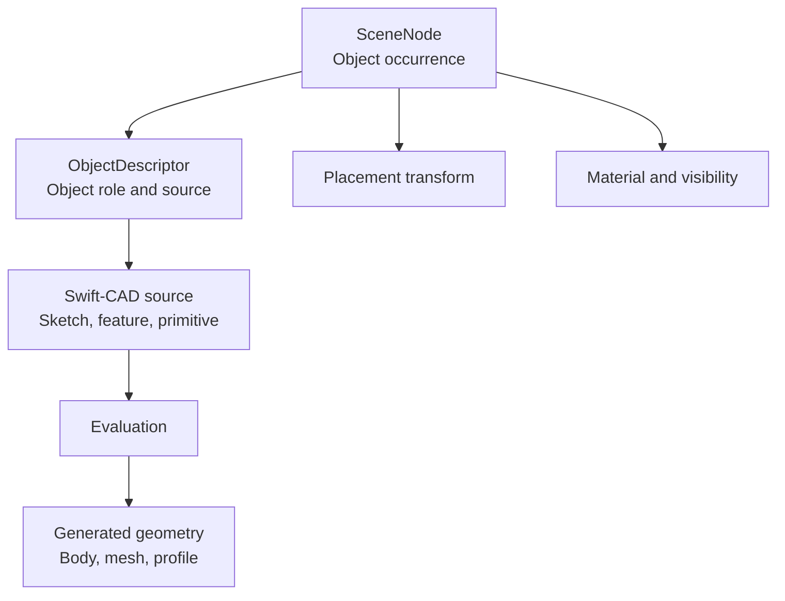

| Layer | Contract |
|---|---|
| `SceneNode` | The selected object occurrence. Owns name, hierarchy, visibility, lock, material binding, local transform, and optional `ObjectDescriptor`. |
| `ObjectDescriptor` | The CAD object contract. Describes category, geometry role, object type ID, flexible property values, source feature, source profile, or component instance. |
| Swift-CAD feature source | The parametric source that creates or supports geometry. This is editable through typed commands, but it is not the primary user-facing object identity. |
| Generated geometry | Derived body/profile/mesh data used for rendering, measurement, picking, and export. It can be regenerated and must not own persistent object identity. |
| Component definition / instance | Reusable definition plus placed occurrence. Instance transforms and overrides belong to the occurrence; shared source belongs to the definition. |

Object types are protocol-backed definitions, not a closed enum. Built-in 2D-source types such as Line, Rectangle, Circle, Spline, Ellipse, Polygon, and Path; 3D types such as Cube, Sphere, Cylinder, Torus, Helix, Cone, Pyramid, Icosahedron, Dodecahedron, and Torus Knot; and Text are provided as an `ObjectTypeDefinition` array in `ObjectTypeCatalog.builtInDefinitions` for the default toolbar/menu. Persistent Object data uses `ObjectTypeID` plus a property bag. New object types must be addable by registering a `ObjectTypeDefinition` that declares source representation, generated representation, Inspector presentation, and rendering bindings.

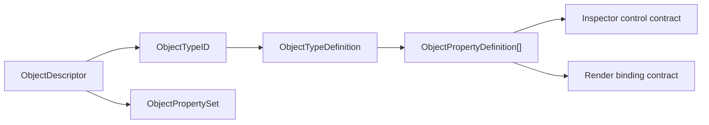

| Contract | Fixed part | Flexible part |
|---|---|---|
| Object type | Stable `ObjectTypeID`, title, icon, source representation, generated representation, category, geometry role | Registered definitions can add new object types without changing document schema. |
| Source representation | `2D`, `3D`, or `Text` | Describes the editable source shape. Path is a 2D source even when it generates a solid. |
| Generated representation | `2D`, `3D`, or `Text` | Describes the output pipeline. Closed profiles and Path resolve this from object properties, so zero-extrusion source can remain 2D while non-zero extrusion generates 3D output. |
| Property value | Typed values: length, number, integer, boolean, angle, text, material | Each object type chooses any number of properties. |
| Inspector | Controls are declared as text field, text field + slider, toggle, segmented, menu, material picker, or read-only | Groups, labels, order, ranges, and editability are object-definition data. |
| Rendering | Render bindings are string-backed semantic IDs such as size X/Y/Z, radius, top radius, side segments, angle, caps, hollow, corner radius, subdivisions, extrusion, bevel, bevel sides, stroke width, text content, font family, and material | Renderer chooses which bindings it supports and can ignore unknown future bindings safely. |

Path is not a purely flat drawing primitive. It owns or references path source data such as points, segments, handles, closure, and winding, while Inspector properties control the generated result. A closed Path can remain a 2D profile, generate a filled surface, or generate a 3D body through extrusion and bevel. Path source data must not be stored as arbitrary Inspector property rows; Inspector properties describe dimensions and modifiers, while path topology belongs to the source representation.

Object `Size` is a CAD dimension, not a viewport scale. It is a unit-aware model-space length that participates in exact editing, measurement, constraints, fabrication, export, and downstream validation. Changing `Size` mutates the shape-defining source parameters or features. Changing `Transform.scale` mutates placement only and must not be used as a substitute for dimensional editing.

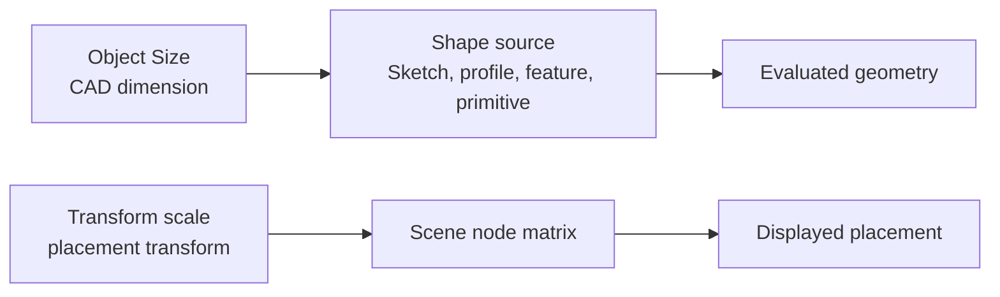

| Concept | Contract |
|---|---|
| `Center X/Y/Z` | The object-space bounding center after source dimensions and local placement are combined. |
| `Size X/Y/Z` | The measured object extents along the object local axes. For Cube this is the primary shape definition. |
| `Transform.scale` | A placement transform for scene-node or instance composition. It can be inspected and edited, but it does not redefine the object's nominal CAD dimensions. |
| Internal feature values | Sketch width, sketch height, extrude distance, radius, and other kernel parameters are implementation details unless the user explicitly opens source or feature editing. |

| Component | Required object properties | Initial backing |
|---|---|---|
| Cube | Center X/Y/Z, Size X/Y/Z, corner controls, material | Rectangle profile plus extrude |
| Sphere | Center X/Y/Z, Size X/Y/Z or Radius, segment controls, material | Follow-up analytic primitive |
| Cylinder | Center X/Y/Z, Size X/Y/Z, Top radius, Bottom radius, Sides X/Y, Angle, Caps, Hollow, Corner, Corner Sides, material | Circle profile plus extrude |
| Torus | Center X/Y/Z, major/minor radius, segment controls, angle, material | Follow-up analytic primitive |
| Helix | Center X/Y/Z, radius, height, turns, pitch, segment controls, material | Follow-up curve/solid primitive |
| Cone | Center X/Y/Z, bottom radius, top radius, height, sides, caps, material | Follow-up analytic primitive |
| Pyramid | Center X/Y/Z, base size, height, sides, material | Follow-up mesh/solid primitive |
| Icosahedron | Center X/Y/Z, radius/size, material | Follow-up polyhedron primitive |
| Dodecahedron | Center X/Y/Z, radius/size, material | Follow-up polyhedron primitive |
| Torus Knot | Center X/Y/Z, major/minor radius, knot parameters, segments, material | Follow-up curve/mesh primitive |

Cube Inspector properties must be represented from the object center and size axes. The Inspector must not show a Cube as only `Depth`; `depth` is an internal extrude parameter and only belongs to source/debug views. Cylinder Inspector properties must expose the Shape group used by the canvas object menu: Size X/Y/Z, Top, Bottom, Sides, Angle, Caps, Hollow, Corner, and Corner Sides. Properties with current kernel support must write through typed RupaCore commands; properties awaiting kernel support may be visible as read-only or disabled controls but must remain part of the component contract.

### Mesh Summary Contract

Mesh summary is derived state. It reads the same evaluated mesh data used by export and must not advance document generation or create undo history.

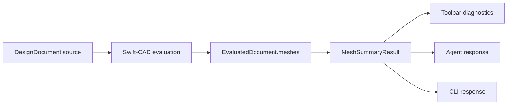

| Concern | Contract |
|---|---|
| Scope | Initial mesh summary reports body count, vertex count, normal count, triangle count, index count, per-body metadata, and axis-aligned mesh bounds. |
| Units | Mesh coordinates remain canonical meters; readable bounds use the document display unit. |
| Non-mutation | UI Mesh, Agent mesh summary, and CLI mesh read source/evaluated data without changing generation, dirty state, or undo stack. |
| Empty source | Valid sketch-only or empty documents return a zero-mesh summary with an informational diagnostic. |
| CLI | `rupa mesh` exposes the same `auto`, `file`, and `live` mode model as other document read commands. |

Mesh repair, decimation, smoothing, material-aware mesh editing, and preview tessellation controls remain follow-up work.

### Sketch Entity Summary Contract

Sketch entity summary is derived state. It reads source sketch features so UI, CLI, and Agent workflows can discover editable source curves before issuing mutation commands.

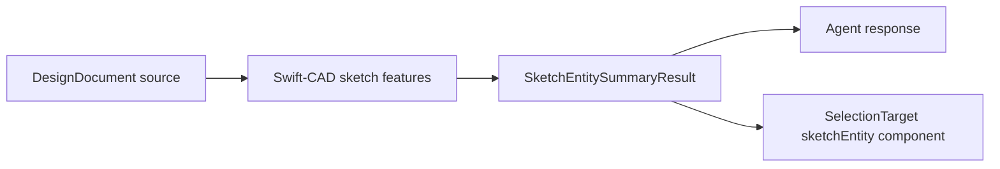

| Concern | Contract |
|---|---|
| Scope | Initial sketch entity summary reports sketch counts and line, circle, arc, spline, and point entries with source feature ID, scene node ID, entity ID, resolved geometry, spline control points, source expressions, related constraints, and related dimensions. |
| Selection bridge | Sketch entity entries expose `selectionComponentID` as `sketchEntity:<featureID>:<entityID>`. Selection validation resolves that component back to the source sketch feature and rejects missing or cross-sketch entity references before storing selection. |
| Non-mutation | Agent sketch entity summary reads source data without changing generation, dirty state, or undo stack. |
| Open work | Exact spline BRep boundary preservation, broader direct curve handles, and broader tangent/curvature solver-driven edits remain follow-up work. |

### Topology Summary Contract

Topology summary is derived state. It reads Swift-CAD evaluated BRep topology and persistent generated names so UI, CLI, and Agent workflows can target generated subobjects without owning identity in rendered meshes.

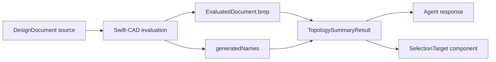

| Concern | Contract |
|---|---|
| Scope | Initial topology summary reports body, face, edge, and vertex counts plus generated entries with persistent name, resolved reference ID, source feature ID, scene node ID, generated role, subshape role, optional index, face center/normal, plane/cylinder surface definitions, line/circle curve definitions, edge trim parameters, edge endpoint, and vertex point metadata. Polygonal sweep generated topology uses semantic subshape roles for ring vertices, ring edges, rail edges, diagonal edges, and side triangles. Exact box/frame/cell-union boolean result topology uses semantic subshape roles for box fragments, z-through rectangular frames, and connected axis-aligned box difference cell-union boundaries. |
| Selection bridge | Face, edge, and vertex entries expose `selectionComponentID` as `generatedTopology:<persistentName>`. Face offset commands can resolve supported rectangle-extrude face entries back to editable source faces. Edge fillet and chamfer commands can resolve supported vertical rectangle-extrude edge entries back to editable source edges, including sharp line-line and non-tangent line-arc, arc-line, or arc-arc vertices in supported line+arc curve-loop profiles after a prior fillet. Vertex move commands can resolve supported generated vertices back to editable rectangle corners or sharp line-line curve-loop source vertices when moving the vertex does not invalidate an adjacent existing arc. Viewport face, edge, and vertex scopes resolve supported heuristic body hits to generated topology component IDs before storing selection, and selected generated face/edge/vertex targets resolve back to viewport highlights. |
| Non-mutation | Agent topology summary reads evaluated data without changing generation, dirty state, or undo stack. |
| Empty source | Valid sketch-only or empty documents return a zero-topology summary with an informational diagnostic. |
| Open work | Metal identity-buffer picking, freeform single-vertex surface edits, and general kernel topology editing remain follow-up work. |

### Boolean Evaluation Plan Contract

Boolean evaluation planning is derived state. It runs the same Swift-CAD Boolean support decision used by mutation, but it must not create a feature, advance generation, change selection, or write undo history.

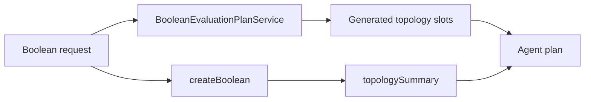

| Concern | Contract |
|---|---|
| Scope | `document.booleanEvaluationPlan` reports operand kind, output topology kind, topology name schemes, B-rep topology counts, primitive counts, ordered preflight checks, unsupported codes, and generated topology slots for the supported exact subset before mutation. |
| Topology slots | Each slot carries a generated subshape role and optional semantic subshape string. The supported exact box, z-through frame, and connected orthogonal cell-union paths emit body, side-face, edge, and vertex slots matching the generated topology names that `topologySummary` later exposes after `createBoolean`. |
| Agent bridge | Agents can use the plan to decide whether a follow-on Face, Edge, or Vertex operation will have a selectable generated topology target. After mutation, the Agent verifies the planned slot by reading `topologySummary` and matching source feature ID, generated role, subshape role, and `selectionComponentID`. |
| Non-mutation | Planning unsupported operands returns structured diagnostics and an empty slot set without mutating source, generation, dirty state, selection, or undo history. |
| Open work | Non-orthogonal solids, curved topology, arbitrary sheet operands, and persistent naming across broad topology rewrites remain follow-up work. |

### Surface Continuity Summary Contract

Surface analysis is derived state. It reads Swift-CAD evaluated BRep topology, generated persistent names, and B-spline surface definitions so UI and Agent workflows can inspect surface flow before exposing surface-editing affordances.

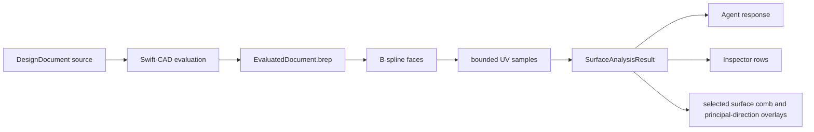

| Concern | Contract |
|---|---|
| Scope | Surface analysis reports B-spline face count, generated face and edge persistent names, source feature linkage, U/V degree and control-net counts, bounded U/V domains, UV sample points, oriented normals, analytic tangents, mean/Gaussian/U/V/principal curvature, principal directions, and U/V curvature-comb samples with finite-difference normal-change-per-length diagnostics. |
| Current support | Planar unmerged PolySpline patch networks produce selected object, generated face, and generated edge analysis readback. Generated B-spline samples include exact derivative curvature/principal-direction data from Swift-CAD plus near-zero normal-change combs for planar faces, and selected viewport overlays use the same samples for comb and principal-direction drawing with workspace visibility and low/standard/high density controls. Agent surface analysis uses the same density contract, `surfaceFrames` resolves generated face UV addresses plus `surfaceSourceSummary` face, surface parameter, and Surface CV selection references into UVN frame data, `setSurfaceFrameDisplay` persists those UVN frame queries for Core, Automation, Agent, and viewport scene rendering as visible U/V/N triads, supported generated PolySpline patch boundary vertices can be moved through a source-owned command from Core, Automation, Agent, and selected viewport boundary-vertex planar or global-axis drag handles, and strict interior Surface CV slides now consume override-aware B-spline control-hull U/V/N directions instead of patch-average directions. |
| Non-mutation | Agent surface analysis, Inspector surface analysis, and viewport surface analysis overlays read evaluated data without changing generation, dirty state, or undo stack. |
| Open work | General trim-curve editing, viewport trim handles, arbitrary NURBS surface editing beyond the current direct B-spline source subset and PolySpline corner/strict interior control-point subsets, evaluated UVN handles beyond the current strict interior Surface CV command path and selected boundary-vertex constraints, and G2 solve output remain follow-up work. |

Surface continuity summary is derived state. It reads Swift-CAD evaluated BRep topology, generated persistent names, and B-spline surface definitions so UI and Agent workflows can inspect patch adjacency before exposing surface-editing affordances.

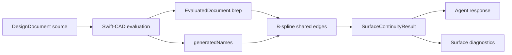

| Concern | Contract |
|---|---|
| Scope | Initial surface continuity summary reports B-spline face count, shared B-spline edge adjacencies, generated face and edge persistent names, position gap, normal angle, G0/G1/G2 status, and whether curvature-continuity solving is still required before G2 can be claimed. The Inspector reads the same summary for selected surface objects or generated B-spline face/edge targets and displays relevant adjacency status without creating mutation affordances. The viewport uses the same summary plus generated topology edge coordinates to draw selected shared-edge continuity overlays without creating a separate continuity classifier. |
| Current support | Planar unmerged PolySpline patch networks with shared B-rep edges report G1 continuity and do not require curvature-continuity solving because their generated B-spline patches are planar. Non-planar G2 patch networks remain unsupported for mutation until a real curvature-continuity solver exists. |
| Non-mutation | Agent surface continuity summary reads evaluated data without changing generation, dirty state, or undo stack. |
| Open work | General trim-curve editing, viewport trim handles, G2 solve output, broader viewport surface controls, and arbitrary NURBS surface editing beyond the current direct B-spline source subset and PolySpline corner/strict interior control-point subsets remain follow-up work. |

### Measurement Contract

Measurement is derived state. It must not advance document generation or create undo history.

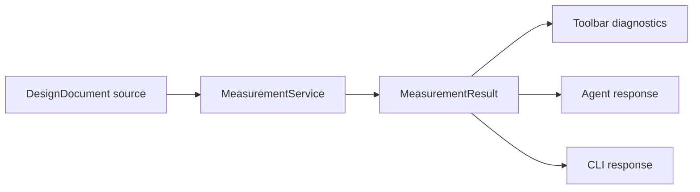

| Concern | Contract |
|---|---|
| Scope | Initial measurement supports sketch primitive counts, spline-aware sketch bounds, closed line-loop profile area, closed spline curve-loop profile area, single-circle profile area, rectangular/circular/spline-profile extrude volume, selected sketch/body measurement, and axis-aligned bounds. |
| Units | Results store canonical meters, square meters, and cubic meters plus the document display unit for readable summaries. |
| Non-mutation | UI Measure, Agent measure, and CLI measure read source state without changing generation, dirty state, or undo stack. |
| Scope reporting | `MeasurementResult.scope` reports whether the result was computed for the whole document or the current selection. |
| Selection | When a sketch scene node is selected, measurement reports that sketch profile and bounds. When a body scene node is selected, measurement reports the selected solid plus the source profile required to compute area and volume. Non-feature scene nodes return an empty selection measurement with diagnostics. |
| Unsupported source | Open sketches and unsupported mixed profile primitives remain counted as source/sketch primitives but do not contribute profile area or solid volume. |
| CLI | `rupa measure` exposes the same `auto`, `file`, and `live` mode model as other document read commands. File mode measures the document; live and auto-live modes use the open session selection when one exists. |

General drawing annotations, face area, arbitrary edge-length annotations, and broader non-source-driving dimensions remain follow-up work. Selected source-curve viewport callouts show line length/angle, circle radius, and arc radius/span angle; explicit drag commits update supported source dimensions through `setSketchEntityDimension`. Persistent selection dimensions can drive supported source sketch distances, radii, angles, and generated opposing editable body face-pair distances through the shared Core command path.

### Export Contract

Export is derived output. It must evaluate the current document source, write atomically, and preserve the document generation and undo history.

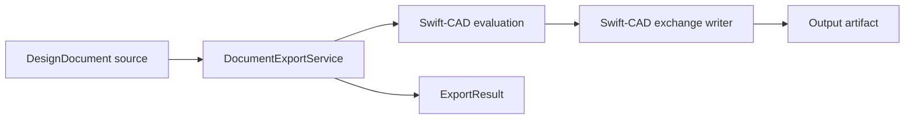

| Concern | Contract |
|---|---|
| File mode | Load the closed `.swcad`, evaluate it, and write the requested exchange file without mutating source. |
| Live mode | Export the running app session so unsaved in-memory edits are reflected in output. |
| Auto mode | Prefer a matching open session; otherwise export the closed file. |
| Safety | File mode rejects open-document conflicts unless explicitly forced. |
| Dry run | Evaluate and resolve the output format without writing an output file. |
| Preset selection | `ExportOptions` may select a `ExportPreset` by ID or name. The selected preset defines the exchange format, output unit, tessellation policy, validation rule references, metadata inclusion preference, and default destination policy. |
| Format check | When a preset is selected, the output path extension must resolve to the same `ExchangeFileFormat` as the preset. Mismatches fail before writing. |
| Output unit | Preset export units are applied to Swift-CAD exchange writers, including micrometer through kilometer scale workflows. Without a preset, the document unit system is used. |
| Destination policy | Export resolves `prompt`, `overwrite`, or `versioned` before writing. `prompt` refuses an existing path, `overwrite` replaces it atomically, and `versioned` writes the next available suffixed path. |
| Errors | Evaluation failures return `evaluation.failed`; output failures return `export.failed`. |
| Results | `ExportResult` includes format, final output path, byte count, generation, dry-run flag, preset name, output unit, destination policy, and diagnostics. |

### Evaluation Contract

Evaluation is derived state and must not advance document generation or write undo history.

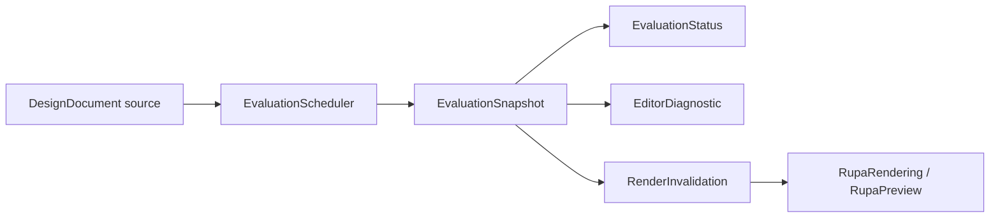

| Case | Required result |
|---|---|
| Valid generated document | `.valid`, current evaluated generation, generated body count, info diagnostic, and `.evaluated` render invalidation. |
| Empty valid document | `.valid`, current evaluated generation, zero bodies, info diagnostic, and `.evaluated` render invalidation. |
| Evaluation failure | `.failed`, current evaluated generation, error diagnostic, zero bodies, and `.evaluationFailed` render invalidation. |
| Undo or redo | Restore source snapshot, advance generation as a mutation, then evaluate the restored source. |
| Validation command | Evaluate without creating an undo entry. |
| CLI or Agent eval | Evaluate the file or live session without creating an undo entry or advancing generation. |
| Save | Validate and persist source without advancing generation or creating undo history; live save marks the session clean. |

The initial scheduler is synchronous and deterministic. A later asynchronous scheduler must keep the same snapshot contract, discard stale completions by generation, and avoid capturing UI-owned state outside MainActor boundaries.

### RupaUI

RupaUI contains the complete SwiftUI editor surface.

The root editor shell uses SwiftUI's native sidebar model for the leading component Browser column. The sidebar controls scene/component hierarchy, visibility, lock state, and component instances through RupaCore commands. The sidebar is not a modeling tool palette. Modeling tools are canvas-local controls shown as a floating Liquid Glass toolbar on the bottom edge of the viewport. Toolbar buttons call `EditorSession.activateTool` and only change the active tool. Viewport clicks call `EditorSession.activateSelectedToolFromCanvas`, viewport drags call `EditorSession.activateSelectedToolFromCanvasDrag`, and geometry is created from the canvas target or model-space coordinates rather than from toolbar selection alone. Creation tools are single-use: after a successful `Sketch`, `Surface`, `Solid`, or `Section` mutation, `EditorSession` returns the active tool to `Select`; rejected activations keep the active tool. `Select` changes selection mode and picks source-derived sketch/body previews from the initial viewport, Browser and viewport selection are stored in RupaCore `SelectionModel`, `Sketch` creates default-sized rectangle sketches centered on Canvas click coordinates and drag-sized rectangle sketches from Canvas model-space drags, `Surface` creates default-radius circular sketch profiles centered on Canvas click coordinates and drag-sized circular sketches from Canvas model-space center-to-edge drags, `Solid` extrudes a clicked sketch profile when available, creates default-sized rectangular bodies centered on Canvas background click coordinates, and creates drag-sized rectangular bodies from Canvas model-space footprint drags, `Mesh` evaluates and reports a structured generated-mesh summary with bounds and triangle counts from Canvas activation, `Measure` reports a structured clicked or selected-object measurement when a measurable scene node is selected and otherwise reports a document measurement summary with bounds, profile area, and solid volume from Canvas activation, and `Section` creates a construction section plane scene node through `EditorCommand.createSectionPlane` from Canvas activation. `NavigationSplitView` owns the sidebar boundary. The detail column uses `MacComponent` split components for editor panes such as viewport, logs, and the contextual property Pane. The logs pane and the Inspector Pane are collapsed by default. The Inspector Pane uses an ideal default width of about 420 px and must not add custom padding beyond the native control layout.

| File | Responsibility |
|---|---|
| `MainView.swift` | Root editor view exported to the app host. |
| `MainWindow.swift` | Main composition of viewport, component Browser, bottom canvas tool palette, detail panes, inspector, and app model. |
| `DocumentToolbar.swift` | Document-level editor actions such as new document, validation, and inspector visibility. |
| `CanvasToolPalette.swift` | Bottom viewport-hosted Liquid Glass modeling tools and mode controls. |
| `Sidebar.swift` | Component Browser for hierarchy, visibility, lock state, and component instance control; it is not a modeling tool palette. |
| `Inspector.swift` | Contextual property editing hosted in a MacComponent detail Pane. |
| `Timeline.swift` | Feature history and command-aware editing. |
| `ParametersPanel.swift` | Parameter list and bulk editing; contextual parameter properties belong in the Inspector Pane. |
| `ExportPanel.swift` | Export workflow controls. |
| `DiagnosticsPanel.swift` | Structured diagnostics display. |

RupaUI converts user actions into RupaCore commands. It does not mutate `CADDocument` directly.

Selection is UI state owned by `EditorSession`, not CAD source. Selecting, clearing, or hovering selection targets must not advance `DocumentGeneration`, dirty state, or undo history. A selection target is a scene node plus a component identity such as object, face, edge, vertex, or sketch entity. Object targets may point at any existing scene node. Face, edge, and vertex targets require body scene nodes. Sketch-entity targets require sketch scene nodes. Commands, undo, redo, reset, and metadata replacement prune selection entries that no longer exist or are no longer compatible with the current product metadata. The initial viewport consumes the same selection state to highlight source-derived sketch and body previews, maps click hits back to product scene-node references while `Select` is active, maps evaluated-mesh generated topology hits directly to face/edge/vertex components backed by `SelectionComponentID.generatedTopology`, forwards clicked scene-node targets and model-space click coordinates to the active modeling tool when a non-select tool is active, and forwards model-space drag ranges to active tools that create geometry from Canvas gestures. While `Sweep` is active, selected closed profile or body source-profile scene nodes provide the sweep profile, selected sketch curve scene nodes provide optional guide curves, and the clicked sketch curve scene node is the path target; `EditorSession.sweepSelectionPreview` resolves the same profile/path/guide contract without mutating the document so the viewport context panel can show setup state before command execution. The later Metal selection buffer and drag interaction layer must preserve the same Core selection and activation contract.

While `Select` is active, a plain click replaces the current selection with the clicked target resolved by the active selection scope, and a background click clears selection. Object scope resolves hits to object targets. Face scope resolves body face hits to face targets; hits that do not expose a body face produce no selection target, leave the existing selection unchanged, and do not fall back to object selection. Selected editable rectangle-extrude faces can be dragged in the viewport; the transient preview is committed through `offsetBodyFace` on mouse-up. Edge scope resolves the initial vertical body edge hit IDs to edge targets for source-owned rectangle-extrude edge commands; hits that do not expose an editable edge produce no target and do not fall back to object selection. Vertex scope resolves supported rectangle-extrude body vertex hits to generated topology vertex targets; hits that do not expose a supported generated vertex produce no target and do not fall back to object selection.

Source-curve scope resolves source sketch hits to `sketchEntity:<featureID>:<entityID>` targets for point, line, circle, arc, and spline entities; hits that do not expose a sketch entity produce no target and do not fall back to object selection. Dragging a screen-space rectangle is enabled only in object scope; it replaces selection with every selectable object whose projected selectable bounds intersects the rectangle. Holding Command or Shift while clicking or rectangle-selecting changes the intent to toggle: matching targets or objects already in the current selection are removed, and new targets or objects are appended in stable order. Command/Shift background clicks and empty rectangle selections leave the existing selection unchanged.

Hover state is a transient selection preview. Sidebar row hover updates object hover. Viewport hover while `Select` is active updates the hovered selection target for the active selection scope. The viewport must render object hover as a distinct non-committal object highlight, face hover as a face highlight, edge hover as an edge highlight, vertex hover as a vertex highlight, and source-curve hover as a primitive-level curve highlight, while leaving the selected highlight stable. Hover updates must not report diagnostics for background movement, create undo history, mark the document dirty, or advance generation.
Selected object targets must render a transient object-editing affordance in the viewport while object selection scope is active. Object-editing affordance drawing, hover hit testing, and press capture are disabled outside object scope so subobject selection can receive face, edge, vertex, and source-curve hits. Selected face targets render face highlight without whole-body transform handles. Selected edge targets render edge highlights without whole-body transform handles. Selected vertex targets render vertex highlights without whole-body transform handles, except supported PolySpline boundary vertices also expose selected boundary-vertex center and global-axis drag handles that preview and commit source-owned surface edits. Selected source-curve targets render only the selected point, line, circle, arc, or spline primitive as highlighted.

Editable rectangle extrude face targets expose command-backed Face Edit controls in the Inspector and support viewport drag commit through `offsetBodyFace`, including profile side faces and front/back depth faces. Editable cylinder side and depth face targets route through the same `offsetBodyFace` command so Agent/Automation can push/pull cylindrical radius and depth from generated topology targets. Editable rectangle extrude vertical edge targets expose command-backed Edge Edit fillet and chamfer controls in the Inspector, support selected-edge viewport fillet handle drag commit through `filletBodyEdges`, and support selected-edge viewport chamfer drag commit through `chamferBodyEdges`. Generated vertical edges on closed line-loop profiles produced by a prior chamfer and supported line+arc curve-loop profiles produced by a prior fillet can be re-chamfered through `chamferBodyEdges` after re-discovery through `topologySummary` when the selected edge maps to a line-line or line-arc source vertex, and can be re-filleted through `filletBodyEdges` when the selected edge maps to a sharp line-line, non-tangent line-arc, non-tangent arc-line, or non-tangent arc-arc source vertex. Tangent-continuous arc-adjacent generated edges remain a separate curve-blend operation and are rejected before mutation. Existing arcs preserve their stored geometry while the rewritten loop records the required `arcStart`/`arcEnd` traversal in endpoint constraints. These source rewrites accept only literal expressions, no sketch dimensions, and the supported endpoint/horizontal/vertical constraint subset. Editable rectangle extrude vertex targets expose command-backed Vertex Edit controls in the Inspector, support viewport drag commit through `moveBodyVertex`, and can be moved through Agent/Automation as rectangle profile corner moves; generated vertices on supported line+arc curve-loop profiles after a prior fillet can also move when the target maps to a sharp line-line source vertex and neither adjacent line is tangent to an existing arc. Supported generated PolySpline patch boundary vertices expose selected viewport drag handles that preview center planar X/Z movement or selected global X/Y/Z axis-constrained movement and commit through `movePolySplineSurfaceVertex`, the same command used by Automation and Agent.

Editable source-curve targets expose command-backed Curve Edit controls in the Inspector: point and line endpoint moves route through `moveSketchEntityPoint`, supported point moves preserve fixed anchors while propagating `coincident`, horizontal/vertical line constraints, and supported line relationship constraints including `parallel`, `perpendicular`, `equalLength`, line-to-circle/arc `tangent`, spline endpoint-to-line tangent, and circular `concentric`, circle center/radius edits route through `moveSketchEntityPoint` and `setSketchCircleParameters`, arc center/radius/start/end angle edits route through `moveSketchEntityPoint` and `setSketchArcParameters`, spline control-point edits route through `moveSketchSplineControlPoint`, internal cubic spline smooth-knot constraints route through `addSketchConstraint` and mirror adjacent spline handles, spline endpoint-to-line and endpoint-to-endpoint tangent constraints route through `addSketchConstraint` and align endpoint handles with the target direction, ordered same-sketch point-backed vertex alignment routes through `alignSketchVertex` so G0 coincidence, supported G1 tangent/parallel intent, and supported G2 spline-endpoint curvature continuity are persistent command state instead of ad hoc point movement, source length/line-angle/radius/diameter/arc-span angle dimension edits route through `setSketchEntityDimension`, circle and arc radius edits propagate supported `equalRadius` constraints, supported normal-extrude source profile line-arc-line fillet radius/diameter edits preserve the source arc entity ID while re-trimming the adjacent source lines, supported constrained rectangle side length edits preserve fixed sides when possible while updating the whole rectangle profile and generated body metadata, selected line-to-arc conversion routes through `convertSketchLineToArc`, and selected line-to-spline conversion routes through `convertSketchLineToSpline` with supported endpoint reference and spline endpoint tangent migration. The Inspector exposes command-backed actions for selected internal cubic spline smooth knots, selected spline start/end endpoint tangency to candidate source lines or source spline endpoints, and selected two-vertex Align Vertex with G0/G1/G2 continuity selection where the command can prove a supported target/reference pair. It reports existing smooth/tangent state for already constrained spline handles. The viewport tool palette exposes one-shot Arc and Spline tools that create source curve sketches through the same `createArcSketch` and `createSplineSketch` command contracts used by Automation and Agent. Arc and Spline drag previews must use the same Core curve drafts as the eventual committed command, so preview center, radius, angles, endpoints, and spline control points match the resulting source sketch. Selected line, circle, and arc source-curve targets render viewport dimension callouts for line length/angle, circle radius, and arc radius/span angle in the current display unit. Dragging the line length, line angle, circle radius, arc radius, or arc span angle label previews the adjusted curve dimension and commits a persistent Swift-CAD sketch dimension through `setSketchEntityDimension` on mouse-up. Selected generated circular fillet edges that resolve through `sketchDimensionSummary` expose the editable source arc radius target; committing either that returned source target or the original supported generated Edge target through `setSketchEntityDimension` re-trims the supported source profile fillet instead of scaling an isolated arc. Selected point, line, circle, and arc source-curve targets expose viewport point handles for supported movable points; dragging a handle previews the adjusted source curve in the viewport and commits through `moveSketchEntityPoint` on mouse-up. Selected circle and arc targets expose viewport radius handles; dragging a radius handle previews the adjusted curve and commits through `setSketchCircleParameters` or `setSketchArcParameters` on mouse-up. Selected arc targets expose viewport start/end angle handles; dragging either endpoint previews the adjusted partial arc and commits the matching absolute angle through `setSketchArcParameters` on mouse-up. Selected spline source-curve targets expose viewport control-point handles; dragging a handle previews the adjusted cubic Bezier curve in the viewport and commits through `moveSketchSplineControlPoint` on mouse-up. Unsupported target-aware face, edge, vertex, or source-curve operations fail before mutation.

The initial sketch affordance exposes planar transform handles, move axes, rotation arcs, and a pivot marker. The initial body affordance exposes five operation families: axis arrows translate along the selected axis by the drag amount; arrow-end boxes perform one-sided scaling in that displayed axis direction; inner handles at the rotation intersections scale symmetrically from the object center along that axis; rotation arcs rotate around the axis perpendicular to that arc; and body vertex or face handles deform the object by moving the selected vertex or face. Cube-like bodies therefore expose eight vertex handles and six face handles. When multiple body objects are selected, the viewport must not render separate transform affordances for each selected body. It must compute the model-space outer bounds of the selected body set, draw one selection volume around that outer boundary, and expose one shared transform affordance whose pivot, arrows, rotation arcs, face handles, and vertex handles are based on the selection volume. Group move and scale interactions apply to every selected body as one selection object; body-relative offsets inside the group are preserved proportionally. Body geometry rendering must project all eight transformed volume vertices and draw the resulting six faces; it must not render moved or transformed bodies from a stale footprint plus a depth offset. Transient viewport edits must update the body coordinate extents used by rendering, affordance placement, hover hit testing, picking, and construction-plane selection; they must not keep fixed body coordinates and merely apply a visual offset.

When a body object target or body subobject target is selected or has an active transient viewport edit, its source sketch must not be rendered, hovered, picked, or given a separate selection affordance as a detached blue footprint. Body move axes, rotation arcs, and pivot marker must share the projected body-volume center, not an individual face center. Body move arrows must remain arrow-shaped controls projected onto the corresponding three-dimensional axis, with an axis shaft and a projected three-dimensional cone head at the tip; they must not be replaced by cube or cuboid shafts. Along each axis, the outermost handle must be the arrow cone, followed inward by the one-sided scale cube, then the inner sphere at the rotation-arc intersection. Body vertex handles must be rendered as projected three-dimensional cubes. Body face handles must be rendered as projected circles that are parallel to the corresponding face plane. Body inner handles at rotation-arc intersections must be rendered as spheres. Body arrow-end scale handles and the pivot marker remain projected three-dimensional cubes. The X/Y/Z rotation arcs must use the same center and the same model-space radius, but each arc must be drawn as a projected three-dimensional circle segment on its coordinate plane: X rotation on the YZ plane, Y rotation on the ZX plane, and Z rotation on the XY plane. A rotation arc must not be drawn as a viewport-facing two-dimensional circle. Every object-editing affordance must have hover hit testing and a visible hover highlight before drag, and rotation hover hit testing must use the same projected three-dimensional arc geometry as rendering. Rendering and transient viewport interaction must not mutate CAD source, report diagnostics, create undo history, mark the document dirty, or advance generation. Persisted drag handling for these controls must enter RupaCore through typed editor commands.

Source-curve point moves through `moveSketchEntityPoint` also propagate affected `parallel` and `perpendicular` line angle constraints, affected `equalLength` line length constraints, affected line-to-circle/arc `tangent` constraints, affected spline endpoint-to-line tangent constraints, and affected circular `concentric` constraints for supported sketch groups. Circle and arc radius edits through `setSketchCircleParameters`, `setSketchArcParameters`, and `setSketchEntityDimension` propagate affected circular `equalRadius` constraints. Spline control-point moves through `moveSketchSplineControlPoint` participate in supported fixed/coincident point-reference propagation, propagate supported smooth internal-knot handle mirroring, endpoint-to-line tangent constraints, and endpoint-to-endpoint tangent constraints, and revalidate spline geometry, but do not yet participate in broader spline curvature constraint solving. If the affected follower line, circular center, circular radius, spline control point, or connected point reference is fully fixed, or another supported point constraint prevents the required angle, length, tangent, concentric, equal-radius, smooth-knot, or coincident update, the command fails before mutation.

#### Sidebar and Inspector Information Architecture

The Sidebar uses native SwiftUI sidebar presentation. The Inspector uses a MacComponent detail Pane. Their responsibility is separated by information scope, not by visual styling.

In Rupa, **Inspector** always means the right-side MacComponent Pane inside the `NavigationSplitView` detail column. It does not mean SwiftUI's `inspector` modifier or SwiftUI Inspector presentation API. The SwiftUI Inspector API is not part of the Rupa UI architecture and must not be reintroduced for contextual properties.

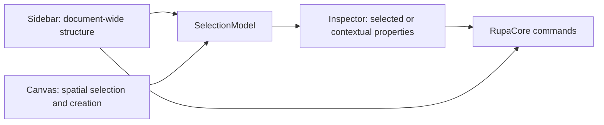

| Surface | Scope | Required content | Allowed actions |
|---|---|---|---|
| Sidebar / Scenes | Document-wide object hierarchy | Root scene nodes, child scene nodes, node kind, visibility, lock state | Select scene node, toggle visibility, toggle lock |
| Sidebar / Component Definitions | Reusable component sources | Definition name and referenced root count | Inspect definition identity; later open definition editing |
| Sidebar / Component Instances | Placed component occurrences | Instance name, source definition, visibility, lock state | Toggle visibility, toggle lock; later select instance |
| Sidebar / Assets | Document-wide reusable assets | Materials, validation rules, export presets | Inspect asset identity; later open asset editors |
| Inspector / Document | Current document context | Name, document ID, source/display units, source feature count, scene-node count, generated body count, diagnostics, render invalidation state, and asset counts | Validate through toolbar; document mutation through explicit document commands |
| Inspector / Selection | Current selected scene node or selected scene-node set | Name, kind, scene-node ID, primary object, reference type, reference target, hierarchy parent, child count, descendant count, visibility, lock state, material assignment, and mixed values for multi-selection | Toggle visibility and lock for one or every selected object; assign or clear material through RupaCore commands |
| Inspector / Source Curve | Current selected sketch entity target | Curve kind, source feature, entity ID, resolved point coordinates, radius, arc start/end angles, spline control points, smooth/tangent spline constraint state, and available curve conversion actions | Move supported point handles, edit supported circle/arc parameters, expose spline control-point state, attach supported smooth, endpoint-to-line tangent, and endpoint-to-endpoint tangent constraints, and convert supported source lines to arcs or splines through RupaCore commands; point, radius, angle, spline control-point, supported line-to-spline migration, and supported spline-constraint mutation are command-backed for Inspector, selected viewport handles where present, Agent, and Automation |
| Inspector / Transform | Current selected node transform or shared transform state | Local transform summary, position X/Y/Z, transform scale X/Y/Z, custom-transform count, single-object matrix rows, reset control, and later typed rotation fields | Edit position and transform scale through paired TextField and Slider controls backed by `setSceneNodeTransform`; reset transform through `setSceneNodeTransform`; later edit decomposed rotation through typed commands |
| Inspector / Shape | Current selected Object type or selected compatible object set | Object type, source representation, generated representation, Center X/Y/Z, Size X/Y/Z, and type-specific properties such as Subdivisions, Corner, Extrusion, Bevel, Bevel Sides, Cylinder Top, Bottom, Sides, Angle, Caps, Hollow, stroke width, text content, text size, and font family | Edit supported object dimensions and type properties through paired TextField and Slider controls backed by typed RupaCore commands; show mixed values for multi-selection; keep unsupported kernel parameters read-only or disabled until backed by commands |
| Inspector / Viewport | Current viewport context | Projection, grid plane, and in-plane ruler state | Later edit camera/projection/grid settings |
| Inspector / Units and Ruler | Canvas measurement context | Display unit, ruler minor, major, and visible in-plane spans | Change display unit through `setDisplayUnit` without changing the current physical ruler distances; change ruler spacing and visible span through `setRulerConfiguration` or scale presets |

The Sidebar must not contain modeling tools. It answers what exists in the document, how it is organized, and what is globally visible or locked. The Inspector answers what is selected, what context is active, and which properties can be read or edited without changing the document hierarchy.

The Inspector has three explicit states:

| Selection state | Inspector content | Editing contract |
|---|---|---|
| No selected object | Canvas and document properties | Document identity, scene counts, evaluation/diagnostic state, asset counts, display unit, ruler spacing, visible span, grid/projection context, and later camera properties. |
| One selected object | Object properties | Name, kind, scene-node ID, reference target, hierarchy position, visibility, lock state, Object type Shape properties, transform position/scale, transform matrix summary, material, and object-specific parameters where available. |
| One selected source curve | Source curve properties | Curve kind, target identity, source feature, source entity ID, resolved coordinates, spline control points, supported point/radius/angle edit controls, and supported curve conversion controls. Edits route through source sketch entity commands; supported point-handle, radius-handle, angle-handle, and spline control-point edits route through Inspector, selected viewport handles, Agent, Automation, and Core command payloads. |
| Multiple selected objects | Shared object properties | Count, primary object, kind/reference/parent summaries, shared or mixed visibility and lock state, aggregate hierarchy counts, Shape properties common to the selected Object type or compatible property schema, shared transform position/scale, material assignment, and common editable properties. Edits apply to every selected object through RupaCore commands. Type-specific properties are shown only when all selected objects support that property. |

Editable numeric properties must pair a precise `TextField` with a `Slider`. The text field is the exact value entry path; the slider is the coarse adjustment path. Both controls write through the same command-backed property binding, use the active display unit where the value is a length, and must not mutate document state directly from SwiftUI view code.

Mixed multi-selection values follow the Figma-style convention:

| Property condition | Display | User edit behavior |
|---|---|---|
| All selected objects share the value | Show the value normally. | Editing changes that value on every selected object. |
| Selected objects have different values | Show `Mixed` or an indeterminate control state. | Entering a new text value, choosing a menu value, toggling a state, or dragging a slider assigns the new value to every selected object. |
| Property is not supported by every selected object | Hide it from the shared section or move it into type-specific subsections. | No partial mutation is allowed from the shared control. |
| Numeric value is mixed | Text field placeholder is `Mixed`; slider shows an inactive or neutral mixed state until the user provides a concrete value. | The first concrete value assigned from text or slider becomes the value for every selected object. |

### RupaRendering

RupaRendering owns the editor viewport. The initial implementation may use a SwiftUI Canvas for source-derived sketch/body previews, highlighting, selected-object affordances, direct hit testing, visible X/Y/Z axes, coordinate-aligned projected grid lines, in-plane ruler scale lines, and viewport-to-model coordinate mapping for click and drag gestures. The default viewport projection is isometric. Objects, grid lines, axes, hit testing, model coordinate mapping, and transform affordances must share one projection basis. Viewport pan and zoom are camera state and must feed the same layout used by drawing, grid generation, hit testing, hover, click-to-model mapping, and drag-to-model mapping. Selection hover and construction hover are separate concerns: selection hover highlights selectable objects, while construction hover during drawing tools highlights the hovered body face or the zero-coordinate field cell that will define the drawing plane. Canvas click and drag creation commands must consume that highlighted construction plane so generated sketches, source curves, surfaces, section planes, and solids are parallel to the indicated face or zero-coordinate field. Selected body transform affordances must show coordinate-volume vertices and face centers separately from move and rotation controls. The Axis Gizmo is an interactive viewport UI control: positive X/Y/Z nodes must be selectable independently of canvas picking, selection must be visible on the Gizmo, and selecting an axis rotates the viewport projection so the selected axis becomes the front-facing coordinate. The Gizmo center and explicit Isometric button reset the projection to the default isometric view. The explicit Reset button resets viewport pan and zoom without mutating model coordinates. Axis-driven projection changes are camera-orientation changes, not model-coordinate mutations, and must animate by interpolating the active projection basis from the current visible basis to the target basis. Axis-driven projection changes must feed the same interpolated projection basis into grid drawing, canvas axes, object projection, selected-object affordances, hit testing, hover mapping, click-to-model mapping, drag-to-model mapping, pan, and zoom. The Axis Gizmo control must remain above the canvas input surface in hit-testing order. X/Y/Z colors must be defined once and reused by Canvas axes, Axis Gizmo nodes, and transform affordances. Rulers must not be fixed to the viewport edge; they are part of the projected modeling plane and share the same basis as the grid. The coordinate mapper must support empty documents by deriving a model-space plane from the current ruler and must preserve micrometer-to-meter scale behavior. The production viewport target remains a Metal-based renderer with camera navigation, GPU mesh buffers, and an offscreen selection identity buffer.

| File | Responsibility |
|---|---|
| `Viewport.swift` | Initial SwiftUI Canvas viewport drawing, axis and coordinate-grid hosting, selection highlighting, click-to-hit and click-to-model bridge, drag-to-model bridge, and camera navigation state ownership. |
| `ViewportCamera.swift` | Viewport pan and zoom state shared by rendering layout, hit testing, and model coordinate mapping. |
| `ViewportInputSurface.swift` | macOS input bridge for click, drag, hover, scroll pan, mouse-wheel zoom, and trackpad magnification. |
| `ViewportProjectionBasis.swift` | Shared viewport projection basis; default mode is isometric. |
| `ViewportCoordinateAxis+Style.swift` | Shared X/Y/Z labels and colors used by Canvas axes, Axis Gizmo, and transform affordances. |
| `ViewportProjectedGrid.swift` | Unit-aware projected coordinate-grid and in-plane ruler line calculation. |
| `ViewportScene.swift` | Source-derived viewport scene extraction, projection/unprojection layout, model coordinate mapping, and initial hit testing for selectable sketch/body previews. |
| `MetalViewport.swift` | SwiftUI/AppKit bridge for the viewport. |
| `MetalCADRenderer.swift` | Metal renderer lifecycle and draw loop. |
| `RenderScene.swift` | Renderable derived scene state. |
| `RenderSceneBuilder.swift` | Conversion from evaluated document state to render scene. |
| `MeshBufferCache.swift` | GPU buffer cache keyed by evaluated source generation. |
| `SelectionIDBuffer.swift` | Offscreen selection identity rendering. |
| `CADCamera.swift` | Camera state, projection, and navigation. |

RupaRendering consumes evaluated document state and selection state. It does not own CAD source.

### RupaPreview

RupaPreview owns non-editor preview surfaces.

| File | Responsibility |
|---|---|
| `RealityKitPreview.swift` | RealityKit-based preview surface. |
| `QuickLookPreview.swift` | Quick Look integration. |
| `USDZPreviewService.swift` | USDZ preview generation and handoff. |

RupaPreview is for preview and AR workflows, not primary document mutation.

### RupaAutomation

RupaAutomation defines the stable machine-facing command contract.

| Type | Responsibility |
|---|---|
| `AutomationCommand` | Codable command enum for supported operations. |
| `AutomationBatch` | Ordered command collection with execution options. |
| `AutomationResult` | Structured success or failure result. |
| `AutomationError` | Serializable typed errors. |
| `BatchExecutor` | Applies command batches through RupaCore. |
| `ReferenceResolver` | Resolves stable user and agent references into document objects. |
| `AgentSchema` | Versioned machine-readable schema. |

Automation command execution always routes into RupaCore. Initial automation coverage includes document description, display unit changes, rename, parameter upsert, parameter deletion, component definition creation, component instance creation, scene/component visibility, lock, and local transform state changes, validation, line sketch creation, circle sketch creation, arc sketch creation, spline sketch creation, rectangle sketch creation, selected source-line, connected open source line-chain, open source arc, connected open line/arc chain, and sampled open spline Slot profile creation, source line/arc sketch vertex offset through `offsetSketchVertex` and through `offsetCurve` payloads that include a source line or arc endpoint `vertexHandle`, generated body vertex Offset Vertex dispatch through `offsetCurve` for normal extrudes that resolve to connected source line/arc endpoints, profile extrude including closed spline and Slot profiles, extruded rectangle creation, extruded circle creation, saved construction-plane description, saved construction-plane creation, saved construction-plane rename, view-aligned construction-plane creation from explicit origin and view normal, active construction-plane switching, construction-plane creation from generated Face, source Region, generated Face+Edge perpendicular, parallel normal-separated Face/Region midplane, generated vertex, and source point sketch-entity targets, editable rectangle-extrude face offset, editable cylinder side/depth face offset, vertical-edge fillet/chamfer, generated-edge re-chamfer on closed line-loop and supported line+arc profile corners with endpoint-direction-preserving arc traversal, generated-edge re-fillet on closed line-loop profiles and supported line-line, line-arc, arc-line, and arc-arc corners in line+arc profiles, rectangle profile corner vertex move, source sketch entity point/radius/angle edits with fixed-aware point-reference propagation, spline control-point edits, smooth internal spline-knot constraint solving, spline endpoint-to-line tangent solving, tangent spline endpoint solving, ordered same-sketch `alignSketchVertex` G0/G1/G2 endpoint alignment for supported point-backed source targets, initial affected-line angle propagation, equal-length line propagation, initial line-to-circle/arc tangent propagation, circular concentric center propagation, and equal-radius circular propagation for supported constraints, source sketch entity dimension edits including fixed-aware constrained rectangle side propagation and arc-span angle dimensions, persistent selection dimension creation, target update, source line length target application, fixed-aware source same-plane point-to-point distance target application including standalone sketch point entities, fixed-first fallback to a second movable point, source same-plane point-to-whole-source-line closest finite-segment distance target application for non-arc source points or fixed-point/movable-line pairs, valid arc endpoint distance solutions, and spline control-point distance solutions, source circle/arc radius target application, source line relative angle target application, source arc span angle target application, supported generated opposing editable body face-pair distance target application through `setObjectDimension`, and removal between measurable topology or sketch targets, and source line-to-arc conversion.

Surface automation coverage also includes direct B-spline surface source creation, Surface CV moves and slides, CV weight edits, knot value edits, shape-preserving knot insertion, fraction-based `splitSurfaceSpan`, explicit knot multiplicity edits, compatible G0/G1/G2 boundary matching, surface-frame display, and surface-control-point display through the same RupaCore command path.

### RupaAgent

RupaAgent coordinates the running app and command-line clients.

| Type | Responsibility |
|---|---|
| `AgentCommandController` | Handles decoded agent requests, exposes capabilities, resolves sessions, and dispatches commands. |
| `MainActorAgentBridge` | Routes app-hosted agent requests to UI-owned sessions on MainActor. |
| `AgentSocketListener` | Owns Unix domain socket lifecycle and routes socket requests into the agent service. |
| `AgentSocketService` | Serializes socket request handling and dispatches decoded requests to the in-memory command controller or MainActor app bridge. |
| `AgentClient` | Connects from CLI, checks status, lists sessions, applies commands. |
| `AgentClientProtocol` | Provides a testable boundary for in-memory and socket-backed clients. |
| `AgentMessage` | Request, response, error, and session summary envelopes. |
| `AgentMessageCodec` | Encodes and decodes agent request and response payloads. |
| `AgentSocketAddress` | Builds Unix socket addresses for client and listener. |
| `AgentSocketIO` | Provides blocking read/write helpers for socket payloads. |
| `WorkspaceRegistry` | Registers, unregisters, and resolves open editor sessions. |
| `DocumentLock` | Prevents unsafe direct file mutation and validates generation. |
| `FileChangeBroadcaster` | Publishes file and session changes where needed. |

RupaAgent transports automation requests. It does not implement CAD commands.

### RupaCLIKit

RupaCLIKit provides the testable CLI command implementation used by the `rupa` executable.

| Type | Responsibility |
|---|---|
| `CLICommand.swift` | ArgumentParser command tree. |
| `CLIService.swift` | Testable CLI workflow implementation for file mode, live mode, status, sessions, and conflict checks. |
| `CLIResponses.swift` | Stable Codable response shapes for JSON output. |
| `CLIOutput.swift` | Human and JSON output formatting. |
| `ExitCode.swift` | Process exit code mapping. |

The CLI supports both human-readable output and stable JSON output.

### CLI Edit Modes

CLI document mutation commands use one shared mode model.

| Mode | Behavior |
|---|---|
| `auto` | Prefer a matching live session when an agent client is supplied; otherwise mutate the closed file path. |
| `file` | Mutate only the closed document file and reject matching open sessions unless forced. |
| `live` | Mutate only a running app session, resolved by explicit session ID or matching file path. |

`rename` exposes this mode model with `--mode`, while `rename-live` remains a compatibility command for direct live-session rename.

### RupaCLI

RupaCLI is a thin executable target.

| Type | Responsibility |
|---|---|
| `CLI.swift` | Executable entry point that starts `CLICommand`. |

## Document Session Model

An open Rupa document is represented by an `EditorSession`.

```mermaid
flowchart TD
    Workspace["WorkspaceRegistry"] --> Session["EditorSession"]
    Session --> Store["CADDocumentStore"]
    Session --> Stack["CommandStack"]
    Session --> Selection["SelectionModel"]
    Session --> Tools["ToolController"]
    Session --> Eval["EvaluationScheduler"]
    Eval --> Diagnostics["Diagnostics"]
    Eval --> Render["RenderScene update"]
```

### DocumentGeneration

Each document session carries a monotonically increasing generation.

```swift
public struct DocumentGeneration: Codable, Hashable, Sendable {
    public var value: UInt64
}
```

| Event | Generation rule |
|---|---|
| Successful source mutation | Increment. |
| Failed command validation | Preserve. |
| Evaluation after existing mutation | Preserve. |
| Undo or redo mutation | Increment. |
| Save without source change | Preserve. |

Generation is used by the app, renderer, agent, and CLI to detect stale assumptions.

## Workspace Registry

The app registers open sessions with `WorkspaceRegistry`.

```swift
@MainActor
public final class WorkspaceRegistry: ObservableObject {
    public private(set) var sessions: [DocumentSessionID: EditorSession]

    public func register(_ session: EditorSession)
    public func unregister(_ session: EditorSession)
    public func session(forDocumentURL url: URL) -> EditorSession?
}
```

Session summaries exposed to CLI include:

| Field | Meaning |
|---|---|
| `id` | Stable session identifier for the current app run. |
| `path` | Canonical document file URL path when file-backed. |
| `dirty` | Whether the session has unsaved changes. |
| `generation` | Current document generation. |
| `documentName` | Display name. |

### Document Identity

Open document matching uses a canonical document identity before falling back to path text.

| Identity signal | Role |
|---|---|
| Security-scoped bookmark or persistent file reference | Preferred identity for sandboxed app documents when available. |
| Canonical file URL | Primary path-based identity for CLI and app coordination. |
| File system file ID | Optional stronger same-file check on supported platforms. |
| Normalized path string | Fallback display and diagnostics value. |

`WorkspaceRegistry` is responsible for hiding these details from CLI commands. CLI callers provide a path or session ID; the agent resolves that input to an open `EditorSession`.

## CLI Modes

`rupa` supports explicit and automatic execution modes.

| Option | Behavior |
|---|---|
| `--auto` | Default. Use live mode when the target document is open in the app, otherwise file mode. |
| `--live` | Require a running app session for the target document. Fail if unavailable. |
| `--file` | Force headless file mode. Fail if the document is open in Rupa unless `--force` is provided. |
| `--force` | Allow a supported override of the normal safety check. |
| `--in-place` | Write mutation back to the input file in file mode. |
| `--output <path>` | Write mutation to a new output file in file mode. |
| `--dry-run` | Apply and evaluate without saving. |
| `--json` | Emit stable JSON output. |

### Mode Selection

```mermaid
flowchart TD
    Start["CLI command"] --> Mode{"Requested mode"}
    Mode --> Auto["--auto"]
    Mode --> Live["--live"]
    Mode --> File["--file"]
    Auto --> Detect["Check running app sessions"]
    Detect --> Open{"Target document open?"}
    Open -->|Yes| LiveFlow["Live app mode"]
    Open -->|No| FileFlow["File mode"]
    Live --> RequireSession["Require matching app session"]
    RequireSession --> LiveFlow
    File --> CheckOpen["Check open app session"]
    CheckOpen --> FileFlow
```

### File Mode

File mode edits a document without a running app session.

```mermaid
flowchart TD
    CLI["rupa CLI"] --> Load["Load .swcad"]
    Load --> Apply["Apply RupaCore command"]
    Apply --> Evaluate["Evaluate and validate"]
    Evaluate --> Output{"Save option"}
    Output --> InPlace["Atomic in-place write"]
    Output --> NewFile["Atomic output write"]
    Output --> DryRun["No write"]
    InPlace --> Result["AutomationResult"]
    NewFile --> Result
    DryRun --> Result
```

File mode requirements:

| Requirement | Contract |
|---|---|
| Loading | Parse and validate the Rupa package or a legacy Swift-CAD native package before mutation. |
| Mutation | Apply through RupaCore command execution. |
| Evaluation | Evaluate when requested by command options. |
| Writes | Use atomic writes for in-place and output-file saves. |
| Open document check | Refuse direct file mutation when the target is open in the app unless a supported forced path is selected. |

### Rupa Package Format

Rupa uses `.swcad` as the user-facing extension. New saves write a Rupa package with Swift-CAD source plus Rupa metadata. Existing Swift-CAD native packages remain loadable.

| Entry | Meaning |
|---|---|
| `manifest.json` | Package format, schema version, document path, Rupa metadata path, and document timestamps. |
| `document.json` | Swift-CAD `CADDocument` source. |
| `rupa.json` | Display unit, ruler configuration, and `ProductMetadata`. |

The file service must validate both the Swift-CAD source and the Rupa metadata after loading.

### Live App Mode

Live mode routes the command to the running app.

```mermaid
flowchart TD
    CLI["rupa CLI"] --> Client["AgentClient"]
    Client --> IPC["Unix domain socket"]
    IPC --> Listener["AgentSocketListener inside Rupa.app"]
    Listener --> Bridge["MainActorAgentBridge"]
    Bridge --> Controller["AgentCommandController"]
    Controller --> Registry["WorkspaceRegistry"]
    Registry --> Session["EditorSession"]
    Session --> Stack["CommandStack"]
    Stack --> Store["CADDocumentStore"]
    Store --> Eval["EvaluationScheduler"]
    Eval --> Render["RenderScene update"]
    Eval --> Result["AutomationResult"]
    Result --> Client
    Client --> Output["CLI output"]
```

Live mode requirements:

| Requirement | Contract |
|---|---|
| Session resolution | Resolve by canonical document URL or explicit session ID. |
| Mutation | Dispatch into the active `EditorSession`. |
| Undo and redo | Commands participate when the command supports it. |
| UI update | Evaluation snapshots and render invalidation publish through normal app state. |
| Dirty state | Successful unsaved mutations mark the document dirty. |
| Result | Return structured diagnostics, dirty state, generation, and document summary. |

## Agent IPC

The canonical external schema is maintained in [AUTOMATION_PROTOCOL.md](AUTOMATION_PROTOCOL.md).
This section summarizes the app-level transport and method surface.

### Transport

Initial implementation uses a local Unix domain socket.

| Field | Value |
|---|---|
| Transport | Unix domain socket |
| Message format | JSON-RPC style request and response envelopes |
| Runtime directory | Per-user application support or temporary runtime directory |
| Preferred socket path | `~/Library/Application Support/Rupa/Agent/rupa.sock` |
| Alternate socket path | `$TMPDIR/rupa-agent/rupa.sock` |

The package-level socket listener supports start, stop, stale socket replacement, malformed request recovery, and client/server round trips. App-hosted startup routes open document session mutation through `AgentHost` and `MainActorAgentBridge` so UI-owned `EditorSession` state is read and mutated on MainActor.

### Request Envelope

```json
{
  "jsonrpc": "2.0",
  "id": "request-id",
  "method": "command.apply",
  "params": {
    "sessionID": "open-session-id",
    "expectedGeneration": {
      "value": 42
    },
    "command": {
      "type": "setParameter",
      "name": "width",
      "expression": "50mm"
    }
  }
}
```

### Response Envelope

```json
{
  "jsonrpc": "2.0",
  "id": "request-id",
  "method": "command.apply",
  "result": {
    "message": "Parameter width updated.",
    "commandName": "setParameter",
    "generation": {
      "value": 43
    },
    "didMutate": true
  }
}
```

### Error Envelope

```json
{
  "jsonrpc": "2.0",
  "id": "request-id",
  "method": "command.apply",
  "error": {
    "code": "document.generationMismatch",
    "message": "The document has changed since the CLI command was prepared."
  }
}
```

## Agent Methods

| Method | Purpose |
|---|---|
| `agent.capabilities` | Return structured Agent capability descriptors. |
| `agent.status` | Return server status, socket path, and session count. |
| `agent.cadInteractionQualityAssessment` | Return the static CAD interaction quality assessment without requiring a session. |
| `sessions.list` | Return open document session summaries. |
| `command.apply` | Apply one automation command to an open session. |
| `parameter.setExpression` | Parse and apply a typed parameter expression to an open session. |
| `document.parameters` | Return all document parameters and diagnostics. |
| `document.save` | Save an open document through its app session. |
| `document.evaluate` | Evaluate an open document through its app session. |
| `document.measure` | Measure an open document through its app session without mutating source. |
| `selection.measure` | Measure a typed selection query without mutating source. |
| `snap.resolve` | Resolve a point against shared snapping rules and return ranked snap diagnostics. |
| `document.constructionPlaneSummary` | Summarize saved construction planes, linked construction scene nodes, and the active construction plane without mutating source. |
| `document.designDisplaySnapshot` | Return the Agent-visible display/source snapshot for the open document without mutating source. |
| `document.patternArraySummary` | Return source-owned pattern array summaries without mutating source. |
| `document.meshSummary` | Summarize generated meshes for an open document through its app session without mutating source. |
| `document.polySplineMeshAnalysis` | Preflight source meshes for supported PolySpline surface conversion and diagnostics. |
| `document.sketchEntitySummary` | Summarize source sketch entities and selection component IDs for an open document through its app session without mutating source. |
| `document.sketchDimensionSummary` | Return editable source sketch dimensions for selected sketch entities, generated cap edges, and supported generated arc edges without mutating source. Generated fillet arc edges resolve back to source arc radius candidates for Agent/UI readback, and supported normal-extrude line-arc-line source profile fillets can feed either those returned targets or the original generated Edge target into `setSketchEntityDimension` for source-profile re-trim. |
| `selection.dimensionEvaluation` | Evaluate an existing selection dimension without mutating source. |
| `document.curveAnalysis` | Return source curve and curvature diagnostics without mutating source. |
| `document.topologySummary` | Summarize Swift-CAD generated BRep topology and persistent names for an open document through its app session without mutating source. |
| `document.booleanEvaluationPlan` | Preflight a proposed standalone Boolean through the shared Swift-CAD evaluation contract, returning exact support diagnostics and generated topology slots without mutating source. |
| `document.objectDimensionSummary` | Return editable object dimension candidates for selected object, face including generated face-normal primary inference, generated depth-edge, or supported generated opposing face-pair targets without mutating source. |
| `document.surfaceSourceSummary` | Return source and generated surface references for Agent targeting without mutating source. |
| `document.surfaceAnalysis` | Sample generated B-spline faces for bounded UV points, oriented normals, analytic tangents, mean/Gaussian/U/V/principal curvature, principal directions, ordered trim-boundary points, and finite-difference surface curvature-comb diagnostics without mutating source. |
| `document.surfaceFrames` | Return evaluated UVN frame data for selected supported surface samples without mutating source; queries may address generated face IDs, face persistent names, `surfaceSourceSummary` face references with explicit UV, surface parameter references carrying UV, or Surface CV references resolved to Greville UV parameters. |
| `document.setSurfaceFrameDisplay` | Persist or hide a viewport-visible UVN frame display from a supported `SurfaceFrameQuery`, using the same validation and evaluation path as `document.surfaceFrames`. |
| `document.movePolySplineSurfaceVertex` | Move a selected generated PolySpline patch boundary vertex by mutating the owning source mesh vertex through the undoable command pipeline, rejecting unsupported targets or edits that change the selected patch boundary role. Selected viewport boundary-vertex center and global-axis handles route to the same command. |
| `document.surfaceContinuitySummary` | Summarize generated B-spline face adjacencies, shared persistent edges, G0/G1/G2 continuity status, and unresolved curvature-continuity requirements without mutating source. |
| `document.surfaceBoundaryContinuityCompatibility` | Preflight whether two source-owned direct B-spline trim boundary references can be matched at G0/G1/G2, returning pair-level diagnostics, maximum supported continuity, and recommended reference direction/match side without mutating source. |
| `selection.selectTargets` | Replace the open session selection with typed object or subobject targets without mutating CAD source. |
| `selection.selectReferences` | Replace the open session selection with typed Swift-CAD `SelectionReference` values, including source-owned Surface CV references returned by `surfaceSourceSummary`, without mutating CAD source. |
| `document.export` | Export an open document session to an exchange artifact without mutating source, using the same `ExportOptions` as file-mode CLI export. |

## Stable References

Automation references must remain stable enough for scripts and agents to target document objects across regeneration.

```mermaid
flowchart LR
    Input["CLI or agent reference"] --> Resolver["ReferenceResolver"]
    Resolver --> Persistent["Swift-CAD PersistentName"]
    Resolver --> Session["Session-local object ID"]
    Persistent --> Command["AutomationCommand target"]
    Session --> Command
```

| Reference kind | Contract |
|---|---|
| Parameter name | Resolves through the document parameter table. |
| Feature name or ID | Resolves through the design graph and command context. |
| Persistent topology name | Uses Swift-CAD persistent naming for generated topology. Subobject `SelectionComponentID` values use `generatedTopology:<persistentName>` and preserve semantic subshape roles where the evaluator provides them. |
| Sketch entity component ID | Uses `sketchEntity:<featureID>:<entityID>` for whole source sketch subobject selection, source-curve edit command targets, source dimension edit targets, and source line-to-arc conversion targets. Uses `sketchPointHandle:<featureID>:<entityID>:<handle>` for point, line endpoint, circle center, and arc center/start/end targets, and `sketchControlPoint:<featureID>:<entityID>:<index>` for source spline CV targets. |
| Session ID | Resolves through `WorkspaceRegistry` only for the current app run. |

`ReferenceResolver` owns user-facing and agent-facing lookup rules. RupaCore commands receive resolved typed references.

## Locking and Coordination

Rupa uses document locking to avoid app and CLI conflicts.

```mermaid
flowchart TD
    Request["CLI file mutation request"] --> Check["DocumentLock check"]
    Check --> Open{"Open in app?"}
    Open -->|Yes| Route["Route to live mode or fail"]
    Open -->|No| Acquire["Acquire file lock"]
    Acquire --> Mutate["Apply and write atomically"]
    Mutate --> Release["Release lock"]
```

| Requirement | Contract |
|---|---|
| Open document detection | `WorkspaceRegistry` exposes file-backed open sessions. |
| Direct mutation prevention | File mode refuses open documents by default. |
| Atomic writes | File mode writes to a temporary file and replaces the destination after success. |
| Dirty state | Live sessions expose unsaved state to CLI. |
| Generation validation | Requests may include `expectedGeneration`; mismatches fail before mutation. |
| Lock lifetime | Locks are acquired for the shortest safe mutation window. |

## CLI Commands

Currently implemented command groups:

| Command | Purpose |
|---|---|
| `rupa agent status` | Inspect the running Agent command service status. |
| `rupa sessions` | List open app sessions. |
| `rupa attach <document>` | Resolve and attach to an open file-backed document session. |
| `rupa attach --session <id>` | Resolve and attach to an open document session by session ID. |
| `rupa rename <document> --name <name>` | Rename a closed document file. |
| `rupa rename <document> --name <name> --dry-run` | Validate a file rename without saving. |
| `rupa rename <document> --name <name> --agent-socket <path>` | Refuse file mutation when the agent reports the same file as open. |
| `rupa rename-live <session-id> --name <name>` | Rename an open document through the running app session. |
| `rupa param set <document> <name> <value>` | Set a numeric length, angle, or scalar parameter literal. |
| `rupa param set <document> <name> --expression <formula>` | Set a parameter from a parsed formula using units, parameter references, arithmetic, parentheses, and basic trigonometric functions. |
| `rupa param delete <document> <name>` | Delete a parameter in file, live, or auto mode after dependency validation. |
| `rupa param list <document>` | List file or live-session parameters with resolved values and diagnostics. |
| `rupa plane create <document> --name <name> --plane <xy|yz|zx>` | Create a saved standard construction plane. |
| `rupa plane create-view <document> --name <name> --normal-x <value> --normal-y <value> --normal-z <value>` | Create a saved view-aligned construction plane from explicit origin and view normal. |
| `rupa plane create-target <document> --name <name> --target <json>` | Create a saved construction plane from one supported selection target. |
| `rupa plane create-targets <document> --name <name> --target <json> --target <json>` | Create a saved construction plane from multiple supported selection targets. |
| `rupa plane set-active <document> --id <uuid>` | Activate a saved construction plane. |
| `rupa plane rename <document> --id <uuid> --name <name>` | Rename a saved construction plane. |
| `rupa sketch line <document> --start-x <value> --start-y <value> --end-x <value> --end-y <value>` | Create a line sketch from numeric length literals. |
| `rupa sketch circle <document> --center-x <value> --center-y <value> --radius <value>` | Create a circle sketch from numeric length literals. |
| `rupa sketch rectangle <document> --width <value> --height <value>` | Create a closed rectangle sketch profile from numeric length literals. |
| `rupa sketch reverse <document> --target <json>` | Reverse a supported source sketch curve selected from sketch inspection. |
| `rupa sketch split <document> --target <json> --fraction <value>` | Split a supported source sketch curve at a scalar fraction. |
| `rupa sketch trim <document> --target <json>` | Trim a supported source sketch curve segment. |
| `rupa sketch extend <document> --target <json> --distance <value>` | Extend a supported source sketch curve endpoint target. |
| `rupa sketch join <document> --target <json> --adjacent-target <json>` | Join two supported same-sketch source curve targets through the shared Automation/Core command path. |
| `rupa sketch unjoin <document> --target <json>` | Restore a supported joined source sketch curve through the shared Automation/Core command path. |
| `rupa sketch slot <document> --target <json> --width <value>` | Create a Slot profile from a supported open source curve or chain. |
| `rupa sketch offset <document> --target <json> --distance <value>` | Route a supported source curve, region, generated face, generated edge, or vertex target through the Offset Curve dispatcher. |
| `rupa sketch offset-regions <document> --target <json> --distance <value>` | Offset one or more supported source profile region targets. |
| `rupa sketch corner-treatment <document> --target <json> --treatment <fillet|chamfer> --distance <value>` | Apply a supported source sketch corner fillet or chamfer. |
| `rupa sketch constraint-add <document> --feature-id <uuid> --constraint <json>` or `--kind <kind> [typed options]` | Add one supported sketch constraint through the shared Automation/Core command path. |
| `rupa sketch constraint-remove <document> --feature-id <uuid> --constraint <json>` or `--kind <kind> [typed options]` | Remove one existing sketch constraint through the shared Automation/Core command path. |
| `rupa sketch convert-line-to-arc <document> --target <json> --sagitta <value>` | Convert a supported source line into an arc while preserving the source entity target. |
| `rupa sketch convert-line-to-spline <document> --target <json>` | Convert a supported source line into a cubic spline while preserving the source entity target. |
| `rupa sketch insert-control-point <document> --target <json> --fraction <value>` | Insert a source spline control point at a scalar fraction. |
| `rupa sketch rebuild <document> --target <json> --method <points|refit|explicit-control>` | Rebuild a supported source sketch curve with typed rebuild options. |
| `rupa sketch cut <document> --target <json> --cutter <json>` | Cut a supported source sketch curve with another source curve. |
| `rupa sketch bridge <document> --feature-id <uuid> --first-endpoint <json> --second-endpoint <json>` | Create a bridge curve in an editable sketch feature with endpoint continuity control. |
| `rupa sketch bridge-update <document> --source-id <uuid>` | Update an existing bridge curve source endpoint or continuity contract. |
| `rupa sketch curvature-display <document> --target <json>` | Set or toggle source curve curvature-comb display. |
| `rupa sketch point-display <document> --target <json>` | Set or toggle source curve point display. |
| `rupa model box <document> --width <value> --height <value> --depth <value>` | Create an extruded rectangular body from numeric length literals. |
| `rupa model cylinder <document> --radius <value> --depth <value>` | Create an extruded circular body from numeric length literals. |
| `rupa model extrude <document> --profile-feature-id <id> --distance <value>` | Extrude an existing closed sketch profile by Feature ID. |
| `rupa model face-offset <document> --target <json> --distance <value>` | Offset a supported editable body face selected from topology inspection. |
| `rupa model edge-chamfer <document> --target <json> --distance <value>` | Chamfer one or more supported editable body edges. |
| `rupa model edge-fillet <document> --target <json> --radius <value>` | Fillet one or more supported editable body edges. |
| `rupa model vertex-move <document> --target <json> --delta-x <value> --delta-y <value>` | Move a supported editable body vertex in the source profile plane. |
| `rupa eval <document>` | Evaluate a file or matching live session and return generation-keyed diagnostics. |
| `rupa mesh <document>` | Summarize evaluated meshes for a file or matching live session and return body, vertex, triangle, bounds, and diagnostics. |
| `rupa measure <document>` | Measure a file or matching live session and return counts, bounds, profile area, solid volume, and diagnostics. |
| `rupa save <document>` | Save a closed document or matching live session without changing generation. |
| `rupa export <document> --output <path>` | Export a closed or live document to a Swift-CAD exchange format selected by output extension. |
| `rupa export <document> --output <path> --preset <name>` | Export using a named `ExportPreset` for format, output unit, and default destination policy. |
| `rupa export <document> --output <path> --destination-policy <policy>` | Override destination behavior with `prompt`, `overwrite`, or `versioned`. |
| `rupa selection references --session-id <id> --reference <json>` | Replace a live session selection with one or more Swift-CAD `SelectionReference` values. |
| `rupa selection references --session-id <id> --references-file <path>` | Replace a live session selection from a JSON file containing one `SelectionReference` or an array. |
| `rupa selection targets --session-id <id> --target <json>` | Replace a live session selection with one or more rendered `SelectionTarget` object or subobject values. |
| `rupa selection references --session-id <id> --clear` | Clear live selected references without mutating CAD source. |
| `rupa selection targets --session-id <id> --clear` | Clear live selected targets without mutating CAD source. |
| `rupa dimension sketch-summary <document> --target <json>` | Return editable source sketch dimension candidates for selected curve or generated cap-edge targets. |
| `rupa dimension object-summary <document> --target <json>` | Return editable object dimension candidates for selected body, face, or supported generated depth-edge targets. |
| `rupa dimension add-selection <document> --kind <distance\|angle> --first-target <json> --second-target <json> --target-value <value>` | Add a persistent CAD selection dimension between two measurable targets and return the created dimension ID. |
| `rupa dimension set-selection <document> --dimension-id <uuid> --kind <distance\|angle> --target-value <value>` | Update the target value of an existing persistent CAD selection dimension. |
| `rupa dimension apply-selection <document> --dimension-id <uuid>` | Apply the stored target of an existing persistent CAD selection dimension to supported source line length, fixed-aware source sketch point-to-point distance including standalone sketch point entities and fixed-first fallback to a second movable point, source sketch point-to-whole-source-line closest finite-segment distance, solved arc endpoint distance, spline control-point distance, source circle/arc radius, source line relative angle, source arc span, or generated opposing editable body face-pair distance targets. |
| `rupa dimension remove-selection <document> --dimension-id <uuid>` | Remove an existing persistent CAD selection dimension. |
| `rupa dimension set-sketch <document> --target <json>` | Update one supported source sketch dimension through the shared command pipeline. |
| `rupa dimension set-object <document> --target <json>` | Update one supported object dimension through the shared command pipeline. |
| `rupa surface sources <document>` | Return source-owned surface references, patch contracts, trim references, and editable Surface CV references for a file or live session. |
| `rupa surface move-control-point <document> --reference <json>` | Move one editable Surface CV selected by a Swift-CAD `SelectionReference`. |
| `rupa surface slide-control-points <document> --reference <json>` | Slide one or more editable Surface CV references along local U, V, or normal directions. |
| `rupa surface split-span <document> --reference <json> --fraction <value>` | Split one editable direct B-spline surface span at a normalized fraction by shape-preserving knot insertion. |
| `rupa surface set-knot-multiplicity <document> --reference <json> --multiplicity <value>` | Raise one editable direct B-spline internal knot to an explicit multiplicity by repeated shape-preserving knot insertion. |
| `rupa surface match-boundary-continuity <document> --target <json> --reference <json>` | Match compatible direct B-spline trim boundaries at G0/G1/G2 through source-owned control-row edits. |
| `rupa validate <document>` | Validate a closed document file. |

Required command groups:

| Command | Purpose |
|---|---|
| `rupa feature suppress <document> <feature>` | Suppress a feature. |
| `rupa eval <document>` | Evaluate a document. |
| `rupa save <document>` | Save a document. |
| `rupa batch --input <path>` | Execute a batch file. |

All mutating commands accept the relevant mode, save, dry-run, and JSON options.

### Undo and Batch Policy

| Command source | Undo contract |
|---|---|
| GUI command | Participates in undo and redo according to its command definition. |
| Live CLI command | Participates in the app undo stack when the command definition supports undo. |
| Live batch | Records either one batch undo unit or explicit per-command undo units according to batch options. |
| File mode command | Does not participate in app undo because no app session owns the mutation. |

The concrete batch grouping option is an open design detail, but live mode must not bypass the same undo-capable `CommandStack`.

## Automation Results

Every automation result includes enough information for humans, scripts, and agents.

| Field | Meaning |
|---|---|
| `success` | Whether the command or batch completed. |
| `mode` | `live`, `file`, or `dryRun`. |
| `document` | Document summary after execution when available. |
| `generationBefore` | Document generation before mutation when available. |
| `generationAfter` | Document generation after mutation when available. |
| `diagnostics` | Structured diagnostics emitted during validation or evaluation. |
| `evaluation` | Status, evaluated generation, render invalidation, and generated body count when available. |
| `outputs` | Written output paths or exported artifacts. |
| `error` | Typed error when execution failed. |

## Error Codes

Initial error code families:

| Code family | Meaning |
|---|---|
| `agent.unavailable` | No running Agent command service is available. |
| `agent.connectionFailed` | IPC connection failed. |
| `session.notFound` | No matching app session exists. |
| `document.openInApp` | File mode requested direct mutation of an open document. |
| `document.generationMismatch` | Expected generation does not match current generation. |
| `document.loadFailed` | The document could not be loaded. |
| `document.saveFailed` | The document could not be saved atomically. |
| `command.invalid` | The command payload is invalid. |
| `command.failed` | The command was valid but failed during application. |
| `reference.unresolved` | A document object reference could not be resolved. |
| `evaluation.failed` | Evaluation failed after mutation or dry run. |
| `export.failed` | Export failed. |

CLI exit codes map from these typed errors through `ExitCode`.

## Platform Notes

| Module | Platform note |
|---|---|
| `RupaCore` | Kept UI-free so it can be expanded beyond macOS later without changing document semantics. |
| `RupaUI` | Depends on SwiftUI and platform UI availability. |
| `RupaRendering` | Depends on Metal and platform view bridges. |
| `RupaPreview` | Depends on RealityKit, Quick Look, and USD tooling availability. |
| `RupaAgent` | Initial Unix domain socket implementation is macOS first. |
| `RupaCLIKit` | Testable CLI implementation. Commands that touch live sessions are macOS first through RupaAgent. |
| `RupaCLI` | macOS first. |

If package-wide iOS and visionOS platforms are declared, macOS-only targets and APIs must be guarded explicitly.

## Package.swift

```swift
// swift-tools-version: 6.3

import PackageDescription

let package = Package(
    name: "RupaKit",
    platforms: [
        .macOS("26.0")
    ],
    products: [
        .library(name: "RupaKit", targets: ["RupaKit"]),
        .library(name: "RupaCore", targets: ["RupaCore"]),
        .library(name: "RupaUI", targets: ["RupaUI"]),
        .library(name: "RupaRendering", targets: ["RupaRendering"]),
        .library(name: "RupaPreview", targets: ["RupaPreview"]),
        .library(name: "RupaAutomation", targets: ["RupaAutomation"]),
        .library(name: "RupaAgent", targets: ["RupaAgent"]),
        .library(name: "RupaCLIKit", targets: ["RupaCLIKit"]),
        .executable(name: "rupa", targets: ["RupaCLI"])
    ],
    dependencies: [
        .package(path: "../swift-CAD"),
        .package(url: "https://github.com/1amageek/mac-component", branch: "main"),
        .package(url: "https://github.com/apple/swift-argument-parser", from: "1.5.0"),
        .package(url: "https://github.com/apple/swift-collections", from: "1.1.0")
    ],
    targets: [
        .target(
            name: "RupaKit",
            dependencies: [
                "RupaCore",
                "RupaAutomation"
            ]
        ),
        .target(
            name: "RupaCore",
            dependencies: [
                .product(name: "SwiftCAD", package: "swift-CAD"),
                .product(name: "Collections", package: "swift-collections")
            ]
        ),
        .target(
            name: "RupaUI",
            dependencies: [
                "RupaCore",
                "RupaAgent",
                "RupaRendering",
                "RupaPreview",
                .product(name: "MacComponent", package: "mac-component")
            ]
        ),
        .target(
            name: "RupaRendering",
            dependencies: [
                "RupaCore",
                .product(name: "SwiftCAD", package: "swift-CAD")
            ]
        ),
        .target(
            name: "RupaPreview",
            dependencies: [
                "RupaCore"
            ]
        ),
        .target(
            name: "RupaAutomation",
            dependencies: [
                "RupaCore"
            ]
        ),
        .target(
            name: "RupaAgent",
            dependencies: [
                "RupaCore",
                "RupaAutomation"
            ]
        ),
        .target(
            name: "RupaCLIKit",
            dependencies: [
                "RupaCore",
                "RupaAutomation",
                "RupaAgent",
                .product(name: "ArgumentParser", package: "swift-argument-parser")
            ]
        ),
        .executableTarget(
            name: "RupaCLI",
            dependencies: [
                "RupaCLIKit"
            ]
        ),
        .testTarget(
            name: "RupaKitTests",
            dependencies: ["RupaKit"]
        ),
        .testTarget(
            name: "RupaCoreTests",
            dependencies: ["RupaCore"]
        ),
        .testTarget(
            name: "RupaAutomationTests",
            dependencies: ["RupaAutomation"]
        ),
        .testTarget(
            name: "RupaAgentTests",
            dependencies: ["RupaAgent"]
        ),
        .testTarget(
            name: "RupaCLITests",
            dependencies: ["RupaCLIKit"]
        ),
    ]
)
```

## Test Specification

RupaKit tests are split by module boundary.

| Test target | Required coverage |
|---|---|
| `RupaCoreTests` | Command pipeline, generation, undo/redo, parameters, formula parsing/listing, product metadata, package round trip, evaluation snapshots, render invalidation, file service contracts, and Core-owned canvas click/drag tool activation. |
| `RupaAutomationTests` | Codable schema, batch ordering, parameter mutation, reference resolution, result encoding. |
| `RupaAgentTests` | Message encoding, session resolution, generation mismatch, lock behavior, client/server lifecycle. |
| `RupaUIPackageTests` | App-level agent host lifecycle and MainActor-safe session publication. |
| `RupaRenderingTests` | Viewport scene extraction, projection/unprojection layout, model coordinate mapping, empty-document drag plane behavior, and source-derived hit testing. |
| `RupaCLITests` | Argument parsing, mode selection, file/live parameter workflows, JSON output, exit code mapping. |

Swift tests should be run through `xcodebuild test` with explicit timeouts when an Xcode workspace or project exists. Tests that touch shared files, sockets, or static state must use a shared serialization mechanism.

## Acceptance Criteria

Initial implementation is accepted when these behavior contracts pass.

| Scenario | Expected result |
|---|---|
| GUI parameter edit | Mutation goes through `CommandStack`, increments generation, evaluates, updates diagnostics, and invalidates rendering. |
| CLI parameter edit | `rupa param set` and `rupa param delete` mutate a closed file or live session through the same command path and generation checks. Parsed formulas validate references and cycles before mutation, and deletion rejects still-referenced parameters before mutation. |
| CLI file edit | Closed document loads, mutates through RupaCore, evaluates, and writes atomically. |
| CLI live edit | Open document resolves through `WorkspaceRegistry`, mutates in the app session, updates UI state, and returns JSON when requested. |
| Open document file conflict | `--file` refuses direct mutation of an open document unless a supported forced path is selected. |
| Generation mismatch | Request with stale `expectedGeneration` fails before mutation with `document.generationMismatch`. |
| Dry run | Command validates and evaluates without saving or incrementing persisted file state. |
| Product metadata persistence | Scene/component/material/validation/export/template metadata round-trips through `.swcad` and participates in undo/redo. |
| Sessions JSON | `rupa sessions --json` returns stable session summaries with ID, path, dirty state, generation, and display name. |
| Agent status | `rupa agent status --json` reports running state, socket path, and session count. |
| Stable reference failure | Unresolvable references fail with `reference.unresolved` and actionable diagnostics. |
| CLI dependency boundary | `RupaCLI` builds without importing `RupaUI` or the app target. |

## Implementation Phases

| Phase | Deliverable |
|---|---|
| 1 | Create `RupaKit` package skeleton, products, targets, and baseline tests. |
| 2 | Implement RupaCore session, document store, command stack, generation, and diagnostics. |
| 3 | Implement Automation command schema and batch executor against RupaCore. |
| 4 | Implement CLI file mode with atomic write and JSON output. |
| 5 | Implement WorkspaceRegistry, Agent messages, client/server lifecycle, and live mode dispatch. |
| 6 | Implement RupaUI root editor shell using RupaCore. |
| 7 | Implement Metal viewport bridge and render scene invalidation. |
| 8 | Implement MacComponent detail panes, export surfaces, app-host integration, and contextual properties in the MacComponent Inspector Pane. |
| 9 | Complete universal CAD acceptance use cases for video, 3D print, and architecture workflows without ApplicationProfile branching. |
| 10 | Add deferred ApplicationProfile switching as preset grouping over the completed universal CAD implementation. |

## Open Decisions

| Topic | Decision needed |
|---|---|
| Document format boundary | Confirm whether `.swcad` is a Rupa document package wrapping Swift-CAD source or a direct Swift-CAD native package extension. |
| App sandbox socket path | Validate the final socket location against sandbox and distribution requirements. |
| iPadOS and visionOS CLI exclusion | Decide whether `RupaCLI` is macOS-only in a separate package configuration or guarded in the shared package. |
| XPC migration | Decide the threshold for replacing Unix domain sockets with XPC. |
| Command schema versioning | Define compatibility policy before exposing automation as a public agent surface. |
| Force file mutation | Define the exact supported behavior for `--file --force` when the app has unsaved changes. |
| Batch undo grouping | Decide whether live batches default to one undo unit or per-command undo units. |
| Expected generation policy | Decide which commands require `expectedGeneration` and whether dry-run requires it. |
| Stable reference precedence | Define precedence when multiple reference forms match the same user input. |
| ApplicationProfile schema | Define the future schema only after generic validation rules, export presets, templates, unit defaults, and UI layout settings are stable. |
