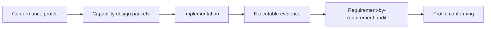

# Rupa Specification Authority

## Purpose

This document defines which Rupa documents are normative, how conflicts are
resolved, and which artifact may claim that a release or capability is
complete. It prevents plans, status notes, and partial implementations from
silently redefining product requirements.

## Authority Order

The documents below have a strict order. A lower level may refine a higher
level, but it must not broaden release scope, weaken an invariant, or redefine a
completed capability.

| Level | Authority | Responsibility |
|---:|---|---|
| 1 | Versioned conformance manifests governed by `CONFORMANCE_MANIFEST_CONTRACT.md`; `CONFORMANCE_PROFILES.md` is their human catalog | Define the exact capability, case-set, workflow, fixture, compatibility, and evidence set required by each releasable claim. This is the only release-completion authority. |
| 2 | `GOAL_STATEMENT.md`, `PRODUCT_REQUIREMENTS.md`, and `UNIVERSAL_CAD_REQUIREMENTS.md` | Define product outcomes and universal CAD behavior. They do not decide whether every future domain is required by one release. |
| 3 | `STATE_AND_PROJECT_CONTRACT.md`, `DOCUMENT_PACKAGE_CONTRACT.md`, `DOMAIN_EXTENSION_ARCHITECTURE.md`, `UNIVERSAL_3D_ARCHITECTURE.md`, `REFERENCE_ARTIFACT_CONTRACT.md`, `DOMAIN_TRANSACTION_CONTRACT.md`, `VALIDATION_CONTRACT.md`, and `AUTOMATION_PROTOCOL.md` | Define state lifetime, dependency, ownership, package, identity, transaction, validation, protocol, universal 3D evaluation, and derived-artifact invariants. |
| 4 | Capability design packets required by `DESIGN_PROCESS.md` and implementation designs such as `DOMAIN_FOUNDATION_DESIGN.md` | Define one capability's supported case set, mappings, rejected cases, diagnostics, performance budget, selected implementation route, and module-level realization. |
| 5 | `ACCEPTANCE_WORKFLOW_CONTRACTS.md` plus executable fixtures | Prove profile conformance through user workflows and machine-verifiable evidence. |

The following documents are informative or operational. They never create a
requirement and never prove completion by themselves.

| Document | Role |
|---|---|
| `COMPLETE_IMPLEMENTATION_PLAN.md` | Dependency-ordered roadmap and work scheduling. It cannot add completion gates. |
| `UNIVERSAL_3D_IMPLEMENTATION_PLAN.md` | Detailed work packages and integration scheduling for the universal 3D architecture. It cannot prove capability or release completion. |
| `CAPABILITY_LEDGER.md` | Projection of current evidence and missing gates. |
| `IMPLEMENTATION_STATUS.md` | Historical implementation observations. |
| `CAD_QUALITY_MILESTONES.md` | Quality planning and evidence index. |
| `SPEC.md` | Current package and implementation organization that is subordinate to the contracts above. Statements about current support are observations, not requirements. |

## Completion Rules

A capability is complete only when all requirements named by its versioned case
set and design packet have current evidence records. A conformance manifest is
complete only when every required capability and workflow passes its deterministic
evidence audit. The overall product vision remains open-ended; it does not prevent
a fully conforming manifest from being released.

The following are not completion evidence:

- a type or command compiling;
- one successful narrow test;
- a handwritten ledger rating or test-path string without a current evidence record;
- an unsupported case returning a warning;
- a roadmap milestone marked complete without its acceptance fixture;
- a UI control that cannot perform the same operation through Agent and CLI
  where the capability contract requires those surfaces.

## Conflict Resolution

When documents disagree, apply this procedure before implementation continues:

1. Identify the affected conformance manifest.
2. Preserve higher-level product outcomes and architecture invariants.
3. Update or create the capability design packet with the resolved case set.
4. Update subordinate plans, ledgers, and status notes.
5. Implement only after the selected route and required evidence are explicit.

Unresolved conflicts are blocking specification defects. Implementations must
not choose a behavior implicitly and then treat that behavior as the decision.

## Normative Language

| Term | Meaning |
|---|---|
| Must | Required for the named profile or contract. |
| Must not | Violates the named profile or architecture invariant. |
| Should | Preferred behavior; deviations require a decision record. |
| May | Optional behavior that must not change required semantics. |
| Unsupported | Deliberately unavailable and returned as a typed result. |
| Experimental | Implemented without production conformance evidence. |
| Conforming | All declared requirements and evidence gates pass. |

## Development Compatibility Policy

Rupa is under active development. Correct source, reference, transaction, and
document semantics take priority over compatibility with unreleased schemas.
Deprecated aliases and migration shims must not be added merely to preserve an
incorrect development contract.

Before a conformance manifest is released, that manifest must freeze and document
the following independently:

- `.swcad` package schema compatibility;
- public Agent and CLI protocol compatibility;
- domain semantic namespace compatibility;
- import and export format fidelity;
- derived artifact cache compatibility.

Breaking one schema does not imply that all other schemas share its version or
migration policy.
