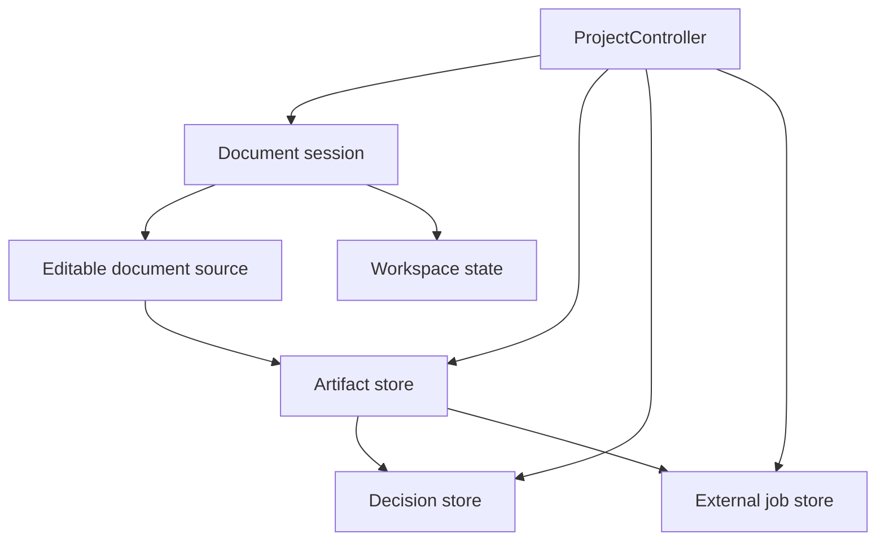
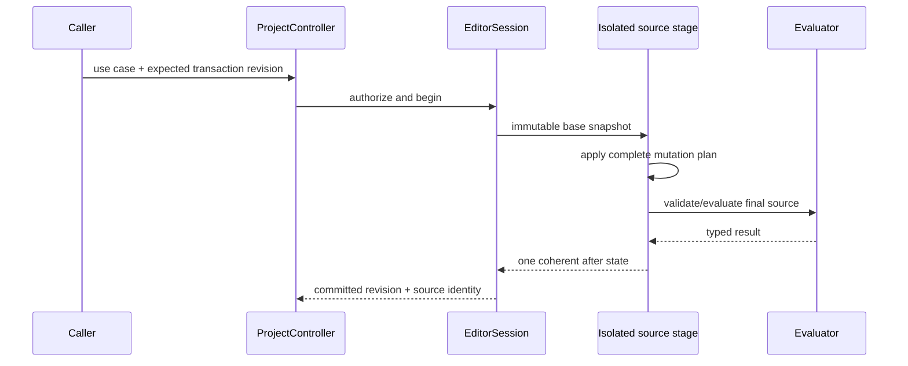

# Rupa State and Project Contract

## Purpose

This document defines the lifetime, ownership, revision, and mutation boundaries
for editable document source, open-workspace state, derived artifacts, validation
decisions, and external jobs. It is the normative state-management contract for
RupaCore, domain modules, UI, CLI, Agent adapters, file services, and project
orchestration.

## State Partitions

Rupa uses one `.swcad` document type, but one document type does not imply one
state lifetime.

| Partition | Examples | Mutation owner | Undo/history | Freshness role |
|---|---|---|---|---|
| Editable document source | CAD features, parameters, semantic intent, materials, document annotations, saved views, validation configurations, export presets | `EditorSession` through source commands | Source command history | Fingerprinted as declared artifact dependencies |
| Workspace state | Selection, active tool, hover, active construction plane, viewport camera, visual grid mode, transient analysis displays, panel layout | Open document session | Separate workspace history when needed; never source undo | Never changes source-content identity |
| Derived artifacts | Evaluated B-rep, mesh, drawing, validation result, exchange output, solver input/result | Artifact producer through `ProjectController` | Immutable records, cache retention policy | Identified by input dependencies, producer/configuration, and output content |
| Validation decisions | Allow/block/override records for a policy evaluation and prepared output | Decision recorder through `ProjectController` | Immutable append/revoke audit log | Bound to exact policy, findings, inputs, and prepared artifact |
| External jobs | Solver/export/import job state, logs, progress, cancellation, temporary files | Effect-specific project service | Job event history | Bound to exact input and produced artifacts |
| User/application preferences | Default panels, default workspace preset, recent files, accessibility preferences | Application preference service | No document history | Not part of `.swcad` source |
| Template definitions | Inputs used to create a new source document | Template catalog | Versioned template history | Applied values become normal source or workspace values |

Presentation state may be captured deliberately inside a saved view or drawing
definition. That captured definition is document source. The currently active
camera, panel, grid, or construction plane remains workspace state until an
explicit source command saves it.

## ProjectController Boundary

`ProjectController` is an application use-case coordinator. It is not an Agent,
transport server, geometry kernel, domain rule provider, or SwiftUI view model.

| Owns | Does not own |
|---|---|
| Open document session registration and ordered access | CAD geometry semantics |
| Document package load/save coordination | Concrete domain rules |
| Artifact lookup, retention, and publication | UI layout and rendering |
| Validation decision recording and authorization | JSON-RPC, socket, CLI, or MCP encoding |
| Prepare/commit coordination for exports and external jobs | Mutation implementations hidden from `EditorSession` |
| Caller principal and project policy context | Fabricated caller identity or timestamps supplied by clients |

UI, CLI, JSON-RPC, MCP, and Agent integrations are adapters over the same project
use cases. Transport adapters may correlate requests but must not own sessions,
artifact lifetime, validation authorization, or domain semantics.

## Revisions and Identities

Three concepts are intentionally separate.

| Concept | Meaning | Comparison rule |
|---|---|---|
| `DocumentTransactionRevision` | Monotonic revision of committed source transactions in one open session; used for optimistic concurrency and observation ordering | Exact equality only inside the owning session |
| `DocumentContentIdentity` | Persistent identity of canonical editable source content | Content fingerprint equality across reload, undo restoration, and branches |
| `SourceDependencySetIdentity` | Canonical identity of only the source/external inputs consumed by one computation | Exact logical dependency and content fingerprint equality |

A transaction revision is provenance, not content identity. Reloading the same
document, restoring an old branch, or reproducing identical source may change the
session revision without changing content. Conversely, a new session may start at
the same numeric revision with different content. Artifact freshness must never be
decided from the transaction revision alone.

## Source Transactions

A successful source transaction has one before state, one after state, one undo
entry, and one transaction-revision increment, regardless of how many internal
universal commands or semantic mutations it contains.

Internal command count is not observable revision count. Failed staging publishes
nothing and does not consume a revision.

## Workspace Mutations

Workspace mutations do not change editable source, dirty state, source undo, or
document transaction revision. They publish one coherent workspace snapshot.
Operations such as saving a view, saving a construction plane as a source
definition, or creating a drawing annotation are explicit source commands and are
not inferred from transient workspace state.

## Effect Classification

Every public capability declares one primary effect.

| Effect | Execution boundary |
|---|---|
| Query | Immutable session/source/artifact snapshot |
| Source mutation | Isolated source transaction |
| Workspace mutation | Workspace-state transaction |
| Artifact generation | Artifact producer and store |
| Export | Prepared artifact plus atomic destination publication |
| External job | Managed job service with progress/cancellation/cleanup |
| Decision recording | Authorized immutable audit record |

An effect cannot be implemented by temporarily using another effect and restoring
state afterward. In particular, dry run does not commit then undo, export is not an
editor command, and validation override recording is not a product-metadata edit.

## Concurrency and Snapshot Rules

- Ordered session mutations run through the owning project/session isolation
  boundary.
- Long evaluation, validation, import, export, and simulation work receives an
  immutable input snapshot and does not retain mutable session access.
- The commit step rechecks the expected transaction revision and declared source
  dependencies before publication.
- Cancellation cleans temporary artifacts and never publishes partial source,
  artifacts, decisions, or destinations.
- Large geometry is borrowed from immutable evaluated snapshots or shared buffers
  with an explicit lifetime. A process boundary copy is measured rather than
  described as zero-copy.

## Required Tests

| Test family | Required cases |
|---|---|
| Partition | Workspace-only edits do not change source identity, dirty state, source history, or source revision. |
| Revision | Multi-command source transactions increment exactly once; failure increments zero times. |
| Reload | Identical source content receives the same content identity even when session revisions differ. |
| Project | UI, CLI, and Agent adapters address the same registered session and project services. |
| Effect | Query, source, workspace, artifact, export, job, and decision effects cannot execute through an incompatible context. |
| Concurrency | Stale revision and stale dependency failures happen before publication. |
| Performance | Snapshot creation and heavy-result transport meet declared copy and memory budgets. |
